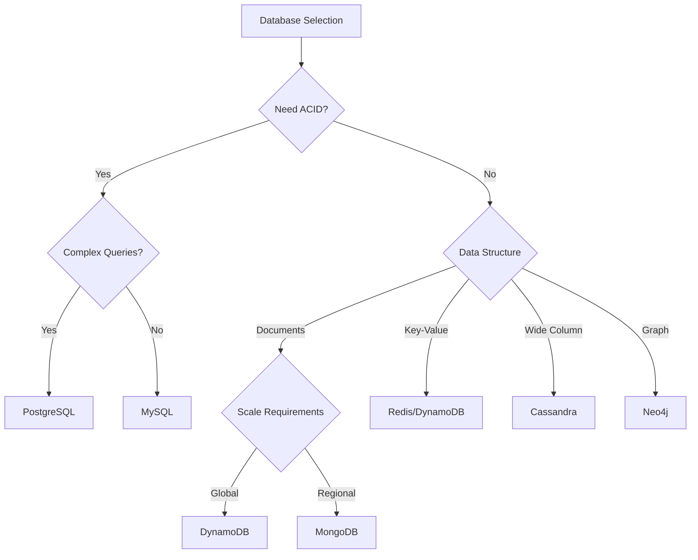
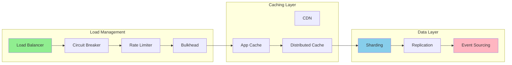

# AI-Friendly Content Structure Guide

## Transforming Prose into Structured Data

### Before: Wall of Text ❌
"When choosing between SQL and NoSQL databases, there are many factors to consider. SQL databases like PostgreSQL and MySQL are great for structured data and complex queries, offering ACID compliance and strong consistency. They work well for applications that need transactions and complex joins. However, they can be harder to scale horizontally. NoSQL databases like MongoDB and DynamoDB are better for unstructured data and can scale more easily, but they often sacrifice consistency for availability and partition tolerance. The choice depends on your specific use case, data model, consistency requirements, and scale needs."

### After: Structured Tables ✅

## Database Selection Matrix

| Criterion | SQL (PostgreSQL, MySQL) | NoSQL (MongoDB, DynamoDB) |
|-----------|------------------------|---------------------------|
| **Data Model** | Structured, Schema-defined | Flexible, Schema-less |
| **Consistency** | Strong (ACID) | Eventual (BASE) |
| **Scalability** | Vertical (limited horizontal) | Horizontal (built-in) |
| **Query Capability** | Complex (JOINs, aggregations) | Simple (key-value, document) |
| **Use Cases** | Financial systems, CRM, ERP | Real-time analytics, IoT, Social |
| **Performance** | Optimized for complex queries | Optimized for simple lookups |
| **Cost at Scale** | Higher (vertical scaling) | Lower (commodity hardware) |

## Decision Tree



## Structured Metadata Format

### Pattern Metadata Example

```yaml
pattern:
  name: "Database Sharding"
  category: "scaling"
  tier: "gold"
  complexity: "high"
  implementation_time: "2-4 weeks"
  
  when_to_use:
    - "Single database > 10TB"
    - "Write throughput > 10K/sec"
    - "Clear partition key exists"
    
  when_not_to_use:
    - "Need cross-shard transactions"
    - "Frequently changing access patterns"
    - "Dataset < 1TB"
    
  prerequisites:
    - "Identified shard key"
    - "No cross-shard joins required"
    - "Application supports shard routing"
    
  results:
    throughput_improvement: "10-100x"
    storage_capacity: "Unlimited"
    complexity_increase: "3x"
    operational_overhead: "High"
```

## Comparison Tables for Everything

### Before: Paragraph about caching strategies ❌
"There are several caching strategies. Cache-aside means the application manages the cache, reading from cache first and loading from database on miss. Write-through updates cache and database together. Write-behind updates cache immediately but database asynchronously. Read-through is like cache-aside but the cache loads missing data. Refresh-ahead proactively refreshes cache before expiration."

### After: Structured Comparison ✅

| Strategy | Read Path | Write Path | Consistency | Use When |
|----------|-----------|------------|-------------|----------|
| **Cache-Aside** | App checks cache → DB on miss | App updates DB → Invalidate cache | Eventual | Read-heavy, tolerate stale |
| **Write-Through** | Read from cache | Write to cache → Write to DB | Strong | Need consistency |
| **Write-Behind** | Read from cache | Write to cache → Async to DB | Eventual | Write-heavy, can lose data |
| **Read-Through** | Cache loads from DB | Direct to DB | Eventual | Simplify app logic |
| **Refresh-Ahead** | Proactive refresh | Direct to DB | Eventual | Predictable access patterns |

## Structured Problem-Solution Format

### Before: Mixed narrative ❌
"Microservices can communicate in different ways. REST is simple but synchronous. gRPC is faster but more complex. Message queues decouple services but add latency. Event streaming enables real-time but requires more infrastructure."

### After: Problem-Solution Matrix ✅

| Communication Need | Solution | Pros | Cons | Example Use |
|-------------------|----------|------|------|-------------|
| **Simple request-response** | REST | Universal, Simple | Synchronous, Slower | CRUD operations |
| **High-performance RPC** | gRPC | Fast, Type-safe | Complex, Less tooling | Internal services |
| **Async processing** | Message Queue | Decoupled, Reliable | Latency, Complexity | Order processing |
| **Real-time updates** | WebSocket | Low latency, Bidirectional | Stateful, Complex | Chat, Live feeds |
| **Event distribution** | Event Streaming | Scalable, Replay | Infrastructure, Eventual | Analytics, CQRS |

## Quantitative Comparisons

### Before: Vague performance claims ❌
"System A is faster than System B for most workloads. System C scales better but costs more."

### After: Concrete metrics ✅

| System | Throughput | Latency (p99) | Cost/Month | Scale Limit | Setup Time |
|--------|------------|---------------|------------|-------------|------------|
| **Monolith** | 1K RPS | 50ms | $500 | 10K users | 1 week |
| **Microservices** | 10K RPS | 100ms | $5,000 | 1M users | 8 weeks |
| **Serverless** | 100K RPS | 200ms | $0-50,000 | Unlimited | 2 weeks |
| **Edge Computing** | 1M RPS | 10ms | $20,000 | Unlimited | 12 weeks |

## Implementation Readiness Checklists

### Before: Paragraph of considerations ❌
"Before implementing service mesh, ensure you have containerization, understand the complexity, have monitoring in place, and your team is trained."

### After: Actionable checklist ✅

### Service Mesh Readiness

| Requirement | Status | Details | Action If Missing |
|-------------|--------|---------|-------------------|
| **Containerization** | ⬜ | All services in containers | Containerize first |
| **Service Count** | ⬜ | >10 microservices | Consider simpler solutions |
| **Team Skills** | ⬜ | Kubernetes experience | Training required |
| **Monitoring** | ⬜ | Distributed tracing ready | Setup Jaeger/Zipkin |
| **Traffic Volume** | ⬜ | >1000 RPS inter-service | May not need complexity |
| **Compliance Needs** | ⬜ | mTLS required | Strong justification |

## Architecture Decision Records (ADR)

### Structured ADR Template

```markdown
# ADR-001: Adopt Event Streaming for Order Processing

## Status
Accepted (2024-01-15)

## Context
| Factor | Current State | Desired State |
|--------|--------------|---------------|
| Order Volume | 1K/day | 100K/day |
| Processing Time | 5 minutes | <30 seconds |
| System Coupling | Tight (sync calls) | Loose (async) |
| Failure Recovery | Manual | Automatic |

## Decision
Implement Apache Kafka for order event streaming

## Consequences

### Positive
| Impact | Measurement | Timeline |
|--------|-------------|----------|
| Scalability | 100x throughput | Immediate |
| Resilience | Auto-retry, replay | 1 month |
| Analytics | Real-time insights | 2 months |

### Negative
| Impact | Mitigation | Acceptable? |
|--------|------------|-------------|
| Complexity | Team training | Yes |
| Latency | +50ms average | Yes |
| Operational | Kafka cluster management | Yes |
```

## Pattern Relationship Mappings

### Visual Pattern Relationships



### Compatibility Matrix

| Pattern | Works Well With | Conflicts With | Complexity Added |
|---------|-----------------|----------------|------------------|
| **Circuit Breaker** | Retry, Timeout, Bulkhead | None | Low |
| **Sharding** | Consistent Hashing, Read Replicas | Cross-shard transactions | High |
| **Event Sourcing** | CQRS, Saga | CRUD updates | High |
| **Service Mesh** | Circuit Breaker, Load Balancing | Monolith | Very High |

## Migration Paths as Tables

### Database Migration Options

| From | To | Method | Downtime | Risk | Duration |
|------|----|--------|----------|------|----------|
| **Single PostgreSQL** | Sharded PostgreSQL | Dual writes | Zero | Medium | 3 months |
| **PostgreSQL** | DynamoDB | CDC + Batch | Minutes | High | 6 months |
| **MongoDB** | Cassandra | ETL Pipeline | Hours | Medium | 4 months |
| **MySQL** | Aurora | Native Migration | Minutes | Low | 1 month |

## Quick Reference Cards

### Scalability Quick Wins

| Bottleneck | Quick Fix | Time | Long-term Solution |
|------------|-----------|------|-------------------|
| **Database CPU** | Add read replicas | 1 hour | Sharding |
| **API Gateway** | Increase instances | 30 min | Service mesh |
| **Memory pressure** | Add Redis cache | 2 hours | Optimize queries |
| **Network latency** | Enable compression | 1 hour | Edge caching |
| **Storage IOPS** | Upgrade disk type | 1 hour | Distributed storage |

---

<div class="admonition tip">
<p class="admonition-title">AI Integration Tip</p>
<p>Structure your content this way to enable:
- LLM-powered search and Q&A
- Automated documentation generation  
- Pattern recommendation engines
- Architecture validation tools
</p>
</div>