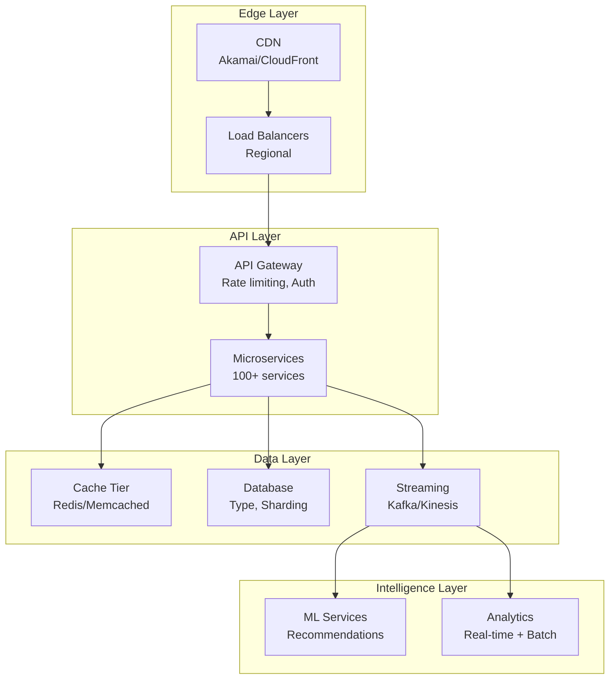
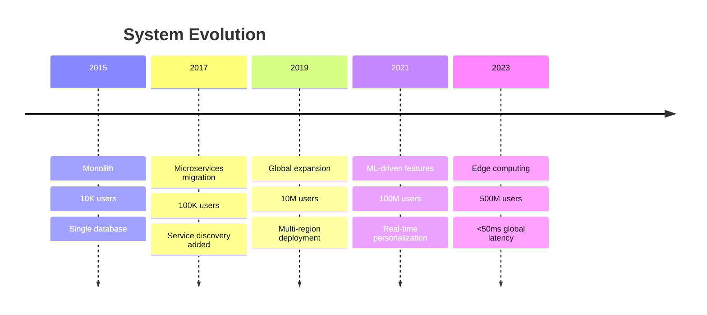

# [Company] [System Name] Architecture

## At a Glance

| Metric | Value | Context |
|--------|-------|---------|
| **Scale** | X users/requests | Growth rate, peak loads |
| **Data Volume** | X TB/PB | Daily growth, retention |
| **Availability** | 99.X% | SLA requirements |
| **Latency** | Xms p50, Yms p99 | User-facing vs internal |
| **Team Size** | X engineers | Organization structure |
| **Timeline** | Started YYYY | Major milestones |

## The Challenge

**In 2-3 sentences, describe the core problem this system solves.**

Example: Netflix needed to stream video content to 200M+ subscribers globally with <100ms startup time while handling 10x traffic spikes during popular show releases.

## Architecture Overview



## Key Architectural Decisions

| Decision | Choice | Trade-offs | Impact |
|----------|--------|------------|--------|
| **Data Store** | NoSQL (Cassandra) | Consistency for availability | 99.99% uptime, eventual consistency |
| **Service Communication** | gRPC + Service Mesh | Complexity for observability | 50% latency reduction |
| **Caching Strategy** | Multi-tier (Edge + App) | Cost for performance | 90% cache hit rate |
| **Deployment** | Cell-based architecture | Operational complexity | Blast radius < 5% |

## Patterns Applied

| Pattern | Purpose | Implementation | Results |
|---------|---------|----------------|---------|
| [Circuit Breaker](/../pattern-library/resilience/circuit-breaker/index.md) | Prevent cascade failures | Hystrix → Resilience4j | 99.9% service availability |
| [CQRS](/../pattern-library/data-management/cqrs/index.md) | Read/write optimization | Separate read replicas | 10x read throughput |
| [Event Streaming](/../pattern-library/architecture/event-streaming/index.md) | Real-time processing | Kafka with 1000+ partitions | <100ms event processing |
| [Sharding](/../pattern-library/scaling/sharding/index.md) | Horizontal scaling | Hash-based on user_id | Linear scaling to 1B users |

## Evolution Timeline



## Operational Excellence

### Monitoring & Observability

| Layer | Tools | Key Metrics |
|-------|-------|-------------|
| **Infrastructure** | Prometheus + Grafana | CPU, Memory, Network, Disk |
| **Application** | Datadog APM | Request rate, Error rate, Latency |
| **Business** | Custom dashboards | Revenue, User engagement, Conversion |
| **Logs** | ELK Stack | Centralized logging, Real-time search |
| **Traces** | Jaeger | Distributed tracing, Dependency mapping |

### Incident Response

- **MTTR**: 15 minutes (P1 incidents)
- **On-call rotation**: 24/7 coverage, 1-week shifts
- **Runbooks**: 50+ automated responses
- **Post-mortems**: Blameless, published internally

## Lessons Learned

### What Worked Well ✅

1. **Pattern/Decision**: Specific technical choice
   - **Impact**: Measurable improvement
   - **Key insight**: Why it succeeded

2. **Pattern/Decision**: Another success
   - **Impact**: Quantified benefit
   - **Key insight**: Replicable learning

### What Didn't Work ❌

1. **Failed approach**: What was tried
   - **Problem**: Why it failed
   - **Solution**: How it was fixed
   - **Learning**: What to avoid

2. **Another failure**: Description
   - **Root cause**: Analysis
   - **Migration path**: How they moved away
   - **Cost**: Time/money/opportunity

## Try It Yourself

### Minimal Implementation (1 day)
```yaml
# docker-compose.yml for basic version
version: '3.8'
services:
  api:
    image: sample-api
    environment:
      - CACHE_ENABLED=true
  cache:
    image: redis:alpine
  db:
    image: postgres:13
```

### Learning Exercise
Build a simplified version focusing on one key pattern:
1. **Goal**: Implement [specific pattern] for [specific metric]
2. **Success criteria**: Achieve X improvement in Y
3. **Resources**: Links to implementation guides

## Deep Dives

- 📊 [Performance Analysis](/case-study-name/performance-deep-dive/index.md) - Detailed latency breakdown
- 🔧 [Implementation Details](/case-study-name/implementation/index.md) - Code examples, configurations
- 📈 [Scaling Journey](/case-study-name/scaling/index.md) - Step-by-step growth handling
- 🛡️ [Security Architecture](/case-study-name/security/index.md) - Zero-trust implementation
- 💰 [Cost Optimization](/case-study-name/cost/index.md) - 40% reduction strategies

## Related Content

### Similar Architectures
- [Company B's System] - Compared for [specific aspect]
- [Company C's System] - Alternative approach to [problem]

### Patterns to Explore
- [Pattern X] - Next logical evolution
- [Pattern Y] - Complementary approach
- [Pattern Z] - Modern alternative

### Further Reading
- [Original engineering blog post]
- [Conference talk video]
- [Open source components]

---

<div class="admonition info">
<p class="admonition-title">About This Case Study</p>
<p><strong>Last Updated</strong>: YYYY-MM-DD<br/>
<strong>Verified By</strong>: Engineering team interview/Public documentation<br/>
<strong>Confidence Level</strong>: High/Medium/Low based on source</p>
</div>