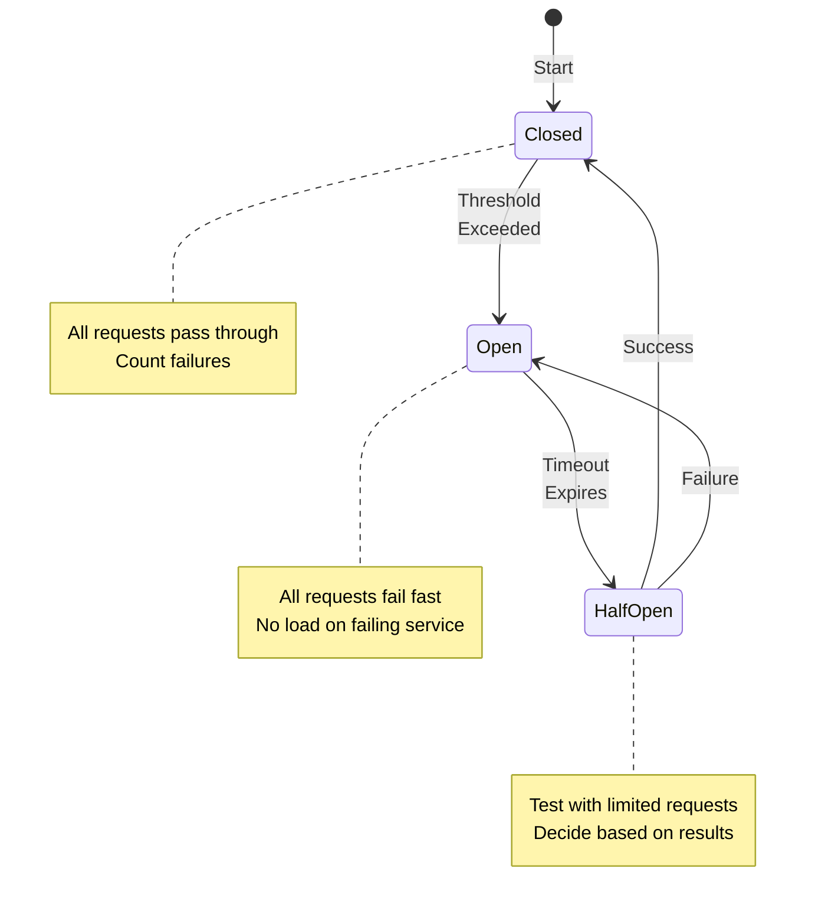

# Progressive Disclosure Pattern Example


## Overview

Progressive Disclosure Pattern Example

## Table of Contents

- [Example: Circuit Breaker Pattern Transformation](#example-circuit-breaker-pattern-transformation)
  - [Before: Monolithic 5000-word Page](#before-monolithic-5000-word-page)
  - [After: Progressive Disclosure Structure](#after-progressive-disclosure-structure)
    - [Main Page: `/. Circuit Breaker Pattern](#circuit-breaker-pattern)
- [The Problem (30 seconds)](#the-problem-30-seconds)
- [The Solution - Visual Overview](#the-solution-visual-overview)
- [Quick Decision Guide](#quick-decision-guide)
- [5-Minute Implementation](#5-minute-implementation)
- [Production Checklist](#production-checklist)
- [Learn More (Progressive Links)](#learn-more-progressive-links)
  - [Subpage 1: `/.

**Reading time:** ~3 minutes

## Table of Contents

- [Example: Circuit Breaker Pattern Transformation](#example-circuit-breaker-pattern-transformation)
  - [Before: Monolithic 5000-word Page](#before-monolithic-5000-word-page)
  - [After: Progressive Disclosure Structure](#after-progressive-disclosure-structure)
    - [Main Page: `/../pattern-library/resilience/circuit-breaker/index.md`](#main-page-pattern-libraryresiliencecircuit-breakerindexmd)
- [Circuit Breaker Pattern](#circuit-breaker-pattern)
- [The Problem (30 seconds)](#the-problem-30-seconds)
- [The Solution - Visual Overview](#the-solution-visual-overview)
- [Quick Decision Guide](#quick-decision-guide)
- [5-Minute Implementation](#5-minute-implementation)
- [Production Checklist](#production-checklist)
- [Learn More (Progressive Links)](#learn-more-progressive-links)
  - [Subpage 1: `/../pattern-library/resilience/circuit-breaker/configuration.md`](#subpage-1-pattern-libraryresiliencecircuit-breakerconfigurationmd)
- [Circuit Breaker Configuration Guide](#circuit-breaker-configuration-guide)
- [Threshold Configuration](#threshold-configuration)
- [Real-World Configurations](#real-world-configurations)
  - [High-Traffic API (1M+ RPM)](#high-traffic-api-1m-rpm)
  - [Payment Service (High Stakes)](#payment-service-high-stakes)
    - [Subpage 2: `/../pattern-library/resilience/circuit-breaker/mathematics.md`](#subpage-2-pattern-libraryresiliencecircuit-breakermathematicsmd)
- [Circuit Breaker Mathematics](#circuit-breaker-mathematics)
- [Failure Probability Models](#failure-probability-models)
  - [Basic Failure Rate Calculation](#basic-failure-rate-calculation)
  - [Statistical Significance](#statistical-significance)
  - [Progressive Disclosure Benefits](#progressive-disclosure-benefits)
  - [Implementation Checklist](#implementation-checklist)


## Example: Circuit Breaker Pattern Transformation

### Before: Monolithic 5000-word Page
❌ Everything on one page
❌ Overwhelming for beginners
❌ Hard to find specific information
❌ No clear learning path

### After: Progressive Disclosure Structure

#### Main Page: `/../pattern-library/resilience/circuit-breaker/index.md`

## Circuit Breaker Pattern

## The Problem (30 seconds)
When external services fail, your system shouldn't. Circuit breakers prevent cascade failures by monitoring service health and failing fast when problems are detected.

## The Solution - Visual Overview



## Quick Decision Guide

| Use Circuit Breaker When | Don't Use When |
|--------------------------|----------------|
| ✅ Calling external services | ❌ Internal method calls |
| ✅ Network calls that can fail | ❌ CPU-bound operations |
| ✅ Services with varying latency | ❌ Database transactions |
| ✅ Protecting against cascade failures | ❌ Retry is sufficient |

## 5-Minute Implementation

=== "Java (Spring)"
    ```java
    @Component
    public class PaymentService {
        private final CircuitBreaker circuitBreaker;
        
        public PaymentService() {
            this.circuitBreaker = CircuitBreaker.ofDefaults("payment");
            circuitBreaker.getEventPublisher()
                .onStateTransition(event -> 
                    log.info("Circuit breaker state transition: {}", event));
        }
        
        public PaymentResult processPayment(PaymentRequest request) {
            return circuitBreaker.executeSupplier(
                () -> externalPaymentAPI.process(request),
                throwable -> PaymentResult.failed("Service unavailable")
            );
        }
    }
    ```

=== "Python"
    ```python
    from pybreaker import CircuitBreaker
    
    # Configure circuit breaker
    payment_breaker = CircuitBreaker(
        fail_max=5,
        reset_timeout=60,
        exclude=[PaymentValidationError]
    )
    
    @payment_breaker
    def process_payment(request):
        return external_payment_api.process(request)
    ```

=== "Go"
    ```go
    import "github.com/sony/gobreaker"
    
    var cb *gobreaker.CircuitBreaker
    
    func init() {
        settings := gobreaker.Settings{
            Name:        "PaymentAPI",
            MaxRequests: 5,
            Interval:    60 * time.Second,
            Timeout:     30 * time.Second,
        }
        cb = gobreaker.NewCircuitBreaker(settings)
    }
    
    func ProcessPayment(request PaymentRequest) (*PaymentResult, error) {
        result, err := cb.Execute(func() (interface{}, error) {
            return externalPaymentAPI.Process(request)
        })
        if err != nil {
            return &PaymentResult{Status: "failed"}, err
        }
        return result.(*PaymentResult), nil
    }
    ```

## Production Checklist

- [ ] **Metrics configured**: Success rate, failure rate, state transitions
- [ ] **Timeouts set**: Both connection and request timeouts
- [ ] **Thresholds tuned**: Based on actual service SLAs
- [ ] **Fallback implemented**: Graceful degradation strategy
- [ ] **Alerts configured**: For state transitions and high failure rates
- [ ] **Dashboard created**: Visualize circuit breaker states

## Learn More (Progressive Links)

<div class="grid cards">
<div class="card">
<strong>📊 Configuration Deep Dive</strong>
[Tuning thresholds, timeouts, and monitoring](/../pattern-library/resilience/circuit-breaker/configuration/)
</div>

<div class="card">
<strong>🔬 Mathematical Foundation</strong>
[Failure probability models and calculations](/../pattern-library/resilience/circuit-breaker/mathematics/)
</div>

<div class="card">
<strong>🧪 Testing Strategies</strong>
[Chaos engineering and failure injection](/../pattern-library/resilience/circuit-breaker/testing/)
</div>

<div class="card">
<strong>🏗️ Advanced Patterns</strong>
[Bulkhead + Circuit Breaker combinations](/../pattern-library/resilience/circuit-breaker/advanced/)
</div>
</div>

---

### Subpage 1: `/../pattern-library/resilience/circuit-breaker/configuration.md`

## Circuit Breaker Configuration Guide

## Threshold Configuration

| Parameter | Default | Recommended Range | Impact |
|-----------|---------|-------------------|--------|
| **Failure Threshold** | 50% | 20-80% | Lower = More sensitive |
| **Request Volume** | 20 | 10-100 | Minimum requests before evaluation |
| **Window Duration** | 60s | 30s-5m | Statistical significance period |
| **Timeout Duration** | 60s | 30s-3m | How long to stay open |

## Real-World Configurations

### High-Traffic API (1M+ RPM)
```yaml
circuit_breaker:
  failure_threshold: 30%
  request_volume: 100
  window_duration: 30s
  timeout_duration: 45s
  half_open_requests: 10
```

### Payment Service (High Stakes)
```yaml
circuit_breaker:
  failure_threshold: 10%  # Very sensitive
  request_volume: 50
  window_duration: 60s
  timeout_duration: 120s  # Longer recovery
  half_open_requests: 5   # Careful testing
```

[Continue with detailed configuration examples...]

---

#### Subpage 2: `/../pattern-library/resilience/circuit-breaker/mathematics.md`

## Circuit Breaker Mathematics

## Failure Probability Models

### Basic Failure Rate Calculation
```
Failure Rate = Failed Requests / Total Requests

State Transition Probability = P(failure_rate > threshold)
```

### Statistical Significance
Using Wilson Score Interval for small sample sizes:

```python
def wilson_score_interval(successes, total, confidence=0.95):
    """Calculate confidence interval for success rate"""
    if total == 0:
        return 0, 0
    
    z = stats.norm.ppf(1 - (1 - confidence) / 2)
    p_hat = successes / total
    
    denominator = 1 + z**2 / total
    centre = (p_hat + z**2 / (2 * total)) / denominator
    offset = z * sqrt((p_hat * (1 - p_hat) + z**2 / (4 * total)) / total) / denominator
    
    return centre - offset, centre + offset
```

[Continue with mathematical models...]

---

### Progressive Disclosure Benefits

1. **Main Page**: 5-minute read, immediate value
2. **Configuration**: 30-minute deep dive for implementation
3. **Mathematics**: 15-minute read for architects
4. **Testing**: 25-minute guide for QA teams
5. **Advanced**: 45-minute exploration for experts

### Implementation Checklist

- [ ] Create main pattern page with 5-minute overview
- [ ] Extract configuration details to subpage
- [ ] Move mathematical proofs to dedicated section
- [ ] Separate testing strategies
- [ ] Create advanced combinations page
- [ ] Add visual diagram on main page
- [ ] Include quick implementation in 3 languages
- [ ] Add production checklist
- [ ] Create navigation cards for deep dives
- [ ] Verify all internal links work