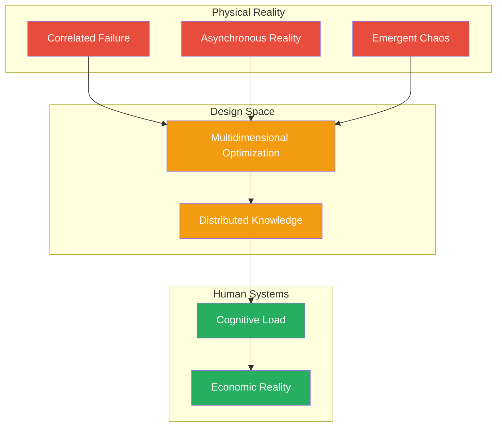

# The 7 Fundamental Laws of Distributed Systems

  
"Moving beyond simplifications to confront the profound complexity that defines distributed systems"

!!! tip "Quick Overview"
    This page provides a high-level overview of the 7 fundamental laws. For the complete framework with theoretical foundations, examples, and exercises, visit the **[detailed laws section](/part1-axioms/)**.

## 🌌 Why These Are Laws

These aren't simple observations or rules of thumb. They are fundamental laws that emerge from physics, mathematics, and information theory. Understanding these laws enables you to:

- **Think critically** about system design
- **Navigate trade-offs** in multi-dimensional space
- **Predict emergent behaviors** before they manifest
- **Design for reality** not idealized models

## The 7 Laws Overview

  <h3>Physical Laws (1-3)</h3>
  

    <a href="../part1-axioms/law1-failure/index.md" class="law-card law-1">
      
1

      

        <h3>⛓️ Law of Correlated Failure</h3>
        
Components fail together, not independently

        
Shared dependencies amplify impact

        

          ✓ Metastable failures
          ✓ Gray failures
          ✓ Cascade effects
        

      

    </a>

    <a href="../part1-axioms/law2-asynchrony/index.md" class="law-card law-2">
      
2

      

        <h3>⏳ Law of Asynchronous Reality</h3>
        
The present is unknowable

        
Information has uncertainty

        

          ✓ FLP impossibility
          ✓ Temporal logic
          ✓ Eventual consistency
        

      

    </a>

    <a href="../part1-axioms/law3-emergence/index.md" class="law-card law-3">
      
3

      

        <h3>🌪️ Law of Emergent Chaos</h3>
        
Scale creates unpredictable behaviors

        
Components can't predict the whole

        

          ✓ Phase transitions
          ✓ Feedback loops
          ✓ Chaos engineering
        

      

    </a>
  

  <h3>Trade-offs (4-5)</h3>
  

    <a href="../part1-axioms/law4-tradeoffs/index.md" class="law-card law-4">
      
4

      

        <h3>⚖️ Law of Multidimensional Optimization</h3>
        
Trade-offs exist in n-dimensional space

        
Beyond CAP to harvest/yield

        

          ✓ Cost vs complexity
          ✓ Security vs usability
          ✓ Non-linear trade-offs
        

      

    </a>

    <a href="../part1-axioms/law5-epistemology/index.md" class="law-card law-5">
      
5

      

        <h3>🧠 Law of Distributed Knowledge</h3>
        
Truth is local, certainty is expensive

        
Byzantine epistemology

        

          ✓ Belief vs knowledge
          ✓ Common knowledge
          ✓ Probabilistic truth
        

      

    </a>
  

  <h3>Human Interface (6-7)</h3>
  

    <a href="../part1-axioms/law6-human-api/index.md" class="law-card law-6">
      
6

      

        <h3>🤯 Law of Cognitive Load</h3>
        
Complexity must fit human minds

        
Mental models determine success

        

          ✓ Error design
          ✓ Observability UI
          ✓ Pit of success
        

      

    </a>

    <a href="../part1-axioms/law7-economics/index.md" class="law-card law-7">
      
7

      

        <h3>💰 Law of Economic Reality</h3>
        
Every decision has a financial impact

        
TCO drives architecture

        

          ✓ Build vs buy
          ✓ Performance/dollar
          ✓ FinOps modeling
        

      

    </a>
  

## 🔗 How the Laws Connect

## 📚 Evolution from Basic to Advanced

### Basic Framework (Traditional View)
- Simple, approachable concepts
- Binary trade-offs (CAP theorem)
- Practical patterns
- Good for learning fundamentals

### Advanced Framework (7 Laws)
- Deep theoretical foundations
- Multi-dimensional trade-offs
- Emergent complexity
- For critical system design

## Key Insights

  

    <h4>🔄 Laws Compound</h4>
    
Failure + Asynchrony = Uncertainty. Emergence + Knowledge = Unpredictability. Real complexity comes from interactions.

  

  
  

    <h4>⚖️ No Perfect Solutions</h4>
    
Every design exists as a point in n-dimensional trade-off space. The art is finding acceptable compromises.

  

  
  

    <h4>🎯 Critical Thinking</h4>
    
These laws don't provide answers—they equip you to ask better questions and challenge assumptions.

  

## Next Steps

  <a href="../part1-axioms/index.md" class="primary-cta">
    Explore the Complete Framework →
  </a>
  
  

    
Or start with a specific law:

    <a href="../part1-axioms/law1-failure/index.md">⛓️ Law of Correlated Failure →</a>
    <a href="../part1-axioms/law2-asynchrony/index.md">⏳ Law of Asynchronous Reality →</a>
    <a href="../part1-axioms/law3-emergence/index.md">🌪️ Law of Emergent Chaos →</a>
  

