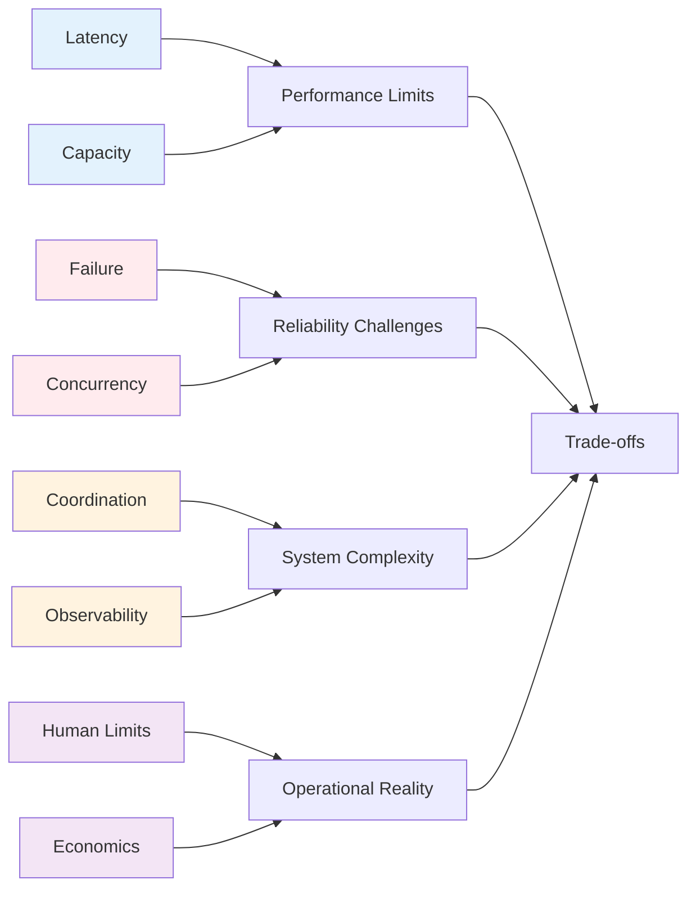

# The 8 Fundamental Axioms of Distributed Systems

  
"These aren't choices or trade-offs - they're the laws of physics applied to computing"

## 🌌 Why Start with Axioms?

Just as physics has fundamental laws that constrain all physical systems, distributed systems have fundamental axioms that constrain all designs. Understanding these axioms helps you:

- **Avoid impossible designs** - Don't fight physics
- **Make better trade-offs** - Know what you're sacrificing
- **Debug faster** - Recognize axiom violations
- **Communicate clearly** - Share a common language

## 🔍 The 8 Axioms at a Glance

  <a href="../part1-axioms/axiom1-latency/index.md" class="axiom-card axiom-1">
    
1

    

      <h3>Latency is Non-Zero</h3>
      
Nothing travels faster than light

      
NYC ↔ London = 28ms minimum

      

        ✓ CDNs exist
        ✓ Edge computing
        ✓ Caching layers
      

    

  </a>

  <a href="../part1-axioms/axiom2-capacity/index.md" class="axiom-card axiom-2">
    
2

    

      <h3>Capacity is Finite</h3>
      
Resources always have limits

      
CPU, Memory, Network, Disk

      

        ✓ Auto-scaling
        ✓ Load balancing
        ✓ Sharding
      

    

  </a>

  <a href="../part1-axioms/axiom3-failure/index.md" class="axiom-card axiom-3">
    
3

    

      <h3>Failure is Inevitable</h3>
      
Everything breaks eventually

      
MTBF × Nodes = Constant failures

      

        ✓ Circuit breakers
        ✓ Retry logic
        ✓ Redundancy
      

    

  </a>

  <a href="../part1-axioms/axiom4-concurrency/index.md" class="axiom-card axiom-4">
    
4

    

      <h3>Concurrency Creates Conflicts</h3>
      
Simultaneous operations collide

      
Race conditions everywhere

      

        ✓ Locks
        ✓ MVCC
        ✓ CRDTs
      

    

  </a>

  <a href="../part1-axioms/axiom5-coordination/index.md" class="axiom-card axiom-5">
    
5

    

      <h3>Coordination Has Cost</h3>
      
Agreement requires communication

      
O(n²) message complexity

      

        ✓ Consensus protocols
        ✓ 2PC/3PC
        ✓ Gossip
      

    

  </a>

  <a href="../part1-axioms/axiom6-observability/index.md" class="axiom-card axiom-6">
    
6

    

      <h3>Observability is Limited</h3>
      
Can't see everything at once

      
Heisenberg's uncertainty principle

      

        ✓ Sampling
        ✓ Aggregation
        ✓ Tracing
      

    

  </a>

  <a href="../part1-axioms/axiom7-human/index.md" class="axiom-card axiom-7">
    
7

    

      <h3>Humans Have Limits</h3>
      
Cognitive capacity is bounded

      
7±2 items in working memory

      

        ✓ Dashboards
        ✓ Alerts
        ✓ Runbooks
      

    

  </a>

  <a href="../part1-axioms/axiom8-economics/index.md" class="axiom-card axiom-8">
    
8

    

      <h3>Everything Has a Cost</h3>
      
No free lunch in distributed systems

      
Time × Resources × Complexity

      

        ✓ Cloud bills
        ✓ Operational overhead
        ✓ Technical debt
      

    

  </a>

## 🔗 How Axioms Connect

## 📚 Learning Path Through Axioms

### 🎯 For Beginners: Start Simple
1. **Week 1**: Axioms 1-2 (Latency & Capacity)
   - Understand physical constraints
   - Build intuition with examples
   
2. **Week 2**: Axioms 3-4 (Failure & Concurrency)
   - Learn why things break
   - See how race conditions emerge

3. **Week 3**: Axioms 5-6 (Coordination & Observability)
   - Grasp distributed complexity
   - Understand monitoring limits

4. **Week 4**: Axioms 7-8 (Human & Economics)
   - Factor in operational reality
   - Calculate true costs

### 🚀 For Practitioners: Deep Dive
- **Focus on interactions**: How axioms compound each other
- **Study violations**: Learn from real production failures
- **Apply to your systems**: Find axiom violations in your architecture

## 🎮 Interactive Exercises

Each axiom includes hands-on exercises:

  

    <h4>🌍 Latency Calculator</h4>
    
Calculate speed-of-light delays between data centers

    <a href="../part1-axioms/axiom1-latency/exercises.md#latency-calculator">Try it →</a>
  

  
  

    <h4>📊 Capacity Planner</h4>
    
Model system limits and bottlenecks

    <a href="../part1-axioms/axiom2-capacity/exercises.md#capacity-planner">Try it →</a>
  

  
  

    <h4>💥 Failure Simulator</h4>
    
See how failures cascade through systems

    <a href="../part1-axioms/axiom3-failure/exercises.md#failure-simulator">Try it →</a>
  

  
  

    <h4>🏃 Race Condition Visualizer</h4>
    
Watch concurrent operations collide

    <a href="../part1-axioms/axiom4-concurrency/exercises.md#race-visualizer">Try it →</a>
  

## 💡 Key Insights

  

    <h4>🔄 Axioms Compound</h4>
    
Latency + Failure = Timeout decisions. Capacity + Concurrency = Contention. The real complexity emerges from interactions.

  

  
  

    <h4>⚖️ No Perfect Solutions</h4>
    
Every design violates some axiom. The art is choosing which constraints to embrace and which to fight.

  

  
  

    <h4>🎯 Axioms Guide Design</h4>
    
When stuck, return to axioms. They'll show you what's possible and what's fantasy.

  

## 🚀 Next Steps

  <a href="../part1-axioms/axiom1-latency/index.md" class="primary-cta">
    Start with Axiom 1: Latency →
  </a>
  
  

    
Or jump to:

    <a href="../part2-pillars/index.md">See how axioms create the 5 Pillars →</a>
    <a href="../patterns/index.md">Explore patterns that handle axioms →</a>
    <a href="../case-studies/index.md">Study real-world axiom violations →</a>
  

