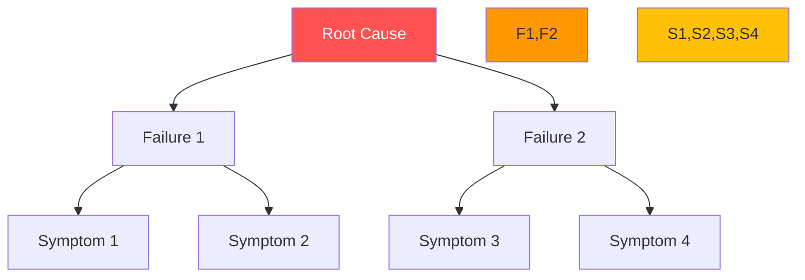
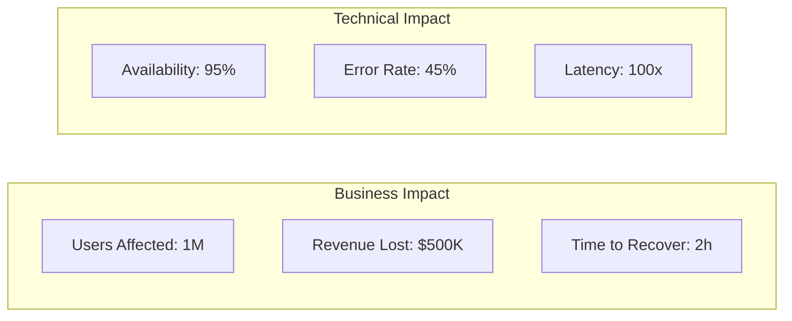

# [System Name] Case Study

!!! abstract "Quick Summary"
    🎯 **[One-line description of what happened and key lesson]**

## At a Glance

| Metric | Value |
|--------|-------|
| **Date** | [When it happened] |
| **Duration** | [How long] |
| **Impact** | [Users/$ affected] |
| **Root Cause** | [One line] |
| **Key Lesson** | [One line] |

## Visual Timeline

```mermaid
gantt
    title Incident Timeline
    dateFormat HH:mm
    axisFormat %H:%M
    
    section Detection
    Normal Operation     :done, normal, 00:00, 30m
    First Signs          :crit, signs, 00:30, 5m
    Alert Triggered      :alert, 00:35, 2m
    
    section Impact
    Service Degradation  :crit, degrade, 00:37, 15m
    Full Outage         :crit, outage, 00:52, 45m
    
    section Recovery
    Root Cause Found    :active, found, 01:37, 10m
    Fix Deployed        :active, fix, 01:47, 15m
    Service Restored    :done, restored, 02:02, 30m
```



## What Happened

### The Trigger
- **Single point**: [What started it]
- **Time**: [When exactly]
- **Initial impact**: [First effect]

### The Cascade
| Step | What Failed | Why | Impact |
|------|-------------|-----|--------|
| 1 | [Component] | [Reason] | [Effect] |
| 2 | [Component] | [Reason] | [Effect] |
| 3 | [Component] | [Reason] | [Effect] |

### The Resolution
1. **Detection**: [How found]
2. **Diagnosis**: [Key insight]
3. **Fix**: [What was done]
4. **Validation**: [How verified]

## Root Cause Analysis



## Lessons Learned

### What Failed
| Component | Why | Fix Applied |
|-----------|-----|-------------|
| [System] | [Root cause] | [Solution] |

### What Worked
| Component | Why | Keep Doing |
|-----------|-----|------------|
| [System] | [Reason] | [Practice] |

## Prevention Measures

### Immediate (Week 1)
- [ ] [Action 1]
- [ ] [Action 2]

### Short-term (Month 1)
- [ ] [Action 3]
- [ ] [Action 4]

### Long-term (Quarter)
- [ ] [Action 5]
- [ ] [Action 6]

## Technical Details

=== "Architecture"
    ```mermaid
    graph LR
        A[Component A] --> B[Component B]
        B --> C[Component C]
        C --> D[Component D]
        
        style B fill:#ff5252,color:#fff
    ```

=== "Metrics"
    | Metric | Normal | During Incident | Peak |
    |--------|--------|-----------------|------|
    | Latency | 50ms | 5000ms | 30s |
    | Error Rate | 0.01% | 45% | 100% |
    | TPS | 10K | 1K | 0 |

=== "Code"
    ```python
    # The problematic code
    def process_request(request):
        # BUG: No timeout!
        response = external_service.call(request)
        return response
    ```

## Related Patterns

| Pattern | How It Helps | Implementation |
|---------|--------------|----------------|
| [Circuit Breaker](/patterns/circuit-breaker/) | Prevents cascade | Add to all external calls |
| [Bulkhead](/patterns/bulkhead/) | Isolates failures | Separate thread pools |
| [Timeout](/patterns/timeout/) | Fails fast | 5s max for any call |

## Key Metrics



## Action Items

| Priority | Action | Owner | Due Date |
|----------|--------|-------|----------|
| P0 | Add timeouts | SRE Team | Tomorrow |
| P0 | Circuit breakers | Dev Team | Week 1 |
| P1 | Load testing | QA Team | Week 2 |
| P2 | Chaos testing | SRE Team | Month 1 |

---

[← Case Studies](/case-studies/) | [Similar Incidents →](/case-studies/similar/)