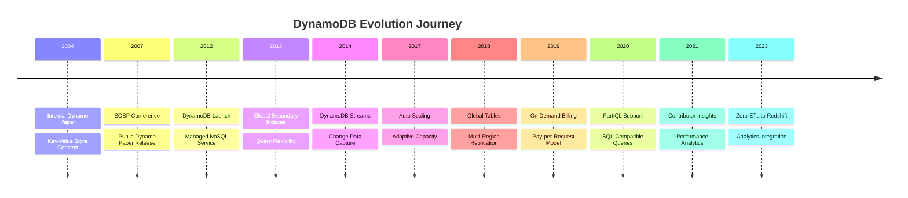
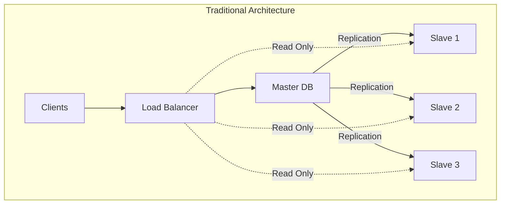
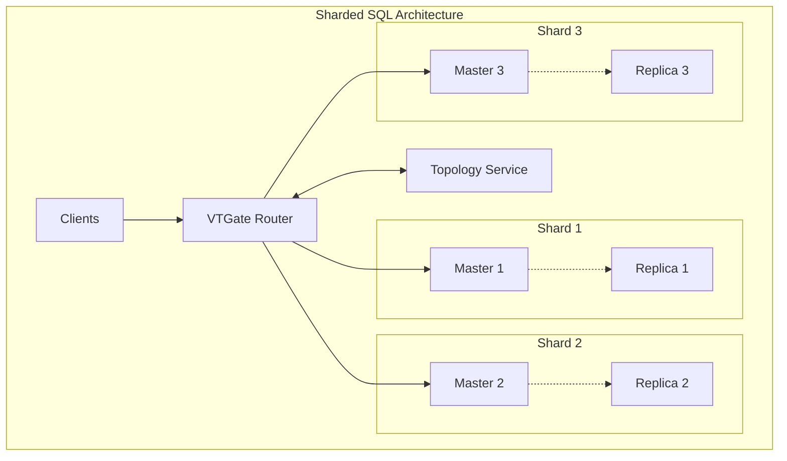
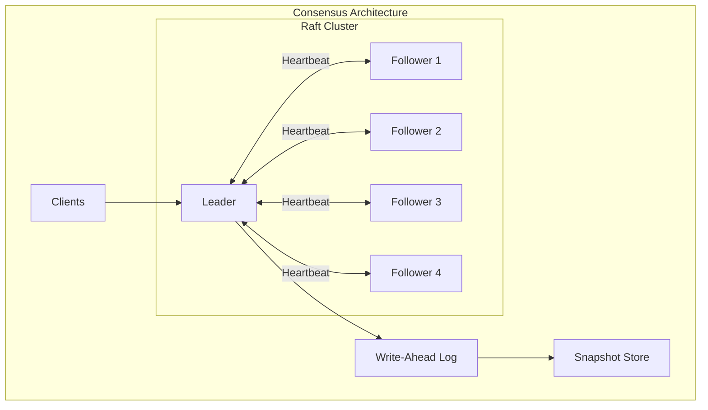
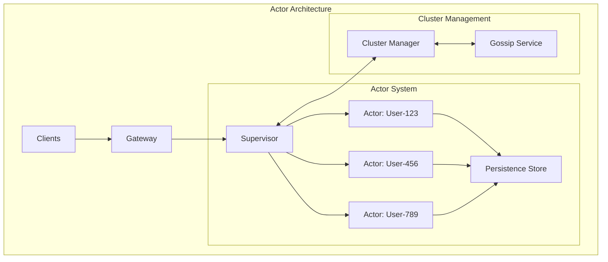

<!-- Navigation -->
[Home](../introduction/index.md) → [Case Studies](index.md) → **Amazon's DynamoDB: Building a Database That Never Goes Down**

# 🛒 Amazon's DynamoDB: Building a Database That Never Goes Down

**The Challenge**: Build a database that never goes down during Black Friday

## 📅 Timeline & Evolution



## 🔬 Comprehensive Law Analysis

### Complete Law Mapping Table

| Design Decision | Law 2: Asynchronous Reality ⏳ | Law 4: Trade-offs ⚖️ | Law 1: Failure ⛓️ | Law 3: Emergence 🌪️ | Law 5: Epistemology 🧠 | Law 6: Human-API 🤯 | Law 7: Economics 💰 |
|-----------------|------------------|-------------------|------------------|----------------------|------------------------|--------------------------|-------------------|
| **Consistent Hashing** | Minimizes data movement during scaling | Enables infinite horizontal scaling | Isolates node failures to specific key ranges | Allows parallel operations across nodes | Clear ownership mapping for debugging | Simple mental model for ops | Predictable capacity distribution |
| **Quorum Reads/Writes** | Tunable latency (R=1 for speed) | Distributes load across replicas | Tolerates N-R node failures | Concurrent reads from any replica | Clear success/failure criteria | Configurable consistency levels | Pay only for active replicas |
| **Vector Clocks** | Small metadata overhead (<1ms) | Compact representation scales | Preserves data during conflicts | Tracks concurrent updates | Version history for debugging | Complex but necessary | Storage overhead is minimal |
| **Hinted Handoff** | Maintains low latency during failures | Temporary storage burden | Handles transient failures gracefully | Allows writes during partitions | Trackable hint queue depth | Transparent to applications | Reduces manual intervention costs |
| **Merkle Trees** | Background sync doesn't impact latency | Efficient delta computation | Detects and repairs divergence | Non-blocking repair process | Quantifiable inconsistency | Self-healing system | Automated repair reduces ops cost |
| **SSD Storage** | 1ms average access time | High IOPS capacity | No mechanical failures | Lock-free data structures | Predictable performance | Consistent user experience | Higher $/GB but better $/IOPS |
| **Request Routers** | Client-side routing saves hops | Distributed routing scales | No SPOF in routing layer | Parallel request dispatch | Router health metrics | SDK handles complexity | No proxy infrastructure costs |
| **Partition Splits** | Maintains target latency | Automatic capacity expansion | Isolated to single partition | Online operation | Split metrics and alarms | Zero-downtime scaling | Elastic resource utilization |

### 🚀 Law 2 (Asynchronous Reality ⏳): Physics-Based Design
```text
Latency Budget Analysis:
- User tolerance: 100ms for page load
- Network: 50ms (coast-to-coast)
- Database: <20ms available
- Application: <30ms remaining

DynamoDB Solution:
- SSD storage: 1ms average access
- In-memory caching: 0.1ms
- Local replicas: Same AZ latency
- Result: 5-10ms database latency
```

### 📦 Law 4 (Multidimensional Optimization ⚖️): Infinite Scale Illusion
```yaml
Scaling Requirements:
- Black Friday: 10x normal traffic
- Gradual ramp: 1M to 20M requests/sec
- No pre-provisioning needed

Implementation:
- Partition splits automatically
- Request routers update in real-time
- Admission control prevents overload
- Backpressure to applications
```

### 💥 Law 1 (Correlated Failure ⛓️): Always Available
```yaml
Failure Scenarios:
- Node failures: 100s per day
- Rack failures: Weekly
- AZ failures: Quarterly
- Region failures: Rare but planned

Recovery Mechanisms:
- Hinted handoff for temporary failures
- Merkle trees for anti-entropy
- Read repair for inconsistencies
- Multi-region replication
```

### ⏰ Law 3 (Emergent Chaos 🌪️): Time is Relative
```dockerfile
Concurrent Operations:
- Shopping cart updates from multiple devices
- Wish list modifications
- Session data changes

Resolution Strategy:
- Vector clocks track causality
- Application-level reconciliation
- Last-write-wins option available
- Conflict-free replicated data types
```

### 🤝 Law 4 (Multidimensional Optimization ⚖️): Gossip over Consensus
```yaml
Traditional Consensus Problems:
- Paxos requires majority (3/5 nodes)
- Network partition = unavailability
- Cross-region consensus = high latency

Dynamo's Innovation:
- Quorum reads/writes (R + W > N)
- Gossip-based membership
- Vector clocks for versioning
- Hinted handoff for recovery

Trade-off: Availability over consistency
```

### 👁️ Law 5 (Distributed Knowledge 🧠): Operational Excellence
```yaml
Monitoring Stack:
- CloudWatch metrics (latency, throughput)
- X-Ray for distributed tracing
- Contributor Insights for hot keys
- Alarms for anomalies

Key Metrics:
- UserErrors vs SystemErrors
- ConsumedReadCapacityUnits
- ThrottledRequests
- SuccessfulRequestLatency
```

### 👤 Law 6 (Cognitive Load 🤯): Developer First
```yaml
API Design Principles:
- Simple put/get/delete operations
- Consistent error codes
- Clear throttling signals
- Predictable behavior

SDK Features:
- Automatic retries with backoff
- Connection pooling
- Request signing
- Local development mode
```

### 💰 Law 7 (Economic Reality 💰): Pay for What You Use
```yaml
Pricing Models:
- On-demand: No capacity planning
- Provisioned: Predictable costs
- Reserved capacity: 50%+ savings
- Auto-scaling: Best of both

Cost Optimizations:
- Compression reduces storage
- Batch operations save API calls
- GSIs for query flexibility
- TTL for automatic cleanup
```

## 🔄 Architecture Alternatives

### Alternative 1: Traditional Master-Slave Database



### Alternative 2: Sharded MySQL with Vitess



### Alternative 3: Consensus-Based System (etcd/Consul)



### Alternative 4: Actor-Based System (Orleans/Akka)



### Alternative 5: DynamoDB's Chosen Architecture

```mermaid
graph TB
    subgraph "DynamoDB Architecture"
        C[Clients]
        
        subgraph "Request Routing"
            RR[Request Router]
            PM[Partition Map]
        end
        
        subgraph "Storage Nodes"
            subgraph "Partition A"
                N1[Node 1<br/>Primary]
                N2[Node 2<br/>Replica]
                N3[Node 3<br/>Replica]
            end
            
            subgraph "Partition B"
                N4[Node 4<br/>Primary]
                N5[Node 5<br/>Replica]
                N6[Node 6<br/>Replica]
            end
        end
        
        subgraph "Background Services"
            HH[Hinted Handoff]
            MT[Merkle Tree Sync]
            GS[Gossip Protocol]
        end
    end
    
    C --> RR
    RR --> PM
    RR --> N1
    RR --> N4
    N1 <--> N2
    N2 <--> N3
    N1 <--> N3
    N4 <--> N5
    N5 <--> N6
    N4 <--> N6
    
    N1 -.-> HH
    N1 -.-> MT
    All nodes -.-> GS
```

## 📊 Trade-off Analysis

### Comprehensive Architecture Comparison

| Aspect | Traditional Master-Slave | Sharded MySQL | Consensus-Based | Actor-Based | DynamoDB (Quorum) |
|--------|-------------------------|---------------|-----------------|-------------|-------------------|
| **Write Availability** | ❌ Low (single master) | ⚠️ Medium (per-shard master) | ❌ Low (requires majority) | ✅ High (distributed actors) | ✅ Very High (quorum flexibility) |
| **Read Scalability** | ⚠️ Limited by replicas | ✅ Good (shard parallelism) | ❌ Limited by consensus | ✅ Good (actor parallelism) | ✅ Excellent (any replica) |
| **Consistency Model** | ✅ Strong | ✅ Strong per-shard | ✅ Strong (linearizable) | ⚠️ Eventual (actor state) | ⚠️ Tunable (eventual to strong) |
| **Partition Tolerance** | ❌ Split-brain risk | ❌ Shard unavailable | ⚠️ Minority partition fails | ✅ Actors continue | ✅ Continues with quorum |
| **Operational Complexity** | ✅ Simple | ⚠️ Moderate | ⚠️ Moderate | ❌ Complex | ⚠️ Moderate |
| **Auto-Scaling** | ❌ Manual | ❌ Complex resharding | ❌ Fixed cluster size | ⚠️ Actor redistribution | ✅ Automatic partitioning |
| **Multi-DC Support** | ❌ Async replication only | ❌ Complex setup | ⚠️ High latency | ✅ Location transparency | ✅ Built-in global tables |
| **Recovery Time** | ❌ Minutes (failover) | ❌ Minutes per shard | ✅ Seconds (new leader) | ✅ Instant (actor respawn) | ✅ Instant (use replicas) |
| **Cost Model** | ✅ Predictable | ✅ Predictable | ❌ Over-provisioned | ⚠️ Memory intensive | ✅ Pay-per-use option |

### Decision Matrix for Different Use Cases

| Use Case | Best Architecture | Why |
|----------|------------------|-----|
| **Financial Transactions** | Consensus-Based | Strong consistency guarantees |
| **Shopping Cart** | DynamoDB | High availability, eventual consistency OK |
| **User Sessions** | Actor-Based | Natural session affinity |
| **Analytics Data** | Sharded MySQL | Complex queries, batch processing |
| **Configuration Management** | Consensus-Based | Strong consistency, small data |
| **Social Media Feed** | DynamoDB | Scale and availability critical |
| **Gaming Leaderboards** | Actor-Based | Real-time updates, player affinity |
| **E-commerce Catalog** | Traditional Master-Slave | Read-heavy, simple model |

## 🛡️ Failure Handling Strategies

**Multi-Level Resilience**
```yaml
Level 1: Node Failures
- Detect: Gossip protocol (heartbeats)
- React: Route traffic to replicas
- Recover: Hinted handoff when back

Level 2: Network Partitions
- Detect: Cannot reach quorum
- React: Serve stale data vs. fail
- Recover: Merkle tree sync

Level 3: Data Center Failures
- Detect: Regional health checks
- React: Cross-region failover
- Recover: Eventually consistent repair

Level 4: Correlated Failures
- Detect: Anomaly patterns
- React: Circuit breakers
- Recover: Manual intervention
```

## ⚡ Performance Optimizations

## 🎯 Key Design Decisions

## 📊 Production Metrics

### System Performance (2023)
- **Requests**: 89.2 trillion per month
- **Availability**: 99.999% (5.26 minutes downtime/year)
- **P99 Latency**: 4.9ms (single-digit milliseconds)
- **Peak Traffic**: 105.2M requests/second

### Infrastructure Scale
- **Storage**: Exabytes of data
- **Tables**: 10M+ active tables
- **Regions**: Available in 30+ AWS regions
- **Nodes**: 100,000+ servers globally

### Cost Efficiency
- **Storage Cost**: $0.25 per GB-month
- **Request Cost**: $0.25 per million requests
- **TCO Reduction**: 70% vs traditional databases

## 🎓 Lessons Learned

### What Worked Well
1. **Consistent Hashing**: Enabled seamless scaling
2. **Vector Clocks**: Solved conflict resolution elegantly
3. **Quorum System**: Perfect balance of consistency/availability
4. **Managed Service**: Removed operational burden

### What Didn't Work
1. **Initial Query Model**: Too restrictive, added GSIs
2. **Fixed Provisioning**: Led to over/under provisioning
3. **Single Region**: Added global tables for compliance

### Key Takeaways
- **Design for failure**: Assume everything will fail
- **Eventual consistency is often enough**: Most apps can tolerate it
- **Operational simplicity matters**: Managed service wins
- **Monitor everything**: Can't optimize what you can't measure

## 🔗 References & Deep Dives

### Academic Papers
- [Dynamo: Amazon's Highly Available Key-value Store (2007)](https://www.allthingsdistributed.com/files/amazon-dynamo-sosp2007.pdf)
- [Life Beyond Distributed Transactions](https://queue.acm.org/detail.cfm?id=3025012)

### Related Patterns
- [Consistent Hashing](../patterns/sharding.md#consistent-hashing)
- Vector Clocks (distributed state tracking)
- Quorum Consensus (W+R>N guarantees)
- Gossip Protocol (membership and failure detection)

### Similar Systems
- [Cassandra](https://cassandra.apache.org/) - Open source Dynamo
- [Riak](https://riak.com/) - Commercial Dynamo implementation
- [Voldemort](https://www.project-voldemort.com/) - LinkedIn's key-value store

## 🔍 Related Concepts & Deep Dives

### 📚 Relevant Laws (Part I)
- **[Law 1: Failure ⛓️](../part1-axioms/axiom1-failure/index.md)** - Hinted handoff and Merkle trees ensure availability despite 100s of daily node failures
- **[Law 2: Asynchronous Reality ⏳](../part1-axioms/axiom2-asynchrony/index.md)** - DynamoDB's SSD storage and in-memory caching achieve <10ms latency by respecting physical constraints
- **[Law 3: Emergence 🌪️](../part1-axioms/axiom3-emergence/index.md)** - Vector clocks track causality and enable conflict resolution for concurrent updates
- **[Law 4: Trade-offs ⚖️](../part1-axioms/axiom4-tradeoffs/index.md)** - Automatic partition splits, gossip protocol, and quorum consensus balance multiple trade-offs
- **[Law 5: Epistemology 🧠](../part1-axioms/axiom5-epistemology/index.md)** - CloudWatch metrics and X-Ray tracing provide deep operational visibility
- **[Law 6: Human-API 🤯](../part1-axioms/axiom6-human-api/index.md)** - Simple put/get API and clear error handling reduce cognitive load
- **[Law 7: Economics 💰](../part1-axioms/axiom7-economics/index.md)** - Multiple pricing models (on-demand, provisioned, reserved) optimize costs

### 🏛️ Related Patterns (Part III)
- **[Sharding & Partitioning](../patterns/sharding.md)** - Consistent hashing minimizes data movement during scaling
- **[Tunable Consistency](../patterns/tunable-consistency.md)** - Quorum reads/writes (R+W>N) let applications choose consistency levels
- **[Circuit Breaker](../patterns/circuit-breaker.md)** - Request routers prevent cascading failures during overload
- **[Health Check](../patterns/health-check.md)** - Gossip-based failure detection identifies unhealthy nodes
- **[Retry & Backoff](../patterns/retry-backoff.md)** - SDK implements exponential backoff for throttled requests
- **[Load Shedding](../patterns/load-shedding.md)** - Admission control protects system during extreme load
- **[Event-Driven Architecture](../patterns/event-driven.md)** - DynamoDB Streams enable change data capture

### 📊 Quantitative Models
- **CAP Theorem** - DynamoDB chooses AP (availability + partition tolerance) with tunable consistency
- **[Little's Law](../quantitative/littles-law.md)** - Helps size connection pools: L = λW (20ms latency × 1000 req/s = 20 concurrent connections)
- **[Queueing Theory](../quantitative/queueing-models.md)** - M/M/c model for request router capacity planning
- **[Scaling Laws](../quantitative/universal-scalability.md)** - Linear scaling through consistent hashing partitioning

### 👥 Human Factors Considerations
- **[On-Call Culture](../human-factors/oncall-culture.md)** - DynamoDB's managed service reduces operational burden
- **[Incident Response](../human-factors/incident-response.md)** - Automated recovery (hinted handoff, Merkle trees) minimizes manual intervention
- **[Observability Tools](../human-factors/observability-stacks.md)** - Contributor Insights identifies hot keys and performance bottlenecks
- **[Capacity Planning](../quantitative/capacity-planning.md)** - Auto-scaling eliminates manual capacity management

### 🔄 Similar Case Studies
- **[Consistent Hashing Deep Dive](consistent-hashing.md)** - Detailed exploration of DynamoDB's core distribution mechanism
- **[PayPal's Payment System](paypal-payments.md)** - Similar high-availability requirements with financial constraints
- **[YouTube's Video Platform](youtube.md)** - Another system optimizing for availability over consistency
- **[Rate Limiter Design](rate-limiter.md)** - Uses similar token bucket algorithms for admission control

---

---

*"DynamoDB proves that with the right architecture, you can have your cake (availability) and eat it too (consistency when needed)."*

---

**Previous**: [← Uber's Location System](uber-location.md) | **Next**: [Spotify Recommendations →](spotify-recommendations.md)
