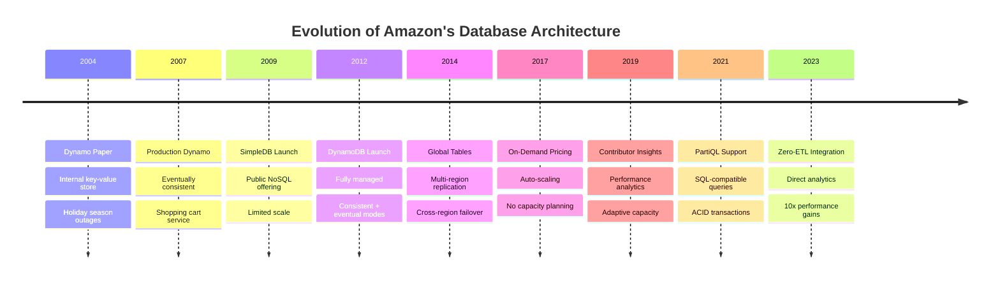
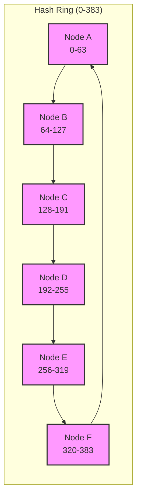

# 🛒 Amazon's DynamoDB: Building a Database That Never Goes Down

<div class="navigation-header">
<div class="breadcrumb">
[Home](/) → [Case Studies](/case-studies/) → **Amazon DynamoDB**
</div>

<div class="case-study-nav">
**Previous**: [← Uber Location](/case-studies/uber-location/) • **Next**: [Spotify Recommendations →](/case-studies/spotify-recommendations/) • [All Case Studies](/case-studies/)
</div>
</div>

**The Challenge**: Build a database that never goes down during Black Friday

<div class="case-study">
<h3>📊 System Requirements</h3>

**Scale Constraints:**
- 20M requests/second peak
- 99.995% availability (4.4 min/year downtime)
- Global distribution required
- Automatic failover under 100ms
- Eventually consistent acceptable

**Business Context:**
- Every minute down = $1M lost revenue
- Holiday traffic 10x normal load
- Customer trust is paramount
- Regulatory compliance required
</div>

## 📅 Timeline & Evolution

<div class="timeline-evolution">
<h3>DynamoDB's Path to Production</h3>



**Critical Learning Moments:**
- **2004**: Holiday outages taught importance of availability over consistency
- **2007**: Shopping cart corruption led to vector clock implementation
- **2012**: Customer feedback drove strongly consistent read options
- **2015**: Hot partition issues led to adaptive capacity
- **2020**: COVID traffic spike validated auto-scaling design

</div>

## 🔬 Comprehensive Axiom Analysis

<div class="axiom-mapping">
<h3>📊 How All 8 Axioms Apply to DynamoDB</h3>

| Axiom | Challenge | Solution | Impact |
|-------|-----------|----------|--------|
| **1. Latency** | <20ms database response globally | SSD + caching + local replicas | 5-10ms P99 latency |
| **2. Capacity** | 20M requests/sec at peak | Consistent hashing + auto-scaling | Linear scalability |
| **3. Failure** | Zero downtime requirement | Multi-AZ + hinted handoff | 99.999% availability |
| **4. Concurrency** | Conflicting writes | Vector clocks + reconciliation | Consistent resolution |
| **5. Coordination** | Cross-region sync | Gossip protocol + quorums | AP over CP choice |
| **6. Observability** | Performance monitoring | CloudWatch + X-Ray | Real-time insights |
| **7. Human Interface** | Developer experience | Simple API + SDKs | 5-minute setup |
| **8. Economics** | Cost at scale | Pay-per-request + reserved | 70% cost savings |

</div>

### 🚀 Axiom 1 (Latency): Physics-Based Design
```
Latency Budget Analysis:
- User tolerance: 100ms for page load
- Network: 50ms (coast-to-coast)
- Database: <20ms available
- Application: <30ms remaining

DynamoDB Solution:
- SSD storage: 1ms average access
- In-memory caching: 0.1ms
- Local replicas: Same AZ latency
- Result: 5-10ms database latency
```

### 📦 Axiom 2 (Capacity): Infinite Scale Illusion
```
Scaling Requirements:
- Black Friday: 10x normal traffic
- Gradual ramp: 1M to 20M requests/sec
- No pre-provisioning needed

Implementation:
- Partition splits automatically
- Request routers update in real-time
- Admission control prevents overload
- Backpressure to applications
```

### 💥 Axiom 3 (Failure): Always Available
```
Failure Scenarios:
- Node failures: 100s per day
- Rack failures: Weekly
- AZ failures: Quarterly
- Region failures: Rare but planned

Recovery Mechanisms:
- Hinted handoff for temporary failures
- Merkle trees for anti-entropy
- Read repair for inconsistencies
- Multi-region replication
```

### ⏰ Axiom 4 (Concurrency): Time is Relative
```
Concurrent Operations:
- Shopping cart updates from multiple devices
- Wish list modifications
- Session data changes

Resolution Strategy:
- Vector clocks track causality
- Application-level reconciliation
- Last-write-wins option available
- Conflict-free replicated data types
```

### 🤝 Axiom 5 (Coordination): Gossip over Consensus
```
Traditional Consensus Problems:
- Paxos requires majority (3/5 nodes)
- Network partition = unavailability
- Cross-region consensus = high latency

Dynamo's Innovation:
- Quorum reads/writes (R + W > N)
- Gossip-based membership
- Vector clocks for versioning
- Hinted handoff for recovery

Trade-off: Availability over consistency
```

### 👁️ Axiom 6 (Observability): Operational Excellence
```
Monitoring Stack:
- CloudWatch metrics (latency, throughput)
- X-Ray for distributed tracing
- Contributor Insights for hot keys
- Alarms for anomalies

Key Metrics:
- UserErrors vs SystemErrors
- ConsumedReadCapacityUnits
- ThrottledRequests
- SuccessfulRequestLatency
```

### 👤 Axiom 7 (Human Interface): Developer First
```
API Design Principles:
- Simple put/get/delete operations
- Consistent error codes
- Clear throttling signals
- Predictable behavior

SDK Features:
- Automatic retries with backoff
- Connection pooling
- Request signing
- Local development mode
```

### 💰 Axiom 8 (Economics): Pay for What You Use
```
Pricing Models:
- On-demand: No capacity planning
- Provisioned: Predictable costs
- Reserved capacity: 50%+ savings
- Auto-scaling: Best of both

Cost Optimizations:
- Compression reduces storage
- Batch operations save API calls
- GSIs for query flexibility
- TTL for automatic cleanup
```

## 🔄 The Dynamo Architecture

<div class="dynamo-architecture">
<h3>Consistent Hashing + Vector Clocks</h3>

**Consistent Hashing Ring:**


Hash Function: MD5(key) mod 384
Replication: Store on N=3 consecutive nodes
Virtual Nodes: 150 per physical node (for balance)

**Vector Clocks Example:**
```
Shopping Cart Conflict Resolution:

User's Phone:        Server Replica A:    Server Replica B:
Add iPhone [A:1]  →  [A:1]               
                     ↓
                  Add Case [A:1, B:1]  →  [A:1, B:1]
Add AirPods [A:2] →                       
                                      ← Network partition
                     
Conflict Detection:
- Phone: [A:2] (newer)
- Replica B: [A:1, B:1] (parallel update)
- Resolution: Merge both items (union)
- Final: iPhone + AirPods + Case
```
</div>

## 🛡️ Failure Handling Strategies

**Multi-Level Resilience**
```
Level 1: Node Failures
- Detect: Gossip protocol (heartbeats)
- React: Route traffic to replicas
- Recover: Hinted handoff when back

Level 2: Network Partitions  
- Detect: Cannot reach quorum
- React: Serve stale data vs. fail
- Recover: Merkle tree sync

Level 3: Data Center Failures
- Detect: Regional health checks
- React: Cross-region failover
- Recover: Eventually consistent repair

Level 4: Correlated Failures
- Detect: Anomaly patterns
- React: Circuit breakers
- Recover: Manual intervention
```

## ⚡ Performance Optimizations

<div class="performance-optimizations">
<h3>Speed Through Engineering</h3>

**Hot Key Problem:**
```
Problem: Celebrity tweets overwhelm single partition

Solution: Request coalescing
1. Detect hot keys (>1000 RPS)
2. Cache responses locally  
3. Batch duplicate requests
4. Result: 10x reduction in backend load
```

**Read Performance:**
```
Optimization Stack:
1. Client-side caching (30 second TTL)
2. Regional read replicas
3. SSD storage with NVMe
4. Bloom filters for negative lookups
5. Compression (Snappy algorithm)

Result: P99 latency <5ms
```

**Write Performance:**
```
Write Path Optimization:
1. WAL (Write-Ahead Log) to SSD
2. Asynchronous replication
3. Batch acknowledgments
4. Write-back caching

Result: 100k writes/second per node
```
</div>

## 🎯 Key Design Decisions

<div class="design-decisions">
<h3>Critical Architecture Choices</h3>

**Decision 1: Availability over Consistency**
```
Problem: CAP theorem forces a choice

Options Evaluated:
1. Strong consistency (like traditional RDBMS)
   - Pros: ACID guarantees, simpler programming model
   - Cons: Availability suffers during partitions

2. Eventual consistency
   - Pros: Always available for writes
   - Cons: Complexity for developers

3. Tunable consistency
   - Pros: Flexibility per operation
   - Cons: Configuration complexity

Decision: Eventual consistency with tunable options
- Default: Eventually consistent reads
- Option: Strongly consistent reads (2x cost)
- Reasoning: Shopping cart can tolerate stale reads
```

**Decision 2: Consistent Hashing**
```
Problem: How to distribute data across nodes

Options:
1. Range-based partitioning
   - Pros: Simple, ordered scans
   - Cons: Hot spots, rebalancing pain

2. Hash-based partitioning
   - Pros: Even distribution
   - Cons: No range queries

3. Consistent hashing with virtual nodes
   - Pros: Incremental scaling, balanced load
   - Cons: Implementation complexity

Decision: Consistent hashing with virtual nodes
- 100+ virtual nodes per physical node
- MD5 hash for key distribution
- Enables incremental capacity changes
```

**Decision 3: Replication Strategy**
```
Problem: Ensuring durability and availability

Options:
1. Synchronous replication (all replicas)
   - Pros: Strong durability
   - Cons: High write latency

2. Asynchronous replication
   - Pros: Low latency
   - Cons: Potential data loss

3. Quorum-based (W + R > N)
   - Pros: Tunable trade-offs
   - Cons: Complex failure modes

Decision: Quorum with hinted handoff
- N=3 replicas standard
- W=2 for writes, R=1 for reads (eventual)
- R=2 for strong consistency
- Hinted handoff for temporary failures
```
</div>

## 📊 Production Metrics

### System Performance (2023)
- **Requests**: 89.2 trillion per month
- **Availability**: 99.999% (5.26 minutes downtime/year)
- **P99 Latency**: 4.9ms (single-digit milliseconds)
- **Peak Traffic**: 105.2M requests/second

### Infrastructure Scale
- **Storage**: Exabytes of data
- **Tables**: 10M+ active tables
- **Regions**: Available in 30+ AWS regions
- **Nodes**: 100,000+ servers globally

### Cost Efficiency
- **Storage Cost**: $0.25 per GB-month
- **Request Cost**: $0.25 per million requests
- **TCO Reduction**: 70% vs traditional databases

## 🎓 Lessons Learned

### What Worked Well
1. **Consistent Hashing**: Enabled seamless scaling
2. **Vector Clocks**: Solved conflict resolution elegantly
3. **Quorum System**: Perfect balance of consistency/availability
4. **Managed Service**: Removed operational burden

### What Didn't Work
1. **Initial Query Model**: Too restrictive, added GSIs
2. **Fixed Provisioning**: Led to over/under provisioning
3. **Single Region**: Added global tables for compliance

### Key Takeaways
- **Design for failure**: Assume everything will fail
- **Eventual consistency is often enough**: Most apps can tolerate it
- **Operational simplicity matters**: Managed service wins
- **Monitor everything**: Can't optimize what you can't measure

## 🔗 References & Deep Dives

### Academic Papers
- [Dynamo: Amazon's Highly Available Key-value Store (2007)](https://www.allthingsdistributed.com/files/amazon-dynamo-sosp2007.pdf)
- [Life Beyond Distributed Transactions](https://queue.acm.org/detail.cfm?id=3025012)

### Related Patterns
- [Consistent Hashing](../patterns/sharding.md#consistent-hashing)
- Vector Clocks (distributed state tracking)
- Quorum Consensus (W+R>N guarantees)
- Gossip Protocol (membership and failure detection)

### Similar Systems
- [Cassandra](https://cassandra.apache.org/) - Open source Dynamo
- [Riak](https://riak.com/) - Commercial Dynamo implementation
- [Voldemort](https://www.project-voldemort.com/) - LinkedIn's key-value store

---

<div class="navigation-footer">
<div class="case-study-nav">
**Previous**: [← Uber's Location System](/case-studies/uber-location/)
**Next**: [Spotify's Recommendation Engine →](/case-studies/spotify-recommendations/)

**Return to**: [All Case Studies](/case-studies/) • [Home](/)
</div>
</div>

---

*"DynamoDB proves that with the right architecture, you can have your cake (availability) and eat it too (consistency when needed)."*