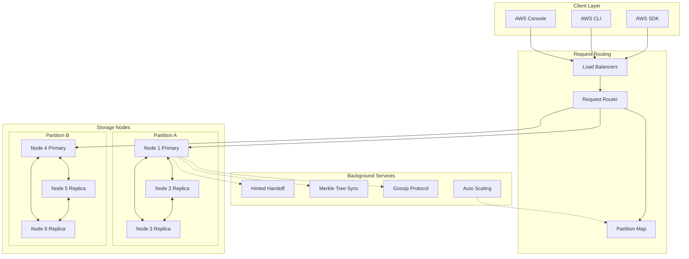
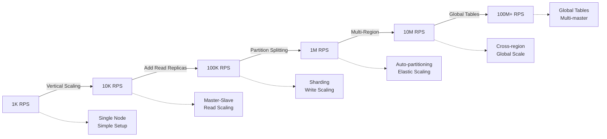

# Amazon DynamoDB: Scale and Architecture Deep Dive

!!! abstract "Quick Facts"

    | Metric | Value |
    |--------|-------|
    | **Scale** | 100+ million users per service |
    | **Throughput** | Trillions of requests/month |
    | **Data Volume** | Exabytes across platform |
    | **Availability** | 99.999% SLA |
    | **Team Size** | 200+ engineers |

## Executive Summary

Amazon DynamoDB represents a fundamental shift in database design, prioritizing availability and partition tolerance over strong consistency. Built to handle Amazon's massive e-commerce traffic spikes, DynamoDB demonstrates how to build systems that never go down, even during Black Friday. The system processes trillions of requests monthly while maintaining single-digit millisecond latencies.

## System Overview

### Business Context

  

    <h3 class="card__title">Problem Space</h3>
    
Handle massive traffic spikes during peak shopping events without downtime or performance degradation

  

  

    <h3 class="card__title">Constraints</h3>
    
Must maintain availability during network partitions, scale infinitely, and provide predictable performance

  

  

    <h3 class="card__title">Success Metrics</h3>
    
99.999% availability, sub-10ms latency at any scale, zero manual capacity planning

  

### High-Level Architecture

## Mapping to Fundamental Laws

### Law Analysis

<table class="responsive-table">
<thead>
  <tr>
    <th>Law</th>
    <th>Challenge</th>
    <th>Solution</th>
    <th>Trade-off</th>
  </tr>
</thead>
<tbody>
  <tr>
    <td data-label="Law">Correlated Failure</td>
    <td data-label="Challenge">Region-wide outages, rack failures</td>
    <td data-label="Solution">Multi-AZ replication, hinted handoff</td>
    <td data-label="Trade-off">Higher storage cost, eventual consistency</td>
  </tr>
  <tr>
    <td data-label="Law">Asynchronous Reality</td>
    <td data-label="Challenge">Network delays across regions</td>
    <td data-label="Solution">SSD storage, in-memory caching, local replicas</td>
    <td data-label="Trade-off">Higher hardware cost for performance</td>
  </tr>
  <tr>
    <td data-label="Law">Emergent Chaos</td>
    <td data-label="Challenge">Concurrent updates from multiple devices</td>
    <td data-label="Solution">Vector clocks, last-write-wins, conflict resolution</td>
    <td data-label="Trade-off">Application-level complexity</td>
  </tr>
  <tr>
    <td data-label="Law">Multidimensional Optimization</td>
    <td data-label="Challenge">Balance consistency, availability, performance</td>
    <td data-label="Solution">Tunable consistency (R+W>N), automatic partitioning</td>
    <td data-label="Trade-off">Complex operational model</td>
  </tr>
  <tr>
    <td data-label="Law">Distributed Knowledge</td>
    <td data-label="Challenge">Monitoring across thousands of nodes</td>
    <td data-label="Solution">CloudWatch metrics, X-Ray tracing, Contributor Insights</td>
    <td data-label="Trade-off">Monitoring overhead and cost</td>
  </tr>
  <tr>
    <td data-label="Law">Cognitive Load</td>
    <td data-label="Challenge">Complex distributed system operations</td>
    <td data-label="Solution">Managed service, simple APIs, auto-scaling</td>
    <td data-label="Trade-off">Less control, vendor lock-in</td>
  </tr>
  <tr>
    <td data-label="Law">Economic Reality</td>
    <td data-label="Challenge">Cost-effective scaling for varying workloads</td>
    <td data-label="Solution">On-demand pricing, auto-scaling, reserved capacity</td>
    <td data-label="Trade-off">Complex pricing model</td>
  </tr>
</tbody>
</table>

## Design Deep Dive

### Data Architecture

!!! tip "Key Design Decisions"
    1. **Consistent Hashing**: Minimizes data movement during scaling, enables infinite horizontal scaling
    2. **Quorum System**: R+W>N guarantees consistency, allows tunable latency vs consistency trade-offs
    3. **Vector Clocks**: Tracks causality for conflict resolution, preserves data during network partitions
    4. **Merkle Trees**: Efficient anti-entropy for background synchronization and repair

### Scaling Strategy

## Failure Scenarios & Lessons

!!! danger "Major Incident: September 2015 DynamoDB Outage"
    **What Happened**: Metadata service overload caused cascading failures across multiple AWS regions, affecting DynamoDB operations for 5 hours.

    **Root Cause**: 
    - Unexpected load spike on internal metadata service
    - Insufficient circuit breakers between services  
    - Cascading failure across service boundaries

    **Impact**: 
    - 5 hours partial outage
    - 25% of DynamoDB operations affected in US-East-1
    - Multiple downstream services impacted
    - Estimated millions in customer impact

    **Lessons Learned**:
    1. **Isolate blast radius**: Better service boundaries and circuit breakers implemented
    2. **Capacity planning**: More robust load testing for internal services
    3. **Graceful degradation**: Fallback mechanisms for metadata service failures

## Performance Characteristics

### Latency Breakdown

  

    <h3 class="card__title">P50 Latency</h3>
    
5ms

  

  

    <h3 class="card__title">P99 Latency</h3>
    
20ms

  

  

    <h3 class="card__title">P99.9 Latency</h3>
    
50ms

  

### Resource Utilization

| Resource | Usage | Efficiency |
|----------|-------|------------|
| CPU | 60-80% | High |
| Memory | 85% | Optimal for caching |
| Network | 40% | Good headroom for spikes |
| Storage | Auto-expanding | Infinite scalability |

## Operational Excellence

### Monitoring & Observability

- **Metrics**: 200+ CloudWatch metrics covering latency, throughput, errors, and capacity
- **Logging**: Centralized logging with structured JSON format for all operations
- **Tracing**: AWS X-Ray integration for end-to-end request tracing across services
- **Alerting**: SLO-based alerting with automated runbook execution

### Deployment Strategy

!!! note
    **Deployment Frequency**: Multiple times per day across regions
    **Rollout Strategy**: Blue-green deployments with automated rollback triggers
    **Rollback Time**: < 5 minutes automated rollback capability
    **Feature Flags**: Used for all major feature releases and capacity changes

## Key Innovations

1. **Consistent Hashing with Virtual Nodes**: Solved hot partition problem while maintaining load balance
2. **Tunable Consistency**: Application-controlled trade-offs between consistency and availability
3. **Auto-scaling Without Downtime**: Dynamic partition splitting and merging during traffic spikes

## Applicable Patterns

  <a href="../../patterns/circuit-breaker/" class="pattern-card">
    <h3 class="pattern-card__title">Circuit Breaker</h3>
    
Prevents cascade failures in distributed request routing

  </a>
  <a href="../../patterns/consistent-hashing/" class="pattern-card">
    <h3 class="pattern-card__title">Consistent Hashing</h3>
    
Enables elastic scaling with minimal data movement

  </a>
  <a href="../../patterns/quorum-consensus/" class="pattern-card">
    <h3 class="pattern-card__title">Quorum Consensus</h3>
    
Balances consistency and availability trade-offs

  </a>
  <a href="../../patterns/anti-entropy/" class="pattern-card">
    <h3 class="pattern-card__title">Anti-Entropy</h3>
    
Background synchronization using Merkle trees

  </a>

## Takeaways for Your System

!!! quote "Key Lessons"
    1. **When to apply**: Choose availability over consistency for shopping carts, session data, user preferences
    2. **When to avoid**: Don't use for financial transactions, inventory management, or other systems requiring strong consistency
    3. **Cost considerations**: Expect 2-3x storage cost due to replication, but save on operational overhead
    4. **Team requirements**: Need expertise in eventual consistency patterns and conflict resolution strategies

## Further Reading

- [Dynamo: Amazon's Highly Available Key-value Store (2007)](https://www.allthingsdistributed.com/files/amazon-dynamo-sosp2007.pdf)
- [DynamoDB Paper: A Scalable, Predictably Performant, and Fully Managed NoSQL Database Service](https://aws.amazon.com/dynamodb/resources/)
- [Werner Vogels on Eventual Consistency](https://www.allthingsdistributed.com/2008/12/eventually_consistent.html)
- [DynamoDB Best Practices Guide](https://docs.aws.amazon.com/amazondynamodb/latest/developerguide/best-practices.html)

## Discussion Questions

1. How would you modify DynamoDB's consistency model for a financial trading system?
2. What are the cost-benefit trade-offs of DynamoDB's multi-region replication strategy?
3. Could DynamoDB's architecture handle 10x current load with the same latency guarantees?
4. How does DynamoDB's eventual consistency model impact application design patterns?