# Amazon DynamoDB: NoSQL at Scale

!!! success "Excellence Badge"
    🥇 **Gold Tier**: Battle-tested at internet scale with proven reliability

!!! abstract "Quick Facts"
    | Metric | Value |
    |--------|-------|
    | **Scale** | 10+ trillion requests/day |
    | **Availability** | 99.999% SLA |
    | **Latency** | <10ms at p99 |
    | **Global Reach** | 30+ AWS regions |
    | **Customers** | 100,000+ active |

## Executive Summary

DynamoDB powers mission-critical workloads for Amazon.com, Lyft, Airbnb, and thousands of other companies. By providing consistent single-digit millisecond latency at any scale, DynamoDB enables applications to handle massive traffic spikes without manual intervention. Its serverless architecture eliminates database administration overhead while maintaining enterprise-grade reliability.

## System Architecture

### Core Design Principles


### Key Components

| Component | Function | Scale Factor |
|-----------|----------|-------------|
| **Request Router** | Routes requests to correct partition | Millions QPS |
| **Storage Nodes** | Store and serve data | 1000s per region |
| **Replication Manager** | Maintains consistency | 3-way replication |
| **Auto Scaler** | Adjusts capacity | Scales in minutes |
| **Global Tables** | Multi-region replication | <1s latency |

## Technical Deep Dive

### Partitioning Strategy

=== "Hash-Based Partitioning"
    ```python
    class DynamoDBPartitioner:
        def get_partition(self, key):
            # Consistent hashing with virtual nodes
            hash_value = md5(key)
            partition = self.find_partition(hash_value)
            return partition
        
        def split_partition(self, partition):
            # Automatic split when partition grows
            if partition.size > THRESHOLD:
                new_partitions = partition.split()
                self.rebalance_data(new_partitions)
    ```

=== "Adaptive Capacity"
    ```python
    class AdaptiveCapacity:
        def distribute_capacity(self, table):
            # Isolate frequently accessed items
            hot_keys = self.identify_hot_keys(table)
            
            for partition in table.partitions:
                if partition.has_hot_keys(hot_keys):
                    # Boost capacity for hot partitions
                    partition.capacity *= 1.5
                else:
                    # Normal capacity distribution
                    partition.capacity = table.capacity / len(table.partitions)
    ```

=== "Global Table Replication"
    ```python
    class GlobalTableReplicator:
        def replicate_write(self, item, region):
            # Local write first
            local_result = self.write_local(item)
            
            # Async replication to other regions
            for remote_region in self.regions:
                if remote_region != region:
                    self.async_replicate(item, remote_region)
            
            return local_result
    ```

### Consistency Model


## Performance Optimization

### Latency Breakdown

| Operation | Component | Latency | Optimization |
|-----------|-----------|---------|---------------|
| **Request Routing** | Load Balancer | <1ms | Connection pooling |
| **Partition Lookup** | Metadata Cache | <0.1ms | In-memory cache |
| **Storage Read** | SSD | 2-5ms | Parallel reads |
| **Replication** | Network | 1-2ms | Async replication |
| **Total** | End-to-end | <10ms | All optimizations |

### Scaling Patterns

=== "Vertical Scaling"
    - Increase RCU/WCU per table
    - Automatic, no downtime
    - Linear cost increase

=== "Horizontal Scaling"
    - Automatic partition splits
    - Transparent to applications
    - Unlimited scale potential

=== "Global Scaling"
    - Multi-region deployment
    - Active-active replication
    - Regional failure isolation

## Cost Optimization

### Pricing Models Comparison


## Production Best Practices

### Design Patterns

!!! tip "Partition Key Design"
    ```python
    # Bad: Hotspots
    partition_key = "2024-01-15"  # All today's data in one partition
    
    # Good: Even distribution
    partition_key = f"{date}#{user_id}"  # Spreads load across partitions
    ```

### Monitoring Checklist

- [ ] **ConsumedCapacity**: Track against provisioned
- [ ] **ThrottledRequests**: Should be near zero
- [ ] **SuccessfulRequestLatency**: Monitor p50, p99
- [ ] **UserErrors**: Often indicate design issues
- [ ] **SystemErrors**: Should be <0.01%

### Common Pitfalls

| Pitfall | Impact | Solution |
|---------|---------|----------|
| **Hot Partitions** | Throttling | Composite keys, sharding |
| **Large Items** | High latency | Compress or use S3 |
| **Scans** | High cost | Use GSI or query |
| **Over-provisioning** | Wasted money | Use auto-scaling |

## Migration Case Study

### Before: RDBMS Limitations

```mermaid
graph TD
    subgraph "Old Architecture"
        A[App Servers] --> M[MySQL Primary]
        M --> S1[Replica 1]
        M --> S2[Replica 2]
        M --> X["❌ Scaling Limit"]
    end
    
    style X fill:#f44336,color:#fff
```



### After: DynamoDB Scale

```mermaid
graph TD
    subgraph "New Architecture"
        A2[App Servers] --> D[DynamoDB]
        D --> AS["✅ Auto Scaling"]
        D --> GR["✅ Global Reach"]
        D --> MS["✅ Managed Service"]
    end
    
    style AS fill:#4caf50,color:#fff
    style GR fill:#4caf50,color:#fff
    style MS fill:#4caf50,color:#fff
```



### Migration Results

| Metric | Before (MySQL) | After (DynamoDB) | Improvement |
|--------|----------------|------------------|-------------|
| **Peak QPS** | 50K | 1M+ | 20x |
| **Latency p99** | 100ms | 9ms | 11x |
| **Operational Hours** | 40/week | 2/week | 95% reduction |
| **Availability** | 99.9% | 99.999% | 100x |

## Lessons Learned

### Architectural Insights

1. **Simple APIs Win**
   - Just 9 API operations
   - Predictable performance model
   - Easy to reason about

2. **Managed > Self-Managed**
   - No patching, backups, failovers
   - Focus on application logic
   - Automatic optimization

3. **Design for Partitions**
   - Understand partition behavior
   - Design keys for distribution
   - Monitor partition metrics

### When to Use DynamoDB

✅ **Perfect Fit**
- High-scale OLTP workloads
- Predictable performance requirements
- Key-value or simple queries
- Global applications

❌ **Consider Alternatives**
- Complex queries (use RDS)
- Analytics workloads (use Redshift)
- Graph relationships (use Neptune)
- Full-text search (use OpenSearch)

## Related Resources

- [Consistent Hashing Pattern](../patterns/consistent-hashing.md)
- [Eventual Consistency Pattern](../patterns/eventual-consistency.md)
- [Auto-scaling Pattern](../patterns/auto-scaling.md)
- [DynamoDB Paper](https://www.allthingsdistributed.com/files/amazon-dynamo-sosp2007.pdf)

---

*"There is no compression algorithm for experience." - Werner Vogels, CTO Amazon*