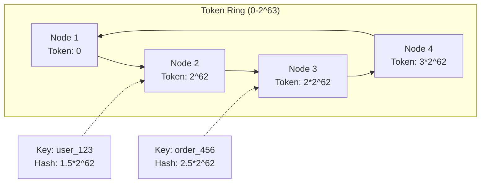
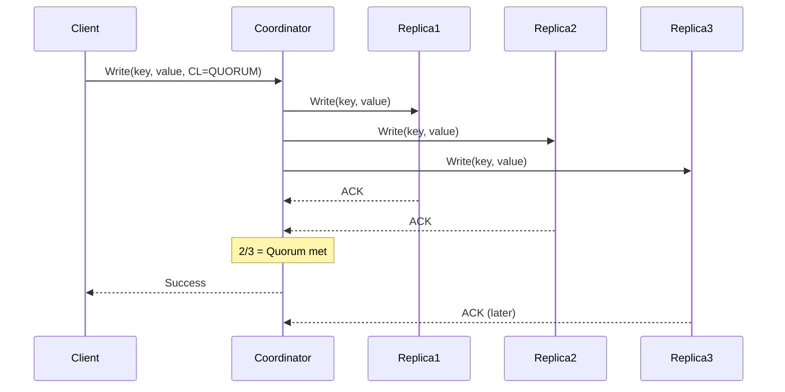
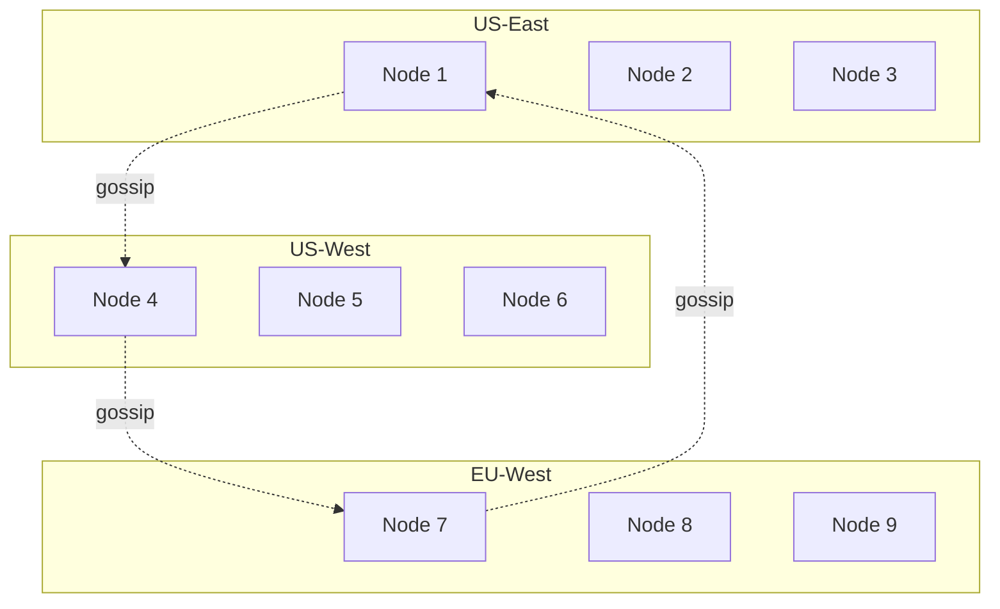

# Cassandra: Distributed Database at Scale

<span class="path-icon">💾</span>
 <span class="path-name">Database Case Studies</span>
 <span class="path-progress">3/20</span>
 <div class="mini-progress">
</div>

!!! info
 <h4>📚 Before You Begin</h4>
 <p>Make sure you understand these concepts:</p>
 <ul>
 <li><a href="/part2-pillars/state/index.md">State Distribution</a> - How to distribute data</li>
 <li><a href="/patterns/consistent-hashing.md">Consistent Hashing</a> - Data partitioning</li>
 <li><a href="//quantitative/cap-theorem">CAP Theorem</a> - Trade-offs in distributed systems</li>
 </ul>

## Executive Summary

Apache Cassandra is a distributed NoSQL database designed to handle large amounts of data across many commodity servers with no single point of failure. Originally developed at Facebook to power inbox search, it combines Amazon Dynamo's distribution model with Google Bigtable's data model.

### Key Achievements
- **Scale**: Handles 100+ PB datasets across thousands of nodes
- **Performance**: 1M+ writes/second, linear scalability
- **Availability**: No single point of failure, multi-datacenter replication
- **Use Cases**: Netflix (streaming), Discord (messages), Apple (>160k nodes)

## The Problem Space

Traditional relational databases hit scaling walls:
- **Vertical scaling limits**: Can't infinitely upgrade single machines
- **Replication lag**: Master-slave architectures create bottlenecks
- **Downtime for maintenance**: Schema changes, upgrades require outages
- **Geographic distribution**: High latency for global applications

Cassandra solves these by embracing distributed systems principles from the ground up.

## Architecture Deep Dive

### Core Design Principles

1. **Peer-to-Peer Architecture**
   - No master/slave distinction
   - Every node can handle any request
   - Symmetric design eliminates SPOF

2. **Eventual Consistency**
   - Tunable consistency levels
   - AP system in CAP theorem
   - Conflict resolution via timestamps

3. **Decentralized Everything**
   - No central config service
   - No central routing
   - No central failure point

### Data Distribution: Consistent Hashing



Each node owns a range of tokens. Data is placed on the first node with token ≥ data's hash.

### Replication Strategy

```python
class SimpleStrategy:
    """Place replicas on next N-1 nodes clockwise in ring"""
    def get_replicas(self, key, replication_factor):
        token = hash(key)
        primary = find_primary_node(token)
        
        replicas = [primary]
        current = primary
        
        while len(replicas) < replication_factor:
            current = get_next_node_clockwise(current)
            replicas.append(current)
            
        return replicas

class NetworkTopologyStrategy:
    """Place replicas across different racks/datacenters"""
    def get_replicas(self, key, dc_replication_map):
        replicas = {}
        
        for datacenter, rf in dc_replication_map.items():
            dc_nodes = get_nodes_in_datacenter(datacenter)
            dc_replicas = select_replicas_across_racks(
                dc_nodes, rf, key
            )
            replicas[datacenter] = dc_replicas
            
        return replicas
```

### Write Path

1. **Client writes to any node** (coordinator)
2. **Coordinator determines replicas** using partition key
3. **Parallel writes to all replicas**
4. **Acknowledge based on consistency level**
5. **Hints stored for down replicas**



### Storage Engine: LSM Trees

Cassandra uses Log-Structured Merge Trees for efficient writes:

```
Memory:     ┌─────────────┐
            │  MemTable   │  <- Recent writes (sorted)
            └──────┬──────┘
                   │ Flush when full
                   ↓
Disk:       ┌─────────────┐
            │  SSTable 1  │  <- Immutable sorted file
            ├─────────────┤
            │  SSTable 2  │
            ├─────────────┤
            │  SSTable 3  │
            └─────────────┘
                   ↓
            Periodic Compaction
                   ↓
            ┌─────────────┐
            │Merged SSTable│
            └─────────────┘
```

### Read Path

1. **Check MemTable** (memory)
2. **Check row cache** (if enabled)
3. **Bloom filters** eliminate SSTables
4. **Read from SSTables** (disk)
5. **Merge results** by timestamp
6. **Read repair** if inconsistent

### Gossip Protocol

Nodes discover and share state via epidemic protocol:

```python
class GossipProtocol:
    def gossip_round(self):
        # Pick random node
        peer = select_random_live_peer()
        
        # Exchange state
        my_state = get_local_state()
        peer_state = exchange_state_with(peer, my_state)
        
        # Update local view
        merge_state(peer_state)
        
        # Detect failures
        for node in all_nodes:
            if time_since_last_heartbeat(node) > threshold:
                mark_as_down(node)
```

## Consistency Levels

Cassandra offers tunable consistency per operation:

| Level | Write Behavior | Read Behavior | Use Case |
|-------|---------------|---------------|----------|
| ANY | 1 node (including hints) | N/A | Maximum availability |
| ONE | 1 replica confirms | 1 replica responds | High performance |
| QUORUM | (RF/2)+1 replicas | (RF/2)+1 replicas | Strong consistency |
| ALL | All replicas confirm | All replicas respond | Strongest (less available) |
| LOCAL_QUORUM | Quorum in local DC | Quorum in local DC | Multi-DC strong |

### Achieving Strong Consistency

With RF=3:
- Write at QUORUM (2 nodes) + Read at QUORUM (2 nodes)
- Guarantees overlap of at least 1 node
- Always see latest write

## Multi-Datacenter Deployment



### Cross-DC Replication
- Asynchronous by default
- Tunable per keyspace
- Rack-aware placement
- Local reads for low latency

## Data Modeling

### Denormalization is Key

Unlike relational databases, Cassandra optimizes for queries:

```sql
-- User by ID (primary key: user_id)
CREATE TABLE users (
    user_id uuid PRIMARY KEY,
    name text,
    email text,
    created_at timestamp
);

-- Users by email (denormalized)
CREATE TABLE users_by_email (
    email text PRIMARY KEY,
    user_id uuid,
    name text,
    created_at timestamp
);

-- User activity (wide row)
CREATE TABLE user_activity (
    user_id uuid,
    activity_time timestamp,
    activity_type text,
    details text,
    PRIMARY KEY (user_id, activity_time)
) WITH CLUSTERING ORDER BY (activity_time DESC);
```

### Time Series Data

Perfect for time-ordered data:

```sql
CREATE TABLE sensor_data (
    sensor_id uuid,
    bucket text,  -- '2024-01-15'
    timestamp timestamp,
    temperature double,
    humidity double,
    PRIMARY KEY ((sensor_id, bucket), timestamp)
) WITH CLUSTERING ORDER BY (timestamp DESC)
  AND compaction = {
    'class': 'TimeWindowCompactionStrategy',
    'compaction_window_size': '1',
    'compaction_window_unit': 'DAYS'
  };
```

## Performance Characteristics

### Write Performance
- **Complexity**: O(1) - Sequential disk writes
- **Bottleneck**: Network and disk I/O
- **Optimization**: Batch writes, async replication

### Read Performance
- **Complexity**: O(log N) - Number of SSTables
- **Bottleneck**: Disk seeks, compaction
- **Optimization**: Caching, bloom filters

### Scalability
- **Linear**: 2x nodes = ~2x throughput
- **Elastic**: Add/remove nodes online
- **Balanced**: Virtual nodes prevent hotspots

## Operational Challenges

!!! warning "Common Pitfalls"
    
    ### 1. Tombstone Accumulation
    Deletes create tombstones that persist until compaction:
    ```python
    # Bad: Frequent deletes
    DELETE FROM queue WHERE id = ?;
    
    # Better: TTL-based expiry
    INSERT INTO queue (id, data) VALUES (?, ?)
    USING TTL 3600;
    ```
    
    ### 2. Wide Row Growth
    Unbounded row growth causes performance issues:
    ```python
    # Bad: All events in one partition
    PRIMARY KEY (user_id, event_time)
    
    # Better: Bucket by time
    PRIMARY KEY ((user_id, date_bucket), event_time)
    ```
    
    ### 3. Hot Partitions
    Uneven access patterns create hotspots:
    ```python
    # Bad: Status as partition key
    PRIMARY KEY (status)  # 90% queries for status='active'
    
    # Better: Distribute load
    PRIMARY KEY ((status, bucket), created_at)
    ```

## Monitoring & Operations

### Key Metrics

| Metric | Description | Alert Threshold |
|--------|-------------|-----------------|
| Read/Write Latency | p99 response time | > 100ms |
| Pending Compactions | Backlog of compactions | > 1000 |
| Heap Usage | JVM memory pressure | > 75% |
| Hints Stored | Writes to down nodes | > 10000 |
| Node Load | Data per node | > 1TB imbalance |

### Repair Operations

```bash
# Regular repair to fix inconsistencies
nodetool repair -pr

# Incremental repair for efficiency
nodetool repair -inc

# Check consistency
nodetool verify
```

## Success Stories

### Netflix
- **Scale**: 100k+ requests/sec per cluster
- **Use Case**: User viewing history, recommendations
- **Architecture**: Multi-region active-active

### Discord
- **Scale**: Billions of messages
- **Use Case**: Message history
- **Challenge**: Migrated from MongoDB at scale

### Apple
- **Scale**: 160,000+ Cassandra nodes
- **Use Case**: Internal infrastructure
- **Achievement**: Largest known deployment

## Lessons Learned

!!! success "Best Practices"
    1. **Model around queries**: Design tables for access patterns
    2. **Embrace denormalization**: Storage is cheaper than joins
    3. **Monitor everything**: Especially compaction and GC
    4. **Test failure scenarios**: Kill nodes, partition network
    5. **Capacity planning**: Keep nodes <70% full

!!! danger "When NOT to use Cassandra"
    - Need ACID transactions
    - Complex queries with joins
    - Small datasets (<1TB)
    - Frequently changing schemas
    - Limited operational expertise

## Related Patterns

<a href="/patterns/consistent-hashing.md" class="related-item">
 <span class="item-icon">#️⃣</span>
 <span class="item-title">Consistent Hashing</span>
 <span class="item-type">pattern</span>
 </a>
 <a href="/patterns/lsm-tree/" class="related-item">
 <span class="item-icon">🌳</span>
 <span class="item-title">LSM Trees</span>
 <span class="item-type">pattern</span>
 </a>
 <a href="/patterns/gossip/" class="related-item">
 <span class="item-icon">💬</span>
 <span class="item-title">Gossip Protocol</span>
 <span class="item-type">pattern</span>
 </a>
 <a href="/case-studies/dynamodb/" class="related-item">
 <span class="item-icon">🔀</span>
 <span class="item-title">DynamoDB</span>
 <span class="item-type">case-study</span>
 </a>

## Next Steps

<div class="step-card level-beginner">
 <span class="level-badge">Beginner</span>
 <h4><a href="/tutorials/cassandra-deployment/">Deploy Cassandra Cluster</a></h4>
 <p>Set up a 3-node cluster and understand the basics.</p>
 
 <span class="level-badge">Intermediate</span>
 <h4><a href="/tutorials/cassandra-data-modeling/">Data Modeling for Cassandra</a></h4>
 <p>Learn query-driven design and denormalization patterns.</p>
 
 <span class="level-badge">Advanced</span>
 <h4><a href="/tutorials/cassandra-operations/">Operating Cassandra at Scale</a></h4>
 <p>Master repairs, compaction tuning, and performance optimization.</p>
</div>

## Key Takeaways

!!! quote "The Cassandra Philosophy"
    "Cassandra is not trying to be a relational database. It's trying to be a highly available, scalable, distributed storage system." - Jonathan Ellis, Cassandra co-founder

1. **Embrace eventual consistency**: Perfect consistency isn't always necessary
2. **Design for failure**: Nodes will fail, networks will partition
3. **Query-driven modeling**: Let access patterns drive schema
4. **Linear scalability**: More nodes = more capacity
5. **Operational simplicity**: Symmetric design reduces complexity

---

<div class="progress-bar">
 <div class="progress-fill">
 </div>
 Progress: 3 of 20 database case studies completed
</div>