# Apache Cassandra: Masterless Distributed Database

!!! abstract "The Cassandra Story"
    **🎯 Single Achievement**: First database to achieve true linear scaling
    **📊 Scale**: Netflix: 2,500 nodes, 420TB, 4.5M reads/sec
    **⏱️ Performance**: Discord: 14B messages, 8ms p99 latency
    **💡 Key Innovation**: Masterless ring with tunable consistency

## Why Cassandra Matters

| Traditional Database | Cassandra Innovation | Business Impact |
|---------------------|---------------------|----------------|
| **Master-slave** → bottleneck | **Masterless ring** → infinite scale | Netflix: 4.5M reads/sec |
| **Fixed consistency** | **Tunable per-query** | Right tool for each use case |
| **Manual sharding** | **Auto-distribution** | Zero downtime scaling |
| **Single DC** | **Multi-region native** | Global availability |

## Part 1: The Physics of Masterless Architecture

### Visual Architecture Overview

```mermaid
graph TB
    subgraph "Traditional: Single Point of Failure"
        M[Master 🔴] --> S1[Slave]
        M --> S2[Slave]
        M --> S3[Slave]
        X[❌ Master Dies = Total Outage]
    end
    
    subgraph "Cassandra: No Single Point of Failure"
        N1[Node 1] <--> N2[Node 2]
        N2 <--> N3[Node 3]
        N3 <--> N4[Node 4]
        N4 <--> N1
        Y[✅ Any Node Dies = Continues]
    end
    
    style M fill:#ff5252,color:#fff
    style Y fill:#4caf50,color:#fff
```

```mermaid
graph TB
 subgraph "Traditional Master-Slave (Failure Prone)"
 M[Master Node<br/>SPOF]
 S1[Slave 1]
 S2[Slave 2] 
 S3[Slave 3]
 
 M --> S1
 M --> S2
 M --> S3
 
 X[❌ Master Fails<br/>= Total Outage]
 end
 
 subgraph "Cassandra Ring (Failure Resilient)"
 C1[Node 1<br/>Tokens: 0-85]
 C2[Node 2<br/>Tokens: 86-170]
 C3[Node 3<br/>Tokens: 171-255]
 C4[Node 4<br/>Tokens: 256-340]
 
 C1 --> C2
 C2 --> C3
 C3 --> C4
 C4 --> C1
 
 Y[✅ Any Node Fails<br/>= Continued Operation]
 end
 
 classDef problem fill:#ffcdd2,stroke:#d32f2f
 classDef solution fill:#c8e6c9,stroke:#388e3c
 
 class M,S1,S2,S3,X problem
 class C1,C2,C3,C4,Y solution
```





### Architecture Impact Matrix

| Metric | Master-Slave | Cassandra Ring | Real-World Impact |
|--------|--------------|----------------|-------------------|
| **Single Points** | 1+ (master) | 0 | Never goes down |
| **Availability** | 99.9% (8h/yr) | 99.999% (5m/yr) | 1600x better |
| **Write Scale** | Vertical only | Horizontal | Infinite growth |
| **Recovery** | Manual failover | Automatic | Zero ops burden |


### CAP Trade-offs Visualized

```mermaid
graph LR
    subgraph "CAP Triangle"
        C[Consistency] -.->|Choose 2| A[Availability]
        A -.-> P[Partition Tolerance]
        P -.-> C
    end
    
    subgraph "Database Choices"
        RDBMS["RDBMS<br/>CA (No P)"] --> FAIL["❌ Fails in partitions"]
        HBASE["HBase<br/>CP (No A)"] --> DOWN["❌ Goes down"]
        CASS["Cassandra<br/>AP (Tunable C)"] --> TUNE["✅ You choose!"]
    end
    
    style CASS fill:#4caf50,color:#fff
    style FAIL fill:#ff5252,color:#fff
    style DOWN fill:#ff5252,color:#fff
```



## Part 2: Core Architecture Components

### Consistent Hashing Ring

```mermaid
graph TB
 subgraph "Token Ring (0-2^127)"
 T0["Token 0<br/>Node A"]
 T64["Token 2^125<br/>Node B"]
 T128["Token 2^126<br/>Node C"]
 T192["Token 3×2^125<br/>Node D"]
 
 T0 -->|Clockwise| T64
 T64 --> T128
 T128 --> T192
 T192 --> T0
 end
 
 subgraph "Key Placement"
 K1["Key: 'user123'<br/>Hash: 45"]
 K2["Key: 'user456'<br/>Hash: 200"]
 
 K1 -->|"Goes to Node A<br/>(next token ≥ 45)"| T64
 K2 -->|"Goes to Node D<br/>(next token ≥ 200)"| T0
 end
 
 subgraph "Replication (RF=3)"
 R1["Primary: Node A"]
 R2["Replica 1: Node B"]
 R3["Replica 2: Node C"]
 
 R1 --> R2
 R2 --> R3
 end
```



### How Data Finds Its Home

| Step | Action | Example |
|------|--------|---------|  
| 1️⃣ | **Hash key** | `user123` → `45782...` |
| 2️⃣ | **Find token** | Token = `45782 % 2^127` |
| 3️⃣ | **Locate node** | Next node ≥ token |
| 4️⃣ | **Replicate** | Next N nodes (RF=3) |


### Gossip Protocol for Membership


### Gossip Protocol Visualized


| Gossip Component | Purpose | Update Frequency |
|-----------------|---------|------------------|
| **Heartbeat** | Liveness detection | Every 1 sec |
| **Schema** | Table definitions | On change |
| **Load** | Node capacity | Every 10 sec |
| **Status** | UP/DOWN state | Immediate |

**Failure Detection Algorithm:**

1. **Heartbeat Tracking**: Each node tracks heartbeat versions
2. **Phi Accrual Detector**: Adaptive failure detection based on network conditions
3. **Gossip Propagation**: Failure information spreads through gossip
4. **Quarantine**: Failed nodes marked as down but not removed

### Data Model and Storage Engine

#### Partition Key Design


**CQL Schema Example:**

```sql
CREATE TABLE user_events (
 user_id UUID, -- Partition key (determines node placement)
 timestamp TIMESTAMP, -- Clustering key (sorts within partition)
 event_type TEXT, -- Regular column
 event_data JSON, -- Regular column
 PRIMARY KEY (user_id, timestamp)
) WITH CLUSTERING ORDER BY (timestamp DESC);

-- Efficient query (single partition)
SELECT * FROM user_events 
WHERE user_id = 123e4567-e89b-12d3-a456-426614174000
AND timestamp > '2025-01-01';

-- Inefficient query (requires scatter-gather across all nodes)
SELECT * FROM user_events WHERE event_type = 'login'; -- ❌ Avoid
```

#### LSM Tree Storage Engine

```mermaid
graph TB
 subgraph "Write Path"
 W[Write Request] --> ML[MemTable<br/>In-memory sorted tree]
 ML -->|Full| WAL[Write-Ahead Log<br/>Commit log on disk]
 ML -->|Flush| SST1[SSTable Level 0<br/>Immutable sorted file]
 
 SST1 -->|Compaction| SST2[SSTable Level 1<br/>Larger sorted files]
 SST2 -->|Compaction| SST3[SSTable Level 2<br/>Even larger files]
 end
 
 subgraph "Read Path"
 R[Read Request] --> BF[Bloom Filter<br/>"Probably not here"]
 BF -->|Maybe exists| ML
 BF -->|Maybe exists| SST1
 BF -->|Maybe exists| SST2
 BF -->|Maybe exists| SST3
 
 ML --> MERGE[Merge Results<br/>Latest timestamp wins]
 SST1 --> MERGE
 SST2 --> MERGE
 SST3 --> MERGE
 end
```

**Compaction Strategies:**

| Strategy | Use Case | Write Amplification | Read Amplification |
|----------|----------|-------------------|------------------|
| **Size Tiered** | Write-heavy | Low | High |
| **Leveled** | Read-heavy | High | Low |
| **Time Window** | Time series | Medium | Medium |


## Part 3: Consistency and Replication

### Tunable Consistency Levels

!!! note "🎯 Design Decision: Tunable Consistency"
 **Problem**: Different use cases need different consistency guarantees 
 **Solution**: Allow per-query consistency level selection

```mermaid
graph TB
 subgraph "Consistency Levels (RF=3)"
 ONE["CL=ONE<br/>1 replica responds<br/>Fastest, eventual consistency"]
 QUORUM["CL=QUORUM<br/>2 replicas respond<br/>Strong consistency"]
 ALL["CL=ALL<br/>3 replicas respond<br/>Strongest, but fragile"]
 
 ONE -->|"Write: Fast<br/>Read: May be stale"| PERF["⚡ Performance"]
 QUORUM -->|"Write: Moderate<br/>Read: Consistent"| BAL["⚖️ Balanced"]
 ALL -->|"Write: Slow<br/>Read: Always fresh"| CONS["🔒 Consistency"]
 end
 
 subgraph "Read + Write Consistency"
 RULE["R + W > RF<br/>= Strong Consistency"]
 EX1["CL=QUORUM + CL=QUORUM<br/>= Always consistent"]
 EX2["CL=ONE + CL=ALL<br/>= Always consistent"]
 EX3["CL=ONE + CL=ONE<br/>= Eventually consistent"]
 end
```



**Consistency Examples:**

```python
# Banking application - Strong consistency required
result = session.execute(
 "UPDATE accounts SET balance = ? WHERE account_id = ?",
 [new_balance, account_id],
 consistency_level=ConsistencyLevel.QUORUM
)

# Social media feed - Eventual consistency acceptable
result = session.execute(
 "INSERT INTO user_timeline (user_id, post_id, timestamp) VALUES (?, ?, ?)",
 [user_id, post_id, now],
 consistency_level=ConsistencyLevel.ONE
)

# Analytics query - Read latest data
result = session.execute(
 "SELECT COUNT(*) FROM page_views WHERE date = ?",
 [today],
 consistency_level=ConsistencyLevel.ALL
)
```

### Anti-Entropy and Repair


**Repair Mechanisms:**

1. **Read Repair**: Fixes inconsistencies during reads
2. **Hinted Handoff**: Stores writes for temporarily down nodes
3. **Anti-Entropy Repair**: Periodic Merkle tree comparison
4. **Manual Repair**: Full repair of token ranges

## Part 4: Performance and Scaling Patterns

### Linear Scalability

!!! info "💡 Insight: True Linear Scaling"
 Cassandra is one of the few databases that actually achieves linear scaling - doubling nodes roughly doubles throughput, even at massive scale.


**Netflix Scale Example:**

| Metric | Value | Notes |
|--------|-------|-------|
| **Nodes** | 2,500+ | Across multiple regions |
| **Data** | 420TB | Compressed |
| **Writes** | 1.3M/sec | Peak traffic |
| **Reads** | 4.5M/sec | Peak traffic |
| **Availability** | 99.99% | With region failures |


### Data Modeling Best Practices

#### Query-First Design


**Example: User Profile Service**

```sql
-- Query 1: Get user profile by ID
CREATE TABLE user_profiles (
 user_id UUID PRIMARY KEY,
 username TEXT,
 email TEXT,
 created_at TIMESTAMP,
 profile_data JSON
);

-- Query 2: Get user by username (different access pattern)
CREATE TABLE users_by_username (
 username TEXT PRIMARY KEY,
 user_id UUID,
 email TEXT,
 created_at TIMESTAMP
);

-- Query 3: Get users by email domain (for admin)
CREATE TABLE users_by_email_domain (
 email_domain TEXT,
 user_id UUID,
 username TEXT,
 email TEXT,
 PRIMARY KEY (email_domain, user_id)
);
```

### Data Modeling Decision Matrix

| If You Need... | Don't Do This ❌ | Do This Instead ✅ | Why |
|----------------|------------------|-------------------|-----|
| **User by email** | Secondary index | Separate table | 100x faster |
| **Time series** | All in one partition | Time buckets | Prevents hot spots |
| **Counters** | Read-modify-write | Counter columns | Atomic operations |
| **Full text search** | LIKE queries | Elasticsearch | Wrong tool |
| **Transactions** | Multiple tables | Single partition | ACID within partition |


## Part 5: Real-World Production Challenges

### Netflix's Zero-Downtime Migration

```mermaid
graph LR
    subgraph "Week 1-4: Dual Write"
        APP1[App] -->|Write| O1[Oracle]
        APP1 -->|Write| C1[Cassandra]
        APP1 -->|Read| O1
    end
    
    subgraph "Week 5-8: Validate"
        APP2[App] -->|Write| BOTH[Both DBs]
        VAL[Validator] -->|Compare| BOTH
    end
    
    subgraph "Week 9-12: Switch"
        APP3[App] -->|Write| C3[Cassandra]
        APP3 -->|Read| C3
        O3[Oracle] -->|Decomm| X[❌]
    end
    
    style C3 fill:#4caf50,color:#fff
    style X fill:#ff5252,color:#fff
```



| Phase | Duration | Risk | Rollback Time |
|-------|----------|------|---------------|
| **Dual Write** | 4 weeks | Low | Instant |
| **Validation** | 4 weeks | Low | Instant |  
| **Read Switch** | 2 weeks | Medium | < 1 min |
| **Write Switch** | 2 weeks | High | < 5 min |


### Migration Success Factors

| Factor | Impact | Implementation |
|--------|--------|----------------|
| **Data Validation** | Found 0.01% drift | Continuous checksums |
| **Load Testing** | Prevented 3 outages | 2x production load |
| **Runbook Automation** | 90% faster recovery | Ansible playbooks |
| **Team Training** | Zero incidents | 2-week bootcamp |

### Discord's Scaling Story

!!! info "💡 Insight: From Millions to Billions"
 Discord scaled from 1 million to 14 billion messages using Cassandra, but had to solve hot partition problems through better data modeling.

**Original Schema (Hot Partition Problem):**

```sql
-- ❌ All messages in one channel = hot partition
CREATE TABLE messages (
 channel_id BIGINT, -- Hot partition for popular channels
 message_id BIGINT,
 author_id BIGINT,
 content TEXT,
 PRIMARY KEY (channel_id, message_id)
);
```

**Improved Schema (Time Bucketing):**

```sql
-- ✅ Time-based bucketing distributes load
CREATE TABLE messages (
 channel_id BIGINT,
 bucket INT, -- Time bucket (day number)
 message_id BIGINT,
 author_id BIGINT,
 content TEXT,
 PRIMARY KEY ((channel_id, bucket), message_id)
) WITH CLUSTERING ORDER BY (message_id DESC);
```

**Performance Impact:**

| Metric | Before Bucketing | After Bucketing | Improvement |
|--------|-----------------|-----------------|-------------|
| Write latency p99 | 500ms | 15ms | 97% |
| Read latency p99 | 200ms | 8ms | 96% |
| Hot partition warnings | Daily | None | 100% |


## Part 6: Operational Excellence

### Monitoring and Alerting


**Critical Alerts Configuration:**

```yaml
# cassandra-alerts.yml
alerts:
 - name: CassandraNodeDown
 expr: up{job="cassandra"} == 0
 for: 1m
 severity: critical
 summary: "Cassandra node {{ $labels.instance }} is down"
 
 - name: CassandraHighGCTime
 expr: cassandra_gc_time_seconds > 0.1
 for: 5m
 severity: warning
 summary: "High GC time on {{ $labels.instance }}"
 
 - name: CassandraUnreachableNodes
 expr: cassandra_unreachable_nodes > 0
 for: 2m
 severity: critical
 summary: "{{ $value }} Cassandra nodes unreachable"
 
 - name: CassandraRepairLag
 expr: time() - cassandra_last_repair_timestamp > 604800 # 7 days
 for: 1h
 severity: warning
 summary: "Cassandra repair overdue on {{ $labels.instance }}"
```

### Backup and Disaster Recovery

#### Incremental Backup Strategy


**Backup Script Example:**

```bash
# !/bin/bash
# Cassandra backup automation

KEYSPACE="user_data"
BAKUP_DIR="/backup/cassandra"
S3_BUCKET="company-cassandra-backups"
DATE=$(date +%Y%m%d_%H%M%S)

# Create snapshot
nodetool snapshot -t $DATE $KEYSPACE

# Find snapshot directory
SNAPSHOT_DIR=$(find /var/lib/cassandra/data/$KEYSPACE -name $DATE)

# Compress and upload to S3
tar -czf $BAKUP_DIR/snapshot_$DATE.tar.gz $SNAPSHOT_DIR
aws s3 cp $BAKUP_DIR/snapshot_$DATE.tar.gz s3://$S3_BUCKET/snapshots/

# Clean up local snapshot
nodetool clearsnapshot -t $DATE $KEYSPACE

# Rotate old backups (keep 7 days locally)
find $BAKUP_DIR -name "snapshot_*.tar.gz" -mtime +7 -delete

echo "Backup completed: snapshot_$DATE.tar.gz"
```

### Security Configuration

#### Authentication and Authorization

```yaml
# cassandra.yaml security configuration
authenticator: PasswordAuthenticator
authorizer: CassandraAuthorizer
role_manager: CassandraRoleManager

# Enable encryption
server_encryption_options:
 internode_encryption: all
 keystore: /path/to/keystore.jks
 keystore_password: changeit
 truststore: /path/to/truststore.jks
 truststore_password: changeit
 protocol: TLS
 cipher_suites: [TLS_RSA_WITH_AES_128_CBC_SHA]

client_encryption_options:
 enabled: true
 keystore: /path/to/keystore.jks
 keystore_password: changeit
```

**Role-Based Access Control:**

```sql
-- Create roles with specific permissions
CREATE ROLE app_reader WITH PASSWORD = 'secure_password' AND LOGIN = true;
CREATE ROLE app_writer WITH PASSWORD = 'secure_password' AND LOGIN = true;
CREATE ROLE admin_user WITH PASSWORD = 'admin_password' AND LOGIN = true AND SUPERUSER = true;

-- Grant permissions
GRANT SELECT ON KEYSPACE user_data TO app_reader;
GRANT MODIFY ON KEYSPACE user_data TO app_writer;
GRANT ALL PERMISSIONS ON KEYSPACE user_data TO admin_user;

-- Create application-specific keyspace access
GRANT SELECT ON user_data.user_profiles TO 'profile_service';
GRANT MODIFY ON user_data.user_events TO 'event_service';
```

## Part 7: Key Takeaways and Design Principles

### Cassandra Design Philosophy

!!! note "🎯 Core Design Principles"
 <ol>
 <li><strong>Masterless architecture</strong>: Every node is equal, no single point of failure</li>
 <li><strong>Tunable consistency</strong>: Choose the right consistency level per query</li>
 <li><strong>Query-first modeling</strong>: Design tables for your access patterns</li>
 <li><strong>Linear scalability</strong>: Adding nodes increases capacity predictably</li>
 </ol>

## Decision Guide

### Use Case Fit Matrix

| Your Need | Cassandra Fit | Alternative | Why |
|-----------|---------------|-------------|-----|
| **Chat messages** | ✅ Excellent | - | Time-series, high write |
| **User profiles** | ✅ Excellent | - | Key-value, global scale |
| **IoT sensors** | ✅ Excellent | - | Time-series, high volume |
| **Shopping cart** | ✅ Good | DynamoDB | Eventual consistency OK |
| **Social feed** | ✅ Good | Redis | Read-heavy optimization |
| **Inventory** | ❌ Poor | PostgreSQL | Needs transactions |
| **Banking** | ❌ Poor | Spanner | Needs strong consistency |
| **Analytics** | ⚠️ Maybe | ClickHouse | Depends on queries |

### Cost Analysis

| Scale | Cassandra TCO | RDBMS TCO | Savings |
|-------|---------------|-----------|---------|  
| **100GB** | Higher | Lower | Use RDBMS |
| **1TB** | Equal | Equal | Either works |
| **10TB** | Lower | Higher | 30% savings |
| **100TB** | Much Lower | Very High | 70% savings |
| **1PB** | Linear cost | Exponential | 90% savings |

### Performance Optimization Checklist

1. **Data Modeling**
 - Design tables for specific queries
 - Avoid large partitions (>100MB)
 - Use appropriate partition keys
 - Minimize materialized views

2. **Hardware Optimization**
 - Use SSDs for all data
 - Separate commit logs from data
 - Adequate RAM (8GB+ heap)
 - Fast network for multi-DC

3. **Configuration Tuning**
 - Appropriate compaction strategy
 - GC tuning for low latency
 - Connection pooling
 - Batch size optimization

4. **Operational Excellence**
 - Regular repair operations
 - Monitoring key metrics
 - Automated backups
 - Security hardening

## Conclusion

Apache Cassandra demonstrates how embracing the constraints of distributed systems can lead to breakthrough capabilities. By accepting eventual consistency and eliminating single points of failure, Cassandra achieves linear scalability that few databases can match.

The masterless ring architecture, combined with tunable consistency and sophisticated gossip protocols, creates a system that becomes more reliable as it grows larger. This counter-intuitive property makes Cassandra ideal for modern applications that need to scale globally.

Understanding Cassandra's approach to distributed data management provides insights applicable to many systems: the power of peer-to-peer architectures, the importance of design-time trade-offs, and the operational benefits of simplicity at scale.

## Related Topics

### Related Laws & Axioms
- [Law 1: Correlated Failure](/part1-axioms/law1-failure/) - Masterless architecture eliminates single points of failure
- [Law 2: Asynchronous Reality](/part1-axioms/law2-asynchrony/) - Gossip protocol and eventual consistency
- [Law 4: Multidimensional Optimization](/part1-axioms/law4-tradeoffs/) - CAP theorem trade-offs in Cassandra
- [Law 5: Distributed Knowledge](/part1-axioms/law5-epistemology/) - Gossip-based membership and failure detection

### Related Patterns
- [Consistent Hashing](/patterns/consistent-hashing/) - Core data distribution mechanism
- [Gossip Protocol](/patterns/gossip-protocol/) - Membership and failure detection
- [Merkle Trees](/patterns/merkle-trees/) - Anti-entropy repair mechanism
- [Vector Clocks](/patterns/vector-clocks/) - Conflict resolution in distributed writes
- [LSM Trees](/patterns/lsm-tree/) - Storage engine design
- [Bloom Filters](/patterns/bloom-filter/) - Read optimization

### Related Pillars
- [Pillar 2: State](/part2-pillars/state/) - Distributed state management at scale
- [Pillar 3: Truth](/part2-pillars/truth/) - Tunable consistency levels
- [Pillar 4: Control](/part2-pillars/control/) - Masterless coordination

### Quantitative Analysis
- [CAP Theorem](/quantitative/cap-theorem/) - Understanding Cassandra's AP choice
- [Consistency Models](/quantitative/consistency-models/) - Tunable consistency mathematics
- [Performance Modeling](/quantitative/performance-modeling/) - Linear scalability analysis
- [Failure Models](/quantitative/failure-models/) - Understanding failure domains

### Case Studies
- [Amazon DynamoDB](/case-studies/amazon-dynamo/) - Similar dynamo-style architecture
- [Netflix at Scale](/case-studies/netflix-scale/) - Using Cassandra for global streaming
- [Discord Messages](/case-studies/discord-messages/) - Storing billions of messages
- [ScyllaDB](/case-studies/scylladb/) - C++ reimplementation of Cassandra

### Further Reading
- [NoSQL Database Patterns](/patterns/nosql-patterns/) - Broader NoSQL design patterns
- [Time Series Databases](/patterns/time-series-db/) - Cassandra for time series data
- [Multi-Region Replication](/patterns/multi-region/) - Global Cassandra deployments
- [Database Internals](/patterns/database-internals/) - Deep dive into storage engines

## External Resources
- [Cassandra Architecture Documentation](https://cassandra.apache.org/doc/latest/architecture/)¹
- [DataStax Best Practices](https://docs.datastax.com/en/cassandra-oss/3.x/cassandra/dml/dmlBestPractices.html)²
- [Netflix Tech Blog - Cassandra](https://netflixtechblog.com/tagged/cassandra)³
- [Discord Engineering - Cassandra](https://discord.com/blog/how-discord-stores-billions-of-messages)⁴