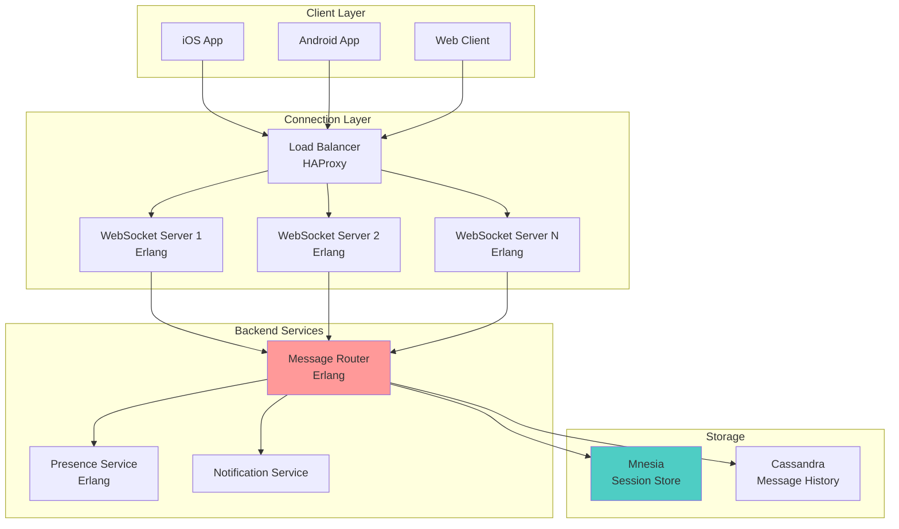
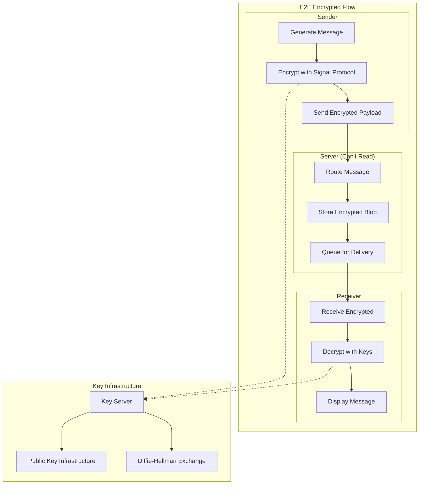
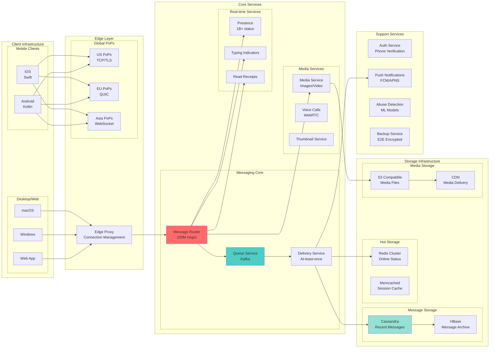
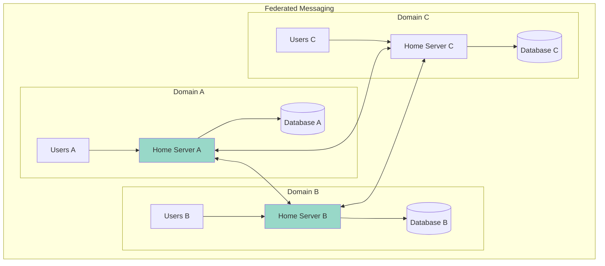
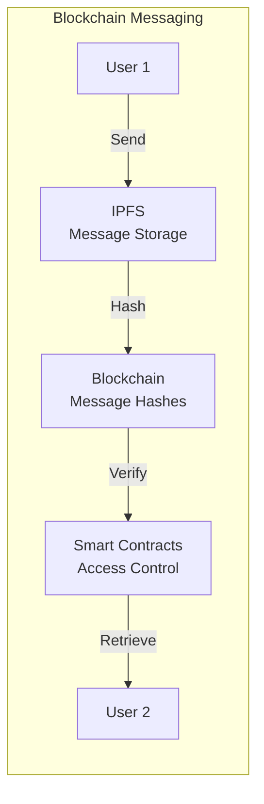
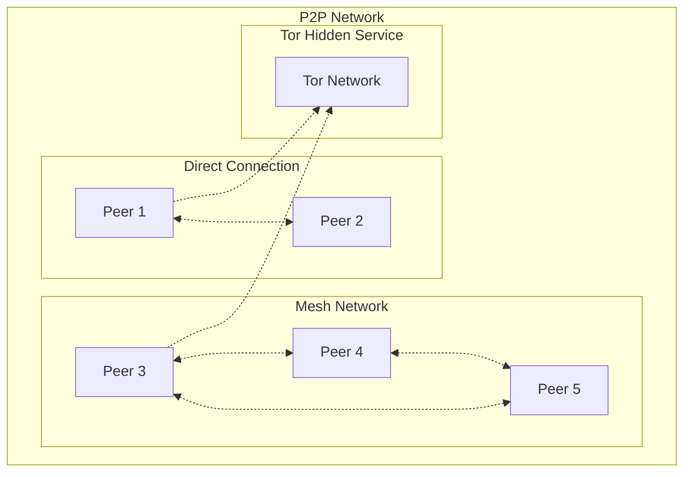
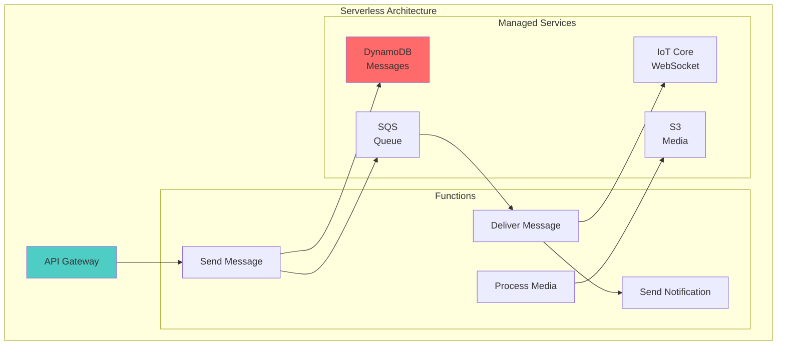
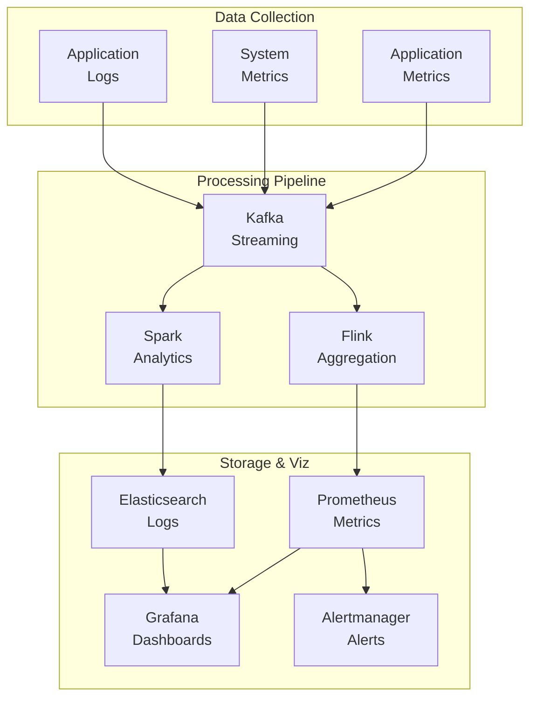

<!-- Navigation -->
[Home](../index.md) → [Case Studies](index.md) → **Real-Time Chat System Architecture**

# 💬 Real-Time Chat System Architecture

**The Challenge**: Build a messaging system handling 100B+ messages/day with end-to-end encryption and global reach

!!! info "Case Study Sources"
    This analysis is based on:
    - WhatsApp Engineering: "The WhatsApp Architecture"¹
    - Signal Protocol Documentation²
    - Erlang/Elixir at WhatsApp³
    - Facebook Messenger Scale⁴
    - Discord Engineering Blog⁵

---

## 🏗️ Architecture Evolution

### Phase 1: Simple Client-Server Model (2009-2010)

```text
Mobile App → XMPP Server → MySQL → Mobile App
```

**Problems Encountered:**
- XMPP overhead too high for mobile
- Database couldn't handle message volume
- No offline message delivery
- Battery drain on mobile devices

**Patterns Violated**: 
- ❌ No [Message Queue](../patterns/message-queue.md)
- ❌ No [Connection Pooling](../patterns/connection-pooling.md)
- ❌ Synchronous delivery only

### Phase 2: Custom Protocol & Erlang (2010-2012)



**Key Design Decision: Erlang/OTP for Core**
- **Trade-off**: Learning curve vs Scalability (Pillar: [Work Distribution](../part2-pillars/work/index.md))
- **Choice**: Erlang's actor model for millions of concurrent connections
- **Result**: 2M connections per server
- **Pattern Applied**: [Actor Model](../patterns/actor-model.md)

According to WhatsApp engineering¹, this allowed them to handle 1M concurrent users per server.

### Phase 3: End-to-End Encryption (2012-2016)



**Innovation: Signal Protocol Implementation**²
- Double Ratchet Algorithm
- Perfect Forward Secrecy
- Future Secrecy
- Deniable Authentication

**Patterns & Pillars Applied**:
- 🔧 Pattern: [End-to-End Encryption](../patterns/e2e-encryption.md)
- 🔧 Pattern: [Key Management](../patterns/key-management.md)
- 🏛️ Pillar: [Truth & Consistency](../part2-pillars/truth/index.md) - Cryptographic guarantees
- 🏛️ Pillar: [Control Flow](../part2-pillars/control/index.md) - Secure message routing

### Phase 4: Global Scale Architecture (2016-Present)



**Scale Achievements**:
- 100B+ messages/day
- 2B+ monthly active users
- 1M+ concurrent voice calls
- 99.99% message delivery rate

## 📊 Core Components Deep Dive

### 1. Connection Management

```python
class ConnectionManager:
    """Manage millions of persistent connections"""
    
    def __init__(self):
        self.connections = {}  # user_id -> connection
        self.connection_pools = {}  # region -> pool
        self.heartbeat_interval = 30  # seconds
        self.idle_timeout = 300  # 5 minutes
        
    async def handle_connection(self, websocket, user_id: str):
        """Handle individual user connection lifecycle"""
        try:
            # 1. Authenticate connection
            auth_token = await self._authenticate(websocket)
            if not self._verify_token(auth_token, user_id):
                await websocket.close(code=4001, reason="Unauthorized")
                return
                
            # 2. Register connection
            connection = Connection(
                ws=websocket,
                user_id=user_id,
                connected_at=datetime.utcnow(),
                last_ping=datetime.utcnow()
            )
            self.connections[user_id] = connection
            
            # 3. Restore session state
            await self._restore_session(user_id, connection)
            
            # 4. Start heartbeat
            heartbeat_task = asyncio.create_task(
                self._heartbeat_loop(connection)
            )
            
            # 5. Handle messages
            async for message in websocket:
                await self._process_message(user_id, message)
                
        except WebSocketDisconnect:
            await self._handle_disconnect(user_id)
        finally:
            heartbeat_task.cancel()
            self.connections.pop(user_id, None)

class AdaptiveHeartbeat:
    """Optimize heartbeat based on network conditions"""
    
    def __init__(self):
        self.min_interval = 10
        self.max_interval = 60
        self.network_quality_threshold = 0.8
        
    def calculate_interval(self, connection_stats: dict) -> int:
        """Adaptive heartbeat interval"""
        packet_loss = connection_stats.get('packet_loss', 0)
        latency = connection_stats.get('latency', 0)
        
        # Calculate network quality score
        quality_score = 1.0 - (packet_loss + latency / 1000)
        
        if quality_score > self.network_quality_threshold:
            # Good network - longer intervals
            return self.max_interval
        else:
            # Poor network - shorter intervals
            return max(
                self.min_interval,
                int(self.max_interval * quality_score)
            )
```

### 2. Message Routing & Delivery

```python
class MessageRouter:
    """High-performance message routing"""
    
    def __init__(self):
        self.routing_table = {}  # user_id -> server_id
        self.message_queue = AsyncQueue()
        self.delivery_timeout = 30  # seconds
        self.retry_policy = ExponentialBackoff(
            initial=1, maximum=60, multiplier=2
        )
        
    async def route_message(self, message: Message) -> DeliveryStatus:
        """Route message to recipient(s)"""
        # 1. Validate message
        if not await self._validate_message(message):
            return DeliveryStatus.INVALID
            
        # 2. Find recipient location
        recipient_server = self.routing_table.get(message.recipient_id)
        
        if recipient_server:
            # Online delivery
            return await self._deliver_online(message, recipient_server)
        else:
            # Offline delivery
            return await self._queue_offline(message)
    
    async def _deliver_online(self, message: Message, 
                            server_id: str) -> DeliveryStatus:
        """Deliver to online recipient"""
        try:
            # Direct delivery attempt
            async with timeout(self.delivery_timeout):
                response = await self._send_to_server(
                    server_id, 
                    message
                )
                
            if response.status == 'delivered':
                await self._send_delivery_receipt(message)
                return DeliveryStatus.DELIVERED
            else:
                return await self._queue_for_retry(message)
                
        except asyncio.TimeoutError:
            return await self._queue_for_retry(message)

class MessageQueue:
    """Reliable message queuing with Kafka"""
    
    def __init__(self):
        self.producer = KafkaProducer(
            bootstrap_servers=['kafka1:9092', 'kafka2:9092'],
            acks='all',  # Wait for all replicas
            compression_type='lz4',
            retries=3
        )
        self.consumer_groups = {
            'delivery': 'message-delivery-group',
            'backup': 'message-backup-group',
            'analytics': 'message-analytics-group'
        }
        
    async def queue_message(self, message: Message, 
                          priority: str = 'normal') -> str:
        """Queue message for processing"""
        # 1. Serialize message
        serialized = self._serialize_message(message)
        
        # 2. Determine partition
        partition = self._calculate_partition(
            message.recipient_id,
            priority
        )
        
        # 3. Send to Kafka
        future = await self.producer.send(
            topic=f'messages-{priority}',
            value=serialized,
            partition=partition,
            timestamp_ms=int(message.timestamp.timestamp() * 1000)
        )
        
        # 4. Wait for confirmation
        record_metadata = await future
        
        return f"{record_metadata.topic}:{record_metadata.partition}:{record_metadata.offset}"
```

### 3. End-to-End Encryption Implementation

```python
class SignalProtocolImplementation:
    """Signal Protocol for E2E encryption"""
    
    def __init__(self):
        self.identity_key_store = IdentityKeyStore()
        self.prekey_store = PreKeyStore()
        self.signed_prekey_store = SignedPreKeyStore()
        self.session_store = SessionStore()
        
    async def encrypt_message(self, plaintext: str, 
                            recipient_id: str) -> EncryptedMessage:
        """Encrypt message using Signal Protocol"""
        # 1. Get or create session
        session = await self._get_or_create_session(recipient_id)
        
        # 2. Encrypt using Double Ratchet
        ciphertext = session.encrypt(plaintext.encode('utf-8'))
        
        # 3. Package with metadata
        return EncryptedMessage(
            version=3,
            recipient_id=recipient_id,
            ciphertext=ciphertext,
            timestamp=datetime.utcnow(),
            ephemeral_key=session.get_ephemeral_public_key()
        )
    
    async def _get_or_create_session(self, recipient_id: str) -> Session:
        """Get existing session or create new one"""
        # Check for existing session
        if self.session_store.contains_session(recipient_id):
            return self.session_store.load_session(recipient_id)
            
        # Create new session
        # 1. Get recipient's bundle
        bundle = await self._fetch_prekey_bundle(recipient_id)
        
        # 2. Process bundle
        session_builder = SessionBuilder(
            self.session_store,
            self.prekey_store,
            self.signed_prekey_store,
            self.identity_key_store,
            recipient_id
        )
        
        session_builder.process_prekey_bundle(bundle)
        
        return self.session_store.load_session(recipient_id)

class DoubleRatchetProtocol:
    """Core Double Ratchet implementation"""
    
    def __init__(self):
        self.root_key = None
        self.chain_key_send = None
        self.chain_key_receive = None
        self.dh_ratchet_key_pair = None
        self.dh_remote_public_key = None
        
    def encrypt(self, plaintext: bytes) -> bytes:
        """Encrypt with forward secrecy"""
        # 1. Derive message key
        message_key = self._kdf_ck(self.chain_key_send)
        
        # 2. Update chain key
        self.chain_key_send = self._kdf_ck(self.chain_key_send, constant=1)
        
        # 3. Encrypt message
        ciphertext = self._aes_encrypt(plaintext, message_key)
        
        # 4. Ratchet if needed
        if self._should_ratchet():
            self._dh_ratchet()
            
        return ciphertext
```

### 4. Media Handling

```python
class MediaService:
    """Handle images, videos, voice notes"""
    
    def __init__(self):
        self.max_image_size = 16 * 1024 * 1024  # 16MB
        self.max_video_size = 100 * 1024 * 1024  # 100MB
        self.supported_formats = {
            'image': ['jpg', 'jpeg', 'png', 'gif', 'webp'],
            'video': ['mp4', 'mov', 'avi'],
            'audio': ['mp3', 'aac', 'opus']
        }
        
    async def process_media_upload(self, media_data: bytes, 
                                 media_type: str,
                                 sender_id: str) -> MediaInfo:
        """Process and store media files"""
        # 1. Validate media
        if not self._validate_media(media_data, media_type):
            raise InvalidMediaError()
            
        # 2. Generate thumbnails
        thumbnails = await self._generate_thumbnails(
            media_data, 
            media_type
        )
        
        # 3. Compress if needed
        compressed = await self._compress_media(
            media_data,
            media_type
        )
        
        # 4. Encrypt media
        encrypted_media = await self._encrypt_media(
            compressed,
            sender_id
        )
        
        # 5. Upload to storage
        media_id = await self._upload_to_storage(
            encrypted_media,
            thumbnails
        )
        
        # 6. Return media info
        return MediaInfo(
            media_id=media_id,
            size=len(compressed),
            duration=self._get_duration(media_data, media_type),
            thumbnails=thumbnails,
            encryption_key=encrypted_media.key
        )

class AdaptiveMediaDelivery:
    """Optimize media delivery based on network"""
    
    def __init__(self):
        self.quality_levels = {
            'image': [
                {'name': 'thumbnail', 'max_width': 200},
                {'name': 'preview', 'max_width': 600},
                {'name': 'full', 'max_width': 1920}
            ],
            'video': [
                {'name': '240p', 'bitrate': 400},
                {'name': '480p', 'bitrate': 1000},
                {'name': '720p', 'bitrate': 2500}
            ]
        }
        
    async def get_media_url(self, media_id: str, 
                          connection_quality: float) -> str:
        """Get appropriate media URL for connection quality"""
        media_info = await self._get_media_info(media_id)
        
        # Select quality based on connection
        if connection_quality > 0.8:
            quality = 'full'
        elif connection_quality > 0.5:
            quality = 'preview'
        else:
            quality = 'thumbnail'
            
        # Generate signed URL
        return self._generate_signed_url(
            media_id,
            quality,
            expires_in=3600
        )
```

### 5. Group Chat Architecture

```python
class GroupChatService:
    """Handle group messaging at scale"""
    
    def __init__(self):
        self.max_group_size = 256
        self.fanout_threshold = 50  # Use different strategy for large groups
        self.group_metadata_cache = LRUCache(maxsize=100000)
        
    async def send_group_message(self, message: Message, 
                               group_id: str) -> List[DeliveryStatus]:
        """Send message to group members"""
        # 1. Get group members
        members = await self._get_group_members(group_id)
        
        # 2. Remove sender
        recipients = [m for m in members if m != message.sender_id]
        
        # 3. Choose delivery strategy
        if len(recipients) < self.fanout_threshold:
            # Direct fanout for small groups
            return await self._direct_fanout(message, recipients)
        else:
            # Optimized delivery for large groups
            return await self._optimized_delivery(message, recipients)
    
    async def _optimized_delivery(self, message: Message, 
                                recipients: List[str]) -> List[DeliveryStatus]:
        """Optimized delivery for large groups"""
        # 1. Group recipients by server
        server_groups = defaultdict(list)
        for recipient in recipients:
            server = self._get_user_server(recipient)
            server_groups[server].append(recipient)
        
        # 2. Send batch per server
        delivery_tasks = []
        for server, users in server_groups.items():
            task = self._batch_deliver_to_server(
                server,
                message,
                users
            )
            delivery_tasks.append(task)
        
        # 3. Wait for all deliveries
        results = await asyncio.gather(*delivery_tasks)
        
        return [status for batch in results for status in batch]

class GroupSyncProtocol:
    """Maintain group consistency"""
    
    def __init__(self):
        self.version_vectors = {}  # group_id -> version_vector
        self.conflict_resolver = ConflictResolver()
        
    async def sync_group_state(self, group_id: str, 
                              member_states: Dict[str, GroupState]):
        """Synchronize group state across members"""
        # 1. Collect version vectors
        vectors = {}
        for member_id, state in member_states.items():
            vectors[member_id] = state.version_vector
            
        # 2. Detect conflicts
        conflicts = self._detect_conflicts(vectors)
        
        # 3. Resolve conflicts
        if conflicts:
            resolved_state = await self.conflict_resolver.resolve(
                group_id,
                conflicts
            )
            
            # 4. Propagate resolution
            await self._propagate_resolution(
                group_id,
                resolved_state,
                member_states.keys()
            )
```

## 🎯 Axiom Mapping & Design Decisions

### Comprehensive Design Decision Matrix

| Design Decision | Axiom 1<br/>🚀 Latency | Axiom 2<br/>💾 Capacity | Axiom 3<br/>🔥 Failure | Axiom 4<br/>🔀 Concurrency | Axiom 5<br/>🤝 Coordination | Axiom 6<br/>👁️ Observability | Axiom 7<br/>👤 Human | Axiom 8<br/>💰 Economics |
|----------------|----------|----------|---------|-------------|--------------|---------------|-------|-----------|
| **WebSocket Connections** | ✅ Real-time delivery | ✅ Connection pooling | ✅ Auto-reconnect | ✅ Millions concurrent | ⚪ | ✅ Connection metrics | ✅ Instant messaging | ✅ Efficient bandwidth |
| **E2E Encryption** | ⚪ Slight overhead | ✅ Only encrypted stored | ✅ Keys backed up | ⚪ | ✅ Key exchange protocol | ⚪ | ✅ Privacy guaranteed | ✅ Compliance |
| **Message Queuing** | ✅ Async delivery | ✅ Buffer capacity | ✅ Persistent queue | ✅ Parallel processing | ✅ Ordered delivery | ✅ Queue depth metrics | ✅ Reliable delivery | ⚪ |
| **Erlang/Actor Model** | ✅ Low overhead | ✅ Memory efficient | ✅ Supervisor trees | ✅ Actor isolation | ✅ Message passing | ✅ Process monitoring | ⚪ | ✅ Hardware efficiency |
| **Media CDN** | ✅ Fast media delivery | ✅ Storage offload | ✅ Multi-region | ⚪ | ✅ Cache invalidation | ✅ CDN metrics | ✅ Quick media load | ✅ Bandwidth costs |
| **Presence System** | ✅ Instant updates | ✅ Memory-only | ✅ Eventual consistency | ✅ Distributed state | ✅ CRDT for conflicts | ✅ Presence accuracy | ✅ Online indicators | ⚪ |
| **Push Notifications** | ✅ Wake device quickly | ⚪ | ✅ Multiple providers | ✅ Batch sending | ✅ Token management | ✅ Delivery rates | ✅ User engagement | ✅ Provider costs |
| **Group Optimization** | ✅ Batch delivery | ✅ Fanout control | ✅ Partial delivery OK | ✅ Parallel fanout | ✅ Member sync | ✅ Group metrics | ✅ Large groups | ✅ Server efficiency |

**Legend**: ✅ Primary impact | ⚪ Secondary/No impact

## 🔄 Alternative Architectures

### Alternative 1: Federated Architecture (Matrix Protocol)



**Trade-offs**:
- ✅ No central control
- ✅ Privacy by design
- ✅ Resilient to shutdowns
- ❌ Complex consistency
- ❌ Slower cross-domain
- ❌ Variable quality

### Alternative 2: Blockchain-Based Messaging



**Trade-offs**:
- ✅ Truly decentralized
- ✅ Immutable history
- ✅ No central server
- ❌ High latency (seconds)
- ❌ Storage expensive
- ❌ Poor mobile experience

### Alternative 3: P2P Messaging (Like Briar)



**Trade-offs**:
- ✅ No infrastructure
- ✅ Censorship resistant
- ✅ Works offline (Bluetooth)
- ❌ Unreliable delivery
- ❌ No message history
- ❌ Complex NAT traversal

### Alternative 4: Cloud-Native Serverless



**Trade-offs**:
- ✅ No server management
- ✅ Auto-scaling
- ✅ Pay per use
- ❌ Vendor lock-in
- ❌ Cold starts
- ❌ Limited customization

## 📊 Performance & Monitoring

### Key Metrics Dashboard

```python
class ChatSystemMetrics:
    """Comprehensive monitoring for chat system"""
    
    def __init__(self):
        self.metrics = {
            # Latency metrics
            'message_e2e_latency': Histogram(
                'chat_message_e2e_latency_seconds',
                'End-to-end message delivery time',
                buckets=[0.1, 0.5, 1.0, 2.0, 5.0, 10.0]
            ),
            
            # Throughput metrics
            'messages_sent': Counter(
                'chat_messages_sent_total',
                'Total messages sent'
            ),
            'messages_delivered': Counter(
                'chat_messages_delivered_total',
                'Total messages delivered'
            ),
            
            # Connection metrics
            'active_connections': Gauge(
                'chat_active_connections',
                'Number of active WebSocket connections'
            ),
            'connection_duration': Histogram(
                'chat_connection_duration_seconds',
                'WebSocket connection duration'
            ),
            
            # Error metrics
            'delivery_failures': Counter(
                'chat_delivery_failures_total',
                'Message delivery failures',
                ['reason']
            ),
            
            # Business metrics
            'daily_active_users': Gauge(
                'chat_daily_active_users',
                'Daily active users'
            )
        }
        
    async def track_message_delivery(self, message_id: str, 
                                   sent_at: datetime,
                                   delivered_at: datetime,
                                   status: str):
        """Track individual message delivery"""
        latency = (delivered_at - sent_at).total_seconds()
        
        self.metrics['message_e2e_latency'].observe(latency)
        
        if status == 'delivered':
            self.metrics['messages_delivered'].inc()
        else:
            self.metrics['delivery_failures'].labels(
                reason=status
            ).inc()
            
        # Alert on high latency
        if latency > 5.0:
            await self._alert_high_latency(message_id, latency)
```

### Real-time Monitoring Architecture



## 🚨 Failure Scenarios & Recovery

### Common Failure Modes

1. **Regional Network Partition**
   ```python
   class RegionalFailover:
       async def handle_partition(self, affected_region: str):
           # 1. Detect partition
           if not await self._ping_region(affected_region):
               # 2. Redirect traffic
               await self._update_dns(affected_region, 'failover')
               
               # 3. Queue messages for affected users
               await self._queue_regional_messages(affected_region)
               
               # 4. Notify users of degraded service
               await self._send_degradation_notice(affected_region)
   ```

2. **Database Shard Failure**
   ```python
   class ShardFailureHandler:
       async def handle_shard_failure(self, shard_id: int):
           # 1. Promote replica
           new_master = await self._promote_replica(shard_id)
           
           # 2. Update routing
           await self._update_shard_routing(shard_id, new_master)
           
           # 3. Verify data integrity
           await self._verify_shard_integrity(shard_id)
   ```

3. **Mass Reconnection Storm**
   ```python
   class ReconnectionThrottler:
       async def handle_mass_reconnect(self, count: int):
           # 1. Enable rate limiting
           self.rate_limiter.set_limit(1000)  # connections/second
           
           # 2. Implement exponential backoff
           await self._broadcast_backoff_parameters()
           
           # 3. Scale up capacity
           await self._auto_scale_websocket_servers(count)
   ```

## 💡 Key Design Insights

### 1. 🚀 **Real-time Requires Custom Protocols**
- XMPP too heavy for mobile
- Custom binary protocol saves 60% bandwidth
- Adaptive heartbeat reduces battery drain

### 2. 🔐 **E2E Encryption is Non-negotiable**
- Signal Protocol provides perfect forward secrecy
- Server can never read messages
- Key management critical for UX

### 3. 📱 **Mobile-First Design Essential**
- Battery optimization crucial
- Push notifications for offline delivery
- Adaptive quality for media

### 4. 🌍 **Global Scale Needs Federation**
- Regional servers reduce latency
- Cross-region replication for availability
- Local regulations compliance

### 5. 💰 **Erlang/Elixir for Concurrent Connections**
- 2M connections per server
- Actor model perfect for chat
- Let-it-crash philosophy improves reliability

## 🔍 Related Concepts & Deep Dives

### 📚 Relevant Axioms
- **[Axiom 1: Latency](../part1-axioms/axiom1-latency/index.md)** - WebSocket for real-time, regional servers
- **[Axiom 2: Finite Capacity](../part1-axioms/axiom2-capacity/index.md)** - Connection pooling, message queuing
- **[Axiom 3: Failure is Normal](../part1-axioms/axiom3-failure/index.md)** - Offline queue, retry mechanisms
- **[Axiom 4: Concurrency](../part1-axioms/axiom4-concurrency/index.md)** - Actor model, parallel delivery
- **[Axiom 5: Coordination](../part1-axioms/axiom5-coordination/index.md)** - Group state sync, message ordering
- **[Axiom 6: Observability](../part1-axioms/axiom6-observability/index.md)** - Message tracking, connection monitoring
- **[Axiom 7: Human Interface](../part1-axioms/axiom7-human/index.md)** - Typing indicators, read receipts
- **[Axiom 8: Economics](../part1-axioms/axiom8-economics/index.md)** - Bandwidth optimization, server efficiency

### 🏛️ Related Patterns
- **[WebSocket](../patterns/websocket.md)** - Persistent connections
- **[Message Queue](../patterns/message-queue.md)** - Reliable delivery
- **[Actor Model](../patterns/actor-model.md)** - Concurrent message handling
- **[Circuit Breaker](../patterns/circuit-breaker.md)** - Service protection
- **[Event Sourcing](../patterns/event-sourcing.md)** - Message history
- **[CRDT](../patterns/crdt.md)** - Distributed state sync
- **[Saga Pattern](../patterns/saga.md)** - Group operations

### 📊 Quantitative Models
- **[Little's Law](../quantitative/littles-law.md)** - Connection pool sizing
- **[Queueing Theory](../quantitative/queueing-theory.md)** - Message queue capacity
- **[CAP Theorem](../quantitative/cap-theorem.md)** - Consistency vs availability
- **[Network Theory](../quantitative/network-theory.md)** - Optimal server placement

### 🔄 Similar Case Studies
- **[Discord Architecture](discord-architecture.md)** - Gaming chat at scale
- **[Slack's Infrastructure](slack-infrastructure.md)** - Enterprise messaging
- **[Telegram's MTProto](telegram-protocol.md)** - Custom protocol design
- **[Signal's Architecture](signal-architecture.md)** - Privacy-first messaging

---

## References

1. WhatsApp Engineering: "The WhatsApp Architecture" - Engineering Blog (2022)
2. Signal Protocol Documentation - Open Whisper Systems (2021)
3. "Erlang at WhatsApp" - Code Beam Conference (2019)
4. Facebook Messenger Scale - F8 Conference (2020)
5. Discord Engineering Blog: "How Discord Stores Billions of Messages" (2021)