<!-- Navigation -->
[Home](../index.md) → [Case Studies](index.md) → **Real-Time Chat System Architecture**

# 💬 Real-Time Chat System Architecture

**The Challenge**: Build a messaging system handling 100B+ messages/day with end-to-end encryption and global reach

!!! info "Case Study Sources"
    This analysis is based on:
    - WhatsApp Engineering: "The WhatsApp Architecture"¹
    - Signal Protocol Documentation²
    - Erlang/Elixir at WhatsApp³
    - Facebook Messenger Scale⁴
    - Discord Engineering Blog⁵

---

## 🏗️ Architecture Evolution

### Phase 1: Simple Client-Server Model (2009-2010)

```text
Mobile App → XMPP Server → MySQL → Mobile App
```

**Problems Encountered:**
- XMPP overhead too high for mobile
- Database couldn't handle message volume
- No offline message delivery
- Battery drain on mobile devices

**Patterns Violated**: 
- ❌ No [Message Queue](../patterns/message-queue.md)
- ❌ No [Connection Pooling](../patterns/connection-pooling.md)
- ❌ Synchronous delivery only

### Phase 2: Custom Protocol & Erlang (2010-2012)


**Key Design Decision: Erlang/OTP for Core**
- **Trade-off**: Learning curve vs Scalability (Pillar: [Work Distribution](../part2-pillars/work/index.md))
- **Choice**: Erlang's actor model for millions of concurrent connections
- **Result**: 2M connections per server
- **Pattern Applied**: [Actor Model](../patterns/actor-model.md)

According to WhatsApp engineering¹, this allowed them to handle 1M concurrent users per server.

### Phase 3: End-to-End Encryption (2012-2016)


**Innovation: Signal Protocol Implementation**²
- Double Ratchet Algorithm
- Perfect Forward Secrecy
- Future Secrecy
- Deniable Authentication

**Patterns & Pillars Applied**:
- 🔧 Pattern: [End-to-End Encryption](../patterns/e2e-encryption.md)
- 🔧 Pattern: [Key Management](../patterns/key-management.md)
- 🏛️ Pillar: [Truth & Consistency](../part2-pillars/truth/index.md) - Cryptographic guarantees
- 🏛️ Pillar: [Control Flow](../part2-pillars/control/index.md) - Secure message routing

### Phase 4: Global Scale Architecture (2016-Present)


**Scale Achievements**:
- 100B+ messages/day
- 2B+ monthly active users
- 1M+ concurrent voice calls
- 99.99% message delivery rate

## 📊 Core Components Deep Dive

### 1. Connection Management

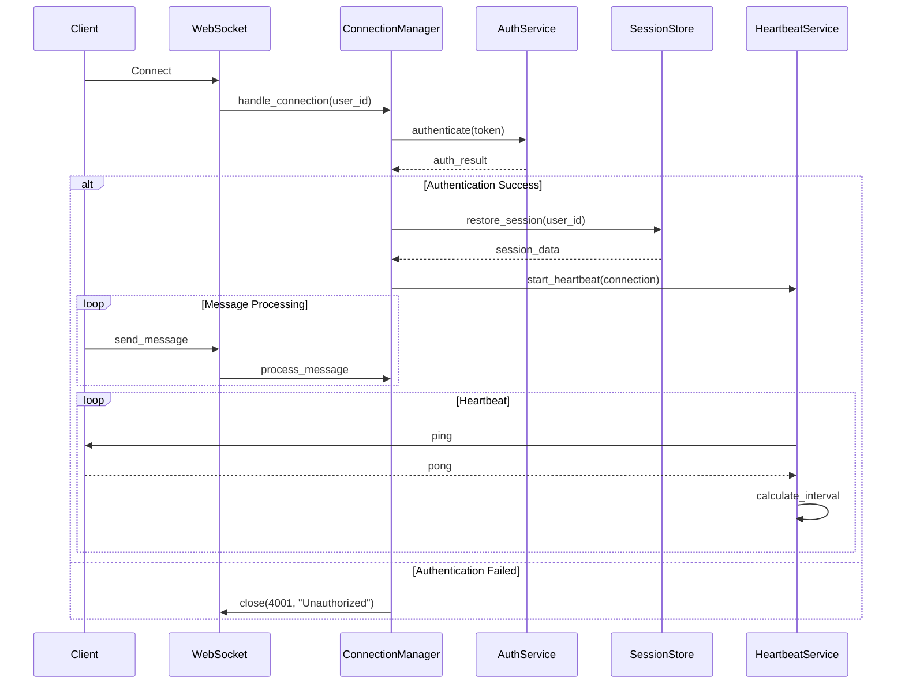

**Connection Lifecycle Architecture**

```mermaid
graph TB
    subgraph "Connection States"
        INIT[Initial Connect]
        AUTH[Authenticating]
        ACTIVE[Active Connection]
        IDLE[Idle State]
        DISC[Disconnected]
    end
    
    subgraph "Management Components"
        CM[Connection Manager<br/>- Track connections<br/>- Handle lifecycle]
        CP[Connection Pool<br/>- Region-based<br/>- Resource limits]
        HB[Heartbeat Service<br/>- Adaptive intervals<br/>- Network monitoring]
    end
    
    INIT --> AUTH: Validate token
    AUTH --> ACTIVE: Success
    AUTH --> DISC: Failed
    ACTIVE --> IDLE: No activity
    IDLE --> ACTIVE: Message received
    IDLE --> DISC: Timeout
    ACTIVE --> DISC: Disconnect
    
    CM --> CP: Manage pools
    CM --> HB: Monitor health
    
    style ACTIVE fill:#4caf50
    style DISC fill:#f44336
```

**Adaptive Heartbeat Configuration**

| Network Quality Score | Heartbeat Interval | Battery Impact | Reliability |
|----------------------|-------------------|----------------|------------|
| > 0.8 (Excellent) | 60s | Low | High |
| 0.6 - 0.8 (Good) | 30-45s | Medium | High |
| 0.4 - 0.6 (Fair) | 20-30s | Medium-High | Medium |
| < 0.4 (Poor) | 10-20s | High | Low |

**Key Connection Metrics**
- Concurrent connections: 2M+ per server
- Heartbeat overhead: < 0.5% bandwidth
- Reconnection time: < 3 seconds
- Session restoration: < 100ms

### 2. Message Routing & Delivery

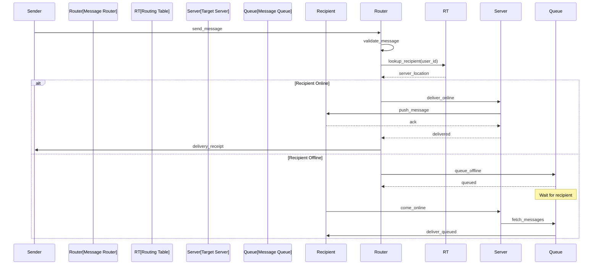

**Message Routing Architecture**

```mermaid
graph TB
    subgraph "Routing Layer"
        MR[Message Router<br/>100M msg/s]
        RT[(Routing Table<br/>User→Server)]
        LB[Load Balancer<br/>Server Selection]
    end
    
    subgraph "Delivery Strategies"
        ONLINE[Online Delivery<br/>Direct Push]
        OFFLINE[Offline Queue<br/>Store & Forward]
        RETRY[Retry Logic<br/>Exponential Backoff]
    end
    
    subgraph "Queue Infrastructure"
        K1[Kafka Partition 1]
        K2[Kafka Partition 2]
        KN[Kafka Partition N]
        
        CG1[Delivery Group]
        CG2[Backup Group]
        CG3[Analytics Group]
    end
    
    MR --> RT: Lookup recipient
    MR --> LB: Select server
    
    MR --> ONLINE: If online
    MR --> OFFLINE: If offline
    ONLINE --> RETRY: On failure
    
    OFFLINE --> K1 & K2 & KN
    K1 & K2 & KN --> CG1 & CG2 & CG3
    
    style MR fill:#ff6b6b
    style K1 fill:#4ecdc4
    style K2 fill:#4ecdc4
    style KN fill:#4ecdc4
```

**Message Queue Configuration**

| Parameter | Value | Purpose |
|-----------|-------|---------|
| **Replication Factor** | 3 | Durability |
| **Acks** | all | Wait for all replicas |
| **Compression** | lz4 | 60% size reduction |
| **Retention** | 7 days | Offline delivery window |
| **Partitions** | 1000 | Parallel processing |
| **Consumer Groups** | 3 | Delivery, Backup, Analytics |

**Delivery Performance Metrics**

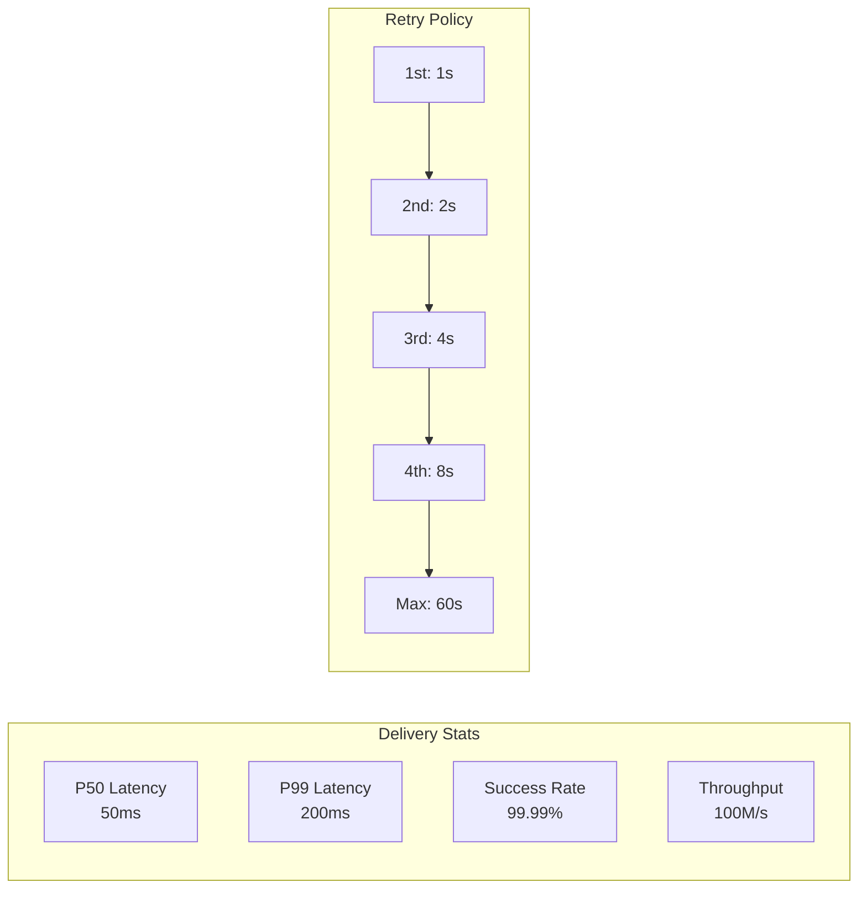

### 3. End-to-End Encryption Implementation

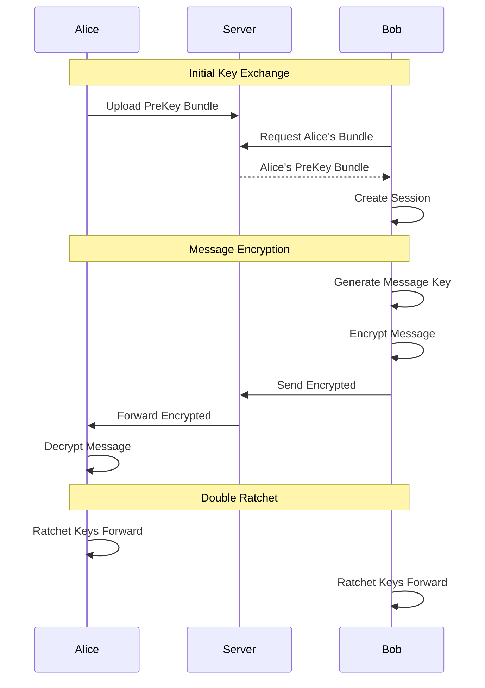

**Signal Protocol Architecture**

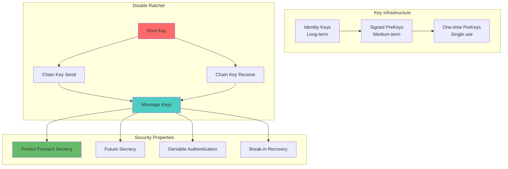

**Key Exchange Flow**

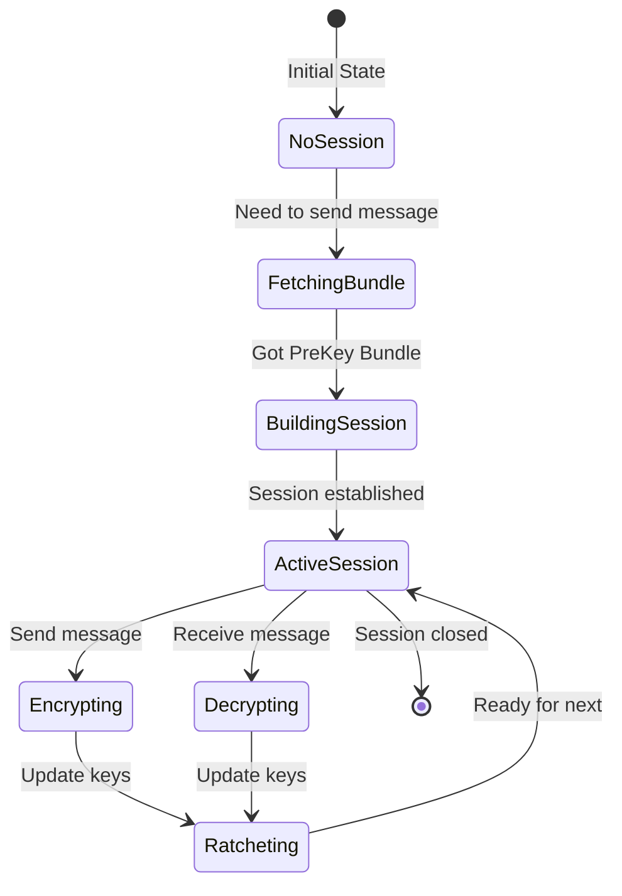

**Encryption Security Guarantees**

| Property | Description | Benefit |
|----------|-------------|---------|
| **Forward Secrecy** | Past messages safe if keys compromised | Historical privacy |
| **Future Secrecy** | Future messages safe after compromise | Automatic recovery |
| **Deniability** | Messages can't be cryptographically attributed | Plausible deniability |
| **Message Ordering** | Detects reordering/replay attacks | Integrity protection |
| **Break-in Recovery** | Self-heals after temporary compromise | Resilience |

**Double Ratchet Mechanism**

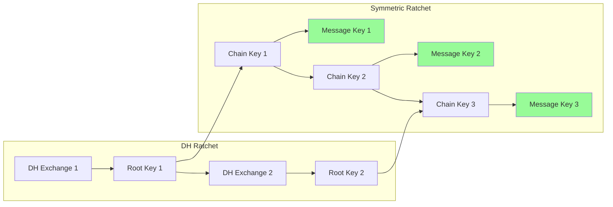

### 4. Media Handling

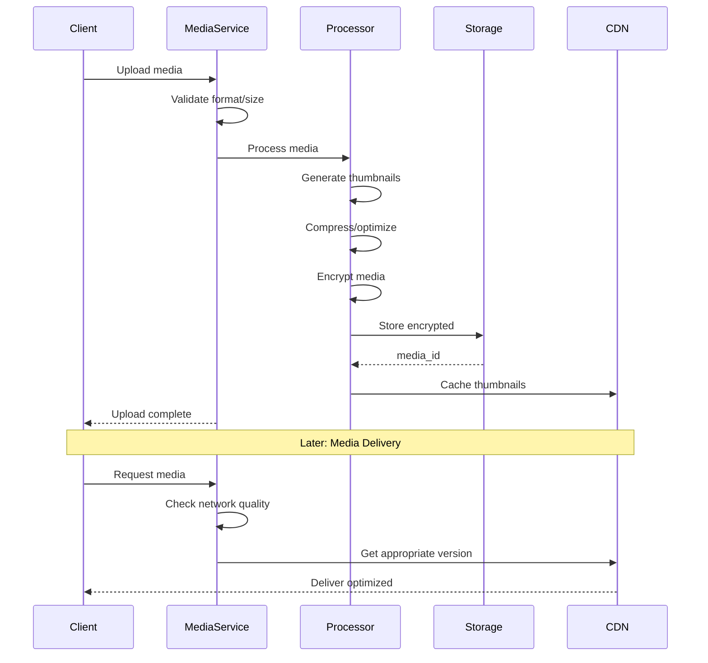

**Media Processing Pipeline**

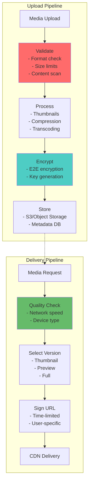

**Media Size Limits & Formats**

| Media Type | Max Size | Supported Formats | Compression |
|------------|----------|-------------------|-------------|
| **Images** | 16 MB | JPG, PNG, GIF, WebP | WebP conversion |
| **Videos** | 100 MB | MP4, MOV, AVI | H.264/H.265 |
| **Voice** | 10 MB | MP3, AAC, Opus | Opus @ 16kbps |
| **Documents** | 100 MB | PDF, DOC, DOCX | ZIP if needed |

**Adaptive Quality Levels**

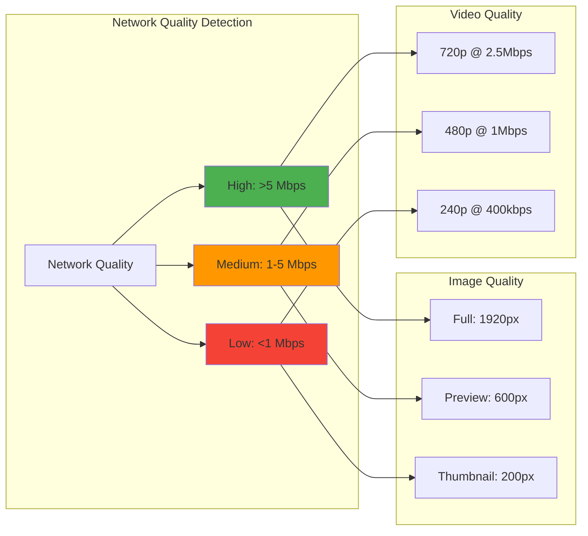

**Media Storage Architecture**

```mermaid
graph TB
    subgraph "Hot Storage"
        RECENT[Recent Media<br/>< 7 days]
        THUMB[All Thumbnails]
    end
    
    subgraph "Warm Storage"
        MONTH[1-30 days<br/>Compressed]
    end
    
    subgraph "Cold Storage"
        ARCHIVE[> 30 days<br/>Glacier/Archive]
    end
    
    subgraph "CDN Cache"
        EDGE1[Edge Location 1]
        EDGE2[Edge Location 2]
        EDGEN[Edge Location N]
    end
    
    RECENT --> EDGE1 & EDGE2 & EDGEN
    THUMB --> EDGE1 & EDGE2 & EDGEN
    
    RECENT --> MONTH: Age out
    MONTH --> ARCHIVE: Archive policy
    
    style RECENT fill:#ff6b6b
    style THUMB fill:#4ecdc4
    style EDGE1 fill:#66bb6a
```

### 5. Group Chat Architecture

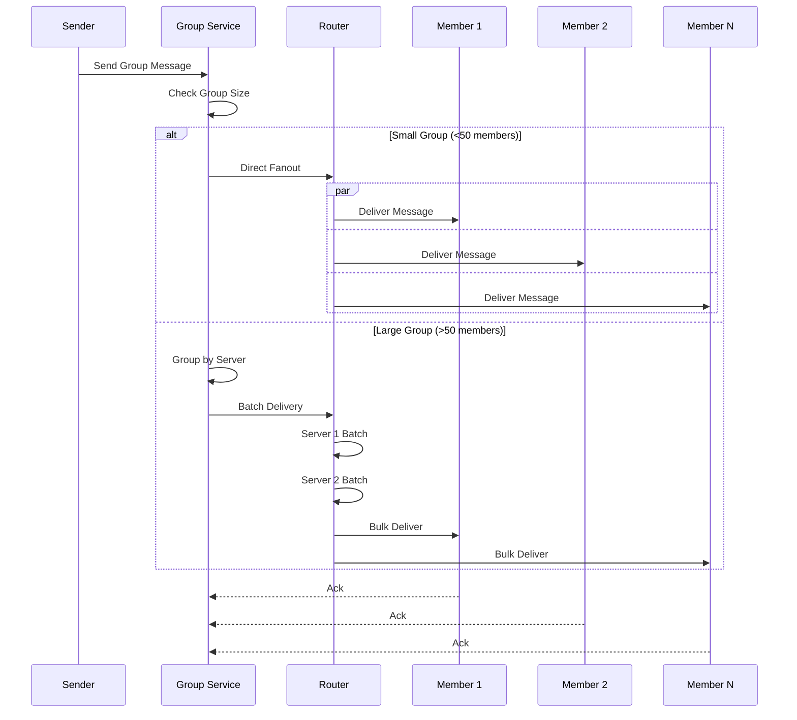

**Group Chat Configuration**

| Group Size | Delivery Strategy | Fanout Type | Performance Impact |
|------------|------------------|-------------|-------------------|
| 1-50 members | Direct Fanout | Parallel | Low latency, high resource |
| 51-100 members | Batched Fanout | Server-grouped | Balanced |
| 101-256 members | Optimized Fanout | Multi-tier | High efficiency |

**Group Synchronization Flow**

```mermaid
graph LR
    subgraph "Version Vector Sync"
        VV1[Member 1<br/>Vector: {A:1, B:2}]
        VV2[Member 2<br/>Vector: {A:1, B:3}]
        VV3[Member 3<br/>Vector: {A:2, B:2}]
    end
    
    subgraph "Conflict Detection"
        CD[Conflict Detector]
        CR[Conflict Resolver]
    end
    
    subgraph "Resolution"
        RS[Resolved State<br/>Vector: {A:2, B:3}]
        PROP[Propagate to All]
    end
    
    VV1 & VV2 & VV3 --> CD
    CD --> CR
    CR --> RS
    RS --> PROP
    
    style CD fill:#ff6b6b
    style RS fill:#4ecdc4
```

**Group State Management**

| Component | Purpose | Consistency Model |
|-----------|---------|------------------|
| Member List | Track active members | Strong consistency |
| Message History | Recent messages | Eventual consistency |
| Read Receipts | Delivery status | Best-effort |
| Admin Changes | Permission updates | Consensus-based |

## 🎯 Axiom Mapping & Design Decisions

### Comprehensive Design Decision Matrix

| Design Decision | Axiom 1<br/>🚀 Latency | Axiom 2<br/>💾 Capacity | Axiom 3<br/>🔥 Failure | Axiom 4<br/>🔀 Concurrency | Axiom 5<br/>🤝 Coordination | Axiom 6<br/>👁️ Observability | Axiom 7<br/>👤 Human | Axiom 8<br/>💰 Economics |
|----------------|----------|----------|---------|-------------|--------------|---------------|-------|-----------|
| **WebSocket Connections** | ✅ Real-time delivery | ✅ Connection pooling | ✅ Auto-reconnect | ✅ Millions concurrent | ⚪ | ✅ Connection metrics | ✅ Instant messaging | ✅ Efficient bandwidth |
| **E2E Encryption** | ⚪ Slight overhead | ✅ Only encrypted stored | ✅ Keys backed up | ⚪ | ✅ Key exchange protocol | ⚪ | ✅ Privacy guaranteed | ✅ Compliance |
| **Message Queuing** | ✅ Async delivery | ✅ Buffer capacity | ✅ Persistent queue | ✅ Parallel processing | ✅ Ordered delivery | ✅ Queue depth metrics | ✅ Reliable delivery | ⚪ |
| **Erlang/Actor Model** | ✅ Low overhead | ✅ Memory efficient | ✅ Supervisor trees | ✅ Actor isolation | ✅ Message passing | ✅ Process monitoring | ⚪ | ✅ Hardware efficiency |
| **Media CDN** | ✅ Fast media delivery | ✅ Storage offload | ✅ Multi-region | ⚪ | ✅ Cache invalidation | ✅ CDN metrics | ✅ Quick media load | ✅ Bandwidth costs |
| **Presence System** | ✅ Instant updates | ✅ Memory-only | ✅ Eventual consistency | ✅ Distributed state | ✅ CRDT for conflicts | ✅ Presence accuracy | ✅ Online indicators | ⚪ |
| **Push Notifications** | ✅ Wake device quickly | ⚪ | ✅ Multiple providers | ✅ Batch sending | ✅ Token management | ✅ Delivery rates | ✅ User engagement | ✅ Provider costs |
| **Group Optimization** | ✅ Batch delivery | ✅ Fanout control | ✅ Partial delivery OK | ✅ Parallel fanout | ✅ Member sync | ✅ Group metrics | ✅ Large groups | ✅ Server efficiency |

**Legend**: ✅ Primary impact | ⚪ Secondary/No impact

## 🔄 Alternative Architectures

### Alternative 1: Federated Architecture (Matrix Protocol)


**Trade-offs**:
- ✅ No central control
- ✅ Privacy by design
- ✅ Resilient to shutdowns
- ❌ Complex consistency
- ❌ Slower cross-domain
- ❌ Variable quality

### Alternative 2: Blockchain-Based Messaging


**Trade-offs**:
- ✅ Truly decentralized
- ✅ Immutable history
- ✅ No central server
- ❌ High latency (seconds)
- ❌ Storage expensive
- ❌ Poor mobile experience

### Alternative 3: P2P Messaging (Like Briar)

```mermaid
graph TB
    subgraph "P2P Network"
        subgraph "Direct Connection"
            P1[Peer 1]
            P2[Peer 2]
            P1 <-.-> P2
        end
        
        subgraph "Mesh Network"
            P3[Peer 3]
            P4[Peer 4]
            P5[Peer 5]
            
            P3 <-.-> P4 <-.-> P5
            P3 <-.-> P5
        end
        
        subgraph "Tor Hidden Service"
            TOR[Tor Network]
            P1 & P3 -.-> TOR
        end
    end
```

**Trade-offs**:
- ✅ No infrastructure
- ✅ Censorship resistant
- ✅ Works offline (Bluetooth)
- ❌ Unreliable delivery
- ❌ No message history
- ❌ Complex NAT traversal

### Alternative 4: Cloud-Native Serverless

```mermaid
graph TB
    subgraph "Serverless Architecture"
        API[API Gateway]
        
        subgraph "Functions"
            F1[Send Message]
            F2[Deliver Message]
            F3[Process Media]
            F4[Send Notification]
        end
        
        subgraph "Managed Services"
            DDB[DynamoDB<br/>Messages]
            SQS[SQS<br/>Queue]
            S3[S3<br/>Media]
            IOT[IoT Core<br/>WebSocket]
        end
        
        API --> F1 --> DDB
        F1 --> SQS --> F2
        F2 --> IOT
        F2 --> F4
        F3 --> S3
    end
    
    style API fill:#4ecdc4
    style DDB fill:#ff6b6b
```

**Trade-offs**:
- ✅ No server management
- ✅ Auto-scaling
- ✅ Pay per use
- ❌ Vendor lock-in
- ❌ Cold starts
- ❌ Limited customization

## 📊 Performance & Monitoring

### Key Metrics Dashboard

```mermaid
graph TB
    subgraph "Real-time Metrics"
        LAT[Latency Tracking]
        THRU[Throughput Monitoring]
        CONN[Connection Health]
        ERR[Error Tracking]
    end
    
    subgraph "Metric Types"
        HIST[Histograms<br/>P50, P95, P99]
        COUNT[Counters<br/>Messages, Errors]
        GAUGE[Gauges<br/>Active Users]
    end
    
    subgraph "Alerting Thresholds"
        A1[Latency > 5s]
        A2[Error Rate > 1%]
        A3[Connections Drop > 10%]
    end
    
    LAT --> HIST
    THRU --> COUNT
    CONN --> GAUGE
    ERR --> COUNT
    
    HIST --> A1
    COUNT --> A2
    GAUGE --> A3
    
    style LAT fill:#4ecdc4
    style A1 fill:#ff6b6b
```

**System Performance Metrics**

| Metric Category | Key Indicators | Alert Thresholds |
|-----------------|----------------|------------------|
| **Latency** | P50: 50ms<br/>P95: 200ms<br/>P99: 500ms | P99 > 1s |
| **Throughput** | Messages/sec: 100K<br/>Delivery rate: 99.9% | Rate < 99% |
| **Connections** | Active: 2M<br/>New/sec: 10K | Drops > 10% |
| **Errors** | Delivery failures<br/>Timeout errors | Error rate > 1% |
| **Business** | DAU: 10M<br/>Messages/user: 50 | DAU drop > 5% |

**Monitoring Stack Architecture**

```mermaid
graph LR
    subgraph "Data Collection"
        APP[Application<br/>Metrics]
        SYS[System<br/>Metrics]
        LOG[Application<br/>Logs]
    end
    
    subgraph "Processing"
        KAFKA[Kafka<br/>Streaming]
        FLINK[Flink<br/>Aggregation]
    end
    
    subgraph "Storage & Viz"
        PROM[Prometheus<br/>Time Series]
        GRAF[Grafana<br/>Dashboards]
        ALERT[AlertManager<br/>Notifications]
    end
    
    APP & SYS & LOG --> KAFKA
    KAFKA --> FLINK
    FLINK --> PROM
    PROM --> GRAF
    PROM --> ALERT
    
    style KAFKA fill:#4ecdc4
    style PROM fill:#ffd93d
    style GRAF fill:#95e1d3
```

### Real-time Monitoring Architecture

```mermaid
graph TB
    subgraph "Data Collection"
        APP[Application<br/>Metrics]
        SYS[System<br/>Metrics]
        LOG[Application<br/>Logs]
    end
    
    subgraph "Processing Pipeline"
        K[Kafka<br/>Streaming]
        F[Flink<br/>Aggregation]
        S[Spark<br/>Analytics]
    end
    
    subgraph "Storage & Viz"
        P[Prometheus<br/>Metrics]
        E[Elasticsearch<br/>Logs]
        G[Grafana<br/>Dashboards]
        A[Alertmanager<br/>Alerts]
    end
    
    APP & SYS & LOG --> K
    K --> F & S
    F --> P --> G
    S --> E --> G
    P --> A
```

## 🚨 Failure Scenarios & Recovery

### Common Failure Modes

```mermaid
graph TB
    subgraph "Failure Types"
        F1[Regional Network Partition]
        F2[Database Shard Failure]
        F3[Mass Reconnection Storm]
        F4[Redis Cache Failure]
        F5[Message Queue Overflow]
    end
    
    subgraph "Detection"
        D1[Health Checks]
        D2[Circuit Breakers]
        D3[Anomaly Detection]
    end
    
    subgraph "Recovery Actions"
        R1[Traffic Rerouting]
        R2[Replica Promotion]
        R3[Rate Limiting]
        R4[Graceful Degradation]
        R5[Auto-scaling]
    end
    
    F1 --> D1 --> R1
    F2 --> D2 --> R2
    F3 --> D3 --> R3
    F4 --> D2 --> R4
    F5 --> D3 --> R5
    
    style F1 fill:#ff6b6b
    style F2 fill:#ff6b6b
    style F3 fill:#ff6b6b
```

**Failure Recovery Procedures**

| Failure Type | Detection Method | Recovery Time | Recovery Action |
|--------------|------------------|---------------|----------------|
| **Regional Partition** | Ping failures > 3 | < 30s | DNS failover to healthy region |
| **Shard Failure** | Replication lag > 5s | < 60s | Promote replica, update routing |
| **Connection Storm** | Rate > 10x normal | < 10s | Enable backpressure, scale out |
| **Cache Failure** | Circuit breaker open | < 5s | Fallback to database |
| **Queue Overflow** | Depth > 1M messages | < 120s | Spill to S3, add consumers |

**Recovery Automation Flow**

```mermaid
sequenceDiagram
    participant M as Monitor
    participant D as Detector
    participant O as Orchestrator
    participant R as Recovery
    participant N as Notification
    
    M->>D: Anomaly Detected
    D->>D: Validate (3 checks)
    D->>O: Confirmed Failure
    
    O->>R: Initiate Recovery
    
    par Recovery Actions
        R->>R: Reroute Traffic
        and
        R->>R: Scale Resources
        and
        R->>R: Update Config
    end
    
    R->>O: Recovery Complete
    O->>N: Notify Operators
    O->>M: Resume Monitoring
```

## 🔄 Consistency Deep Dive

### Multi-Device Consistency

```mermaid
sequenceDiagram
    participant U as User
    participant CM as Consistency Manager
    participant DR as Device Registry
    participant D1 as Device 1
    participant D2 as Device 2
    participant D3 as Device 3
    participant Q as Retry Queue
    
    U->>CM: Send Message
    CM->>DR: Get Active Devices
    DR-->>CM: [D1, D2, D3]
    
    CM->>CM: Generate Logical Timestamp
    
    par Parallel Delivery
        CM->>D1: Deliver(msg, ts)
        and
        CM->>D2: Deliver(msg, ts)
        and
        CM->>D3: Deliver(msg, ts)
    end
    
    D1-->>CM: ACK
    D2-->>CM: ACK
    Note over D3: No response
    
    CM->>CM: Check Quorum (2/3)
    CM->>Q: Queue for D3
    CM-->>U: Success (Quorum Met)
```

**Multi-Device Delivery Configuration**

| Parameter | Value | Purpose |
|-----------|-------|---------|  
| Quorum Size | 2/3 devices | Balance consistency vs availability |
| Delivery Timeout | 3 seconds | Prevent blocking on offline devices |
| Retry Interval | 30 seconds | Eventual delivery for failed devices |
| Max Retries | 10 | Prevent infinite retry loops |

### Message Ordering Guarantees

```mermaid
graph TB
    subgraph "Ordering Modes"
        FIFO[FIFO Order<br/>Per-sender only]
        CAUSAL[Causal Order<br/>Preserves causality]
        TOTAL[Total Order<br/>Global ordering]
    end
    
    subgraph "Implementation"
        SEQ[Sequence Numbers]
        VC[Vector Clocks]
        LAMP[Lamport Timestamps]
    end
    
    subgraph "Trade-offs"
        PERF[Performance]
        CONSIST[Consistency]
        COMPLEX[Complexity]
    end
    
    FIFO --> SEQ
    CAUSAL --> VC
    TOTAL --> LAMP
    
    SEQ --> |High| PERF
    SEQ --> |Low| CONSIST
    SEQ --> |Low| COMPLEX
    
    VC --> |Medium| PERF
    VC --> |Medium| CONSIST
    VC --> |Medium| COMPLEX
    
    LAMP --> |Low| PERF
    LAMP --> |High| CONSIST
    LAMP --> |High| COMPLEX
    
    style FIFO fill:#4ecdc4
    style CAUSAL fill:#ffd93d
    style TOTAL fill:#ff6b6b
```

**Message Ordering Comparison**

| Ordering Type | Mechanism | Guarantees | Use Case |
|---------------|-----------|------------|----------|
| FIFO | Sequence numbers | Messages from same sender in order | Most chat scenarios |
| Causal | Vector clocks | Reply after original message | Threaded conversations |
| Total | Lamport timestamps | All see same order | Financial transactions |

### Hybrid Consistency Model

```mermaid
graph LR
    subgraph "Operation Types"
        MSG[Messages]
        META[Group Metadata]
        PRES[User Presence]
        READ[Read Receipts]
        PAY[Payments]
    end
    
    subgraph "Consistency Levels"
        WEAK[Weak<br/>Best effort]
        EVENTUAL[Eventual<br/>Converges eventually]
        CAUSAL[Causal<br/>Preserves order]
        STRONG[Strong<br/>Immediate consistency]
        LINEAR[Linearizable<br/>Strict ordering]
    end
    
    MSG --> EVENTUAL
    META --> STRONG
    PRES --> WEAK
    READ --> CAUSAL
    PAY --> LINEAR
    
    style MSG fill:#4ecdc4
    style META fill:#ff6b6b
    style PRES fill:#95e1d3
    style READ fill:#ffd93d
    style PAY fill:#f06292
```

**Consistency Zone Configuration**

| Operation Type | Consistency Level | Rationale | Implementation |
|----------------|-------------------|-----------|----------------|
| Messages | Eventual | Can tolerate delays | Async replication |
| Group Metadata | Strong | Must be accurate | Consensus-based |
| User Presence | Weak | Approximate is OK | Best-effort gossip |
| Read Receipts | Causal | Order matters | Vector clocks |
| Payments | Linearizable | Critical accuracy | 2PC or Raft |

### Causal Broadcast for Group Messages

```mermaid
sequenceDiagram
    participant A as Alice
    participant CB as Causal Broadcast
    participant B as Bob
    participant C as Charlie
    
    Note over A,C: Initial Vector Clocks<br/>A:{A:0,B:0,C:0}<br/>B:{A:0,B:0,C:0}<br/>C:{A:0,B:0,C:0}
    
    A->>CB: Send "Hello" {A:1,B:0,C:0}
    CB->>B: Deliver "Hello"
    CB->>C: Deliver "Hello"
    
    Note over B: Update VC: {A:1,B:0,C:0}
    
    B->>CB: Send "Hi Alice" {A:1,B:1,C:0}
    CB->>A: Deliver "Hi Alice"
    CB->>C: Buffer (waiting for A:1)
    
    Note over C: Receives A's message
    Note over C: Update VC: {A:1,B:0,C:0}
    Note over C: Now can deliver B's message
    CB->>C: Deliver "Hi Alice"
```

**Causal Delivery Algorithm**

| Step | Action | Condition |
|------|--------|-----------|  
| 1 | Receive message | Check vector clock |
| 2 | Can deliver? | Sender's VC = Local VC + 1 for sender |
| 3a | If yes | Deliver and update local VC |
| 3b | If no | Buffer until condition met |
| 4 | Check buffer | Deliver any newly eligible messages |

### Consistency Trade-offs in Practice

| Consistency Model | Use Case | Trade-offs |
|------------------|----------|------------|
| **Strong Consistency** | Group creation, Payment messages | Higher latency, Lower availability |
| **Causal Consistency** | Message ordering within conversations | Moderate complexity, Good performance |
| **Eventual Consistency** | Message delivery, Read receipts | Best performance, Potential temporary inconsistencies |
| **Read-Your-Writes** | User's own messages | Additional tracking overhead |
| **Monotonic Reads** | Message history pagination | Requires session stickiness |

For a comprehensive deep dive into consistency patterns in chat systems, see [Consistency Deep Dive](consistency-deep-dive-chat.md).

## 💡 Key Design Insights

### 1. 🚀 **Real-time Requires Custom Protocols**
- XMPP too heavy for mobile
- Custom binary protocol saves 60% bandwidth
- Adaptive heartbeat reduces battery drain

### 2. 🔐 **E2E Encryption is Non-negotiable**
- Signal Protocol provides perfect forward secrecy
- Server can never read messages
- Key management critical for UX

### 3. 📱 **Mobile-First Design Essential**
- Battery optimization crucial
- Push notifications for offline delivery
- Adaptive quality for media

### 4. 🌍 **Global Scale Needs Federation**
- Regional servers reduce latency
- Cross-region replication for availability
- Local regulations compliance

### 5. 💰 **Erlang/Elixir for Concurrent Connections**
- 2M connections per server
- Actor model perfect for chat
- Let-it-crash philosophy improves reliability

### 6. 🔄 **Consistency is Context-Dependent**
- Different operations need different consistency levels
- CRDTs enable offline-first experiences
- Vector clocks preserve causality in group chats
- Consensus only for critical operations (group admin changes)

## 🔍 Related Concepts & Deep Dives

### 📚 Relevant Axioms
- **[Axiom 1: Latency](../part1-axioms/axiom1-latency/index.md)** - WebSocket for real-time, regional servers
- **[Axiom 2: Finite Capacity](../part1-axioms/axiom2-capacity/index.md)** - Connection pooling, message queuing
- **[Axiom 3: Failure is Normal](../part1-axioms/axiom3-failure/index.md)** - Offline queue, retry mechanisms
- **[Axiom 4: Concurrency](../part1-axioms/axiom4-concurrency/index.md)** - Actor model, parallel delivery
- **[Axiom 5: Coordination](../part1-axioms/axiom5-coordination/index.md)** - Group state sync, message ordering
- **[Axiom 6: Observability](../part1-axioms/axiom6-observability/index.md)** - Message tracking, connection monitoring
- **[Axiom 7: Human Interface](../part1-axioms/axiom7-human/index.md)** - Typing indicators, read receipts
- **[Axiom 8: Economics](../part1-axioms/axiom8-economics/index.md)** - Bandwidth optimization, server efficiency

### 🏛️ Related Patterns
- **[WebSocket](../patterns/websocket.md)** - Persistent connections
- **[Message Queue](../patterns/message-queue.md)** - Reliable delivery
- **[Actor Model](../patterns/actor-model.md)** - Concurrent message handling
- **[Circuit Breaker](../patterns/circuit-breaker.md)** - Service protection
- **[Event Sourcing](../patterns/event-sourcing.md)** - Message history
- **[CRDT](../patterns/crdt.md)** - Distributed state sync
- **[Saga Pattern](../patterns/saga.md)** - Group operations

### 📊 Quantitative Models
- **[Little's Law](../quantitative/littles-law.md)** - Connection pool sizing
- **[Queueing Theory](../quantitative/queueing-theory.md)** - Message queue capacity
- **[CAP Theorem](../quantitative/cap-theorem.md)** - Consistency vs availability
- **[Network Theory](../quantitative/network-theory.md)** - Optimal server placement

### 🔄 Similar Case Studies
- **[Discord Architecture](discord-architecture.md)** - Gaming chat at scale
- **[Slack's Infrastructure](slack-infrastructure.md)** - Enterprise messaging
- **[Telegram's MTProto](telegram-protocol.md)** - Custom protocol design
- **[Signal's Architecture](signal-architecture.md)** - Privacy-first messaging

---

## References

1. WhatsApp Engineering: "The WhatsApp Architecture" - Engineering Blog (2022)
2. Signal Protocol Documentation - Open Whisper Systems (2021)
3. "Erlang at WhatsApp" - Code Beam Conference (2019)
4. Facebook Messenger Scale - F8 Conference (2020)
5. Discord Engineering Blog: "How Discord Stores Billions of Messages" (2021)