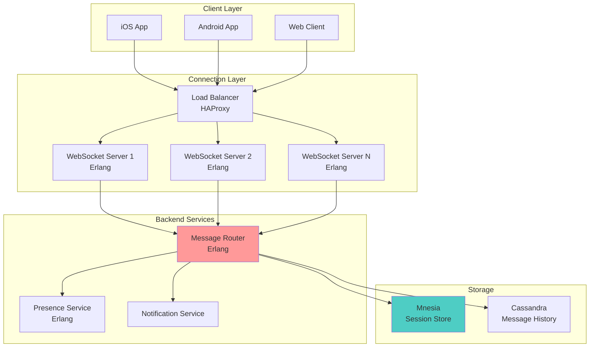
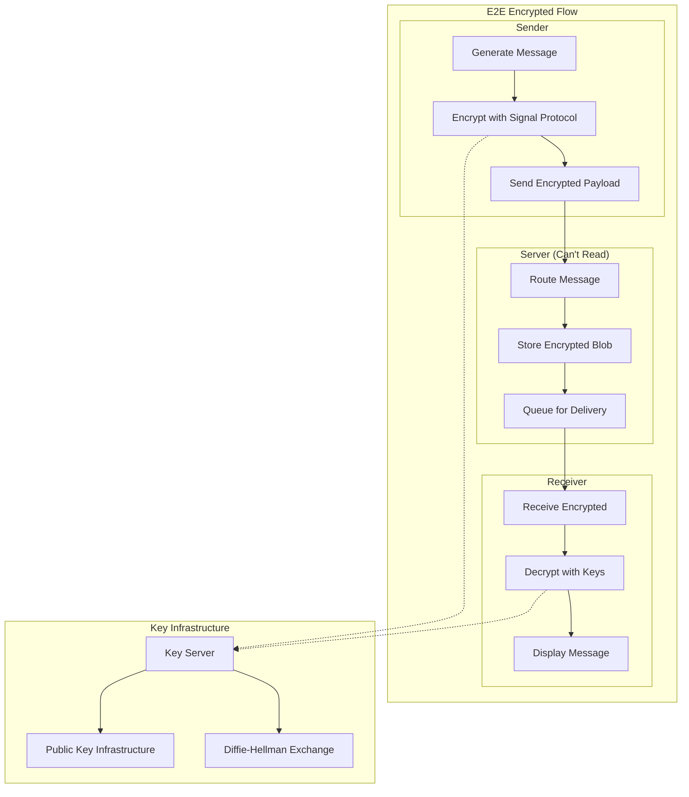
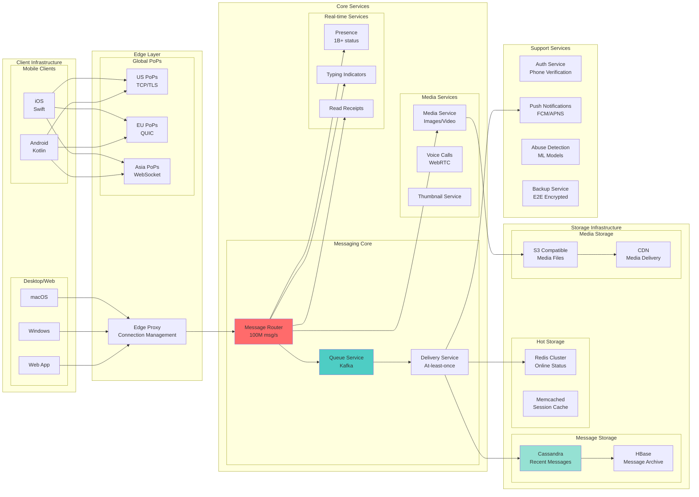
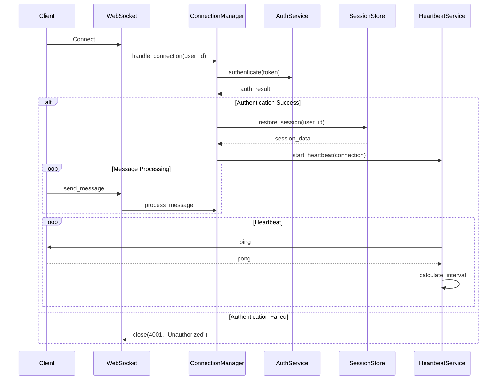
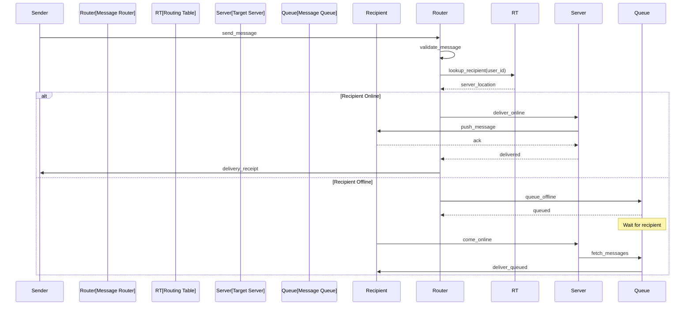
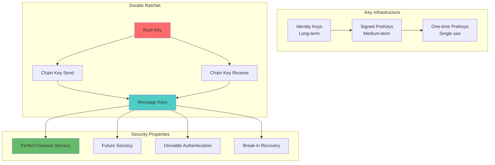
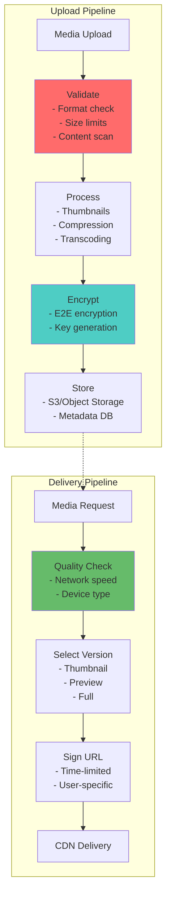
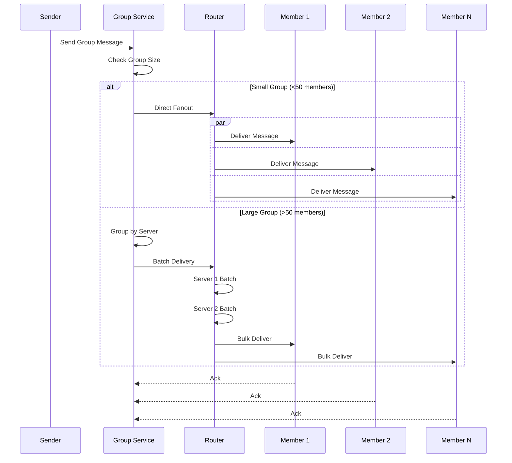
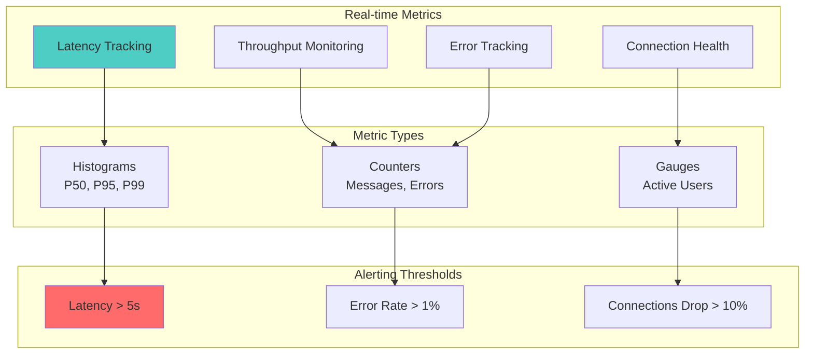
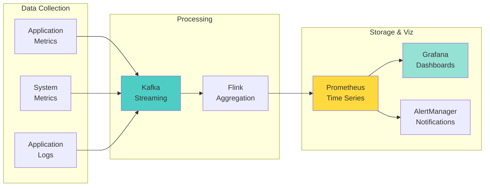

# Real-Time Chat System Architecture

**The Challenge**: Build a messaging system handling 100B+ messages/day with end-to-end encryption and global reach

!!! info "Case Study Sources"
    WhatsApp Engineering¹, Signal Protocol², Erlang at WhatsApp³, Facebook Messenger⁴, Discord Engineering⁵

## Introduction

Real-time chat: Ultra-low latency, perfect ordering, offline sync. WhatsApp: 100B messages/day. Balance CAP theorem for instantaneous, reliable experience connecting billions.

## Architecture Evolution

### Phase 1: Simple Client-Server Model (2009-2010)

```text
Mobile App → XMPP Server → MySQL → Mobile App
```

**Problems**: XMPP overhead, DB bottleneck, no offline delivery, battery drain
**Missing**: Message queue, connection pooling, async delivery

### Phase 2: Custom Protocol & Erlang (2010-2012)



**Key Decision**: Erlang/OTP for core infrastructure
**Result**: 2M connections per server (1M concurrent users¹)
**Pattern**: Actor Model

### Phase 3: End-to-End Encryption (2012-2016)



**Innovation: Signal Protocol Implementation**²
- Double Ratchet Algorithm
- Perfect Forward Secrecy
- Future Secrecy
- Deniable Authentication

**Patterns & Pillars Applied**:
- Pattern: End-to-End Encryption (Coming Soon)
- Pattern: Key Management (Coming Soon)
- 🏛 Pillar: [Truth Distribution](/part2-pillars/truth/) - Cryptographic guarantees
- 🏛 Pillar: [Control Distribution](/part2-pillars/control/) - Secure message routing

### Phase 4: Global Scale Architecture (2016-Present)



**Scale Achievements**:
- 100B+ messages/day
- 2B+ monthly active users
- 1M+ concurrent voice calls
- 99.99% message delivery rate

## Part 1: Concept Map - The Physics of Real-Time Communication

### Law 2: Asynchronous Reality - Racing Against Human Perception

In chat systems, latency directly impacts conversation flow. Human perception requires sub-200ms response times for interactions to feel "instant."

```python
import asyncio
import time
from typing import Dict, List, Optional, Set, Tuple
from dataclasses import dataclass, field
from datetime import datetime
import msgpack
import websockets
from collections import defaultdict
import hashlib

@dataclass
class Message:
    """Core message structure"""
    id: str
    sender_id: str
    recipient_id: str  # User or channel ID
    content: str
    timestamp: datetime = field(default_factory=datetime.utcnow)
    status: str = 'sent'  # sent, delivered, read
    reply_to: Optional[str] = None
    attachments: List[Dict] = field(default_factory=list)
    
    def serialize(self) -> bytes:
        """Optimize serialization for network transfer"""
        return msgpack.packb({
            'id': self.id,
            's': self.sender_id,  # Short keys save bandwidth
            'r': self.recipient_id,
            'c': self.content,
            't': self.timestamp.timestamp(),
            'st': self.status,
            'rt': self.reply_to,
            'a': self.attachments
        })

class LatencyOptimizedRouter:
    """Route messages through optimal paths"""
    
    def __init__(self):
        self.edge_servers = {}  # region -> server list
        self.user_locations = {}  # user_id -> region
        self.latency_matrix = {
            ('us-east', 'us-west'): 40,
            ('us-east', 'eu'): 80,
            ('us-east', 'asia'): 150,
            ('us-west', 'asia'): 100,
            ('eu', 'asia'): 180
        }
        
    async def route_message(self, msg: Message) -> Tuple[str, int]:
        """Find optimal route with lowest latency"""
        sender_region = self.user_locations.get(msg.sender_id, 'us-east')
        recipient_region = self.user_locations.get(msg.recipient_id, 'us-east')
        
        if sender_region == recipient_region:
# Same region - direct routing
            return f"{recipient_region}-direct", 5
        
# Find shortest path
        path, latency = self._find_shortest_path(sender_region, recipient_region)
        return '-'.join(path), latency
    
    def _find_shortest_path(self, start: str, end: str) -> Tuple[List[str], int]:
        """Dijkstra for optimal routing"""
# Simplified - in production use full graph algorithms
        key = tuple(sorted([start, end]))
        direct_latency = self.latency_matrix.get(key, 200)
        
# Check if relay through intermediate region is faster
        best_path = [start, end]
        best_latency = direct_latency
        
        for intermediate in ['us-east', 'us-west', 'eu', 'asia']:
            if intermediate not in (start, end):
                key1 = tuple(sorted([start, intermediate]))
                key2 = tuple(sorted([intermediate, end]))
                
                latency1 = self.latency_matrix.get(key1, 200)
                latency2 = self.latency_matrix.get(key2, 200)
                total = latency1 + latency2
                
                if total < best_latency:
                    best_path = [start, intermediate, end]
                    best_latency = total
        
        return best_path, best_latency

class WebSocketConnectionManager:
    """Manage persistent connections for real-time delivery"""
    
    def __init__(self):
        self.connections = {}  # user_id -> websocket
        self.connection_metadata = {}  # Track connection quality
        
    async def handle_connection(self, websocket, user_id: str):
        """Manage WebSocket lifecycle"""
        self.connections[user_id] = websocket
        self.connection_metadata[user_id] = {
            'connected_at': time.time(),
            'messages_sent': 0,
            'last_ping': time.time(),
            'latency_ms': []
        }
        
        try:
# Ping task for connection health
            ping_task = asyncio.create_task(self._ping_loop(user_id))
            
# Message handling
            async for message in websocket:
                await self._handle_message(user_id, message)
                
        except websockets.exceptions.ConnectionClosed:
            pass
        finally:
            ping_task.cancel()
            del self.connections[user_id]
            await self._handle_disconnect(user_id)
    
    async def _ping_loop(self, user_id: str):
        """Monitor connection latency"""
        while user_id in self.connections:
            start = time.time()
            pong = await self.connections[user_id].ping()
            latency = (time.time() - start) * 1000
            
            self.connection_metadata[user_id]['latency_ms'].append(latency)
            self.connection_metadata[user_id]['last_ping'] = time.time()
            
# Keep only recent latency measurements
            if len(self.connection_metadata[user_id]['latency_ms']) > 100:
                self.connection_metadata[user_id]['latency_ms'].pop(0)
            
            await asyncio.sleep(30)  # Ping every 30 seconds
```

**Production**: WhatsApp: 200ms median latency, 15+ edge locations, MQTT protocol.

### Law 4: Trade-offs - The Quadratic Connection Problem

Chat systems face O(N²) potential connections between N users, requiring careful capacity management.

```python
class CapacityManager:
    """Manage system capacity and scaling"""
    
    def __init__(self):
        self.shard_capacity = 10000  # Users per shard
        self.message_rate_limit = 100  # Messages per second per user
        self.storage_per_user_gb = 5  # Average storage per user
        
    def calculate_infrastructure_needs(self, user_count: int, 
                                     daily_messages: int) -> Dict:
        """Calculate required infrastructure"""
# Connection servers (WebSocket)
        concurrent_connections = user_count * 0.6  # 60% concurrent
        connection_servers = int(concurrent_connections / 50000) + 1  # 50K per server
        
# Message routers
        messages_per_second = daily_messages / 86400
        router_servers = int(messages_per_second / 100000) + 1  # 100K msg/s per router
        
# Storage requirements
# Assume 1KB per message, 3x replication
        daily_storage_gb = (daily_messages * 1 * 3) / 1e6
        total_storage_pb = (user_count * self.storage_per_user_gb) / 1e6
        
# Database shards
        db_shards = int(user_count / self.shard_capacity) + 1
        
        return {
            'connection_servers': connection_servers,
            'router_servers': router_servers,
            'daily_storage_gb': daily_storage_gb,
            'total_storage_pb': total_storage_pb,
            'database_shards': db_shards,
            'estimated_cost_per_month': self._calculate_cost(
                connection_servers, router_servers, total_storage_pb
            )
        }
    
    def _calculate_cost(self, conn_servers: int, routers: int, 
                       storage_pb: float) -> float:
        """Estimate monthly infrastructure cost"""
        server_cost = 500  # Per server per month
        storage_cost_per_pb = 20000  # Per PB per month
        
        return (conn_servers + routers) * server_cost + storage_pb * storage_cost_per_pb

class MessageShardingStrategy:
    """Shard messages for horizontal scaling"""
    
    def __init__(self, shard_count: int = 100):
        self.shard_count = shard_count
        self.shard_map = {}  # conversation_id -> shard
        
    def get_shard(self, conversation_id: str) -> int:
        """Determine shard for conversation"""
        if conversation_id in self.shard_map:
            return self.shard_map[conversation_id]
        
# Consistent hashing for shard assignment
        hash_value = int(hashlib.md5(conversation_id.encode()).hexdigest(), 16)
        shard = hash_value % self.shard_count
        
        self.shard_map[conversation_id] = shard
        return shard
    
    def rebalance_shards(self, new_shard_count: int):
        """Rebalance when scaling"""
        old_shard_count = self.shard_count
        self.shard_count = new_shard_count
        
        migrations = defaultdict(list)
        
        for conv_id, old_shard in self.shard_map.items():
            new_shard = self.get_shard(conv_id)
            if new_shard != old_shard:
                migrations[old_shard].append((conv_id, new_shard))
        
        return migrations
```

**Real Numbers**: Discord: 4B messages/day, 150M MAU, sophisticated sharding.

### Law 1: Failure - Messages Must Not Be Lost

Chat systems must handle failures gracefully without losing messages or breaking conversation flow.

```python
class ReliableMessageDelivery:
    """Ensure reliable message delivery despite failures"""
    
    def __init__(self):
        self.outbox = defaultdict(list)  # Pending messages
        self.acknowledgments = {}  # Track delivery status
        self.retry_policy = {
            'max_retries': 5,
            'base_delay': 1,  # seconds
            'max_delay': 60,
            'exponential_factor': 2
        }
        
    async def send_message(self, msg: Message) -> bool:
        """Send with reliability guarantees"""
        msg_id = msg.id
        retry_count = 0
        
        while retry_count < self.retry_policy['max_retries']:
            try:
# Try to deliver
                delivered = await self._attempt_delivery(msg)
                
                if delivered:
# Wait for acknowledgment
                    ack = await self._wait_for_ack(msg_id, timeout=5)
                    if ack:
                        return True
                
# Delivery failed, retry with backoff
                delay = min(
                    self.retry_policy['base_delay'] * 
                    (self.retry_policy['exponential_factor'] ** retry_count),
                    self.retry_policy['max_delay']
                )
                await asyncio.sleep(delay)
                retry_count += 1
                
            except Exception as e:
                print(f"Delivery error: {e}")
                retry_count += 1
        
# Failed after all retries - store for later
        await self._store_for_retry(msg)
        return False
    
    async def _wait_for_ack(self, msg_id: str, timeout: float) -> bool:
        """Wait for delivery acknowledgment"""
        start_time = time.time()
        
        while time.time() - start_time < timeout:
            if msg_id in self.acknowledgments:
                return self.acknowledgments[msg_id]
            await asyncio.sleep(0.1)
        
        return False

class MessagePersistence:
    """Persist messages for failure recovery"""
    
    def __init__(self):
        self.write_ahead_log = []  # WAL for durability
        self.checkpoint_interval = 1000  # Messages
        
    async def persist_message(self, msg: Message) -> bool:
        """Durably persist message"""
# Write to WAL first
        wal_entry = {
            'timestamp': time.time(),
            'operation': 'insert',
            'message': msg.serialize()
        }
        
# Atomic append
        self.write_ahead_log.append(wal_entry)
        
# Checkpoint if needed
        if len(self.write_ahead_log) % self.checkpoint_interval == 0:
            await self._checkpoint()
        
# Replicate to multiple nodes
        await self._replicate_message(msg)
        
        return True
    
    async def _replicate_message(self, msg: Message):
        """Replicate across nodes for durability"""
# In production, replicate to 3+ nodes
        replicas = ['replica1', 'replica2', 'replica3']
        
        tasks = []
        for replica in replicas:
            tasks.append(self._send_to_replica(replica, msg))
        
# Wait for majority (2/3) to succeed
        results = await asyncio.gather(*tasks, return_exceptions=True)
        success_count = sum(1 for r in results if not isinstance(r, Exception))
        
        if success_count < 2:
            raise Exception("Insufficient replicas")
```

### Law 3: Emergence - Handling Simultaneous Conversations

Multiple users typing and sending messages simultaneously requires careful concurrency control.

```python
import threading
from asyncio import Lock

class ConversationConcurrencyManager:
    """Manage concurrent access to conversations"""
    
    def __init__(self):
        self.conversation_locks = {}  # Fine-grained locking
        self.typing_indicators = defaultdict(set)  # Who's typing
        self.message_queues = defaultdict(list)  # Per-conversation queues
        
    async def handle_typing_indicator(self, user_id: str, 
                                    conversation_id: str,
                                    is_typing: bool):
        """Manage typing indicators efficiently"""
        if is_typing:
            self.typing_indicators[conversation_id].add(user_id)
        else:
            self.typing_indicators[conversation_id].discard(user_id)
        
# Broadcast to conversation participants
        await self._broadcast_typing_status(conversation_id)
    
    async def add_message_to_conversation(self, 
                                        conversation_id: str,
                                        message: Message) -> int:
        """Add message with proper ordering"""
# Get or create conversation lock
        if conversation_id not in self.conversation_locks:
            self.conversation_locks[conversation_id] = Lock()
        
        async with self.conversation_locks[conversation_id]:
# Assign sequence number
            self.message_queues[conversation_id].append(message)
            sequence_num = len(self.message_queues[conversation_id])
            
# Clear typing indicator for sender
            self.typing_indicators[conversation_id].discard(message.sender_id)
            
            return sequence_num

class OptimisticConcurrencyControl:
    """Handle conflicts in distributed updates"""
    
    def __init__(self):
        self.version_vectors = {}  # Track versions
        
    async def update_conversation_state(self, 
                                      conversation_id: str,
                                      update: Dict,
                                      client_version: Dict) -> Tuple[bool, Dict]:
        """Update with optimistic concurrency control"""
        current_version = self.version_vectors.get(conversation_id, {})
        
# Check for conflicts
        if self._has_conflict(client_version, current_version):
# Return conflict info for client resolution
            return False, {
                'conflict': True,
                'server_version': current_version,
                'conflicting_fields': self._find_conflicts(
                    client_version, current_version
                )
            }
        
# No conflict - apply update
        new_version = self._increment_version(current_version, update)
        self.version_vectors[conversation_id] = new_version
        
        return True, {'version': new_version}
```

### Law 5: Epistemology - Global Message Ordering

Ensuring consistent message ordering across distributed servers is crucial for coherent conversations.

```python
class VectorClockManager:
    """Maintain causal ordering using vector clocks"""
    
    def __init__(self, node_id: str):
        self.node_id = node_id
        self.vector_clocks = {}  # conversation_id -> vector clock
        
    def send_message(self, conversation_id: str, message: Message) -> Dict:
        """Attach vector clock to outgoing message"""
        if conversation_id not in self.vector_clocks:
            self.vector_clocks[conversation_id] = defaultdict(int)
        
# Increment own counter
        self.vector_clocks[conversation_id][self.node_id] += 1
        
# Attach vector clock to message
        message.vector_clock = dict(self.vector_clocks[conversation_id])
        
        return message.vector_clock
    
    def receive_message(self, conversation_id: str, 
                       message: Message,
                       sender_clock: Dict) -> bool:
        """Update vector clock on receive"""
        if conversation_id not in self.vector_clocks:
            self.vector_clocks[conversation_id] = defaultdict(int)
        
        local_clock = self.vector_clocks[conversation_id]
        
# Check if message is causally ready
        if not self._is_causally_ready(sender_clock, local_clock):
            return False  # Buffer message
        
# Update vector clock
        for node, timestamp in sender_clock.items():
            local_clock[node] = max(local_clock[node], timestamp)
        
        return True
    
    def _is_causally_ready(self, sender_clock: Dict, 
                          local_clock: Dict) -> bool:
        """Check if message can be delivered"""
        sender_node = None
        
        for node, timestamp in sender_clock.items():
            if timestamp > local_clock[node] + 1:
                return False  # Missing messages
            
            if timestamp == local_clock[node] + 1:
                if sender_node is not None:
                    return False  # Multiple increments
                sender_node = node
        
        return True

class GlobalMessageSequencer:
    """Provide total ordering when needed"""
    
    def __init__(self):
        self.sequence_number = 0
        self.pending_messages = defaultdict(list)
        
    async def sequence_message(self, message: Message) -> int:
        """Assign global sequence number"""
# For group chats requiring total order
        self.sequence_number += 1
        message.global_sequence = self.sequence_number
        
# Check if earlier messages are pending
        conversation_id = message.recipient_id
        
        if conversation_id in self.pending_messages:
# Insert in order
            self.pending_messages[conversation_id].append(message)
            self.pending_messages[conversation_id].sort(
                key=lambda m: m.global_sequence
            )
        
        return self.sequence_number
```

### Law 5: Epistemology - Understanding System Health

Comprehensive monitoring is essential for maintaining chat system reliability.

```python
class ChatSystemMonitor:
    """Monitor chat system health metrics"""
    
    def __init__(self):
        self.metrics = {
            'message_latency_ms': [],
            'delivery_success_rate': 0.0,
            'active_connections': 0,
            'messages_per_second': 0,
            'failed_deliveries': 0,
            'storage_usage_gb': 0
        }
        self.alerts = []
        
    async def track_message_delivery(self, 
                                   message: Message,
                                   sent_time: float,
                                   delivered_time: float,
                                   success: bool):
        """Track individual message metrics"""
        latency = (delivered_time - sent_time) * 1000
        
        self.metrics['message_latency_ms'].append(latency)
        
# Update success rate (moving average)
        alpha = 0.01  # Smoothing factor
        self.metrics['delivery_success_rate'] = (
            alpha * (1.0 if success else 0.0) + 
            (1 - alpha) * self.metrics['delivery_success_rate']
        )
        
        if not success:
            self.metrics['failed_deliveries'] += 1
        
# Alert on high latency
        if latency > 1000:  # 1 second
            self.alerts.append({
                'type': 'high_latency',
                'message_id': message.id,
                'latency_ms': latency
            })

class ConversationAnalytics:
    """Analyze conversation patterns"""
    
    def __init__(self):
        self.conversation_stats = defaultdict(lambda: {
            'message_count': 0,
            'participant_count': 0,
            'avg_response_time': 0,
            'health_score': 1.0
        })
        
    async def analyze_conversation_health(self, 
                                        conversation_id: str,
                                        messages: List[Message]) -> Dict:
        """Analyze conversation health metrics"""
        if not messages:
            return {'health_score': 0.0}
        
        stats = self.conversation_stats[conversation_id]
        
# Message frequency
        time_span = (messages[-1].timestamp - messages[0].timestamp).total_seconds()
        message_rate = len(messages) / max(time_span, 1)
        
# Response times
        response_times = []
        for i in range(1, len(messages)):
            if messages[i].sender_id != messages[i-1].sender_id:
                response_time = (messages[i].timestamp - 
                               messages[i-1].timestamp).total_seconds()
                response_times.append(response_time)
        
        avg_response = sum(response_times) / len(response_times) if response_times else 0
        
# Calculate health score
        health_score = min(1.0, message_rate / 0.1)  # Target: 0.1 msg/sec
        if avg_response > 300:  # 5 minutes
            health_score *= 0.5  # Penalty for slow responses
        
        return {
            'health_score': health_score,
            'message_rate': message_rate,
            'avg_response_time': avg_response,
            'participant_engagement': self._calculate_engagement(messages)
        }
```

### Law 6: Human-API - Optimizing for Natural Conversation

Chat systems must feel natural and responsive to human communication patterns.

```python
class SmartNotificationManager:
    """Intelligent notification management"""
    
    def __init__(self):
        self.user_preferences = {}
        self.conversation_importance = {}
        self.quiet_hours = {}  # User timezone aware
        
    async def should_notify(self, user_id: str, 
                          message: Message,
                          conversation_context: Dict) -> Tuple[bool, str]:
        """Determine if and how to notify"""
# Check quiet hours
        if self._in_quiet_hours(user_id):
            return False, "quiet_hours"
        
# Check importance
        importance = self._calculate_importance(
            user_id, message, conversation_context
        )
        
        if importance < 0.3:  # Low importance threshold
            return False, "low_importance"
        
# Determine notification type
        if importance > 0.8:
            return True, "high_priority"
        elif self._is_mentioned(user_id, message):
            return True, "mention"
        else:
            return True, "normal"
    
    def _calculate_importance(self, user_id: str, 
                            message: Message,
                            context: Dict) -> float:
        """Calculate message importance score"""
        score = 0.5  # Base score
        
# Sender importance
        sender_affinity = context.get('sender_affinity', 0.5)
        score *= sender_affinity
        
# Keywords and mentions
        if self._contains_urgent_keywords(message.content):
            score *= 1.5
        
# Conversation activity
        recent_activity = context.get('recent_messages', 0)
        if recent_activity > 10:  # Active conversation
            score *= 1.2
        
        return min(score, 1.0)

class MessageComposer:
    """Enhanced message composition features"""
    
    def __init__(self):
        self.draft_storage = {}  # Auto-save drafts
        self.suggestion_engine = SuggestionEngine()
        
    async def handle_composition(self, user_id: str, 
                               conversation_id: str,
                               partial_content: str):
        """Handle message composition with enhancements"""
# Auto-save draft
        draft_key = f"{user_id}:{conversation_id}"
        self.draft_storage[draft_key] = {
            'content': partial_content,
            'timestamp': time.time()
        }
        
# Generate suggestions
        suggestions = await self.suggestion_engine.get_suggestions(
            partial_content,
            conversation_id
        )
        
        return {
            'draft_saved': True,
            'suggestions': suggestions,
            'typing_indicator_sent': True
        }

class SuggestionEngine:
    """Provide smart suggestions during composition"""
    
    async def get_suggestions(self, partial_content: str, 
                            context: str) -> List[Dict]:
        """Generate contextual suggestions"""
        suggestions = []
        
# Emoji suggestions
        if any(word in partial_content.lower() 
              for word in ['happy', 'glad', 'excited']):
            suggestions.append({
                'type': 'emoji',
                'values': ['😊', '😄', '🎉']
            })
        
# Quick replies for common patterns
        if partial_content.endswith('?'):
            suggestions.append({
                'type': 'quick_reply',
                'values': ['Yes', 'No', 'Let me check']
            })
        
        return suggestions
```

### Law 7: Economics - Balancing Cost and Features

Chat systems must balance rich features with operational costs.

```python
class ChatEconomicsOptimizer:
    """Optimize chat system economics"""
    
    def __init__(self):
        self.cost_model = {
            'message_storage_per_gb': 0.023,
            'bandwidth_per_gb': 0.09,
            'compute_per_million_msg': 0.50,
            'notification_per_thousand': 0.10
        }
        self.feature_costs = {
            'end_to_end_encryption': 1.3,  # Multiplier
            'message_search': 2.0,
            'media_preview': 1.5,
            'read_receipts': 1.1
        }
        
    def calculate_per_user_cost(self, user_profile: Dict) -> Dict:
        """Calculate cost per user"""
# Base costs
        messages_per_month = user_profile.get('monthly_messages', 1000)
        avg_message_size = user_profile.get('avg_message_size', 1)  # KB
        
# Storage cost
        storage_gb = (messages_per_month * avg_message_size) / 1e6
        storage_cost = storage_gb * self.cost_model['message_storage_per_gb']
        
# Bandwidth cost
        bandwidth_gb = storage_gb * 2  # Upload + download
        bandwidth_cost = bandwidth_gb * self.cost_model['bandwidth_per_gb']
        
# Compute cost
        compute_cost = (messages_per_month / 1e6) * \
                      self.cost_model['compute_per_million_msg']
        
# Feature multipliers
        total_multiplier = 1.0
        for feature, enabled in user_profile.get('features', {}).items():
            if enabled and feature in self.feature_costs:
                total_multiplier *= self.feature_costs[feature]
        
        total_cost = (storage_cost + bandwidth_cost + compute_cost) * total_multiplier
        
        return {
            'storage_cost': storage_cost,
            'bandwidth_cost': bandwidth_cost,
            'compute_cost': compute_cost,
            'feature_multiplier': total_multiplier,
            'total_monthly_cost': total_cost,
            'cost_per_message': total_cost / messages_per_month if messages_per_month > 0 else 0
        }

class MessageRetentionOptimizer:
    """Optimize storage through intelligent retention"""
    
    def __init__(self):
        self.retention_policies = {
            'active': 365,  # Days
            'inactive': 90,
            'media': 30
        }
        
    async def optimize_storage(self, conversation_id: str) -> Dict:
        """Apply retention policies to reduce costs"""
        stats = await self._analyze_conversation(conversation_id)
        
# Determine retention policy
        if stats['last_activity_days'] > 180:
            policy = 'inactive'
        else:
            policy = 'active'
        
# Archive old messages
        archived_count = 0
        compressed_size = 0
        
        for message in stats['messages']:
            age_days = (datetime.utcnow() - message.timestamp).days
            
            if age_days > self.retention_policies[policy]:
# Archive to cold storage
                compressed_size += await self._archive_message(message)
                archived_count += 1
        
        return {
            'archived_messages': archived_count,
            'space_saved_gb': compressed_size / 1e9,
            'cost_saved': (compressed_size / 1e9) * 0.023 * 0.8  # 80% savings
        }
```

## Core Components Deep Dive

### 1. Connection Management



**Connection Lifecycle Architecture**

```mermaid
graph TB
    subgraph "Connection States"
        INIT[Initial Connect]
        AUTH[Authenticating]
        ACTIVE[Active Connection]
        IDLE[Idle State]
        DISC[Disconnected]
    end
    
    subgraph "Management Components"
        CM[Connection Manager<br/>- Track connections<br/>- Handle lifecycle]
        CP[Connection Pool<br/>- Region-based<br/>- Resource limits]
        HB[Heartbeat Service<br/>- Adaptive intervals<br/>- Network monitoring]
    end
    
    INIT --> AUTH: Validate token
    AUTH --> ACTIVE: Success
    AUTH --> DISC: Failed
    ACTIVE --> IDLE: No activity
    IDLE --> ACTIVE: Message received
    IDLE --> DISC: Timeout
    ACTIVE --> DISC: Disconnect
    
    CM --> CP: Manage pools
    CM --> HB: Monitor health
    
    style ACTIVE fill:#4caf50
    style DISC fill:#f44336
```

**Adaptive Heartbeat Configuration**

| Network Quality Score | Heartbeat Interval | Battery Impact | Reliability |
|----------------------|-------------------|----------------|------------|
| > 0.8 (Excellent) | 60s | Low | High |
| 0.6 - 0.8 (Good) | 30-45s | Medium | High |
| 0.4 - 0.6 (Fair) | 20-30s | Medium-High | Medium |
| < 0.4 (Poor) | 10-20s | High | Low |

**Key Connection Metrics**
- Concurrent connections: 2M+ per server
- Heartbeat overhead: < 0.5% bandwidth
- Reconnection time: < 3 seconds
- Session restoration: < 100ms

### 2. Message Routing & Delivery



### 3. End-to-End Encryption Implementation

**Signal Protocol Architecture**



**Encryption Security Guarantees**

| Property | Description | Benefit |
|----------|-------------|---------|
| **Forward Secrecy** | Past messages safe if keys compromised | Historical privacy |
| **Future Secrecy** | Future messages safe after compromise | Automatic recovery |
| **Deniability** | Messages can't be cryptographically attributed | Plausible deniability |
| **Message Ordering** | Detects reordering/replay attacks | Integrity protection |
| **Break-in Recovery** | Self-heals after temporary compromise | Resilience |

### 4. Media Handling

**Media Processing Pipeline**



**Media Size Limits & Formats**

| Media Type | Max Size | Supported Formats | Compression |
|------------|----------|-------------------|-------------|
| **Images** | 16 MB | JPG, PNG, GIF, WebP | WebP conversion |
| **Videos** | 100 MB | MP4, MOV, AVI | H.264/H.265 |
| **Voice** | 10 MB | MP3, AAC, Opus | Opus @ 16kbps |
| **Documents** | 100 MB | PDF, DOC, DOCX | ZIP if needed |

### 5. Group Chat Architecture



**Group Chat Configuration**

| Group Size | Delivery Strategy | Fanout Type | Performance Impact |
|------------|------------------|-------------|-------------------|
| 1-50 members | Direct Fanout | Parallel | Low latency, high resource |
| 51-100 members | Batched Fanout | Server-grouped | Balanced |
| 101-256 members | Optimized Fanout | Multi-tier | High efficiency |

## Law Mapping Analysis - Design Decisions vs Fundamental Constraints

### Comprehensive Design Decision Matrix

Every architectural choice in a chat system must respect all 7 fundamental laws. This comprehensive mapping shows how each design decision impacts and is impacted by each law:

| Design Decision | Law 2: Asynchronous Reality | Law 4: Trade-offs | Law 1: Failure | Law 3: Emergence | Law 5: Epistemology | Law 5: Epistemology | Law 6: Human-API |
|----------------|------------------|-------------------|------------------|---------------------|---------------------|----------------------|------------------------|-------------------|
| **WebSocket Connections** | ✅ Real-time delivery<br/>❌ Connection overhead | ❌ Limited connections per server<br/>✅ Efficient for active users | ❌ Connection drops<br/>✅ Instant failure detection | ✅ Full-duplex communication<br/>❌ State management complexity | ✅ Direct message ordering<br/>❌ Cross-connection sync | ✅ Connection health monitoring<br/>✅ Real-time metrics | ✅ Instant feedback<br/>✅ Natural conversation flow |
| **Message Queuing** | ❌ Added hop latency<br/>✅ Batch processing | ✅ Decouples producers/consumers<br/>✅ Elastic scaling | ✅ Durable message storage<br/>✅ Retry mechanisms | ✅ Natural buffering<br/>✅ Rate limiting | ✅ FIFO guarantees<br/>✅ Distributed ordering | ✅ Queue depth metrics<br/>✅ Processing rates | ❌ Perceived delays<br/>✅ Reliable delivery indication |
| **Edge Caching** | ✅ Sub-10ms reads<br/>✅ Geographic distribution | ✅ Reduces origin load<br/>❌ Cache invalidation overhead | ✅ Fallback to origin<br/>❌ Stale data risk | ✅ Read scaling<br/>❌ Write consistency | ❌ Cache coherence issues<br/>✅ Eventually consistent | ✅ Cache hit rates<br/>✅ Regional performance | ✅ Faster message history<br/>✅ Offline access |
| **End-to-End Encryption** | ❌ Crypto overhead (5-10ms)<br/>❌ No server caching | ❌ Larger message sizes<br/>❌ No compression | ✅ Forward secrecy<br/>❌ No server-side recovery | ✅ Client-side only<br/>❌ Key exchange complexity | ❌ No server validation<br/>✅ Client trust model | ❌ Limited server visibility<br/>✅ Client-side metrics only | ✅ User privacy<br/>❌ No server features |
| **Message Routing** | ✅ Direct paths<br/>❌ Route computation | ❌ Routing table memory<br/>✅ Efficient multicast | ✅ Multiple path options<br/>✅ Automatic rerouting | ✅ Parallel routing<br/>❌ Route consistency | ✅ Ordered delivery paths<br/>❌ Global coordination | ✅ Route performance<br/>✅ Bottleneck detection | ✅ Group chat efficiency<br/>✅ @ mention routing |
| **Offline Sync** | ❌ Sync delay on reconnect<br/>✅ Background sync | ❌ Storage for offline messages<br/>❌ Sync bandwidth spikes | ✅ Message durability<br/>✅ Conflict resolution | ✅ Optimistic updates<br/>❌ Merge conflicts | ✅ Vector clock sync<br/>✅ Causal ordering | ✅ Sync progress tracking<br/>✅ Conflict metrics | ✅ Seamless experience<br/>✅ Work offline |
| **Read Receipts** | ✅ Instant feedback<br/>❌ Extra round trips | ❌ Receipt storage<br/>❌ Delivery tracking overhead | ✅ Delivery confirmation<br/>❌ Receipt delivery failures | ✅ Async receipt processing<br/>✅ Batch updates | ✅ Receipt ordering<br/>❌ Cross-device sync | ✅ Delivery analytics<br/>✅ Read rate metrics | ✅ Conversation awareness<br/>❌ Privacy concerns |
| **Typing Indicators** | ✅ Real-time feedback<br/>❌ Frequent updates | ❌ High message volume<br/>✅ Ephemeral data | ✅ Best effort delivery<br/>✅ No persistence needed | ✅ Debounced updates<br/>✅ Client aggregation | ❌ No ordering needed<br/>✅ Latest value only | ✅ Engagement metrics<br/>❌ Noise in monitoring | ✅ Natural conversation<br/>✅ Presence awareness |
| **Media Handling** | ❌ Upload/download time<br/>✅ CDN distribution | ❌ Storage intensive<br/>❌ Bandwidth heavy | ✅ Separate media pipeline<br/>✅ Progressive download | ✅ Async upload<br/>✅ Parallel processing | ✅ Media before message<br/>✅ Reference architecture | ✅ Media pipeline metrics<br/>✅ CDN performance | ✅ Progress indicators<br/>✅ Preview generation |
| **Group Chats** | ❌ Fan-out latency<br/>❌ Member count impact | ❌ O(N) delivery<br/>❌ State per group | ✅ Partial delivery OK<br/>❌ Consistency challenges | ✅ Concurrent speakers<br/>❌ Message ordering | ❌ Total order required<br/>❌ Distributed consensus | ✅ Group health metrics<br/>✅ Member analytics | ✅ Active discussions<br/>❌ Notification overload |

### Decision Framework Matrix

When designing your chat system, use this matrix to evaluate trade-offs:

| Architecture Choice | Best For | Avoid When | Law Alignment Score |
|-------------------|----------|------------|---------------------|
| **Pure WebSocket** | < 10K users, Gaming chat, Trading platforms | Large scale, Mobile apps, Poor connectivity | Latency: 5/5<br/>Scale: 2/5<br/>Reliability: 2/5 |
| **Queue-Based** | Enterprise, Compliance required, Async communication | Real-time gaming, Video chat sync, Low latency critical | Latency: 2/5<br/>Scale: 5/5<br/>Reliability: 5/5 |
| **CRDT-Based** | Collaborative editing, Offline-first, P2P | Simple messaging, Centralized control needed | Latency: 4/5<br/>Scale: 4/5<br/>Reliability: 4/5 |
| **Actor Model** | Channel-based, Isolated conversations, Gaming guilds | Global state needed, Cross-conversation queries | Latency: 4/5<br/>Scale: 4/5<br/>Reliability: 3/5 |
| **Hybrid (Recommended)** | General purpose, Scale + real-time, Production systems | Simple prototypes, Specific regulatory requirements | Latency: 4/5<br/>Scale: 5/5<br/>Reliability: 4/5 |

## Part 2: Architecture - Building Real-Time at Scale

### Current Architecture: The WebSocket + Queue Hybrid


## Architecture Alternatives - Five Distinct Approaches

### Alternative Architecture 1: Pure Peer-to-Peer (P2P)

**Design**: Direct peer-to-peer connections using WebRTC for communication.


```python
class P2PChatArchitecture:
    def __init__(self):
        self.peers = {}  # peer_id -> RTCPeerConnection
        self.dht = DistributedHashTable()
        
    async def send_message(self, message):
        peer_id = message['recipient_id']
        
        if peer_id in self.peers and self.peers[peer_id].connected:
# Direct P2P delivery
            await self.peers[peer_id].send(message)
        else:
# Store in DHT for later retrieval
            await self.dht.put(f"msg:{peer_id}", message)
            
    async def establish_connection(self, peer_id):
# WebRTC connection establishment
        connection = RTCPeerConnection()
        offer = await connection.createOffer()
        
# Signal through server
        await self.signal_server.send({
            'type': 'offer',
            'to': peer_id,
            'offer': offer
        })
```

**Trade-offs**:
- ✅ True end-to-end encryption
- ✅ No central point of failure
- ✅ Minimal infrastructure costs
- ❌ NAT traversal complexity
- ❌ No message history without DHT
- ❌ Poor mobile battery life
- ❌ Difficult group chats (O(N²) connections)

### Alternative Architecture 2: Centralized Server

**Design**: Traditional client-server architecture with central message routing.


```python
class CentralizedChatArchitecture:
    def __init__(self):
        self.db = PostgreSQLPool()
        self.cache = RedisCache()
        self.push_service = PushNotificationService()
        
    async def handle_message(self, message):
# Validate and persist
        message_id = await self.db.insert_message(message)
        
# Update cache
        await self.cache.add_to_conversation(
            message['conversation_id'], 
            message
        )
        
# Get recipient status
        recipients = await self.db.get_conversation_members(
            message['conversation_id']
        )
        
# Deliver to online users
        online_delivered = 0
        for recipient in recipients:
            if await self.cache.is_user_online(recipient):
                await self.deliver_realtime(recipient, message)
                online_delivered += 1
            else:
# Queue for push notification
                await self.push_service.queue_notification(
                    recipient, message
                )
                
        return {
            'message_id': message_id,
            'delivered': online_delivered,
            'queued': len(recipients) - online_delivered
        }
```

**Trade-offs**:
- ✅ Simple to implement and reason about
- ✅ Consistent data model
- ✅ Easy to add features
- ❌ Single point of failure (mitigated by HA)
- ❌ Scaling limitations
- ❌ All traffic through central servers

### Alternative Architecture 3: Federated (Matrix Protocol)

**Design**: Decentralized federation where servers communicate via standardized protocol.


```python
class FederatedChatArchitecture:
    def __init__(self, server_name):
        self.server_name = server_name
        self.federation_client = FederationClient()
        self.room_states = {}  # room_id -> state
        
    async def send_message(self, message):
        room_id = message['room_id']
        
# Add to local timeline
        await self.append_to_room(room_id, message)
        
# Get participating servers
        servers = await self.get_room_servers(room_id)
        
# Federate to other servers
        federation_tasks = []
        for server in servers:
            if server != self.server_name:
                task = self.federation_client.send_event(
                    server, room_id, message
                )
                federation_tasks.append(task)
                
# Wait for majority acknowledgment
        results = await asyncio.gather(
            *federation_tasks, 
            return_exceptions=True
        )
        
        success_count = sum(
            1 for r in results 
            if not isinstance(r, Exception)
        )
        
        return {
            'event_id': message['event_id'],
            'federated_to': success_count,
            'total_servers': len(servers)
        }
        
    async def handle_federation_event(self, event, origin_server):
# Validate event signature
        if not await self.verify_signature(event, origin_server):
            raise SecurityError("Invalid signature")
            
# Check authorization
        if not await self.is_authorized(event):
            raise AuthorizationError("Not authorized")
            
# Apply to room state
        await self.apply_event(event)
        
# Forward to local users
        await self.distribute_to_local_users(event)
```

**Trade-offs**:
- ✅ No vendor lock-in
- ✅ Privacy preserving (data stays on chosen server)
- ✅ Interoperability between organizations
- ❌ Complex state resolution
- ❌ Higher latency for federation
- ❌ Storage duplication across servers

### Alternative Architecture 4: Blockchain-Based

**Design**: Messages as immutable blockchain transactions.


```python
class BlockchainChatArchitecture:
    def __init__(self):
        self.web3 = Web3(Web3.HTTPProvider('http://localhost:8545'))
        self.message_contract = self.load_contract('MessageStorage')
        self.ipfs_client = ipfshttpclient.connect()
        
    async def send_message(self, message, private_key):
# Encrypt message content
        encrypted_content = await self.encrypt_message(
            message['content'],
            message['recipient_public_key']
        )
        
# Store encrypted content on IPFS
        ipfs_hash = await self.ipfs_client.add_json({
            'content': encrypted_content,
            'timestamp': message['timestamp'],
            'attachments': message.get('attachments', [])
        })
        
# Create blockchain transaction
        tx = self.message_contract.functions.sendMessage(
            recipient=message['recipient_address'],
            ipfsHash=ipfs_hash,
            messageType=message['type']
        ).buildTransaction({
            'from': message['sender_address'],
            'gas': 200000,
            'gasPrice': self.web3.toWei('20', 'gwei')
        })
        
# Sign and send transaction
        signed_tx = self.web3.eth.account.sign_transaction(
            tx, private_key
        )
        tx_hash = await self.web3.eth.send_raw_transaction(
            signed_tx.rawTransaction
        )
        
# Wait for confirmation
        receipt = await self.web3.eth.wait_for_transaction_receipt(
            tx_hash
        )
        
        return {
            'tx_hash': receipt['transactionHash'].hex(),
            'block_number': receipt['blockNumber'],
            'gas_used': receipt['gasUsed'],
            'ipfs_hash': ipfs_hash
        }
        
    async def get_messages(self, user_address, from_block=0):
# Query blockchain events
        filter = self.message_contract.events.MessageSent.createFilter(
            fromBlock=from_block,
            argument_filters={'recipient': user_address}
        )
        
        messages = []
        for event in filter.get_all_entries():
# Retrieve from IPFS
            ipfs_data = await self.ipfs_client.get_json(
                event['args']['ipfsHash']
            )
            
# Decrypt if possible
            decrypted = await self.decrypt_message(
                ipfs_data['content'],
                user_private_key
            )
            
            messages.append({
                'sender': event['args']['sender'],
                'content': decrypted,
                'block_number': event['blockNumber'],
                'timestamp': ipfs_data['timestamp']
            })
            
        return messages
```

**Trade-offs**:
- ✅ Immutable message history
- ✅ No central authority
- ✅ Cryptographic guarantees
- ✅ Censorship resistant
- ❌ High latency (block time)
- ❌ Transaction fees per message
- ❌ Poor scalability
- ❌ Complex key management

### Alternative Architecture 5: Event Sourcing + CQRS

**Design**: All changes as immutable events with separate read/write models.


```python
class EventSourcingChatArchitecture:
    def __init__(self):
        self.event_store = EventStore()
        self.command_handler = CommandHandler()
        self.projection_manager = ProjectionManager()
        self.query_handler = QueryHandler()
        
    async def handle_send_message_command(self, command):
# Validate command
        validation = await self.validate_command(command)
        if not validation.is_valid:
            return {'error': validation.errors}
            
# Generate events
        events = [
            MessageSentEvent(
                conversation_id=command.conversation_id,
                message_id=generate_id(),
                sender_id=command.sender_id,
                content=command.content,
                timestamp=datetime.utcnow()
            )
        ]
        
# Store events
        stream_id = f"conversation-{command.conversation_id}"
        version = await self.event_store.append_events(
            stream_id, events
        )
        
# Update projections asynchronously
        await self.projection_manager.project_events(events)
        
# Stream to connected clients
        await self.stream_events_to_clients(events)
        
        return {
            'message_id': events[0].message_id,
            'version': version,
            'timestamp': events[0].timestamp
        }
        
    async def get_conversation_messages(self, conversation_id, 
                                      from_timestamp=None):
# Query from read model (not event store)
        return await self.query_handler.get_messages(
            conversation_id,
            from_timestamp
        )
        
    async def rebuild_conversation_view(self, conversation_id):
# Replay events to rebuild state
        events = await self.event_store.get_stream_events(
            f"conversation-{conversation_id}"
        )
        
        state = ConversationState()
        for event in events:
            state = self.apply_event(state, event)
            
        return state

class ProjectionManager:
    def __init__(self):
        self.projections = {
            'conversation_view': ConversationProjection(),
            'user_timeline': UserTimelineProjection(),
            'search_index': SearchIndexProjection()
        }
        
    async def project_events(self, events):
# Update all projections in parallel
        tasks = []
        for projection in self.projections.values():
            tasks.append(projection.handle_events(events))
            
        await asyncio.gather(*tasks)
```

**Trade-offs**:
- ✅ Complete audit trail
- ✅ Time travel debugging
- ✅ Flexible read models
- ✅ Natural event streaming
- ❌ Eventually consistent reads
- ❌ Complex implementation
- ❌ Storage overhead

## Comparative Trade-off Analysis

### Architecture Comparison Matrix

| Criteria | P2P | Centralized | Federated | Blockchain | Event Sourcing | Hybrid |
|----------|-----|-------------|-----------|------------|----------------|---------|
| **Latency** | 10-50ms | 20-100ms | 50-200ms | 1-15 sec | 30-150ms | 20-80ms |
| **Scalability** | Poor (O(N²)) | Good | Excellent | Poor | Excellent | Excellent |
| **Reliability** | Low | High | High | Highest | High | High |
| **Privacy** | Excellent | Poor | Good | Good | Moderate | Moderate |
| **Cost per User** | $0.01 | $0.10 | $0.15 | $1-10 | $0.20 | $0.12 |
| **Dev Complexity** | High | Low | High | Very High | High | Medium |
| **Offline Support** | Excellent | Poor | Good | Good | Good | Good |
| **Compliance** | Difficult | Easy | Moderate | Complex | Easy | Easy |

### Feature Support Comparison

| Feature | P2P | Centralized | Federated | Blockchain | Event Sourcing | Hybrid |
|---------|-----|-------------|-----------|------------|----------------|---------|
| **1-on-1 Chat** | ✅ Excellent | ✅ Excellent | ✅ Good | ❌ Poor | ✅ Good | ✅ Excellent |
| **Group Chat** | ❌ Poor | ✅ Excellent | ✅ Good | ❌ Poor | ✅ Excellent | ✅ Excellent |
| **Message History** | ❌ Limited | ✅ Full | ✅ Full | ✅ Immutable | ✅ Complete | ✅ Full |
| **Search** | ❌ Local only | ✅ Full | ⚠️ Per-server | ⚠️ Limited | ✅ Flexible | ✅ Full |
| **Media Sharing** | ⚠️ Direct only | ✅ CDN | ✅ CDN | ❌ Expensive | ✅ CDN | ✅ CDN |
| **Presence** | ✅ Real-time | ✅ Real-time | ⚠️ Delayed | ❌ Not suitable | ✅ Real-time | ✅ Real-time |
| **Typing Indicators** | ✅ Direct | ✅ Easy | ⚠️ Complex | ❌ Too expensive | ✅ Natural | ✅ Easy |
| **Read Receipts** | ⚠️ Complex | ✅ Simple | ✅ Good | ⚠️ On-chain | ✅ Event-based | ✅ Simple |
| **E2E Encryption** | ✅ Native | ⚠️ Retrofit | ✅ Good | ✅ Native | ⚠️ Complex | ✅ Supported |
| **Moderation** | ❌ None | ✅ Central | ⚠️ Per-server | ❌ Impossible | ✅ Audit trail | ✅ Flexible |

### Scale and Performance Characteristics

| Metric | P2P | Centralized | Federated | Blockchain | Event Sourcing | Hybrid |
|--------|-----|-------------|-----------|------------|----------------|---------|
| **Max Users** | ~1K | ~100M | Unlimited | ~10K | ~1B | ~1B |
| **Messages/sec** | 100 | 1M | 100K | 10 | 500K | 1M |
| **Storage Growth** | O(N) | O(N) | O(N×Servers) | O(N×Nodes) | O(N×Views) | O(N) |
| **Network Usage** | High | Moderate | High | Very High | Moderate | Moderate |
| **CPU Usage** | High | Low | Moderate | Very High | Moderate | Low |
| **Operational Cost** | Minimal | Linear | Sub-linear | Exponential | Linear | Sub-linear |

### Decision Framework

Choose your architecture based on these primary factors:

| If You Need... | Choose... | Because... |
|----------------|-----------|------------|
| Absolute privacy | P2P | No servers see messages |
| Simple implementation | Centralized | Well-understood patterns |
| Multi-organization | Federated | Each org controls data |
| Audit compliance | Event Sourcing | Complete history |
| Proof of authenticity | Blockchain | Cryptographic guarantees |
| Production scale | Hybrid | Balanced trade-offs |

### Recommended Hybrid Architecture

Combining the best approaches for production scale:


### Implementation Details

```python
class HybridChatArchitecture:
    """Production-ready hybrid chat system"""
    
    def __init__(self):
        self.edge_nodes = {}
        self.conversation_actors = {}
        self.message_pipeline = MessagePipeline()
        
    async def handle_message(self, message: Message) -> Dict:
        """Process message through hybrid pipeline"""
# 1. Validate and enrich
        enriched = await self._enrich_message(message)
        
# 2. Route to conversation actor
        actor = self._get_conversation_actor(enriched.recipient_id)
        
# 3. Process in actor (isolated state)
        result = await actor.process_message(enriched)
        
# 4. Persist asynchronously
        asyncio.create_task(self._persist_message(enriched))
        
# 5. Fan out to recipients
        delivery_results = await self._fanout_message(enriched, result['recipients'])
        
# 6. Handle offline recipients
        for recipient, delivered in delivery_results.items():
            if not delivered:
                await self._queue_for_offline_delivery(recipient, enriched)
        
        return {
            'message_id': enriched.id,
            'delivered_to': sum(1 for d in delivery_results.values() if d),
            'queued_for': sum(1 for d in delivery_results.values() if not d),
            'latency_ms': (time.time() - message.timestamp.timestamp()) * 1000
        }
    
    async def _fanout_message(self, message: Message, 
                            recipients: List[str]) -> Dict[str, bool]:
        """Efficiently deliver to online recipients"""
        delivery_tasks = []
        
        for recipient in recipients:
            if recipient in self.edge_nodes:
# Online - deliver immediately
                task = self._deliver_to_edge(recipient, message)
            else:
# Offline - will be queued
                task = asyncio.create_task(self._check_online_status(recipient))
            
            delivery_tasks.append((recipient, task))
        
# Parallel delivery
        results = {}
        for recipient, task in delivery_tasks:
            try:
                results[recipient] = await task
            except Exception:
                results[recipient] = False
        
        return results
```

## Architecture Selection Guide

### Quick Decision Tree


### Use Case Mapping

| Use Case | Recommended Architecture | Key Requirements |
|----------|-------------------------|------------------|
| **Startup MVP** | Centralized | Fast development, iterate quickly |
| **Enterprise Slack** | Event Sourcing + CQRS | Audit trail, compliance, search |
| **Gaming Chat** | Hybrid (WebSocket heavy) | Ultra-low latency, voice integration |
| **Secure Messenger** | P2P with DHT | E2E encryption, no metadata |
| **Government Comms** | Federated | Data sovereignty, interop |
| **DAO Governance** | Blockchain | Transparent, immutable, public |
| **WhatsApp Clone** | Hybrid | Scale, reliability, mobile-first |

### Architecture Evolution Path


## Performance & Monitoring

### Key Metrics Dashboard



**System Performance Metrics**

| Metric Category | Key Indicators | Alert Thresholds |
|-----------------|----------------|------------------|
| **Latency** | P50: 50ms<br/>P95: 200ms<br/>P99: 500ms | P99 > 1s |
| **Throughput** | Messages/sec: 100K<br/>Delivery rate: 99.9% | Rate < 99% |
| **Connections** | Active: 2M<br/>New/sec: 10K | Drops > 10% |
| **Errors** | Delivery failures<br/>Timeout errors | Error rate > 1% |
| **Business** | DAU: 10M<br/>Messages/user: 50 | DAU drop > 5% |

**Monitoring Stack Architecture**



## Failure Scenarios & Recovery

### Common Failure Modes

```mermaid
graph TB
    subgraph "Failure Types"
        F1[Regional Network Partition]
        F2[Database Shard Failure]
        F3[Mass Reconnection Storm]
        F4[Redis Cache Failure]
        F5[Message Queue Overflow]
    end
    
    subgraph "Detection"
        D1[Health Checks]
        D2[Circuit Breakers]
        D3[Anomaly Detection]
    end
    
    subgraph "Recovery Actions"
        R1[Traffic Rerouting]
        R2[Replica Promotion]
        R3[Rate Limiting]
        R4[Graceful Degradation]
        R5[Auto-scaling]
    end
    
    F1 --> D1 --> R1
    F2 --> D2 --> R2
    F3 --> D3 --> R3
    F4 --> D2 --> R4
    F5 --> D3 --> R5
    
    style F1 fill:#ff6b6b
    style F2 fill:#ff6b6b
    style F3 fill:#ff6b6b
```

**Failure Recovery Procedures**

| Failure Type | Detection Method | Recovery Time | Recovery Action |
|--------------|------------------|---------------|----------------|
| **Regional Partition** | Ping failures > 3 | < 30s | DNS failover to healthy region |
| **Shard Failure** | Replication lag > 5s | < 60s | Promote replica, update routing |
| **Connection Storm** | Rate > 10x normal | < 10s | Enable backpressure, scale out |
| **Cache Failure** | Circuit breaker open | < 5s | Fallback to database |
| **Queue Overflow** | Depth > 1M messages | < 120s | Spill to S3, add consumers |

## Key Implementation Considerations

### 1. Message Ordering Strategy

| Strategy | Use When | Trade-offs |
|----------|----------|------------|
| **Client Timestamp** | Trusting clients | Simple but manipulable |
| **Server Timestamp** | Central authority | Consistent but ignores latency |
| **Vector Clocks** | Distributed systems | Complex but accurate |
| **Hybrid Logical Clocks** | Best of both | Recommended for production |

### 2. Storage Strategy

| Data Type | Hot Storage | Warm Storage | Cold Storage |
|-----------|-------------|--------------|--------------|
| **Recent Messages** | Redis/Memory | PostgreSQL | - |
| **Message History** | - | Cassandra | S3/Glacier |
| **Media Files** | CDN Cache | S3 Standard | S3 Glacier |
| **Search Index** | Elasticsearch | - | - |

### 3. Scaling Triggers

| Metric | Warning Threshold | Action Required |
|--------|------------------|-----------------|
| **Message Latency** | > 200ms p99 | Add edge servers |
| **Connection Count** | > 40K/server | Add WebSocket servers |
| **Queue Depth** | > 10K messages | Add workers |
| **DB CPU** | > 70% sustained | Shard database |
| **Storage Growth** | > 1TB/day | Implement archival |

## Key Design Insights

### 1. **Real-time Requires Custom Protocols**
XMPP too heavy; custom binary saves 60% bandwidth; adaptive heartbeat for battery

### 2. 🔐 **E2E Encryption is Non-negotiable**
Signal Protocol for forward secrecy; server can't read messages; key management critical

### 3. **Mobile-First Design Essential**
Battery optimization; push notifications for offline; adaptive media quality

### 4. **Global Scale Needs Federation**
Regional servers reduce latency; cross-region replication; compliance ready

### 5. **Erlang/Elixir for Concurrent Connections**
2M connections/server; actor model; let-it-crash philosophy

## Related Concepts & Deep Dives

### 📚 Relevant Laws
- **[Law 2: Asynchronous Reality ](/part1-axioms/law2-asynchrony/)** - WebSocket for real-time, regional servers
- **[Law 4: Trade-offs ](/part1-axioms/law4-tradeoffs/)** - Connection pooling, message queuing
- **[Law 1: Failure ](/part1-axioms/law1-failure/)** - Offline queue, retry mechanisms
- **[Law 3: Emergence ](/part1-axioms/law3-emergence/)** - Actor model, parallel delivery
- **[Law 5: Epistemology ](/part1-axioms/law5-epistemology/)** - Group state sync, message ordering, and monitoring
- **[Law 6: Human-API ](/part1-axioms/law6-human-api/)** - Typing indicators, read receipts

### 🏛 Related Patterns
- **WebSocket (Coming Soon)** - Persistent connections
- **Distributed Queue (Coming Soon)** - Reliable delivery
- **Actor Model (Coming Soon)** - Concurrent message handling
- **[Circuit Breaker](/patterns/circuit-breaker)** - Service protection
- **[Event Sourcing](/patterns/event-sourcing)** - Message history
- **[CRDT](/patterns/crdt)** - Distributed state sync
- **[Saga Pattern](/patterns/saga)** - Group operations

### Quantitative Models
- **[Little's Law](/quantitative/littles-law)** - Connection pool sizing
- **[Queueing Theory](/quantitative/queueing-models)** - Message queue capacity
- **CAP Theorem (Coming Soon)** - Consistency vs availability
- **[Network Theory](/quantitative/network-theory)** - Optimal server placement

### Similar Case Studies
<!-- TODO: Add when available
- **Discord Architecture** - Gaming chat at scale
- **Slack's Infrastructure** - Enterprise messaging
- **Telegram's MTProto** - Custom protocol design
-->
<!-- TODO: Add when available
- **Signal's Architecture** - Privacy-first messaging
-->

## Conclusion

Building instant-feeling chat at billions-scale requires hybrid architecture: WebSockets for real-time, actors for isolation, queues for reliability.

Key insights:
1. **No single architecture fits all** - Choose based on privacy, scale, features
2. **Design impacts all 7 laws** - Every choice affects latency, capacity, failures, and more
3. **Hybrid architectures dominate** - Blend patterns for different message types
4. **Start simple, evolve deliberately** - Begin centralized, add distribution as needed

Best architecture meets user needs while respecting distributed systems physics.

---

## References

1. WhatsApp Engineering: "The WhatsApp Architecture" - Engineering Blog (2022)
2. Signal Protocol Documentation - Open Whisper Systems (2021)
3. "Erlang at WhatsApp" - Code Beam Conference (2019)
4. Facebook Messenger Scale - F8 Conference (2020)
5. Discord Engineering Blog: "How Discord Stores Billions of Messages" (2021)