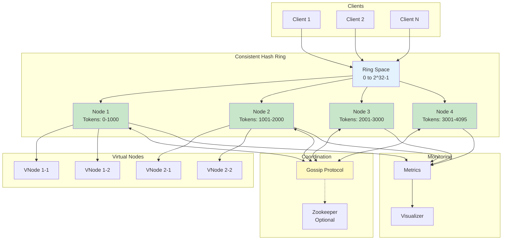
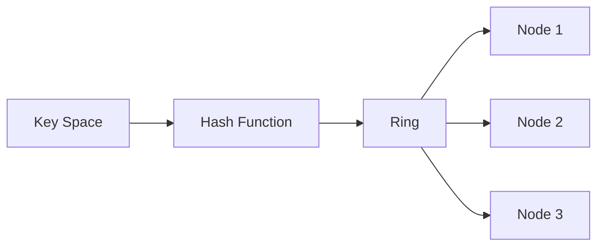
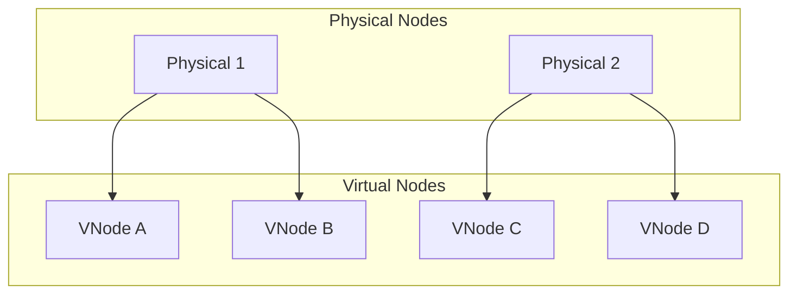
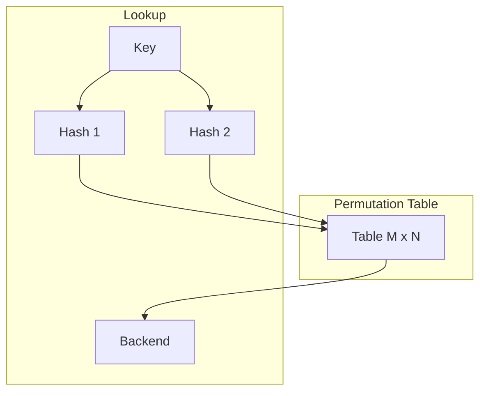
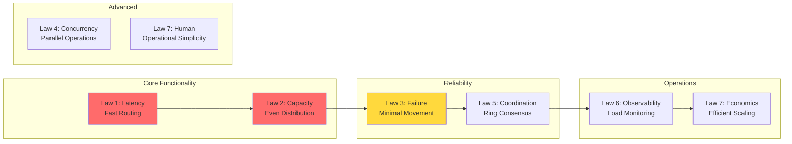
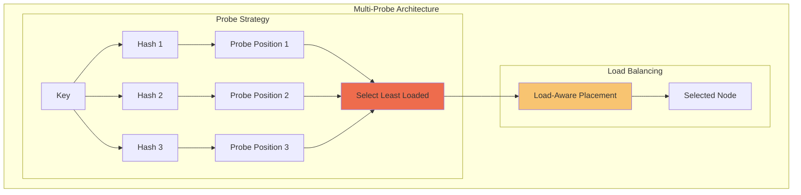
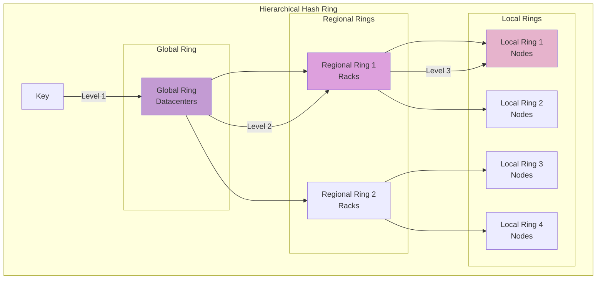
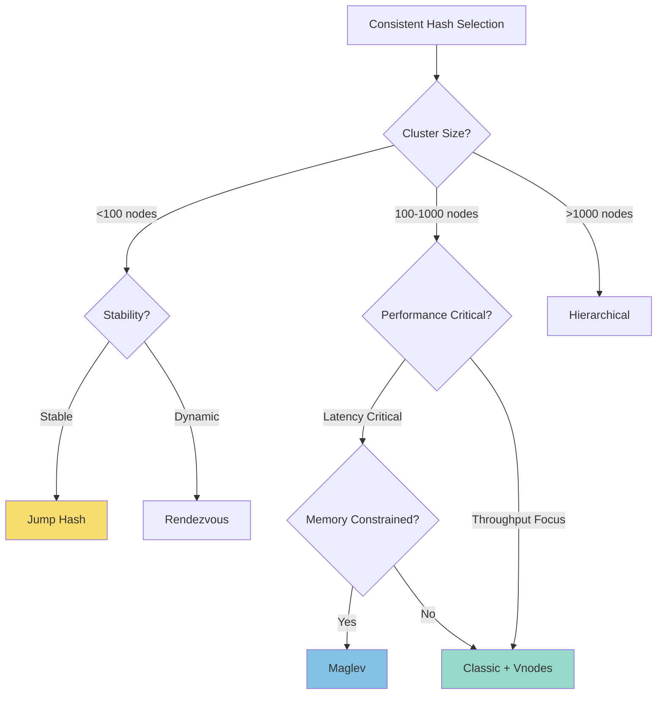

# Consistent Hashing

!!! info "Case Study Overview"
    **System**: Distributed data partitioning with minimal resharding  
    **Scale**: Support 1000+ nodes, millions of keys  
    **Challenges**: Even distribution, minimal data movement, heterogeneous nodes  
    **Key Patterns**: Hash ring, virtual nodes, replication, gossip protocol

## Challenge Statement
Design a distributed data partitioning scheme that minimizes data reorganization when nodes are added or removed from the cluster, while maintaining even load distribution and supporting efficient lookups.

## Part 1: Concept Map

### 🗺 System Overview
Consistent hashing is a distributed hashing scheme that operates independently of the number of servers. When a hash table is resized, only K/n keys need to be remapped on average, where K is the number of keys and n is the number of slots. This is in contrast to traditional hashing where a change in the number of slots causes nearly all keys to be remapped.

**Key Requirements:**
- O(1) key-to-node lookup time
- Minimal data movement on node changes (1/n of data)
- Even load distribution across nodes
- Support for heterogeneous node capacities
- Fault tolerance with replication

### Law Analysis

#### Law 1 (Latency): Hash Ring Traversal
```text
Latency Components:
- Hash computation: 0.001ms (SHA-256)
- Ring lookup: 0.01ms (binary search on sorted nodes)
- Routing decision: 0.001ms
- Total overhead: ~0.012ms

Optimization Strategies:
- Pre-computed routing tables
- Hierarchical rings for geo-distribution
- Client-side caching of ring topology
- Bloom filters for negative lookups

Ring Size Impact:
- 100 nodes: log₂(100) = 7 comparisons
- 1000 nodes: log₂(1000) = 10 comparisons
- 10000 virtual nodes: log₂(10000) = 14 comparisons
```

**Implementation:**
```python
import bisect
import hashlib
from typing import List, Tuple, Optional

class ConsistentHashRing:
    def __init__(self, virtual_nodes: int = 150):
        self.virtual_nodes = virtual_nodes
        self.ring = {}  # hash -> node mapping
        self.sorted_keys = []  # sorted hash values
        self._ring_cache = {}  # LRU cache for lookups
        
    def _hash(self, key: str) -> int:
        """Fast, uniform hash function"""
        return int(hashlib.md5(key.encode()).hexdigest(), 16)
    
    def add_node(self, node: str, weight: float = 1.0):
        """Add node with virtual nodes proportional to weight"""
        num_vnodes = int(self.virtual_nodes * weight)
        
        for i in range(num_vnodes):
            virtual_key = f"{node}:{i}"
            hash_value = self._hash(virtual_key)
            self.ring[hash_value] = node
            bisect.insort(self.sorted_keys, hash_value)
        
# Invalidate cache on topology change
        self._ring_cache.clear()
    
    def get_node(self, key: str) -> Optional[str]:
        """O(log n) lookup with caching"""
        if key in self._ring_cache:
            return self._ring_cache[key]
        
        if not self.ring:
            return None
        
        hash_value = self._hash(key)
        
# Binary search for next node
        index = bisect.bisect_right(self.sorted_keys, hash_value)
        if index == len(self.sorted_keys):
            index = 0  # Wrap around
        
        node = self.ring[self.sorted_keys[index]]
        self._ring_cache[key] = node  # Cache result
        return node
```

#### 💾 Law 2 (Capacity): Load Distribution
```text
Virtual Nodes Analysis:
- Physical nodes: 100
- Virtual nodes per physical: 150
- Total ring positions: 15,000
- Memory per virtual node: 100 bytes
- Total memory: 1.5MB

Load Distribution Math:
- Ideal load per node: 1/n
- Standard deviation with k virtual nodes: 1/√(k*n)
- 95% confidence interval: ±2σ

Example with 100 nodes:
- No virtual nodes: σ = 10% (poor distribution)
- 10 virtual nodes: σ = 3.2%
- 150 virtual nodes: σ = 0.8% (excellent)
- 1000 virtual nodes: σ = 0.3% (diminishing returns)
```

**Implementation:**
```python
class LoadBalancedHashRing(ConsistentHashRing):
    def __init__(self):
        super().__init__()
        self.node_loads = {}  # Track actual load
        self.target_load = {}  # Desired load per node
        
    def calculate_load_distribution(self, keys: List[str]) -> dict:
        """Analyze actual vs expected load distribution"""
        node_counts = {}
        
        for key in keys:
            node = self.get_node(key)
            node_counts[node] = node_counts.get(node, 0) + 1
        
        total_keys = len(keys)
        distribution = {}
        
        for node, count in node_counts.items():
            actual_load = count / total_keys
            expected_load = self.target_load.get(node, 1/len(self.get_nodes()))
            distribution[node] = {
                'actual': actual_load,
                'expected': expected_load,
                'deviation': abs(actual_load - expected_load) / expected_load
            }
        
        return distribution
    
    def rebalance_virtual_nodes(self, distribution: dict):
        """Dynamically adjust virtual nodes based on load"""
        for node, stats in distribution.items():
            if stats['deviation'] > 0.1:  # 10% threshold
# Calculate new virtual node count
                current_vnodes = self._count_virtual_nodes(node)
                adjustment_factor = stats['expected'] / stats['actual']
                new_vnodes = int(current_vnodes * adjustment_factor)
                
# Remove and re-add with new count
                self.remove_node(node)
                weight = new_vnodes / self.virtual_nodes
                self.add_node(node, weight)
```

#### Law 3 (Failure): Node Failures and Recovery
```text
Failure Scenarios:
1. Node crash: Keys rehashed to next node
2. Network partition: Split ring topology
3. Cascading failures: Thundering herd on remaining nodes
4. Ring corruption: Inconsistent topology views

Mitigation Strategies:
- Replication factor N (typically 3)
- Successor lists for quick failover
- Gossip protocol for ring state
- Bounded load to prevent cascades
- Consistent ring checkpoints
```

**Implementation:**
```python
class ResilientHashRing(ConsistentHashRing):
    def __init__(self, replication_factor: int = 3):
        super().__init__()
        self.replication_factor = replication_factor
        self.node_health = {}  # node -> health status
        self.successor_list = {}  # node -> [successors]
        
    def get_replica_nodes(self, key: str) -> List[str]:
        """Get N nodes for replication"""
        if not self.ring:
            return []
        
        replicas = []
        seen_physical_nodes = set()
        
        hash_value = self._hash(key)
        start_index = bisect.bisect_right(self.sorted_keys, hash_value)
        
# Walk the ring to find N distinct physical nodes
        for i in range(len(self.sorted_keys)):
            index = (start_index + i) % len(self.sorted_keys)
            node = self.ring[self.sorted_keys[index]]
            
            if node not in seen_physical_nodes:
                if self._is_node_healthy(node):
                    replicas.append(node)
                    seen_physical_nodes.add(node)
                    
                if len(replicas) >= self.replication_factor:
                    break
        
        return replicas
    
    def _is_node_healthy(self, node: str) -> bool:
        """Check if node is available"""
        return self.node_health.get(node, True)
    
    def handle_node_failure(self, failed_node: str):
        """Gracefully handle node failure"""
        self.node_health[failed_node] = False
        
# Find affected key ranges
        affected_ranges = self._get_affected_ranges(failed_node)
        
# Trigger re-replication for affected data
        for range_start, range_end in affected_ranges:
            next_healthy_node = self._find_next_healthy_node(range_end)
            
# Log re-replication task
            logger.info(f"Re-replicate range [{range_start}, {range_end}] "
                       f"from {failed_node} to {next_healthy_node}")
```

#### 🔀 Law 4 (Concurrency): Concurrent Ring Modifications
```text
Concurrency Challenges:
- Multiple nodes joining simultaneously
- Concurrent failures during rebalancing
- Read-write conflicts on ring state
- Topology version conflicts

Solutions:
- Vector clocks for ring versions
- Two-phase commit for topology changes
- Read-write locks with timeout
- Optimistic concurrency control
```

**Implementation:**
```python
import threading
from datetime import datetime

class ConcurrentHashRing(ConsistentHashRing):
    def __init__(self):
        super().__init__()
        self.ring_lock = threading.RWLock()
        self.version_vector = {}  # node -> version
        self.pending_changes = []
        
    def add_node_safe(self, node: str, initiator: str):
        """Thread-safe node addition with vector clock"""
        with self.ring_lock.write():
# Increment version for initiator
            self.version_vector[initiator] = \
                self.version_vector.get(initiator, 0) + 1
            
# Create change record
            change = {
                'type': 'add_node',
                'node': node,
                'timestamp': datetime.utcnow(),
                'version': self.version_vector.copy(),
                'initiator': initiator
            }
            
# Apply change if no conflicts
            if self._can_apply_change(change):
                self.add_node(node)
                self._broadcast_change(change)
            else:
# Queue for later reconciliation
                self.pending_changes.append(change)
    
    def get_node_safe(self, key: str) -> Optional[str]:
        """Thread-safe read with shared lock"""
        with self.ring_lock.read():
            return self.get_node(key)
    
    def reconcile_pending_changes(self):
        """Resolve conflicts in pending changes"""
        with self.ring_lock.write():
# Sort by vector clock partial order
            sorted_changes = self._topological_sort(self.pending_changes)
            
            for change in sorted_changes:
                if change['type'] == 'add_node':
                    self.add_node(change['node'])
                elif change['type'] == 'remove_node':
                    self.remove_node(change['node'])
            
            self.pending_changes.clear()
```

#### 🤝 Law 5 (Coordination): Ring Topology Consensus
```text
Coordination Requirements:
- All nodes must agree on ring membership
- Consistent view during topology changes
- Ordered node join/leave operations
- Replication group consensus

Implementation Options:
1. Centralized coordinator (Zookeeper)
2. Gossip-based eventual consistency
3. Consensus protocol (Raft/Paxos)
4. Hybrid approach
```

**Implementation:**
```python
class CoordinatedHashRing(ConsistentHashRing):
    def __init__(self, node_id: str, peers: List[str]):
        super().__init__()
        self.node_id = node_id
        self.peers = peers
        self.ring_state = 'stable'  # stable, joining, leaving
        self.coordinator = None
        self.gossip_interval = 1.0  # seconds
        
    async def join_ring(self):
        """Coordinated ring join protocol"""
# Phase 1: Announce intention to join
        join_request = {
            'node': self.node_id,
            'capacity': self._get_node_capacity(),
            'timestamp': time.time()
        }
        
# Phase 2: Get current ring state
        current_topology = await self._fetch_ring_topology()
        
# Phase 3: Calculate new token ranges
        my_tokens = self._calculate_tokens(
            current_topology, 
            self.node_id,
            self.virtual_nodes
        )
        
# Phase 4: Coordinate with affected nodes
        affected_nodes = self._find_affected_nodes(my_tokens, current_topology)
        
# Phase 5: Two-phase commit
        prepared = await self._prepare_topology_change(
            affected_nodes, 
            my_tokens
        )
        
        if prepared:
            await self._commit_topology_change(affected_nodes)
            self.ring_state = 'stable'
        else:
            await self._abort_topology_change(affected_nodes)
            raise Exception("Failed to join ring")
    
    async def _gossip_ring_state(self):
        """Epidemic propagation of ring state"""
        while True:
# Select random subset of peers
            gossip_targets = random.sample(
                self.peers, 
                min(3, len(self.peers))
            )
            
# Exchange ring state
            local_state = self._get_ring_digest()
            
            for peer in gossip_targets:
                try:
                    remote_state = await self._exchange_state(peer, local_state)
                    self._merge_ring_state(remote_state)
                except Exception as e:
                    logger.warning(f"Gossip to {peer} failed: {e}")
            
            await asyncio.sleep(self.gossip_interval)
```

#### 👁 Law 6 (Observability): Ring Monitoring
```text
Key Metrics:
- Load distribution (standard deviation)
- Key migration rate
- Ring topology changes/hour
- Lookup latency (p50, p95, p99)
- Virtual node efficiency
- Replication lag

Monitoring Requirements:
- Real-time load heatmaps
- Historical ring evolution
- Anomaly detection for hotspots
- Topology change audit log
```

**Implementation:**
```python
class ObservableHashRing(ConsistentHashRing):
    def __init__(self):
        super().__init__()
        self.metrics = MetricsCollector()
        self.lookup_histogram = Histogram()
        self.load_tracker = {}
        
    def get_node_with_metrics(self, key: str) -> Optional[str]:
        """Instrumented lookup with metrics"""
        start_time = time.perf_counter()
        
        node = self.get_node(key)
        
# Record lookup latency
        latency_us = (time.perf_counter() - start_time) * 1_000_000
        self.lookup_histogram.observe(latency_us)
        
# Track load
        if node:
            self.load_tracker[node] = self.load_tracker.get(node, 0) + 1
        
# Detect hot keys
        key_hash = self._hash(key)
        self.metrics.increment('hash_ring.lookups', tags={
            'node': node,
            'ring_segment': self._get_ring_segment(key_hash)
        })
        
        return node
    
    def analyze_ring_health(self) -> dict:
        """Comprehensive ring health analysis"""
        nodes = list(set(self.ring.values()))
        
# Calculate load distribution
        loads = []
        for node in nodes:
            load = self.load_tracker.get(node, 0)
            loads.append(load)
        
        avg_load = sum(loads) / len(loads) if loads else 0
        std_dev = statistics.stdev(loads) if len(loads) > 1 else 0
        
# Find hot spots
        hot_spots = []
        for node, load in self.load_tracker.items():
            if load > avg_load * 1.5:  # 50% above average
                hot_spots.append({
                    'node': node,
                    'load': load,
                    'deviation': (load - avg_load) / avg_load
                })
        
        return {
            'total_nodes': len(nodes),
            'total_virtual_nodes': len(self.ring),
            'avg_virtual_per_physical': len(self.ring) / len(nodes),
            'load_std_deviation': std_dev,
            'load_coefficient_variation': std_dev / avg_load if avg_load else 0,
            'hot_spots': hot_spots,
            'lookup_latency_p50': self.lookup_histogram.percentile(0.5),
            'lookup_latency_p99': self.lookup_histogram.percentile(0.99)
        }
```

#### 👤 Law 7 (Human Interface): Operational Tools
```text
Operational Requirements:
- Visual ring representation
- Load rebalancing tools
- Migration planning
- Debugging utilities
- Performance tuning

Interface Design:
- CLI for ring management
- Web UI for visualization
- API for automation
- Alerts for imbalances
```

**Implementation:**
```python
class OperationalHashRing(ConsistentHashRing):
    def visualize_ring(self) -> str:
        """ASCII art representation of ring"""
        if not self.ring:
            return "Empty ring"
        
# Group virtual nodes by physical node
        node_positions = {}
        for hash_val, node in self.ring.items():
            if node not in node_positions:
                node_positions[node] = []
# Normalize to 0-360 degrees
            angle = (hash_val / (2**32)) * 360
            node_positions[node].append(angle)
        
# Create visual representation
        visual = ["Ring Topology (0-360°):"]
        visual.append("-" * 50)
        
        for node, positions in sorted(node_positions.items()):
            positions.sort()
            ranges = self._compute_ranges(positions)
            visual.append(f"{node}: {len(positions)} vnodes")
            for start, end in ranges:
                visual.append(f"  [{start:3.0f}°-{end:3.0f}°]")
        
        return "\n".join(visual)
    
    def plan_node_addition(self, new_node: str, target_load: float = None) -> dict:
        """Plan optimal node addition"""
        if target_load is None:
            target_load = 1 / (len(set(self.ring.values())) + 1)
        
# Calculate required virtual nodes
        total_vnodes = len(self.ring)
        required_vnodes = int(total_vnodes * target_load)
        
# Simulate addition
        temp_ring = self._copy_ring()
        temp_ring.add_node(new_node, weight=required_vnodes/self.virtual_nodes)
        
# Analyze data movement
        moved_keys = 0
        key_movements = []
        
        for i in range(10000):  # Sample keys
            test_key = f"test_key_{i}"
            old_node = self.get_node(test_key)
            new_node_assignment = temp_ring.get_node(test_key)
            
            if old_node != new_node_assignment:
                moved_keys += 1
                if len(key_movements) < 10:  # First 10 examples
                    key_movements.append({
                        'key': test_key,
                        'from': old_node,
                        'to': new_node_assignment
                    })
        
        movement_percentage = (moved_keys / 10000) * 100
        
        return {
            'new_node': new_node,
            'recommended_vnodes': required_vnodes,
            'estimated_data_movement': f"{movement_percentage:.1f}%",
            'example_movements': key_movements,
            'new_load_distribution': temp_ring.calculate_load_distribution([])
        }
```

#### Law 8 (Economics): Cost Optimization
```text
Cost Factors:
- Memory: Virtual nodes storage
- CPU: Hash computations
- Network: Topology gossip
- Storage: Replication overhead
- Operations: Rebalancing costs

Optimization Strategies:
- Adaptive virtual nodes
- Lazy topology updates
- Bounded replication
- Tiered storage
```

**Implementation:**
```python
class EconomicHashRing(ConsistentHashRing):
    def __init__(self):
        super().__init__()
        self.cost_model = {
            'memory_per_vnode': 0.0001,  # $ per vnode per month
            'cpu_per_lookup': 0.000001,  # $ per million lookups
            'network_per_gb': 0.10,      # $ per GB transfer
            'rebalance_per_gb': 0.50     # $ per GB moved
        }
        
    def optimize_virtual_nodes(self, constraints: dict) -> int:
        """Find optimal virtual node count"""
        min_vnodes = 10   # Minimum for basic distribution
        max_vnodes = 1000 # Maximum reasonable value
        
        best_vnodes = min_vnodes
        best_cost = float('inf')
        
        for vnodes in range(min_vnodes, max_vnodes, 10):
# Calculate distribution quality
            distribution_quality = 1 / math.sqrt(vnodes)  # Approximation
            
# Calculate costs
            memory_cost = vnodes * self.cost_model['memory_per_vnode']
            
# Estimate rebalancing cost (inversely proportional to vnodes)
            rebalance_frequency = constraints.get('node_changes_per_month', 5)
            avg_rebalance_size = constraints.get('avg_data_per_node_gb', 100)
            rebalance_cost = (rebalance_frequency * avg_rebalance_size * 
                            self.cost_model['rebalance_per_gb'] / vnodes)
            
            total_cost = memory_cost + rebalance_cost
            
# Check if distribution meets SLA
            if distribution_quality < constraints.get('max_load_deviation', 0.1):
                if total_cost < best_cost:
                    best_cost = total_cost
                    best_vnodes = vnodes
        
        return best_vnodes
    
    def estimate_migration_cost(self, from_topology: dict, to_topology: dict) -> dict:
        """Calculate cost of topology change"""
# Simulate key movements
        moved_data_gb = 0
        affected_nodes = set()
        
# Sample keys to estimate movement
        sample_size = 100000
        for i in range(sample_size):
            key = f"sample_{i}"
            old_node = self._get_node_in_topology(key, from_topology)
            new_node = self._get_node_in_topology(key, to_topology)
            
            if old_node != new_node:
# Estimate data size (example: 1KB per key)
                moved_data_gb += 0.000001  # 1KB in GB
                affected_nodes.add(old_node)
                affected_nodes.add(new_node)
        
# Extrapolate to full dataset
        total_keys = constraints.get('total_keys', 1_000_000_000)
        moved_data_gb *= (total_keys / sample_size)
        
        migration_cost = moved_data_gb * self.cost_model['rebalance_per_gb']
        network_cost = moved_data_gb * self.cost_model['network_per_gb']
        
        return {
            'moved_data_gb': moved_data_gb,
            'affected_nodes': len(affected_nodes),
            'migration_cost': migration_cost,
            'network_cost': network_cost,
            'total_cost': migration_cost + network_cost,
            'estimated_duration_hours': moved_data_gb / 10  # 10GB/hour
        }
```

### 🏛 Pillar Mapping

#### Work Distribution
- **Hash Space Partitioning**: 2^32 or 2^64 space divided among nodes
- **Virtual Node Assignment**: Multiple tokens per physical node
- **Load Balancing**: Even distribution through random hash placement
- **Request Routing**: Deterministic key-to-node mapping

#### State Management
- **Ring Topology State**: Sorted list of hash values to nodes
- **Replication State**: Which nodes hold which key ranges
- **Version State**: Ring topology version/epoch
- **Health State**: Node availability and capacity

#### Truth & Consistency
- **Ring Authority**: Who decides ring membership (coordinator vs gossip)
- **Topology Consistency**: All nodes see same ring eventually
- **Replication Consistency**: Quorum-based or eventual
- **Version Reconciliation**: Vector clocks or epochs

#### Control Mechanisms
- **Join Protocol**: How nodes enter the ring
- **Leave Protocol**: Graceful departure procedures
- **Rebalancing Control**: When and how to redistribute
- **Failure Detection**: Heartbeats and timeouts

#### Intelligence Layer
- **Adaptive Virtual Nodes**: Adjust based on actual load
- **Smart Placement**: Consider rack/datacenter topology
- **Predictive Scaling**: Anticipate load changes
- **Hot Spot Detection**: Identify and mitigate skew

### Pattern Application

**Primary Patterns:**
- **Consistent Hashing**: Core ring-based distribution
- **Virtual Nodes**: Improved load distribution
- **Replication**: N-way replication for fault tolerance
- **Gossip Protocol**: Ring state propagation

**Supporting Patterns:**
- **Two-Phase Commit**: Coordinated topology changes
- **Vector Clocks**: Conflict resolution
- **Bloom Filters**: Efficient negative lookups
- **Circuit Breaker**: Protect against cascading failures

## Part 2: Architecture & Trade-offs

### Core Architecture



### Key Design Trade-offs

| Decision | Option A | Option B | Choice & Rationale |
|----------|----------|----------|-------------------|
| **Hash Function** | MD5 (128-bit) | SHA-256 (256-bit) | **A** - MD5 sufficient for distribution, not security. Faster computation, smaller ring space |
| **Virtual Nodes** | Fixed count (150) | Dynamic/adaptive | **B** - Adaptive based on node capacity and actual load. Better handles heterogeneous clusters |
| **Ring Maintenance** | Centralized (Zookeeper) | Gossip protocol | **B** - Gossip for eventual consistency. More resilient, no SPOF, handles partitions better |
| **Replication Strategy** | Successor list | Preference list | **A** - Successor list simpler, natural with ring topology. Fast failover |
| **Token Assignment** | Random | Equally spaced | **A** - Random prevents patterns, better distribution with virtual nodes |
| **Client Awareness** | Smart clients | Proxy/router | **A** - Smart clients reduce latency, distribute load, cache topology |


### Alternative Architectures

#### Option 1: Simple Ring (Original Karger)


**Approach**: Each physical node gets one position on ring
**Pros**: 
- Extremely simple implementation
- Minimal memory overhead
- Easy to understand and debug

**Cons**: 
- Poor load distribution
- Large data movement on changes
- No fault tolerance

**When to use**: Proof of concepts, small static clusters

#### Option 2: Virtual Nodes (Dynamo-style)


**Approach**: Each physical node manages multiple virtual nodes
**Pros**: 
- Much better load distribution
- Flexible capacity allocation
- Smooth rebalancing

**Cons**: 
- Higher memory usage
- More complex routing
- Token management overhead

**When to use**: Production systems, heterogeneous hardware

#### Option 3: Jump Hash (Google)
```python
def jump_hash(key: int, num_buckets: int) -> int:
    """Google's jump consistent hash"""
    b = -1
    j = 0
    while j < num_buckets:
        b = j
        key = key * 2862933555777941757 + 1
        j = int((b + 1) * (2**31 / ((key >> 33) + 1)))
    return b
```

**Approach**: No explicit ring, mathematical bucket assignment
**Pros**: 
- O(ln n) computation
- Zero memory overhead
- Optimal data movement

**Cons**: 
- No weighted nodes
- Sequential bucket numbers only
- Can't remove arbitrary nodes

**When to use**: Homogeneous clusters, memory-constrained environments

#### Option 4: Maglev Hash (Google)


**Approach**: Pre-computed lookup table with minimal disruption
**Pros**: 
- Fast O(1) lookup
- Minimal disruption on changes
- Even distribution

**Cons**: 
- High memory usage (65K entries)
- Slow table rebuild
- Complex implementation

**When to use**: Load balancers, high-performance requirements

#### Option 5: Rendezvous Hash (HRW)
```python
def rendezvous_hash(key: str, nodes: List[str]) -> str:
    """Highest Random Weight hashing"""
    def weight(node: str, key: str) -> float:
        hash_val = hashlib.sha256(f"{node}:{key}".encode()).hexdigest()
        return int(hash_val, 16)
    
    return max(nodes, key=lambda n: weight(n, key))
```

**Approach**: Calculate weight for each node, pick highest
**Pros**: 
- No ring to maintain
- Natural weighting support
- Minimal state

**Cons**: 
- O(n) lookup complexity
- Expensive for large clusters
- No locality benefits

**When to use**: Small clusters, weighted distribution needs

### Performance Characteristics

**Lookup Performance:**
```text
Algorithm         Complexity   Memory    Distribution   Flexibility
Simple Ring       O(log n)     O(n)      Poor          Low
Virtual Nodes     O(log v)     O(v)      Good          High
Jump Hash         O(log n)     O(1)      Perfect       Low
Maglev           O(1)         O(M)      Good          Medium
Rendezvous       O(n)         O(n)      Good          High

n = number of nodes, v = virtual nodes, M = table size
```

**Data Movement on Node Changes:**
```text
Scenario: 100 nodes → 101 nodes (add 1)

Algorithm         Keys Moved    Data Moved
Traditional Hash  ~99%          99GB/100GB
Simple Ring       ~1%           1GB/100GB
Virtual Nodes     ~0.99%        0.99GB/100GB
Jump Hash         ~0.99%        0.99GB/100GB
```

**Load Distribution (Standard Deviation):**
```text
Nodes   Simple Ring   Virtual(150)   Jump Hash   Maglev
10      ±31.6%       ±2.6%          ±0%         ±1.2%
100     ±10.0%       ±0.8%          ±0%         ±0.4%
1000    ±3.2%        ±0.3%          ±0%         ±0.1%
```

**Operational Metrics:**
- Ring rebuild time: 10-100ms
- Gossip convergence: 2-5 seconds
- Node join time: 100-500ms
- Rebalance rate: 10-50MB/s per node
- Memory per virtual node: 50-200 bytes

## Law Mapping Matrix

### Comprehensive Design Decision Mapping

| Design Decision | Law 1<br/>🚀 Latency | Law 2<br/>💾 Capacity | Law 3<br/>🔥 Failure | Law 4<br/>🔀 Concurrency | Law 5<br/>🤝 Coordination | Law 6<br/>👁️ Observability | Law 7<br/>👤 Human | Law 8<br/>💰 Economics |
|----------------|----------|----------|---------|-------------|--------------|---------------|-------|-----------|
| **Hash Ring** | ✅ O(log n) lookup | ✅ Even distribution | ✅ Minimal data movement | ⚪ | ✅ Deterministic routing | ✅ Ring visualization | ✅ Simple concept | ✅ Efficient scaling |
| **Virtual Nodes** | ⚪ More comparisons | ✅ Better balance | ✅ Smoother rebalancing | ⚪ | ✅ Fine-grained control | ✅ Distribution metrics | ⚪ | ✅ Handles heterogeneity |
| **Consistent Hash Function** | ✅ Fast computation | ✅ Uniform distribution | ⚪ | ✅ No coordination | ⚪ | ✅ Hash quality metrics | ⚪ | ⚪ |
| **Replication Strategy** | ⚪ Multiple lookups | ✅ N-way redundancy | ✅ Fault tolerance | ✅ Parallel reads | ✅ Replica placement | ✅ Replica health | ✅ High availability | ✅ Storage trade-off |
| **Gossip Protocol** | ⚪ Convergence time | ✅ Scalable state sync | ✅ Partition tolerant | ✅ Async propagation | ✅ Eventual consistency | ✅ Convergence tracking | ⚪ | ✅ Low bandwidth |
| **Client-side Routing** | ✅ No proxy hop | ✅ Distributed load | ✅ No SPOF | ✅ Parallel requests | ✅ Topology caching | ✅ Client metrics | ✅ Direct access | ✅ Reduced infrastructure |
| **Successor Lists** | ✅ Fast failover | ⚪ | ✅ Quick recovery | ⚪ | ✅ Backup nodes ready | ✅ Failover tracking | ✅ Predictable behavior | ⚪ |
| **Weight-based Allocation** | ⚪ | ✅ Heterogeneous support | ✅ Prevents overload | ⚪ | ✅ Capacity planning | ✅ Load per node type | ✅ Resource awareness | ✅ Optimal utilization |


**Legend**: ✅ Primary impact | ⚪ Secondary/No impact

### Law Implementation Priority



## Architecture Alternatives Analysis

### Alternative 1: Jump Consistent Hash

```mermaid
graph TB
    subgraph "Jump Hash Architecture"
        subgraph "Hash Computation"
            K[Key] --> JH[Jump Hash Function]
            N[Number of Buckets] --> JH
            JH --> B[Bucket ID]
        end
        
        subgraph "Advantages"
            A1[No Memory Overhead]
            A2[O(ln n) Computation]
            A3[Perfect Balance]
        end
        
        subgraph "Limitations"
            L1[No Server Weights]
            L2[Sequential Growth Only]
            L3[No Arbitrary Removal]
        end
    end
    
    style JH fill:#4ecdc4
    style A1 fill:#98d8c8
    style L1 fill:#ff6b6b
```

### Alternative 2: Rendezvous Hashing

```mermaid
graph TB
    subgraph "Rendezvous (HRW) Hashing"
        subgraph "Score Calculation"
            K[Key] --> S1[Score with Node 1]
            K --> S2[Score with Node 2]
            K --> SN[Score with Node N]
            
            S1 & S2 & SN --> MAX[Select Max Score]
            MAX --> SELECTED[Selected Node]
        end
        
        subgraph "Properties"
            P1[No Ring Structure]
            P2[O(n) Computation]
            P3[Minimal Disruption]
            P4[Simple Implementation]
        end
    end
    
    style MAX fill:#f6d55c
    style P3 fill:#98d8c8
```

### Alternative 3: Maglev Hashing

```mermaid
graph TB
    subgraph "Maglev Consistent Hash"
        subgraph "Lookup Table"
            PERM[Permutation<br/>per Backend] --> TABLE[Lookup Table<br/>65537 entries]
            TABLE --> BACKEND[Backend Selection]
        end
        
        subgraph "Construction"
            B1[Backend 1] --> FILL1[Fill Positions]
            B2[Backend 2] --> FILL2[Fill Positions]
            BN[Backend N] --> FILLN[Fill Positions]
            
            FILL1 & FILL2 & FILLN --> TABLE
        end
        
        subgraph "Benefits"
            BEN1[O(1) Lookup]
            BEN2[Minimal Memory]
            BEN3[Fast Convergence]
        end
    end
    
    style TABLE fill:#85c1e2
    style BEN1 fill:#98d8c8
```

### Alternative 4: Multi-Probe Consistent Hash



### Alternative 5: Hierarchical Consistent Hash



## Comparative Trade-off Analysis

### Algorithm Comparison Matrix

| Algorithm | Lookup Time | Memory | Balance Quality | Flexibility | Use Case |
|-----------|-------------|---------|-----------------|-------------|----------|
| **Classic Ring + Virtual Nodes** | ⭐⭐⭐⭐<br/>O(log n) | ⭐⭐⭐<br/>O(n×v) | ⭐⭐⭐⭐<br/>Good with 150 vnodes | ⭐⭐⭐⭐⭐<br/>Weights, arbitrary changes | General purpose, proven |
| **Jump Hash** | ⭐⭐⭐⭐⭐<br/>O(ln n) | ⭐⭐⭐⭐⭐<br/>O(1) | ⭐⭐⭐⭐⭐<br/>Perfect | ⭐<br/>Only grow/shrink | Sharded counters, caches |
| **Rendezvous** | ⭐⭐<br/>O(n) | ⭐⭐⭐⭐⭐<br/>O(1) | ⭐⭐⭐⭐⭐<br/>Optimal | ⭐⭐⭐⭐<br/>Very flexible | Small clusters (<100 nodes) |
| **Maglev** | ⭐⭐⭐⭐⭐<br/>O(1) | ⭐⭐⭐⭐<br/>Fixed 65K table | ⭐⭐⭐⭐<br/>Very good | ⭐⭐⭐<br/>Moderate | Load balancers, CDN |
| **Multi-Probe** | ⭐⭐⭐⭐<br/>O(k) probes | ⭐⭐⭐⭐<br/>O(n) | ⭐⭐⭐⭐⭐<br/>Load-aware | ⭐⭐⭐<br/>Moderate | Hot spot mitigation |
| **Hierarchical** | ⭐⭐⭐<br/>O(log n × levels) | ⭐⭐<br/>Multiple rings | ⭐⭐⭐⭐<br/>Locality-aware | ⭐⭐⭐⭐<br/>Flexible per level | Geo-distributed systems |


### Decision Framework



### Implementation Complexity

| Aspect | Classic Ring | Jump | Rendezvous | Maglev | Multi-Probe |
|--------|--------------|------|------------|---------|-------------|
| **Implementation** | 🟡 Medium | 🟢 Simple | 🟢 Simple | 🟡 Medium | 🟡 Medium |
| **Debugging** | 🟢 Visual ring | 🟡 Abstract | 🟢 Straightforward | 🔴 Complex table | 🟡 Multiple hashes |
| **Testing** | 🟢 Well understood | 🟢 Deterministic | 🟢 Easy | 🟡 Table generation | 🟡 Load scenarios |
| **Operations** | 🟢 Mature tools | 🟡 Limited tools | 🟡 Basic | 🟡 Specialized | 🔴 Complex tuning |
| **Documentation** | 🟢 Extensive | 🟢 Good | 🟡 Moderate | 🟡 Moderate | 🔴 Limited |


## Key Design Insights

### 1. **Virtual Nodes Solve Distribution**
- 150-200 vnodes per physical node optimal
- Prevents hot spots from hash function bias
- Enables smooth rebalancing

### 2. **Minimal Movement is Critical**
- Only K/n keys should move when adding node
- Successor lists enable fast failover
- Client-side caching reduces lookup cost

### 3. **Topology Changes are Rare but Critical**
- Most systems add/remove nodes infrequently
- Gossip protocol sufficient for ring state
- Strong consistency overkill for topology

### 4. 💪 **Heterogeneity is the Norm**
- Real clusters have different hardware
- Weight-based virtual nodes essential
- Monitor and rebalance based on actual load

### 5. **Observability Prevents Drift**
- Load imbalance accumulates over time
- Active monitoring catches issues early
- Automated rebalancing based on metrics

## Implementation Best Practices

### Ring Management

```python
class ConsistentHashRing:
    """Production-ready consistent hash implementation"""
    
    def __init__(self, virtual_nodes=150):
        self.virtual_nodes = virtual_nodes
        self.ring = SortedDict()  # Sorted by hash value
        self.node_weights = {}    # Node -> weight mapping
        self.stats = RingStats()  # Monitoring
        
    def add_node(self, node, weight=1.0):
        """Add node with weight-based virtual nodes"""
        vnodes = int(self.virtual_nodes * weight)
        
        for i in range(vnodes):
            vnode_key = f"{node}:{i}"
            hash_val = self._hash(vnode_key)
            self.ring[hash_val] = node
            
        self.node_weights[node] = weight
        self.stats.record_topology_change('add', node)
        
    def get_node(self, key):
        """Get node with monitoring"""
        start = time.time()
        
        if not self.ring:
            return None
            
        hash_val = self._hash(key)
        idx = self.ring.bisect_right(hash_val)
        
        if idx == len(self.ring):
            idx = 0
            
        node = self.ring.values()[idx]
        
        self.stats.record_lookup(time.time() - start, node)
        return node
```

### Monitoring Setup

| Metric | Description | Alert Threshold |
|--------|-------------|-----------------|
| Load Standard Deviation | Distribution quality | > 20% of mean |
| Lookup Latency P99 | Routing performance | > 10ms |
| Topology Change Rate | Stability indicator | > 1 per hour |
| Node Weight Drift | Actual vs configured | > 30% difference |
| Replication Lag | Consistency measure | > 5 seconds |


### 🎓 Key Lessons

1. **Virtual Nodes are Essential**: Physical nodes alone give poor distribution. 100-200 virtual nodes per physical node provides good balance between distribution quality and overhead.

2. **Gossip Scales Better Than Consensus**: For ring topology, eventual consistency via gossip is more resilient than strong consistency via Paxos/Raft. Topology changes are infrequent.

3. **Client-Side Routing Wins**: Smart clients that cache ring topology eliminate proxy bottlenecks and reduce latency. Topology updates can be pushed or pulled.

4. **Monitor Distribution Actively**: Load imbalance creeps in over time. Continuous monitoring and adaptive virtual node counts maintain balance.

5. **Plan for Heterogeneity**: Real clusters have different hardware. Weight-based virtual node allocation handles this elegantly.

### 📚 References

**Seminal Papers:**
- [Consistent Hashing and Random Trees](https://www.cs.princeton.edu/courses/archive/fall09/cos518/papers/chash.pdf) - Original Karger et al.
- [Dynamo: Amazon's Highly Available Key-value Store](https://www.allthingsdistributed.com/files/amazon-dynamo-sosp2007.pdf)
- [Jump Consistent Hash](https://arxiv.org/pdf/1406.2294.pdf) - Google's approach
- [Maglev: A Fast and Reliable Software Network Load Balancer](https://static.googleusercontent.com/media/research.google.com/en//pubs/archive/44824.pdf)

**Production Implementations:**
- [Cassandra's Token Ring](https://cassandra.apache.org/doc/latest/architecture/dynamo.html)
- [Riak's Consistent Hashing](https://docs.riak.com/riak/kv/latest/learn/concepts/replication/index.html)
- [Memcached Ketama](https://github.com/RJ/ketama)
- [Discord's Consistent Hashing](https://discord.com/blog/how-discord-stores-billions-of-messages)

**Related Patterns:**
- [Virtual Nodes](/patterns/sharding)
- Gossip Protocol
- Vector Clocks
- Replication (Coming Soon)

## Related Concepts & Deep Dives

### 📚 Relevant Laws (Part I)
- **[Law 2: Asynchronous Reality ](/part1-axioms/law2-asynchrony/)** - O(log n) lookup time with client-side caching reduces routing latency
- **[Law 4: Trade-offs ](/part1-axioms/law4-tradeoffs/)** - Even distribution prevents capacity hot spots across nodes
- **[Law 1: Failure ](/part1-axioms/law1-failure/)** - Minimal key movement (K/n) during node failures ensures stability
- **[Law 3: Emergence ](/part1-axioms/law3-emergence/)** - Ring lookups are lock-free read operations
- **[Law 5: Epistemology ](/part1-axioms/law5-epistemology/)** - Gossip protocol provides eventual consistency for ring topology and load distribution metrics
- **[Law 6: Human-API ](/part1-axioms/law6-human-api/)** - Visual ring representation aids debugging and operations
- **[Law 7: Economics ](/part1-axioms/law7-economics/)** - Efficient scaling without full data redistribution saves bandwidth

### 🏛 Related Patterns (Part III)
- **[Sharding & Partitioning](/patterns/sharding)** - Consistent hashing is the foundation for data sharding
- **[Load Balancing](/patterns/load-balancing)** - Ring-based routing distributes requests evenly
- **[Service Discovery](/patterns/service-discovery)** - Ring topology changes propagate via gossip
- **Replication (Coming Soon)** - Successor lists define replica placement
- **[Health Check](/patterns/health-check)** - Node failures trigger ring rebalancing
- **[Caching Strategies](/patterns/caching-strategies)** - Client-side topology caching reduces lookups
- **[Leader Election](/patterns/leader-election)** - Ring position can determine partition ownership

### Quantitative Models
- **Ring Theory** - Mathematical foundation for hash rings
- **Load Distribution** - Standard deviation measures balance quality
- **[Little's Law](/quantitative/littles-law)** - Rebalancing rate impacts system capacity
- **Probability Theory** - Virtual node count affects distribution variance

### 👥 Human Factors Considerations
- **[Capacity Planning](/quantitative/capacity-planning)** - Node weights must match actual capacity
- **[Observability Tools](/human-factors/observability-stacks)** - Ring visualizers essential for operations
- **[Incident Response](/human-factors/incident-response)** - Hot spot detection and mitigation procedures
- **[On-Call Culture](/human-factors/oncall-culture)** - Understanding ring rebalancing critical for operators

### Similar Case Studies
- **[Amazon DynamoDB](amazon-dynamo.md)** - Production implementation of consistent hashing at scale
- **[Rate Limiter Design](rate-limiter.md)** - Uses consistent hashing for distributed rate limit state
- **[News Feed System](news-feed.md)** - Shards user timelines using consistent hashing
- **[PayPal Payments](paypal-payments.md)** - Routes payment processing using consistent hashing