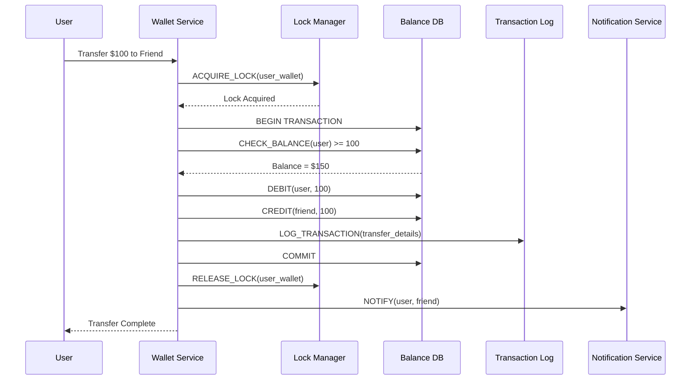

# Digital Wallet - System Design Case Study

## 1. Problem Statement

Design a comprehensive digital wallet system like PayPal, Venmo, or Alipay that can:
- Handle millions of concurrent users with instant transactions
- Support multiple currencies and payment methods
- Ensure zero financial data loss with ACID guarantees
- Provide real-time fraud detection and prevention
- Enable P2P transfers, merchant payments, and bill payments
- Maintain regulatory compliance across multiple jurisdictions

### Real-World Context
- **PayPal**: 400M+ active accounts, $1.25 trillion payment volume
- **Alipay**: 1.3B+ users, processes 290M+ transactions daily
- **Venmo**: 90M+ users, $230B+ annual payment volume
- **Apple Pay**: 500M+ users globally, accepted at 85% US retailers

## 2. Requirements Analysis

### Functional Requirements
1. **Account Management**
   - User registration with KYC/AML compliance
   - Multiple funding sources (bank, card, balance)
   - Multi-currency wallets
   - Account limits and verification levels
   - Transaction history and statements

2. **Payment Operations**
   - P2P transfers (instant and standard)
   - Merchant payments (online and in-store)
   - Bill payments and subscriptions
   - International remittances
   - QR code payments

3. **Financial Operations**
   - Add money from bank/card
   - Withdraw to bank
   - Currency exchange
   - Cashback and rewards
   - Interest on balance

4. **Security Features**
   - Biometric authentication
   - Transaction PIN/password
   - Device authorization
   - Fraud detection
   - Dispute resolution

5. **Social Features**
   - Split bills
   - Request money
   - Group payments
   - Payment notes/emoji
   - Social feed (Venmo-style)

### Non-Functional Requirements
- **Scale**: 100M+ active users, 10K+ TPS peak
- **Latency**: <200ms for balance checks, <500ms for transfers
- **Availability**: 99.99% uptime (52 minutes downtime/year)
- **Consistency**: Strong consistency for financial data
- **Compliance**: PCI DSS, PSD2, GDPR, local regulations
- **Security**: End-to-end encryption, tokenization

### Law Mapping
- **Law 1 (Latency)**: Instant payment confirmation critical
- **Law 2 (Capacity)**: Account balance limits and reserves
- **Law 3 (Failure)**: Zero tolerance for money loss
- **Law 4 (Concurrency)**: Handle concurrent transactions safely
- **Law 5 (Coordination)**: Distributed transaction management
- **Law 6 (Observability)**: Complete audit trail required
- **Law 7 (Interface)**: Simple UX for complex operations
- **Law 8 (Economics)**: Optimize transaction costs

## 3. Architecture Evolution

### Stage 1: Basic Wallet System (10K users)


### Stage 2: Distributed Architecture (1M users)


### Stage 3: Global Scale Architecture (100M+ users)


## 4. Detailed Component Design

### 4.1 Distributed Ledger System
```python
import asyncio
from decimal import Decimal
from typing import List, Dict, Optional, Tuple
from dataclasses import dataclass
from datetime import datetime
import uuid

@dataclass
class LedgerEntry:
    entry_id: str
    transaction_id: str
    account_id: str
    currency: str
    amount: Decimal
    balance_after: Decimal
    entry_type: str  # DEBIT or CREDIT
    timestamp: datetime
    metadata: Dict

class DistributedLedger:
    """Double-entry bookkeeping ledger with ACID guarantees"""
    
    def __init__(self, db_clusters: Dict[str, DatabaseCluster]):
        self.db_clusters = db_clusters
        self.sharding_strategy = AccountShardingStrategy()
        self.lock_manager = DistributedLockManager()
        
    async def transfer_funds(self, 
                           from_account: str,
                           to_account: str,
                           amount: Decimal,
                           currency: str,
                           transaction_id: str = None) -> TransferResult:
        """Transfer funds between accounts with ACID guarantees"""
        
        if not transaction_id:
            transaction_id = str(uuid.uuid4())
        
# Validate amount
        if amount <= 0:
            raise ValueError("Transfer amount must be positive")
        
# Get account shards
        from_shard = self.sharding_strategy.get_shard(from_account)
        to_shard = self.sharding_strategy.get_shard(to_account)
        
# Acquire distributed locks (ordered to prevent deadlock)
        lock_ids = sorted([from_account, to_account])
        locks = []
        
        try:
            for account_id in lock_ids:
                lock = await self.lock_manager.acquire_lock(
                    f"account:{account_id}",
                    timeout=5000  # 5 seconds
                )
                locks.append(lock)
            
# Begin distributed transaction
            if from_shard == to_shard:
# Same shard - single database transaction
                result = await self._transfer_same_shard(
                    from_account,
                    to_account,
                    amount,
                    currency,
                    transaction_id,
                    from_shard
                )
            else:
# Cross-shard - 2PC protocol
                result = await self._transfer_cross_shard(
                    from_account,
                    to_account,
                    amount,
                    currency,
                    transaction_id,
                    from_shard,
                    to_shard
                )
            
            return result
            
        finally:
# Release locks in reverse order
            for lock in reversed(locks):
                await self.lock_manager.release_lock(lock)
    
    async def _transfer_same_shard(self, from_account: str, to_account: str,
                                   amount: Decimal, currency: str,
                                   transaction_id: str, shard: str) -> TransferResult:
        """Transfer within same database shard"""
        
        db = self.db_clusters[shard]
        
        async with db.transaction() as txn:
# Get current balances
            from_balance = await txn.fetchval(
                """
                SELECT balance FROM account_balances 
                WHERE account_id = $1 AND currency = $2
                FOR UPDATE
                """,
                from_account, currency
            )
            
            if not from_balance or from_balance < amount:
                raise InsufficientFundsError(
                    f"Insufficient balance: {from_balance} < {amount}"
                )
            
            to_balance = await txn.fetchval(
                """
                SELECT balance FROM account_balances 
                WHERE account_id = $1 AND currency = $2
                FOR UPDATE
                """,
                to_account, currency
            ) or Decimal('0')
            
# Update balances
            new_from_balance = from_balance - amount
            new_to_balance = to_balance + amount
            
# Update sender balance
            await txn.execute(
                """
                UPDATE account_balances 
                SET balance = $1, updated_at = $2
                WHERE account_id = $3 AND currency = $4
                """,
                new_from_balance, datetime.utcnow(), from_account, currency
            )
            
# Update receiver balance
            await txn.execute(
                """
                INSERT INTO account_balances (account_id, currency, balance, updated_at)
                VALUES ($1, $2, $3, $4)
                ON CONFLICT (account_id, currency) 
                DO UPDATE SET balance = $3, updated_at = $4
                """,
                to_account, currency, new_to_balance, datetime.utcnow()
            )
            
# Record ledger entries
            timestamp = datetime.utcnow()
            
# Debit entry
            await txn.execute(
                """
                INSERT INTO ledger_entries 
                (entry_id, transaction_id, account_id, currency, amount, 
                 balance_after, entry_type, timestamp)
                VALUES ($1, $2, $3, $4, $5, $6, $7, $8)
                """,
                str(uuid.uuid4()), transaction_id, from_account, currency,
                amount, new_from_balance, 'DEBIT', timestamp
            )
            
# Credit entry
            await txn.execute(
                """
                INSERT INTO ledger_entries 
                (entry_id, transaction_id, account_id, currency, amount, 
                 balance_after, entry_type, timestamp)
                VALUES ($1, $2, $3, $4, $5, $6, $7, $8)
                """,
                str(uuid.uuid4()), transaction_id, to_account, currency,
                amount, new_to_balance, 'CREDIT', timestamp
            )
            
# Record transaction
            await txn.execute(
                """
                INSERT INTO transactions 
                (transaction_id, from_account, to_account, amount, currency, 
                 status, created_at)
                VALUES ($1, $2, $3, $4, $5, $6, $7)
                """,
                transaction_id, from_account, to_account, amount, currency,
                'COMPLETED', timestamp
            )
        
        return TransferResult(
            transaction_id=transaction_id,
            status='COMPLETED',
            from_balance_after=new_from_balance,
            to_balance_after=new_to_balance,
            timestamp=timestamp
        )
    
    async def _transfer_cross_shard(self, from_account: str, to_account: str,
                                    amount: Decimal, currency: str,
                                    transaction_id: str,
                                    from_shard: str, to_shard: str) -> TransferResult:
        """Transfer across database shards using 2PC"""
        
# Phase 1: Prepare
        prepare_results = await asyncio.gather(
            self._prepare_debit(from_account, amount, currency, transaction_id, from_shard),
            self._prepare_credit(to_account, amount, currency, transaction_id, to_shard),
            return_exceptions=True
        )
        
# Check prepare results
        if any(isinstance(r, Exception) for r in prepare_results):
# Abort transaction
            await self._abort_transaction(transaction_id, [from_shard, to_shard])
            raise prepare_results[0] if isinstance(prepare_results[0], Exception) else prepare_results[1]
        
# Phase 2: Commit
        commit_results = await asyncio.gather(
            self._commit_transaction(transaction_id, from_shard),
            self._commit_transaction(transaction_id, to_shard),
            return_exceptions=True
        )
        
        if any(isinstance(r, Exception) for r in commit_results):
# This is bad - inconsistent state
            await self._handle_commit_failure(transaction_id, commit_results)
            raise InconsistentStateError("Commit phase failed")
        
        return TransferResult(
            transaction_id=transaction_id,
            status='COMPLETED',
            from_balance_after=prepare_results[0]['new_balance'],
            to_balance_after=prepare_results[1]['new_balance'],
            timestamp=datetime.utcnow()
        )
    
    async def get_balance(self, account_id: str, currency: str) -> Decimal:
        """Get account balance with read-through cache"""
        
# Check cache first
        cache_key = f"balance:{account_id}:{currency}"
        cached = await self.cache.get(cache_key)
        if cached is not None:
            return Decimal(cached)
        
# Get from database
        shard = self.sharding_strategy.get_shard(account_id)
        db = self.db_clusters[shard]
        
        balance = await db.fetchval(
            """
            SELECT balance FROM account_balances
            WHERE account_id = $1 AND currency = $2
            """,
            account_id, currency
        )
        
        if balance is None:
            balance = Decimal('0')
        
# Cache for 1 minute
        await self.cache.setex(cache_key, 60, str(balance))
        
        return balance
    
    async def get_transaction_history(self, account_id: str,
                                     limit: int = 50,
                                     offset: int = 0) -> List[Transaction]:
        """Get transaction history for an account"""
        
        shard = self.sharding_strategy.get_shard(account_id)
        db = self.db_clusters[shard]
        
        rows = await db.fetch(
            """
            SELECT t.*, 
                   le_debit.amount as debit_amount,
                   le_credit.amount as credit_amount,
                   le_debit.balance_after as balance_after
            FROM transactions t
            LEFT JOIN ledger_entries le_debit 
                ON t.transaction_id = le_debit.transaction_id 
                AND le_debit.account_id = $1 
                AND le_debit.entry_type = 'DEBIT'
            LEFT JOIN ledger_entries le_credit 
                ON t.transaction_id = le_credit.transaction_id 
                AND le_credit.account_id = $1 
                AND le_credit.entry_type = 'CREDIT'
            WHERE t.from_account = $1 OR t.to_account = $1
            ORDER BY t.created_at DESC
            LIMIT $2 OFFSET $3
            """,
            account_id, limit, offset
        )
        
        transactions = []
        for row in rows:
            transactions.append(Transaction(
                transaction_id=row['transaction_id'],
                from_account=row['from_account'],
                to_account=row['to_account'],
                amount=row['amount'],
                currency=row['currency'],
                status=row['status'],
                transaction_type='SENT' if row['from_account'] == account_id else 'RECEIVED',
                balance_after=row['balance_after'],
                created_at=row['created_at']
            ))
        
        return transactions
```

### 4.2 Payment Processing Engine
```python
class PaymentProcessor:
    """Handles various payment methods and orchestration"""
    
    def __init__(self, ledger: DistributedLedger,
                 fraud_engine: FraudDetectionEngine,
                 payment_gateways: Dict[str, PaymentGateway]):
        self.ledger = ledger
        self.fraud_engine = fraud_engine
        self.gateways = payment_gateways
        self.rate_limiter = RateLimiter()
        
    async def process_payment(self, payment_request: PaymentRequest) -> PaymentResult:
        """Process a payment request"""
        
# Rate limiting
        if not await self.rate_limiter.check_limit(
            payment_request.payer_account,
            payment_request.amount
        ):
            raise RateLimitExceededError("Payment rate limit exceeded")
        
# Fraud check
        fraud_score = await self.fraud_engine.analyze_payment(payment_request)
        if fraud_score.risk_level == 'HIGH':
            await self._handle_high_risk_payment(payment_request, fraud_score)
            raise PaymentBlockedError("Payment blocked for security review")
        
# Route based on payment type
        if payment_request.payment_type == 'P2P':
            return await self._process_p2p_payment(payment_request)
        elif payment_request.payment_type == 'MERCHANT':
            return await self._process_merchant_payment(payment_request)
        elif payment_request.payment_type == 'BILL':
            return await self._process_bill_payment(payment_request)
        elif payment_request.payment_type == 'INTERNATIONAL':
            return await self._process_international_payment(payment_request)
        else:
            raise ValueError(f"Unknown payment type: {payment_request.payment_type}")
    
    async def _process_p2p_payment(self, request: PaymentRequest) -> PaymentResult:
        """Process peer-to-peer payment"""
        
# Check if recipient exists
        recipient = await self._get_recipient(request.recipient_identifier)
        if not recipient:
            raise RecipientNotFoundError(
                f"Recipient not found: {request.recipient_identifier}"
            )
        
# Check sender balance
        balance = await self.ledger.get_balance(
            request.payer_account,
            request.currency
        )
        
        if balance < request.amount:
# Try to pull from funding source
            funding_result = await self._pull_from_funding_source(
                request.payer_account,
                request.amount - balance,
                request.currency
            )
            
            if not funding_result.success:
                raise InsufficientFundsError("Insufficient funds")
        
# Execute transfer
        transfer_result = await self.ledger.transfer_funds(
            from_account=request.payer_account,
            to_account=recipient.account_id,
            amount=request.amount,
            currency=request.currency,
            transaction_id=request.transaction_id
        )
        
# Send notifications
        await self._send_payment_notifications(
            request.payer_account,
            recipient.account_id,
            request.amount,
            request.currency,
            request.note
        )
        
        return PaymentResult(
            transaction_id=transfer_result.transaction_id,
            status='COMPLETED',
            amount=request.amount,
            currency=request.currency,
            timestamp=transfer_result.timestamp
        )
    
    async def _process_merchant_payment(self, request: PaymentRequest) -> PaymentResult:
        """Process merchant payment with fees"""
        
# Get merchant account
        merchant = await self._get_merchant(request.merchant_id)
        if not merchant:
            raise MerchantNotFoundError(f"Merchant not found: {request.merchant_id}")
        
# Calculate fees
        fee_calculator = FeeCalculator()
        fees = fee_calculator.calculate_merchant_fees(
            amount=request.amount,
            merchant_category=merchant.category,
            payment_method=request.funding_source
        )
        
# Check balance including fees
        total_amount = request.amount + fees.payer_fee
        balance = await self.ledger.get_balance(
            request.payer_account,
            request.currency
        )
        
        if balance < total_amount:
            raise InsufficientFundsError(
                f"Insufficient funds. Need {total_amount}, have {balance}"
            )
        
# Process payment with fee split
# 1. Deduct full amount from payer
        await self.ledger.transfer_funds(
            from_account=request.payer_account,
            to_account='HOLDING_ACCOUNT',
            amount=total_amount,
            currency=request.currency
        )
        
# 2. Pay merchant (amount - merchant fee)
        merchant_amount = request.amount - fees.merchant_fee
        await self.ledger.transfer_funds(
            from_account='HOLDING_ACCOUNT',
            to_account=merchant.account_id,
            amount=merchant_amount,
            currency=request.currency
        )
        
# 3. Record fees
        await self.ledger.transfer_funds(
            from_account='HOLDING_ACCOUNT',
            to_account='FEE_ACCOUNT',
            amount=fees.total_fees,
            currency=request.currency
        )
        
# Generate receipt
        receipt = await self._generate_receipt(
            request,
            merchant,
            fees
        )
        
        return PaymentResult(
            transaction_id=request.transaction_id,
            status='COMPLETED',
            amount=request.amount,
            currency=request.currency,
            fees=fees,
            receipt=receipt,
            timestamp=datetime.utcnow()
        )
```

### 4.3 Fraud Detection System
```python
import tensorflow as tf
from sklearn.ensemble import IsolationForest
import numpy as np

class FraudDetectionEngine:
    """Real-time fraud detection for digital wallet"""
    
    def __init__(self):
        self.ml_model = self._load_fraud_model()
        self.rule_engine = FraudRuleEngine()
        self.velocity_checker = VelocityChecker()
        self.device_fingerprinting = DeviceFingerprinting()
        
    async def analyze_payment(self, payment: PaymentRequest) -> FraudScore:
        """Analyze payment for fraud risk"""
        
# Extract features
        features = await self._extract_features(payment)
        
# ML-based scoring
        ml_score = self.ml_model.predict_proba(features.reshape(1, -1))[0][1]
        
# Rule-based checks
        rule_violations = await self.rule_engine.check_payment(payment)
        
# Velocity checks
        velocity_score = await self.velocity_checker.check_velocity(
            payment.payer_account,
            payment.amount,
            payment.timestamp
        )
        
# Device risk
        device_score = await self.device_fingerprinting.get_device_risk(
            payment.device_id,
            payment.ip_address
        )
        
# Combine scores
        final_score = self._combine_risk_scores(
            ml_score=ml_score,
            rule_score=len(rule_violations) * 0.2,
            velocity_score=velocity_score,
            device_score=device_score
        )
        
# Determine risk level
        if final_score > 0.8:
            risk_level = 'HIGH'
        elif final_score > 0.5:
            risk_level = 'MEDIUM'
        else:
            risk_level = 'LOW'
        
        return FraudScore(
            score=final_score,
            risk_level=risk_level,
            ml_score=ml_score,
            rule_violations=rule_violations,
            velocity_score=velocity_score,
            device_score=device_score,
            reasons=self._generate_risk_reasons(
                payment,
                final_score,
                rule_violations
            )
        )
    
    async def _extract_features(self, payment: PaymentRequest) -> np.array:
        """Extract ML features from payment"""
        
        features = []
        
# Payment features
        features.extend([
            float(payment.amount),
            self._encode_currency(payment.currency),
            self._encode_payment_type(payment.payment_type),
            payment.timestamp.hour / 24.0,
            payment.timestamp.weekday() / 7.0
        ])
        
# Account history features
        account_stats = await self._get_account_statistics(payment.payer_account)
        features.extend([
            account_stats['transaction_count_30d'],
            account_stats['avg_transaction_amount'],
            account_stats['days_since_account_creation'],
            account_stats['failed_payments_7d'],
            account_stats['unique_recipients_30d']
        ])
        
# Recipient features
        if payment.recipient_identifier:
            recipient_risk = await self._get_recipient_risk_score(
                payment.recipient_identifier
            )
            features.append(recipient_risk)
        else:
            features.append(0.5)  # Neutral score
        
# Location features
        location_features = await self._get_location_features(
            payment.ip_address,
            payment.payer_account
        )
        features.extend([
            location_features['is_new_location'],
            location_features['distance_from_usual'],
            location_features['is_high_risk_country']
        ])
        
# Device features
        device_features = await self._get_device_features(payment.device_id)
        features.extend([
            device_features['is_rooted'],
            device_features['is_emulator'],
            device_features['days_since_first_seen'],
            device_features['accounts_on_device']
        ])
        
        return np.array(features, dtype=np.float32)
    
    def _load_fraud_model(self):
        """Load pre-trained fraud detection model"""
        
# In production, load actual trained model
        model = tf.keras.Sequential([
            tf.keras.layers.Dense(128, activation='relu', input_shape=(25,)),
            tf.keras.layers.Dropout(0.3),
            tf.keras.layers.Dense(64, activation='relu'),
            tf.keras.layers.Dropout(0.3),
            tf.keras.layers.Dense(32, activation='relu'),
            tf.keras.layers.Dense(1, activation='sigmoid')
        ])
        
# model.load_weights('fraud_detection_model.h5')
        return model
```

### 4.4 Multi-Currency Support
```python
class MultiCurrencyManager:
    """Handles multi-currency operations and exchanges"""
    
    def __init__(self, exchange_rate_provider: ExchangeRateProvider,
                 ledger: DistributedLedger):
        self.rate_provider = exchange_rate_provider
        self.ledger = ledger
        self.fee_calculator = ExchangeFeeCalculator()
        
    async def exchange_currency(self, account_id: str,
                               from_currency: str,
                               to_currency: str,
                               amount: Decimal) -> ExchangeResult:
        """Exchange currency within wallet"""
        
# Get current exchange rate
        rate = await self.rate_provider.get_rate(from_currency, to_currency)
        if not rate:
            raise ExchangeRateUnavailableError(
                f"No rate available for {from_currency} to {to_currency}"
            )
        
# Calculate amounts
        gross_to_amount = amount * rate.mid_rate
        fee = self.fee_calculator.calculate_fee(
            amount=amount,
            from_currency=from_currency,
            to_currency=to_currency
        )
        net_to_amount = gross_to_amount - fee
        
# Check balance
        balance = await self.ledger.get_balance(account_id, from_currency)
        if balance < amount:
            raise InsufficientFundsError(
                f"Insufficient {from_currency} balance"
            )
        
# Execute exchange as atomic operation
        exchange_id = str(uuid.uuid4())
        
        try:
# Debit source currency
            await self.ledger.debit_account(
                account_id=account_id,
                currency=from_currency,
                amount=amount,
                transaction_id=exchange_id,
                description=f"Exchange to {to_currency}"
            )
            
# Credit target currency
            await self.ledger.credit_account(
                account_id=account_id,
                currency=to_currency,
                amount=net_to_amount,
                transaction_id=exchange_id,
                description=f"Exchange from {from_currency}"
            )
            
# Record exchange transaction
            await self._record_exchange(
                exchange_id=exchange_id,
                account_id=account_id,
                from_currency=from_currency,
                to_currency=to_currency,
                from_amount=amount,
                to_amount=net_to_amount,
                rate=rate.mid_rate,
                fee=fee
            )
            
            return ExchangeResult(
                exchange_id=exchange_id,
                from_amount=amount,
                to_amount=net_to_amount,
                rate=rate.mid_rate,
                fee=fee,
                timestamp=datetime.utcnow()
            )
            
        except Exception as e:
# Rollback on failure
            await self._rollback_exchange(exchange_id)
            raise
    
    async def get_exchange_rate(self, from_currency: str,
                               to_currency: str) -> ExchangeRate:
        """Get current exchange rate with caching"""
        
# Check cache
        cache_key = f"rate:{from_currency}:{to_currency}"
        cached_rate = await self.cache.get(cache_key)
        if cached_rate:
            return ExchangeRate.from_dict(cached_rate)
        
# Get fresh rate
        rate = await self.rate_provider.get_rate(from_currency, to_currency)
        
# Cache for 1 minute
        await self.cache.setex(
            cache_key,
            60,
            rate.to_dict()
        )
        
        return rate
    
    async def create_multi_currency_wallet(self, account_id: str,
                                          currencies: List[str]):
        """Initialize multi-currency wallet"""
        
        for currency in currencies:
# Create zero-balance entry
            await self.ledger.create_balance_entry(
                account_id=account_id,
                currency=currency,
                initial_balance=Decimal('0')
            )
            
# Set up currency-specific limits
            await self._set_currency_limits(account_id, currency)
```

### 4.5 QR Code Payment System
```python
import qrcode
import base64
from cryptography.fernet import Fernet

class QRPaymentManager:
    """Manages QR code based payments"""
    
    def __init__(self):
        self.encryption_key = Fernet.generate_key()
        self.cipher = Fernet(self.encryption_key)
        self.qr_cache = QRCache()
        
    async def generate_payment_qr(self, merchant_id: str,
                                 amount: Optional[Decimal] = None,
                                 currency: str = 'USD',
                                 reference: Optional[str] = None) -> QRCode:
        """Generate payment QR code"""
        
        qr_id = str(uuid.uuid4())
        
# Create QR payload
        payload = {
            'version': '1.0',
            'type': 'PAYMENT',
            'qr_id': qr_id,
            'merchant_id': merchant_id,
            'amount': str(amount) if amount else None,
            'currency': currency,
            'reference': reference,
            'timestamp': datetime.utcnow().isoformat(),
            'expires_at': (datetime.utcnow() + timedelta(minutes=5)).isoformat()
        }
        
# Encrypt payload
        encrypted_payload = self.cipher.encrypt(
            json.dumps(payload).encode()
        )
        
# Generate QR code
        qr = qrcode.QRCode(
            version=1,
            error_correction=qrcode.constants.ERROR_CORRECT_L,
            box_size=10,
            border=4,
        )
        
        qr_data = f"wallet://pay/{base64.urlsafe_b64encode(encrypted_payload).decode()}"
        qr.add_data(qr_data)
        qr.make(fit=True)
        
# Create image
        img = qr.make_image(fill_color="black", back_color="white")
        
# Convert to base64
        buffer = BytesIO()
        img.save(buffer, format='PNG')
        img_base64 = base64.b64encode(buffer.getvalue()).decode()
        
# Cache QR data
        await self.qr_cache.store(
            qr_id,
            payload,
            ttl=300  # 5 minutes
        )
        
        return QRCode(
            qr_id=qr_id,
            image_data=img_base64,
            expires_at=payload['expires_at'],
            merchant_id=merchant_id,
            amount=amount,
            currency=currency
        )
    
    async def scan_payment_qr(self, qr_data: str,
                             payer_account: str) -> QRScanResult:
        """Process scanned QR code"""
        
        try:
# Extract encrypted payload
            if not qr_data.startswith('wallet://pay/'):
                raise InvalidQRCodeError("Invalid QR format")
            
            encrypted_data = qr_data.replace('wallet://pay/', '')
            encrypted_bytes = base64.urlsafe_b64decode(encrypted_data)
            
# Decrypt payload
            decrypted_data = self.cipher.decrypt(encrypted_bytes)
            payload = json.loads(decrypted_data)
            
# Validate QR
            qr_id = payload['qr_id']
            cached_data = await self.qr_cache.get(qr_id)
            
            if not cached_data:
                raise ExpiredQRCodeError("QR code has expired")
            
# Check expiration
            expires_at = datetime.fromisoformat(payload['expires_at'])
            if datetime.utcnow() > expires_at:
                raise ExpiredQRCodeError("QR code has expired")
            
# Get merchant details
            merchant = await self._get_merchant(payload['merchant_id'])
            
            return QRScanResult(
                qr_id=qr_id,
                merchant=merchant,
                amount=Decimal(payload['amount']) if payload['amount'] else None,
                currency=payload['currency'],
                reference=payload['reference'],
                can_edit_amount=payload['amount'] is None
            )
            
        except Exception as e:
            logger.error(f"QR scan error: {e}")
            raise InvalidQRCodeError("Failed to process QR code")
    
    async def complete_qr_payment(self, qr_id: str,
                                 payer_account: str,
                                 amount: Decimal,
                                 pin: str) -> PaymentResult:
        """Complete payment initiated by QR scan"""
        
# Verify PIN
        if not await self._verify_transaction_pin(payer_account, pin):
            raise InvalidPINError("Invalid transaction PIN")
        
# Get QR details
        qr_data = await self.qr_cache.get(qr_id)
        if not qr_data:
            raise InvalidQRCodeError("Invalid or expired QR code")
        
# Mark QR as used
        await self.qr_cache.mark_used(qr_id)
        
# Process payment
        payment_request = PaymentRequest(
            payer_account=payer_account,
            merchant_id=qr_data['merchant_id'],
            amount=amount,
            currency=qr_data['currency'],
            payment_type='MERCHANT',
            payment_method='QR_CODE',
            reference=qr_data['reference']
        )
        
        return await self.payment_processor.process_payment(payment_request)
```

## 5. Advanced Features

### 5.1 Bill Splitting
```python
class BillSplittingService:
    """Handles group payments and bill splitting"""
    
    def __init__(self, ledger: DistributedLedger,
                 notification_service: NotificationService):
        self.ledger = ledger
        self.notifications = notification_service
        self.split_cache = SplitCache()
        
    async def create_split_bill(self, creator_id: str,
                               total_amount: Decimal,
                               currency: str,
                               participants: List[Dict],
                               description: str) -> SplitBill:
        """Create a split bill request"""
        
        split_id = str(uuid.uuid4())
        
# Validate participants and calculate shares
        validated_participants = []
        total_shares = Decimal('0')
        
        for participant in participants:
            user = await self._get_user(participant['user_id'])
            if not user:
                raise UserNotFoundError(f"User {participant['user_id']} not found")
            
            share = participant.get('amount') or (total_amount / len(participants))
            
            validated_participants.append({
                'user_id': user.id,
                'name': user.name,
                'amount': share,
                'status': 'PENDING',
                'paid_at': None
            })
            
            total_shares += share
        
# Validate total
        if abs(total_shares - total_amount) > Decimal('0.01'):
            raise ValueError(f"Shares {total_shares} don't match total {total_amount}")
        
# Create split bill
        split_bill = SplitBill(
            split_id=split_id,
            creator_id=creator_id,
            total_amount=total_amount,
            currency=currency,
            description=description,
            participants=validated_participants,
            created_at=datetime.utcnow(),
            status='ACTIVE'
        )
        
# Store in cache and database
        await self.split_cache.store(split_id, split_bill)
        await self._persist_split_bill(split_bill)
        
# Notify participants
        for participant in validated_participants:
            if participant['user_id'] != creator_id:
                await self.notifications.send_split_request(
                    user_id=participant['user_id'],
                    split_bill=split_bill
                )
        
        return split_bill
    
    async def pay_split_share(self, split_id: str,
                             payer_id: str,
                             payment_method: str = 'BALANCE') -> PaymentResult:
        """Pay individual share of split bill"""
        
# Get split bill
        split_bill = await self.split_cache.get(split_id)
        if not split_bill:
            raise SplitBillNotFoundError(f"Split bill {split_id} not found")
        
# Find participant's share
        participant = None
        for p in split_bill.participants:
            if p['user_id'] == payer_id:
                participant = p
                break
        
        if not participant:
            raise NotParticipantError("User not part of this split")
        
        if participant['status'] == 'PAID':
            raise AlreadyPaidError("Share already paid")
        
# Process payment
        payment_result = await self.ledger.transfer_funds(
            from_account=payer_id,
            to_account=split_bill.creator_id,
            amount=participant['amount'],
            currency=split_bill.currency,
            metadata={
                'type': 'SPLIT_PAYMENT',
                'split_id': split_id,
                'description': f"Split: {split_bill.description}"
            }
        )
        
# Update participant status
        participant['status'] = 'PAID'
        participant['paid_at'] = datetime.utcnow()
        
# Check if all paid
        all_paid = all(p['status'] == 'PAID' for p in split_bill.participants)
        if all_paid:
            split_bill.status = 'COMPLETED'
        
# Update cache and database
        await self.split_cache.store(split_id, split_bill)
        await self._update_split_bill(split_bill)
        
# Notify creator
        await self.notifications.send_split_payment_notification(
            user_id=split_bill.creator_id,
            payer_name=participant['name'],
            amount=participant['amount'],
            split_description=split_bill.description
        )
        
        return payment_result
```

### 5.2 Rewards and Cashback System
```python
class RewardsEngine:
    """Manages rewards, cashback, and loyalty programs"""
    
    def __init__(self, ledger: DistributedLedger):
        self.ledger = ledger
        self.reward_rules = RewardRuleEngine()
        self.points_manager = PointsManager()
        
    async def process_transaction_rewards(self, transaction: Transaction) -> RewardResult:
        """Calculate and apply rewards for a transaction"""
        
# Get applicable reward rules
        rules = await self.reward_rules.get_applicable_rules(
            transaction_type=transaction.type,
            merchant_category=transaction.merchant_category,
            amount=transaction.amount,
            user_tier=transaction.user_tier
        )
        
        total_rewards = Decimal('0')
        reward_details = []
        
        for rule in rules:
            if rule.type == 'CASHBACK_PERCENTAGE':
                reward_amount = transaction.amount * (rule.value / 100)
                
# Apply caps
                if rule.max_reward:
                    reward_amount = min(reward_amount, rule.max_reward)
                
                total_rewards += reward_amount
                reward_details.append({
                    'type': 'CASHBACK',
                    'amount': reward_amount,
                    'rule': rule.name
                })
                
            elif rule.type == 'POINTS':
                points = int(transaction.amount * rule.value)
                
                await self.points_manager.add_points(
                    user_id=transaction.user_id,
                    points=points,
                    source='TRANSACTION',
                    reference=transaction.id
                )
                
                reward_details.append({
                    'type': 'POINTS',
                    'points': points,
                    'rule': rule.name
                })
            
            elif rule.type == 'BONUS_CASHBACK':
                if await self._check_bonus_eligibility(transaction, rule):
                    reward_amount = rule.fixed_amount
                    total_rewards += reward_amount
                    
                    reward_details.append({
                        'type': 'BONUS',
                        'amount': reward_amount,
                        'rule': rule.name
                    })
        
# Apply cashback
        if total_rewards > 0:
            await self.ledger.credit_account(
                account_id=transaction.user_id,
                currency=transaction.currency,
                amount=total_rewards,
                transaction_type='CASHBACK',
                reference=transaction.id
            )
        
        return RewardResult(
            transaction_id=transaction.id,
            total_cashback=total_rewards,
            points_earned=sum(r['points'] for r in reward_details if r['type'] == 'POINTS'),
            reward_details=reward_details
        )
    
    async def redeem_points(self, user_id: str,
                           points: int,
                           redemption_type: str) -> RedemptionResult:
        """Redeem loyalty points"""
        
# Check balance
        balance = await self.points_manager.get_balance(user_id)
        if balance < points:
            raise InsufficientPointsError(f"Need {points}, have {balance}")
        
# Get redemption value
        if redemption_type == 'CASH':
# 100 points = $1
            cash_value = Decimal(points) / 100
            
# Deduct points
            await self.points_manager.deduct_points(
                user_id=user_id,
                points=points,
                reason='CASH_REDEMPTION'
            )
            
# Credit cash
            await self.ledger.credit_account(
                account_id=user_id,
                currency='USD',
                amount=cash_value,
                transaction_type='POINTS_REDEMPTION'
            )
            
            return RedemptionResult(
                points_redeemed=points,
                value_received=cash_value,
                redemption_type='CASH'
            )
            
        elif redemption_type == 'GIFT_CARD':
# Handle gift card redemption
            gift_card = await self._create_gift_card(points)
            
            await self.points_manager.deduct_points(
                user_id=user_id,
                points=points,
                reason='GIFT_CARD_REDEMPTION'
            )
            
            return RedemptionResult(
                points_redeemed=points,
                value_received=gift_card.value,
                redemption_type='GIFT_CARD',
                gift_card_code=gift_card.code
            )
```

### 5.3 Scheduled Payments
```python
class ScheduledPaymentManager:
    """Handles recurring and scheduled payments"""
    
    def __init__(self, payment_processor: PaymentProcessor,
                 scheduler: DistributedScheduler):
        self.payment_processor = payment_processor
        self.scheduler = scheduler
        
    async def create_scheduled_payment(self, 
                                     schedule_request: ScheduleRequest) -> ScheduledPayment:
        """Create a scheduled or recurring payment"""
        
        schedule_id = str(uuid.uuid4())
        
# Validate recipient
        recipient = await self._validate_recipient(schedule_request.recipient)
        
# Create scheduled payment
        scheduled_payment = ScheduledPayment(
            schedule_id=schedule_id,
            payer_account=schedule_request.payer_account,
            recipient_account=recipient.account_id,
            amount=schedule_request.amount,
            currency=schedule_request.currency,
            frequency=schedule_request.frequency,
            start_date=schedule_request.start_date,
            end_date=schedule_request.end_date,
            description=schedule_request.description,
            status='ACTIVE'
        )
        
# Store in database
        await self._store_scheduled_payment(scheduled_payment)
        
# Schedule first execution
        if schedule_request.frequency == 'ONCE':
            await self.scheduler.schedule_job(
                job_id=f"payment:{schedule_id}",
                execute_at=schedule_request.start_date,
                job_type='scheduled_payment',
                payload={'schedule_id': schedule_id}
            )
        else:
# Recurring payment
            await self.scheduler.schedule_recurring_job(
                job_id=f"payment:{schedule_id}",
                cron_expression=self._get_cron_expression(schedule_request.frequency),
                start_date=schedule_request.start_date,
                end_date=schedule_request.end_date,
                job_type='scheduled_payment',
                payload={'schedule_id': schedule_id}
            )
        
        return scheduled_payment
    
    async def execute_scheduled_payment(self, schedule_id: str) -> PaymentResult:
        """Execute a scheduled payment"""
        
# Get schedule details
        schedule = await self._get_scheduled_payment(schedule_id)
        
        if schedule.status != 'ACTIVE':
            logger.info(f"Skipping inactive schedule {schedule_id}")
            return None
        
        try:
# Process payment
            payment_request = PaymentRequest(
                payer_account=schedule.payer_account,
                recipient_account=schedule.recipient_account,
                amount=schedule.amount,
                currency=schedule.currency,
                payment_type='SCHEDULED',
                note=schedule.description,
                metadata={'schedule_id': schedule_id}
            )
            
            result = await self.payment_processor.process_payment(payment_request)
            
# Update execution history
            await self._record_execution(schedule_id, result, success=True)
            
# Check if this was the last execution
            if schedule.frequency == 'ONCE' or \
               (schedule.end_date and datetime.utcnow() >= schedule.end_date):
                await self._complete_schedule(schedule_id)
            
            return result
            
        except Exception as e:
# Record failure
            await self._record_execution(schedule_id, None, success=False, error=str(e))
            
# Retry logic
            await self._handle_payment_failure(schedule_id, e)
            
            raise
```

## 6. Security Implementation

### 6.1 Biometric Authentication
```python
class BiometricAuthManager:
    """Manages biometric authentication for transactions"""
    
    def __init__(self):
        self.biometric_store = BiometricStore()
        self.device_attestation = DeviceAttestationService()
        
    async def enroll_biometric(self, user_id: str,
                              biometric_data: BiometricData) -> EnrollmentResult:
        """Enroll user's biometric data"""
        
# Verify device security
        if not await self.device_attestation.verify_device(biometric_data.device_id):
            raise InsecureDeviceError("Device does not meet security requirements")
        
# Process biometric data
        if biometric_data.type == 'FINGERPRINT':
            template = await self._process_fingerprint(biometric_data.raw_data)
        elif biometric_data.type == 'FACE':
            template = await self._process_face_data(biometric_data.raw_data)
        else:
            raise UnsupportedBiometricError(f"Type {biometric_data.type} not supported")
        
# Store encrypted template
        encrypted_template = await self._encrypt_biometric_template(template)
        
        enrollment = BiometricEnrollment(
            enrollment_id=str(uuid.uuid4()),
            user_id=user_id,
            biometric_type=biometric_data.type,
            device_id=biometric_data.device_id,
            template_hash=hashlib.sha256(template).hexdigest(),
            encrypted_template=encrypted_template,
            enrolled_at=datetime.utcnow()
        )
        
        await self.biometric_store.store_enrollment(enrollment)
        
        return EnrollmentResult(
            enrollment_id=enrollment.enrollment_id,
            success=True
        )
    
    async def verify_biometric(self, user_id: str,
                              biometric_data: BiometricData) -> bool:
        """Verify biometric for transaction"""
        
# Get enrolled templates
        enrollments = await self.biometric_store.get_user_enrollments(
            user_id,
            biometric_data.type
        )
        
        if not enrollments:
            return False
        
# Process provided biometric
        if biometric_data.type == 'FINGERPRINT':
            provided_template = await self._process_fingerprint(biometric_data.raw_data)
        elif biometric_data.type == 'FACE':
            provided_template = await self._process_face_data(biometric_data.raw_data)
        
# Compare against enrolled templates
        for enrollment in enrollments:
            stored_template = await self._decrypt_biometric_template(
                enrollment.encrypted_template
            )
            
            similarity = self._calculate_similarity(provided_template, stored_template)
            
            if similarity > self._get_threshold(biometric_data.type):
# Update last used
                await self.biometric_store.update_last_used(enrollment.enrollment_id)
                return True
        
        return False
```

### 6.2 Transaction Limits and Controls
```python
class TransactionLimitManager:
    """Manages transaction limits and controls"""
    
    def __init__(self):
        self.limit_store = LimitStore()
        self.velocity_tracker = VelocityTracker()
        
    async def check_transaction_limits(self, user_id: str,
                                     amount: Decimal,
                                     transaction_type: str) -> LimitCheckResult:
        """Check if transaction is within limits"""
        
# Get user's limit profile
        limit_profile = await self.limit_store.get_user_limits(user_id)
        
# Get current usage
        daily_usage = await self.velocity_tracker.get_daily_usage(
            user_id,
            transaction_type
        )
        monthly_usage = await self.velocity_tracker.get_monthly_usage(
            user_id,
            transaction_type
        )
        
# Check single transaction limit
        single_limit = limit_profile.get_limit('single_transaction', transaction_type)
        if amount > single_limit:
            return LimitCheckResult(
                allowed=False,
                reason=f"Exceeds single transaction limit of {single_limit}"
            )
        
# Check daily limit
        daily_limit = limit_profile.get_limit('daily', transaction_type)
        if daily_usage + amount > daily_limit:
            return LimitCheckResult(
                allowed=False,
                reason=f"Exceeds daily limit. Used {daily_usage} of {daily_limit}"
            )
        
# Check monthly limit
        monthly_limit = limit_profile.get_limit('monthly', transaction_type)
        if monthly_usage + amount > monthly_limit:
            return LimitCheckResult(
                allowed=False,
                reason=f"Exceeds monthly limit. Used {monthly_usage} of {monthly_limit}"
            )
        
# Check velocity (transactions per time period)
        velocity_check = await self._check_velocity_limits(
            user_id,
            transaction_type
        )
        
        if not velocity_check.passed:
            return LimitCheckResult(
                allowed=False,
                reason=velocity_check.reason
            )
        
        return LimitCheckResult(
            allowed=True,
            remaining_daily=daily_limit - daily_usage - amount,
            remaining_monthly=monthly_limit - monthly_usage - amount
        )
    
    async def update_limit_usage(self, user_id: str,
                               amount: Decimal,
                               transaction_type: str):
        """Update usage after successful transaction"""
        
        await self.velocity_tracker.record_transaction(
            user_id=user_id,
            amount=amount,
            transaction_type=transaction_type,
            timestamp=datetime.utcnow()
        )
```

## 7. Performance Optimizations

### 7.1 Read-Through Caching
```python
class WalletCacheManager:
    """Multi-tier caching for wallet operations"""
    
    def __init__(self):
        self.local_cache = ProcessLocalCache()
        self.redis_cache = RedisCache()
        self.cache_aside_patterns = CacheAsidePatterns()
        
    async def get_account_data(self, account_id: str) -> AccountData:
        """Get account data with caching"""
        
# L1: Process local cache
        cache_key = f"account:{account_id}"
        cached = self.local_cache.get(cache_key)
        if cached:
            return cached
        
# L2: Redis cache
        cached_json = await self.redis_cache.get(cache_key)
        if cached_json:
            account_data = AccountData.from_json(cached_json)
            self.local_cache.set(cache_key, account_data, ttl=30)
            return account_data
        
# L3: Database
        account_data = await self._load_from_database(account_id)
        
# Populate caches
        await self.redis_cache.setex(
            cache_key,
            300,  # 5 minutes
            account_data.to_json()
        )
        self.local_cache.set(cache_key, account_data, ttl=30)
        
        return account_data
```

### 7.2 Batch Processing
```python
class BatchPaymentProcessor:
    """Optimized batch payment processing"""
    
    async def process_batch_payments(self, payments: List[PaymentRequest]) -> BatchResult:
        """Process multiple payments efficiently"""
        
# Group by currency and validate
        grouped = self._group_by_currency(payments)
        
        results = []
        for currency, currency_payments in grouped.items():
# Pre-fetch all account balances
            account_ids = set()
            for payment in currency_payments:
                account_ids.add(payment.payer_account)
                account_ids.add(payment.recipient_account)
            
            balances = await self._batch_fetch_balances(
                list(account_ids),
                currency
            )
            
# Process payments with pre-fetched data
            for payment in currency_payments:
                result = await self._process_with_cached_balance(
                    payment,
                    balances
                )
                results.append(result)
        
        return BatchResult(
            total=len(payments),
            successful=sum(1 for r in results if r.success),
            failed=sum(1 for r in results if not r.success),
            results=results
        )
```

## 8. Monitoring and Analytics

### 8.1 Real-time Transaction Monitoring
```python
class TransactionMonitor:
    """Real-time monitoring of wallet transactions"""
    
    def __init__(self):
        self.metrics_collector = MetricsCollector()
        self.anomaly_detector = AnomalyDetector()
        self.alert_manager = AlertManager()
        
    async def monitor_transaction_stream(self):
        """Monitor real-time transaction stream"""
        
        async for transaction in self.get_transaction_stream():
# Collect metrics
            await self.metrics_collector.record({
                'transaction_id': transaction.id,
                'amount': float(transaction.amount),
                'currency': transaction.currency,
                'type': transaction.type,
                'latency': transaction.processing_time,
                'timestamp': transaction.timestamp
            })
            
# Check for anomalies
            if await self.anomaly_detector.is_anomalous(transaction):
                await self.alert_manager.send_alert(
                    level='WARNING',
                    message=f"Anomalous transaction detected: {transaction.id}",
                    details=transaction.to_dict()
                )
            
# Update dashboards
            await self._update_grafana_dashboards(transaction)
```

### 8.2 Financial Reconciliation
```python
class FinancialReconciliation:
    """Ensures financial integrity across the system"""
    
    async def daily_reconciliation(self, date: date) -> ReconciliationReport:
        """Perform daily financial reconciliation"""
        
        report = ReconciliationReport(date=date)
        
# Sum of all account balances
        total_user_balances = await self._calculate_total_balances()
        
# Sum of all ledger entries
        ledger_total = await self._calculate_ledger_total()
        
# Check balance
        discrepancy = total_user_balances - ledger_total
        
        if abs(discrepancy) > Decimal('0.01'):
            report.add_discrepancy(
                'BALANCE_MISMATCH',
                f"User balances: {total_user_balances}, Ledger: {ledger_total}"
            )
            
# Find specific accounts with issues
            problem_accounts = await self._find_balance_discrepancies()
            report.problem_accounts = problem_accounts
        
# Verify all transactions balance
        unbalanced_transactions = await self._find_unbalanced_transactions(date)
        if unbalanced_transactions:
            report.add_discrepancy(
                'UNBALANCED_TRANSACTIONS',
                f"Found {len(unbalanced_transactions)} unbalanced transactions"
            )
        
# External reconciliation
        bank_reconciliation = await self._reconcile_with_bank_statements(date)
        report.bank_reconciliation = bank_reconciliation
        
        return report
```

## 8. Consistency Deep Dive for Digital Wallets

### 8.1 The Wallet Consistency Challenge


### 8.2 Consistency Models by Operation Type

<div class="responsive-table" markdown>

| Operation | Consistency Level | Implementation | Justification |
|-----------|------------------|----------------|---------------|
| **Balance Check** | Read-Your-Writes | Session affinity to primary | Users must see their latest transactions |
| **Send Money** | Linearizable | Distributed locking + 2PC | Prevent double spending |
| **Receive Money** | Strong Consistency | Synchronous replication | Immediate balance update |
| **Transaction History** | Causal Consistency | Vector clocks | Preserve transaction order |
| **Exchange Rates** | Bounded Staleness | Cache with 1-min TTL | Acceptable lag for rates |
| **Rewards/Cashback** | Eventual Consistency | Async processing | Can be delayed |
| **KYC Updates** | Strong Consistency | Consensus protocol | Regulatory requirement |
| **Social Feed** | Eventual Consistency | Best effort delivery | Non-critical feature |

</div>


### 8.3 Distributed Transaction Architecture



### 8.4 Multi-Region Wallet Consistency


### 8.5 Balance Consistency State Machine


### 8.6 Handling Concurrent Transactions


### 8.7 Saga Pattern for Complex Wallet Operations


### 8.8 Event Sourcing for Transaction History


### 8.9 Consistency Monitoring Dashboard

```mermaid
graph TB
    subgraph "Real-Time Metrics"
        M1[ Transaction Latency<br/>P50: 180ms | P99: 420ms]
        M2[ Lock Contention<br/>Current: 0.3% | Peak: 2.1%]
        M3[ Replication Lag<br/>US-West: 5ms | EU: 98ms]
        M4[ Consistency SLA<br/>Strong: 99.98% | Eventual: 99.99%]
    end
    
    subgraph "Alerts & Issues"
        A1[ CRITICAL: Ledger Imbalance Detected]
        A2[ WARNING: High Replication Lag (>500ms)]
        A3[ INFO: Scheduled Maintenance Tonight]
    end
    
    subgraph "Transaction Health"
        T1[Success Rate: 99.92%]
        T2[Failed - Insufficient Funds: 0.05%]
        T3[Failed - Technical: 0.03%]
        T4[Pending: 127 transactions]
    end
```

### 8.10 Best Practices for Wallet Consistency

<div class="responsive-table" markdown>

| Practice | Description | Benefits | Trade-offs |
|----------|-------------|----------|------------|
| **Idempotent Operations** | Use unique transaction IDs | Prevents duplicate processing | Requires ID tracking |
| **Optimistic Locking** | Version-based concurrency | Better performance | Occasional conflicts |
| **Write-Ahead Logging** | Log before state change | Durability guarantee | Storage overhead |
| **Eventual Consistency for Analytics** | Async aggregation | Scales better | Delayed insights |
| **Synchronous Replication for Balance** | Wait for acknowledgment | Strong consistency | Higher latency |
| **Event Sourcing** | Store all state changes | Complete audit trail | Complex queries |
| **Distributed Snapshots** | Periodic consistent state | Fast recovery | Storage cost |
| **Circuit Breakers** | Fail fast on errors | System stability | Temporary unavailability |

</div>


### 8.11 Handling Split-Brain Scenarios


## 9. Failure Scenarios and Recovery

### 9.1 Handling Double Spending
```python
class DoubleSpendingPrevention:
    """Prevents double spending attacks"""
    
    async def prevent_double_spend(self, transaction_id: str) -> bool:
        """Ensure transaction is processed exactly once"""
        
# Try to acquire lock with transaction ID
        lock_key = f"txn_lock:{transaction_id}"
        lock_acquired = await self.redis.set(
            lock_key,
            "1",
            nx=True,  # Only set if not exists
            ex=300    # 5 minute expiry
        )
        
        if not lock_acquired:
# Transaction already being processed
            existing = await self._get_transaction_status(transaction_id)
            if existing and existing.status == 'COMPLETED':
                raise DuplicateTransactionError(
                    f"Transaction {transaction_id} already completed"
                )
            else:
# Wait for in-progress transaction
                return await self._wait_for_transaction(transaction_id)
        
        return True
```

### 9.2 Disaster Recovery
```python
class DisasterRecoveryManager:
    """Handles disaster recovery for wallet system"""
    
    async def initiate_regional_failover(self, failed_region: str):
        """Failover from failed region"""
        
        logger.critical(f"Initiating failover from region {failed_region}")
        
# Stop traffic to failed region
        await self.load_balancer.remove_region(failed_region)
        
# Promote read replicas in other regions
        for region in self.healthy_regions:
            await self.database_manager.promote_replica(region)
        
# Restore critical data from backups
        await self._restore_recent_transactions(failed_region)
        
# Verify data integrity
        integrity_check = await self._verify_financial_integrity()
        if not integrity_check.passed:
            await self._initiate_manual_reconciliation()
        
# Resume operations
        await self._resume_operations_in_healthy_regions()
```

## 10. Real-World Patterns and Lessons

### 10.1 PayPal's Money Movement Architecture
PayPal processes over $1 trillion annually with:
- **Funding Source Abstraction**: Unified interface for cards, banks, balance
- **Risk-Based Holds**: Dynamic holding periods based on risk scores
- **Instant Transfer**: Optional fee for immediate availability
- **Currency Corridors**: Optimized paths for international transfers

### 10.2 Venmo's Social Feed
Venmo's social features drive engagement:
- **Privacy Controls**: Public, friends, or private transactions
- **Emoji Descriptions**: Lightweight transaction context
- **Feed Algorithm**: Shows relevant transactions to users
- **Social Graph**: Leverages connections for trust

## 11. Alternative Architectures

### 11.1 Blockchain-Based Wallets


**Advantages**: Decentralized, transparent, programmable
**Disadvantages**: Scalability, cost, complexity, regulatory uncertainty

### 11.2 Central Bank Digital Currency (CBDC)
- **Direct Issuance**: Central bank issued digital currency
- **Programmable Money**: Smart contract capabilities
- **Privacy Balance**: Anonymous for small, traceable for large
- **Offline Capability**: Work without internet

## 12. Industry Insights

### Key Success Factors
1. **Trust is Everything**: Security breaches kill wallets
2. **Instant Gratification**: Users expect immediate transfers
3. **Network Effects**: More users = more value
4. **Regulatory Navigation**: Compliance across jurisdictions
5. **Fraud Prevention**: Bad actors constantly evolving

### Future Trends
- **Embedded Finance**: Wallets in every app
- **Crypto Integration**: Seamless fiat-crypto bridge
- **AI Financial Assistant**: Personalized financial advice
- **Biometric Everything**: Password-less future
- **Cross-Border Innovation**: Breaking down payment barriers

*"The best payment experience is invisible - it just works."* - Dan Schulman, PayPal CEO