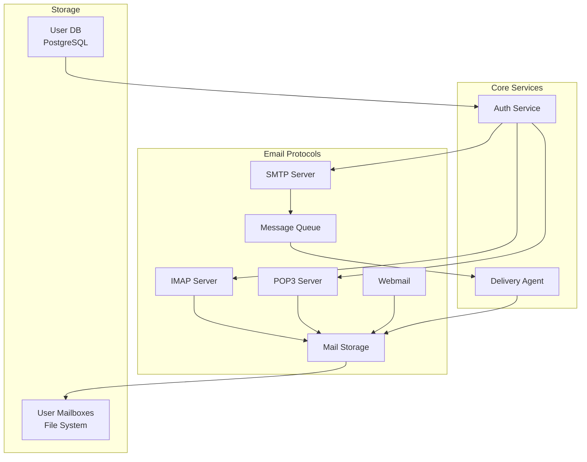
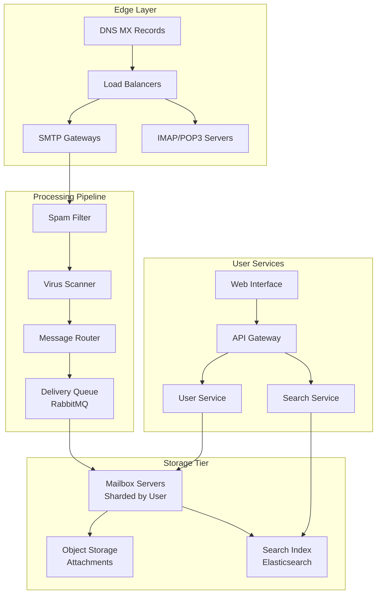
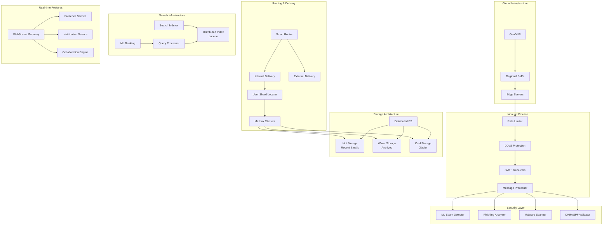
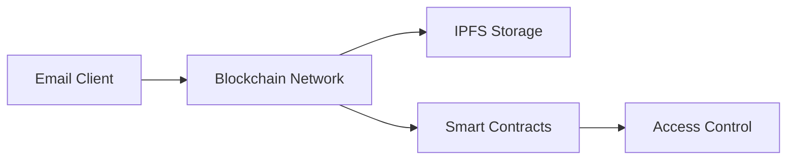

# Distributed Email Service - System Design Case Study

## 1. Problem Statement

Design a global email service like Gmail or Outlook that can:
- Handle billions of emails daily with sub-second delivery
- Support 1B+ active users with 15GB+ storage each
- Provide powerful search across petabytes of email data
- Ensure 99.99% availability and durability
- Protect against spam, phishing, and malware
- Enable real-time collaboration features

### Real-World Context
- **Gmail**: 1.8B+ users, processes 300B+ emails/day
- **Outlook**: 400M+ users, integrated with Office 365
- **ProtonMail**: End-to-end encrypted email for 70M+ users
- **Yahoo Mail**: 225M+ users, pioneered webmail

## 2. Requirements Analysis

### Functional Requirements
1. **Email Operations**
   - Send/receive emails with attachments (up to 25MB)
   - Support SMTP, IMAP, POP3 protocols
   - Rich text formatting and HTML emails
   - Email threading and conversations
   - Multiple mailbox folders and labels

2. **Search & Organization**
   - Full-text search across all emails
   - Advanced filters and search operators
   - Automatic categorization (Primary, Social, Promotions)
   - Smart replies and suggestions
   - Email templates

3. **Security & Spam Protection**
   - Spam detection with <0.1% false positives
   - Phishing and malware protection
   - End-to-end encryption option
   - Two-factor authentication
   - Suspicious login detection

4. **Collaboration Features**
   - Shared mailboxes and delegation
   - Email scheduling and snoozing
   - Read receipts and tracking
   - Integration with calendar and contacts
   - Real-time collaboration on drafts

5. **Storage & Backup**
   - 15GB+ storage per user
   - Automatic backup and recovery
   - Storage quota management
   - Attachment deduplication
   - Archive and retention policies

### Non-Functional Requirements
- **Scale**: 300B+ emails/day, 1B+ active users
- **Latency**: <100ms email delivery within same region
- **Storage**: Exabytes of email data
- **Availability**: 99.99% uptime
- **Durability**: 99.999999999% (11 nines)
- **Compliance**: GDPR, HIPAA, SOC 2

### Law Mapping
- **Law 1 (Latency)**: Sub-second email delivery critical
- **Law 2 (Capacity)**: Storage limits require intelligent management
- **Law 3 (Failure)**: Email must never be lost
- **Law 4 (Concurrency)**: Millions of simultaneous connections
- **Law 5 (Coordination)**: Distributed delivery coordination
- **Law 6 (Observability)**: Track every email's journey
- **Law 7 (Interface)**: Intuitive UI across all devices
- **Law 8 (Economics)**: Cost-effective storage at scale

## 3. Architecture Evolution

### Stage 1: Basic Email Server (10K users)


### Stage 2: Distributed Email System (1M users)


### Stage 3: Global Scale Architecture (1B+ users)


## 4. Detailed Component Design

### 4.1 Distributed Email Delivery System
```python
import asyncio
from typing import List, Dict, Optional
from dataclasses import dataclass
import hashlib
import dns.resolver
from email.mime.multipart import MIMEMultipart

@dataclass
class EmailMessage:
    message_id: str
    from_address: str
    to_addresses: List[str]
    cc_addresses: List[str] = None
    bcc_addresses: List[str] = None
    subject: str = ""
    body_text: str = ""
    body_html: str = ""
    attachments: List[Dict] = None
    headers: Dict[str, str] = None
    
class DistributedEmailRouter:
    """Routes emails efficiently across global infrastructure"""
    
    def __init__(self, shard_manager: ShardManager,
                 delivery_queue: DistributedQueue,
                 spam_filter: SpamFilter):
        self.shard_manager = shard_manager
        self.delivery_queue = delivery_queue
        self.spam_filter = spam_filter
        self.routing_cache = RoutingCache()
        
    async def process_inbound_email(self, raw_email: bytes, 
                                   source_ip: str) -> ProcessingResult:
        """Process incoming email through the pipeline"""
        
        # Parse email
        message = await self._parse_email(raw_email)
        
        # Generate message ID if not present
        if not message.message_id:
            message.message_id = self._generate_message_id()
        
        # Security checks
        security_result = await self._security_checks(message, source_ip)
        if security_result.action == "REJECT":
            return ProcessingResult(
                success=False,
                reason=security_result.reason,
                message_id=message.message_id
            )
        
        # Spam filtering
        spam_score = await self.spam_filter.analyze(message)
        if spam_score.is_spam:
            await self._handle_spam(message, spam_score)
            return ProcessingResult(
                success=True,
                disposition="SPAM",
                message_id=message.message_id
            )
        
        # Route to recipients
        routing_plan = await self._create_routing_plan(message)
        
        # Queue for delivery
        for route in routing_plan:
            await self.delivery_queue.enqueue(
                queue=f"delivery.{route.region}",
                message={
                    'message': message,
                    'route': route,
                    'priority': self._calculate_priority(message)
                }
            )
        
        return ProcessingResult(
            success=True,
            message_id=message.message_id,
            queued_routes=len(routing_plan)
        )
    
    async def _create_routing_plan(self, message: EmailMessage) -> List[Route]:
        """Create optimal routing plan for recipients"""
        
        routes = []
        all_recipients = (message.to_addresses + 
                         (message.cc_addresses or []) + 
                         (message.bcc_addresses or []))
        
        # Group recipients by destination
        recipient_groups = {}
        
        for recipient in all_recipients:
            domain = recipient.split('@')[1]
            
            # Check if internal user
            if await self._is_internal_domain(domain):
                # Find user's shard
                shard = await self.shard_manager.get_user_shard(recipient)
                region = shard.region
                
                if region not in recipient_groups:
                    recipient_groups[region] = []
                recipient_groups[region].append(recipient)
            else:
                # External recipient - group by MX record
                mx_region = await self._get_mx_region(domain)
                
                if mx_region not in recipient_groups:
                    recipient_groups[mx_region] = []
                recipient_groups[mx_region].append(recipient)
        
        # Create routes
        for region, recipients in recipient_groups.items():
            route = Route(
                region=region,
                recipients=recipients,
                is_internal=(region != "external"),
                priority=self._calculate_route_priority(message, recipients)
            )
            routes.append(route)
        
        return routes
    
    async def _get_mx_region(self, domain: str) -> str:
        """Determine best region for external delivery"""
        
        # Check cache
        cached_region = await self.routing_cache.get(f"mx:{domain}")
        if cached_region:
            return cached_region
        
        try:
            # Resolve MX records
            mx_records = dns.resolver.resolve(domain, 'MX')
            
            # Get geographic location of MX servers
            mx_locations = []
            for mx in mx_records:
                ip = await self._resolve_hostname(str(mx.exchange))
                location = await self._get_ip_location(ip)
                mx_locations.append(location)
            
            # Choose nearest region
            best_region = self._find_nearest_region(mx_locations)
            
            # Cache result
            await self.routing_cache.set(
                f"mx:{domain}",
                best_region,
                ttl=3600
            )
            
            return best_region
            
        except Exception as e:
            logger.error(f"MX lookup failed for {domain}: {e}")
            return "us-east-1"  # Default region
    
    def _generate_message_id(self) -> str:
        """Generate unique message ID"""
        
        timestamp = int(time.time() * 1000000)
        random_bytes = os.urandom(16)
        host = socket.gethostname()
        
        return f"<{timestamp}.{random_bytes.hex()}@{host}>"
```

### 4.2 Scalable Storage System
```python
class DistributedEmailStorage:
    """Manages email storage across multiple tiers"""
    
    def __init__(self, storage_config: StorageConfig):
        self.hot_storage = HotStorage()  # SSD, recent emails
        self.warm_storage = WarmStorage()  # HDD, older emails
        self.cold_storage = ColdStorage()  # Object store, archives
        self.metadata_db = MetadataDB()
        self.dedup_engine = DeduplicationEngine()
        
    async def store_email(self, user_id: str, 
                         message: EmailMessage,
                         folder: str = "INBOX") -> StorageResult:
        """Store email with intelligent tiering"""
        
        # Calculate storage location
        shard = self._get_user_shard(user_id)
        
        # Deduplicate attachments
        deduped_attachments = []
        if message.attachments:
            for attachment in message.attachments:
                hash_id = await self.dedup_engine.store_attachment(
                    attachment['content'],
                    attachment['filename']
                )
                deduped_attachments.append({
                    'filename': attachment['filename'],
                    'hash_id': hash_id,
                    'size': len(attachment['content']),
                    'content_type': attachment['content_type']
                })
        
        # Store email body
        email_data = {
            'message_id': message.message_id,
            'user_id': user_id,
            'folder': folder,
            'headers': message.headers,
            'subject': message.subject,
            'from': message.from_address,
            'to': message.to_addresses,
            'cc': message.cc_addresses,
            'bcc': message.bcc_addresses,
            'body_text': message.body_text,
            'body_html': message.body_html,
            'attachments': deduped_attachments,
            'received_at': datetime.utcnow(),
            'size': self._calculate_size(message)
        }
        
        # Store in hot storage initially
        storage_key = f"{shard.id}/{user_id}/{message.message_id}"
        await self.hot_storage.put(storage_key, email_data)
        
        # Update metadata
        await self.metadata_db.insert_email_metadata({
            'user_id': user_id,
            'message_id': message.message_id,
            'folder': folder,
            'storage_tier': 'hot',
            'storage_key': storage_key,
            'size': email_data['size'],
            'received_at': email_data['received_at']
        })
        
        # Update user quota
        await self._update_user_quota(user_id, email_data['size'])
        
        # Schedule for indexing
        await self._queue_for_indexing(user_id, message.message_id)
        
        return StorageResult(
            success=True,
            message_id=message.message_id,
            storage_key=storage_key,
            size=email_data['size']
        )
    
    async def retrieve_email(self, user_id: str, 
                           message_id: str) -> Optional[EmailMessage]:
        """Retrieve email from appropriate storage tier"""
        
        # Get metadata
        metadata = await self.metadata_db.get_email_metadata(
            user_id,
            message_id
        )
        
        if not metadata:
            return None
        
        # Retrieve from appropriate tier
        email_data = None
        
        if metadata['storage_tier'] == 'hot':
            email_data = await self.hot_storage.get(metadata['storage_key'])
        elif metadata['storage_tier'] == 'warm':
            email_data = await self.warm_storage.get(metadata['storage_key'])
            
            # Promote to hot storage if accessed frequently
            if await self._should_promote_to_hot(user_id, message_id):
                await self._promote_to_hot_storage(metadata, email_data)
        else:  # cold storage
            email_data = await self.cold_storage.get(metadata['storage_key'])
            
            # This is expensive, track it
            await self._track_cold_storage_access(user_id, message_id)
        
        if not email_data:
            return None
        
        # Reconstruct attachments
        if email_data.get('attachments'):
            full_attachments = []
            for attachment in email_data['attachments']:
                content = await self.dedup_engine.retrieve_attachment(
                    attachment['hash_id']
                )
                full_attachments.append({
                    'filename': attachment['filename'],
                    'content': content,
                    'content_type': attachment['content_type']
                })
            email_data['attachments'] = full_attachments
        
        return EmailMessage(**email_data)
    
    async def tier_migration_job(self):
        """Background job to migrate emails between storage tiers"""
        
        while True:
            try:
                # Find emails to migrate from hot to warm
                hot_emails = await self.metadata_db.find_emails_for_migration(
                    from_tier='hot',
                    older_than_days=7
                )
                
                for email_meta in hot_emails:
                    await self._migrate_email(
                        email_meta,
                        from_tier='hot',
                        to_tier='warm'
                    )
                
                # Find emails to migrate from warm to cold
                warm_emails = await self.metadata_db.find_emails_for_migration(
                    from_tier='warm',
                    older_than_days=90
                )
                
                for email_meta in warm_emails:
                    await self._migrate_email(
                        email_meta,
                        from_tier='warm',
                        to_tier='cold'
                    )
                
                await asyncio.sleep(3600)  # Run hourly
                
            except Exception as e:
                logger.error(f"Tier migration error: {e}")
                await asyncio.sleep(300)  # Retry in 5 minutes
```

### 4.3 Advanced Spam Detection
```python
import tensorflow as tf
from sklearn.ensemble import RandomForestClassifier
import numpy as np

class MLSpamDetector:
    """Machine learning based spam detection"""
    
    def __init__(self):
        self.text_model = self._load_text_model()
        self.behavior_model = self._load_behavior_model()
        self.image_model = self._load_image_model()
        self.feature_extractor = FeatureExtractor()
        self.reputation_service = ReputationService()
        
    async def analyze(self, message: EmailMessage) -> SpamScore:
        """Analyze email for spam using multiple models"""
        
        # Extract features
        text_features = self.feature_extractor.extract_text_features(message)
        header_features = self.feature_extractor.extract_header_features(message)
        
        # Get sender reputation
        sender_reputation = await self.reputation_service.get_reputation(
            message.from_address
        )
        
        # Text analysis
        text_spam_prob = self.text_model.predict_proba(
            text_features.reshape(1, -1)
        )[0][1]
        
        # Behavioral analysis
        behavior_features = await self._extract_behavior_features(message)
        behavior_spam_prob = self.behavior_model.predict_proba(
            behavior_features.reshape(1, -1)
        )[0][1]
        
        # Image analysis if images present
        image_spam_prob = 0.0
        if self._has_images(message):
            image_features = await self._extract_image_features(message)
            image_spam_prob = self.image_model.predict(
                image_features
            )[0][0]
        
        # Combine scores
        weights = {
            'text': 0.4,
            'behavior': 0.3,
            'reputation': 0.2,
            'image': 0.1
        }
        
        final_score = (
            weights['text'] * text_spam_prob +
            weights['behavior'] * behavior_spam_prob +
            weights['reputation'] * (1 - sender_reputation.score) +
            weights['image'] * image_spam_prob
        )
        
        # Apply rules-based adjustments
        final_score = await self._apply_rule_adjustments(
            message,
            final_score
        )
        
        return SpamScore(
            score=final_score,
            is_spam=final_score > 0.7,
            confidence=self._calculate_confidence(
                text_spam_prob,
                behavior_spam_prob,
                sender_reputation.score
            ),
            reasons=self._generate_spam_reasons(
                message,
                final_score,
                text_spam_prob,
                behavior_spam_prob
            )
        )
    
    async def _extract_behavior_features(self, message: EmailMessage) -> np.array:
        """Extract behavioral spam indicators"""
        
        features = []
        
        # Sender patterns
        sender_domain = message.from_address.split('@')[1]
        features.append(1.0 if sender_domain in SUSPICIOUS_DOMAINS else 0.0)
        features.append(1.0 if self._is_spoofed_sender(message) else 0.0)
        
        # Recipient patterns
        features.append(len(message.to_addresses) / 100.0)  # Normalized
        features.append(
            1.0 if len(message.to_addresses) > 50 else 0.0
        )  # Mass mailing
        
        # Content patterns
        features.append(
            len(re.findall(r'https?://\S+', message.body_text)) / 10.0
        )  # URL count
        features.append(
            1.0 if 'click here' in message.body_text.lower() else 0.0
        )
        features.append(
            1.0 if self._has_suspicious_attachments(message) else 0.0
        )
        
        # Timing patterns
        hour = datetime.utcnow().hour
        features.append(
            1.0 if hour >= 0 and hour <= 6 else 0.0
        )  # Sent at odd hours
        
        # Header anomalies
        features.append(
            1.0 if self._has_header_anomalies(message) else 0.0
        )
        
        return np.array(features)
    
    def _load_text_model(self):
        """Load pre-trained text classification model"""
        
        # In production, this would load a sophisticated model
        # For demo, using a simple TF-IDF + Random Forest
        return RandomForestClassifier(
            n_estimators=100,
            max_depth=50,
            random_state=42
        )
    
    async def _apply_rule_adjustments(self, message: EmailMessage,
                                     ml_score: float) -> float:
        """Apply rule-based adjustments to ML score"""
        
        adjusted_score = ml_score
        
        # Whitelist check
        if await self._is_whitelisted(message.from_address):
            adjusted_score *= 0.1
        
        # Blacklist check
        if await self._is_blacklisted(message.from_address):
            adjusted_score = max(0.95, adjusted_score)
        
        # SPF/DKIM pass reduces spam probability
        if message.headers.get('Authentication-Results'):
            auth_results = message.headers['Authentication-Results']
            if 'spf=pass' in auth_results:
                adjusted_score *= 0.8
            if 'dkim=pass' in auth_results:
                adjusted_score *= 0.8
        
        # Known phishing patterns
        if self._contains_phishing_patterns(message):
            adjusted_score = max(0.9, adjusted_score)
        
        return np.clip(adjusted_score, 0.0, 1.0)
```

### 4.4 Real-time Search Engine
```python
class DistributedEmailSearch:
    """Distributed search across billions of emails"""
    
    def __init__(self, index_clusters: List[SearchCluster]):
        self.index_clusters = index_clusters
        self.query_parser = QueryParser()
        self.ranking_model = RankingModel()
        self.query_cache = QueryCache()
        
    async def search(self, user_id: str, 
                    query: str,
                    options: SearchOptions = None) -> SearchResults:
        """Execute distributed search query"""
        
        # Check cache
        cache_key = self._get_cache_key(user_id, query, options)
        cached_results = await self.query_cache.get(cache_key)
        if cached_results:
            return cached_results
        
        # Parse query
        parsed_query = self.query_parser.parse(query)
        
        # Determine shards to query
        user_shards = await self._get_user_shards(user_id)
        
        # Execute distributed search
        shard_results = await self._distributed_search(
            user_shards,
            parsed_query,
            options
        )
        
        # Merge and rank results
        merged_results = self._merge_shard_results(shard_results)
        
        # Apply ML ranking
        if len(merged_results) > 0:
            ranked_results = await self._apply_ml_ranking(
                merged_results,
                parsed_query,
                user_id
            )
        else:
            ranked_results = merged_results
        
        # Apply pagination
        paginated_results = self._paginate(
            ranked_results,
            options.offset,
            options.limit
        )
        
        # Build final results
        search_results = SearchResults(
            query=query,
            total_count=len(merged_results),
            results=paginated_results,
            facets=self._extract_facets(shard_results),
            suggestions=await self._get_query_suggestions(
                query,
                parsed_query
            )
        )
        
        # Cache results
        await self.query_cache.set(
            cache_key,
            search_results,
            ttl=300  # 5 minutes
        )
        
        return search_results
    
    async def _distributed_search(self, shards: List[Shard],
                                 query: ParsedQuery,
                                 options: SearchOptions) -> List[ShardResult]:
        """Execute search across multiple shards"""
        
        # Build Lucene query
        lucene_query = self._build_lucene_query(query)
        
        # Search each shard in parallel
        tasks = []
        for shard in shards:
            task = self._search_shard(
                shard,
                lucene_query,
                options
            )
            tasks.append(task)
        
        # Gather results with timeout
        try:
            shard_results = await asyncio.wait_for(
                asyncio.gather(*tasks, return_exceptions=True),
                timeout=options.timeout_ms / 1000.0
            )
        except asyncio.TimeoutError:
            # Return partial results on timeout
            shard_results = []
            for task in tasks:
                if task.done():
                    try:
                        result = task.result()
                        shard_results.append(result)
                    except:
                        pass
        
        return [r for r in shard_results if not isinstance(r, Exception)]
    
    def _build_lucene_query(self, parsed_query: ParsedQuery) -> str:
        """Build Lucene query from parsed query"""
        
        clauses = []
        
        # Text search
        if parsed_query.text:
            text_fields = ['subject', 'body', 'from', 'to']
            text_clause = ' OR '.join([
                f'{field}:({parsed_query.text})'
                for field in text_fields
            ])
            clauses.append(f'({text_clause})')
        
        # Field filters
        for field, value in parsed_query.filters.items():
            if isinstance(value, list):
                # OR within field
                field_clause = ' OR '.join([
                    f'{field}:"{v}"' for v in value
                ])
                clauses.append(f'({field_clause})')
            else:
                clauses.append(f'{field}:"{value}"')
        
        # Date range
        if parsed_query.date_from or parsed_query.date_to:
            date_from = parsed_query.date_from or '*'
            date_to = parsed_query.date_to or '*'
            clauses.append(f'received_date:[{date_from} TO {date_to}]')
        
        # Size filter
        if parsed_query.has_attachment:
            clauses.append('attachment_count:[1 TO *]')
        
        # Combine with AND
        return ' AND '.join(clauses) if clauses else '*:*'
    
    async def _apply_ml_ranking(self, results: List[EmailResult],
                               query: ParsedQuery,
                               user_id: str) -> List[EmailResult]:
        """Apply ML-based result ranking"""
        
        # Get user features
        user_profile = await self._get_user_search_profile(user_id)
        
        # Extract ranking features for each result
        feature_vectors = []
        for result in results:
            features = self._extract_ranking_features(
                result,
                query,
                user_profile
            )
            feature_vectors.append(features)
        
        # Get ranking scores
        scores = self.ranking_model.predict(np.array(feature_vectors))
        
        # Combine with original scores
        for i, result in enumerate(results):
            # Blend ML score with search relevance score
            result.final_score = (
                0.7 * result.relevance_score +
                0.3 * scores[i]
            )
        
        # Sort by final score
        results.sort(key=lambda x: x.final_score, reverse=True)
        
        return results
```

### 4.5 Real-time Collaboration
```python
class EmailCollaborationEngine:
    """Enable real-time collaboration on emails"""
    
    def __init__(self, websocket_manager: WebSocketManager,
                 presence_service: PresenceService):
        self.ws_manager = websocket_manager
        self.presence = presence_service
        self.collaboration_sessions = {}
        self.draft_sync_engine = DraftSyncEngine()
        
    async def start_collaboration_session(self, 
                                         draft_id: str,
                                         user_id: str) -> CollaborationSession:
        """Start collaborative editing session"""
        
        # Create or join session
        if draft_id in self.collaboration_sessions:
            session = self.collaboration_sessions[draft_id]
            await session.add_participant(user_id)
        else:
            session = CollaborationSession(
                draft_id=draft_id,
                created_by=user_id,
                created_at=datetime.utcnow()
            )
            await session.add_participant(user_id)
            self.collaboration_sessions[draft_id] = session
        
        # Set up WebSocket connection
        ws_connection = await self.ws_manager.create_connection(
            user_id,
            f"collab:{draft_id}"
        )
        
        # Send initial state
        await self._send_initial_state(ws_connection, session)
        
        # Subscribe to changes
        await self._subscribe_to_changes(draft_id, user_id)
        
        return session
    
    async def handle_draft_change(self, draft_id: str,
                                 user_id: str,
                                 change: DraftChange):
        """Handle collaborative draft change"""
        
        session = self.collaboration_sessions.get(draft_id)
        if not session:
            return
        
        # Apply operational transformation
        transformed_change = await self.draft_sync_engine.transform(
            change,
            session.pending_changes
        )
        
        # Apply change to draft
        await self._apply_change_to_draft(draft_id, transformed_change)
        
        # Broadcast to other participants
        for participant_id in session.participants:
            if participant_id != user_id:
                await self.ws_manager.send_message(
                    participant_id,
                    {
                        'type': 'draft_change',
                        'draft_id': draft_id,
                        'change': transformed_change,
                        'from_user': user_id,
                        'timestamp': datetime.utcnow().isoformat()
                    }
                )
        
        # Update presence
        await self.presence.update_activity(
            user_id,
            f"editing_draft:{draft_id}"
        )
    
    async def handle_cursor_update(self, draft_id: str,
                                  user_id: str,
                                  cursor_position: int):
        """Broadcast cursor position to collaborators"""
        
        session = self.collaboration_sessions.get(draft_id)
        if not session:
            return
        
        # Update user's cursor position
        session.cursor_positions[user_id] = cursor_position
        
        # Broadcast to others
        for participant_id in session.participants:
            if participant_id != user_id:
                await self.ws_manager.send_message(
                    participant_id,
                    {
                        'type': 'cursor_update',
                        'draft_id': draft_id,
                        'user_id': user_id,
                        'position': cursor_position
                    }
                )
```

## 5. Advanced Features

### 5.1 Smart Reply and Compose
```python
class SmartEmailAssistant:
    """AI-powered email composition assistance"""
    
    def __init__(self, language_model: LanguageModel):
        self.model = language_model
        self.template_engine = EmailTemplateEngine()
        self.context_analyzer = ContextAnalyzer()
        
    async def generate_smart_replies(self, 
                                    email: EmailMessage,
                                    user_context: UserContext) -> List[SmartReply]:
        """Generate contextual reply suggestions"""
        
        # Analyze email context
        context = await self.context_analyzer.analyze(email)
        
        # Extract key information
        sentiment = context.sentiment
        intent = context.intent
        entities = context.entities
        
        # Generate appropriate replies based on intent
        replies = []
        
        if intent == "question":
            # Generate answer-focused replies
            replies.extend(await self._generate_answer_replies(
                email,
                entities,
                user_context
            ))
        elif intent == "request":
            # Generate action-focused replies
            replies.extend(await self._generate_action_replies(
                email,
                entities,
                user_context
            ))
        elif intent == "information":
            # Generate acknowledgment replies
            replies.extend(await self._generate_ack_replies(
                email,
                sentiment
            ))
        
        # Personalize based on user style
        personalized_replies = await self._personalize_replies(
            replies,
            user_context.writing_style
        )
        
        return personalized_replies[:3]  # Top 3 suggestions
    
    async def auto_complete_email(self, 
                                 partial_draft: str,
                                 context: EmailContext) -> List[Completion]:
        """Provide intelligent email completions"""
        
        # Prepare prompt with context
        prompt = self._build_completion_prompt(
            partial_draft,
            context
        )
        
        # Generate completions
        completions = await self.model.generate_completions(
            prompt,
            max_tokens=100,
            temperature=0.7,
            num_completions=5
        )
        
        # Filter and rank completions
        filtered_completions = []
        
        for completion in completions:
            # Check appropriateness
            if self._is_appropriate(completion, context):
                score = self._score_completion(
                    completion,
                    partial_draft,
                    context
                )
                filtered_completions.append(
                    Completion(
                        text=completion,
                        score=score,
                        type=self._classify_completion(completion)
                    )
                )
        
        # Sort by score
        filtered_completions.sort(key=lambda x: x.score, reverse=True)
        
        return filtered_completions[:3]
```

### 5.2 Advanced Security Features
```python
class EmailSecurityEngine:
    """Comprehensive email security system"""
    
    def __init__(self):
        self.phishing_detector = PhishingDetector()
        self.malware_scanner = MalwareScanner()
        self.encryption_service = EncryptionService()
        self.sandbox = EmailSandbox()
        
    async def scan_email(self, email: EmailMessage) -> SecurityScan:
        """Comprehensive security scan"""
        
        scan_result = SecurityScan()
        
        # Check for phishing
        phishing_result = await self.phishing_detector.analyze(email)
        if phishing_result.is_phishing:
            scan_result.add_threat(
                ThreatType.PHISHING,
                phishing_result.confidence,
                phishing_result.indicators
            )
        
        # Scan attachments for malware
        if email.attachments:
            for attachment in email.attachments:
                malware_result = await self.malware_scanner.scan(
                    attachment['content'],
                    attachment['filename']
                )
                
                if malware_result.is_malicious:
                    scan_result.add_threat(
                        ThreatType.MALWARE,
                        malware_result.confidence,
                        {
                            'filename': attachment['filename'],
                            'malware_type': malware_result.malware_type
                        }
                    )
        
        # Check URLs
        urls = self._extract_urls(email)
        for url in urls:
            url_result = await self._check_url_reputation(url)
            if url_result.is_malicious:
                scan_result.add_threat(
                    ThreatType.MALICIOUS_URL,
                    url_result.confidence,
                    {'url': url}
                )
        
        # Sandbox suspicious content
        if scan_result.risk_score > 0.5:
            sandbox_result = await self.sandbox.analyze(email)
            scan_result.sandbox_analysis = sandbox_result
        
        return scan_result
    
    async def enable_e2e_encryption(self, user_id: str,
                                   recipient: str,
                                   message: EmailMessage) -> EncryptedEmail:
        """Enable end-to-end encryption"""
        
        # Get recipient's public key
        recipient_key = await self._get_public_key(recipient)
        if not recipient_key:
            raise NoPublicKeyError(f"No public key for {recipient}")
        
        # Get sender's key pair
        sender_keys = await self._get_user_keys(user_id)
        
        # Encrypt message
        encrypted_content = await self.encryption_service.encrypt(
            plaintext=message.to_json(),
            recipient_public_key=recipient_key,
            sender_private_key=sender_keys.private_key
        )
        
        # Create encrypted email
        encrypted_email = EncryptedEmail(
            message_id=message.message_id,
            from_address=message.from_address,
            to_address=recipient,
            encrypted_content=encrypted_content,
            encryption_method="PGP",
            key_id=recipient_key.key_id
        )
        
        return encrypted_email
```

### 5.3 Intelligent Organization
```python
class IntelligentOrganizer:
    """ML-powered email organization"""
    
    def __init__(self, categorization_model: CategorizationModel):
        self.model = categorization_model
        self.rule_engine = OrganizationRuleEngine()
        self.importance_scorer = ImportanceScorer()
        
    async def categorize_email(self, email: EmailMessage,
                              user_id: str) -> EmailCategory:
        """Categorize email using ML"""
        
        # Extract features
        features = await self._extract_categorization_features(
            email,
            user_id
        )
        
        # Get ML prediction
        category_probs = self.model.predict_proba(features)
        
        # Get top category
        top_category_idx = np.argmax(category_probs)
        top_category = self.model.categories[top_category_idx]
        confidence = category_probs[top_category_idx]
        
        # Check user rules
        rule_category = self.rule_engine.apply_rules(email, user_id)
        
        # Prefer rule if high confidence
        if rule_category and rule_category.priority > confidence:
            return rule_category
        
        return EmailCategory(
            name=top_category,
            confidence=confidence,
            sub_category=self._determine_subcategory(
                email,
                top_category
            )
        )
    
    async def calculate_importance(self, email: EmailMessage,
                                  user_id: str) -> ImportanceScore:
        """Calculate email importance score"""
        
        factors = []
        
        # Sender importance
        sender_importance = await self._get_sender_importance(
            email.from_address,
            user_id
        )
        factors.append(('sender', sender_importance, 0.3))
        
        # Content urgency
        urgency_score = self._analyze_urgency(email)
        factors.append(('urgency', urgency_score, 0.25))
        
        # User interaction likelihood
        interaction_prob = await self._predict_interaction(
            email,
            user_id
        )
        factors.append(('interaction', interaction_prob, 0.25))
        
        # Time sensitivity
        time_score = self._analyze_time_sensitivity(email)
        factors.append(('time', time_score, 0.2))
        
        # Calculate weighted score
        total_score = sum(score * weight for _, score, weight in factors)
        
        return ImportanceScore(
            score=total_score,
            factors=factors,
            priority=self._score_to_priority(total_score)
        )
```

## 6. Performance Optimizations

### 6.1 Connection Pooling and Protocol Optimization
```python
class OptimizedSMTPServer:
    """High-performance SMTP server implementation"""
    
    def __init__(self):
        self.connection_pool = ConnectionPool(max_size=10000)
        self.pipeline_processor = PipelineProcessor()
        self.compression_engine = CompressionEngine()
        
    async def handle_smtp_connection(self, reader: StreamReader,
                                    writer: StreamWriter):
        """Handle SMTP connection with optimizations"""
        
        connection = SMTPConnection(reader, writer)
        
        try:
            # Send greeting
            await connection.send_response(220, "SMTP Server Ready")
            
            # Enable pipelining if supported
            supports_pipelining = False
            
            while not connection.closed:
                command = await connection.read_command()
                
                if command.verb == "EHLO":
                    # Advertise capabilities
                    await connection.send_multiline_response(250, [
                        "Hello",
                        "PIPELINING",
                        "8BITMIME",
                        "CHUNKING",
                        "STARTTLS",
                        "COMPRESS=DEFLATE"
                    ])
                    supports_pipelining = True
                    
                elif command.verb == "STARTTLS":
                    # Upgrade to TLS
                    await connection.send_response(220, "Go ahead")
                    await connection.start_tls()
                    
                elif command.verb == "COMPRESS":
                    # Enable compression
                    await connection.send_response(220, "Compression enabled")
                    connection.enable_compression()
                    
                elif command.verb == "DATA":
                    # Receive message data
                    if supports_pipelining:
                        # Process pipelined commands
                        await self._handle_pipelined_data(connection)
                    else:
                        await self._handle_data(connection)
                    
                elif command.verb == "QUIT":
                    await connection.send_response(221, "Bye")
                    break
                    
        finally:
            await connection.close()
    
    async def _handle_pipelined_data(self, connection: SMTPConnection):
        """Handle pipelined SMTP commands for efficiency"""
        
        # Read all pipelined commands
        commands = []
        while True:
            command = await connection.read_command_nowait()
            if not command:
                break
            commands.append(command)
        
        # Process in batch
        responses = []
        for cmd in commands:
            response = await self._process_command(cmd)
            responses.append(response)
        
        # Send all responses
        for response in responses:
            await connection.send_response(
                response.code,
                response.message
            )
```

### 6.2 Distributed Caching Strategy
```python
class EmailCacheManager:
    """Multi-tier caching for email data"""
    
    def __init__(self):
        self.l1_cache = ProcessLocalCache(max_size=1000)  # In-process
        self.l2_cache = RedisCache()  # Regional Redis
        self.l3_cache = MemcachedCluster()  # Global Memcached
        
    async def get_email_cached(self, user_id: str,
                              message_id: str) -> Optional[EmailMessage]:
        """Get email with cache hierarchy"""
        
        cache_key = f"email:{user_id}:{message_id}"
        
        # L1 - Process local (nanoseconds)
        email = self.l1_cache.get(cache_key)
        if email:
            return email
        
        # L2 - Redis (microseconds)
        email_data = await self.l2_cache.get(cache_key)
        if email_data:
            email = EmailMessage.from_dict(email_data)
            self.l1_cache.set(cache_key, email, ttl=60)
            return email
        
        # L3 - Memcached (milliseconds)
        email_data = await self.l3_cache.get(cache_key)
        if email_data:
            email = EmailMessage.from_dict(email_data)
            # Populate lower caches
            await self.l2_cache.set(cache_key, email_data, ttl=300)
            self.l1_cache.set(cache_key, email, ttl=60)
            return email
        
        # Cache miss - fetch from storage
        email = await self._fetch_from_storage(user_id, message_id)
        if email:
            # Populate all cache layers
            await self._populate_caches(cache_key, email)
        
        return email
```

## 7. Monitoring and Analytics

### 7.1 Real-time Email Analytics
```python
class EmailAnalyticsPipeline:
    """Real-time analytics for email patterns"""
    
    def __init__(self):
        self.stream_processor = StreamProcessor()
        self.metrics_collector = MetricsCollector()
        self.anomaly_detector = AnomalyDetector()
        
    async def process_email_event(self, event: EmailEvent):
        """Process email event for analytics"""
        
        # Update real-time metrics
        await self.metrics_collector.increment(
            f"emails.{event.type}",
            tags={
                'region': event.region,
                'user_segment': event.user_segment
            }
        )
        
        # Stream processing for aggregations
        await self.stream_processor.process({
            'event_type': event.type,
            'timestamp': event.timestamp,
            'user_id': event.user_id,
            'size': event.size,
            'processing_time': event.processing_time
        })
        
        # Anomaly detection
        if event.type == 'send':
            is_anomaly = await self.anomaly_detector.check_sending_pattern(
                event.user_id,
                event.recipient_count,
                event.timestamp
            )
            
            if is_anomaly:
                await self._handle_anomaly(event)
    
    async def get_user_analytics(self, user_id: str) -> UserEmailStats:
        """Get comprehensive email statistics for user"""
        
        stats = UserEmailStats()
        
        # Email volume
        stats.total_sent = await self._get_count(
            f"user:{user_id}:sent"
        )
        stats.total_received = await self._get_count(
            f"user:{user_id}:received"
        )
        
        # Time patterns
        stats.hourly_pattern = await self._get_hourly_pattern(user_id)
        stats.daily_pattern = await self._get_daily_pattern(user_id)
        
        # Communication network
        stats.top_contacts = await self._get_top_contacts(user_id)
        stats.communication_graph = await self._build_comm_graph(user_id)
        
        # Storage usage
        stats.storage_used = await self._get_storage_usage(user_id)
        stats.storage_trend = await self._get_storage_trend(user_id)
        
        return stats
```

## 8. Failure Scenarios and Recovery

### 8.1 Handling Regional Outages
```python
class RegionalFailoverManager:
    """Handle regional failures gracefully"""
    
    async def handle_region_failure(self, failed_region: str):
        """Coordinate regional failover"""
        
        logger.critical(f"Region {failed_region} failure detected")
        
        # Stop accepting new connections in failed region
        await self._drain_region_traffic(failed_region)
        
        # Redirect DNS to healthy regions
        await self._update_dns_routing(failed_region)
        
        # Migrate in-flight operations
        in_flight = await self._get_in_flight_operations(failed_region)
        
        for operation in in_flight:
            if operation.type == "email_delivery":
                # Re-queue in nearest healthy region
                nearest_region = self._find_nearest_region(failed_region)
                await self._requeue_delivery(operation, nearest_region)
            elif operation.type == "search_query":
                # Queries can be retried by client
                pass
        
        # Start data recovery
        await self._initiate_data_recovery(failed_region)
```

### 8.2 Corruption Detection and Recovery
```python
class EmailIntegrityChecker:
    """Detect and recover from data corruption"""
    
    async def verify_email_integrity(self, user_id: str,
                                    message_id: str) -> IntegrityStatus:
        """Verify email data integrity"""
        
        # Fetch email from primary and replica
        primary = await self._fetch_from_primary(user_id, message_id)
        replica = await self._fetch_from_replica(user_id, message_id)
        
        # Compare checksums
        primary_checksum = self._calculate_checksum(primary)
        replica_checksum = self._calculate_checksum(replica)
        
        if primary_checksum != replica_checksum:
            # Corruption detected
            logger.error(f"Corruption detected for {message_id}")
            
            # Try to determine correct version
            backup = await self._fetch_from_backup(user_id, message_id)
            backup_checksum = self._calculate_checksum(backup)
            
            if backup_checksum == primary_checksum:
                # Replica is corrupted
                await self._repair_replica(user_id, message_id, primary)
                return IntegrityStatus.REPAIRED
            elif backup_checksum == replica_checksum:
                # Primary is corrupted  
                await self._repair_primary(user_id, message_id, replica)
                return IntegrityStatus.REPAIRED
            else:
                # Multiple corruption
                return IntegrityStatus.UNRECOVERABLE
        
        return IntegrityStatus.VALID
```

## 9. Real-World Patterns and Lessons

### 9.1 Gmail's Bigtable Architecture
Gmail uses Google's Bigtable for storing email data with:
- **Row key**: User ID + Message ID
- **Column families**: Headers, Body, Attachments
- **Automatic sharding**: Based on user ID
- **Compression**: Snappy compression for storage efficiency

### 9.2 The Great Email Migration (Outlook.com 2013)
Microsoft migrated 400M+ users from Hotmail to Outlook.com:
- **Gradual migration**: Users migrated in batches
- **Dual-write period**: Writes to both systems
- **Read path switching**: Gradual switch to new system
- **Zero downtime**: Transparent to users

## 10. Alternative Architectures

### 10.1 Blockchain-Based Email


**Advantages**: Decentralized, censorship-resistant
**Disadvantages**: Performance, storage costs, key management

### 10.2 Edge-First Architecture
- Process emails at edge locations
- Store recent emails at edge
- Sync to core asynchronously
- Better latency for users

## 11. Industry Insights

### Key Principles
1. **Never Lose Email**: Durability is paramount
2. **Speed Matters**: Fast search drives engagement  
3. **Security First**: One breach affects millions
4. **Storage Efficiency**: Deduplication saves petabytes
5. **User Trust**: Privacy and reliability essential

### Future Trends
- **AI Integration**: Smart inbox, automated responses
- **Zero-Knowledge**: End-to-end encryption by default
- **Voice/Video**: Integrated communication platform
- **Quantum-Safe**: Post-quantum cryptography
- **Decentralization**: User-owned email infrastructure

*"Email is the cockroach of the Internet - it will survive everything."* - Unknown