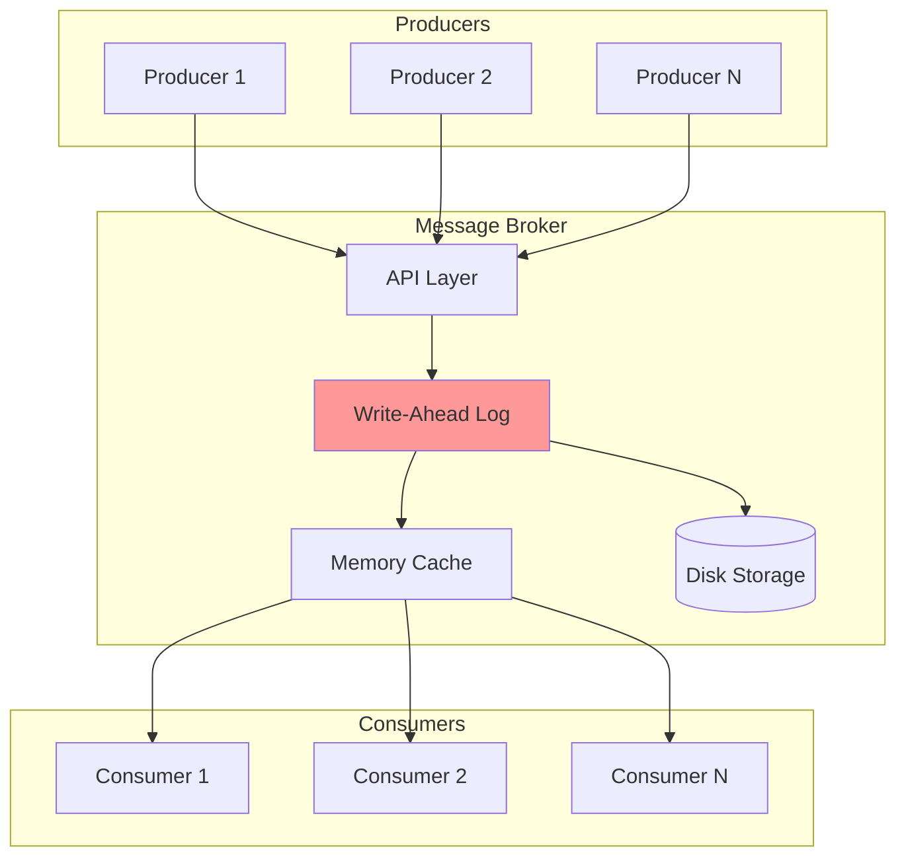
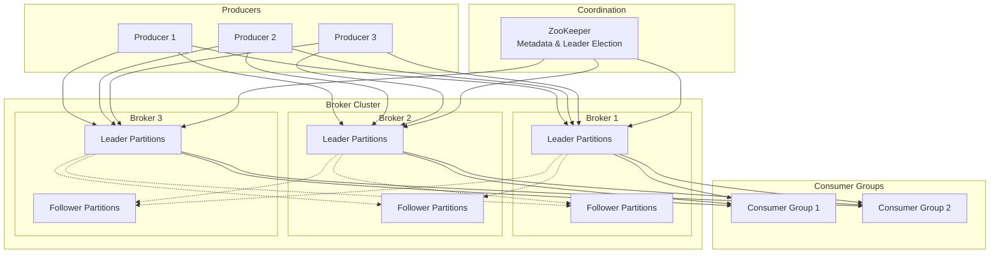
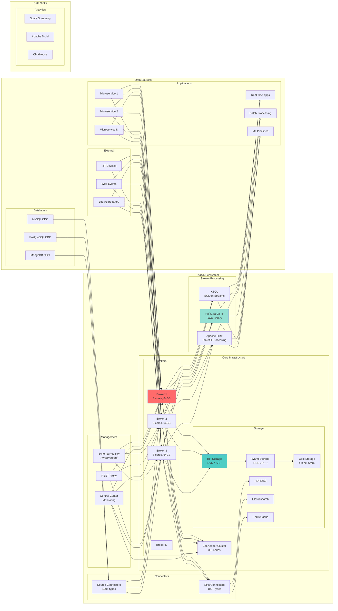
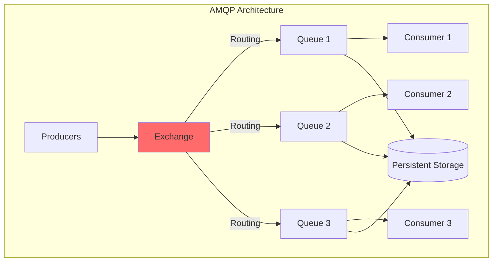
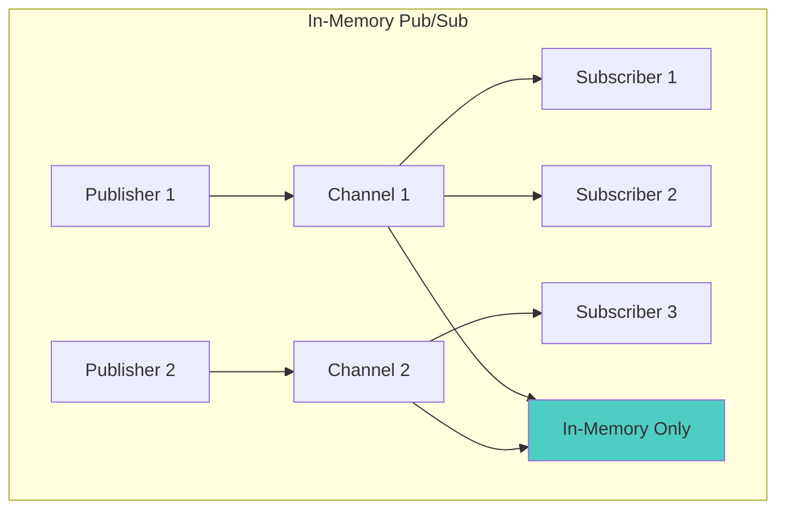
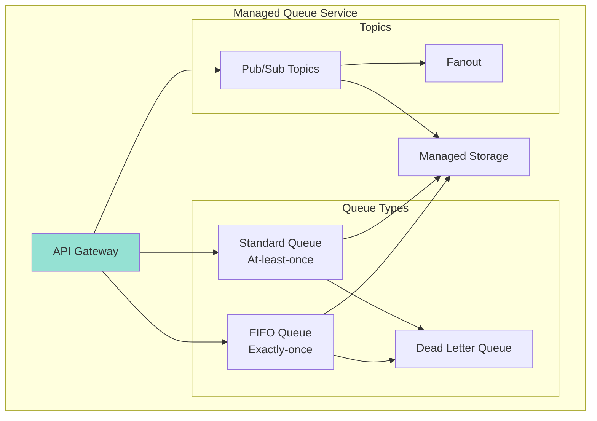
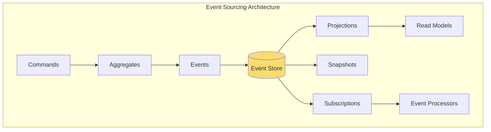
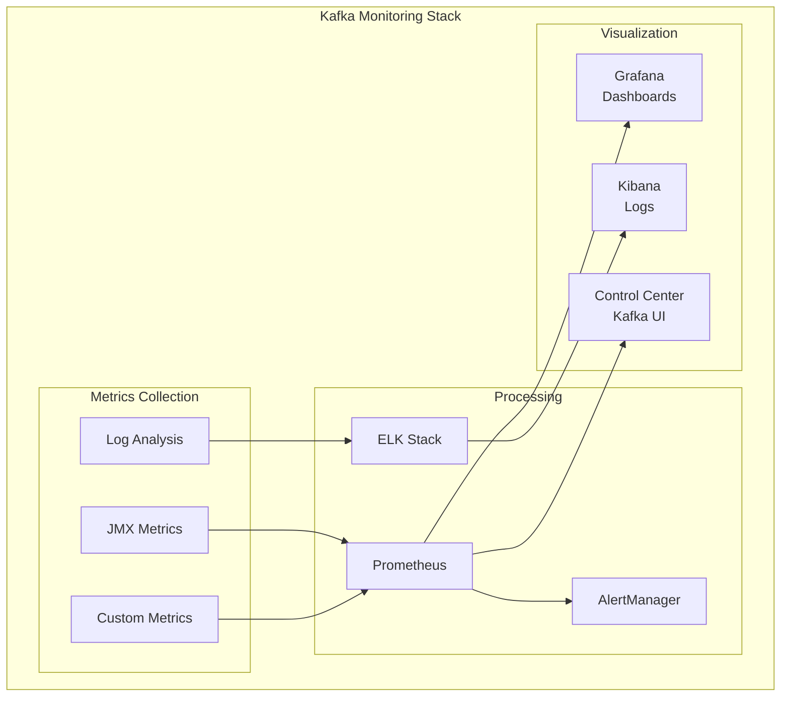

<!-- Navigation -->
[Home](../index.md) → [Case Studies](index.md) → **Distributed Message Queue Design**

# 📨 Distributed Message Queue Design (Kafka/RabbitMQ)

**The Challenge**: Build a distributed message broker that can handle millions of messages per second with durability guarantees

!!! info "Case Study Sources"
    This analysis is based on:
    - Apache Kafka Documentation and Architecture¹
    - LinkedIn Engineering: "Building Kafka at Scale"²
    - RabbitMQ in Depth³
    - Confluent: "Kafka Definitive Guide"⁴
    - Academic Paper: "Kafka: A Distributed Messaging System for Log Processing"⁵

---

## 🏗️ Architecture Evolution

### Phase 1: Simple In-Memory Queue (2008-2010)

```text
Producer → In-Memory Queue → Consumer
```

**Problems Encountered:**
- Messages lost on crash
- No persistence
- Single point of failure
- Memory limitations

**Patterns Violated**: 
- ❌ No [Durability](../patterns/durability.md)
- ❌ No [Replication](../patterns/replication.md)
- ❌ No [Partitioning](../patterns/partitioning.md)

### Phase 2: Persistent Queue with WAL (2010-2011)



**Key Design Decision: Write-Ahead Logging**
- **Trade-off**: Write latency vs Durability (Pillar: [State Distribution](../part2-pillars/state/index.md))
- **Choice**: Sequential disk writes for persistence
- **Result**: 100x durability improvement
- **Pattern Applied**: [Write-Ahead Log](../patterns/wal.md)

According to benchmarks², sequential disk writes achieved 600MB/sec throughput.

### Phase 3: Distributed Architecture (2011-2014)



**Innovation: Log-Structured Storage**⁵
- Append-only commit log
- Zero-copy sends
- Batch compression
- Pagecache usage

**Patterns & Pillars Applied**:
- 🔧 Pattern: [Leader-Follower Replication](../patterns/leader-follower.md)
- 🔧 Pattern: [Partitioning](../patterns/partitioning.md) - Topic partitions
- 🏛️ Pillar: [State Distribution](../part2-pillars/state/index.md) - Distributed logs
- 🏛️ Pillar: [Truth & Consistency](../part2-pillars/truth/index.md) - Ordered delivery

### Phase 4: Modern Streaming Platform (2014-Present)



**Current Capabilities**:
- 7 trillion+ messages/day at LinkedIn
- 2M+ messages/second sustained
- PB/day data ingestion
- <10ms end-to-end latency

## 📊 Core Components Deep Dive

### 1. Log-Structured Storage Engine

```python
class LogSegment:
    """Immutable log segment with index"""
    
    def __init__(self, base_offset: int, log_dir: str):
        self.base_offset = base_offset
        self.log_file = f"{log_dir}/{base_offset}.log"
        self.index_file = f"{log_dir}/{base_offset}.index"
        self.timeindex_file = f"{log_dir}/{base_offset}.timeindex"
        
        # Memory-mapped files for performance
        self.log_mmap = None
        self.index_mmap = None
        self.current_position = 0
        self.current_offset = base_offset
        
    async def append(self, messages: List[Message]) -> int:
        """Append messages to log segment"""
        batch = MessageBatch()
        
        # Add messages to batch
        for msg in messages:
            batch.add(
                offset=self.current_offset,
                timestamp=msg.timestamp,
                key=msg.key,
                value=msg.value,
                headers=msg.headers
            )
            self.current_offset += 1
            
        # Compress batch
        compressed = self._compress_batch(batch)
        
        # Write to log file
        start_position = self.current_position
        bytes_written = await self._write_to_log(compressed)
        self.current_position += bytes_written
        
        # Update indices
        await self._update_indices(
            batch.first_offset,
            batch.last_offset,
            start_position,
            batch.max_timestamp
        )
        
        return batch.last_offset
    
    async def read(self, start_offset: int, max_bytes: int) -> List[Message]:
        """Read messages from segment"""
        # Binary search in index for position
        position = self._find_position(start_offset)
        
        if position is None:
            return []
            
        # Read from log file
        messages = []
        bytes_read = 0
        
        with open(self.log_file, 'rb') as f:
            f.seek(position)
            
            while bytes_read < max_bytes:
                # Read batch header
                batch_header = self._read_batch_header(f)
                if not batch_header:
                    break
                    
                # Read batch data
                batch_data = f.read(batch_header.size)
                bytes_read += batch_header.size
                
                # Decompress and extract messages
                batch_messages = self._decompress_batch(batch_data)
                
                # Filter messages >= start_offset
                for msg in batch_messages:
                    if msg.offset >= start_offset:
                        messages.append(msg)
                        
        return messages

class PartitionLog:
    """Manages multiple log segments for a partition"""
    
    def __init__(self, topic: str, partition: int, log_dir: str):
        self.topic = topic
        self.partition = partition
        self.log_dir = f"{log_dir}/{topic}-{partition}"
        self.segments = SortedDict()  # offset -> LogSegment
        self.active_segment = None
        self.config = LogConfig()
        
    async def append(self, messages: List[Message]) -> AppendResult:
        """Append messages to partition log"""
        # Check if we need to roll segment
        if self._should_roll_segment():
            await self._roll_segment()
            
        # Append to active segment
        last_offset = await self.active_segment.append(messages)
        
        # Update high watermark
        self.high_watermark = last_offset
        
        # Schedule async flush
        asyncio.create_task(self._maybe_flush())
        
        return AppendResult(
            first_offset=messages[0].offset,
            last_offset=last_offset,
            log_append_time=datetime.now()
        )
    
    async def read(self, start_offset: int, max_bytes: int) -> FetchResult:
        """Read messages from partition"""
        messages = []
        bytes_read = 0
        
        # Find starting segment
        segment = self._find_segment(start_offset)
        
        while segment and bytes_read < max_bytes:
            # Read from segment
            segment_messages = await segment.read(
                start_offset,
                max_bytes - bytes_read
            )
            
            if not segment_messages:
                # Move to next segment
                next_offset = segment.base_offset + segment.size
                segment = self.segments.get(next_offset)
                continue
                
            messages.extend(segment_messages)
            bytes_read += sum(msg.size for msg in segment_messages)
            
            # Update start offset for next segment
            if segment_messages:
                start_offset = segment_messages[-1].offset + 1
                
        return FetchResult(
            messages=messages,
            high_watermark=self.high_watermark,
            log_start_offset=self.log_start_offset
        )
```

### 2. Replication Protocol

```python
class ReplicationManager:
    """Manages replication across brokers"""
    
    def __init__(self, broker_id: int):
        self.broker_id = broker_id
        self.replica_fetchers = {}
        self.leader_replicas = {}
        self.follower_replicas = {}
        
    async def become_leader(self, topic_partition: TopicPartition):
        """Handle leader election"""
        # 1. Stop fetching as follower
        if topic_partition in self.replica_fetchers:
            await self.replica_fetchers[topic_partition].stop()
            del self.replica_fetchers[topic_partition]
            
        # 2. Initialize leader state
        leader_replica = LeaderReplica(
            topic_partition,
            self.broker_id
        )
        self.leader_replicas[topic_partition] = leader_replica
        
        # 3. Start accepting produces
        await leader_replica.start_accepting_produces()
        
        # 4. Wait for ISR to catch up
        await leader_replica.wait_for_isr_catchup()
        
    async def become_follower(self, topic_partition: TopicPartition,
                            leader_broker: int):
        """Handle becoming follower"""
        # 1. Stop leader duties if any
        if topic_partition in self.leader_replicas:
            await self.leader_replicas[topic_partition].stop()
            del self.leader_replicas[topic_partition]
            
        # 2. Start replica fetcher
        fetcher = ReplicaFetcher(
            topic_partition,
            leader_broker,
            self.broker_id
        )
        self.replica_fetchers[topic_partition] = fetcher
        await fetcher.start()

class LeaderReplica:
    """Manages leader responsibilities for a partition"""
    
    def __init__(self, topic_partition: TopicPartition, broker_id: int):
        self.topic_partition = topic_partition
        self.broker_id = broker_id
        self.log = PartitionLog(
            topic_partition.topic,
            topic_partition.partition,
            log_dir
        )
        self.isr = set()  # In-Sync Replicas
        self.high_watermark = 0
        self.replication_factor = 3
        
    async def append_messages(self, messages: List[Message],
                            required_acks: int) -> AppendResult:
        """Append messages with replication"""
        # 1. Append to local log
        append_result = await self.log.append(messages)
        
        # 2. Wait for replication based on acks
        if required_acks == 0:
            # Fire and forget
            return append_result
        elif required_acks == 1:
            # Wait for leader only
            return append_result
        elif required_acks == -1:
            # Wait for all ISR
            await self._wait_for_isr_replication(append_result.last_offset)
            return append_result
            
    async def _wait_for_isr_replication(self, offset: int,
                                      timeout: float = 30.0):
        """Wait for ISR to replicate up to offset"""
        start_time = time.time()
        
        while time.time() - start_time < timeout:
            # Check all ISR replicas
            min_isr_offset = min(
                replica.leo for replica in self.isr
            )
            
            if min_isr_offset >= offset:
                # All ISR caught up
                self.high_watermark = offset
                return
                
            await asyncio.sleep(0.01)  # 10ms
            
        # Timeout - shrink ISR
        await self._shrink_isr()
        raise ReplicationTimeoutError()

class ReplicaFetcher:
    """Fetches data from leader for follower replica"""
    
    def __init__(self, topic_partition: TopicPartition,
                leader_broker: int, follower_broker: int):
        self.topic_partition = topic_partition
        self.leader_broker = leader_broker
        self.follower_broker = follower_broker
        self.fetch_offset = 0
        self.running = False
        
    async def start(self):
        """Start fetching from leader"""
        self.running = True
        
        while self.running:
            try:
                # Fetch from leader
                fetch_response = await self._fetch_from_leader()
                
                if fetch_response.messages:
                    # Append to local log
                    await self._append_to_local_log(
                        fetch_response.messages
                    )
                    
                    # Update fetch offset
                    self.fetch_offset = (
                        fetch_response.messages[-1].offset + 1
                    )
                    
                    # Send fetch offset to leader
                    await self._update_leader_hw(self.fetch_offset)
                else:
                    # No new messages, backoff
                    await asyncio.sleep(0.1)
                    
            except Exception as e:
                logging.error(f"Fetch error: {e}")
                await asyncio.sleep(1)
```

### 3. Consumer Group Coordination

```python
class ConsumerGroupCoordinator:
    """Coordinates consumer group membership and assignment"""
    
    def __init__(self, group_id: str):
        self.group_id = group_id
        self.members = {}  # member_id -> metadata
        self.generation_id = 0
        self.leader_id = None
        self.assignment_strategy = RangeAssignor()
        
    async def handle_join_group(self, member_id: str,
                               metadata: ConsumerMetadata) -> JoinGroupResponse:
        """Handle consumer joining group"""
        # 1. Add/update member
        self.members[member_id] = metadata
        
        # 2. Trigger rebalance if needed
        if self._should_rebalance():
            await self._trigger_rebalance()
            
        # 3. Elect leader if needed
        if not self.leader_id:
            self.leader_id = self._elect_leader()
            
        # 4. Wait for all members
        await self._wait_for_members()
        
        # 5. Return response
        return JoinGroupResponse(
            generation_id=self.generation_id,
            leader_id=self.leader_id,
            member_id=member_id,
            members=self.members if member_id == self.leader_id else None
        )
    
    async def handle_sync_group(self, member_id: str,
                              assignments: Dict[str, Assignment]) -> SyncGroupResponse:
        """Handle sync group request"""
        # Leader computes assignment
        if member_id == self.leader_id:
            self.assignments = assignments
            
        # Wait for leader assignment
        await self._wait_for_assignment()
        
        # Return member's assignment
        return SyncGroupResponse(
            assignment=self.assignments.get(member_id, Assignment())
        )

class PartitionAssignor:
    """Assigns partitions to consumers"""
    
    def assign(self, topics: List[str], 
              consumers: List[str]) -> Dict[str, List[TopicPartition]]:
        """Compute partition assignment"""
        # Get all partitions
        all_partitions = []
        for topic in topics:
            partition_count = self._get_partition_count(topic)
            for p in range(partition_count):
                all_partitions.append(TopicPartition(topic, p))
                
        # Sort for deterministic assignment
        all_partitions.sort()
        consumers.sort()
        
        # Range assignment
        assignments = defaultdict(list)
        partitions_per_consumer = len(all_partitions) // len(consumers)
        remaining = len(all_partitions) % len(consumers)
        
        partition_idx = 0
        for i, consumer in enumerate(consumers):
            num_partitions = partitions_per_consumer
            if i < remaining:
                num_partitions += 1
                
            assignments[consumer] = all_partitions[
                partition_idx:partition_idx + num_partitions
            ]
            partition_idx += num_partitions
            
        return dict(assignments)

class StickyAssignor(PartitionAssignor):
    """Sticky partition assignment to minimize rebalance churn"""
    
    def assign(self, topics: List[str], consumers: List[str],
              current_assignment: Dict[str, List[TopicPartition]]) -> Dict[str, List[TopicPartition]]:
        """Compute sticky assignment"""
        # 1. Get all partitions
        all_partitions = set()
        for topic in topics:
            for p in range(self._get_partition_count(topic)):
                all_partitions.add(TopicPartition(topic, p))
                
        # 2. Preserve existing assignments where possible
        assignments = defaultdict(list)
        assigned_partitions = set()
        
        for consumer in consumers:
            if consumer in current_assignment:
                # Keep partitions that are still valid
                for tp in current_assignment[consumer]:
                    if tp in all_partitions and tp not in assigned_partitions:
                        assignments[consumer].append(tp)
                        assigned_partitions.add(tp)
                        
        # 3. Assign unassigned partitions
        unassigned = all_partitions - assigned_partitions
        
        # Balance partition counts
        while unassigned:
            # Find consumer with least partitions
            min_consumer = min(
                consumers,
                key=lambda c: len(assignments[c])
            )
            
            # Assign one partition
            partition = unassigned.pop()
            assignments[min_consumer].append(partition)
            
        return dict(assignments)
```

### 4. Stream Processing Integration

```python
class KafkaStreamsProcessor:
    """Stream processing with exactly-once semantics"""
    
    def __init__(self, app_id: str):
        self.app_id = app_id
        self.topology = StreamTopology()
        self.state_stores = {}
        self.tasks = {}
        
    def stream(self, topics: List[str]) -> KStream:
        """Create stream from topics"""
        source_node = SourceNode(
            name=f"source-{'-'.join(topics)}",
            topics=topics
        )
        self.topology.add_source(source_node)
        
        return KStream(source_node, self.topology)
        
    def table(self, topic: str, store_name: str) -> KTable:
        """Create table from topic"""
        # Create state store
        store = RocksDBStore(store_name)
        self.state_stores[store_name] = store
        
        # Create source node
        source_node = SourceNode(
            name=f"table-source-{topic}",
            topics=[topic]
        )
        
        # Create processor node
        processor_node = TableProcessorNode(
            name=f"table-processor-{topic}",
            store_name=store_name
        )
        
        self.topology.add_source(source_node)
        self.topology.add_processor(processor_node, source_node)
        
        return KTable(processor_node, self.topology, store)

class KStream:
    """Represents a stream of records"""
    
    def __init__(self, source_node: Node, topology: StreamTopology):
        self.source_node = source_node
        self.topology = topology
        
    def filter(self, predicate: Callable) -> 'KStream':
        """Filter records"""
        filter_node = FilterNode(
            name=f"filter-{id(predicate)}",
            predicate=predicate
        )
        self.topology.add_processor(filter_node, self.source_node)
        
        return KStream(filter_node, self.topology)
        
    def map(self, mapper: Callable) -> 'KStream':
        """Transform records"""
        map_node = MapNode(
            name=f"map-{id(mapper)}",
            mapper=mapper
        )
        self.topology.add_processor(map_node, self.source_node)
        
        return KStream(map_node, self.topology)
        
    def group_by_key(self) -> KGroupedStream:
        """Group by key for aggregation"""
        return KGroupedStream(self.source_node, self.topology)

class ExactlyOnceProcessor:
    """Ensures exactly-once processing semantics"""
    
    def __init__(self, transactional_id: str):
        self.transactional_id = transactional_id
        self.producer = None
        self.consumer = None
        
    async def process_batch(self):
        """Process batch with exactly-once semantics"""
        # 1. Begin transaction
        await self.producer.begin_transaction()
        
        try:
            # 2. Consume messages
            messages = await self.consumer.poll(timeout=1000)
            
            # 3. Process messages
            results = []
            for message in messages:
                result = await self._process_message(message)
                results.append(result)
                
            # 4. Produce results
            for result in results:
                await self.producer.send(
                    result.topic,
                    result.key,
                    result.value
                )
                
            # 5. Commit consumer offsets
            await self.producer.send_offsets_to_transaction(
                self.consumer.position(),
                self.consumer.consumer_group_id
            )
            
            # 6. Commit transaction
            await self.producer.commit_transaction()
            
        except Exception as e:
            # Abort transaction on error
            await self.producer.abort_transaction()
            raise
```

### 5. Performance Optimization

```python
class PerformanceOptimizer:
    """Optimizations for high throughput"""
    
    def __init__(self):
        self.batch_size = 16384  # 16KB
        self.linger_ms = 10
        self.compression_type = 'lz4'
        self.buffer_memory = 32 * 1024 * 1024  # 32MB
        
    async def optimize_producer(self, producer: Producer):
        """Configure producer for optimal throughput"""
        producer.config.update({
            'batch.size': self.batch_size,
            'linger.ms': self.linger_ms,
            'compression.type': self.compression_type,
            'buffer.memory': self.buffer_memory,
            'acks': 1,  # Leader acknowledgment only
            'retries': 3,
            'max.in.flight.requests.per.connection': 5
        })
        
    async def optimize_consumer(self, consumer: Consumer):
        """Configure consumer for optimal throughput"""
        consumer.config.update({
            'fetch.min.bytes': 1024,  # 1KB minimum
            'fetch.max.wait.ms': 500,
            'max.partition.fetch.bytes': 1048576,  # 1MB
            'session.timeout.ms': 30000,
            'enable.auto.commit': False  # Manual offset management
        })

class ZeroCopyTransfer:
    """Zero-copy data transfer using sendfile"""
    
    async def transfer_to_socket(self, log_segment: LogSegment,
                                socket: Socket,
                                offset: int,
                                length: int):
        """Transfer log data directly to socket"""
        # Open log file
        with open(log_segment.log_file, 'rb') as f:
            # Seek to offset
            position = log_segment.index.lookup(offset)
            f.seek(position)
            
            # Use sendfile for zero-copy transfer
            await socket.sendfile(f, position, length)

class BatchCompression:
    """Compress message batches for efficiency"""
    
    def compress_batch(self, messages: List[Message],
                      compression_type: str) -> bytes:
        """Compress message batch"""
        # Serialize messages
        batch_bytes = self._serialize_batch(messages)
        
        # Apply compression
        if compression_type == 'none':
            return batch_bytes
        elif compression_type == 'gzip':
            return gzip.compress(batch_bytes)
        elif compression_type == 'snappy':
            return snappy.compress(batch_bytes)
        elif compression_type == 'lz4':
            return lz4.frame.compress(batch_bytes)
        elif compression_type == 'zstd':
            return zstd.compress(batch_bytes)
```

## 🎯 Axiom Mapping & Design Decisions

### Comprehensive Design Decision Matrix

| Design Decision | Axiom 1<br/>🚀 Latency | Axiom 2<br/>💾 Capacity | Axiom 3<br/>🔥 Failure | Axiom 4<br/>🔀 Concurrency | Axiom 5<br/>🤝 Coordination | Axiom 6<br/>👁️ Observability | Axiom 7<br/>👤 Human | Axiom 8<br/>💰 Economics |
|----------------|----------|----------|---------|-------------|--------------|---------------|-------|-----------|
| **Log-Structured Storage** | ✅ Sequential writes | ✅ Efficient storage | ✅ Crash recovery | ✅ Append-only | ⚪ | ✅ Offset tracking | ⚪ | ✅ Disk efficiency |
| **Partitioning** | ✅ Parallel access | ✅ Horizontal scale | ✅ Partition isolation | ✅ Consumer parallelism | ✅ Ordered per partition | ✅ Per-partition metrics | ✅ Scalable topics | ✅ Linear scaling |
| **Replication** | ⚪ Sync overhead | ✅ Fault tolerance | ✅ Automatic failover | ✅ Parallel replication | ✅ ISR protocol | ✅ Replication lag | ✅ Durability control | ✅ Tunable redundancy |
| **Zero-Copy** | ✅ Minimal CPU | ✅ High throughput | ⚪ | ✅ Kernel bypass | ⚪ | ✅ Transfer metrics | ⚪ | ✅ 5x efficiency |
| **Batch Processing** | ✅ Amortized overhead | ✅ Compression | ⚪ | ✅ Batch operations | ⚪ | ✅ Batch metrics | ✅ Throughput control | ✅ Network efficiency |
| **Consumer Groups** | ⚪ Coordination overhead | ✅ Work distribution | ✅ Automatic rebalance | ✅ Parallel consumption | ✅ Group coordination | ✅ Lag monitoring | ✅ Simple scaling | ✅ Resource sharing |
| **Exactly-Once** | ⚪ Transaction overhead | ⚪ | ✅ No duplicates/loss | ✅ Idempotent ops | ✅ Transaction protocol | ✅ Transaction metrics | ✅ Correctness | ⚪ |
| **Tiered Storage** | ⚪ Tier latency | ✅ Infinite retention | ✅ Cost-effective backup | ⚪ | ✅ Tier migration | ✅ Storage metrics | ✅ Long retention | ✅ 80% cost savings |

**Legend**: ✅ Primary impact | ⚪ Secondary/No impact

## 🔄 Alternative Architectures

### Alternative 1: Traditional Message Queue (RabbitMQ Style)



**Trade-offs**:
- ✅ Rich routing (topic, fanout, headers)
- ✅ Message acknowledgment
- ✅ Priority queues
- ❌ Limited scalability
- ❌ Not built for streaming
- ❌ Complex clustering

### Alternative 2: In-Memory Pub/Sub (Redis Style)



**Trade-offs**:
- ✅ Ultra-low latency
- ✅ Simple pub/sub
- ✅ No disk I/O
- ❌ No persistence
- ❌ Messages lost on crash
- ❌ Limited by memory

### Alternative 3: Cloud-Native (AWS SQS/SNS Style)



**Trade-offs**:
- ✅ Fully managed
- ✅ Infinite scale
- ✅ Pay per use
- ❌ Vendor lock-in
- ❌ Limited features
- ❌ Higher latency

### Alternative 4: Event Store (EventStore/Axon Style)



**Trade-offs**:
- ✅ Event sourcing native
- ✅ Time travel
- ✅ Complex projections
- ❌ Learning curve
- ❌ Storage overhead
- ❌ Complex operations

## 📊 Performance & Monitoring

### Key Performance Metrics

```python
class MessageQueueMetrics:
    """Comprehensive metrics for message queue"""
    
    def __init__(self):
        self.metrics = {
            # Throughput metrics
            'messages_in_rate': Rate(
                'mq_messages_in_per_sec',
                'Messages produced per second'
            ),
            'messages_out_rate': Rate(
                'mq_messages_out_per_sec',
                'Messages consumed per second'
            ),
            'bytes_in_rate': Rate(
                'mq_bytes_in_per_sec',
                'Bytes produced per second'
            ),
            'bytes_out_rate': Rate(
                'mq_bytes_out_per_sec',
                'Bytes consumed per second'
            ),
            
            # Latency metrics
            'produce_latency': Histogram(
                'mq_produce_latency_ms',
                'Time to produce message',
                buckets=[1, 5, 10, 50, 100, 500, 1000]
            ),
            'fetch_latency': Histogram(
                'mq_fetch_latency_ms',
                'Time to fetch messages',
                buckets=[1, 5, 10, 50, 100, 500]
            ),
            'end_to_end_latency': Histogram(
                'mq_end_to_end_latency_ms',
                'Time from produce to consume',
                buckets=[10, 50, 100, 500, 1000, 5000]
            ),
            
            # Storage metrics
            'log_size': Gauge(
                'mq_log_size_bytes',
                'Total log size',
                ['topic', 'partition']
            ),
            'segment_count': Gauge(
                'mq_segment_count',
                'Number of log segments',
                ['topic', 'partition']
            ),
            
            # Consumer metrics
            'consumer_lag': Gauge(
                'mq_consumer_lag_messages',
                'Consumer lag in messages',
                ['group', 'topic', 'partition']
            ),
            'rebalance_rate': Rate(
                'mq_rebalances_per_hour',
                'Consumer group rebalances'
            ),
            
            # Replication metrics
            'isr_shrink_rate': Rate(
                'mq_isr_shrinks_per_hour',
                'ISR shrink events'
            ),
            'replication_lag': Gauge(
                'mq_replication_lag_messages',
                'Follower lag',
                ['topic', 'partition', 'follower']
            )
        }

class PerformanceBenchmark:
    """Benchmark message queue performance"""
    
    async def run_throughput_test(self, duration_sec: int = 60):
        """Test maximum throughput"""
        producer = Producer({
            'batch.size': 65536,
            'linger.ms': 0,
            'compression.type': 'lz4',
            'acks': 1
        })
        
        message_size = 100  # bytes
        messages_sent = 0
        start_time = time.time()
        
        while time.time() - start_time < duration_sec:
            # Send batch
            batch = []
            for _ in range(1000):
                message = self._generate_message(message_size)
                batch.append(message)
                
            await producer.send_batch('benchmark-topic', batch)
            messages_sent += len(batch)
            
        # Calculate throughput
        elapsed = time.time() - start_time
        throughput = messages_sent / elapsed
        bandwidth = (messages_sent * message_size) / elapsed / 1024 / 1024
        
        return {
            'messages_per_sec': throughput,
            'mb_per_sec': bandwidth,
            'total_messages': messages_sent
        }
```

### Monitoring Dashboard



## 🚨 Failure Scenarios & Recovery

### Common Failure Modes

1. **Broker Failure**
   ```python
   class BrokerFailureHandler:
       async def handle_broker_failure(self, failed_broker_id: int):
           # 1. Detect failed broker
           if not await self.is_broker_alive(failed_broker_id):
               # 2. Trigger leader election for affected partitions
               affected_partitions = self.get_broker_partitions(failed_broker_id)
               
               for partition in affected_partitions:
                   if partition.leader == failed_broker_id:
                       await self.elect_new_leader(partition)
                       
               # 3. Remove from ISR
               await self.remove_from_all_isr(failed_broker_id)
               
               # 4. Rebalance replicas
               await self.rebalance_replicas()
   ```

2. **Disk Failure**
   ```python
   class DiskFailureHandler:
       async def handle_disk_failure(self, broker_id: int, failed_disk: str):
           # 1. Mark disk as failed
           await self.mark_disk_failed(broker_id, failed_disk)
           
           # 2. Move partitions to healthy disks
           partitions = self.get_disk_partitions(broker_id, failed_disk)
           
           for partition in partitions:
               healthy_disk = self.select_healthy_disk(broker_id)
               await self.move_partition(partition, healthy_disk)
               
           # 3. Trigger re-replication
           await self.ensure_replication_factor(partitions)
   ```

3. **Network Partition**
   ```python
   class NetworkPartitionHandler:
       async def handle_network_partition(self, partitioned_brokers: List[int]):
           # 1. Detect split brain
           if self.is_split_brain(partitioned_brokers):
               # 2. Fence minority partition
               minority = self.find_minority_partition(partitioned_brokers)
               await self.fence_brokers(minority)
               
               # 3. Elect new leaders in majority
               await self.reelect_leaders_in_majority()
   ```

## 💡 Key Design Insights

### 1. 📝 **Log is the Core Abstraction**
- Append-only simplifies everything
- Sequential I/O maximizes throughput
- Immutable segments enable caching
- Time-based + size-based retention

### 2. 🔄 **Replication Must Be Async**
- Sync replication kills performance
- ISR balances durability/performance
- Leader election must be fast
- Unclean leader election trade-off

### 3. 📊 **Partitioning Enables Scale**
- Partition is unit of parallelism
- Order guaranteed per partition only
- Key-based partitioning for order
- Rebalancing must be smooth

### 4. 🚀 **Zero-Copy is Critical**
- Sendfile() for network transfer
- PageCache for recent data
- Avoid serialization overhead
- Batch everything possible

### 5. 💰 **Tiered Storage Changes Economics**
- Hot data on SSD
- Warm data on HDD
- Cold data in object store
- Transparent to clients

## 🔍 Related Concepts & Deep Dives

### 📚 Relevant Axioms
- **[Axiom 1: Latency](../part1-axioms/axiom1-latency/index.md)** - Async replication, batching
- **[Axiom 2: Finite Capacity](../part1-axioms/axiom2-capacity/index.md)** - Retention policies, compression
- **[Axiom 3: Failure is Normal](../part1-axioms/axiom3-failure/index.md)** - Replication, failover
- **[Axiom 4: Concurrency](../part1-axioms/axiom4-concurrency/index.md)** - Parallel partitions
- **[Axiom 5: Coordination](../part1-axioms/axiom5-coordination/index.md)** - Consumer groups, transactions
- **[Axiom 6: Observability](../part1-axioms/axiom6-observability/index.md)** - Lag monitoring, metrics
- **[Axiom 7: Human Interface](../part1-axioms/axiom7-human/index.md)** - Simple APIs, tooling
- **[Axiom 8: Economics](../part1-axioms/axiom8-economics/index.md)** - Storage tiers, efficiency

### 🏛️ Related Patterns
- **[Write-Ahead Log](../patterns/wal.md)** - Core storage pattern
- **[Leader-Follower](../patterns/leader-follower.md)** - Replication pattern
- **[Partitioning](../patterns/partitioning.md)** - Horizontal scaling
- **[Event Sourcing](../patterns/event-sourcing.md)** - Event stream storage
- **[Saga Pattern](../patterns/saga.md)** - Distributed transactions
- **[Circuit Breaker](../patterns/circuit-breaker.md)** - Client resilience
- **[Bulkhead](../patterns/bulkhead.md)** - Partition isolation

### 📊 Quantitative Models
- **[Queueing Theory](../quantitative/queueing-theory.md)** - Throughput analysis
- **[Little's Law](../quantitative/littles-law.md)** - Latency vs throughput
- **[CAP Theorem](../quantitative/cap-theorem.md)** - Consistency trade-offs
- **[Amdahl's Law](../quantitative/amdahls-law.md)** - Parallelism limits

### 🔄 Similar Case Studies
- **[Apache Pulsar](pulsar-architecture.md)** - Alternative architecture
- **[Amazon Kinesis](kinesis-design.md)** - Managed streaming
- **[Redis Streams](redis-streams.md)** - In-memory streams
- **[EventStore](eventstore-design.md)** - Event sourcing focus

---

## References

1. Apache Kafka Documentation: "Kafka Architecture" (2023)
2. LinkedIn Engineering: "Building Kafka at LinkedIn Scale" (2019)
3. RabbitMQ in Depth - Manning Publications (2017)
4. Confluent: "Kafka: The Definitive Guide" (2021)
5. LinkedIn: "Kafka: A Distributed Messaging System for Log Processing" - SIGMOD (2011)