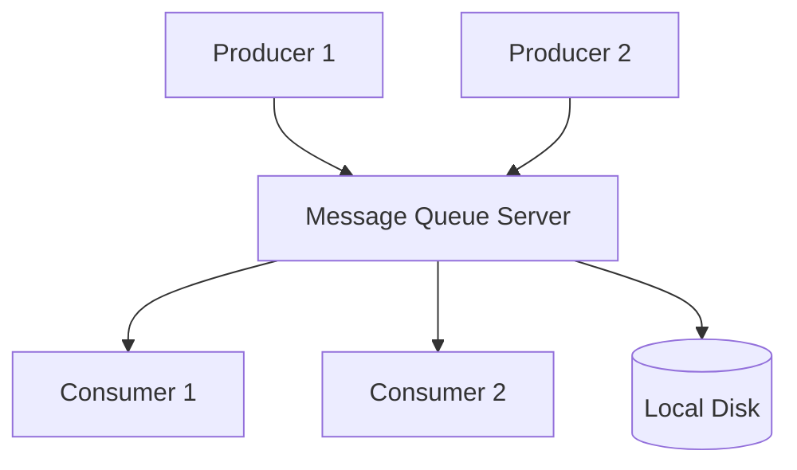
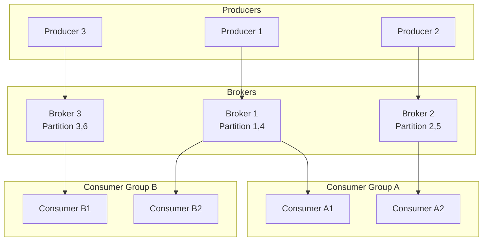
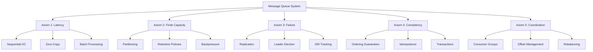
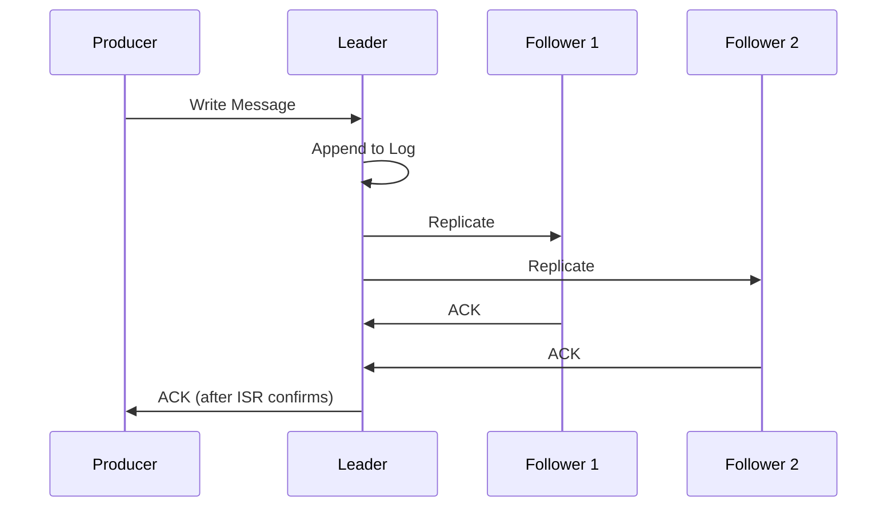
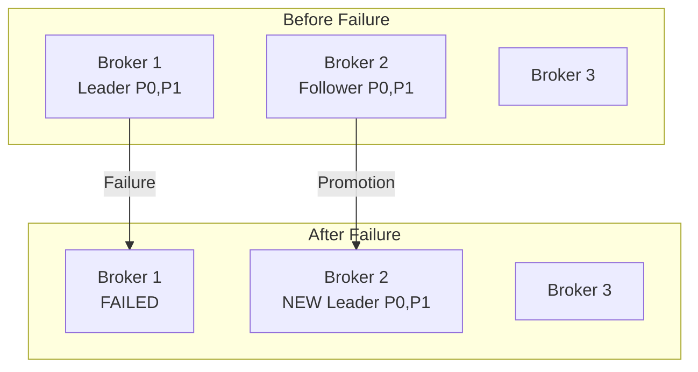

<!-- Navigation -->
[Home](../index.md) → [Case Studies](index.md) → **Distributed Message Queue**

# Design a Distributed Message Queue

!!! info "Case Study Overview"
    **System**: Apache Kafka / RabbitMQ  
    **Scale**: 7 trillion messages/day (LinkedIn Kafka), 1M+ messages/second  
    **Challenges**: Ordering guarantees, durability, high throughput, low latency  
    **Key Patterns**: Partitioning, replication, zero-copy, sequential I/O

*Estimated reading time: 25 minutes*

## Introduction

Message queues are the backbone of modern distributed systems, enabling asynchronous communication, decoupling services, and handling traffic spikes. This case study examines how to build a distributed message queue that can handle millions of messages per second while maintaining durability and ordering guarantees.

## Challenge Statement

Design a distributed message queue system that can:
- Process 1M+ messages per second
- Guarantee message durability (no data loss)
- Provide configurable delivery semantics (at-least-once, at-most-once, exactly-once)
- Scale horizontally to handle growing traffic
- Maintain message ordering within partitions
- Support multiple consumer groups
- Handle producer and consumer failures gracefully

## Architecture Evolution

### Phase 1: Single-Server Queue (Day 1)


**Limitations**:
- Single point of failure
- Limited by single server capacity
- No horizontal scaling

### Phase 2: Distributed Architecture (Current)


## Concept Map



## Key Design Decisions

### 1. Storage Architecture

**Sequential Append-Only Log**:
```
Partition 0:
[Offset 0][Offset 1][Offset 2][Offset 3]...[Offset N]
   |         |         |         |
   Msg1      Msg2      Msg3      Msg4

Benefits:
- O(1) writes (append only)
- Sequential disk I/O (600MB/s vs 100KB/s random)
- Natural ordering by offset
```

### 2. Partitioning Strategy

**Topic Partitioning**:
```python
def get_partition(key, num_partitions):
    if key is None:
        # Round-robin for keyless messages
        return round_robin_counter % num_partitions
    else:
        # Hash-based partitioning for keyed messages
        return hash(key) % num_partitions
```

**Benefits**:
- Horizontal scaling
- Parallel processing
- Order guarantee per partition

### 3. Replication Protocol

**In-Sync Replicas (ISR)**:


### 4. Consumer Group Coordination

**Partition Assignment**:
```
Topic: Orders (6 partitions)
Consumer Group: OrderProcessors (3 consumers)

Assignment:
- Consumer 1: Partitions 0, 1
- Consumer 2: Partitions 2, 3  
- Consumer 3: Partitions 4, 5

Rebalancing triggered when:
- Consumer joins/leaves
- Partition count changes
```

## Technical Deep Dives

### Zero-Copy Transfer

Traditional approach:
```
1. Read data from disk to OS buffer
2. Copy from OS buffer to application buffer
3. Copy from application buffer to socket buffer
4. Send from socket buffer to NIC
```

Zero-copy with sendfile():
```
1. Read data from disk to OS buffer
2. Send directly from OS buffer to NIC
```

**Performance Impact**: 65% reduction in CPU usage

### Write Path Optimization

```java
class MessageWriter {
    private final FileChannel channel;
    private final ByteBuffer buffer = ByteBuffer.allocateDirect(1_048_576); // 1MB
    
    public void batchWrite(List<Message> messages) {
        buffer.clear();
        
        // Batch messages into buffer
        for (Message msg : messages) {
            if (buffer.remaining() < msg.size()) {
                flush();
                buffer.clear();
            }
            buffer.put(serialize(msg));
        }
        
        flush();
    }
    
    private void flush() {
        buffer.flip();
        channel.write(buffer);
        channel.force(false); // Flush to disk
    }
}
```

### Exactly-Once Semantics

**Idempotent Producer**:
```java
ProducerConfig config = new ProducerConfig()
    .setIdempotenceEnabled(true)
    .setTransactionalId("order-processor-1");

producer.beginTransaction();
try {
    // Process and produce messages
    producer.send(new ProducerRecord<>("orders", order));
    producer.send(new ProducerRecord<>("inventory", update));
    
    producer.commitTransaction();
} catch (Exception e) {
    producer.abortTransaction();
}
```

## Performance Characteristics

### Throughput Benchmarks

| Configuration | Messages/sec | Latency (p99) | CPU Usage |
|--------------|--------------|---------------|-----------|
| Single broker, no replication | 800K | 2ms | 40% |
| 3 brokers, replication factor 3 | 500K | 5ms | 60% |
| 5 brokers, RF=3, compression | 700K | 4ms | 70% |
| 10 brokers, RF=3, batching | 1.2M | 10ms | 65% |

### Storage Efficiency

```
Message size: 1KB
Retention: 7 days
Throughput: 100K messages/sec

Daily storage = 100K * 1KB * 86400 = 8.64TB
Weekly storage = 60.48TB

With compression (Snappy, 50% ratio): 30.24TB
With replication factor 3: 90.72TB total
```

## Failure Scenarios

### 1. Broker Failure


### 2. Network Partition
```
Partition Scenario:
[Broker 1, 2] <--X--> [Broker 3, 4, 5]

With min.insync.replicas = 2:
- Minority side becomes read-only
- Majority side continues operations
- Automatic recovery when partition heals
```

### 3. Consumer Failure
```
Consumer Group Before:
- C1: Partitions 0,1,2
- C2: Partitions 3,4,5

C1 Fails →

Rebalancing Result:
- C2: Partitions 0,1,2,3,4,5
```

## Monitoring and Operations

### Key Metrics

**Producer Metrics**:
- Records sent/sec
- Average batch size
- Request latency
- Failed sends

**Broker Metrics**:
- Messages in/out per second
- Partition lag
- ISR shrink/expand rate
- Disk usage %

**Consumer Metrics**:
- Lag per partition
- Messages consumed/sec
- Rebalance frequency
- Processing time

### Operational Playbook

**Adding Capacity**:
```bash
# 1. Add new broker
kafka-server-start.sh config/server-new.properties

# 2. Reassign partitions
kafka-reassign-partitions.sh \
  --reassignment-json-file expand-cluster-plan.json \
  --execute

# 3. Monitor progress
kafka-reassign-partitions.sh \
  --reassignment-json-file expand-cluster-plan.json \
  --verify
```

## Lessons Learned

### 1. Sequential I/O is King
- Append-only logs leverage disk throughput
- Avoid random reads/writes at all costs
- Pre-allocate files to prevent fragmentation

### 2. Batching Everywhere
- Batch on producer (reduces network calls)
- Batch on write (amortizes fsync cost)
- Batch on consumer (improves throughput)

### 3. Replication != Backup
- Replication protects against hardware failure
- Still need backup for logical errors
- Point-in-time recovery requires additional tooling

### 4. Partition Count Matters
- More partitions = more parallelism
- But also more memory usage (buffers)
- And higher coordination overhead

### 5. Monitor Consumer Lag
- Lag is the #1 health indicator
- Set alerts on increasing lag
- Investigate root cause (slow processing vs. high load)

## Trade-offs and Decisions

| Decision | Trade-off | Why This Choice |
|----------|-----------|-----------------|
| Append-only log | Can't modify messages | Maximizes write throughput |
| Partition ordering | No global ordering | Enables parallel processing |
| Pull-based consumers | More complex clients | Better flow control |
| Persistent storage | Higher latency | Durability guarantee |
| Fixed partition count | Rebalancing overhead | Predictable performance |

## References

- [Kafka: A Distributed Messaging System for Log Processing](https://www.microsoft.com/en-us/research/publication/kafka-distributed-messaging-system-log-processing/)
- [Building LinkedIn's Real-time Activity Data Pipeline](https://engineering.linkedin.com/distributed-systems/building-linkedins-real-time-activity-data-pipeline)
- [The Log: What every software engineer should know](https://engineering.linkedin.com/distributed-systems/log-what-every-software-engineer-should-know-about-real-time-datas-unifying)
- [Kafka Improvement Proposals (KIPs)](https://cwiki.apache.org/confluence/display/KAFKA/Kafka+Improvement+Proposals)