<!-- Navigation -->
[Home](../introduction/index.md) → [Case Studies](index.md) → **Elasticsearch**

# 🔍 Elasticsearch: Distributed Search and Analytics Engine

**The Challenge**: Build a search engine that can index billions of documents and return relevant results in milliseconds while scaling horizontally across hundreds of nodes.

!!! info "Case Study Overview"
    **System**: Distributed search and analytics engine based on Apache Lucene  
    **Scale**: Petabytes of data, thousands of nodes, millions of queries/second  
    **Challenges**: Real-time indexing, relevance scoring, cluster coordination, data distribution  
    **Key Patterns**: Inverted indexes, sharding, replication, master-eligible nodes, segment merging  
    **Sources**: Elastic Documentation¹, Netflix Engineering², Uber Engineering³, GitHub Blog⁴

## Introduction

Elasticsearch transforms the challenge of full-text search from a complex problem requiring specialized expertise into a scalable, distributed solution accessible through simple REST APIs. Built on Apache Lucene, Elasticsearch abstracts away the complexity of search while providing the performance and scale needed for modern applications.

From powering GitHub's code search across 200+ million repositories to enabling Netflix's real-time log analysis, Elasticsearch demonstrates how distributed systems can make complex capabilities simple to consume.

## Part 1: The Physics of Distributed Search

### Law 4: Multidimensional Optimization - Search Quality vs Speed

<div class="axiom-box">
<h4>⚖️ Multidimensional Optimization in Action</h4>
<p><strong>Search involves fundamental trade-offs</strong> - You can optimize for search speed, relevance quality, or resource usage, but optimizing all three simultaneously requires careful architectural choices.</p>
</div>


**Performance vs Quality Comparison:**

| Approach | Search Speed | Relevance Quality | Resource Usage | Use Case |
|----------|-------------|------------------|----------------|----------|
| **Simple grep** | O(n) scan | Perfect recall | Low CPU | Small datasets |
| **SQL LIKE** | Index scan | Basic matching | Medium CPU | Structured data |
| **Elasticsearch** | O(log n) lookup | ML-enhanced scoring | High memory | Full-text search |
| **Vector search** | ANN lookup | Semantic similarity | GPU intensive | AI applications |

### Law 2: Asynchronous Reality - Real-time Indexing

<div class="axiom-box">
<h4>⏱️ Asynchronous Reality in Action</h4>
<p><strong>Search indexes lag behind reality</strong> - Documents become searchable with near-real-time latency, not instantly. Elasticsearch optimizes this gap to under 1 second.</p>
</div>

## Part 2: Core Architecture Components

### Cluster and Node Types


**Node Responsibility Matrix:**

| Node Type | Primary Role | CPU Usage | Memory Usage | Disk Usage |
|-----------|-------------|-----------|-------------|------------|
| **Master-eligible** | Cluster coordination | Low | Medium | Low |
| **Data** | Index and search | High | High | High |
| **Coordinating** | Query routing | Medium | Medium | Low |
| **Ingest** | Document processing | High | Medium | Low |
| **ML** | Machine learning | Very High | High | Medium |

### Document Indexing Pipeline


**Indexing Performance Factors:**

```python
# Elasticsearch indexing configuration
index_settings = {
    "settings": {
        "number_of_shards": 5,           # Parallel indexing
        "number_of_replicas": 1,         # Fault tolerance
        "refresh_interval": "1s",        # Real-time trade-off
        "index.translog.flush_threshold_size": "1gb",  # Durability
        "index.merge.policy.max_merged_segment": "5gb", # Optimization
    },
    "mappings": {
        "properties": {
            "title": {
                "type": "text",
                "analyzer": "standard",   # Text processing
                "fields": {
                    "keyword": {           # Exact matching
                        "type": "keyword"
                    }
                }
            },
            "publish_date": {
                "type": "date",
                "format": "date_optional_time"
            },
            "tags": {
                "type": "keyword"         # Aggregations
            }
        }
    }
}
```

### Inverted Index Structure


**Index Structure Implementation:**

```python
class InvertedIndex:
    def __init__(self):
        self.term_dictionary = {}    # term -> posting list
        self.document_store = {}     # doc_id -> document
        self.field_norms = {}       # doc_id -> field length norms
        
    def add_document(self, doc_id, fields):
        """Add document to index."""
        self.document_store[doc_id] = fields
        
        for field_name, field_value in fields.items():
            tokens = self.analyze_text(field_value)
            
            # Calculate field norm (document length normalization)
            self.field_norms[doc_id] = math.sqrt(len(tokens))
            
            # Build posting lists
            for position, token in enumerate(tokens):
                if token not in self.term_dictionary:
                    self.term_dictionary[token] = PostingList()
                    
                self.term_dictionary[token].add_occurrence(
                    doc_id, field_name, position
                )
    
    def search(self, query_terms):
        """Boolean search with TF-IDF scoring."""
        candidate_docs = set()
        
        # Find documents containing any query term
        for term in query_terms:
            if term in self.term_dictionary:
                posting_list = self.term_dictionary[term]
                candidate_docs.update(posting_list.doc_ids)
        
        # Score and rank documents
        scored_docs = []
        for doc_id in candidate_docs:
            score = self.calculate_tfidf_score(doc_id, query_terms)
            scored_docs.append((doc_id, score))
            
        return sorted(scored_docs, key=lambda x: x[1], reverse=True)
```

### Sharding and Distribution


**Document Routing Algorithm:**

```python
def route_document(doc_id, number_of_shards):
    """Determine which shard should store a document."""
    # Elasticsearch uses murmur3 hash
    hash_value = murmur3_hash(doc_id)
    shard_id = hash_value % number_of_shards
    return shard_id

def route_search_query(index_name, query):
    """Route search query to appropriate shards."""
    if 'routing' in query:
        # Custom routing - go to specific shard
        routing_value = query['routing']
        target_shard = route_document(routing_value, get_shard_count(index_name))
        return [target_shard]
    else:
        # No routing - query all shards
        return list(range(get_shard_count(index_name)))
```

## Part 3: Search and Scoring Algorithms

### Query Execution Pipeline

<div class="decision-box">
<h4>🎯 Design Decision: Two-Phase Search</h4>
<p><strong>Problem</strong>: How to rank millions of documents efficiently?<br/>
<strong>Solution</strong>: Query phase finds top candidates, fetch phase retrieves full documents</p>
</div>


### Relevance Scoring (BM25)

```mermaid
graph TB
    subgraph "BM25 Scoring Components"
        TF[Term Frequency<br/>How often term appears<br/>in document]
        IDF[Inverse Document Frequency<br/>How rare the term is<br/>across collection]
        DL[Document Length<br/>Normalize by doc size]
        
        BM25["BM25 Score<br/>TF × IDF × DL_norm"]
        
        TF --> BM25
        IDF --> BM25
        DL --> BM25
    end
    
    subgraph "Scoring Example"
        Q["Query: 'elasticsearch tutorial'"]
        D1["Doc 1: 'Elasticsearch Tutorial'<br/>Short doc (100 words)"]
        D2["Doc 2: 'Database systems...'<br/>Long doc (5000 words)<br/>mentions 'elasticsearch' once"]
        
        S1["Score 1: High<br/>TF=high, IDF=medium, DL=small"]
        S2["Score 2: Low<br/>TF=low, IDF=medium, DL=large"]
        
        Q --> D1
        Q --> D2
        D1 --> S1
        D2 --> S2
    end
```



**BM25 Implementation:**

```python
import math

def bm25_score(term, document, corpus, k1=1.2, b=0.75):
    """Calculate BM25 score for a term in a document."""
    
    # Term frequency in document
    tf = document.count(term)
    
    # Document frequency (how many docs contain the term)
    df = sum(1 for doc in corpus if term in doc)
    
    # Inverse document frequency
    idf = math.log((len(corpus) - df + 0.5) / (df + 0.5))
    
    # Document length normalization
    doc_length = len(document)
    avg_doc_length = sum(len(doc) for doc in corpus) / len(corpus)
    
    # BM25 formula
    numerator = tf * (k1 + 1)
    denominator = tf + k1 * (1 - b + b * (doc_length / avg_doc_length))
    
    return idf * (numerator / denominator)

def search_query(query_terms, corpus):
    """Score all documents for a multi-term query."""
    doc_scores = {}
    
    for doc_id, document in enumerate(corpus):
        total_score = 0
        
        for term in query_terms:
            if term in document:
                term_score = bm25_score(term, document, corpus)
                total_score += term_score
                
        if total_score > 0:
            doc_scores[doc_id] = total_score
    
    # Sort by score descending
    return sorted(doc_scores.items(), key=lambda x: x[1], reverse=True)
```

### Advanced Query Types


**Complex Query Example:**

```json
{
  "query": {
    "bool": {
      "must": [
        {
          "match": {
            "title": {
              "query": "elasticsearch tutorial",
              "boost": 2.0
            }
          }
        }
      ],
      "should": [
        {
          "match": {
            "tags": "beginner"
          }
        },
        {
          "range": {
            "publish_date": {
              "gte": "2024-01-01",
              "boost": 1.5
            }
          }
        }
      ],
      "must_not": [
        {
          "term": {
            "status": "draft"
          }
        }
      ],
      "filter": [
        {
          "term": {
            "category": "technology"
          }
        }
      ]
    }
  },
  "highlight": {
    "fields": {
      "title": {},
      "content": {
        "fragment_size": 150,
        "number_of_fragments": 3
      }
    }
  },
  "aggregations": {
    "popular_tags": {
      "terms": {
        "field": "tags",
        "size": 10
      }
    },
    "publish_date_histogram": {
      "date_histogram": {
        "field": "publish_date",
        "calendar_interval": "month"
      }
    }
  }
}
```

## Part 4: Real-Time Analytics and Aggregations

### Aggregation Framework

<div class="truth-box">
<h4>💡 Insight: Analytics at Search Speed</h4>
<p>Elasticsearch can calculate complex analytics (histograms, percentiles, geospatial stats) in milliseconds by leveraging the same inverted index structures used for search.</p>
</div>


**Real-World Analytics Example:**

```json
{
  "aggs": {
    "time_buckets": {
      "date_histogram": {
        "field": "@timestamp",
        "fixed_interval": "1h"
      },
      "aggs": {
        "status_codes": {
          "terms": {
            "field": "response_code"
          },
          "aggs": {
            "avg_response_time": {
              "avg": {
                "field": "response_time_ms"
              }
            },
            "error_rate": {
              "bucket_script": {
                "buckets_path": {
                  "total": "_count",
                  "errors": "error_count"
                },
                "script": "params.errors / params.total * 100"
              }
            }
          }
        },
        "unique_users": {
          "cardinality": {
            "field": "user_id",
            "precision_threshold": 10000
          }
        },
        "response_time_percentiles": {
          "percentiles": {
            "field": "response_time_ms",
            "percents": [50, 95, 99, 99.9]
          }
        }
      }
    },
    "error_trend": {
      "date_histogram": {
        "field": "@timestamp",
        "fixed_interval": "15m"
      },
      "aggs": {
        "error_rate": {
          "filter": {
            "range": {
              "response_code": {
                "gte": 400
              }
            }
          }
        },
        "error_rate_smooth": {
          "moving_avg": {
            "buckets_path": "error_rate>_count",
            "window": 4,
            "model": "linear"
          }
        }
      }
    }
  }
}
```

## Part 5: Production Scaling Challenges

### Netflix's Elasticsearch Journey

<div class="failure-vignette">
<h4>💥 Case Study: The Logging Data Explosion</h4>
<p><strong>Problem</strong>: Netflix's log volume grew from 1TB/day to 700TB/day<br/>
<strong>Challenge</strong>: Query performance degraded as cluster grew to 3000+ nodes<br/>
<strong>Solution</strong>: Hot-warm-cold architecture with automated data lifecycle</p>
</div>


**Data Lifecycle Management Policy:**

```json
{
  "policy": {
    "phases": {
      "hot": {
        "actions": {
          "rollover": {
            "max_primary_shard_size": "50GB",
            "max_age": "7d"
          },
          "set_priority": {
            "priority": 100
          }
        }
      },
      "warm": {
        "min_age": "7d",
        "actions": {
          "allocate": {
            "number_of_replicas": 0,
            "include": {
              "data_tier": "warm"
            }
          },
          "forcemerge": {
            "max_num_segments": 1
          },
          "shrink": {
            "number_of_shards": 1
          }
        }
      },
      "cold": {
        "min_age": "90d",
        "actions": {
          "allocate": {
            "include": {
              "data_tier": "cold"
            }
          },
          "searchable_snapshot": {
            "snapshot_repository": "s3-repository"
          }
        }
      },
      "delete": {
        "min_age": "365d",
        "actions": {
          "delete": {}
        }
      }
    }
  }
}
```

**Performance Impact:**

| Metric | Before ILM | After ILM | Improvement |
|--------|-----------|-----------|-------------|
| Storage cost | $2M/month | $800k/month | 60% reduction |
| Query latency (recent) | 50ms p95 | 15ms p95 | 70% improvement |
| Query latency (old) | 200ms p95 | 500ms p95 | Acceptable trade-off |
| Cluster stability | Weekly issues | Monthly issues | 4x improvement |

### GitHub's Code Search Scale

<div class="truth-box">
<h4>💡 Insight: Search at Code Scale</h4>
<p>GitHub indexes 200+ million repositories with 28+ billion files, demonstrating how Elasticsearch can handle massive text corpora with specialized optimizations.</p>
</div>

**Code Search Optimizations:**

```json
{
  "settings": {
    "analysis": {
      "analyzer": {
        "code_analyzer": {
          "type": "custom",
          "tokenizer": "code_tokenizer",
          "filter": [
            "lowercase",
            "code_ngram_filter"
          ]
        }
      },
      "tokenizer": {
        "code_tokenizer": {
          "type": "pattern",
          "pattern": "[\\W&&[^\\.]]+",
          "flags": "CASE_INSENSITIVE"
        }
      },
      "filter": {
        "code_ngram_filter": {
          "type": "edge_ngram",
          "min_gram": 2,
          "max_gram": 20
        }
      }
    },
    "index": {
      "codec": "best_compression",
      "refresh_interval": "30s",
      "number_of_shards": 20,
      "number_of_replicas": 1
    }
  },
  "mappings": {
    "properties": {
      "content": {
        "type": "text",
        "analyzer": "code_analyzer",
        "index_options": "positions"
      },
      "language": {
        "type": "keyword"
      },
      "path": {
        "type": "text",
        "analyzer": "path_hierarchy"
      },
      "repository": {
        "type": "keyword"
      }
    }
  }
}
```

## Part 6: Operational Excellence

### Monitoring and Performance Tuning


**Critical Monitoring Queries:**

```bash
# Cluster health overview
curl -X GET "localhost:9200/_cluster/health?pretty"

# Node stats for performance monitoring
curl -X GET "localhost:9200/_nodes/stats?pretty"

# Index stats for capacity planning
curl -X GET "localhost:9200/_cat/indices?v&s=store.size:desc"

# Hot threads for performance debugging
curl -X GET "localhost:9200/_nodes/hot_threads"

# Pending cluster tasks
curl -X GET "localhost:9200/_cluster/pending_tasks"

# Circuit breaker status
curl -X GET "localhost:9200/_nodes/stats/breaker"
```

### Performance Optimization Strategies

#### JVM and Memory Tuning

```bash
# elasticsearch.yml JVM configuration
-Xms16g
-Xmx16g
-XX:+UseG1GC
-XX:G1HeapRegionSize=32m
-XX:+UnlockExperimentalVMOptions
-XX:+UseTransparentHugePages
-XX:+AlwaysPreTouch
-XX:+DisableExplicitGC

# Memory allocation guidelines
# Heap: 50% of RAM, max 32GB
# Off-heap: Lucene uses remaining RAM for file system cache
# Example: 64GB RAM = 32GB heap + 32GB file cache
```

#### Index Optimization Techniques

```python
# Bulk indexing optimization
from elasticsearch import Elasticsearch
from elasticsearch.helpers import bulk

def optimize_bulk_indexing(es_client, documents):
    """Optimize bulk indexing performance."""
    
    # Prepare bulk actions
    actions = []
    for doc in documents:
        action = {
            '_index': 'logs-2025.01.23',
            '_source': doc,
            '_routing': doc.get('user_id'),  # Custom routing
        }
        actions.append(action)
    
    # Bulk index with optimizations
    bulk(
        es_client,
        actions,
        chunk_size=1000,        # Batch size
        request_timeout=60,     # Timeout
        max_retries=3,         # Retry failed docs
        initial_backoff=2,     # Exponential backoff
        max_backoff=600,       # Max retry delay
    )

# Index template for time-based data
index_template = {
    "index_patterns": ["logs-*"],
    "template": {
        "settings": {
            "number_of_shards": 1,
            "number_of_replicas": 1,
            "refresh_interval": "30s",      # Reduce refresh frequency
            "index.translog.durability": "async",  # Async translog
            "index.codec": "best_compression",     # Compress segments
            "index.merge.policy.max_merged_segment": "2gb"
        },
        "mappings": {
            "dynamic_templates": [
                {
                    "strings_as_keywords": {
                        "match_mapping_type": "string",
                        "mapping": {
                            "type": "keyword",
                            "ignore_above": 256
                        }
                    }
                }
            ]
        }
    }
}
```

### Security and Access Control

#### Role-Based Access Control

```json
{
  "roles": {
    "logs_reader": {
      "cluster": [],
      "indices": [
        {
          "names": ["logs-*"],
          "privileges": ["read"],
          "field_security": {
            "except": ["sensitive_field"]
          },
          "query": {
            "term": {
              "department": "{{username}}"
            }
          }
        }
      ]
    },
    "logs_writer": {
      "cluster": ["monitor"],
      "indices": [
        {
          "names": ["logs-*"],
          "privileges": ["create_index", "write", "read"]
        }
      ]
    },
    "admin": {
      "cluster": ["all"],
      "indices": [
        {
          "names": ["*"],
          "privileges": ["all"]
        }
      ]
    }
  }
}
```

#### TLS and Encryption

```yaml
# elasticsearch.yml security configuration
xpack.security.enabled: true
xpack.security.transport.ssl.enabled: true
xpack.security.transport.ssl.verification_mode: certificate
xpack.security.transport.ssl.client_authentication: required
xpack.security.transport.ssl.keystore.path: elastic-certificates.p12
xpack.security.transport.ssl.truststore.path: elastic-certificates.p12

xpack.security.http.ssl.enabled: true
xpack.security.http.ssl.keystore.path: elastic-certificates.p12

# Authentication providers
xpack.security.authc.realms:
  native:
    native1:
      order: 0
  ldap:
    ldap1:
      order: 1
      url: "ldaps://ldap.company.com:636"
      bind_dn: "cn=elasticsearch,ou=services,dc=company,dc=com"
      user_search:
        base_dn: "ou=users,dc=company,dc=com"
        filter: "(cn={0})"
```

## Part 7: Key Takeaways and Design Principles

### Elasticsearch Design Philosophy

<div class="decision-box">
<h4>🎯 Core Design Principles</h4>
<ol>
<li><strong>Search-first architecture</strong>: Optimize for read-heavy workloads with complex queries</li>
<li><strong>Distributed by default</strong>: Scale horizontally without application changes</li>
<li><strong>Near real-time</strong>: Balance consistency with performance (1-second refresh)</li>
<li><strong>Schema flexibility</strong>: Dynamic mapping with optional strict schemas</li>
</ol>
</div>

### When to Choose Elasticsearch

**Ideal Use Cases:**
- **Full-text search**: Documents, logs, content management
- **Analytics dashboards**: Real-time metrics, time-series analysis
- **Log aggregation**: Centralized logging, observability
- **Recommendation engines**: Content discovery, similarity search
- **Security monitoring**: SIEM, anomaly detection

**When NOT to Use Elasticsearch:**
- **ACID transactions**: Financial systems, consistency requirements
- **Small datasets**: < 1GB where simple databases suffice
- **Write-heavy systems**: High-throughput ingestion without search
- **Complex relationships**: Highly normalized relational data
- **Strong consistency**: Real-time inventory, banking

### Performance Optimization Checklist

1. **Index Design**
   - Choose appropriate shard count (start with 1 shard per 20-50GB)
   - Use time-based indices for log data
   - Optimize mapping for your queries
   - Enable compression for storage efficiency

2. **Query Optimization**
   - Use filters instead of queries when possible
   - Implement caching for repeated queries
   - Avoid deep pagination (use scroll API)
   - Profile slow queries

3. **Hardware Configuration**
   - Heap size: 50% of RAM, max 32GB
   - Use SSDs for hot data
   - Separate master and data node roles
   - Fast network for cross-cluster communication

4. **Operational Excellence**
   - Implement data lifecycle management
   - Monitor cluster health continuously
   - Plan for disaster recovery
   - Secure with authentication and encryption

## Conclusion

Elasticsearch demonstrates how complex search and analytics capabilities can be made accessible through thoughtful distributed system design. By building on proven foundations (Lucene) and adding horizontal scaling, real-time indexing, and operational simplicity, Elasticsearch enables applications to provide Google-quality search experiences.

The near real-time architecture, combined with sophisticated scoring algorithms and powerful aggregation capabilities, shows how distributed systems can provide both performance and flexibility. Understanding Elasticsearch's approach to sharding, replication, and query execution provides insights applicable to many search and analytics systems.

The operational patterns pioneered by Netflix, GitHub, and other large-scale users demonstrate how Elasticsearch can evolve from simple search to comprehensive data platforms powering business-critical applications.

## Related Case Studies
- [Key-Value Store](./key-value-store.md) - Foundation for document storage
- [Cassandra](./cassandra.md) - Alternative distributed database architecture
- [Apache Kafka](./kafka.md) - Stream processing for real-time indexing

## External Resources
- [Elasticsearch Guide](https://www.elastic.co/guide/en/elasticsearch/reference/current/index.html)¹
- [Netflix Tech Blog - Elasticsearch](https://netflixtechblog.com/tagged/elasticsearch)²
- [Uber Engineering - Elasticsearch](https://eng.uber.com/elasticsearch-query-cache/)³
- [GitHub Engineering - Search](https://github.blog/2021-12-15-a-brief-history-of-code-search-at-github/)⁴
