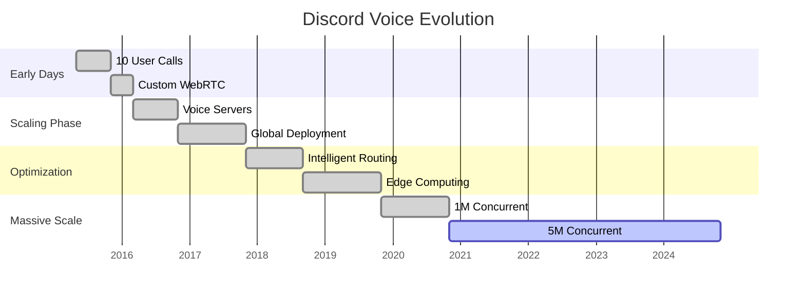
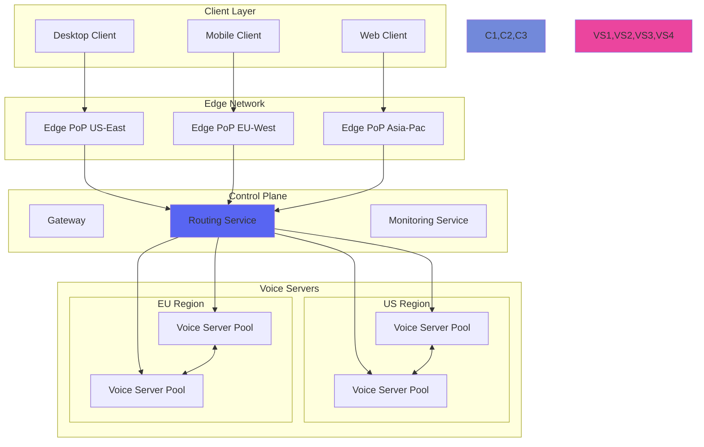
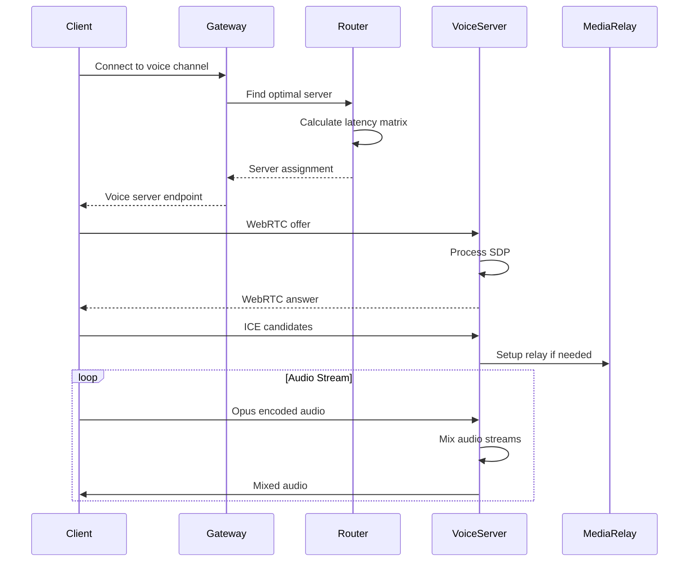
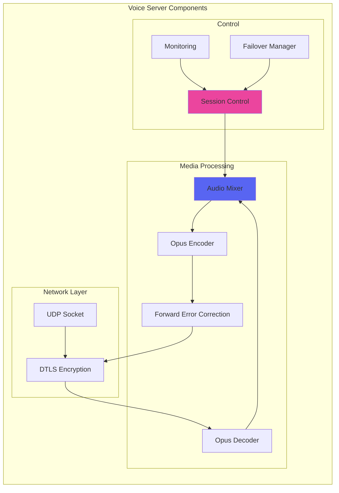
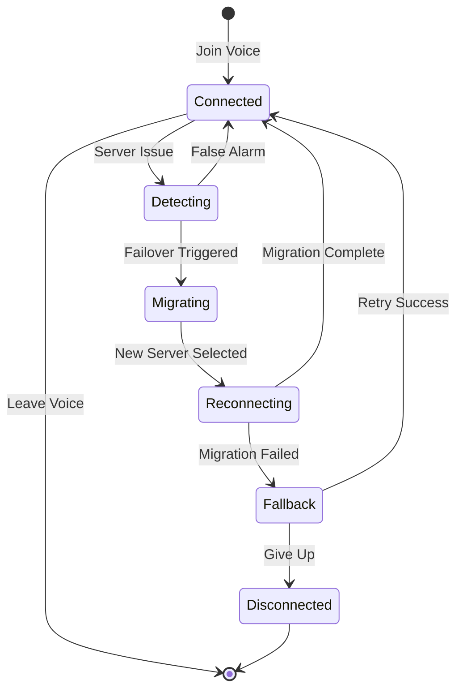
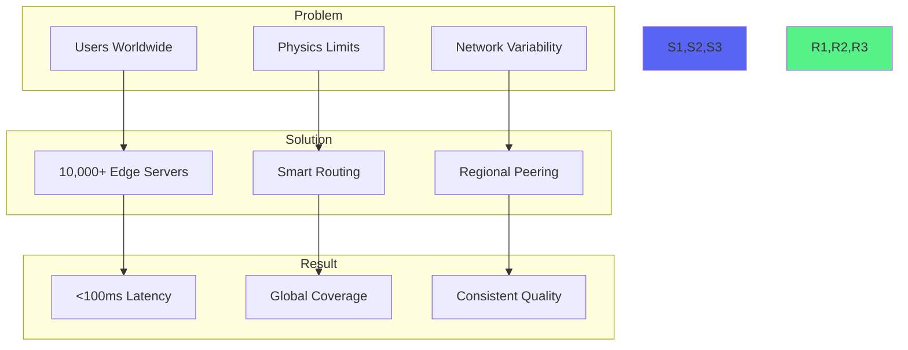
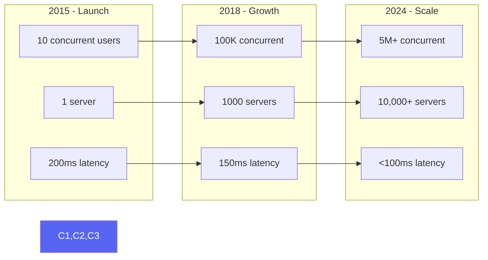

# Discord Voice Infrastructure Case Study

!!! abstract "Executive Summary"
    🎯 **Discord built custom WebRTC infrastructure to handle 5M+ concurrent voice users, achieving <100ms global latency through intelligent routing and edge optimization**

## At a Glance

| Metric | Value |
|--------|-------|
| **Concurrent Voice Users** | 5M+ (peak) |
| **Total Users** | 150M+ monthly active |
| **Voice Servers** | 10,000+ globally |
| **Average Latency** | <100ms (95th percentile) |
| **Packet Loss Tolerance** | Up to 40% |
| **Audio Codec** | Opus (variable bitrate) |

## Problem Statement & Constraints

### The Challenge
- Scale from gaming voice chat to general communication platform
- Maintain low latency for real-time conversation
- Handle diverse network conditions globally
- Support everything from 2-person calls to 1000+ person stages
- Zero perceived downtime during growth

### Constraints
| Constraint | Requirement | Solution |
|------------|-------------|----------|
| **Latency** | <150ms for natural conversation | Global edge servers + intelligent routing |
| **Quality** | Crystal clear audio | Opus codec + adaptive bitrate |
| **Scale** | 10→150M users | Horizontal scaling + smart architecture |
| **Reliability** | No dropped calls | Seamless failover + redundancy |
| **Cost** | Sustainable unit economics | Efficient resource usage + peering |

## Architecture Evolution Timeline



## Architecture Deep Dive

### Voice Infrastructure Overview



### WebRTC Custom Implementation



### Intelligent Routing Algorithm

```python
# Simplified routing logic
class VoiceRouter:
    def find_optimal_server(self, user_locations: List[Location]) -> VoiceServer:
        # Build latency matrix
        latency_matrix = self.build_latency_matrix(user_locations)
        
        # Find server minimizing total latency
        best_server = None
        min_latency = float('inf')
        
        for server in self.available_servers:
            total_latency = 0
            for user_loc in user_locations:
                latency = self.estimate_latency(user_loc, server.location)
                # Penalize high latency exponentially
                total_latency += latency ** 1.5
            
            if total_latency < min_latency:
                min_latency = total_latency
                best_server = server
        
        return best_server
    
    def estimate_latency(self, loc1: Location, loc2: Location) -> float:
        # Haversine distance
        distance_km = haversine(loc1, loc2)
        
        # Account for speed of light in fiber (~200,000 km/s)
        # Plus routing overhead
        base_latency = (distance_km / 200000) * 1000  # ms
        routing_overhead = 10  # ms
        
        return base_latency + routing_overhead
```

## Key Patterns & Innovations

### 1. Voice Server Architecture



### 2. Adaptive Quality System

| Network Condition | Bitrate | FEC | Packet Size | Jitter Buffer |
|------------------|---------|-----|-------------|---------------|
| **Excellent** | 96 kbps | 0% | 20ms | 40ms |
| **Good** | 64 kbps | 10% | 20ms | 60ms |
| **Fair** | 32 kbps | 20% | 40ms | 100ms |
| **Poor** | 16 kbps | 40% | 60ms | 200ms |

### 3. Seamless Failover



## Scaling Challenges & Solutions

### Challenge 1: Global Latency



### Challenge 2: Resource Efficiency

| Problem | Solution | Impact |
|---------|----------|--------|
| **CPU Usage** | SIMD optimized mixing | 70% reduction |
| **Bandwidth** | Selective forwarding | 60% savings |
| **Memory** | Ring buffer pooling | 50% reduction |
| **Latency** | Kernel bypass networking | 30% improvement |

### Challenge 3: Quality at Scale

```python
# Audio mixing optimization
class OptimizedMixer:
    def mix_audio_streams(self, streams: List[AudioStream]) -> bytes:
        # Use SIMD instructions for parallel processing
        mixed = np.zeros(FRAME_SIZE, dtype=np.int16)
        
        # Group by similar volume levels for cache efficiency
        grouped = self.group_by_volume(streams)
        
        for group in grouped:
            # Vectorized mixing
            group_audio = np.array([s.data for s in group])
            mixed += np.sum(group_audio, axis=0)
        
        # Clipping prevention
        mixed = np.clip(mixed, -32768, 32767)
        
        return mixed.tobytes()
```

## Lessons Learned

### Technical Insights

| Lesson | Details | Application |
|--------|---------|-------------|
| **WebRTC Limitations** | Standard WebRTC doesn't scale | Build custom implementation |
| **Server Proximity** | Every 100km adds ~1ms | Dense edge deployment |
| **Adaptive Everything** | Network conditions vary wildly | Dynamic quality adjustment |
| **Mixing Efficiency** | Audio mixing is CPU intensive | Optimize aggressively |

### Operational Insights

1. **Gradual Rollouts**
   - Test with 0.1% → 1% → 10% → 50% → 100%
   - Monitor key metrics at each stage
   - Automated rollback on anomalies

2. **Redundancy Layers**
   ```mermaid
   graph TD
       A[Primary Server] --> F{Failure?}
       F -->|Yes| B[Secondary Server]
       B --> F2{Failure?}
       F2 -->|Yes| C[Regional Fallback]
       C --> F3{Failure?}
       F3 -->|Yes| D[Cross-Region Fallback]
   ```

3. **Real-time Monitoring**
   - Packet loss per user
   - Jitter measurements
   - Server CPU/Memory
   - Regional latency maps

## Practical Takeaways

### For Real-time Systems

1. **Design for Physics**
   ```python
   # Always account for speed of light
   def max_possible_latency(distance_km):
       speed_of_light_fiber = 200000  # km/s
       return (distance_km / speed_of_light_fiber) * 1000  # ms
   ```

2. **Adaptive Quality**
   - Monitor network continuously
   - Adjust quality proactively
   - Prioritize consistency over peak quality

3. **Failover Architecture**
   - Multiple fallback layers
   - Graceful degradation
   - Transparent to users

### For WebRTC Applications

| Recommendation | Why | How |
|----------------|-----|-----|
| **Custom TURN servers** | Better control | Deploy in every region |
| **Optimize codec settings** | Quality vs bandwidth | Profile-based configuration |
| **Monitor everything** | Early problem detection | Real-time dashboards |
| **Plan for mobile** | Different constraints | Separate optimization path |

## Related DStudio Patterns

| Pattern | Application | Link |
|---------|------------|------|
| **Edge Computing** | Global server deployment | [/patterns/edge-computing](/patterns/edge-computing) |
| **Circuit Breaker** | Failover mechanism | [/patterns/circuit-breaker](/patterns/circuit-breaker) |
| **Bulkhead** | Isolate voice servers | [/patterns/bulkhead](/patterns/bulkhead) |
| **Load Balancing** | Distribute connections | [/patterns/load-balancing](/patterns/load-balancing) |
| **Backpressure** | Handle overload | [/patterns/backpressure](/patterns/backpressure) |

## Performance Metrics



## References & Further Reading

- [Discord Engineering Blog](https://discord.com/blog/engineering)
- [How Discord Handles Millions of Voice Users](https://discord.com/blog/how-discord-handles-push-request-bursts-of-over-a-million-per-minute-with-elixir)
- [WebRTC at Scale](https://webrtc.org/getting-started/peer-connections)
- [Opus Codec](https://opus-codec.org/)
- [Discord's Architecture](https://discord.com/blog/why-discord-is-switching-from-go-to-rust)

---

**Key Insight**: Discord's success in voice infrastructure comes from recognizing that standard WebRTC wasn't designed for their scale. By building custom infrastructure optimized for their specific use case, they achieved both superior quality and economics at massive scale.