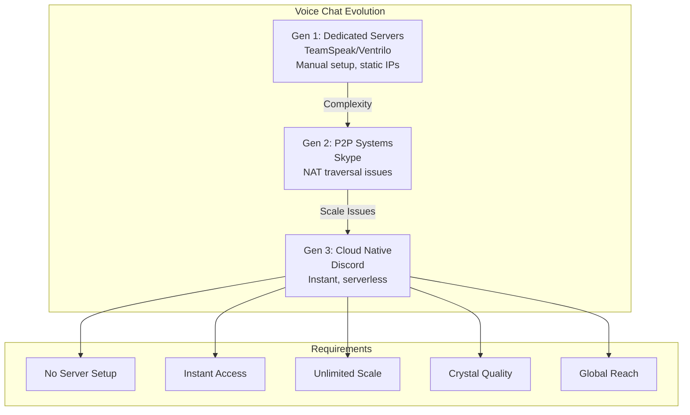
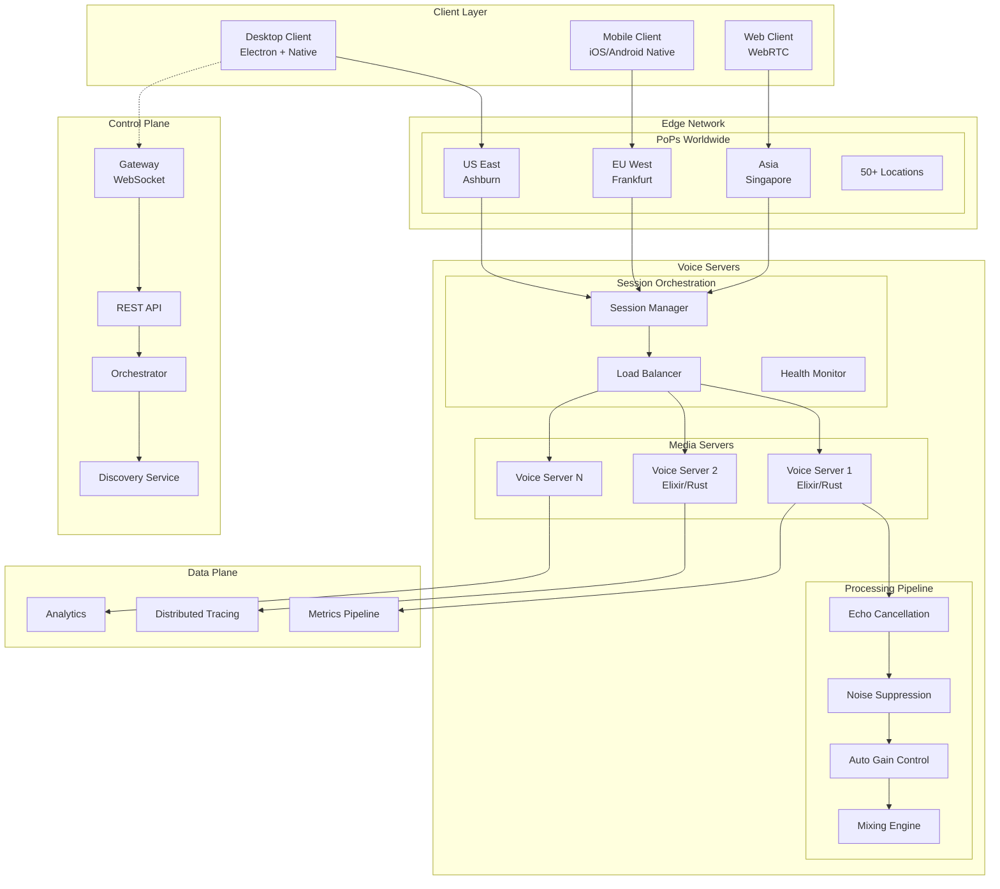
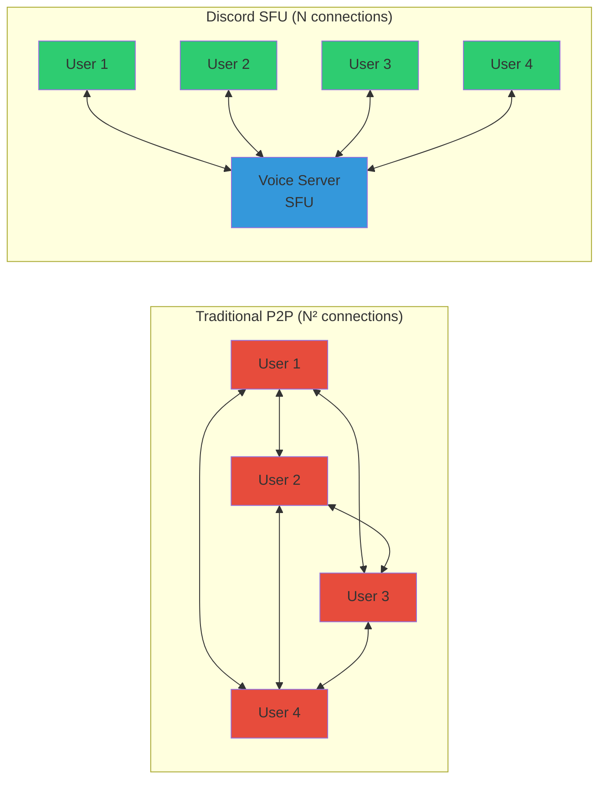
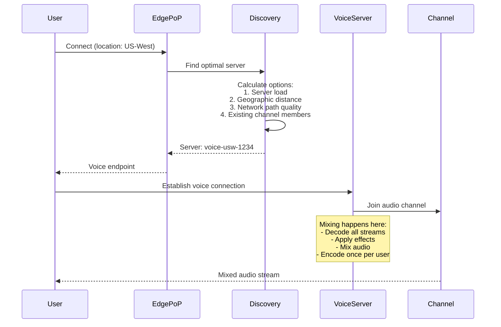
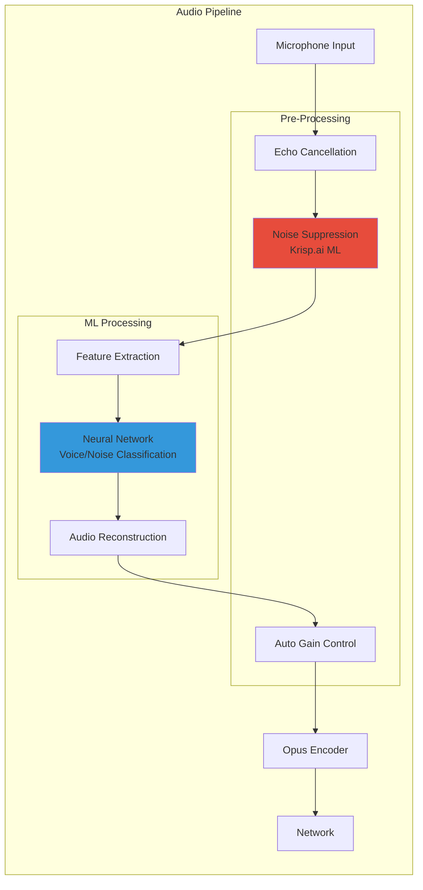
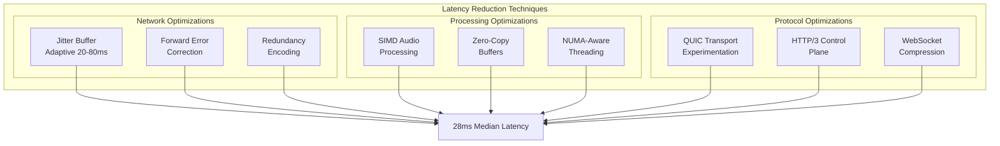
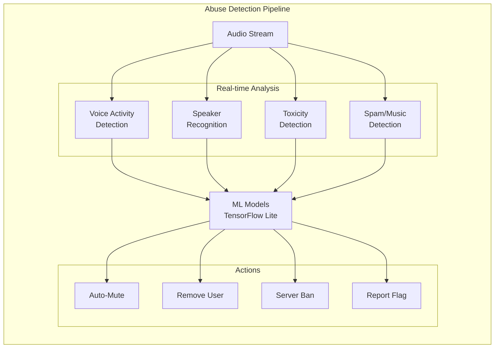
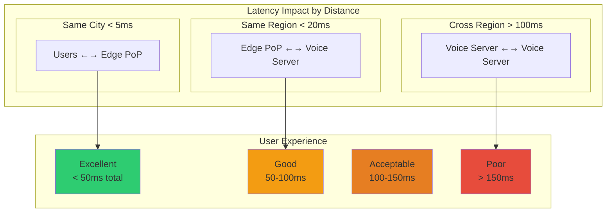
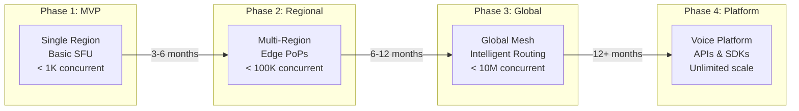

# Discord: Engineering Voice at Massive Scale

## Executive Summary

Discord transformed from a gaming voice chat platform to the de facto communication infrastructure for communities worldwide. Supporting 150+ million monthly active users with 4 billion voice minutes daily, Discord's voice infrastructure represents one of the most impressive feats of real-time engineering. This case study examines how Discord built a voice system that scales to millions of concurrent users while maintaining < 40ms latency globally.

!!! success "Key Achievement"
    Discord handles 5+ million concurrent voice users across 800,000+ simultaneous voice channels with median latency of 28ms and 99th percentile under 60ms globally.

## The Challenge

### Why Voice is Hard at Scale

| Challenge | Complexity |
|-----------|------------|
| **Ultra-Low Latency** | Human perception threshold: 150ms round-trip |
| **Jitter Sensitivity** | 20ms jitter noticeable in conversation |
| **Global Distribution** | Users expect local-quality worldwide |
| **Dynamic Membership** | Channels scale from 2 to 1000s instantly |
| **Mobile Constraints** | Battery, bandwidth, unreliable networks |
| **Abuse Prevention** | Real-time moderation without latency |

### The Gaming Origin Story

Discord's founders experienced these problems firsthand:
- **TeamSpeak/Ventrilo**: Required server setup, not scalable
- **Skype**: Peer-to-peer broke with > 25 users
- **Game Voice**: Poor quality, game-specific silos



## The Solution Architecture

### Multi-Layer Architecture



## Key Innovations

### 1. Selective Forwarding Units (SFU) at Scale

Discord's SFU architecture eliminates peer-to-peer complexity:



### 2. Intelligent Codec Selection

```python
# Simplified codec selection algorithm
class CodecSelector:
    def select_optimal_codec(self, connection_stats, device_info):
        codecs = {
            'opus': {'bitrate': (6, 510), 'complexity': 10},
            'silk': {'bitrate': (6, 40), 'complexity': 5},
            'celt': {'bitrate': (32, 128), 'complexity': 7}
        }
        
        # Measure network conditions
        bandwidth = connection_stats.available_bandwidth
        packet_loss = connection_stats.packet_loss_rate
        jitter = connection_stats.jitter
        
        # Device capabilities
        cpu_power = device_info.cpu_score
        battery_level = device_info.battery_percent
        
        if bandwidth > 64 and packet_loss < 0.01:
            # High quality for good connections
            return {
                'codec': 'opus',
                'bitrate': 64,
                'fec': False,
                'dtx': False
            }
        elif battery_level < 20 or cpu_power < 0.5:
            # Power saving mode
            return {
                'codec': 'silk',
                'bitrate': 24,
                'fec': True,
                'dtx': True
            }
        else:
            # Adaptive middle ground
            return {
                'codec': 'opus',
                'bitrate': min(48, bandwidth * 0.8),
                'fec': packet_loss > 0.02,
                'dtx': jitter > 30
            }
```

### 3. Global Voice Routing

Discord's routing algorithm minimizes latency:



### 4. Krisp.ai Noise Suppression Integration



## Technical Deep Dive

### Voice Server Architecture (Elixir/Erlang)

Discord leverages Erlang's actor model for massive concurrency:

```elixir
defmodule Discord.VoiceServer do
  use GenServer
  
  defstruct [
    :channel_id,
    :region,
    :users,
    :mixer,
    :quality_monitor
  ]
  
  # Each voice channel is an isolated process
  def start_link(channel_id, region) do
    GenServer.start_link(__MODULE__, 
      %{channel_id: channel_id, region: region},
      name: {:global, {:voice_channel, channel_id}}
    )
  end
  
  # Handle user joining
  def handle_call({:join, user_id, session}, _from, state) do
    # Spawn dedicated process for user's audio stream
    {:ok, user_proc} = Discord.UserVoice.start_link(user_id, self())
    
    # Update mixer topology
    Discord.Mixer.add_source(state.mixer, user_proc)
    
    new_state = %{state | 
      users: Map.put(state.users, user_id, user_proc)
    }
    
    {:reply, {:ok, audio_params(state)}, new_state}
  end
  
  # Handle incoming audio packets
  def handle_cast({:audio_packet, user_id, packet}, state) do
    case Map.get(state.users, user_id) do
      nil -> {:noreply, state}
      user_proc -> 
        # Forward to user's dedicated process
        send(user_proc, {:audio, packet})
        {:noreply, state}
    end
  end
  
  # Fault tolerance - user process crashed
  def handle_info({:DOWN, _ref, :process, pid, _reason}, state) do
    # Find and remove crashed user
    user_id = Enum.find_value(state.users, fn {id, proc} -> 
      if proc == pid, do: id 
    end)
    
    if user_id do
      # Clean up mixer
      Discord.Mixer.remove_source(state.mixer, pid)
      new_state = %{state | users: Map.delete(state.users, user_id)}
      {:noreply, new_state}
    else
      {:noreply, state}
    end
  end
end
```

### WebRTC Adaptations

Discord's WebRTC modifications for scale:

| Component | Standard WebRTC | Discord Modification |
|-----------|----------------|---------------------|
| **ICE** | Full ICE negotiation | Pre-computed relay paths |
| **STUN** | Public STUN servers | Dedicated STUN infrastructure |
| **TURN** | Fallback only | Primary path for predictability |
| **Codec** | Negotiated per peer | Server-controlled selection |
| **Topology** | Mesh or MCU | Optimized SFU |

### Performance Optimizations



### Handling Voice Abuse at Scale



## Lessons Learned

### 1. Erlang/Elixir for Soft Real-Time Systems

!!! quote "Discord Engineering"
    "Erlang's actor model and fault tolerance gave us 10x the concurrency of Go with better isolation."

Benefits realized:
- **Process isolation**: One bad channel doesn't affect others
- **Hot code swapping**: Deploy without dropping calls
- **Supervisor trees**: Automatic recovery from crashes
- **Preemptive scheduling**: Consistent low latency

### 2. Edge Computing is Mandatory



### 3. Monitoring is User Experience

| Metric | Target | Alert Threshold | User Impact |
|--------|--------|----------------|-------------|
| **Audio Latency P50** | < 30ms | > 40ms | Slight delay noticed |
| **Audio Latency P99** | < 60ms | > 80ms | Conversation difficult |
| **Packet Loss** | < 0.5% | > 2% | Audio cutting out |
| **Jitter** | < 20ms | > 40ms | Robotic voice |
| **MOS Score** | > 4.0 | < 3.5 | Quality complaints |

## What You Can Apply

### Building Real-Time Systems

1. **Design for Percentiles, Not Averages**
   ```python
   # Bad: Optimize for average case
   def process_audio(packet):
       return complex_processing(packet)  # 10ms average, 100ms P99
   
   # Good: Bound worst-case latency
   def process_audio(packet):
       with timeout(15):  # Hard limit
           return adaptive_processing(packet, deadline=12)
   ```

2. **Graceful Degradation Hierarchy**
   ```mermaid
   graph TD
       F[Full Quality<br/>Opus 64kbps<br/>Stereo, Effects]
       D1[Degraded 1<br/>Opus 48kbps<br/>Stereo, No Effects]
       D2[Degraded 2<br/>Opus 32kbps<br/>Mono]
       D3[Degraded 3<br/>Opus 16kbps<br/>Voice Only]
       E[Emergency<br/>Text Only]
       
       F -->|CPU > 80%| D1
       D1 -->|Network congestion| D2
       D2 -->|Packet loss > 5%| D3
       D3 -->|Server overload| E
   ```

3. **Client-Server Responsibility Split**
   
   | Component | Client Side | Server Side | Rationale |
   |-----------|-------------|-------------|-----------|
   | **Echo Cancellation** | ✓ | ✗ | Needs local audio reference |
   | **Noise Suppression** | ✓ | ✗ | Reduce bandwidth usage |
   | **Mixing** | ✗ | ✓ | Scalability (N vs N²) |
   | **Recording** | ✗ | ✓ | Legal compliance |
   | **Transcoding** | ✗ | ✓ | Client CPU conservation |

### Scaling Voice Infrastructure



### Implementation Checklist

For teams building voice features:

- [ ] **Network Architecture**
  - [ ] Edge PoP selection strategy
  - [ ] Server geographic distribution
  - [ ] Failover mechanisms
  - [ ] DDoS protection

- [ ] **Audio Pipeline**
  - [ ] Echo cancellation
  - [ ] Noise suppression
  - [ ] Automatic gain control
  - [ ] Codec selection logic

- [ ] **Scalability**
  - [ ] Process-per-channel isolation
  - [ ] Horizontal scaling strategy
  - [ ] Load balancing algorithm
  - [ ] Resource limits per channel

- [ ] **Quality Monitoring**
  - [ ] MOS score estimation
  - [ ] Latency percentile tracking
  - [ ] Packet loss monitoring
  - [ ] User quality reports

- [ ] **Client Optimization**
  - [ ] Adaptive bitrate
  - [ ] Jitter buffer tuning
  - [ ] Connection recovery
  - [ ] Battery optimization

## Conclusion

Discord's voice infrastructure demonstrates that building real-time systems at scale requires fundamental architectural decisions that prioritize latency and reliability over features. By choosing Erlang/Elixir, investing in global infrastructure, and maintaining a relentless focus on user experience metrics, Discord created a voice platform that "just works" for millions of users simultaneously. The key lesson: in real-time systems, every millisecond counts, and the architecture must reflect this reality from day one.

!!! tip "The Discord Way"
    Start with latency budgets, build with actor-model isolation, deploy to the edge, and measure what users actually experience. This is how you create voice infrastructure that scales to millions while feeling like a local call.