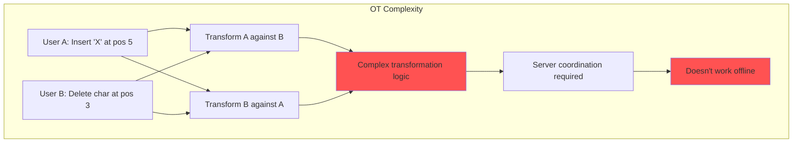
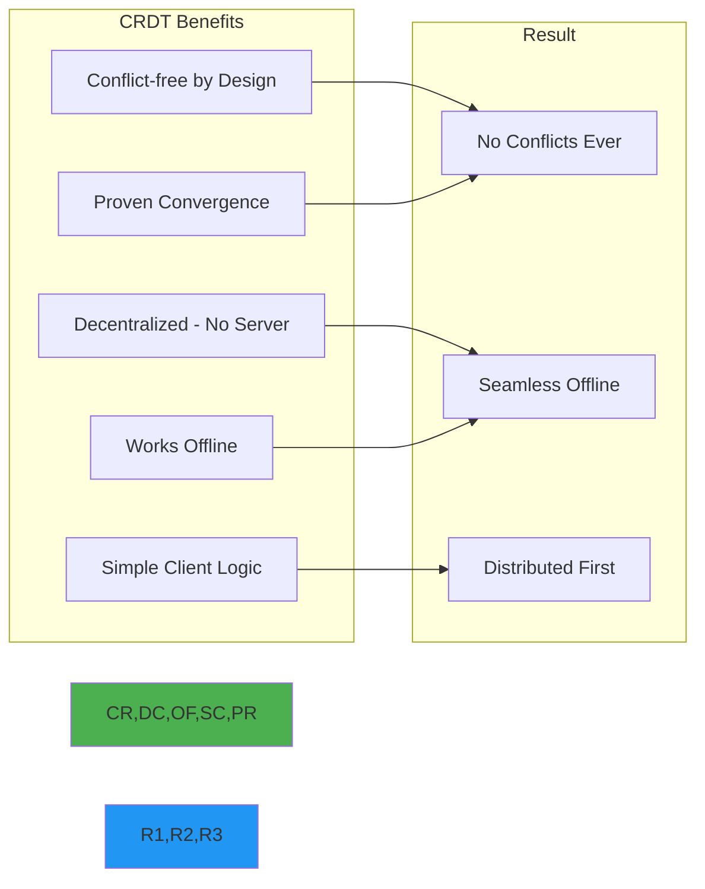
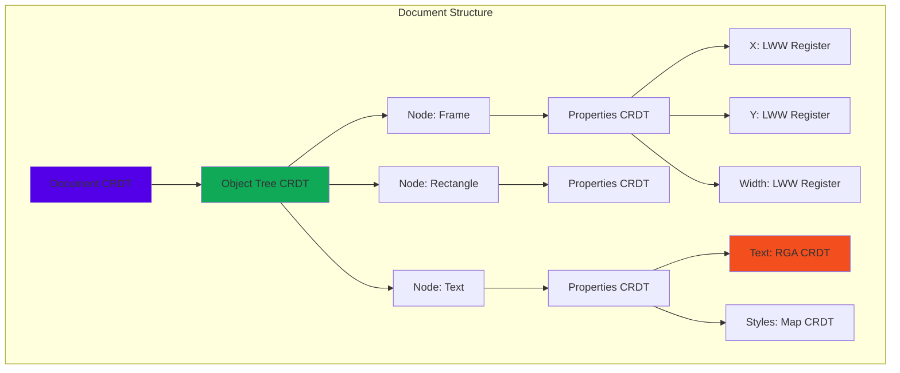
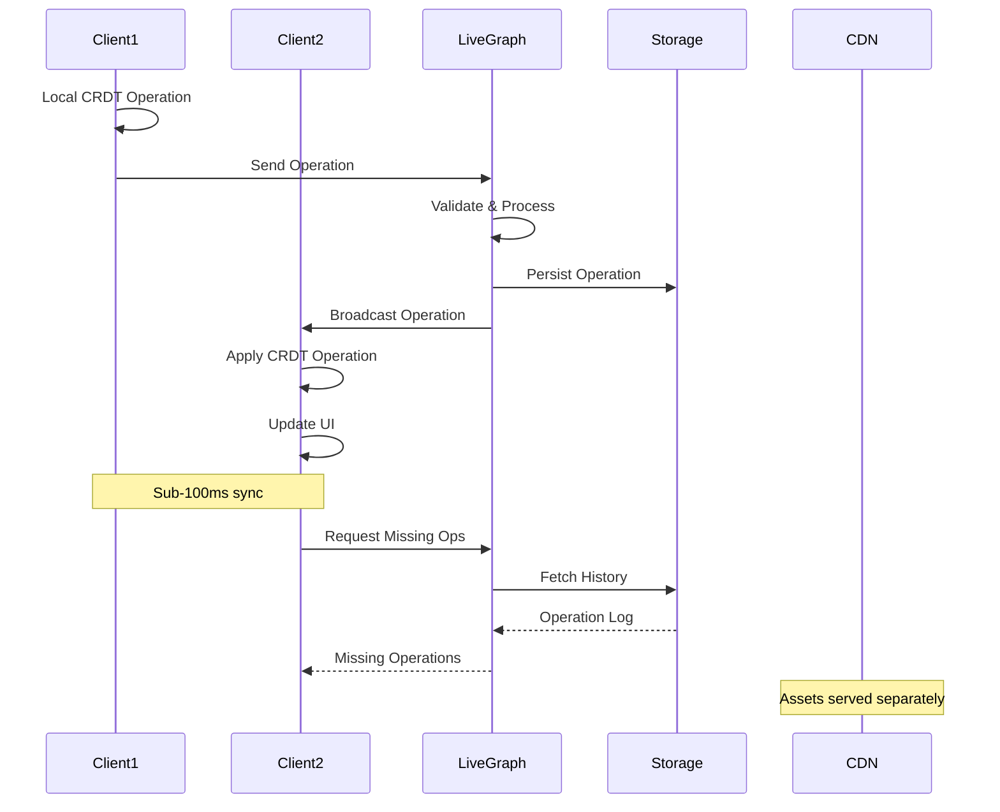
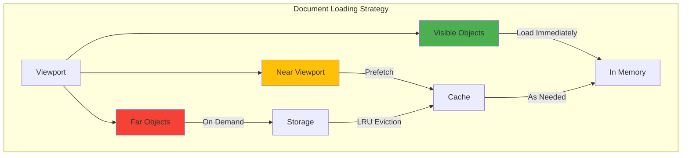
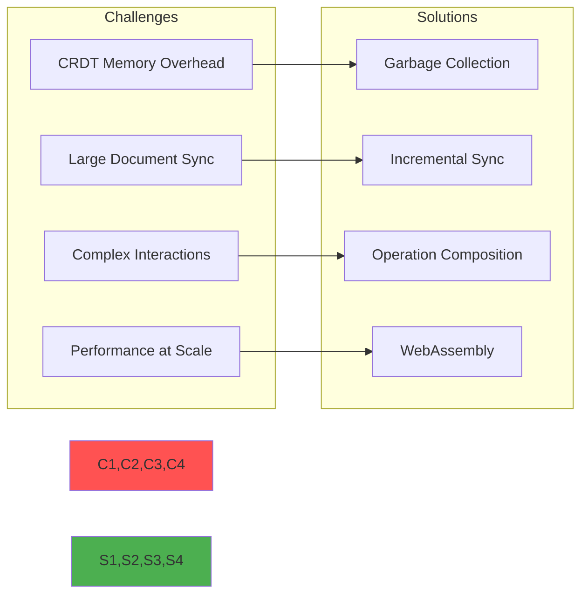
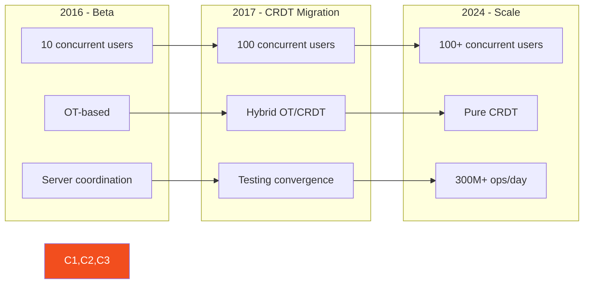

# Figma CRDT Collaboration Case Study

!!! abstract "Executive Summary"
    🎯 **Figma's CRDT-based architecture enables conflict-free real-time collaboration for millions of users, processing 300M+ operations/day with <100ms latency**

## At a Glance

| Metric | Value |
|--------|-------|
| **Concurrent Editors** | 100+ per document |
| **Operations/Day** | 300M+ |
| **Sync Latency** | <100ms (p95) |
| **Conflict Rate** | 0% (by design) |
| **Document Size** | Up to 1GB+ |
| **Active Users** | 4M+ designers |

## Problem Statement & Constraints

### The Challenge
- Enable real-time collaborative design editing
- Support complex design documents with millions of objects
- Maintain performance with 100+ concurrent editors
- Zero conflicts or lost work
- Work seamlessly offline and online

### Constraints
| Constraint | Requirement | Solution |
|------------|-------------|----------|
| **Concurrency** | 100+ simultaneous editors | CRDTs for conflict-free merging |
| **Latency** | <100ms for remote updates | WebSocket + efficient encoding |
| **Scale** | Documents with 1M+ objects | Lazy loading + virtualization |
| **Consistency** | Eventually consistent | CRDT convergence guarantees |
| **Offline** | Full offline capability | Local CRDT operations |

## Why CRDTs Beat Operational Transform

### Operational Transform (OT) Problems



### CRDT Advantages



## Architecture Deep Dive

### CRDT-Based Document Model



### Real-time Sync Architecture



## CRDT Implementation Details

### 1. Object Tree CRDT

```typescript
// Simplified Figma Object Tree CRDT
class ObjectTreeCRDT {
    private objects: Map<ObjectId, SceneNode>;
    private tombstones: Set<ObjectId>;
    private clock: LogicalClock;
    
    // Add object with unique ID and position
    addObject(parentId: ObjectId, object: SceneNode): Operation {
        const id = this.generateId();
        const timestamp = this.clock.tick();
        
        const op: AddOperation = {
            type: 'add',
            id,
            parentId,
            timestamp,
            object,
            position: this.getPosition(parentId)
        };
        
        this.apply(op);
        return op;
    }
    
    // Move preserves order across concurrent edits
    moveObject(objectId: ObjectId, newParentId: ObjectId, position: number): Operation {
        const timestamp = this.clock.tick();
        
        const op: MoveOperation = {
            type: 'move',
            objectId,
            newParentId,
            position,
            timestamp
        };
        
        this.apply(op);
        return op;
    }
    
    // Delete uses tombstones for consistency
    deleteObject(objectId: ObjectId): Operation {
        const timestamp = this.clock.tick();
        
        const op: DeleteOperation = {
            type: 'delete',
            objectId,
            timestamp
        };
        
        this.tombstones.add(objectId);
        return op;
    }
    
    // Merge concurrent operations
    merge(remote: Operation): void {
        switch (remote.type) {
            case 'add':
                this.mergeAdd(remote);
                break;
            case 'move':
                this.mergeMove(remote);
                break;
            case 'delete':
                this.mergeDelete(remote);
                break;
        }
    }
}
```

### 2. Property CRDTs

```typescript
// Last-Write-Wins Register for properties
class LWWRegister<T> {
    private value: T;
    private timestamp: Timestamp;
    private nodeId: string;
    
    set(newValue: T): Operation {
        const timestamp = getCurrentTimestamp();
        
        // Include node ID for tie-breaking
        if (timestamp > this.timestamp || 
            (timestamp === this.timestamp && nodeId > this.nodeId)) {
            this.value = newValue;
            this.timestamp = timestamp;
        }
        
        return {
            type: 'lww-set',
            value: newValue,
            timestamp,
            nodeId
        };
    }
    
    merge(remote: LWWOperation<T>): void {
        if (remote.timestamp > this.timestamp ||
            (remote.timestamp === this.timestamp && remote.nodeId > this.nodeId)) {
            this.value = remote.value;
            this.timestamp = remote.timestamp;
            this.nodeId = remote.nodeId;
        }
    }
}
```

### 3. Text CRDT (RGA - Replicated Growable Array)

```typescript
// Figma's text CRDT for rich text editing
class TextCRDT {
    private characters: Character[];
    private positions: Map<CharId, number>;
    
    insert(index: number, text: string, style: TextStyle): Operation[] {
        const ops: Operation[] = [];
        
        for (let i = 0; i < text.length; i++) {
            const charId = this.generateCharId();
            const leftId = this.getCharIdAt(index + i - 1);
            const rightId = this.getCharIdAt(index + i);
            
            ops.push({
                type: 'insert',
                charId,
                char: text[i],
                leftId,
                rightId,
                style,
                timestamp: this.clock.tick()
            });
        }
        
        return ops;
    }
    
    // Concurrent inserts at same position are ordered by ID
    mergeInsert(op: InsertOperation): void {
        const leftPos = this.positions.get(op.leftId) ?? -1;
        const rightPos = this.positions.get(op.rightId) ?? this.characters.length;
        
        // Find correct position between constraints
        let insertPos = leftPos + 1;
        
        // Order concurrent inserts by ID
        while (insertPos < rightPos) {
            const existing = this.characters[insertPos];
            if (existing.id > op.charId) break;
            insertPos++;
        }
        
        this.characters.splice(insertPos, 0, {
            id: op.charId,
            char: op.char,
            style: op.style
        });
        
        this.updatePositions();
    }
}
```

## Performance Optimizations

### 1. Lazy Loading & Virtualization



### 2. Operation Compression

| Technique | Description | Compression Ratio |
|-----------|-------------|-------------------|
| **Delta Encoding** | Send only changes | 10:1 |
| **Operation Batching** | Group related ops | 5:1 |
| **Binary Protocol** | Custom wire format | 3:1 |
| **Deduplication** | Remove redundant ops | 2:1 |
| **Combined** | All techniques | ~30:1 |

### 3. Efficient Sync Protocol

```python
# Efficient sync using vector clocks
class SyncProtocol:
    def sync_state(self, local_clock: VectorClock, remote_clock: VectorClock):
        # Find operations to send
        ops_to_send = []
        for node_id, local_time in local_clock.items():
            remote_time = remote_clock.get(node_id, 0)
            if local_time > remote_time:
                # Send ops from remote_time + 1 to local_time
                ops_to_send.extend(
                    self.get_ops_range(node_id, remote_time + 1, local_time)
                )
        
        # Find operations to receive
        ops_to_receive = []
        for node_id, remote_time in remote_clock.items():
            local_time = local_clock.get(node_id, 0)
            if remote_time > local_time:
                ops_to_receive.append((node_id, local_time + 1, remote_time))
        
        return ops_to_send, ops_to_receive
```

## Lessons Learned

### Architecture Decisions

| Decision | Rationale | Impact |
|----------|-----------|--------|
| **CRDTs over OT** | Simpler, works offline | Conflict-free collaboration |
| **Client-side CRDTs** | Reduce server load | Instant local updates |
| **Custom Binary Protocol** | Performance | 30x bandwidth reduction |
| **Lazy Loading** | Handle large docs | 1GB+ document support |
| **WebGL Rendering** | 60fps with many objects | Smooth performance |

### Challenges & Solutions



## Practical Takeaways

### For Collaborative Systems

1. **Choose the Right CRDT**
   ```typescript
   // Decision matrix
   const crdtSelection = {
       'last-write-wins': ['colors', 'positions', 'sizes'],
       'add-remove-set': ['layers', 'pages'],
       'rga/rgastring': ['text content'],
       'pn-counter': ['version numbers'],
       'or-set': ['component instances']
   };
   ```

2. **Design for Eventual Consistency**
   - Accept temporary inconsistency
   - Ensure convergence
   - Make conflicts impossible by design

3. **Optimize Aggressively**
   - Compress operations
   - Batch updates
   - Use binary protocols
   - Implement garbage collection

### Implementation Guidelines

| Guideline | Implementation | Benefit |
|-----------|----------------|---------|
| **Immutable Operations** | Never modify, only append | Time travel, undo/redo |
| **Logical Clocks** | Vector clocks or hybrid | Causal ordering |
| **Tombstones** | Mark deletes, GC later | Consistency |
| **Idempotent Ops** | Safe to apply multiple times | Network reliability |

## Related DStudio Patterns

| Pattern | Application | Link |
|---------|------------|------|
| **Event Sourcing** | Operation log | [/patterns/event-sourcing](/patterns/event-sourcing) |
| **CQRS** | Read/write separation | [/patterns/cqrs](/patterns/cqrs) |
| **Eventually Consistent** | CRDT convergence | [/patterns/eventual-consistency](/patterns/eventual-consistency) |
| **Vector Clocks** | Causality tracking | [/patterns/vector-clocks](/patterns/vector-clocks) |
| **Optimistic Locking** | Local-first updates | [/patterns/optimistic-locking](/patterns/optimistic-locking) |

## Scale Evolution



## References & Further Reading

- [Figma's Multiplayer Technology](https://www.figma.com/blog/how-figmas-multiplayer-technology-works/)
- [CRDTs: The Hard Parts](https://martin.kleppmann.com/2020/07/06/crdt-hard-parts-hydra.html)
- [A Comprehensive Study of CRDTs](https://hal.inria.fr/inria-00555588/document)
- [Figma's Engineering Blog](https://www.figma.com/blog/engineering)
- [Real-time Collaboration in Figma](https://www.figma.com/blog/real-time-collaboration-for-design-teams/)

---

**Key Insight**: Figma's success demonstrates that CRDTs, despite their complexity, enable a fundamentally better collaboration experience than traditional approaches. By investing in the right data structures and optimizations, they created a platform where conflicts are impossible rather than resolved.