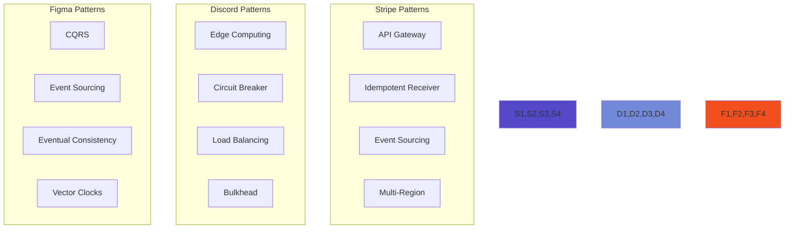

# Elite Engineering Case Studies

!!! abstract "Learn from the Best"
    Deep technical analysis of how elite engineering teams solve distributed systems challenges at massive scale. Each case study provides actionable insights you can apply to your own systems.

## Featured Case Studies

<div class="grid cards">

- :fontawesome-brands-stripe: **[Stripe API Excellence](/case-studies/elite-engineering/stripe-api-excellence/)**

    ---
    
    10+ years of backward compatibility supporting 500B+ API calls/year through version pinning and idempotency as first-class citizens
    
    **Key Insights**: Version per API key • Idempotency by default • Never break compatibility

- :fontawesome-brands-discord: **[Discord Voice Infrastructure](/case-studies/elite-engineering/discord-voice-infrastructure/)**

    ---
    
    Scaling WebRTC from 10 to 150M+ users with 5M concurrent voice users through custom infrastructure
    
    **Key Insights**: Custom WebRTC • Global edge network • Intelligent routing

- :fontawesome-brands-figma: **[Figma CRDT Collaboration](/case-studies/elite-engineering/figma-crdt-collaboration/)**

    ---
    
    Conflict-free real-time collaboration using CRDTs, handling 300M+ operations/day with zero conflicts
    
    **Key Insights**: CRDTs over OT • Local-first architecture • Eventual consistency

</div>

## Quick Comparison

| System | Scale | Key Innovation | Primary Pattern |
|--------|-------|----------------|-----------------|
| **Stripe** | 500B API calls/year | Version pinning per key | [API Gateway](/patterns/api-gateway) |
| **Discord** | 5M concurrent voice | Custom WebRTC at scale | [Edge Computing](/patterns/edge-computing) |
| **Figma** | 100+ concurrent editors | CRDT-based collaboration | [Event Sourcing](/patterns/event-sourcing) |

## Architecture Patterns Matrix



## Common Success Factors

### 1. Physics-First Design
All three systems acknowledge and design around fundamental constraints:
- **Stripe**: Network latency for global payments
- **Discord**: Speed of light for voice communication  
- **Figma**: CAP theorem for distributed collaboration

### 2. Custom Infrastructure
Standard solutions didn't meet their needs:
- **Stripe**: Built custom API versioning system
- **Discord**: Replaced standard WebRTC
- **Figma**: Chose CRDTs over Operational Transform

### 3. Incremental Migration
Large-scale changes made safely:
- **Stripe**: Gradual version adoption
- **Discord**: Regional rollouts
- **Figma**: OT → Hybrid → Pure CRDT

## Lessons for Your Systems

### API Design (from Stripe)
```yaml
Best Practices:
  - Version from day one
  - Make idempotency default
  - Design for addition, not modification
  - Test every version in production
```

### Real-time Systems (from Discord)
```yaml
Best Practices:
  - Account for physics constraints
  - Build adaptive quality systems
  - Design transparent failover
  - Monitor at millisecond granularity
```

### Collaborative Systems (from Figma)
```yaml
Best Practices:
  - Make conflicts impossible, not resolved
  - Optimize for eventual consistency
  - Choose appropriate CRDT types
  - Design for offline-first
```

## Study Guide

### For Architects
1. Compare versioning strategies across all three systems
2. Analyze how each handles failure scenarios
3. Identify patterns that apply to your domain

### For Engineers
1. Study the code examples in each case study
2. Implement a simplified version of one pattern
3. Measure the performance implications

### For Leaders
1. Note the incremental migration strategies
2. Understand the business impact of technical decisions
3. Consider the engineering culture implications

## Related Resources

- [Distributed Systems Patterns](/patterns/)
- [Quantitative Analysis](/quantitative/)
- [Human Factors](/human-factors/)
- [System Design Interview Prep](/case-studies/)

---

!!! tip "How to Use These Case Studies"
    1. **Start with the problem** - Understand the constraints
    2. **Study the evolution** - Learn from their journey
    3. **Extract the patterns** - Identify reusable approaches
    4. **Apply selectively** - Adapt to your context