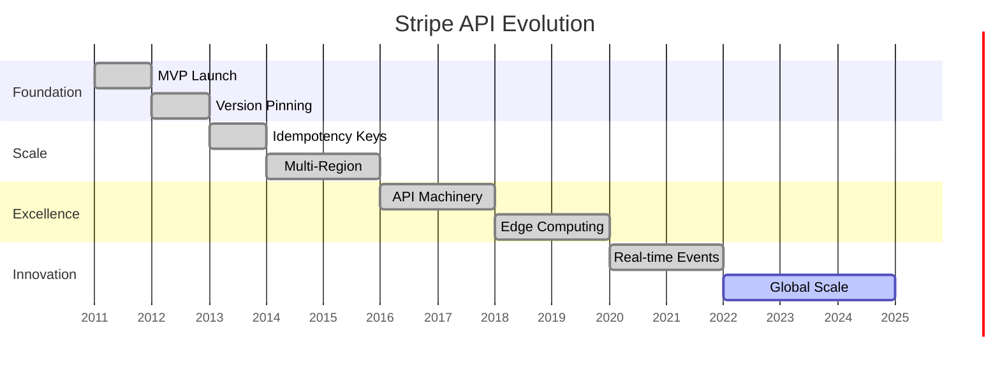
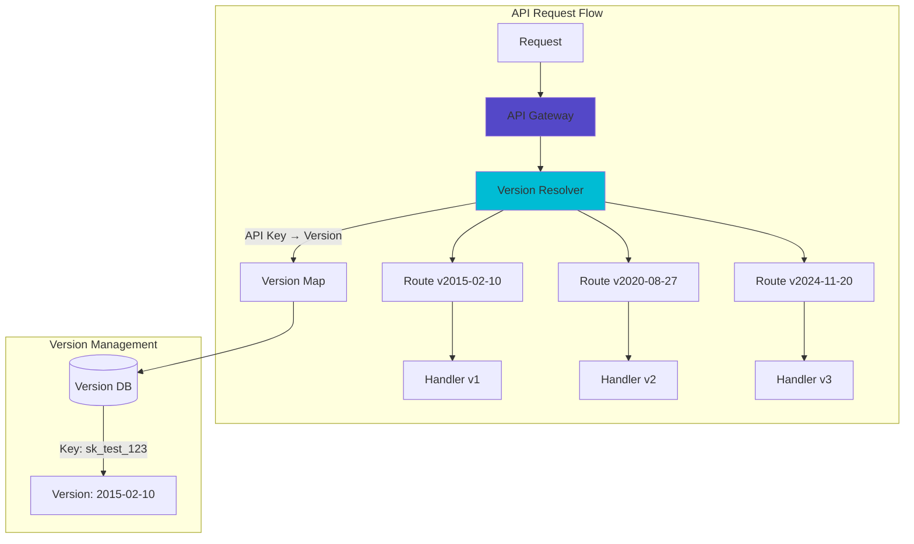
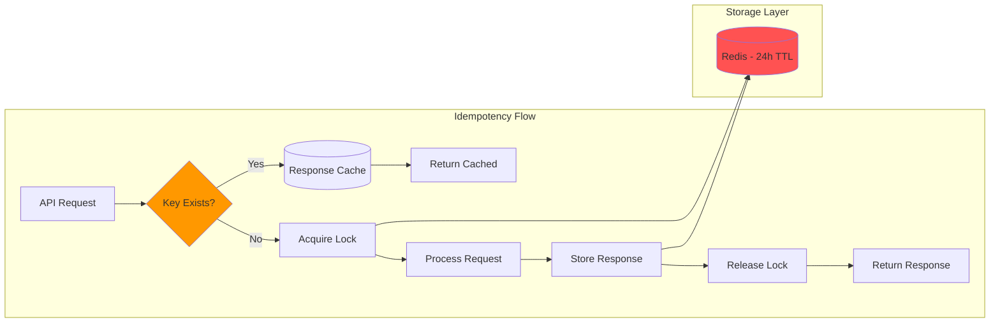
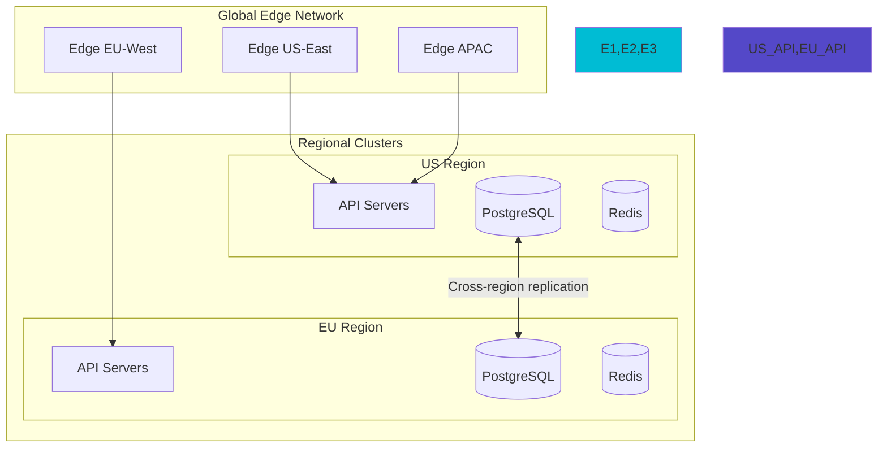
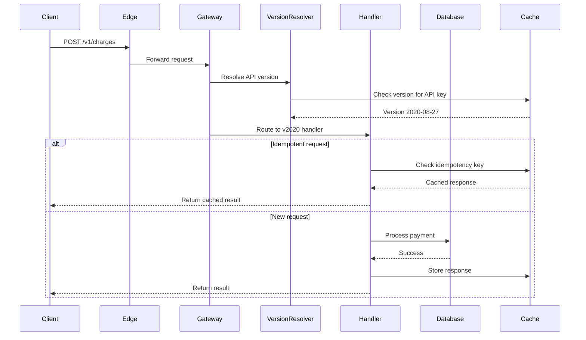
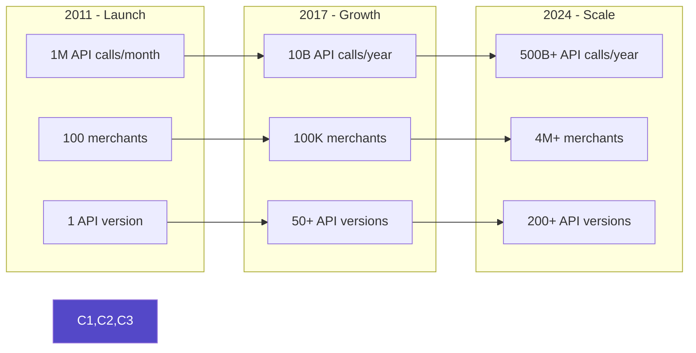

# Stripe API Excellence Case Study

!!! abstract "Executive Summary"
    🎯 **Stripe's API design philosophy: Version pinning per API key, idempotency as first-class citizen, and 10+ years of backward compatibility supporting 500B+ API calls annually**

## At a Glance

| Metric | Value |
|--------|-------|
| **API Calls/Year** | 500B+ (2024) |
| **Backward Compatibility** | 10+ years |
| **API Versions** | 200+ active |
| **Idempotency Window** | 24 hours |
| **99.99% Uptime** | Since 2011 |

## Problem Statement & Constraints

### The Challenge
- Support millions of businesses processing payments
- Maintain compatibility for decade-old integrations
- Enable rapid feature development
- Handle 500B+ API calls annually
- Zero downtime deployments

### Constraints
| Constraint | Requirement | Solution |
|------------|-------------|----------|
| **Compatibility** | Never break existing integrations | Version pinning per API key |
| **Scale** | 500B+ calls/year | Horizontal scaling + edge caching |
| **Reliability** | 99.99% uptime | Multi-region active-active |
| **Security** | PCI compliance | End-to-end encryption |
| **Developer Experience** | Simple integration | Idempotency + clear errors |

## Architecture Evolution

### Timeline



### Version Pinning Architecture



### Idempotency Implementation



## Key Patterns Used

### 1. Version Pinning Per API Key

```python
# Stripe's Version Resolution (Conceptual)
class APIVersionResolver:
    def resolve_version(self, api_key: str) -> str:
        # Each API key has its own version
        account = self.get_account(api_key)
        
        # Check explicit version header first
        if request.headers.get('Stripe-Version'):
            return request.headers['Stripe-Version']
        
        # Fall back to account's pinned version
        return account.pinned_api_version or DEFAULT_VERSION
    
    def route_request(self, version: str, endpoint: str):
        # Route to version-specific handler
        handler = self.version_handlers[version][endpoint]
        return handler.process()
```

### 2. Idempotency as First-Class Citizen

```python
# Idempotency Implementation
class IdempotencyManager:
    def process_request(self, idempotency_key: str, request):
        # Check cache first
        cached = self.redis.get(f"idem:{idempotency_key}")
        if cached:
            return json.loads(cached)
        
        # Acquire distributed lock
        with self.distributed_lock(idempotency_key):
            # Double-check after lock
            cached = self.redis.get(f"idem:{idempotency_key}")
            if cached:
                return json.loads(cached)
            
            # Process request
            response = self.process(request)
            
            # Cache for 24 hours
            self.redis.setex(
                f"idem:{idempotency_key}",
                86400,  # 24 hours
                json.dumps(response)
            )
            
            return response
```

### 3. Backward Compatibility Strategy

| Strategy | Implementation | Example |
|----------|----------------|---------|
| **Additive Changes** | Only add, never remove fields | New `payment_method` alongside old `card` |
| **Graceful Degradation** | Old versions get safe defaults | New features return `null` for old versions |
| **Transformation Layer** | Convert between versions | Transform responses for older API versions |
| **Deprecation Warnings** | Warn but don't break | Headers indicate deprecated features |

## Architecture Deep Dive

### Multi-Region Architecture



### Request Processing Pipeline



## Lessons Learned

### What Works

| Practice | Why It Works | Impact |
|----------|--------------|--------|
| **Version per API Key** | Customers control upgrade timing | Zero forced migrations |
| **Idempotency Keys** | Safe retries | Eliminates duplicate charges |
| **Explicit Versioning** | Clear compatibility guarantees | 10+ year old code still works |
| **Comprehensive Testing** | Every version tested | 99.99% reliability |
| **Clear Error Messages** | Developers fix issues faster | Reduced support load |

### What to Avoid

| Anti-Pattern | Why It Fails | Alternative |
|--------------|--------------|-------------|
| **Global Version Bumps** | Forces all users to migrate | Per-account versioning |
| **Breaking Changes** | Destroys trust | Additive changes only |
| **Implicit Behavior** | Causes confusion | Explicit parameters |
| **Complex Versioning** | Hard to maintain | Simple date-based versions |

## Practical Takeaways

### For API Designers

1. **Version from Day One**
   ```yaml
   # API Version Format
   stripe-version: 2024-11-20  # YYYY-MM-DD
   ```

2. **Make Idempotency Standard**
   ```bash
   curl https://api.stripe.com/v1/charges \
     -H "Idempotency-Key: unique-request-id" \
     -d amount=2000
   ```

3. **Design for Addition**
   ```json
   // Old response
   {
     "id": "ch_123",
     "amount": 2000,
     "currency": "usd"
   }
   
   // New response (backward compatible)
   {
     "id": "ch_123",
     "amount": 2000,
     "currency": "usd",
     "payment_method": {...}  // New field
   }
   ```

### For Platform Teams

| Recommendation | Implementation | Benefit |
|----------------|----------------|---------|
| **Version Pinning** | Store version per customer | Controlled migrations |
| **Response Transformation** | Transform for old versions | Maintain compatibility |
| **Deprecation Process** | Warn → Sunset → Remove | Graceful transitions |
| **Version Testing** | Test matrix of versions | Catch regressions |

## Related DStudio Patterns

| Pattern | Application | Link |
|---------|------------|------|
| **API Gateway** | Version routing | [/patterns/api-gateway](/patterns/api-gateway) |
| **Idempotent Receiver** | Request deduplication | [/patterns/idempotent-receiver](/patterns/idempotent-receiver) |
| **Backward Compatibility** | Version management | [/patterns/backward-compatibility](/patterns/backward-compatibility) |
| **Circuit Breaker** | Failure handling | [/patterns/circuit-breaker](/patterns/circuit-breaker) |
| **Event Sourcing** | Audit trail | [/patterns/event-sourcing](/patterns/event-sourcing) |

## Scale Metrics



## References & Further Reading

- [Stripe API Versioning](https://stripe.com/docs/api/versioning)
- [Idempotent Requests](https://stripe.com/docs/api/idempotent_requests)
- [Stripe Engineering Blog](https://stripe.com/blog/engineering)
- [API Design at Stripe](https://stripe.com/blog/api-versioning)
- [Scaling to 500B API Calls](https://stripe.com/blog/api-traffic-patterns)

---

**Key Insight**: Stripe's success comes from treating API design as a product feature, not just a technical implementation. Version pinning per API key and idempotency as defaults create a foundation for decade-long compatibility while enabling rapid innovation.