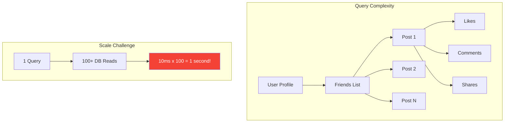
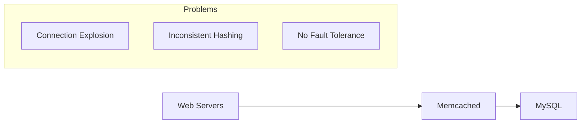
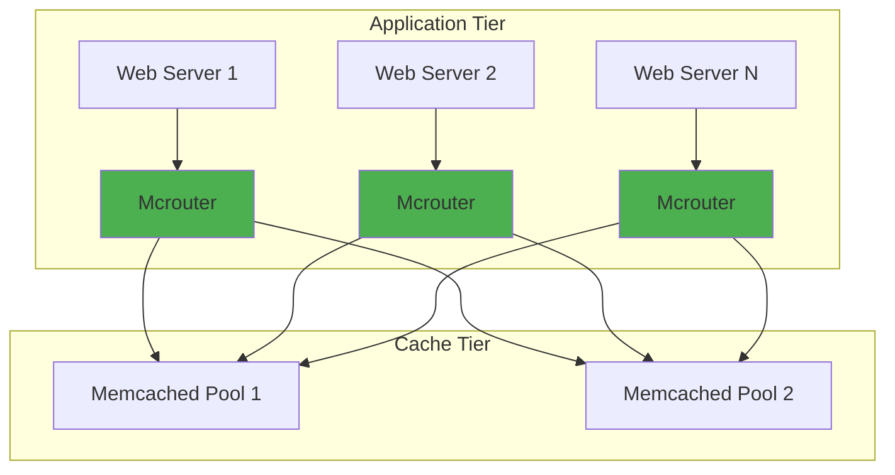
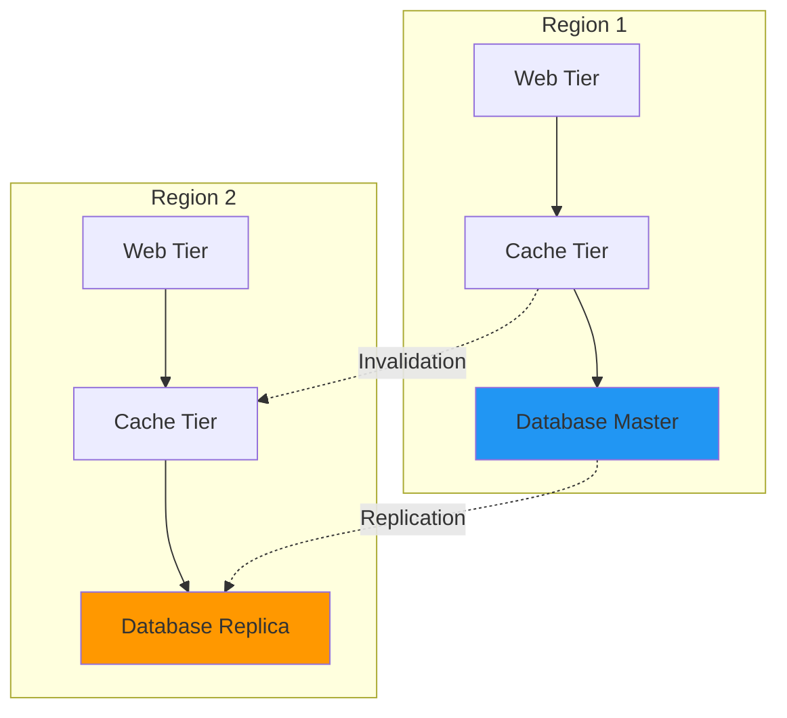
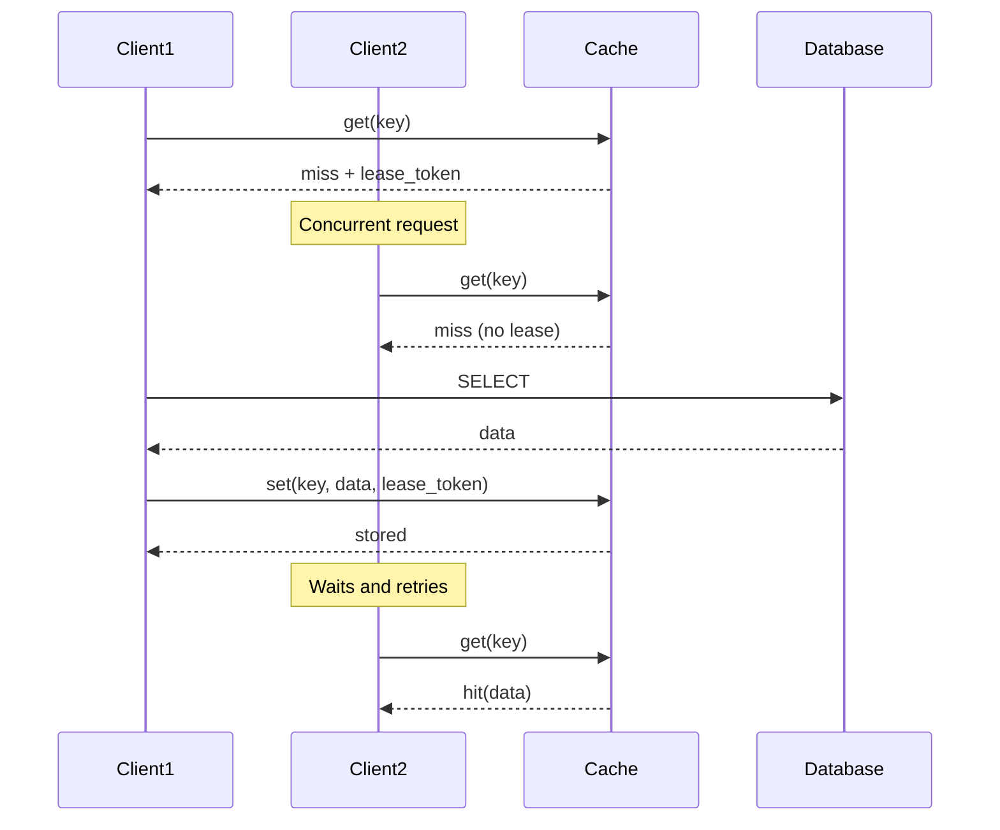
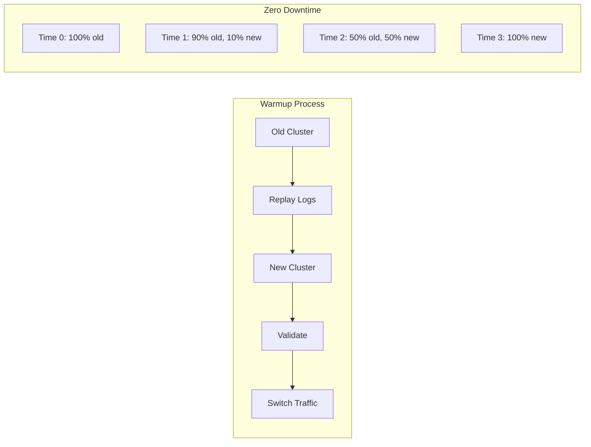
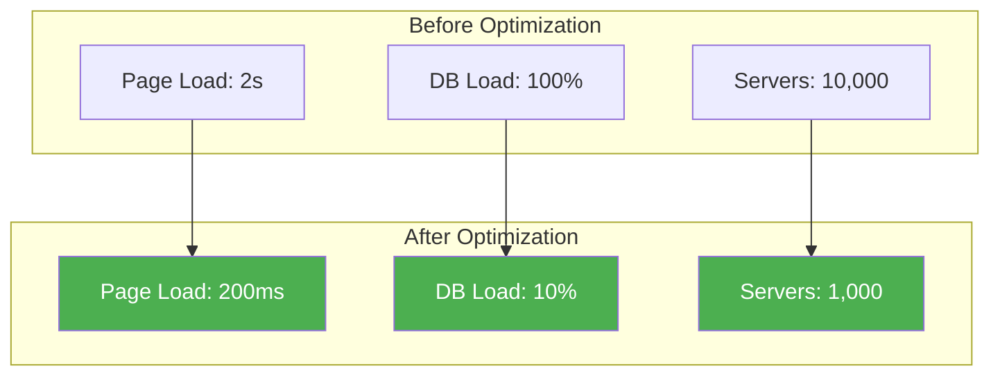

# Facebook's Memcached: Scaling Social Graph Queries

!!! success "Excellence Badge"
    🥇 **Gold Tier**: Battle-tested at internet scale with proven reliability

!!! abstract "Quick Facts"
    | Metric | Value |
    |--------|-------|
    | **Scale** | 1B+ requests/second |
    | **Cache Size** | 10TB+ in memory |
    | **Hit Rate** | 99.7% average |
    | **Servers** | 10,000+ globally |
    | **Latency** | <1ms at p99 |

## Executive Summary

Facebook transformed Memcached from a simple key-value cache into a distributed caching layer handling billions of social graph queries. Through innovations like mcrouter, lease-based invalidation, and multi-tier architecture, they achieved 99.7% cache hit rates while serving over 1 billion requests per second. This case study reveals how to build planet-scale caching infrastructure.

## The Challenge

### Social Graph Complexity



### Requirements

| Requirement | Target | Challenge |
|-------------|--------|------------|
| **Latency** | <200ms page load | Complex graph traversals |
| **Scale** | 1B+ active users | Exponential connection growth |
| **Consistency** | Read-after-write | Distributed cache invalidation |
| **Availability** | 99.99% uptime | Cache layer can't be SPOF |

## Architecture Evolution

### Phase 1: Simple Cache (2008)



### Phase 2: Mcrouter Introduction (2010)



### Phase 3: Multi-Region Architecture (2013+)



## Technical Deep Dive

### Mcrouter: The Secret Sauce

=== "Connection Pooling"
    ```cpp
    class Mcrouter {
        // Instead of N*M connections, just N+M
        ConnectionPool pool;
        
        void route(Request req) {
            // Consistent hashing to find server
            auto server = hash(req.key) % servers.size();
            
            // Reuse persistent connection
            auto conn = pool.get(server);
            conn->send(req);
        }
    };
    ```

=== "Request Batching"
    ```python
    class RequestBatcher:
        def multi_get(self, keys):
            # Group keys by destination server
            server_batches = defaultdict(list)
            for key in keys:
                server = self.consistent_hash(key)
                server_batches[server].append(key)
            
            # Parallel fetch from all servers
            results = {}
            with ThreadPool() as pool:
                futures = [
                    pool.submit(self.fetch_batch, server, batch)
                    for server, batch in server_batches.items()
                ]
                
            return self.merge_results(futures)
    ```

=== "Failure Handling"
    ```python
    class FailureHandler:
        def get_with_fallback(self, key):
            primary = self.get_primary_pool(key)
            
            try:
                return primary.get(key)
            except PoolDown:
                # Automatic failover to Gutter pool
                gutter = self.get_gutter_pool()
                return gutter.get(key)
    ```

### Lease-Based Invalidation



### Cache Hierarchy

| Layer | Purpose | Size | Latency | Hit Rate |
|-------|---------|------|---------|----------|
| **L1: Local** | Hot data | 1GB | 0.1ms | 20% |
| **L2: Regional** | Warm data | 1TB | 1ms | 75% |
| **L3: Cold Storage** | Long tail | 10TB | 10ms | 99.7% |

## Performance Optimizations

### 1. Adaptive TTL

```python
class AdaptiveTTL:
    def calculate_ttl(self, key, access_pattern):
        base_ttl = 3600  # 1 hour
        
        # Hot keys get shorter TTL for freshness
        if access_pattern.qps > 1000:
            return base_ttl // 4
        
        # Cold keys get longer TTL to reduce DB load
        if access_pattern.qps < 10:
            return base_ttl * 4
        
        return base_ttl
```

### 2. Request Coalescing

```python
class RequestCoalescer:
    def __init__(self):
        self.pending = {}  # key -> Future
    
    async def get(self, key):
        # If request in flight, wait for it
        if key in self.pending:
            return await self.pending[key]
        
        # Otherwise, initiate request
        future = asyncio.Future()
        self.pending[key] = future
        
        try:
            value = await self.fetch(key)
            future.set_result(value)
            return value
        finally:
            del self.pending[key]
```

### 3. Cold Cluster Warmup



## Operational Excellence

### Monitoring Dashboard

| Metric | Alert Threshold | Action |
|--------|-----------------|--------|
| **Hit Rate** | <95% | Investigate misses |
| **Latency p99** | >5ms | Check hot keys |
| **Eviction Rate** | >1% | Add capacity |
| **Connection Count** | >10K | Scale mcrouter |
| **Error Rate** | >0.1% | Page on-call |

### Capacity Planning

```python
# Memory sizing formula
def calculate_memory_needed(dataset_size, replication_factor, hit_rate_target):
    # Working set size
    working_set = dataset_size * 0.2  # 80/20 rule
    
    # Cache size for target hit rate
    cache_size = working_set * hit_rate_target
    
    # Total with replication
    total_memory = cache_size * replication_factor
    
    # Add 20% headroom
    return total_memory * 1.2
```

## Lessons Learned

### Do's and Don'ts

✅ **Do**
- Use consistent hashing for stable key distribution
- Implement request coalescing for popular keys
- Monitor cache hit rates per key pattern
- Plan for cache failures with circuit breakers
- Warm up new cache clusters before switching

❌ **Don't**
- Assume cache is always available
- Store large objects (>1MB) in cache
- Use cache as primary data store
- Ignore cache invalidation complexity
- Forget about cold start scenarios

### Production Insights

!!! tip "Key Insights"
    1. **Connection pooling is critical** - Without mcrouter, you'd need N*M connections
    2. **Lease tokens prevent thundering herds** - Essential for high-traffic keys
    3. **Multi-tier caching provides resilience** - L1 failures don't kill the site
    4. **Monitoring drives optimization** - Can't improve what you don't measure

## Impact and Results

### Performance Gains



### Cost Savings

| Category | Before | After | Savings |
|----------|--------|-------|---------|]
| **Database Servers** | 10,000 | 1,000 | 90% |
| **Power Usage** | 10MW | 2MW | 80% |
| **Operations Team** | 50 people | 10 people | 80% |
| **Annual Cost** | $50M | $10M | $40M |

## Applying These Lessons

### For Your Architecture

1. **Start Simple**
   - Basic key-value cache
   - Monitor hit rates
   - Add complexity as needed

2. **Scale Horizontally**
   - Consistent hashing from day 1
   - Plan for 10x growth
   - Automate operations

3. **Handle Failures Gracefully**
   - Cache is optimization, not storage
   - Design for cache misses
   - Implement circuit breakers

### Implementation Checklist

- [ ] Implement consistent hashing
- [ ] Add connection pooling
- [ ] Set up monitoring dashboard
- [ ] Create runbooks for common issues
- [ ] Test cold start scenarios
- [ ] Plan capacity for peak + 50%
- [ ] Implement request coalescing
- [ ] Add circuit breakers
- [ ] Set up automated warming

## Related Resources

- [Distributed Cache Pattern](../patterns/distributed-cache.md)
- [Consistent Hashing Pattern](../patterns/consistent-hashing.md)
- [Circuit Breaker Pattern](../patterns/circuit-breaker.md)
- [Scaling Memcached at Facebook](https://www.usenix.org/system/files/conference/nsdi13/nsdi13-final170_update.pdf)

---

*"Cache all the things, but prepare for when they're not cached." - Facebook Engineering*