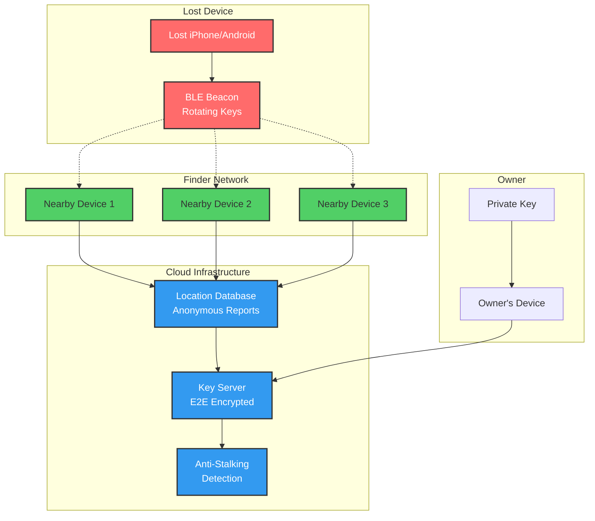

# Find My Device Case Study

> 🚧 This case study is planned for future development.

## Overview
This case study would examine the distributed architecture behind Apple's Find My network and Google's Find My Device, including privacy-preserving location reporting and crowd-sourced device finding. These systems demonstrate how to build a global-scale tracking network while maintaining user privacy through cryptographic techniques.

## System Architecture



## Key Technical Challenges

### 1. Privacy-Preserving Architecture
```
┌─────────────────┐     ┌─────────────────┐     ┌─────────────────┐
│   Lost Device   │     │  Finder Device  │     │     Server      │
├─────────────────┤     ├─────────────────┤     ├─────────────────┤
│ • Generates     │────▶│ • Detects BLE   │────▶│ • Cannot decrypt│
│   rotating keys │     │ • Encrypts loc  │     │ • Stores blobs  │
│ • BLE broadcast │     │ • Anonymous     │     │ • No user link  │
└─────────────────┘     └─────────────────┘     └─────────────────┘
         │                                               │
         │          Only owner can decrypt               │
         └───────────────────────────────────────────────┘
```

### 2. Crowd-Sourced Network Scale
- **1 billion+ devices**: Global finder network
- **BLE range**: ~30-50 meters coverage
- **Urban density**: High probability of detection
- **Rural challenges**: Sparse network coverage

### 3. Battery Efficiency
<div class="responsive-table" markdown>

| Component | Power Strategy | Impact |
|-----------|---------------|---------|
| BLE Advertising | Duty cycling | <1% daily battery |
| Scanning | Opportunistic | Piggyback on other BLE |
| Reporting | Batched uploads | Reduce radio usage |
| Encryption | Hardware acceleration | Minimal CPU impact |

</div>


### 4. Anti-Stalking Measures
- **Unknown tracker alerts**: Notify if unfamiliar device travels with you
- **Sound alerts**: Trackers play sounds when separated from owner
- **NFC tap**: Identify found tracker owner (law enforcement)
- **Rotation timing**: Balance privacy vs anti-stalking detection

## Related Case Studies
- [Nearby Friends](./nearby-friends.md) - Location sharing patterns
- [Apple Maps](./apple-maps.md) - Apple's privacy architecture
- E2E Encryption (Coming Soon) - Encryption patterns

## External Resources
- [Apple Find My Network](https://support.apple.com/guide/security/find-my-network-security-sec973b83216/)
- [Google Find My Device](https://blog.google/products/android/find-my-device-network/)
- [Privacy in Location Services](https://www.apple.com/privacy/docs/Location_Services_White_Paper_Nov_2019.pdf)