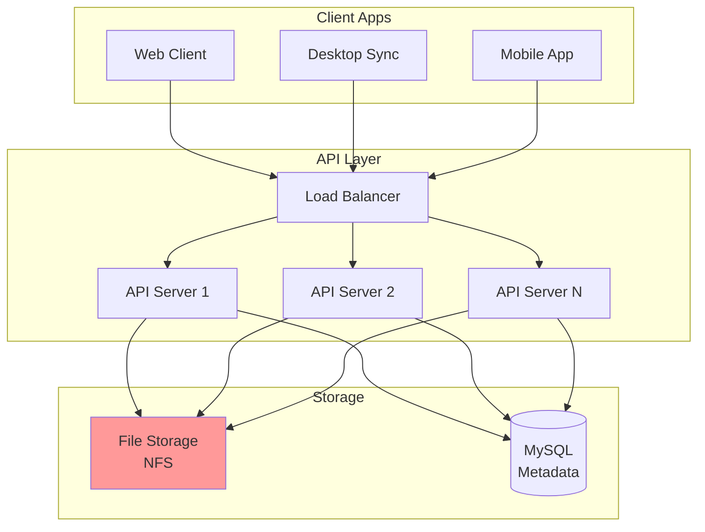
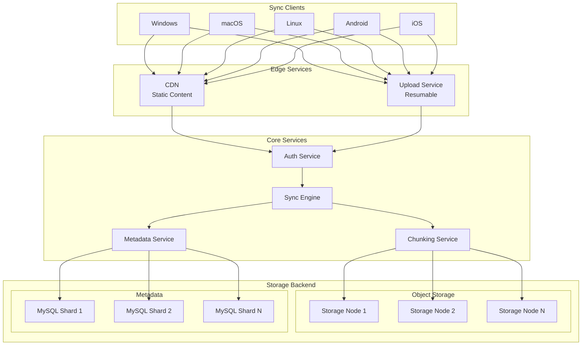
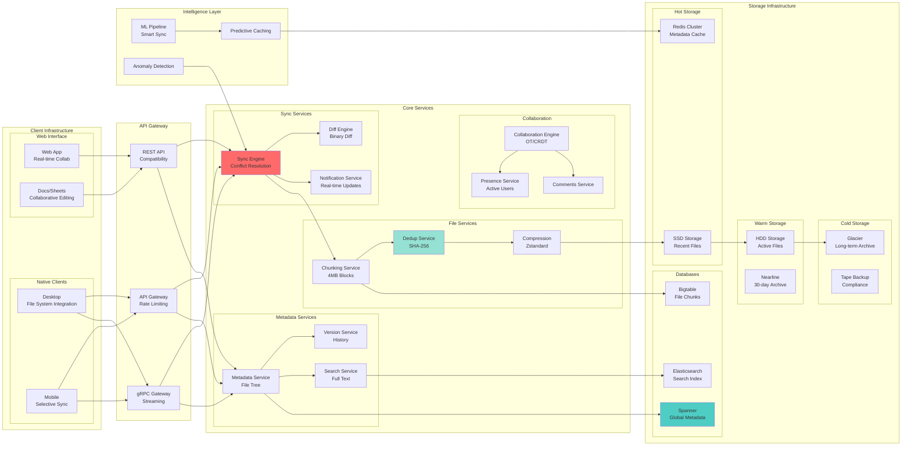
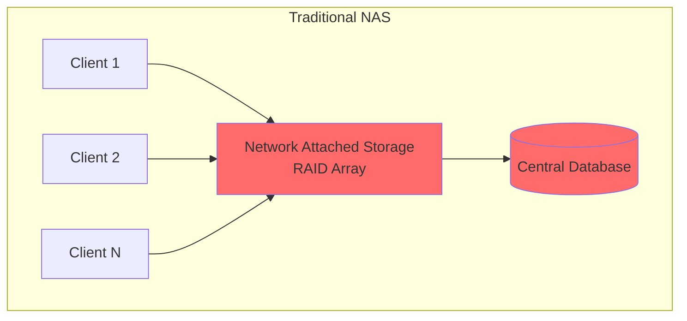
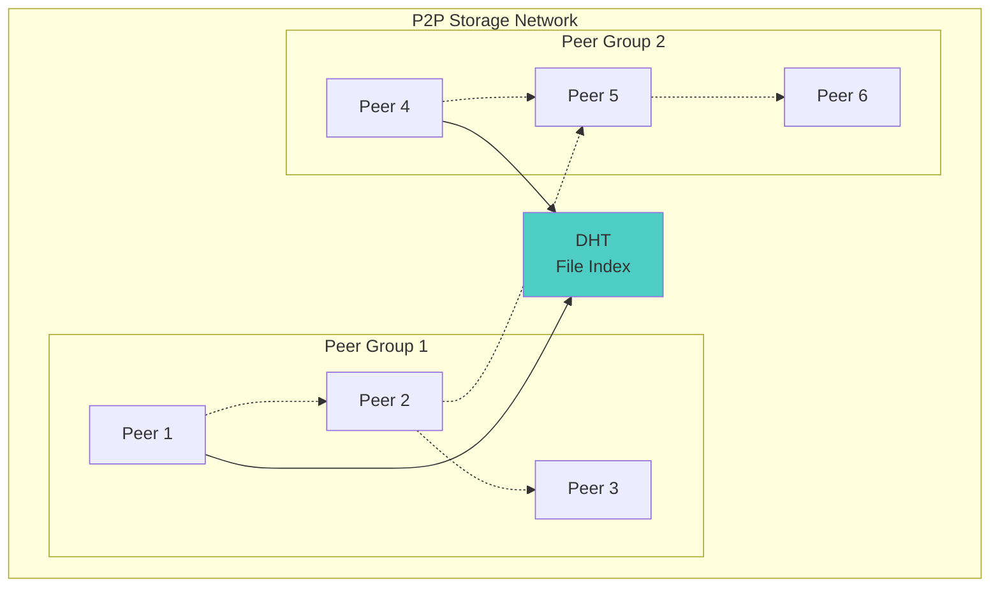
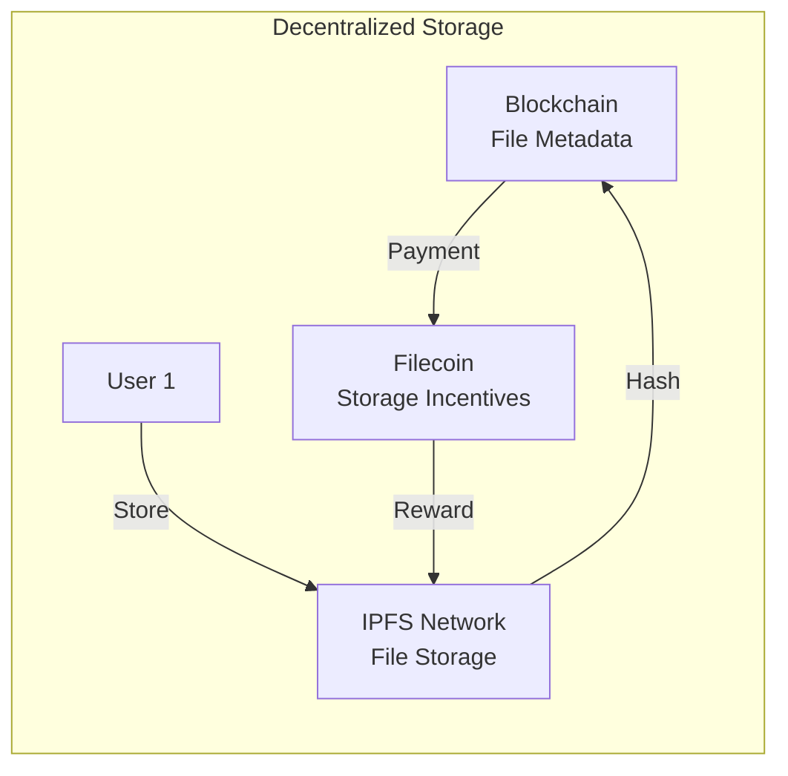
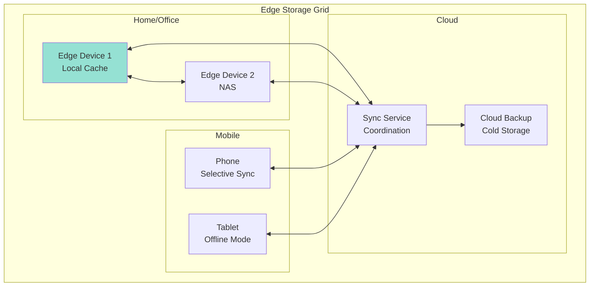
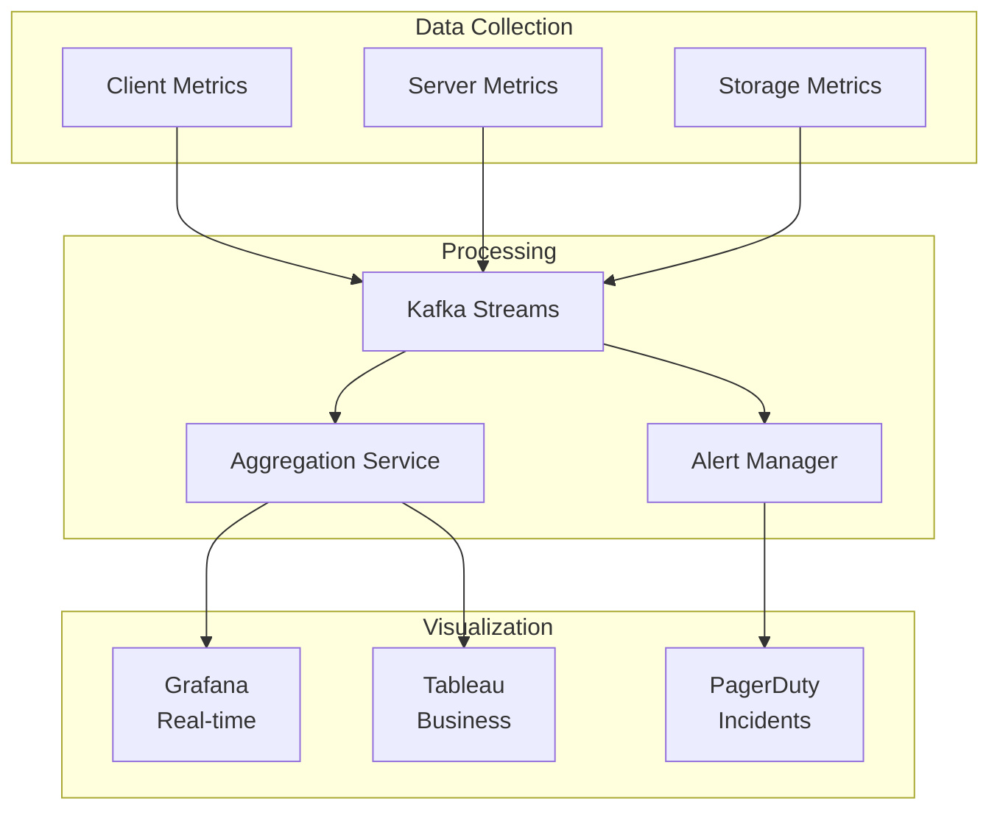

<!-- Navigation -->
[Home](../index.md) → [Case Studies](index.md) → **Google Drive Cloud Storage Architecture**

# ☁️ Google Drive Cloud Storage Architecture

**The Challenge**: Build a cloud storage system managing exabytes of data with seamless sync across devices

!!! info "Case Study Sources"
    This analysis is based on:
    - Google Cloud Blog: "Building Google Drive"¹
    - Dropbox Tech Blog: "Scaling to Exabytes"²
    - Box Engineering: "File Sync Architecture"³
    - OneDrive Architecture Overview⁴
    - USENIX Paper: "The Design of a Practical System for Fault-Tolerant Virtual Machines"⁵

---

## 🏗️ Architecture Evolution

### Phase 1: Simple Upload/Download Service (2006-2008)

```text
Web Browser → Web Server → File System → Database
```

**Problems Encountered:**
- No real-time sync
- Full file transfers only
- Single point of failure
- No versioning support

**Patterns Violated**: 
- ❌ No [Deduplication](../patterns/deduplication.md)
- ❌ No [Delta Sync](../patterns/delta-sync.md)
- ❌ No [Distributed Storage](../patterns/distributed-storage.md)

### Phase 2: Basic Sync Architecture (2008-2010)



**Key Design Decision: Metadata/Data Separation**
- **Trade-off**: Complexity vs Scalability (Pillar: [State Distribution](../part2-pillars/state/index.md))
- **Choice**: Store metadata in DB, files in object storage
- **Result**: Independent scaling of metadata and storage
- **Pattern Applied**: [Metadata Service](../patterns/metadata-service.md)

According to early reports¹, this enabled handling 10x more files with same database resources.

### Phase 3: Distributed Architecture (2010-2014)



**Innovation: Content-Addressed Storage**²
- Files identified by content hash
- Automatic deduplication
- Efficient delta sync
- Immutable storage simplifies replication

**Patterns & Pillars Applied**:
- 🔧 Pattern: [Content-Addressed Storage](../patterns/cas.md) - Deduplication
- 🔧 Pattern: [Chunking](../patterns/chunking.md) - Large file handling
- 🏛️ Pillar: [State Distribution](../part2-pillars/state/index.md) - Sharded metadata
- 🏛️ Pillar: [Work Distribution](../part2-pillars/work/index.md) - Parallel uploads

### Phase 4: Modern Cloud-Native Architecture (2014-Present)



**Current Scale**:
- 2B+ users
- 1 trillion+ files
- Exabytes of storage
- 99.99% availability

## 📊 Core Components Deep Dive

### 1. File Chunking & Deduplication

```python
class FileChunkingService:
    """Intelligent file chunking with deduplication"""
    
    def __init__(self):
        self.chunk_size = 4 * 1024 * 1024  # 4MB default
        self.min_chunk_size = 1 * 1024 * 1024  # 1MB
        self.max_chunk_size = 8 * 1024 * 1024  # 8MB
        self.rolling_hash_window = 48  # bytes
        
    async def chunk_file(self, file_path: str) -> List[ChunkInfo]:
        """Variable-size content-defined chunking"""
        chunks = []
        
        with open(file_path, 'rb') as f:
            buffer = bytearray()
            rolling_hash = RollingHash(self.rolling_hash_window)
            position = 0
            
            while True:
                byte = f.read(1)
                if not byte:
                    break
                    
                buffer.append(byte[0])
                rolling_hash.update(byte[0])
                position += 1
                
                # Check for chunk boundary
                if (len(buffer) >= self.min_chunk_size and 
                    self._is_chunk_boundary(rolling_hash.hash_value)):
                    
                    # Create chunk
                    chunk = self._create_chunk(buffer, position - len(buffer))
                    chunks.append(chunk)
                    
                    # Reset for next chunk
                    buffer = bytearray()
                    rolling_hash.reset()
                    
                elif len(buffer) >= self.max_chunk_size:
                    # Force chunk at max size
                    chunk = self._create_chunk(buffer, position - len(buffer))
                    chunks.append(chunk)
                    buffer = bytearray()
                    rolling_hash.reset()
            
            # Handle final chunk
            if buffer:
                chunk = self._create_chunk(buffer, position - len(buffer))
                chunks.append(chunk)
                
        return chunks
    
    def _is_chunk_boundary(self, hash_value: int) -> bool:
        """Determine chunk boundary using hash"""
        # Use last N bits to determine boundary
        # This gives average chunk size of 4MB
        return (hash_value & 0x3FFFFF) == 0

class DeduplicationService:
    """Global deduplication across all users"""
    
    def __init__(self):
        self.chunk_index = {}  # hash -> storage_location
        self.reference_count = {}  # hash -> count
        self.storage_backend = ObjectStorage()
        
    async def store_chunk(self, chunk_data: bytes, 
                         chunk_hash: str) -> StorageInfo:
        """Store chunk with deduplication"""
        # Check if chunk exists
        if chunk_hash in self.chunk_index:
            # Increment reference count
            self.reference_count[chunk_hash] += 1
            return StorageInfo(
                location=self.chunk_index[chunk_hash],
                deduplicated=True
            )
        
        # New chunk - store it
        storage_location = await self.storage_backend.put(
            chunk_hash,
            chunk_data
        )
        
        # Update indices
        self.chunk_index[chunk_hash] = storage_location
        self.reference_count[chunk_hash] = 1
        
        return StorageInfo(
            location=storage_location,
            deduplicated=False
        )
    
    async def delete_chunk_reference(self, chunk_hash: str):
        """Decrement reference count and delete if zero"""
        if chunk_hash not in self.reference_count:
            return
            
        self.reference_count[chunk_hash] -= 1
        
        if self.reference_count[chunk_hash] == 0:
            # No more references - safe to delete
            storage_location = self.chunk_index[chunk_hash]
            await self.storage_backend.delete(storage_location)
            
            del self.chunk_index[chunk_hash]
            del self.reference_count[chunk_hash]
```

### 2. Sync Engine & Conflict Resolution

```python
class SyncEngine:
    """Core sync algorithm with conflict resolution"""
    
    def __init__(self):
        self.sync_interval = 30  # seconds
        self.conflict_resolver = ConflictResolver()
        self.local_state = LocalFileState()
        self.remote_state = RemoteFileState()
        
    async def sync_folder(self, folder_path: str):
        """Bidirectional sync with conflict handling"""
        # 1. Scan local changes
        local_changes = await self.local_state.scan_changes(folder_path)
        
        # 2. Fetch remote changes
        remote_changes = await self.remote_state.fetch_changes(folder_path)
        
        # 3. Detect conflicts
        conflicts = self._detect_conflicts(local_changes, remote_changes)
        
        # 4. Resolve conflicts
        resolutions = await self.conflict_resolver.resolve(conflicts)
        
        # 5. Apply changes
        await self._apply_remote_changes(remote_changes, resolutions)
        await self._push_local_changes(local_changes, resolutions)
        
        # 6. Update sync state
        await self._update_sync_state(folder_path)
    
    def _detect_conflicts(self, local: List[Change], 
                         remote: List[Change]) -> List[Conflict]:
        """Detect sync conflicts"""
        conflicts = []
        
        # Build lookup maps
        local_map = {c.path: c for c in local}
        remote_map = {c.path: c for c in remote}
        
        # Find conflicts
        for path in set(local_map.keys()) & set(remote_map.keys()):
            local_change = local_map[path]
            remote_change = remote_map[path]
            
            if self._is_conflict(local_change, remote_change):
                conflicts.append(Conflict(
                    path=path,
                    local=local_change,
                    remote=remote_change,
                    type=self._classify_conflict(local_change, remote_change)
                ))
                
        return conflicts

class ConflictResolver:
    """Intelligent conflict resolution"""
    
    def __init__(self):
        self.resolution_strategies = {
            ConflictType.BOTH_MODIFIED: self._resolve_both_modified,
            ConflictType.DELETE_MODIFY: self._resolve_delete_modify,
            ConflictType.RENAME_RENAME: self._resolve_rename_rename
        }
        
    async def resolve(self, conflicts: List[Conflict]) -> List[Resolution]:
        """Resolve conflicts based on type and policy"""
        resolutions = []
        
        for conflict in conflicts:
            strategy = self.resolution_strategies.get(
                conflict.type,
                self._default_resolution
            )
            
            resolution = await strategy(conflict)
            resolutions.append(resolution)
            
        return resolutions
    
    async def _resolve_both_modified(self, conflict: Conflict) -> Resolution:
        """Both sides modified the same file"""
        # Strategy: Keep both versions
        return Resolution(
            action=ResolutionAction.KEEP_BOTH,
            local_path=conflict.path,
            remote_path=f"{conflict.path}.conflict-{timestamp}"
        )
```

### 3. Real-time Collaboration

```python
class CollaborationEngine:
    """Real-time collaborative editing using OT/CRDT"""
    
    def __init__(self):
        self.active_sessions = {}  # doc_id -> session
        self.operation_transformer = OperationTransformer()
        self.presence_tracker = PresenceTracker()
        
    async def join_session(self, doc_id: str, user_id: str) -> Session:
        """Join collaborative editing session"""
        # Get or create session
        if doc_id not in self.active_sessions:
            self.active_sessions[doc_id] = await self._create_session(doc_id)
            
        session = self.active_sessions[doc_id]
        
        # Add user to session
        await session.add_participant(user_id)
        
        # Send current state
        current_state = await session.get_state()
        await self._send_state_to_user(user_id, current_state)
        
        # Broadcast presence
        await self.presence_tracker.announce_join(doc_id, user_id)
        
        return session
    
    async def handle_operation(self, doc_id: str, user_id: str, 
                             operation: Operation):
        """Handle edit operation from user"""
        session = self.active_sessions.get(doc_id)
        if not session:
            raise SessionNotFoundError()
            
        # Transform operation against concurrent ops
        transformed = await self.operation_transformer.transform(
            operation,
            session.pending_operations
        )
        
        # Apply to document
        await session.apply_operation(transformed)
        
        # Broadcast to other users
        await self._broadcast_operation(
            doc_id,
            transformed,
            exclude_user=user_id
        )

class OperationTransformer:
    """Operational Transformation for concurrent edits"""
    
    def transform(self, op1: Operation, op2: Operation) -> Operation:
        """Transform op1 against op2"""
        if isinstance(op1, InsertOp) and isinstance(op2, InsertOp):
            return self._transform_insert_insert(op1, op2)
        elif isinstance(op1, InsertOp) and isinstance(op2, DeleteOp):
            return self._transform_insert_delete(op1, op2)
        elif isinstance(op1, DeleteOp) and isinstance(op2, InsertOp):
            return self._transform_delete_insert(op1, op2)
        elif isinstance(op1, DeleteOp) and isinstance(op2, DeleteOp):
            return self._transform_delete_delete(op1, op2)
            
    def _transform_insert_insert(self, op1: InsertOp, 
                                op2: InsertOp) -> InsertOp:
        """Transform insert against insert"""
        if op1.position < op2.position:
            return op1
        elif op1.position > op2.position:
            return InsertOp(
                position=op1.position + len(op2.text),
                text=op1.text
            )
        else:
            # Same position - use user ID for consistency
            if op1.user_id < op2.user_id:
                return op1
            else:
                return InsertOp(
                    position=op1.position + len(op2.text),
                    text=op1.text
                )
```

### 4. Intelligent Caching & Prediction

```python
class PredictiveCacheService:
    """ML-based predictive file caching"""
    
    def __init__(self):
        self.access_predictor = FileAccessPredictor()
        self.cache_manager = CacheManager()
        self.user_patterns = UserPatternAnalyzer()
        
    async def optimize_cache(self, user_id: str):
        """Optimize cache based on predicted access"""
        # 1. Analyze user patterns
        patterns = await self.user_patterns.analyze(user_id)
        
        # 2. Get current context
        context = {
            'time_of_day': datetime.now().hour,
            'day_of_week': datetime.now().weekday(),
            'location': await self._get_user_location(user_id),
            'device': await self._get_active_device(user_id),
            'recent_files': await self._get_recent_files(user_id)
        }
        
        # 3. Predict next file accesses
        predictions = await self.access_predictor.predict(
            user_id,
            patterns,
            context
        )
        
        # 4. Pre-cache high probability files
        for prediction in predictions:
            if prediction.probability > 0.7:
                await self.cache_manager.pre_cache(
                    prediction.file_id,
                    user_id
                )

class FileAccessPredictor:
    """ML model for file access prediction"""
    
    def __init__(self):
        self.model = self._load_model()
        self.feature_extractor = FeatureExtractor()
        
    async def predict(self, user_id: str, patterns: dict, 
                     context: dict) -> List[Prediction]:
        """Predict likely file accesses"""
        # Extract features
        features = self.feature_extractor.extract(
            user_patterns=patterns,
            context=context
        )
        
        # Get model predictions
        predictions = self.model.predict_proba(features)
        
        # Convert to file predictions
        file_predictions = []
        for file_id, probability in predictions:
            if probability > 0.1:  # Threshold
                file_predictions.append(Prediction(
                    file_id=file_id,
                    probability=probability,
                    estimated_access_time=self._estimate_time(
                        patterns, 
                        context
                    )
                ))
                
        return sorted(
            file_predictions, 
            key=lambda x: x.probability, 
            reverse=True
        )[:20]  # Top 20 predictions
```

### 5. Storage Tiering & Lifecycle

```python
class StorageLifecycleManager:
    """Manage file lifecycle across storage tiers"""
    
    def __init__(self):
        self.tiers = {
            'hot': {
                'storage_class': 'SSD',
                'access_threshold': timedelta(days=7),
                'cost_per_gb': 0.20
            },
            'warm': {
                'storage_class': 'HDD', 
                'access_threshold': timedelta(days=30),
                'cost_per_gb': 0.05
            },
            'cold': {
                'storage_class': 'NEARLINE',
                'access_threshold': timedelta(days=90),
                'cost_per_gb': 0.01
            },
            'archive': {
                'storage_class': 'GLACIER',
                'access_threshold': timedelta(days=365),
                'cost_per_gb': 0.004
            }
        }
        
    async def evaluate_file_placement(self, file_id: str):
        """Determine optimal storage tier for file"""
        # Get file access patterns
        access_info = await self._get_access_info(file_id)
        
        # Calculate access frequency
        days_since_access = (datetime.now() - access_info.last_access).days
        access_frequency = access_info.access_count / max(days_since_access, 1)
        
        # Determine tier based on access patterns
        if days_since_access < 7 or access_frequency > 1:
            return 'hot'
        elif days_since_access < 30 or access_frequency > 0.1:
            return 'warm'
        elif days_since_access < 90:
            return 'cold'
        else:
            return 'archive'
    
    async def migrate_file(self, file_id: str, from_tier: str, to_tier: str):
        """Migrate file between storage tiers"""
        # 1. Read from source tier
        file_data = await self._read_from_tier(file_id, from_tier)
        
        # 2. Write to destination tier
        await self._write_to_tier(file_id, file_data, to_tier)
        
        # 3. Update metadata
        await self._update_file_location(file_id, to_tier)
        
        # 4. Schedule deletion from source
        await self._schedule_deletion(file_id, from_tier, delay_hours=24)
        
        # 5. Log migration
        await self._log_migration(file_id, from_tier, to_tier)
```

## 🎯 Axiom Mapping & Design Decisions

### Comprehensive Design Decision Matrix

| Design Decision | Axiom 1<br/>🚀 Latency | Axiom 2<br/>💾 Capacity | Axiom 3<br/>🔥 Failure | Axiom 4<br/>🔀 Concurrency | Axiom 5<br/>🤝 Coordination | Axiom 6<br/>👁️ Observability | Axiom 7<br/>👤 Human | Axiom 8<br/>💰 Economics |
|----------------|----------|----------|---------|-------------|--------------|---------------|-------|-----------|
| **Content-Addressed Storage** | ⚪ | ✅ Deduplication | ✅ Immutable data | ✅ Parallel access | ✅ Simple sync | ✅ Hash verification | ⚪ | ✅ 30% storage saved |
| **Chunking Algorithm** | ✅ Resume uploads | ✅ Efficient transfer | ✅ Partial recovery | ✅ Parallel chunks | ⚪ | ✅ Transfer metrics | ✅ Progress tracking | ✅ Bandwidth efficiency |
| **Delta Sync** | ✅ Minimal transfer | ✅ Reduced bandwidth | ✅ Incremental updates | ⚪ | ✅ Version tracking | ✅ Sync performance | ✅ Fast sync | ✅ 90% bandwidth saved |
| **Storage Tiering** | ⚪ Retrieval time | ✅ Cost optimization | ✅ Multi-tier backup | ✅ Migration pipeline | ✅ Lifecycle rules | ✅ Access patterns | ⚪ | ✅ 80% cost reduction |
| **Real-time Collaboration** | ✅ Instant updates | ⚪ | ✅ Conflict resolution | ✅ OT/CRDT | ✅ Distributed state | ✅ Edit tracking | ✅ Live editing | ✅ Product differentiator |
| **Predictive Caching** | ✅ Pre-cached files | ✅ Smart storage use | ⚪ | ⚪ | ⚪ | ✅ ML metrics | ✅ Faster access | ✅ Cache efficiency |
| **Metadata Sharding** | ✅ Fast queries | ✅ Horizontal scale | ✅ Shard isolation | ✅ Parallel queries | ✅ Consistent hashing | ✅ Shard metrics | ⚪ | ⚪ |
| **Client-side Encryption** | ⚪ Slight overhead | ⚪ | ✅ Zero-knowledge | ⚪ | ✅ Key management | ⚪ | ✅ Privacy control | ✅ Compliance |

**Legend**: ✅ Primary impact | ⚪ Secondary/No impact

## 🔄 Alternative Architectures

### Alternative 1: Centralized NAS Architecture



**Trade-offs**:
- ✅ Simple architecture
- ✅ Strong consistency
- ✅ Traditional tools work
- ❌ Single point of failure
- ❌ Limited scalability
- ❌ No geographic distribution

### Alternative 2: P2P Sync Architecture



**Trade-offs**:
- ✅ No central infrastructure
- ✅ Infinite scalability
- ✅ Privacy by design
- ❌ Unreliable availability
- ❌ Slow sync times
- ❌ Complex NAT traversal

### Alternative 3: Blockchain-Based Storage



**Trade-offs**:
- ✅ Decentralized control
- ✅ Censorship resistant
- ✅ Cryptographic proofs
- ❌ High latency
- ❌ Storage expensive
- ❌ Complex key management

### Alternative 4: Edge-First Architecture



**Trade-offs**:
- ✅ Low latency access
- ✅ Works offline
- ✅ Privacy control
- ❌ Complex sync logic
- ❌ Device management
- ❌ Limited mobile storage

## 📊 Performance Metrics & Monitoring

### Key Performance Indicators

```python
class DriveMetrics:
    """Comprehensive monitoring for cloud storage"""
    
    def __init__(self):
        self.metrics = {
            # Performance metrics
            'upload_speed': Histogram(
                'drive_upload_speed_mbps',
                'Upload speed in Mbps',
                buckets=[1, 5, 10, 50, 100, 500]
            ),
            'sync_latency': Histogram(
                'drive_sync_latency_seconds',
                'Time to sync changes',
                buckets=[0.1, 0.5, 1, 5, 10, 30]
            ),
            
            # Reliability metrics
            'sync_success_rate': Gauge(
                'drive_sync_success_rate',
                'Percentage of successful syncs'
            ),
            'conflict_rate': Counter(
                'drive_conflicts_total',
                'Number of sync conflicts'
            ),
            
            # Storage metrics
            'dedup_ratio': Gauge(
                'drive_deduplication_ratio',
                'Deduplication effectiveness'
            ),
            'storage_usage': Gauge(
                'drive_storage_bytes',
                'Total storage used',
                ['tier']
            ),
            
            # Business metrics
            'active_users': Gauge(
                'drive_active_users_daily',
                'Daily active users'
            ),
            'shared_files': Counter(
                'drive_files_shared_total',
                'Total files shared'
            )
        }
    
    async def track_upload(self, file_size: int, duration: float, 
                          success: bool):
        """Track file upload metrics"""
        if success:
            speed_mbps = (file_size * 8) / (duration * 1_000_000)
            self.metrics['upload_speed'].observe(speed_mbps)
        
        # Alert on slow uploads
        if duration > 60 and file_size < 100_000_000:  # 100MB
            await self._alert_slow_upload(file_size, duration)
```

### Real-time Monitoring Dashboard



## 🚨 Failure Scenarios & Recovery

### Common Failure Modes

1. **Sync Conflicts During Network Partition**
   ```python
   class PartitionRecovery:
       async def handle_partition_recovery(self, partition_duration: int):
           # 1. Identify affected users
           affected = await self._get_partitioned_users()
           
           # 2. Queue full sync
           for user in affected:
               await self.sync_queue.add_priority(user, priority='high')
           
           # 3. Resolve conflicts
           await self.conflict_resolver.batch_resolve(affected)
   ```

2. **Storage Node Failure**
   ```python
   class StorageFailureHandler:
       async def handle_node_failure(self, failed_node: str):
           # 1. Mark node as failed
           await self.node_registry.mark_failed(failed_node)
           
           # 2. Identify affected chunks
           affected_chunks = await self._get_node_chunks(failed_node)
           
           # 3. Trigger re-replication
           for chunk in affected_chunks:
               await self.replication_service.ensure_replication(
                   chunk,
                   min_replicas=3
               )
   ```

3. **Metadata Corruption**
   ```python
   class MetadataRecovery:
       async def recover_corrupted_metadata(self, user_id: str):
           # 1. Rebuild from client state
           client_state = await self._fetch_client_state(user_id)
           
           # 2. Rebuild from storage chunks
           storage_state = await self._scan_user_chunks(user_id)
           
           # 3. Reconcile states
           recovered = await self._reconcile_states(
               client_state,
               storage_state
           )
           
           # 4. Write recovered metadata
           await self._write_metadata(user_id, recovered)
   ```

## 💡 Key Design Insights

### 1. 🔐 **Content-Addressing Enables Everything**
- Deduplication across all users
- Simple replication (immutable data)
- Easy verification and integrity

### 2. 📦 **Smart Chunking Critical**
- Variable-size chunks for better dedup
- Rolling hash for content-defined boundaries
- Smaller chunks for frequently edited files

### 3. 🔄 **Sync is Hard**
- Conflict resolution must be deterministic
- Offline support complicates everything
- Eventually consistent is acceptable

### 4. 💾 **Storage Tiering Saves Money**
- 90% of files rarely accessed
- Predictive caching hides latency
- Lifecycle policies automate migration

### 5. 🤝 **Collaboration Drives Adoption**
- Real-time editing is expected
- OT/CRDT for concurrent edits
- Presence awareness improves UX

## 🔍 Related Concepts & Deep Dives

### 📚 Relevant Axioms
- **[Axiom 1: Latency](../part1-axioms/axiom1-latency/index.md)** - Sync speed, cache placement
- **[Axiom 2: Finite Capacity](../part1-axioms/axiom2-capacity/index.md)** - Storage tiering, deduplication
- **[Axiom 3: Failure is Normal](../part1-axioms/axiom3-failure/index.md)** - Replication, conflict resolution
- **[Axiom 4: Concurrency](../part1-axioms/axiom4-concurrency/index.md)** - Parallel uploads, collaborative editing
- **[Axiom 5: Coordination](../part1-axioms/axiom5-coordination/index.md)** - Distributed sync, consistency
- **[Axiom 6: Observability](../part1-axioms/axiom6-observability/index.md)** - Sync tracking, storage metrics
- **[Axiom 7: Human Interface](../part1-axioms/axiom7-human/index.md)** - Selective sync, offline mode
- **[Axiom 8: Economics](../part1-axioms/axiom8-economics/index.md)** - Storage costs, tiering strategy

### 🏛️ Related Patterns
- **[Content-Addressed Storage](../patterns/cas.md)** - Deduplication foundation
- **[Delta Sync](../patterns/delta-sync.md)** - Efficient synchronization
- **[Merkle Trees](../patterns/merkle-trees.md)** - File verification
- **[CRDT](../patterns/crdt.md)** - Conflict-free collaboration
- **[Event Sourcing](../patterns/event-sourcing.md)** - File history
- **[Saga Pattern](../patterns/saga.md)** - Multi-step operations
- **[Circuit Breaker](../patterns/circuit-breaker.md)** - Service resilience

### 📊 Quantitative Models
- **[CAP Theorem](../quantitative/cap-theorem.md)** - Sync consistency trade-offs
- **[Information Theory](../quantitative/information-theory.md)** - Compression limits
- **[Queueing Theory](../quantitative/queueing-theory.md)** - Upload/download capacity
- **[Storage Economics](../quantitative/storage-economics.md)** - Cost optimization

### 🔄 Similar Case Studies
- **[Dropbox Architecture](dropbox-architecture.md)** - Pioneer in cloud sync
- **[Box Platform](box-platform.md)** - Enterprise file sharing
- **[OneDrive Sync](onedrive-sync.md)** - Microsoft's approach
- **[iCloud Design](icloud-design.md)** - Apple's ecosystem integration

---

## References

1. Google Cloud Blog: "The Architecture of Google Drive" (2021)
2. Dropbox Tech Blog: "How We've Scaled to Exabytes" (2020)
3. Box Engineering: "Building a Distributed File Sync Engine" (2019)
4. Microsoft OneDrive: "Architecture Overview" (2022)
5. USENIX: "Fault-Tolerant Virtual Machines" - Foundational paper (2010)