# Design Google Maps

!!! info "Case Study Overview"
    **System**: Global mapping and navigation platform  
    **Scale**: 1B+ users, 220+ countries, petabytes of map data  
    **Challenges**: Route calculation, real-time traffic, offline maps, multi-modal transport  
    **Key Patterns**: Graph algorithms, spatial indexing, tile serving, edge caching

*Estimated reading time: 45 minutes*

## Introduction

Google Maps represents one of the most complex distributed systems ever built, combining massive geographic data processing, real-time traffic analysis, and sophisticated routing algorithms. Serving over 1 billion users with turn-by-turn navigation, the system must handle petabytes of map data, process millions of route calculations per second, and incorporate real-time data from hundreds of millions of devices. From the physics of GPS signals to the graph theory of optimal routing, let's explore how distributed systems principles enable navigation at planetary scale.

## Part 1: Concept Map - The Physics of Digital Cartography

### Axiom 1: Latency - The Speed of Navigation

Maps must load instantly and routes must calculate in seconds for effective navigation.

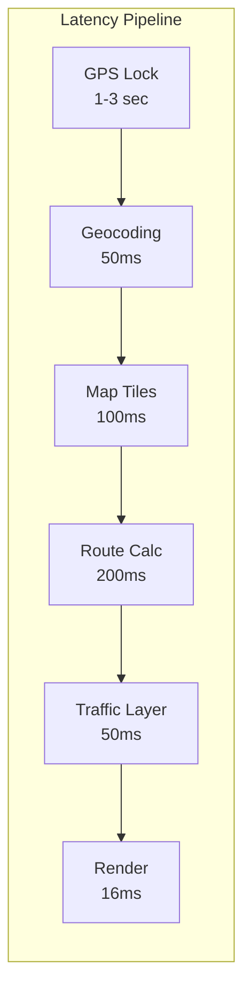

**Latency Targets by Operation:**

| Operation | Target | Optimization Strategy |
|-----------|--------|---------------------|
| Map Pan/Zoom | < 16ms | Pre-loaded tiles, GPU rendering |
| Search | < 200ms | Distributed index, caching |
| Route Calculation | < 500ms | Hierarchical routing, precomputation |
| Traffic Update | < 1 sec | Delta updates, compression |
| Turn-by-turn | < 100ms | Edge computation |
| Offline Maps | 0ms | Local storage |

**Tile Loading Strategy:**

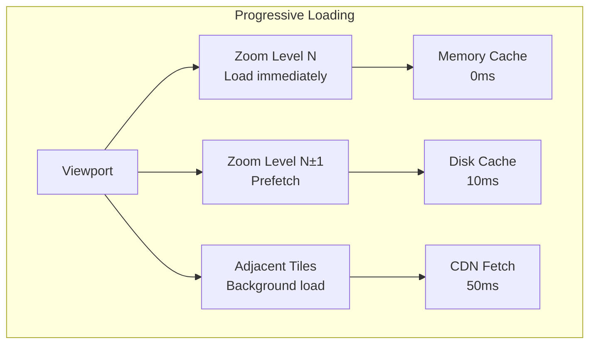

### Axiom 2: Capacity - The World in Bytes

Storing and serving the entire planet's geographic data at multiple zoom levels.

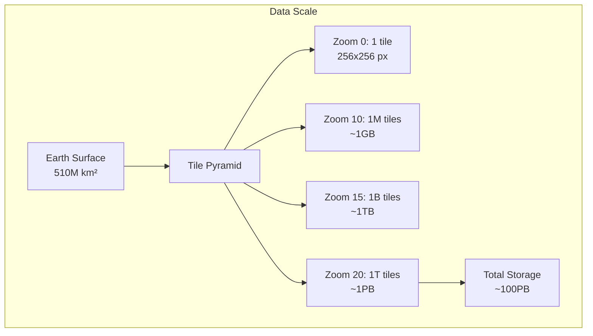

**Data Types and Scale:**

| Data Type | Size | Update Frequency |
|-----------|------|------------------|
| Base Map Tiles | 50 PB | Monthly |
| Satellite Imagery | 20 PB | Quarterly |
| Street View | 30 PB | Continuous |
| Business Data | 5 TB | Daily |
| Traffic Data | 1 TB/day | Real-time |
| User Contributions | 100 GB/day | Continuous |

**Storage Optimization:**

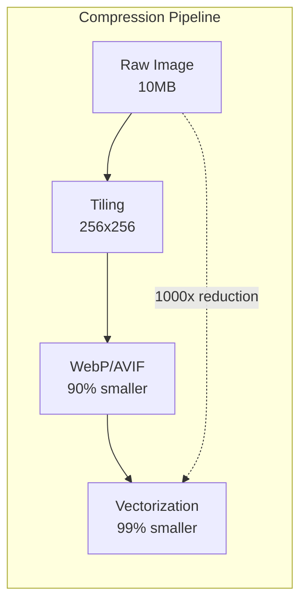

### Axiom 3: Failure - Navigation Must Continue

The system must provide navigation even during partial failures.

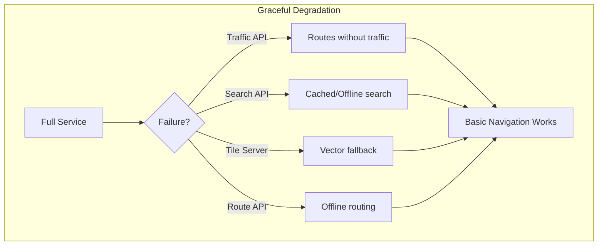

**Failure Scenarios and Mitigations:**

| Failure | Impact | Mitigation |
|---------|--------|-----------|
| GPS Signal Lost | No position | WiFi/Cell positioning |
| Network Offline | No updates | Offline maps |
| Route Server Down | No routes | Client-side routing |
| Traffic API Failed | Stale traffic | Historical estimates |
| Tile Server Failed | Missing maps | Vector tile fallback |

### Axiom 4: Concurrency - Millions Navigating Simultaneously

Handle concurrent route requests and map updates from millions of users.

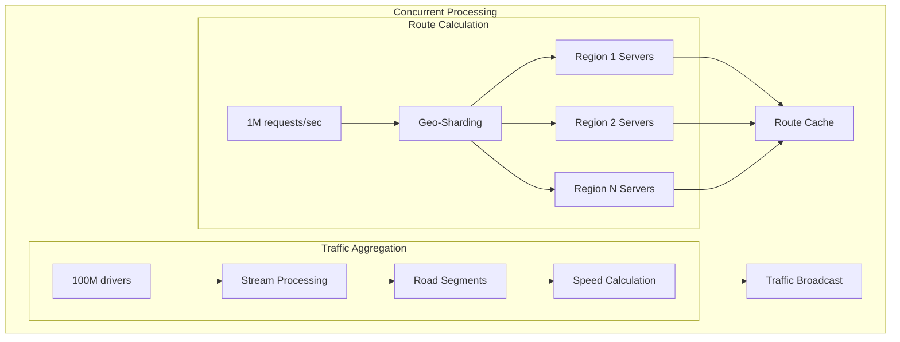

**Concurrency Patterns:**

| Component | Pattern | Scale |
|-----------|---------|-------|
| Route Calculation | Request-level parallelism | 1M QPS |
| Tile Serving | CDN edge caching | 10M QPS |
| Traffic Processing | Stream aggregation | 100K updates/sec |
| Search | Distributed index sharding | 500K QPS |
| User Location | Batched updates | 1M updates/sec |

### Axiom 5: Coordination - Global Map Consistency

Maintaining consistent map data across regions while incorporating updates.

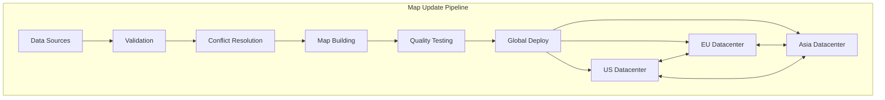

**Consistency Requirements:**

| Data Type | Consistency Model | Update Latency |
|-----------|------------------|----------------|
| Base Map | Eventually Consistent | 24 hours |
| Business Info | Eventually Consistent | 1 hour |
| Traffic Data | Near Real-time | 30 seconds |
| User Location | Best Effort | 5 seconds |
| Route Cache | Read-after-write | Immediate |

### Axiom 6: Observability - Understanding the World

Monitoring both system health and real-world accuracy.

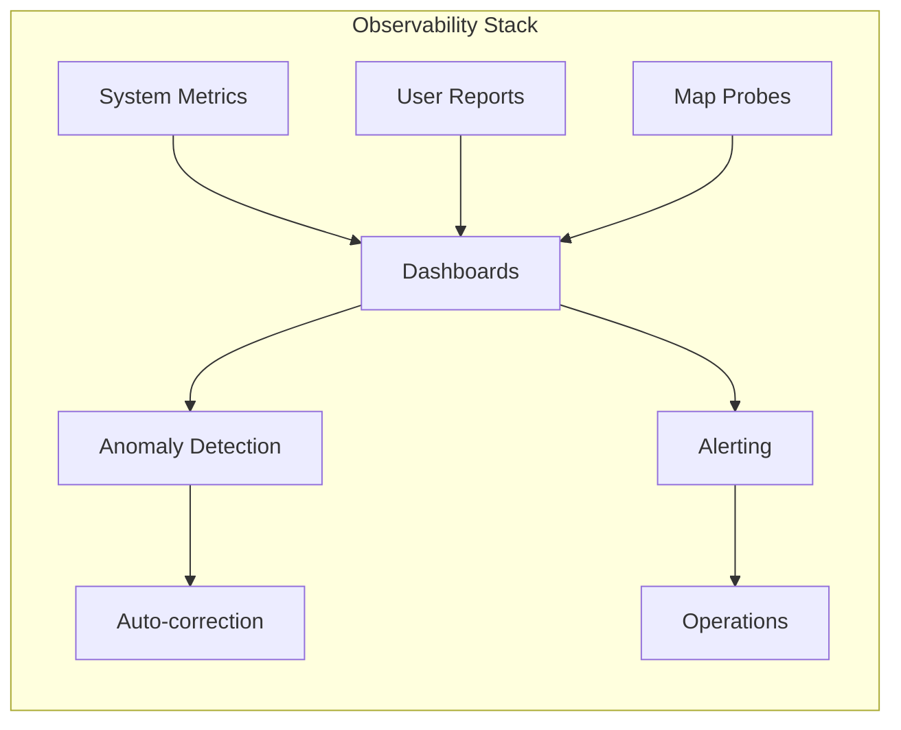

**Key Metrics:**

| Category | Metrics | Alert Thresholds |
|----------|---------|------------------|
| Performance | Tile latency, Route calculation time | p99 > 500ms |
| Accuracy | Route deviation, Address accuracy | Error > 5% |
| Availability | API uptime, Tile availability | < 99.9% |
| Usage | QPS, Active navigations | Anomaly detection |
| Quality | Map freshness, Report rate | > 7 days old |

### Axiom 7: Human Interface - Intuitive Navigation

Making complex geographic data understandable and actionable.

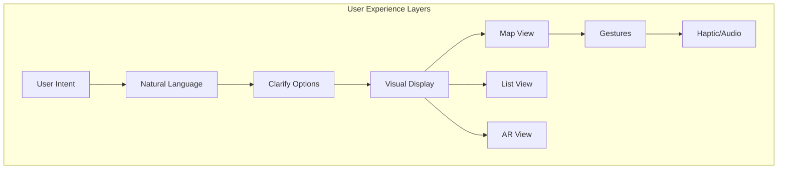

**UX Optimizations:**

| Feature | Implementation | User Benefit |
|---------|---------------|--------------|
| Voice Navigation | TTS with timing | Hands-free |
| Lane Guidance | Vector rendering | Clear directions |
| 3D Buildings | GL rendering | Better landmarks |
| Live View AR | Camera + GPS | Intuitive walking |
| Offline Maps | Local storage | Works anywhere |
| Multi-stop | Optimization algorithm | Efficient trips |

### Axiom 8: Economics - Balancing Free and Profitable

Providing free navigation while monetizing through APIs and ads.

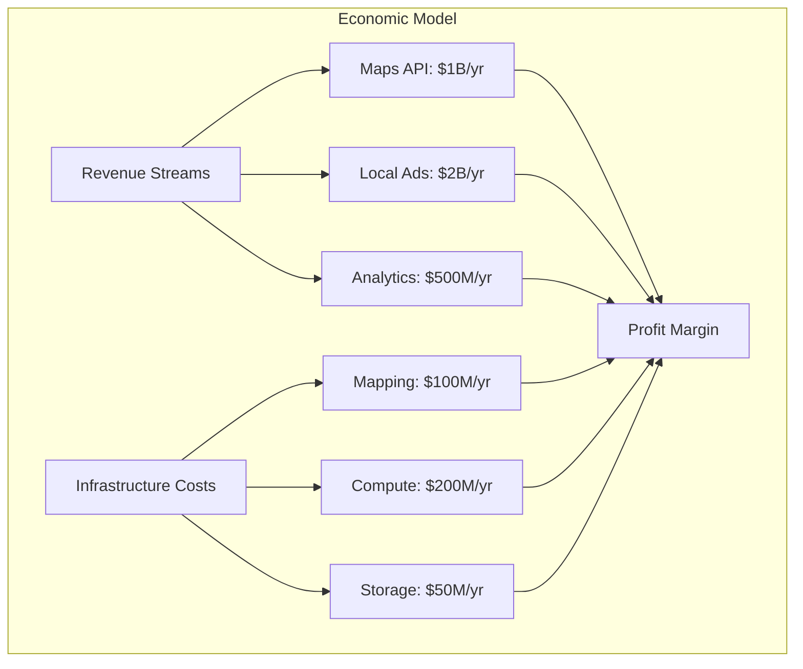

**Cost Optimization Strategies:**

| Strategy | Implementation | Savings |
|----------|---------------|---------|
| Tile Caching | Multi-level CDN | 70% bandwidth |
| Vector Maps | Client rendering | 90% data transfer |
| Differential Updates | Delta patches | 95% update size |
| Compute Offloading | Client-side routing | 60% server cost |
| Data Compression | Custom algorithms | 80% storage |

## Part 2: Comprehensive Architecture Analysis

### Current Architecture: Multi-Layer System

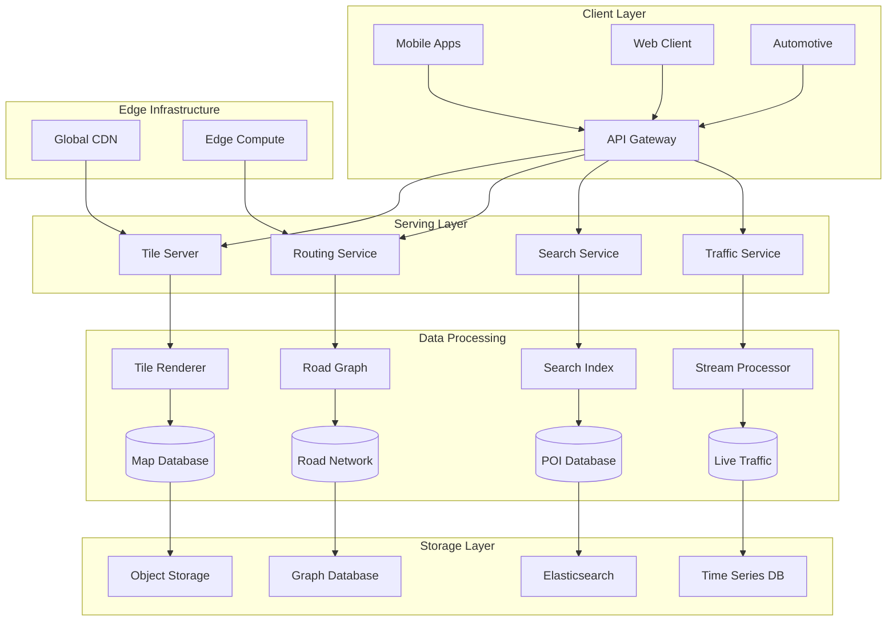

### Architecture Deep Dive: Routing Engine

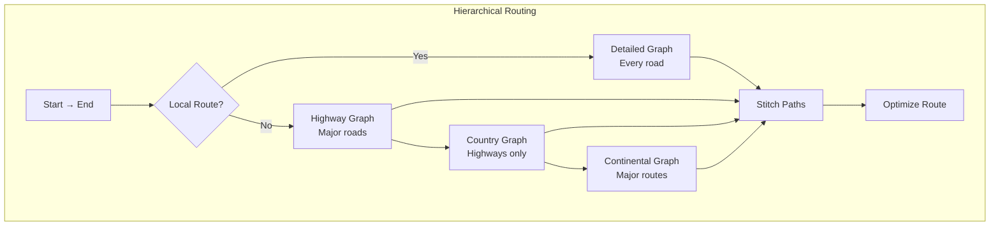

**Routing Optimizations:**

| Technique | Use Case | Performance Gain |
|-----------|----------|------------------|
| Contraction Hierarchies | Long routes | 1000x speedup |
| A* with Landmarks | Short routes | 10x speedup |
| Precomputed Paths | Common routes | Instant |
| Multi-level Dijkstra | Flexible routing | 100x speedup |
| Time-dependent | Traffic awareness | Real-time |

### Alternative Architecture 1: Decentralized P2P Maps

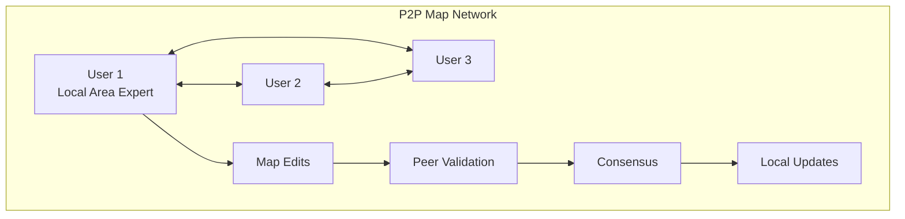

**Trade-offs:**

| Aspect | Benefit | Challenge |
|--------|---------|-----------|
| Cost | Minimal infrastructure | Incentive design |
| Coverage | Community-driven | Quality control |
| Privacy | Local control | No global view |
| Updates | Instant local | Slow propagation |
| Reliability | Dependent on peers | Availability issues |

### Alternative Architecture 2: Satellite-First System

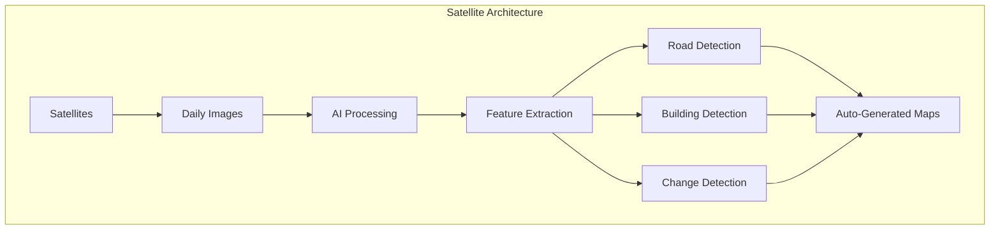

**Trade-offs:**

| Aspect | Benefit | Challenge |
|--------|---------|-----------|
| Coverage | Global, uniform | Weather dependent |
| Updates | Automatic | Processing lag |
| Accuracy | Ground truth | No street names |
| Cost | No ground survey | Satellite costs |
| Detail | Consistent quality | Limited resolution |

### Alternative Architecture 3: Crowdsourced (OpenStreetMap Model)

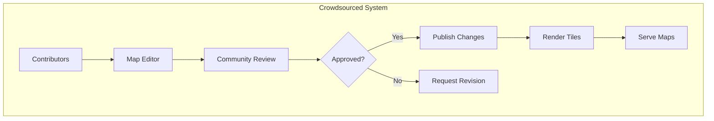

**Trade-offs:**

| Aspect | Benefit | Challenge |
|--------|---------|-----------|
| Cost | Community funded | Volunteer dependent |
| Flexibility | Any data type | Inconsistent schema |
| Coverage | Local knowledge | Sparse areas |
| Licensing | Open data | Commercial limits |
| Quality | Passionate mappers | Variable quality |

### Alternative Architecture 4: Blockchain-Based Maps

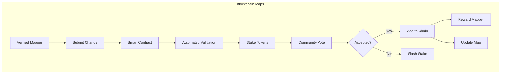

**Trade-offs:**

| Aspect | Benefit | Challenge |
|--------|---------|-----------|
| Trust | Cryptographic proof | Slow consensus |
| Incentives | Token rewards | Economic attacks |
| History | Immutable trail | Storage bloat |
| Governance | Decentralized | Coordination hard |
| Updates | Transparent | High latency |

### Alternative Architecture 5: Edge-Computed Maps

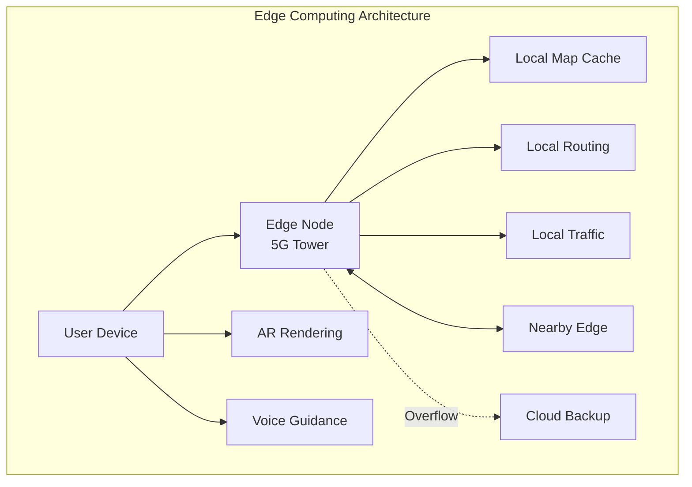

**Trade-offs:**

| Aspect | Benefit | Challenge |
|--------|---------|-----------|
| Latency | Ultra-low (<5ms) | Edge deployment |
| Privacy | Data stays local | Limited aggregation |
| Bandwidth | Reduced backhaul | Edge capacity |
| Reliability | Local operation | Coordination complex |
| Cost | Lower cloud costs | Edge infrastructure |

### Recommended Hybrid Architecture

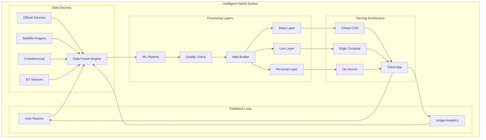

## Implementation Strategies

### 1. Tile Serving Architecture

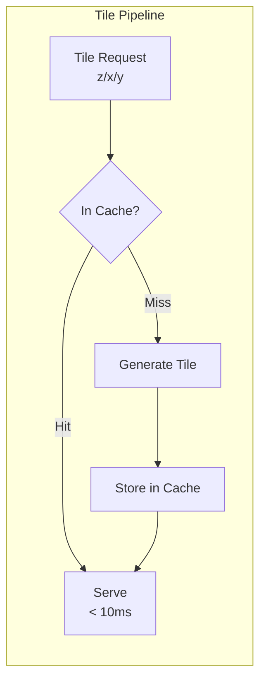

**Tile Optimization Techniques:**

| Technique | Implementation | Benefit |
|-----------|---------------|---------|
| Pyramid Levels | Pre-render zoom 0-15 | Fast base access |
| Vector Tiles | Send geometry, render client | 10x smaller |
| Differential Updates | Only send changes | 95% bandwidth save |
| Predictive Caching | ML-based prefetch | 90% cache hit |
| WebP Format | Modern compression | 30% smaller |

### 2. Routing Algorithm Selection

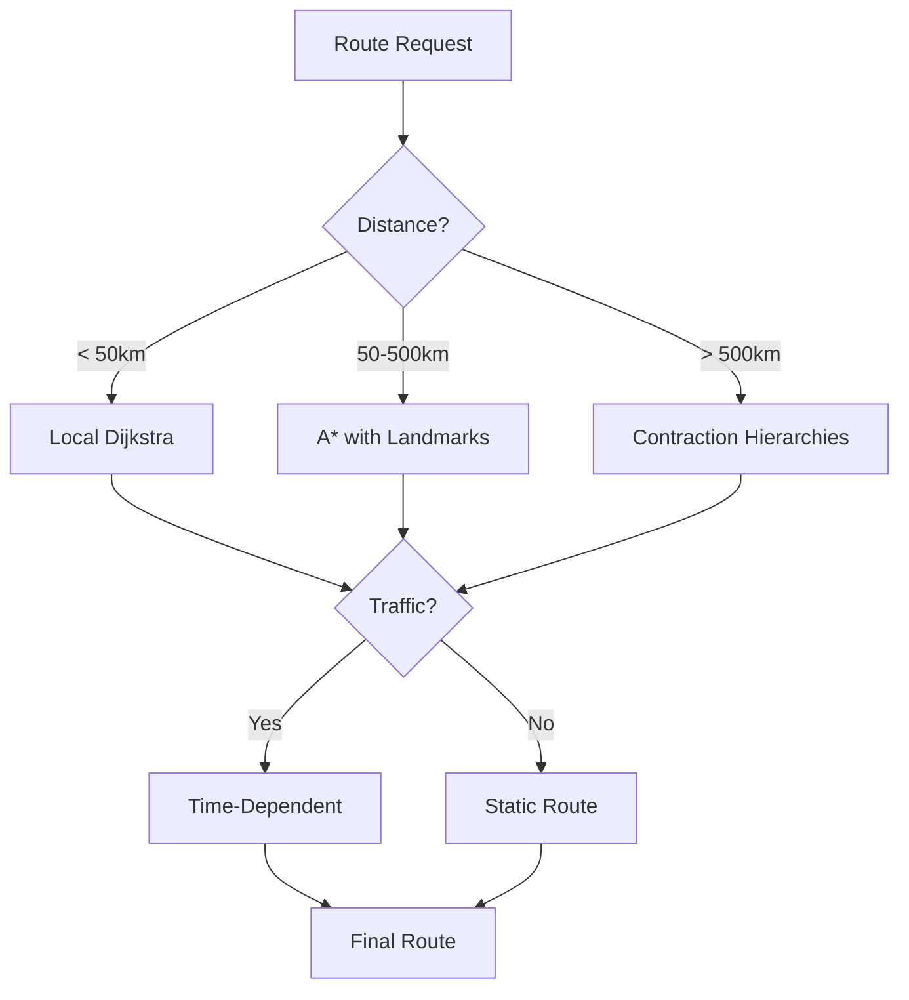

### 3. Traffic Data Pipeline

```mermaid
graph TB
    subgraph "Real-time Traffic"
        GPS[GPS Probes] --> KAFKA[Kafka Stream]
        SENSORS[Road Sensors] --> KAFKA
        REPORTS[User Reports] --> KAFKA
        
        KAFKA --> FLINK[Flink Processing]
        FLINK --> SEGMENT[Segment Speeds]
        SEGMENT --> PREDICT[ML Prediction]
        PREDICT --> BROADCAST[Client Broadcast]
    end
```

**Traffic Processing Scale:**

| Metric | Value | Processing Time |
|--------|-------|-----------------|
| GPS Updates | 100M/min | < 30 sec |
| Road Segments | 50M | Real-time |
| Speed Calculations | 1B/hour | Streaming |
| Predictions | 10M routes/min | < 100ms |

### 4. Search Architecture

```mermaid
graph TB
    subgraph "Search Pipeline"
        QUERY[User Query] --> NLP[NLP Processing]
        NLP --> INTENT[Intent Detection]
        
        INTENT --> GEO[Geocoding]
        INTENT --> POI[POI Search]
        INTENT --> ROUTE[Route Search]
        
        GEO & POI & ROUTE --> RANK[Result Ranking]
        RANK --> PERSONAL[Personalization]
        PERSONAL --> RESULTS[Final Results]
    end
```

## Scalability Analysis

### Growth Projections

| Metric | Current | 2025 | 2030 |
|--------|---------|------|------|
| Users | 1B | 2B | 3B |
| Daily Routes | 1B | 5B | 20B |
| Map Data | 100PB | 500PB | 2EB |
| Traffic Updates | 100M/min | 1B/min | 10B/min |

### Scaling Strategies

1. **Geographic Sharding**: Partition by region
2. **Hierarchical Caching**: Edge → Regional → Global
3. **Compute Offloading**: Client-side processing
4. **Data Tiering**: Hot/Warm/Cold storage
5. **Predictive Scaling**: ML-based capacity planning

## Cost Optimization

### Cost Breakdown

| Component | Monthly Cost | % of Total |
|-----------|-------------|------------|
| Storage | $5M | 20% |
| Compute | $10M | 40% |
| Bandwidth | $7M | 28% |
| Operations | $3M | 12% |

### Optimization Opportunities

1. **Vector Tiles**: 90% bandwidth reduction
2. **Edge Caching**: 70% origin traffic reduction
3. **Client Routing**: 60% compute savings
4. **Compression**: 80% storage savings
5. **Differential Updates**: 95% update bandwidth savings

## Conclusion

Google Maps demonstrates how fundamental distributed systems principles enable planetary-scale navigation. The hybrid architecture balances multiple data sources, processing pipelines, and serving strategies to deliver sub-second routing and real-time traffic updates to billions of users. Key insights include:

1. **Hierarchical Decomposition**: From continental to street-level routing
2. **Multi-Source Fusion**: Combining official, satellite, and crowdsourced data
3. **Edge Computing**: Pushing computation closer to users
4. **Adaptive Quality**: Graceful degradation under failure
5. **Economic Balance**: Free consumer product funded by enterprise APIs

The success of Google Maps comes from treating the Earth not as a static dataset but as a living, breathing system that requires constant observation, validation, and optimization—a true triumph of distributed systems engineering at planetary scale.