# 🗺 Google Maps Architecture Design

**The Challenge**: Build a mapping service serving billions of users with real-time traffic, routing, and street view

!!! info "Case Study Overview"
    **System**: Global mapping and navigation platform  
    **Scale**: 1B+ users, 220+ countries, petabytes of map data  
    **Challenges**: Route calculation, real-time traffic, offline maps, multi-modal transport  
    **Key Patterns**: Graph algorithms, spatial indexing, tile serving, edge caching  
    **Sources**: Google Maps Blog¹, Street View Paper², Road Graph Research³, Traffic Prediction⁴, Route Planning⁵

## Introduction

Google Maps: Complex distributed system with geographic data processing, real-time traffic, routing algorithms. 1B+ users, petabytes of data, millions of routes/second, real-time device data. Combines GPS physics and graph theory for planetary-scale navigation.

## Part 1: Concept Map - The Physics of Digital Cartography

### Law 1: Latency - The Speed of Navigation


**Latency Targets by Operation:**

<div class="responsive-table" markdown>

| Operation | Target | Optimization Strategy |
|-----------|--------|---------------------|
| Map Pan/Zoom | < 16ms | Pre-loaded tiles, GPU rendering |
| Search | < 200ms | Distributed index, caching |
| Route Calculation | < 500ms | Hierarchical routing, precomputation |
| Traffic Update | < 1 sec | Delta updates, compression |
| Turn-by-turn | < 100ms | Edge computation |
| Offline Maps | 0ms | Local storage |

</div>


**Tile Loading Strategy:**

```mermaid
graph TB
    subgraph "Progressive Loading"
        VIEW[Viewport] --> L1[Zoom Level N<br/>Load immediately]
        VIEW --> L2[Zoom Level N±1<br/>Prefetch]
        VIEW --> L3[Adjacent Tiles<br/>Background load]
        
        L1 --> CACHE[Memory Cache<br/>0ms]
        L2 --> DISK[Disk Cache<br/>10ms]
        L3 --> CDN[CDN Fetch<br/>50ms]
    end
```



### Law 2: Capacity - The World in Bytes


**Data Types and Scale:**

<div class="responsive-table" markdown>

| Data Type | Size | Update Frequency |
|-----------|------|------------------|
| Base Map Tiles | 50 PB | Monthly |
| Satellite Imagery | 20 PB | Quarterly |
| Street View | 30 PB | Continuous |
| Business Data | 5 TB | Daily |
| Traffic Data | 1 TB/day | Real-time |
| User Contributions | 100 GB/day | Continuous |

</div>


**Storage Optimization:**


### Law 3: Failure - Navigation Must Continue

The system must provide navigation even during partial failures.


**Failure Scenarios and Mitigations:**

<div class="responsive-table" markdown>

| Failure | Impact | Mitigation |
|---------|--------|-----------|
| GPS Signal Lost | No position | WiFi/Cell positioning |
| Network Offline | No updates | Offline maps |
| Route Server Down | No routes | Client-side routing |
| Traffic API Failed | Stale traffic | Historical estimates |
| Tile Server Failed | Missing maps | Vector tile fallback |

</div>


### Law 4: Concurrency - Millions Navigating Simultaneously

Handle concurrent route requests and map updates from millions of users.


**Concurrency Patterns:**

<div class="responsive-table" markdown>

| Component | Pattern | Scale |
|-----------|---------|-------|
| Route Calculation | Request-level parallelism | 1M QPS |
| Tile Serving | CDN edge caching | 10M QPS |
| Traffic Processing | Stream aggregation | 100K updates/sec |
| Search | Distributed index sharding | 500K QPS |
| User Location | Batched updates | 1M updates/sec |

</div>


### Law 5: Coordination - Global Map Consistency

Maintaining consistent map data across regions while incorporating updates.


**Consistency Requirements:**

<div class="responsive-table" markdown>

| Data Type | Consistency Model | Update Latency |
|-----------|------------------|----------------|
| Base Map | Eventually Consistent | 24 hours |
| Business Info | Eventually Consistent | 1 hour |
| Traffic Data | Near Real-time | 30 seconds |
| User Location | Best Effort | 5 seconds |
| Route Cache | Read-after-write | Immediate |

</div>


### Law 6: Observability - Understanding the World

Monitoring both system health and real-world accuracy.


**Key Metrics:**

<div class="responsive-table" markdown>

| Category | Metrics | Alert Thresholds |
|----------|---------|------------------|
| Performance | Tile latency, Route calculation time | p99 > 500ms |
| Accuracy | Route deviation, Address accuracy | Error > 5% |
| Availability | API uptime, Tile availability | < 99.9% |
| Usage | QPS, Active navigations | Anomaly detection |
| Quality | Map freshness, Report rate | > 7 days old |

</div>


### Law 7: Human Interface - Intuitive Navigation

Making complex geographic data understandable and actionable.


**UX Optimizations:**

<div class="responsive-table" markdown>

| Feature | Implementation | User Benefit |
|---------|---------------|--------------|
| Voice Navigation | TTS with timing | Hands-free |
| Lane Guidance | Vector rendering | Clear directions |
| 3D Buildings | GL rendering | Better landmarks |
| Live View AR | Camera + GPS | Intuitive walking |
| Offline Maps | Local storage | Works anywhere |
| Multi-stop | Optimization algorithm | Efficient trips |

</div>


### Law 7: Economics - Balancing Free and Profitable

Providing free navigation while monetizing through APIs and ads.


**Cost Optimization Strategies:**

<div class="responsive-table" markdown>

| Strategy | Implementation | Savings |
|----------|---------------|---------|
| Tile Caching | Multi-level CDN | 70% bandwidth |
| Vector Maps | Client rendering | 90% data transfer |
| Differential Updates | Delta patches | 95% update size |
| Compute Offloading | Client-side routing | 60% server cost |
| Data Compression | Custom algorithms | 80% storage |

</div>


## Part 2: Comprehensive Architecture Analysis

### Current Architecture: Multi-Layer System


### Architecture Deep Dive: Routing Engine


**Routing Optimizations:**

<div class="responsive-table" markdown>

| Technique | Use Case | Performance Gain |
|-----------|----------|------------------|
| Contraction Hierarchies | Long routes | 1000x speedup |
| A* with Landmarks | Short routes | 10x speedup |
| Precomputed Paths | Common routes | Instant |
| Multi-level Dijkstra | Flexible routing | 100x speedup |
| Time-dependent | Traffic awareness | Real-time |

</div>


### Alternative Architecture 1: Decentralized P2P Maps


**Trade-offs:**

<div class="responsive-table" markdown>

| Aspect | Benefit | Challenge |
|--------|---------|-----------|
| Cost | Minimal infrastructure | Incentive design |
| Coverage | Community-driven | Quality control |
| Privacy | Local control | No global view |
| Updates | Instant local | Slow propagation |
| Reliability | Dependent on peers | Availability issues |

</div>


### Alternative Architecture 2: Satellite-First System


**Trade-offs:**

<div class="responsive-table" markdown>

| Aspect | Benefit | Challenge |
|--------|---------|-----------|
| Coverage | Global, uniform | Weather dependent |
| Updates | Automatic | Processing lag |
| Accuracy | Ground truth | No street names |
| Cost | No ground survey | Satellite costs |
| Detail | Consistent quality | Limited resolution |

</div>


### Alternative Architecture 3: Crowdsourced (OpenStreetMap Model)


**Trade-offs:**

<div class="responsive-table" markdown>

| Aspect | Benefit | Challenge |
|--------|---------|-----------|
| Cost | Community funded | Volunteer dependent |
| Flexibility | Any data type | Inconsistent schema |
| Coverage | Local knowledge | Sparse areas |
| Licensing | Open data | Commercial limits |
| Quality | Passionate mappers | Variable quality |

</div>


### Alternative Architecture 4: Blockchain-Based Maps


**Trade-offs:**

<div class="responsive-table" markdown>

| Aspect | Benefit | Challenge |
|--------|---------|-----------|
| Trust | Cryptographic proof | Slow consensus |
| Incentives | Token rewards | Economic attacks |
| History | Immutable trail | Storage bloat |
| Governance | Decentralized | Coordination hard |
| Updates | Transparent | High latency |

</div>


### Alternative Architecture 5: Edge-Computed Maps


**Trade-offs:**

<div class="responsive-table" markdown>

| Aspect | Benefit | Challenge |
|--------|---------|-----------|
| Latency | Ultra-low (<5ms) | Edge deployment |
| Privacy | Data stays local | Limited aggregation |
| Bandwidth | Reduced backhaul | Edge capacity |
| Reliability | Local operation | Coordination complex |
| Cost | Lower cloud costs | Edge infrastructure |

</div>


### Recommended Hybrid Architecture


## Implementation Strategies

### 1. Tile Serving Architecture


**Tile Optimization Techniques:**

<div class="responsive-table" markdown>

| Technique | Implementation | Benefit |
|-----------|---------------|---------|
| Pyramid Levels | Pre-render zoom 0-15 | Fast base access |
| Vector Tiles | Send geometry, render client | 10x smaller |
| Differential Updates | Only send changes | 95% bandwidth save |
| Predictive Caching | ML-based prefetch | 90% cache hit |
| WebP Format | Modern compression | 30% smaller |

</div>


### 2. Routing Algorithm Selection


### 3. Traffic Data Pipeline

```mermaid
graph TB
    subgraph "Real-time Traffic"
        GPS[GPS Probes] --> KAFKA[Kafka Stream]
        SENSORS[Road Sensors] --> KAFKA
        REPORTS[User Reports] --> KAFKA
        
        KAFKA --> FLINK[Flink Processing]
        FLINK --> SEGMENT[Segment Speeds]
        SEGMENT --> PREDICT[ML Prediction]
        PREDICT --> BROADCAST[Client Broadcast]
    end
```

**Traffic Processing Scale:**

<div class="responsive-table" markdown>

| Metric | Value | Processing Time |
|--------|-------|-----------------|
| GPS Updates | 100M/min | < 30 sec |
| Road Segments | 50M | Real-time |
| Speed Calculations | 1B/hour | Streaming |
| Predictions | 10M routes/min | < 100ms |

</div>


### 4. Search Architecture

```mermaid
graph TB
    subgraph "Search Pipeline"
        QUERY[User Query] --> NLP[NLP Processing]
        NLP --> INTENT[Intent Detection]
        
        INTENT --> GEO[Geocoding]
        INTENT --> POI[POI Search]
        INTENT --> ROUTE[Route Search]
        
        GEO & POI & ROUTE --> RANK[Result Ranking]
        RANK --> PERSONAL[Personalization]
        PERSONAL --> RESULTS[Final Results]
    end
```

## Scalability Analysis

### Growth Projections

<div class="responsive-table" markdown>

| Metric | Current | 2025 | 2030 |
|--------|---------|------|------|
| Users | 1B | 2B | 3B |
| Daily Routes | 1B | 5B | 20B |
| Map Data | 100PB | 500PB | 2EB |
| Traffic Updates | 100M/min | 1B/min | 10B/min |

</div>


### Scaling Strategies

1. **Geographic Sharding**: Partition by region
2. **Hierarchical Caching**: Edge → Regional → Global
3. **Compute Offloading**: Client-side processing
4. **Data Tiering**: Hot/Warm/Cold storage
5. **Predictive Scaling**: ML-based capacity planning

## Cost Optimization

### Cost Breakdown

<div class="responsive-table" markdown>

| Component | Monthly Cost | % of Total |
|-----------|-------------|------------|
| Storage | $5M | 20% |
| Compute | $10M | 40% |
| Bandwidth | $7M | 28% |
| Operations | $3M | 12% |

</div>


### Optimization Opportunities

1. **Vector Tiles**: 90% bandwidth reduction
2. **Edge Caching**: 70% origin traffic reduction
3. **Client Routing**: 60% compute savings
4. **Compression**: 80% storage savings
5. **Differential Updates**: 95% update bandwidth savings

## Alternative Architectures Comparison

### Alternative 1: Raster-Only Architecture

```mermaid
graph TB
    subgraph "Traditional Raster Maps"
        CLIENT[Web Client]
        TILES[Tile Server]
        RENDER[Rendering Farm]
        DB[(Geo Database)]
        
        CLIENT -->|z/x/y.png| TILES
        TILES -->|miss| RENDER
        RENDER --> DB
        TILES -->|hit| CLIENT
    end
    
    style RENDER fill:#ff6b6b
```

**Trade-offs**:
- Simple implementation
- Universal compatibility
- Pixel-perfect control
- Large bandwidth usage
- No client-side styling
- Fixed zoom levels

### Alternative 2: Pure Client-Side Rendering

```mermaid
graph TB
    subgraph "Client-Only Rendering"
        CLIENT[Fat Client<br/>All Logic]
        RAW[Raw Data API]
        DB[(Complete Dataset)]
        
        CLIENT -->|Get region| RAW
        RAW --> DB
        DB -->|All data| CLIENT
        CLIENT -->|Render locally| CLIENT
    end
    
    style CLIENT fill:#4ecdc4
```

**Trade-offs**:
- Infinite customization
- No tile servers
- Offline capable
- Huge downloads
- Client performance
- Data freshness issues

### Alternative 3: Crowdsourced Only (OpenStreetMap Model)

```mermaid
graph TB
    subgraph "Crowdsourced Architecture"
        USERS[Contributors]
        EDIT[Edit API]
        REVIEW[Review Queue]
        DB[(OSM Database)]
        PLANET[Planet Dumps]
        
        USERS --> EDIT
        EDIT --> REVIEW
        REVIEW --> DB
        DB --> PLANET
    end
    
    style USERS fill:#95e1d3
```

**Trade-offs**:
- Community driven
- Low cost
- Global coverage
- Quality varies
- Slow updates
- Vandalism risk

### Alternative 4: Federated Map Services

```mermaid
graph TB
    subgraph "Federated Maps"
        subgraph "Provider A"
            MA[Maps A<br/>Region 1]
        end
        
        subgraph "Provider B"
            MB[Maps B<br/>Region 2]
        end
        
        subgraph "Provider C"
            MC[Maps C<br/>Region 3]
        end
        
        AGG[Aggregator API]
        CLIENT[Client]
        
        CLIENT --> AGG
        AGG --> MA & MB & MC
    end
    
    style AGG fill:#f7dc6f
```

**Trade-offs**:
- Local expertise
- Distributed cost
- Regional compliance
- Inconsistent quality
- Complex integration
- Boundary issues

## Architecture Evolution

### Phase 1: Basic Web Maps (2005-2007)

```text
Browser → Web Server → Map Tiles → Static Images
```

**Problems Encountered:**
- Full page reloads for panning
- No mobile support
- Static data only
- Limited coverage

**Patterns Violated**: 
- No [Tile Caching](/patterns/tile-caching)
- No Vector Maps (Coming Soon)
- No Real-time Updates (Coming Soon)

### Phase 2: AJAX and Tile-Based Maps (2007-2010)

```mermaid
graph TB
    subgraph "Client"
        JS[JavaScript App]
        TILE[Tile Manager]
        CACHE[Browser Cache]
    end
    
    subgraph "Backend"
        LB[Load Balancer]
        TS[Tile Server]
        RENDER[Tile Renderer]
    end
    
    subgraph "Storage"
        PRE[Pre-rendered Tiles]
        GEO[(Geo Database)]
    end
    
    JS --> TILE --> CACHE
    TILE --> LB --> TS
    TS --> PRE
    TS --> RENDER --> GEO
    
    style TILE fill:#ff9999
```

**Key Design Decision: Tile Pyramid System**
- **Trade-off**: Storage vs Computation (Pillar: [State Distribution](/part2-pillars/state/))
- **Choice**: Pre-render popular zoom levels
- **Result**: 100x faster map loads
- **Pattern Applied**: Tile Pyramid (Coming Soon)

According to Google¹, this reduced map load time from 10s to 100ms.

### Phase 3: Vector Maps and Mobile (2010-2015)

```mermaid
graph TB
    subgraph "Data Collection"
        SAT[Satellite Imagery]
        CAR[Street View Cars]
        USER[User Contributions]
        GOVT[Government Data]
    end
    
    subgraph "Processing Pipeline"
        FUSION[Data Fusion]
        ML[ML Processing]
        VALID[Validation]
        INDEX[Spatial Indexing]
    end
    
    subgraph "Map Services"
        VECTOR[Vector Tile Service]
        ROUTE[Routing Engine]
        SEARCH[Search Service]
        TRAFFIC[Traffic Service]
    end
    
    subgraph "Client Rendering"
        IOS[iOS Renderer]
        AND[Android Renderer]
        WEB[WebGL Renderer]
    end
    
    SAT & CAR & USER & GOVT --> FUSION
    FUSION --> ML --> VALID --> INDEX
    
    INDEX --> VECTOR & ROUTE & SEARCH & TRAFFIC
    VECTOR --> IOS & AND & WEB
```

**Innovation: Vector Tiles**³
- Scalable vector graphics
- Client-side rendering
- Dynamic styling
- Smaller downloads

**Patterns & Pillars Applied**:
- Pattern: Vector Tiles (Coming Soon) - Resolution independence
- Pattern: Client Rendering (Coming Soon) - GPU acceleration
- 🏛 Pillar: [Work Distribution](/part2-pillars/work/) - Client computation
- 🏛 Pillar: [Intelligence](/part2-pillars/intelligence/) - ML map generation

### Phase 4: Modern Real-time Platform (2015-Present)

```mermaid
graph LR
    subgraph "Data Ingestion"
        subgraph "Real-time Sources"
            PHONES[1B+ Phones<br/>GPS Traces]
            CARS[Connected Cars<br/>Speed Data]
            TRANSIT[Transit APIs<br/>Schedules]
            SENSORS[IoT Sensors<br/>Traffic Cams]
        end
        subgraph "Static Sources"
            IMAGERY[Satellite/Aerial<br/>15PB+]
            LIDAR[LiDAR Scans<br/>3D Data]
            STREET[Street View<br/>170B+ images]
        end
    end

    subgraph "Processing Infrastructure"
        subgraph "Stream Processing"
            KAFKA[Kafka<br/>1M events/sec]
            FLINK[Flink<br/>Real-time]
            BEAM[Apache Beam<br/>Batch + Stream]
        end
        
        subgraph "ML Pipeline"
            TRAFFIC_ML[Traffic Prediction<br/>Graph Neural Nets]
            VISION[Computer Vision<br/>Sign Detection]
            NLP[NLP Engine<br/>Place Names]
        end
        
        subgraph "Map Generation"
            CONFLATE[Conflation Engine<br/>Data Fusion]
            RENDER[Rendering Farm<br/>100K cores]
            VALIDATE[Validation<br/>Quality Checks]
        end
    end

    subgraph "Serving Infrastructure"
        subgraph "Core Services"
            TILES[Tile Service<br/>Vector + Raster]
            ROUTING[Routing Engine<br/>Contraction Hierarchies]
            PLACES[Places API<br/>100M+ POIs]
            GEOCODE[Geocoding<br/>Address → Coords]
        end
        
        subgraph "Real-time Services"
            TRAFFIC_RT[Live Traffic<br/>Road Speeds]
            INCIDENTS[Incident Reports<br/>Accidents/Construction]
            ETA[ETA Service<br/>ML Predictions]
        end
        
        subgraph "Specialized"
            INDOOR[Indoor Maps<br/>10K+ buildings]
            AR[AR Navigation<br/>Live View]
            OFFLINE[Offline Maps<br/>Downloadable]
        end
    end

    subgraph "Storage Systems"
        subgraph "Hot Data"
            REDIS[Redis<br/>Traffic Cache]
            BIGTABLE[Bigtable<br/>Tiles/Routes]
        end
        
        subgraph "Warm Data"
            SPANNER[Spanner<br/>Global Places]
            GCS[Cloud Storage<br/>Imagery]
        end
        
        subgraph "Cold Data"
            COLD[Nearline<br/>Historical]
            GLACIER[Archive<br/>Raw Data]
        end
    end

    subgraph "Edge Infrastructure"
        CDN[Global CDN<br/>1000+ PoPs]
        EDGE[Edge Compute<br/>Route Calc]
        CACHE[Regional Caches]
    end

    PHONES & CARS & TRANSIT --> KAFKA
    IMAGERY & STREET --> GCS
    
    KAFKA --> FLINK --> TRAFFIC_ML
    GCS --> VISION --> CONFLATE
    
    CONFLATE --> RENDER --> TILES
    TRAFFIC_ML --> TRAFFIC_RT
    
    TILES & ROUTING & PLACES --> CDN
    CDN --> EDGE --> CACHE
    
    style ROUTING fill:#ff6b6b
    style TRAFFIC_ML fill:#4ecdc4
    style CDN fill:#95e1d3
```

**Current Scale**:
- 1B+ monthly active users
- 220+ countries/territories
- 40M+ miles of roads
- 1B+ kilometers driven daily for data

## Core Components Deep Dive

### 1. Map Data Pipeline

```python
class MapDataPipeline:
    """Process multi-source map data into unified model"""
    
    def __init__(self):
        self.sources = {
            'satellite': SatelliteProcessor(),
            'street_view': StreetViewProcessor(),
            'osm': OSMProcessor(),
            'government': GovernmentDataProcessor(),
            'user': UserContributionProcessor()
        }
        self.conflation_engine = ConflationEngine()
        
    async def process_region(self, region_id: str):
        """Process all data sources for a region"""
# 1. Collect raw data from all sources
        raw_data = {}
        for source_name, processor in self.sources.items():
            try:
                data = await processor.extract_region(region_id)
                raw_data[source_name] = data
            except Exception as e:
                logging.error(f"Failed to process {source_name}: {e}")
                
# 2. Run conflation to merge data
        merged_data = await self.conflation_engine.conflate(raw_data)
        
# 3. Validate merged data
        validation_results = await self._validate_data(merged_data)
        
# 4. Apply ML enhancements
        enhanced_data = await self._apply_ml_enhancements(merged_data)
        
# 5. Generate map artifacts
        artifacts = await self._generate_artifacts(enhanced_data)
        
        return artifacts

class ConflationEngine:
    """Merge multiple data sources into consistent map"""
    
    def __init__(self):
        self.matchers = {
            'road': RoadMatcher(),
            'building': BuildingMatcher(),
            'poi': POIMatcher()
        }
        self.confidence_threshold = 0.8
        
    async def conflate(self, source_data: Dict[str, MapData]) -> MapData:
        """Conflate multiple data sources"""
# 1. Extract features from each source
        all_features = defaultdict(list)
        for source, data in source_data.items():
            features = self._extract_features(data)
            for feature_type, feature_list in features.items():
                all_features[feature_type].extend([
                    (feature, source) for feature in feature_list
                ])
        
# 2. Match features across sources
        matched_features = {}
        for feature_type, features in all_features.items():
            matcher = self.matchers.get(feature_type)
            if matcher:
                matches = await matcher.match_features(features)
                matched_features[feature_type] = matches
                
# 3. Resolve conflicts
        resolved_features = await self._resolve_conflicts(matched_features)
        
# 4. Build unified map
        unified_map = self._build_unified_map(resolved_features)
        
        return unified_map
    
    async def _resolve_conflicts(self, matched_features: Dict) -> Dict:
        """Resolve conflicts between sources"""
        resolved = {}
        
        for feature_type, matches in matched_features.items():
            resolved[feature_type] = []
            
            for match_group in matches:
# Sort by source reliability
                sorted_sources = sorted(
                    match_group,
                    key=lambda x: self._source_reliability(x[1]),
                    reverse=True
                )
                
# Take highest reliability source
                best_feature = sorted_sources[0][0]
                
# Enhance with data from other sources
                for feature, source in sorted_sources[1:]:
                    best_feature = self._merge_attributes(
                        best_feature,
                        feature
                    )
                    
                resolved[feature_type].append(best_feature)
                
        return resolved
```

### 2. Real-time Traffic System

```python
class RealTimeTrafficSystem:
    """Process real-time traffic data from millions of sources"""
    
    def __init__(self):
        self.speed_aggregator = SpeedAggregator()
        self.incident_detector = IncidentDetector()
        self.traffic_predictor = TrafficPredictor()
        self.update_interval = 30  # seconds
        
    async def process_gps_trace(self, trace: GPSTrace):
        """Process single GPS trace"""
# 1. Map match to road segment
        road_segment = await self._map_match(trace)
        if not road_segment:
            return
            
# 2. Calculate speed
        speed = self._calculate_speed(trace)
        
# 3. Update aggregated speed
        await self.speed_aggregator.update(
            road_segment.id,
            speed,
            trace.timestamp
        )
        
# 4. Check for anomalies
        if await self._is_anomalous(road_segment.id, speed):
            await self.incident_detector.check_incident(
                road_segment,
                speed,
                trace
            )
    
    async def get_traffic_conditions(self, route: Route) -> TrafficConditions:
        """Get current traffic conditions for route"""
        conditions = TrafficConditions()
        
        for segment in route.segments:
# Get current speed
            current_speed = await self.speed_aggregator.get_speed(
                segment.id
            )
            
# Get historical baseline
            baseline_speed = await self._get_baseline_speed(
                segment.id,
                datetime.now()
            )
            
# Calculate congestion level
            if current_speed and baseline_speed:
                congestion_ratio = current_speed / baseline_speed
                conditions.add_segment(
                    segment,
                    current_speed,
                    self._speed_to_congestion_level(congestion_ratio)
                )
                
        return conditions

class TrafficPredictor:
    """ML-based traffic prediction"""
    
    def __init__(self):
        self.model = self._load_graph_neural_network()
        self.road_graph = self._load_road_graph()
        
    async def predict_traffic(self, 
                            start_time: datetime,
                            duration_hours: int = 1) -> Dict[str, List[float]]:
        """Predict traffic conditions"""
# 1. Prepare input features
        features = await self._prepare_features(start_time)
        
# 2. Run GNN model
        predictions = self.model.predict(
            graph=self.road_graph,
            node_features=features['node_features'],
            edge_features=features['edge_features'],
            temporal_features=features['temporal_features']
        )
        
# 3. Post-process predictions
        traffic_predictions = {}
        for segment_id, speed_predictions in predictions.items():
            traffic_predictions[segment_id] = [
                self._normalize_speed(pred) 
                for pred in speed_predictions
            ]
            
        return traffic_predictions
    
    def _prepare_features(self, start_time: datetime) -> Dict:
        """Prepare features for prediction"""
        features = {
            'node_features': {},  # Road segment features
            'edge_features': {},  # Connectivity features
            'temporal_features': {}  # Time-based features
        }
        
# Node features: historical speeds, road type, etc.
        for node_id in self.road_graph.nodes():
            features['node_features'][node_id] = np.array([
                self._get_historical_speed(node_id, start_time),
                self._get_road_type_encoding(node_id),
                self._get_lane_count(node_id),
                self._get_speed_limit(node_id)
            ])
            
# Temporal features
        features['temporal_features'] = {
            'hour_of_day': start_time.hour,
            'day_of_week': start_time.weekday(),
            'is_holiday': self._is_holiday(start_time),
            'weather': self._get_weather_encoding(start_time)
        }
        
        return features
```

### 3. Routing Engine

```python
class RoutingEngine:
    """High-performance routing using Contraction Hierarchies"""
    
    def __init__(self):
        self.ch_graph = ContractionHierarchy()
        self.traffic_aware = True
        self.alternative_routes = 3
        
    async def find_route(self, origin: Location, 
                        destination: Location,
                        options: RouteOptions = None) -> List[Route]:
        """Find optimal routes between points"""
# 1. Map locations to graph nodes
        origin_node = await self._nearest_node(origin)
        dest_node = await self._nearest_node(destination)
        
# 2. Check cache
        cache_key = f"{origin_node}:{dest_node}:{options}"
        cached = await self._get_cached_route(cache_key)
        if cached:
            return cached
            
# 3. Run CH query
        if self.traffic_aware:
# Use current traffic conditions
            edge_weights = await self._get_traffic_weights()
            paths = self.ch_graph.shortest_paths(
                origin_node,
                dest_node,
                edge_weights,
                k=self.alternative_routes
            )
        else:
# Use static weights
            paths = self.ch_graph.shortest_paths(
                origin_node,
                dest_node,
                k=self.alternative_routes
            )
            
# 4. Convert paths to routes
        routes = []
        for path in paths:
            route = await self._path_to_route(path, options)
            routes.append(route)
            
# 5. Rank routes
        ranked_routes = await self._rank_routes(routes, options)
        
# 6. Cache results
        await self._cache_routes(cache_key, ranked_routes)
        
        return ranked_routes

class ContractionHierarchy:
    """Contraction Hierarchies for fast routing"""
    
    def __init__(self):
        self.graph = None
        self.node_order = None
        self.shortcuts = {}
        
    def preprocess(self, road_network: Graph):
        """Preprocess road network"""
# 1. Calculate node importance
        importance = self._calculate_node_importance(road_network)
        
# 2. Order nodes by importance
        self.node_order = sorted(
            road_network.nodes(),
            key=lambda n: importance[n]
        )
        
# 3. Contract nodes in order
        contracted_graph = road_network.copy()
        
        for node in self.node_order:
# Find shortcuts needed
            shortcuts = self._find_shortcuts(contracted_graph, node)
            
# Add shortcuts to graph
            for shortcut in shortcuts:
                contracted_graph.add_edge(
                    shortcut.source,
                    shortcut.target,
                    weight=shortcut.weight,
                    via=node
                )
                self.shortcuts[
                    (shortcut.source, shortcut.target)
                ] = shortcut
                
# Remove contracted node
            contracted_graph.remove_node(node)
            
        self.graph = contracted_graph
        
    def shortest_paths(self, source: int, target: int, 
                      edge_weights: Dict = None,
                      k: int = 1) -> List[Path]:
        """Find k shortest paths using bidirectional search"""
# Forward search from source
        forward_dist, forward_parent = self._dijkstra_ch(
            source,
            direction='forward',
            edge_weights=edge_weights
        )
        
# Backward search from target
        backward_dist, backward_parent = self._dijkstra_ch(
            target,
            direction='backward',
            edge_weights=edge_weights
        )
        
# Find meeting points
        meeting_nodes = []
        for node in self.graph.nodes():
            if node in forward_dist and node in backward_dist:
                total_dist = forward_dist[node] + backward_dist[node]
                meeting_nodes.append((total_dist, node))
                
# Sort by distance
        meeting_nodes.sort()
        
# Reconstruct paths
        paths = []
        for dist, meeting_node in meeting_nodes[:k]:
            path = self._reconstruct_path(
                source,
                target,
                meeting_node,
                forward_parent,
                backward_parent
            )
            paths.append(Path(nodes=path, distance=dist))
            
        return paths
```

### 4. Tile Generation System

```python
class TileGenerationSystem:
    """Generate map tiles at multiple zoom levels"""
    
    def __init__(self):
        self.zoom_levels = range(0, 22)  # 0 = world, 21 = building level
        self.tile_size = 256  # pixels
        self.formats = ['vector', 'raster', 'terrain']
        
    async def generate_tiles_for_region(self, region: BoundingBox,
                                      max_zoom: int = 18):
        """Generate all tiles for a region"""
        tasks = []
        
        for zoom in range(0, max_zoom + 1):
# Calculate tiles needed at this zoom
            tiles = self._get_tiles_in_region(region, zoom)
            
            for tile in tiles:
# Generate each format
                for format_type in self.formats:
                    task = self._generate_tile(
                        tile.x,
                        tile.y,
                        tile.z,
                        format_type
                    )
                    tasks.append(task)
                    
# Process in batches
        batch_size = 1000
        for i in range(0, len(tasks), batch_size):
            batch = tasks[i:i + batch_size]
            await asyncio.gather(*batch)
            
    async def _generate_tile(self, x: int, y: int, z: int, 
                           format_type: str) -> Tile:
        """Generate single tile"""
# 1. Calculate geographic bounds
        bounds = self._tile_to_bounds(x, y, z)
        
# 2. Query data for bounds
        if format_type == 'vector':
            data = await self._get_vector_data(bounds, z)
            tile = self._render_vector_tile(data)
        elif format_type == 'raster':
            data = await self._get_raster_data(bounds, z)
            tile = self._render_raster_tile(data, z)
        elif format_type == 'terrain':
            data = await self._get_terrain_data(bounds, z)
            tile = self._render_terrain_tile(data)
            
# 3. Optimize tile
        optimized = await self._optimize_tile(tile, format_type)
        
# 4. Store tile
        await self._store_tile(x, y, z, format_type, optimized)
        
        return optimized

class VectorTileRenderer:
    """Render vector tiles using Mapbox Vector Tile spec"""
    
    def __init__(self):
        self.layers = {
            'water': WaterLayer(),
            'landuse': LanduseLayer(),
            'roads': RoadLayer(),
            'buildings': BuildingLayer(),
            'labels': LabelLayer()
        }
        
    def render(self, features: List[Feature], 
               zoom: int) -> bytes:
        """Render features to MVT format"""
        tile = mapbox_vector_tile.Tile()
        
# Group features by layer
        layer_features = defaultdict(list)
        for feature in features:
            layer_name = self._get_layer_name(feature)
            if self._should_include(feature, zoom):
                layer_features[layer_name].append(feature)
                
# Render each layer
        for layer_name, features in layer_features.items():
            layer = tile.layers.add()
            layer.name = layer_name
            layer.version = 2
            
# Simplify geometries for zoom level
            simplified = self._simplify_features(features, zoom)
            
# Encode features
            for feature in simplified:
                self._encode_feature(layer, feature, zoom)
                
# Serialize to bytes
        return tile.SerializeToString()
```

### 5. Places and Search

```python
class PlacesSearchEngine:
    """Search engine for places and addresses"""
    
    def __init__(self):
        self.elasticsearch = ElasticsearchClient()
        self.geocoder = Geocoder()
        self.ranker = SearchRanker()
        
    async def search(self, query: str, 
                    location: Location = None,
                    radius_m: int = 50000) -> List[Place]:
        """Search for places"""
# 1. Parse query intent
        intent = await self._parse_query_intent(query)
        
# 2. Build Elasticsearch query
        es_query = {
            "bool": {
                "must": [
                    {
                        "multi_match": {
                            "query": query,
                            "fields": [
                                "name^3",
                                "category^2", 
                                "address",
                                "description"
                            ],
                            "type": "best_fields",
                            "fuzziness": "AUTO"
                        }
                    }
                ]
            }
        }
        
# 3. Add location filter if provided
        if location:
            es_query["bool"]["filter"] = {
                "geo_distance": {
                    "distance": f"{radius_m}m",
                    "location": {
                        "lat": location.lat,
                        "lon": location.lng
                    }
                }
            }
            
# 4. Execute search
        results = await self.elasticsearch.search(
            index="places",
            body={"query": es_query, "size": 100}
        )
        
# 5. Rank results
        places = [self._doc_to_place(hit) for hit in results['hits']['hits']]
        ranked = await self.ranker.rank(
            places,
            query=query,
            user_location=location,
            intent=intent
        )
        
        return ranked[:20]

class Geocoder:
    """Convert addresses to coordinates and vice versa"""
    
    def __init__(self):
        self.address_parser = AddressParser()
        self.reverse_geocoder = ReverseGeocoder()
        
    async def geocode(self, address: str) -> List[GeocodingResult]:
        """Convert address to coordinates"""
# 1. Parse address components
        components = self.address_parser.parse(address)
        
# 2. Standardize address
        standardized = await self._standardize_address(components)
        
# 3. Search for matches
        candidates = await self._search_address_index(standardized)
        
# 4. Rank candidates
        ranked = self._rank_candidates(
            candidates,
            components,
            standardized
        )
        
# 5. Enhance with additional data
        results = []
        for candidate in ranked[:5]:
            result = GeocodingResult(
                location=candidate.location,
                formatted_address=candidate.formatted_address,
                place_id=candidate.place_id,
                confidence=candidate.confidence,
                components=candidate.components
            )
            results.append(result)
            
        return results
```

## Law Mapping & Design Decisions

### Comprehensive Design Decision Matrix

<div class="responsive-table" markdown>

| Design Decision | Law 1<br/>🚀 Latency | Law 2<br/>💾 Capacity | Law 3<br/>🔥 Failure | Law 4<br/>🔀 Concurrency | Law 5<br/>🤝 Coordination | Law 6<br/>👁️ Observability | Law 7<br/>👤 Human | Law 8<br/>💰 Economics |
|----------------|----------|----------|---------|-------------|--------------|---------------|-------|-----------||
| **Vector Tiles** | ✅ Client rendering | ✅ 70% smaller | ✅ Offline capable | ✅ GPU parallel | ⚪ | ✅ Render metrics | ✅ Smooth zoom | ✅ Bandwidth savings |
| **Contraction Hierarchies** | ✅ <10ms routing | ✅ Preprocessed | ✅ Static fallback | ✅ Bidirectional | ✅ Graph updates | ✅ Route timing | ✅ Fast directions | ✅ CPU efficient |
| **Real-time Traffic** | ✅ Live updates | ✅ Aggregated data | ✅ Historical fallback | ✅ Stream processing | ✅ Clock sync | ✅ Coverage metrics | ✅ Accurate ETAs | ✅ User value |
| **Edge Caching** | ✅ Global <50ms | ✅ CDN offload | ✅ Multi-region | ⚪ | ✅ Cache invalidation | ✅ Hit rates | ✅ Fast everywhere | ✅ 90% cost reduction |
| **ML Conflation** | ⚪ Processing time | ✅ Automated updates | ✅ Multiple sources | ✅ Parallel pipeline | ✅ Source ranking | ✅ Quality metrics | ✅ Better maps | ✅ Reduced manual work |
| **Offline Maps** | ✅ No network needed | ✅ Compressed regions | ✅ Works offline | ⚪ | ✅ Sync protocol | ✅ Usage tracking | ✅ Travel friendly | ✅ User retention |
| **Street View** | ⚪ Large downloads | ✅ Progressive loading | ✅ Degraded quality | ✅ Tile streaming | ⚪ | ✅ Coverage stats | ✅ Immersive | ✅ Differentiator |
| **AR Navigation** | ✅ Real-time tracking | ✅ Efficient models | ✅ Fallback to 2D | ✅ GPU + CPU | ✅ Sensor fusion | ✅ Accuracy metrics | ✅ Intuitive | ✅ Future-proof |

</div>


**Legend**: ✅ Primary impact | ⚪ Secondary/No impact

## Performance & Scale Metrics

### System Performance Metrics

```python
class MapsMetrics:
    """Comprehensive metrics for maps system"""
    
    def __init__(self):
        self.metrics = {
# Latency metrics
            'tile_serve_latency': Histogram(
                'maps_tile_serve_latency_ms',
                'Time to serve a map tile',
                buckets=[5, 10, 25, 50, 100, 250, 500]
            ),
            'routing_latency': Histogram(
                'maps_routing_latency_ms',
                'Time to calculate route',
                buckets=[10, 50, 100, 500, 1000, 5000]
            ),
            
# Throughput metrics
            'tiles_served': Counter(
                'maps_tiles_served_total',
                'Total tiles served',
                ['format', 'zoom_level']
            ),
            'routes_calculated': Counter(
                'maps_routes_calculated_total',
                'Routes calculated'
            ),
            
# Quality metrics
            'traffic_accuracy': Gauge(
                'maps_traffic_accuracy_percent',
                'Traffic prediction accuracy'
            ),
            'geocoding_accuracy': Gauge(
                'maps_geocoding_accuracy_percent',
                'Geocoding accuracy'
            ),
            
# Scale metrics
            'active_users': Gauge(
                'maps_active_users_daily',
                'Daily active users'
            ),
            'data_freshness': Histogram(
                'maps_data_freshness_hours',
                'Age of map data',
                buckets=[1, 6, 24, 168, 720]
            )
        }
    
    async def track_request(self, request_type: str,
                          start_time: float,
                          success: bool,
                          metadata: dict = None):
        """Track individual request metrics"""
        duration_ms = (time.time() - start_time) * 1000
        
        if request_type == 'tile':
            self.metrics['tile_serve_latency'].observe(duration_ms)
            if success:
                self.metrics['tiles_served'].labels(
                    format=metadata.get('format', 'unknown'),
                    zoom_level=metadata.get('zoom', 0)
                ).inc()
                
        elif request_type == 'route':
            self.metrics['routing_latency'].observe(duration_ms)
            if success:
                self.metrics['routes_calculated'].inc()
```

### Data Pipeline Monitoring

```mermaid
graph TB
    subgraph "Pipeline Monitoring"
        subgraph "Ingestion"
            ING_RATE[Ingestion Rate<br/>1M traces/sec]
            ING_LAG[Processing Lag<br/><5 min]
        end
        
        subgraph "Processing"
            CONF_QUAL[Conflation Quality<br/>>95% accurate]
            ML_PERF[ML Performance<br/>F1 > 0.9]
        end
        
        subgraph "Serving"
            CACHE_HIT[Cache Hit Rate<br/>>90%]
            QPS[Queries/sec<br/>100K+]
        end
        
        subgraph "Alerts"
            LAG_ALERT[Lag Alert<br/>>10 min]
            QUAL_ALERT[Quality Alert<br/><90%]
            AVAIL_ALERT[Availability<br/><99.9%]
        end
    end
```

## Failure Scenarios & Recovery

### Common Failure Modes

1. **Regional Data Center Outage**
   ```python
   class RegionalFailover:
       async def handle_dc_failure(self, failed_region: str):
# 1. Reroute traffic to nearby regions
           await self.traffic_manager.reroute_region(
               failed_region,
               self.get_nearby_regions(failed_region)
           )
           
# 2. Increase cache TTL to reduce load
           await self.cache_manager.extend_ttl(
               affected_region=failed_region,
               multiplier=10
           )
           
# 3. Enable degraded mode
           await self.enable_static_tiles_only(failed_region)
   ```

2. **Traffic Data Pipeline Failure**
   ```python
   class TrafficFailureHandler:
       async def handle_traffic_pipeline_failure(self):
# 1. Switch to historical traffic patterns
           await self.traffic_service.enable_historical_mode()
           
# 2. Notify routing engine
           await self.routing_engine.disable_live_traffic()
           
# 3. Show warning to users
           await self.ui_service.show_traffic_warning()
   ```

3. **Mass User Event (e.g., Natural Disaster)**
   ```python
   class SurgeHandler:
       async def handle_usage_surge(self, location: Location,
                                   surge_factor: float):
# 1. Pre-cache critical tiles
           await self.pre_cache_region(location, radius_km=50)
           
# 2. Disable non-essential features
           await self.disable_features(['street_view', '3d_buildings'])
           
# 3. Increase capacity
           await self.auto_scaler.scale_up(surge_factor)
   ```

## Key Design Insights

### 1. 🗺 **Vector Tiles Changed Everything**
- 70% bandwidth reduction
- Infinite zoom levels
- Client-side styling
- Offline capability

### 2. 🚗 **Real-time Traffic is Table Stakes**
- Billions of GPS points daily
- ML predictions crucial
- Privacy-preserving aggregation
- Historical patterns as fallback

### 3. **Search Intent Understanding**
- "Coffee" vs "Coffee shop" vs "Starbucks"
- Location context critical
- Fuzzy matching essential
- Multi-language support

### 4. **Global Scale Requires Federation**
- Regional data centers
- Edge caching critical
- Local compliance requirements
- Cultural considerations

### 5. 🤖 **ML Automates Map Making**
- Satellite image processing
- Street sign detection
- Change detection
- Quality validation

## Conclusion

Google Maps demonstrates how fundamental distributed systems principles enable planetary-scale navigation. The hybrid architecture balances multiple data sources, processing pipelines, and serving strategies to deliver sub-second routing and real-time traffic updates to billions of users. Key insights include:

1. **Hierarchical Decomposition**: From continental to street-level routing
2. **Multi-Source Fusion**: Combining official, satellite, and crowdsourced data
3. **Edge Computing**: Pushing computation closer to users
4. **Adaptive Quality**: Graceful degradation under failure
5. **Economic Balance**: Free consumer product funded by enterprise APIs

The success of Google Maps comes from treating the Earth not as a static dataset but as a living, breathing system that requires constant observation, validation, and optimization—a true triumph of distributed systems engineering at planetary scale.

## Related Concepts & Deep Dives

### 📚 Relevant Laws
- **[Law 2: Asynchronous Reality ](/part1-axioms/law2-asynchrony/)** - Tile serving, routing speed
- **[Law 4: Trade-offs ](/part1-axioms/law4-tradeoffs/)** - Petabyte-scale storage
- **[Law 1: Failure ](/part1-axioms/law1-failure/)** - Multi-region redundancy
- **[Law 3: Emergence ](/part1-axioms/law3-emergence/)** - Parallel tile generation
- **[Law 5: Epistemology ](/part1-axioms/law5-epistemology/)** - Global data consistency and traffic accuracy metrics
- **[Law 6: Human-API ](/part1-axioms/law6-human-api/)** - Intuitive navigation
- **[Law 7: Economics ](/part1-axioms/law7-economics/)** - Infrastructure costs

### 🏛 Related Patterns
- **Tile Pyramid (Coming Soon)** - Multi-zoom tiles
- **Vector Tiles (Coming Soon)** - Efficient map data
- **Spatial Indexing (Coming Soon)** - R-tree, QuadTree
- **Graph Algorithms (Coming Soon)** - Routing algorithms
- **[Stream Processing](/patterns/queues-streaming)** - Traffic updates
- **[Edge Computing](/patterns/edge-computing)** - Global CDN
- **ML Pipeline (Coming Soon)** - Map generation

### Quantitative Models
- **[Graph Theory](/quantitative/graph-theory)** - Road networks
- **[Computational Geometry](/quantitative/computational-geometry)** - Map projections
- **[Time-Series Analysis](/quantitative/time-series)** - Traffic patterns
- **[Computer Vision](/quantitative/computer-vision)** - Image processing

### Similar Case Studies
- **[Uber Maps](uber-maps.md)** - Ride-hailing focused maps
- **[Apple Maps](apple-maps.md)** - Privacy-focused mapping
- **[OpenStreetMap](openstreetmap.md)** - Crowdsourced maps
- **[HERE Maps](here-maps.md)** - Automotive mapping

---

## References

1. Google Maps Blog: "Building a Better Map of the World, Together" (2021)
2. SIGGRAPH: "Google Street View: Capturing the World at Street Level" (2018)
3. Research Paper: "Engineering the Google Maps Road Graph" (2020)
4. Google AI Blog: "Real-time Traffic Prediction with Graph Neural Networks" (2021)
5. ACM Paper: "Efficient Route Planning Using Contraction Hierarchies" (2019)