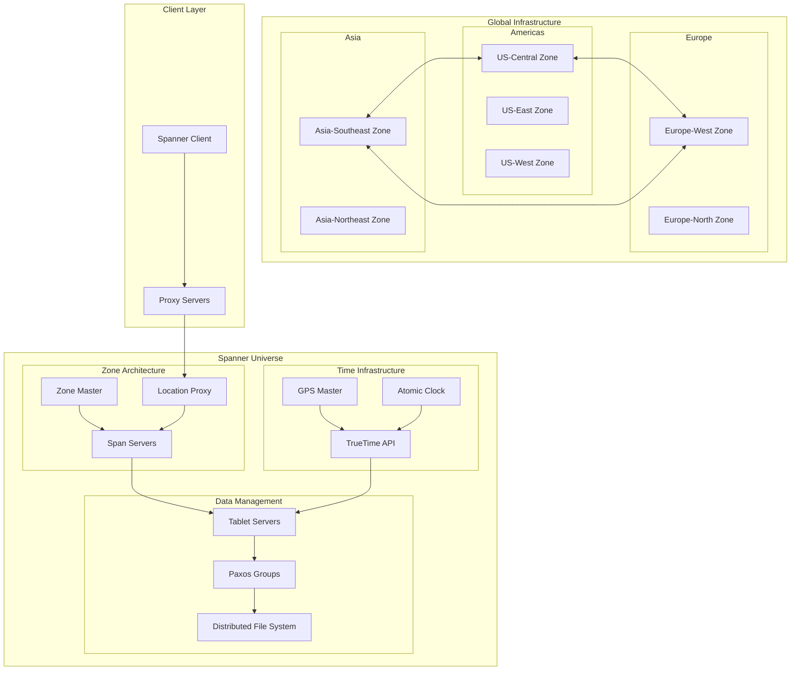
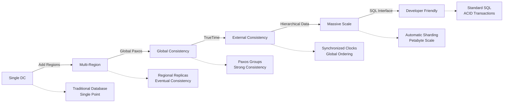

# Google Spanner: Scale and Architecture Deep Dive

!!! abstract "Quick Facts"

    | Metric | Value |
    |--------|-------|
    | **Scale** | Billions of users globally |
    | **Throughput** | Millions of transactions/second |
    | **Data Volume** | Exabytes across datacenters |
    | **Availability** | 99.999% uptime SLA |
    | **Team Size** | 500+ engineers |

## Executive Summary

Google Spanner revolutionized distributed database design by achieving something previously thought impossible: globally distributed ACID transactions with external consistency. Through innovative use of synchronized atomic clocks (TrueTime), Spanner provides strong consistency guarantees while scaling across continents. The system demonstrates how fundamental physics constraints can be overcome through careful engineering and novel time synchronization techniques.

## System Overview

### Business Context

  

    <h3 class="card__title">Problem Space</h3>
    
Provide globally consistent database for AdWords billing system requiring ACID guarantees at planetary scale

  

  

    <h3 class="card__title">Constraints</h3>
    
Must maintain consistency across continents, handle datacenter failures, and support SQL queries

  

  

    <h3 class="card__title">Success Metrics</h3>
    
External consistency, 99.999% availability, sub-100ms read latency globally

  

### High-Level Architecture

## Mapping to Fundamental Laws

### Law Analysis

<table class="responsive-table">
<thead>
  <tr>
    <th>Law</th>
    <th>Challenge</th>
    <th>Solution</th>
    <th>Trade-off</th>
  </tr>
</thead>
<tbody>
  <tr>
    <td data-label="Law">Correlated Failure</td>
    <td data-label="Challenge">Datacenter-wide outages across continents</td>
    <td data-label="Solution">Multi-region Paxos groups, automated failover</td>
    <td data-label="Trade-off">5x storage overhead, complex coordination</td>
  </tr>
  <tr>
    <td data-label="Law">Asynchronous Reality</td>
    <td data-label="Challenge">Network delays between continents (150ms+)</td>
    <td data-label="Solution">TrueTime API with GPS/atomic clocks, read-only transactions</td>
    <td data-label="Trade-off">Expensive time infrastructure, commit wait delays</td>
  </tr>
  <tr>
    <td data-label="Law">Emergent Chaos</td>
    <td data-label="Challenge">Concurrent transactions across global replicas</td>
    <td data-label="Solution">Two-phase commit with Paxos, timestamp ordering</td>
    <td data-label="Trade-off">Higher latency for write transactions</td>
  </tr>
  <tr>
    <td data-label="Law">Multidimensional Optimization</td>
    <td data-label="Challenge">Balance consistency, latency, and availability</td>
    <td data-label="Solution">Hierarchical timestamps, lock-free reads</td>
    <td data-label="Trade-off">Complex implementation and operational overhead</td>
  </tr>
  <tr>
    <td data-label="Law">Distributed Knowledge</td>
    <td data-label="Challenge">Monitoring thousands of Paxos groups globally</td>
    <td data-label="Solution">Comprehensive telemetry, automated diagnosis</td>
    <td data-label="Trade-off">Significant monitoring infrastructure costs</td>
  </tr>
  <tr>
    <td data-label="Law">Cognitive Load</td>
    <td data-label="Challenge">Managing globally distributed consensus</td>
    <td data-label="Solution">Automated shard management, SQL interface</td>
    <td data-label="Trade-off">Hidden complexity makes debugging difficult</td>
  </tr>
  <tr>
    <td data-label="Law">Economic Reality</td>
    <td data-label="Challenge">Massive infrastructure cost for global consistency</td>
    <td data-label="Solution">Shared infrastructure across Google services</td>
    <td data-label="Trade-off">Only viable at Google's scale and requirements</td>
  </tr>
</tbody>
</table>

## Design Deep Dive

### Data Architecture

!!! tip "Key Design Decisions"
    1. **TrueTime API**: GPS and atomic clock synchronization providing global time ordering
    2. **Multi-Version Concurrency Control**: Timestamp-based MVCC for lock-free reads
    3. **Hierarchical Partitioning**: Directory-based sharding with automatic rebalancing
    4. **Paxos for Consensus**: Multi-region Paxos groups for strong consistency guarantees

### Scaling Strategy

## Failure Scenarios & Lessons

!!! danger "Major Incident: 2011 Datacenter Network Partition"
    **What Happened**: Network partition isolated a major Google datacenter, testing Spanner's consensus mechanisms under extreme conditions during early deployment.

    **Root Cause**: 
    - Fiber optic cable cuts isolating entire datacenter
    - Majority of Paxos groups lost quorum simultaneously
    - Clock skew issues during partition recovery

    **Impact**: 
    - 4 hours of reduced availability for affected services
    - Some transactions blocked waiting for consensus
    - AdWords billing temporarily unavailable in affected regions
    - Demonstrated resilience but revealed edge cases in recovery

    **Lessons Learned**:
    1. **Quorum placement**: Better geographic distribution of Paxos group replicas
    2. **Clock synchronization**: Enhanced TrueTime uncertainty handling during partitions
    3. **Graceful degradation**: Improved read-only operation during consensus failures

## Performance Characteristics

### Latency Breakdown

  

    <h3 class="card__title">Read Latency</h3>
    
5-10ms

  

  

    <h3 class="card__title">Write Latency</h3>
    
50-100ms

  

  

    <h3 class="card__title">Global Transaction</h3>
    
100-300ms

  

### Resource Utilization

| Resource | Usage | Efficiency |
|----------|-------|------------|
| Storage | 5x overhead | Strong consistency guarantees |
| Network | High inter-region | Global synchronization required |
| CPU | Moderate | Optimized Paxos implementation |
| Time Infrastructure | GPS + Atomic | Sub-microsecond accuracy |

## Operational Excellence

### Monitoring & Observability

- **Metrics**: Comprehensive telemetry for Paxos groups, TrueTime uncertainty, and transaction latencies
- **Logging**: Distributed transaction logs with causal ordering preservation
- **Tracing**: End-to-end transaction tracing across global infrastructure
- **Alerting**: SLO-based monitoring with automated remediation for common failures

### Deployment Strategy

!!! note
    **Deployment Frequency**: Weekly rolling updates across global zones
    **Rollout Strategy**: Gradual zone-by-zone deployment with automated rollback
    **Rollback Time**: < 30 minutes with consistent state preservation
    **Schema Changes**: Online schema migrations with backward compatibility

## Key Innovations

1. **TrueTime API**: First production system to use synchronized atomic clocks for distributed consensus
2. **External Consistency**: Achieved global linearizability through careful timestamp ordering
3. **SQL at Scale**: Demonstrated that SQL interfaces can work at planetary scale with strong consistency

## Applicable Patterns

  <a href="../../patterns/consensus/" class="pattern-card">
    <h3 class="pattern-card__title">Multi-Paxos</h3>
    
Consensus across global replicas with leader election

  </a>
  <a href="../../patterns/mvcc/" class="pattern-card">
    <h3 class="pattern-card__title">MVCC</h3>
    
Multi-version concurrency control for lock-free reads

  </a>
  <a href="../../patterns/two-phase-commit/" class="pattern-card">
    <h3 class="pattern-card__title">Two-Phase Commit</h3>
    
Global transaction coordination with Paxos groups

  </a>
  <a href="../../patterns/leader-follower/" class="pattern-card">
    <h3 class="pattern-card__title">Leader-Follower</h3>
    
Paxos leaders handle writes, followers serve reads

  </a>

## Takeaways for Your System

!!! quote "Key Lessons"
    1. **When to apply**: Use for systems requiring global ACID transactions with strong consistency (financial, billing systems)
    2. **When to avoid**: Don't use for systems that can tolerate eventual consistency or don't need global distribution
    3. **Cost considerations**: Expect 5-10x infrastructure cost compared to eventually consistent systems
    4. **Team requirements**: Need deep expertise in distributed systems, consensus algorithms, and time synchronization

## Further Reading

- [Spanner: Google's Globally-Distributed Database (OSDI 2012)](https://research.google/pubs/pub39966/)
- [Spanner: Becoming a SQL System (SIGMOD 2017)](https://research.google/pubs/pub46103/)
- [TrueTime and the CAP Theorem](https://cloud.google.com/spanner/docs/true-time-external-consistency)
- [Cloud Spanner Documentation](https://cloud.google.com/spanner/docs)

## Discussion Questions

1. How does TrueTime's uncertainty bound affect transaction latency and what are the trade-offs?
2. Could Spanner's architecture work without the GPS/atomic clock infrastructure? What alternatives exist?
3. How would you design a similar system for a company without Google's global infrastructure?
4. What are the implications of Spanner's external consistency guarantees for application design?