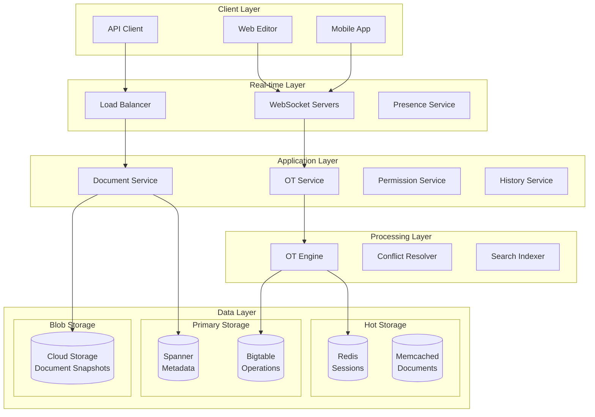
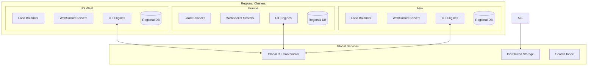
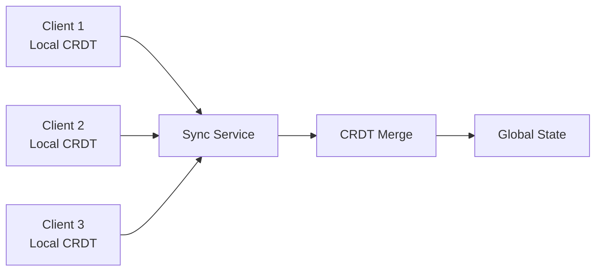
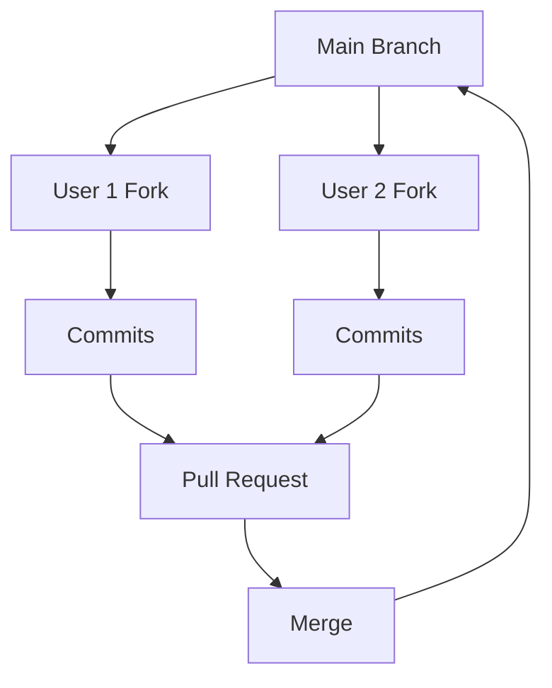

# 📄 Design Google Docs

## Problem Statement

Design a real-time collaborative document editing system that:
- Supports millions of concurrent users
- Enables real-time collaboration with multiple editors
- Handles conflict resolution seamlessly
- Maintains document history and versioning
- Works offline with sync capabilities
- Supports rich text formatting and embedded media
- Scales globally with low latency

## 1. Problem Clarification Questions

**Functional Requirements:**
- Q: What document features do we support? (text, tables, images, comments)
- Q: How many concurrent editors per document? (10, 100, unlimited?)
- Q: Do we need offline editing with sync?
- Q: What about version history and revision tracking?
- Q: Should we support different permission levels? (view, comment, edit)

**Scale Requirements:**
- Q: Number of active users? (1B+ Google accounts)
- Q: Documents created per day? (100M+)
- Q: Average document size? (10KB text, up to 50MB with images)
- Q: Concurrent editors globally? (10M+)
- Q: Storage requirements? (Petabytes)

**Technical Requirements:**
- Q: Real-time sync latency? (<100ms for text changes)
- Q: Conflict resolution approach? (Operational Transformation vs CRDTs)
- Q: Document size limits? (50MB)
- Q: Offline duration support? (30 days)
- Q: API requirements? (REST + WebSocket)

## 2. Functional Requirements

Core features to implement:

1. **Document Creation/Editing** - Rich text editor with formatting
2. **Real-time Collaboration** - See others' changes instantly
3. **Conflict Resolution** - Handle simultaneous edits
4. **Version History** - Track all changes with rollback
5. **Permissions** - Share with view/comment/edit access
6. **Offline Support** - Edit without internet, sync later
7. **Comments & Suggestions** - Collaborative feedback

## 3. Non-Functional Requirements

- **Scale**: 1B+ users, 10M+ concurrent editors
- **Performance**: <100ms sync latency, instant typing response
- **Availability**: 99.99% uptime
- **Consistency**: Eventual consistency, no data loss
- **Storage**: Petabyte-scale document storage
- **Security**: Encryption, access control, audit logs

## 4. Capacity Estimation

### Storage Requirements

```
Document Storage:
- 1B users × 100 docs average × 50KB = 5 PB
- Version history: 20 versions avg × 10KB diff = 200 KB/doc
- Total with versions: 1B × 100 × 250KB = 25 PB
- With 3x replication: 75 PB

Real-time State:
- 10M concurrent sessions × 100KB state = 1 TB in memory
- Operation log: 1M ops/sec × 100 bytes × 1 day = 8.6 TB/day

Metadata:
- Document metadata: 100B docs × 1KB = 100 TB
- Permissions: 100B × 10 shares × 100 bytes = 100 TB
```

### Bandwidth Requirements

```
Real-time Updates:
- 10M concurrent users × 10 ops/min × 100 bytes = 167 MB/s
- Peak with bursts: 500 MB/s = 4 Gbps

Document Operations:
- 100M saves/day × 50KB = 5 TB/day = 58 MB/s
- Document loads: 1B/day × 50KB = 50 TB/day = 580 MB/s

Total bandwidth: ~5-10 Gbps sustained, 50 Gbps peak
```

### Compute Requirements

```
Operation Transform:
- 1M ops/sec × 1ms processing = 1000 CPU-seconds/sec
- ~1000 cores for OT processing

Document Rendering:
- 100M renders/day × 100ms = 10M seconds/day
- ~120 cores for rendering

WebSocket Connections:
- 10M concurrent × 1KB memory = 10 GB RAM per server
- 1000 connections/server = 10,000 servers
```

## 5. API Design

### Document APIs

```python
# Create document
POST /api/v1/documents
Headers: Authorization: Bearer {token}
Body: {
  "title": "My Document",
  "content": {
    "ops": [  # Quill Delta format
      {"insert": "Hello World\n"},
      {"insert": "This is ", "attributes": {"bold": true}},
      {"insert": "Google Docs"}
    ]
  }
}

Response: {
  "document_id": "doc_abc123",
  "created_at": "2024-01-20T10:00:00Z",
  "owner": "user@example.com",
  "revision": 1,
  "edit_url": "https://docs.google.com/document/d/doc_abc123/edit"
}

# Get document
GET /api/v1/documents/{document_id}?revision={revision_number}

Response: {
  "document_id": "doc_abc123",
  "title": "My Document",
  "content": {...},
  "revision": 42,
  "last_modified": "2024-01-20T11:30:00Z",
  "collaborators": [
    {
      "user_id": "user123",
      "name": "John Doe",
      "cursor_position": 156,
      "selection": {"start": 150, "end": 160}
    }
  ]
}
```

### Real-time Collaboration

```python
# WebSocket connection for real-time updates
ws://docs.google.com/api/v1/documents/{document_id}/stream

# Client sends operation
{
  "type": "operation",
  "operation": {
    "ops": [
      {"retain": 10},
      {"insert": "new text"},
      {"delete": 5}
    ]
  },
  "revision": 42,
  "client_id": "client_xyz"
}

# Server broadcasts transformed operation
{
  "type": "operation",
  "operation": {
    "ops": [{"retain": 10}, {"insert": "new text"}]
  },
  "revision": 43,
  "author": "user123",
  "timestamp": "2024-01-20T10:00:00.123Z"
}

# Cursor/selection updates
{
  "type": "cursor",
  "user_id": "user123",
  "cursor": 156,
  "selection": {"start": 150, "end": 160}
}

# Presence updates
{
  "type": "presence",
  "action": "join|leave",
  "user": {
    "user_id": "user123",
    "name": "John Doe",
    "color": "#4285f4"
  }
}
```

### Version History

```python
# Get document history
GET /api/v1/documents/{document_id}/history?limit=50

Response: {
  "revisions": [
    {
      "revision": 43,
      "timestamp": "2024-01-20T11:30:00Z",
      "author": "user123",
      "changes_summary": "Added paragraph about...",
      "operations_count": 15
    }
  ]
}

# Get specific revision
GET /api/v1/documents/{document_id}/revisions/{revision}

# Compare revisions
GET /api/v1/documents/{document_id}/diff?from=40&to=43

# Restore revision
POST /api/v1/documents/{document_id}/restore
Body: {
  "revision": 40,
  "reason": "Reverting accidental changes"
}
```

### Permissions

```python
# Share document
POST /api/v1/documents/{document_id}/permissions
Body: {
  "email": "collaborator@example.com",
  "role": "editor",  # viewer|commenter|editor|owner
  "send_notification": true,
  "message": "Please review this document"
}

# List permissions
GET /api/v1/documents/{document_id}/permissions

# Update permission
PUT /api/v1/documents/{document_id}/permissions/{permission_id}
Body: {
  "role": "viewer"
}
```

## 6. Data Model

### Document Structure

```python
# Document metadata (Spanner)
class Document:
    document_id: str
    title: str
    owner_id: str
    created_at: datetime
    last_modified: datetime
    revision: int
    size_bytes: int
    is_deleted: bool
    parent_folder_id: str
    
# Document content (Distributed storage)
class DocumentContent:
    document_id: str
    revision: int
    content: dict  # Delta format or custom
    checksum: str
    
# Operation log (Bigtable - time series)
class Operation:
    document_id: str
    revision: int
    timestamp: datetime
    author_id: str
    operation: dict  # OT operation
    client_id: str
    parent_revision: int
    
# Active sessions (Redis)
class EditSession:
    session_id: str
    document_id: str
    user_id: str
    websocket_id: str
    cursor_position: int
    selection: dict
    last_seen: datetime
    
# Permissions (Spanner)
class Permission:
    permission_id: str
    document_id: str
    user_email: str
    role: str  # viewer|commenter|editor|owner
    created_at: datetime
    created_by: str
```

### Operational Transform Data

```python
# OT Operation format
class OTOperation:
    ops: List[Op]
    
class Op:
# One of: retain, insert, delete
    retain: Optional[int]
    insert: Optional[str]
    delete: Optional[int]
    attributes: Optional[dict]  # formatting
    
# Transform state
class TransformState:
    document_id: str
    server_revision: int
    pending_operations: List[OTOperation]
    acknowledged_operations: dict  # client_id -> revision
```

## 7. High-Level Architecture



## 8. Detailed Design

### Operational Transform Engine

```python
class OperationalTransform:
    """
    Core OT algorithm for collaborative editing
    """
    def __init__(self):
        self.operations_log = OperationsLog()
        self.transform_matrix = TransformMatrix()
        
    def handle_client_operation(self, client_op: ClientOperation) -> ServerOperation:
        """Process operation from client"""
# 1. Get operations since client's revision
        concurrent_ops = self.operations_log.get_operations_since(
            client_op.document_id,
            client_op.base_revision
        )
        
# 2. Transform client operation against concurrent operations
        transformed_op = client_op.operation
        for server_op in concurrent_ops:
            transformed_op, _ = self.transform(
                transformed_op,
                server_op.operation,
                'left'  # client op takes priority
            )
            
# 3. Apply to document
        new_revision = self.operations_log.get_latest_revision(
            client_op.document_id
        ) + 1
        
# 4. Store operation
        server_operation = ServerOperation(
            document_id=client_op.document_id,
            revision=new_revision,
            operation=transformed_op,
            author_id=client_op.author_id,
            timestamp=datetime.now()
        )
        
        self.operations_log.append(server_operation)
        
        return server_operation
    
    def transform(self, op1: Operation, op2: Operation, 
                 priority: str = 'left') -> Tuple[Operation, Operation]:
        """
        Transform op1 against op2
        Returns (op1', op2') where op1' is op1 transformed against op2
        """
        transformed_ops1 = []
        transformed_ops2 = []
        
        ops1 = op1.ops.copy()
        ops2 = op2.ops.copy()
        
        i1 = i2 = 0
        
        while i1 < len(ops1) or i2 < len(ops2):
            if i1 >= len(ops1):
                transformed_ops2.extend(ops2[i2:])
                break
            if i2 >= len(ops2):
                transformed_ops1.extend(ops1[i1:])
                break
                
            component1 = ops1[i1]
            component2 = ops2[i2]
            
            if 'retain' in component1 and 'retain' in component2:
# Both retain
                length = min(component1['retain'], component2['retain'])
                transformed_ops1.append({'retain': length})
                transformed_ops2.append({'retain': length})
                
                component1['retain'] -= length
                component2['retain'] -= length
                
                if component1['retain'] == 0:
                    i1 += 1
                if component2['retain'] == 0:
                    i2 += 1
                    
            elif 'insert' in component1 and 'retain' in component2:
# op1 inserts, op2 retains
                transformed_ops1.append(component1)
                transformed_ops2.append({'retain': len(component1['insert'])})
                i1 += 1
                
            elif 'retain' in component1 and 'insert' in component2:
# op1 retains, op2 inserts
                transformed_ops1.append({'retain': len(component2['insert'])})
                transformed_ops2.append(component2)
                i2 += 1
                
            elif 'insert' in component1 and 'insert' in component2:
# Both insert - use priority
                if priority == 'left':
                    transformed_ops1.append(component1)
                    transformed_ops2.append({'retain': len(component1['insert'])})
                    i1 += 1
                else:
                    transformed_ops1.append({'retain': len(component2['insert'])})
                    transformed_ops2.append(component2)
                    i2 += 1
                    
            elif 'delete' in component1 and 'delete' in component2:
# Both delete same content
                length = min(component1['delete'], component2['delete'])
                component1['delete'] -= length
                component2['delete'] -= length
                
                if component1['delete'] == 0:
                    i1 += 1
                if component2['delete'] == 0:
                    i2 += 1
                    
# Handle other cases...
            
        return (
            Operation(ops=self._compress_ops(transformed_ops1)),
            Operation(ops=self._compress_ops(transformed_ops2))
        )
    
    def _compress_ops(self, ops: List[dict]) -> List[dict]:
        """Compress consecutive operations of same type"""
        if not ops:
            return []
            
        compressed = [ops[0]]
        
        for op in ops[1:]:
            last = compressed[-1]
            
            if 'retain' in op and 'retain' in last:
                last['retain'] += op['retain']
            elif 'insert' in op and 'insert' in last:
                last['insert'] += op['insert']
            elif 'delete' in op and 'delete' in last:
                last['delete'] += op['delete']
            else:
                compressed.append(op)
                
        return compressed
```

### Real-time Synchronization

```python
class RealtimeDocumentSync:
    def __init__(self):
        self.websocket_manager = WebSocketManager()
        self.document_sessions = {}  # document_id -> set of sessions
        self.ot_engine = OperationalTransform()
        
    async def handle_websocket_connection(self, ws: WebSocket, 
                                        document_id: str, user_id: str):
        """Handle new WebSocket connection"""
# 1. Create session
        session = EditSession(
            session_id=str(uuid.uuid4()),
            document_id=document_id,
            user_id=user_id,
            websocket=ws,
            last_revision=0
        )
        
# 2. Add to document sessions
        if document_id not in self.document_sessions:
            self.document_sessions[document_id] = set()
        self.document_sessions[document_id].add(session)
        
# 3. Send initial state
        await self._send_initial_state(session)
        
# 4. Notify others of new collaborator
        await self._broadcast_presence(document_id, 'join', user_id)
        
# 5. Handle messages
        try:
            async for message in ws:
                await self._handle_message(session, message)
        finally:
# Clean up on disconnect
            self.document_sessions[document_id].remove(session)
            await self._broadcast_presence(document_id, 'leave', user_id)
    
    async def _handle_message(self, session: EditSession, message: dict):
        """Process message from client"""
        msg_type = message.get('type')
        
        if msg_type == 'operation':
            await self._handle_operation(session, message)
        elif msg_type == 'cursor':
            await self._handle_cursor_update(session, message)
        elif msg_type == 'selection':
            await self._handle_selection_update(session, message)
        elif msg_type == 'save':
            await self._handle_save_request(session)
            
    async def _handle_operation(self, session: EditSession, message: dict):
        """Handle document edit operation"""
# 1. Create client operation
        client_op = ClientOperation(
            document_id=session.document_id,
            operation=Operation(ops=message['operation']['ops']),
            base_revision=message['revision'],
            author_id=session.user_id,
            client_id=message.get('client_id')
        )
        
# 2. Transform and apply
        try:
            server_op = self.ot_engine.handle_client_operation(client_op)
            
# 3. Acknowledge to sender
            await session.websocket.send_json({
                'type': 'ack',
                'client_id': client_op.client_id,
                'revision': server_op.revision
            })
            
# 4. Broadcast to other clients
            await self._broadcast_operation(
                session.document_id,
                server_op,
                exclude_session=session
            )
            
# 5. Update session revision
            session.last_revision = server_op.revision
            
        except TransformException as e:
# Send error to client
            await session.websocket.send_json({
                'type': 'error',
                'error': str(e),
                'client_id': client_op.client_id
            })
    
    async def _broadcast_operation(self, document_id: str, 
                                 operation: ServerOperation,
                                 exclude_session: EditSession = None):
        """Broadcast operation to all document sessions"""
        if document_id not in self.document_sessions:
            return
            
        message = {
            'type': 'operation',
            'operation': {
                'ops': operation.operation.ops
            },
            'revision': operation.revision,
            'author': operation.author_id,
            'timestamp': operation.timestamp.isoformat()
        }
        
# Send to all sessions except sender
        tasks = []
        for session in self.document_sessions[document_id]:
            if session != exclude_session:
                tasks.append(session.websocket.send_json(message))
                
        await asyncio.gather(*tasks, return_exceptions=True)
```

### Offline Support and Sync

```python
class OfflineDocumentSync:
    def __init__(self):
        self.conflict_resolver = ConflictResolver()
        self.operation_store = OperationStore()
        
    async def sync_offline_changes(self, document_id: str, 
                                  offline_operations: List[Operation],
                                  last_known_revision: int) -> SyncResult:
        """Sync document after being offline"""
# 1. Get all server operations since last known revision
        server_ops = await self.operation_store.get_operations_since(
            document_id,
            last_known_revision
        )
        
# 2. Transform offline operations against server operations
        transformed_offline_ops = []
        
        for offline_op in offline_operations:
            transformed = offline_op
            
# Transform against each server operation
            for server_op in server_ops:
                transformed, _ = self.ot_engine.transform(
                    transformed,
                    server_op.operation,
                    'right'  # server ops take priority
                )
                
            transformed_offline_ops.append(transformed)
        
# 3. Apply transformed offline operations
        applied_ops = []
        current_revision = last_known_revision + len(server_ops)
        
        for op in transformed_offline_ops:
            try:
                server_op = await self._apply_operation(
                    document_id,
                    op,
                    current_revision
                )
                applied_ops.append(server_op)
                current_revision += 1
            except ConflictException as e:
# Handle unresolvable conflicts
                conflict = self.conflict_resolver.create_conflict_branch(
                    document_id,
                    op,
                    e
                )
                
# 4. Return sync result
        return SyncResult(
            success=True,
            new_revision=current_revision,
            applied_operations=applied_ops,
            server_operations=server_ops,
            conflicts=conflicts if conflicts else None
        )
    
    async def download_for_offline(self, document_id: str) -> OfflineDocument:
        """Prepare document for offline editing"""
# Get current document state
        document = await self.document_service.get_document(document_id)
        
# Get recent operations for conflict resolution
        recent_ops = await self.operation_store.get_recent_operations(
            document_id,
            limit=1000  # Last 1000 operations
        )
        
# Create offline package
        return OfflineDocument(
            document_id=document_id,
            content=document.content,
            revision=document.revision,
            recent_operations=recent_ops,
            download_time=datetime.now(),
            checksum=self._calculate_checksum(document.content)
        )
```

### Version History and Time Travel

```python
class DocumentHistory:
    def __init__(self):
        self.operation_store = OperationStore()
        self.snapshot_store = SnapshotStore()
        
    async def get_document_at_revision(self, document_id: str, 
                                     revision: int) -> Document:
        """Reconstruct document at specific revision"""
# 1. Find nearest snapshot before revision
        snapshot = await self.snapshot_store.get_nearest_snapshot(
            document_id,
            revision
        )
        
        if not snapshot:
# Start from empty document
            document_state = Document(content="")
            start_revision = 0
        else:
            document_state = snapshot.document
            start_revision = snapshot.revision
            
# 2. Apply operations from snapshot to target revision
        operations = await self.operation_store.get_operations_range(
            document_id,
            start_revision + 1,
            revision
        )
        
        for op in operations:
            document_state = self._apply_operation_to_document(
                document_state,
                op.operation
            )
            
        return document_state
    
    async def create_snapshot(self, document_id: str, revision: int):
        """Create document snapshot for faster history access"""
# Get document at revision
        document = await self.get_document_at_revision(document_id, revision)
        
# Store snapshot
        snapshot = DocumentSnapshot(
            document_id=document_id,
            revision=revision,
            document=document,
            created_at=datetime.now()
        )
        
        await self.snapshot_store.save(snapshot)
        
    async def get_revision_graph(self, document_id: str, 
                               start_revision: int,
                               end_revision: int) -> RevisionGraph:
        """Get visual revision graph with authors and changes"""
        operations = await self.operation_store.get_operations_range(
            document_id,
            start_revision,
            end_revision
        )
        
# Build revision graph
        nodes = []
        for op in operations:
            node = RevisionNode(
                revision=op.revision,
                author=op.author_id,
                timestamp=op.timestamp,
                change_summary=self._summarize_operation(op.operation),
                character_delta=self._calculate_delta(op.operation)
            )
            nodes.append(node)
            
        return RevisionGraph(nodes=nodes)
```

### Permission Management

```python
class PermissionService:
    def __init__(self):
        self.permission_store = PermissionStore()
        self.cache = PermissionCache()
        
    async def check_permission(self, document_id: str, 
                             user_id: str, 
                             action: str) -> bool:
        """Check if user has permission for action"""
# Check cache first
        cache_key = f"{document_id}:{user_id}"
        cached_perm = await self.cache.get(cache_key)
        
        if cached_perm:
            return self._has_permission(cached_perm, action)
            
# Load from database
        permission = await self.permission_store.get_user_permission(
            document_id,
            user_id
        )
        
        if not permission:
# Check if document is public
            doc = await self.document_service.get_document(document_id)
            if doc.is_public and action == 'view':
                return True
            return False
            
# Cache permission
        await self.cache.set(cache_key, permission, ttl=300)
        
        return self._has_permission(permission, action)
    
    def _has_permission(self, permission: Permission, action: str) -> bool:
        """Check if permission level allows action"""
        permission_levels = {
            'viewer': ['view'],
            'commenter': ['view', 'comment'],
            'editor': ['view', 'comment', 'edit'],
            'owner': ['view', 'comment', 'edit', 'delete', 'share']
        }
        
        allowed_actions = permission_levels.get(permission.role, [])
        return action in allowed_actions
```

### Rich Text and Media Support

```python
class RichTextProcessor:
    def __init__(self):
        self.media_store = MediaStore()
        self.formatter = TextFormatter()
        
    async def process_document_content(self, content: dict) -> ProcessedContent:
        """Process rich text content with embedded media"""
        processed_ops = []
        
        for op in content.get('ops', []):
            if 'insert' in op:
                if isinstance(op['insert'], dict):
# Handle embedded objects
                    if 'image' in op['insert']:
                        processed_op = await self._process_image(op)
                    elif 'video' in op['insert']:
                        processed_op = await self._process_video(op)
                    elif 'formula' in op['insert']:
                        processed_op = await self._process_formula(op)
                    else:
                        processed_op = op
                else:
# Text content
                    processed_op = self._process_text(op)
            else:
                processed_op = op
                
            processed_ops.append(processed_op)
            
        return ProcessedContent(ops=processed_ops)
    
    async def _process_image(self, op: dict) -> dict:
        """Process embedded image"""
        image_data = op['insert']['image']
        
        if image_data.startswith('data:'):
# Upload base64 image
            url = await self.media_store.upload_image(image_data)
            op['insert']['image'] = url
            
# Add responsive variants
        if 'attributes' not in op:
            op['attributes'] = {}
            
        op['attributes']['srcset'] = await self._generate_responsive_images(
            op['insert']['image']
        )
        
        return op
```

## 9. Scale Considerations

### Global Architecture



### Sharding Strategy

```python
class DocumentSharding:
    def __init__(self):
        self.shard_count = 10000
        self.region_map = RegionMap()
        
    def get_document_shard(self, document_id: str) -> str:
        """Determine shard for document"""
# Hash-based sharding for even distribution
        shard_id = hash(document_id) % self.shard_count
        return f"shard_{shard_id}"
        
    def get_operation_shard(self, document_id: str, timestamp: datetime) -> str:
        """Time-based sharding for operations"""
# Operations sharded by document and time
        doc_shard = self.get_document_shard(document_id)
        time_bucket = timestamp.strftime("%Y%m")
        return f"{doc_shard}_{time_bucket}"
        
    def get_websocket_server(self, document_id: str, user_location: str) -> str:
        """Route to nearest WebSocket server"""
        region = self.region_map.get_nearest_region(user_location)
        doc_shard = hash(document_id) % 100  # 100 servers per region
        return f"{region}_ws_{doc_shard}"
```

### Performance Optimizations

```python
class PerformanceOptimizer:
    def __init__(self):
        self.cache = MultiLevelCache()
        self.cdn = CDNService()
        
    async def optimize_document_loading(self, document_id: str):
        """Optimize document load performance"""
# 1. Preload frequently accessed documents
        access_frequency = await self.get_access_frequency(document_id)
        if access_frequency > 100:  # Hot document
            await self.cache.preload(document_id)
            
# 2. Generate static preview for read-only users
        preview = await self.generate_static_preview(document_id)
        await self.cdn.cache(f"preview_{document_id}", preview)
        
# 3. Compress operation history
        old_operations = await self.get_old_operations(document_id)
        compressed = await self.compress_operations(old_operations)
        await self.archive_operations(document_id, compressed)
```

## 10. Trade-offs and Alternatives

### Architecture Decisions

| Decision | Choice | Alternative | Trade-off |
|----------|--------|-------------|-----------|
| **Conflict Resolution** | Operational Transform | CRDTs | Proven vs Simpler |
| **Storage** | Separate ops + snapshots | Full doc versions | Space vs Reconstruction time |
| **Real-time** | WebSocket | Long polling | Latency vs Complexity |
| **Sharding** | Document-based | User-based | Collaboration vs Distribution |
| **History** | Full operation log | Periodic snapshots | Granularity vs Storage |


### Alternative Architectures

#### Alternative 1: CRDT-based Architecture


**Pros**: No central coordination, automatic conflict resolution
**Cons**: Larger data structures, limited operation types

#### Alternative 2: Git-like Architecture


**Pros**: Powerful branching, complete history
**Cons**: Not real-time, complex for non-developers

## 11. Monitoring and Analytics

### Key Metrics

```python
class GoogleDocsMetrics:
    def __init__(self):
        self.metrics = {
# Performance metrics
            'operation_latency': Histogram('docs_operation_ms'),
            'sync_latency': Histogram('docs_sync_latency_ms'),
            'document_load_time': Histogram('docs_load_time_ms'),
            
# Scale metrics
            'concurrent_editors': Gauge('docs_concurrent_editors'),
            'operations_per_second': Counter('docs_ops_per_sec'),
            'active_documents': Gauge('docs_active_documents'),
            
# Quality metrics
            'conflict_rate': Gauge('docs_conflicts_per_hour'),
            'sync_failures': Counter('docs_sync_failures'),
            'data_loss_incidents': Counter('docs_data_loss'),
            
# Business metrics
            'documents_created': Counter('docs_created_daily'),
            'collaboration_sessions': Counter('docs_collab_sessions'),
            'storage_used': Gauge('docs_storage_bytes')
        }
```

### Real-time Dashboard

```mermaid
graph TB
    subgraph "System Health"
        OPS[Operations/sec<br/>1.2M ✓]
        LATENCY[Sync Latency<br/>87ms p99 ✓]
        EDITORS[Concurrent<br/>8.7M users]
    end
    
    subgraph "Quality Metrics"
        CONFLICTS[Conflicts/hour<br/>0.02% ✓]
        SUCCESS[Sync Success<br/>99.98% ✓]
        UPTIME[Uptime<br/>99.99% ✓]
    end
```



## 12. Security and Privacy

### Security Measures

```python
class DocumentSecurity:
    def __init__(self):
        self.encryption = EncryptionService()
        self.audit_log = AuditLogger()
        
    async def secure_document(self, document: Document):
        """Apply security measures to document"""
# 1. Encrypt sensitive content
        if document.is_confidential:
            document.content = await self.encryption.encrypt(
                document.content,
                document.encryption_key
            )
            
# 2. Audit log access
        await self.audit_log.log_access(
            document_id=document.id,
            user_id=current_user.id,
            action='view',
            ip_address=request.remote_addr
        )
        
# 3. Apply DLP scanning
        dlp_result = await self.dlp_scanner.scan(document.content)
        if dlp_result.has_sensitive_data:
            await self.handle_dlp_violation(document, dlp_result)
```

### Privacy Features
- **Access Control**: Granular permissions (view/comment/edit)
- **Encryption**: At-rest and in-transit encryption
- **Audit Trail**: Complete history of document access
- **Data Location**: Control where documents are stored
- **Right to Delete**: Complete removal including history

## Conclusion

This Google Docs design demonstrates building a real-time collaborative editor that:
- Handles millions of concurrent editors with <100ms latency
- Resolves conflicts seamlessly using Operational Transformation
- Maintains complete version history with time travel
- Works offline with intelligent sync
- Scales globally with regional architecture

Key architectural insights:
1. **Operational Transform** enables real-time collaboration without locks
2. **WebSocket connections** provide low-latency bidirectional communication
3. **Operation log + snapshots** balance history granularity with performance
4. **Regional architecture** with global coordination handles worldwide scale
5. **Multi-level caching** ensures fast document access

### Interview Tips

When presenting this design:
1. Start with OT basics - it's the core innovation
2. Draw the operation flow: client → transform → broadcast
3. Explain offline sync strategy clearly
4. Discuss WebSocket scaling challenges
5. Don't forget about permissions and security