# 📧 Design Gmail

## Problem Statement

Design an email service that can:
- Handle 1.5 billion active users
- Process 300+ billion emails per day
- Provide powerful search across all emails
- Filter spam with 99.9%+ accuracy
- Support attachments up to 25MB
- Guarantee email delivery and storage
- Enable real-time push notifications

## 1. Problem Clarification Questions

**Functional Requirements:**
- Q: What email features do we need? (send, receive, folders, labels, filters)
- Q: Do we support protocols like IMAP/POP3/SMTP?
- Q: What about advanced features? (undo send, scheduling, confidential mode)
- Q: Should we include chat/video integration?
- Q: Do we need email encryption?

**Scale Requirements:**
- Q: How many active users? (1.5B+)
- Q: Emails per day? (300B+ including spam)
- Q: Average email size? (75KB with headers)
- Q: Attachment limits? (25MB per email)
- Q: Storage per user? (15GB free, expandable)

**Technical Requirements:**
- Q: Delivery time requirements? (<1 second for most)
- Q: Search latency? (<100ms)
- Q: Spam accuracy target? (99.9%+ detection, <0.001% false positive)
- Q: Availability target? (99.9%+)
- Q: Data retention? (Forever unless deleted)

## 2. Functional Requirements

Core features to implement:

1. **Send/Receive Emails** - Core email functionality
2. **Storage & Organization** - Folders, labels, archiving
3. **Search** - Full-text search across all emails
4. **Spam Filtering** - ML-based spam detection
5. **Attachments** - File attachments up to 25MB
6. **Filters & Rules** - Automated email organization
7. **Real-time Updates** - Push notifications

## 3. Non-Functional Requirements

- **Scale**: 1.5B users, 300B emails/day
- **Performance**: <1s delivery, <100ms search
- **Reliability**: 99.9% uptime, zero data loss
- **Storage**: Exabyte-scale email storage
- **Security**: End-to-end encryption option, 2FA
- **Compliance**: GDPR, data retention policies

## 4. Capacity Estimation

### Storage Requirements

```
Email Storage:
- 1.5B users × 15GB average = 22.5 EB total
- Daily new emails: 100B legitimate × 75KB = 7.5 PB/day
- Yearly growth: 7.5 PB × 365 = 2.7 EB/year
- Attachments: 10% emails × 5MB avg = 5 PB/day

Total storage with replication (3x): ~75 EB

Metadata Storage:
- Email headers/index: 100B emails × 1KB = 100 TB
- User data: 1.5B × 10KB = 15 TB
- Search index: ~10% of email data = 2.25 EB
```

### Bandwidth Requirements

```
Email Traffic:
- Incoming: 300B emails/day × 75KB = 22.5 PB/day = 260 GB/s
- Outgoing: 100B emails/day × 75KB = 7.5 PB/day = 87 GB/s
- Spam filtered: 200B × 75KB = 15 PB/day (not delivered)

Client Sync:
- 500M active users × 10 sync/day × 10KB = 50 TB/day = 0.6 GB/s

Total bandwidth: ~350 GB/s average, 1 TB/s peak
```

### Compute Requirements

```
Spam Filtering:
- 300B emails/day × 10ms processing = 3B seconds/day
- 3B / 86400 = 35,000 CPU-seconds/second = 35,000 cores

Search Indexing:
- 100B emails/day × 50ms indexing = 5B seconds/day
- ~60,000 cores for indexing

Email Routing:
- 300B emails/day simple routing = ~10,000 cores
```

## 5. API Design

### Email Operations

```python
# Send email
POST /api/v1/emails/send
Headers: Authorization: Bearer {token}
Body: {
  "to": ["user@example.com"],
  "cc": ["cc@example.com"],
  "bcc": ["bcc@example.com"],
  "subject": "Meeting Tomorrow",
  "body": {
    "text": "Plain text content",
    "html": "<p>HTML content</p>"
  },
  "attachments": [
    {
      "filename": "document.pdf",
      "content": "base64_encoded_content",
      "content_type": "application/pdf"
    }
  ],
  "send_at": "2024-01-20T10:00:00Z",  # Schedule send
  "confidential_mode": {
    "enabled": true,
    "expiry": "2024-01-27T10:00:00Z"
  }
}

Response: {
  "message_id": "<unique-id@mail.gmail.com>",
  "status": "sent",
  "thread_id": "thread_123"
}

# Get email
GET /api/v1/emails/{email_id}
Response: {
  "id": "email_123",
  "thread_id": "thread_123",
  "from": "sender@example.com",
  "to": ["recipient@example.com"],
  "subject": "Re: Meeting Tomorrow",
  "body": {
    "text": "...",
    "html": "..."
  },
  "received_at": "2024-01-20T09:00:00Z",
  "labels": ["inbox", "important"],
  "attachments": [...]
}

# List emails
GET /api/v1/emails?label=inbox&limit=50&page_token=xxx
Response: {
  "emails": [...],
  "next_page_token": "yyy",
  "total_unread": 12
}
```

### Email Management

```python
# Update labels
PUT /api/v1/emails/{email_id}/labels
Body: {
  "add": ["important", "work"],
  "remove": ["inbox"]
}

# Move to folder
POST /api/v1/emails/{email_id}/move
Body: {
  "folder": "archive"  # inbox|sent|drafts|spam|trash|archive
}

# Batch operations
POST /api/v1/emails/batch
Body: {
  "email_ids": ["id1", "id2", "id3"],
  "action": "mark_read|mark_unread|delete|spam|archive",
  "labels": {
    "add": ["label1"],
    "remove": ["label2"]
  }
}

# Create filter
POST /api/v1/filters
Body: {
  "criteria": {
    "from": "notifications@example.com",
    "subject_contains": "Alert",
    "has_attachment": true
  },
  "actions": {
    "add_labels": ["alerts"],
    "mark_as_read": true,
    "forward_to": "archive@example.com"
  }
}
```

### Search API

```python
# Search emails
GET /api/v1/emails/search?q=from:john@example.com subject:meeting after:2024-01-01

Response: {
  "results": [
    {
      "id": "email_123",
      "subject": "Meeting Notes",
      "snippet": "Here are the notes from our meeting...",
      "from": "john@example.com",
      "date": "2024-01-15T10:00:00Z",
      "relevance_score": 0.95
    }
  ],
  "total_results": 42,
  "search_time_ms": 67
}

# Search suggestions
GET /api/v1/search/suggest?q=from:joh
Response: {
  "suggestions": [
    "from:john@example.com",
    "from:john.doe@company.com"
  ]
}
```

## 6. Data Model

### Email Storage

```python
# Email message (Bigtable/Spanner)
class EmailMessage:
    message_id: str  # Unique identifier
    thread_id: str  # Conversation thread
    user_id: str  # Owner
    folder: str  # inbox|sent|drafts|spam|trash
    labels: List[str]
    
# Headers
    from_address: str
    to_addresses: List[str]
    cc_addresses: List[str]
    bcc_addresses: List[str]
    subject: str
    date: datetime
    
# Content
    body_text: str
    body_html: str
    headers: dict  # All MIME headers
    raw_size: int
    
# Metadata
    is_read: bool
    is_starred: bool
    importance: str  # high|normal|low
    spam_score: float
    
# Attachments (Object Storage)
class Attachment:
    attachment_id: str
    message_id: str
    filename: str
    content_type: str
    size: int
    storage_path: str  # Object storage reference
    checksum: str
    
# Thread/Conversation
class Thread:
    thread_id: str
    user_id: str
    subject: str  # Original subject
    participants: List[str]
    message_ids: List[str]  # Ordered
    last_message_date: datetime
    unread_count: int
```

### User Data

```python
# User account (Spanner)
class User:
    user_id: str
    email: str
    created_at: datetime
    storage_used: int
    storage_quota: int
    settings: dict
    
# Contacts (for autocomplete)
class Contact:
    user_id: str
    email: str
    name: str
    frequency: int  # Interaction count
    last_interaction: datetime
    
# Filters/Rules
class Filter:
    filter_id: str
    user_id: str
    criteria: dict  # Matching rules
    actions: dict  # What to do
    created_at: datetime
    enabled: bool
```

### Search Index

```python
# Inverted index for search (Custom or Elasticsearch)
class EmailIndex:
    term: str
    postings: List[EmailPosting]
    
class EmailPosting:
    message_id: str
    user_id: str
    field: str  # subject|body|from|to
    positions: List[int]
    score: float
```

## 7. High-Level Architecture


## 8. Detailed Design

### Email Receiving Pipeline

```python
class EmailReceiver:
    def __init__(self):
        self.spam_filter = SpamFilter()
        self.virus_scanner = VirusScanner()
        self.message_store = MessageStore()
        self.indexer = EmailIndexer()
        
    async def receive_email(self, smtp_envelope: SMTPEnvelope) -> str:
        """Process incoming email through the pipeline"""
# 1. Parse email
        message = self._parse_email(smtp_envelope.data)
        
# 2. Generate message ID
        message_id = self._generate_message_id()
        message.message_id = message_id
        
# 3. Spam check
        spam_result = await self.spam_filter.check(message)
        if spam_result.is_spam and spam_result.confidence > 0.99:
# Reject obvious spam
            await self._reject_spam(message, spam_result)
            return None
            
# 4. Virus scan
        if message.has_attachments:
            virus_result = await self.virus_scanner.scan(message)
            if virus_result.has_virus:
                await self._quarantine(message, virus_result)
                return None
                
# 5. Determine recipients
        recipients = await self._resolve_recipients(message)
        
# 6. Store message for each recipient
        for recipient in recipients:
            await self._deliver_to_user(message, recipient, spam_result)
            
# 7. Send delivery confirmation
        await self._send_smtp_response(smtp_envelope, "250 OK")
        
        return message_id
    
    async def _deliver_to_user(self, message: EmailMessage, 
                              user_id: str, spam_result: SpamResult):
        """Deliver email to specific user's mailbox"""
# Determine folder based on spam score and filters
        folder = "inbox"
        if spam_result.confidence > 0.5:
            folder = "spam"
        
# Apply user filters
        filters = await self.filter_service.get_user_filters(user_id)
        for filter in filters:
            if filter.matches(message):
                folder = filter.get_target_folder() or folder
                message.labels.extend(filter.get_labels())
                break
                
# Store message
        stored_message = await self.message_store.store(
            user_id=user_id,
            message=message,
            folder=folder
        )
        
# Index for search
        await self.indexer.index_message(stored_message)
        
# Send push notification
        if folder == "inbox":
            await self.notification_service.notify_new_email(
                user_id, 
                message
            )
```

### Spam Filtering System

```python
class SpamFilter:
    def __init__(self):
        self.ml_model = self._load_spam_model()
        self.blacklist = BlacklistService()
        self.reputation = ReputationService()
        
    async def check(self, message: EmailMessage) -> SpamResult:
        """Multi-layer spam detection"""
# 1. Quick checks
        if await self._is_blacklisted(message.from_address):
            return SpamResult(is_spam=True, confidence=1.0, reason="blacklisted")
            
# 2. Extract features
        features = await self._extract_features(message)
        
# 3. ML prediction
        ml_score = self.ml_model.predict_proba([features])[0][1]
        
# 4. Reputation check
        sender_reputation = await self.reputation.get_score(
            message.from_address
        )
        
# 5. Content analysis
        content_score = self._analyze_content(message)
        
# 6. Combine scores
        final_score = (
            0.5 * ml_score + 
            0.3 * (1 - sender_reputation) + 
            0.2 * content_score
        )
        
        return SpamResult(
            is_spam=final_score > 0.5,
            confidence=final_score,
            reason=self._get_reason(features, scores)
        )
    
    async def _extract_features(self, message: EmailMessage) -> dict:
        """Extract features for ML model"""
        text = message.subject + " " + message.body_text
        
        features = {
# Header features
            'has_suspicious_headers': self._check_headers(message.headers),
            'from_domain_age': await self._get_domain_age(message.from_address),
            'spf_pass': await self._check_spf(message),
            'dkim_pass': await self._check_dkim(message),
            
# Content features
            'caps_ratio': sum(1 for c in text if c.isupper()) / len(text),
            'exclamation_count': text.count('!'),
            'url_count': len(self._extract_urls(text)),
            'suspicious_phrases': self._count_spam_phrases(text),
            
# Behavioral features
            'sender_volume': await self._get_sender_volume(message.from_address),
            'recipient_count': len(message.to_addresses) + len(message.cc_addresses),
            'has_unsubscribe': 'unsubscribe' in text.lower(),
            
# Attachment features
            'has_executable': any(a.filename.endswith('.exe') 
                                for a in message.attachments),
            'attachment_count': len(message.attachments)
        }
        
        return features
    
    def train_model(self, labeled_emails: List[Tuple[EmailMessage, bool]]):
        """Retrain spam model with new data"""
        features = []
        labels = []
        
        for email, is_spam in labeled_emails:
            features.append(self._extract_features(email))
            labels.append(is_spam)
            
# Train ensemble model
        self.ml_model = VotingClassifier([
            ('rf', RandomForestClassifier(n_estimators=100)),
            ('gb', GradientBoostingClassifier()),
            ('nn', MLPClassifier(hidden_layer_sizes=(100, 50)))
        ])
        
        self.ml_model.fit(features, labels)
        
# Save model
        self._save_model(self.ml_model)
```

### Email Search System

```python
class EmailSearchService:
    def __init__(self):
        self.index = DistributedEmailIndex()
        self.query_parser = QueryParser()
        self.ranker = SearchRanker()
        
    async def search(self, user_id: str, query: str, 
                    limit: int = 50) -> List[SearchResult]:
        """Full-text email search with Gmail operators"""
# 1. Parse query
        parsed_query = self.query_parser.parse(query)
# Handles: from:x to:x subject:x has:attachment larger:5M etc
        
# 2. Build index query
        index_query = self._build_index_query(user_id, parsed_query)
        
# 3. Search across shards
        shard_results = await self._search_shards(index_query)
        
# 4. Merge and rank results
        merged_results = self._merge_results(shard_results)
        ranked_results = self.ranker.rank(merged_results, parsed_query)
        
# 5. Fetch email snippets
        final_results = []
        for result in ranked_results[:limit]:
            email = await self._fetch_email_snippet(result.message_id)
            final_results.append(SearchResult(
                message_id=result.message_id,
                subject=email.subject,
                snippet=self._generate_snippet(email, parsed_query),
                from_address=email.from_address,
                date=email.date,
                score=result.score
            ))
            
        return final_results
    
    async def _search_shards(self, query: IndexQuery) -> List[ShardResult]:
        """Parallel search across index shards"""
# Determine relevant shards based on date range
        shards = self._get_relevant_shards(query.user_id, query.date_range)
        
# Parallel shard queries
        tasks = []
        for shard in shards:
            task = self._query_shard(shard, query)
            tasks.append(task)
            
        shard_results = await asyncio.gather(*tasks)
        return shard_results

class DistributedEmailIndex:
    """Custom inverted index for email search"""
    
    def __init__(self):
        self.shards = self._init_shards()  # Time-based sharding
        
    async def index_email(self, email: EmailMessage):
        """Add email to search index"""
# Tokenize email content
        tokens = self._tokenize(email)
        
# Determine shard based on date
        shard = self._get_shard_for_date(email.date)
        
# Update inverted index
        for token in tokens:
            await shard.add_posting(
                term=token.term,
                posting=Posting(
                    message_id=email.message_id,
                    user_id=email.user_id,
                    field=token.field,
                    position=token.position,
                    score=token.tf_idf
                )
            )
            
# Update auxiliary indexes
        await self._update_date_index(email)
        await self._update_sender_index(email)
        await self._update_attachment_index(email)
    
    def _tokenize(self, email: EmailMessage) -> List[Token]:
        """Tokenize email for indexing"""
        tokens = []
        
# Tokenize subject (higher weight)
        subject_tokens = self._tokenize_text(email.subject)
        for pos, term in enumerate(subject_tokens):
            tokens.append(Token(
                term=term,
                field='subject',
                position=pos,
                weight=2.0  # Higher weight for subject
            ))
            
# Tokenize body
        body_tokens = self._tokenize_text(email.body_text)
        for pos, term in enumerate(body_tokens):
            tokens.append(Token(
                term=term,
                field='body',
                position=pos,
                weight=1.0
            ))
            
# Add metadata tokens
        tokens.extend([
            Token(f"from:{email.from_address}", 'meta', 0, 1.0),
            Token(f"to:{addr}", 'meta', 0, 1.0) for addr in email.to_addresses
        ])
        
        return tokens
```

### Storage System

```python
class EmailStorageService:
    def __init__(self):
        self.metadata_db = SpannerClient()  # For metadata
        self.blob_store = ColossusClient()  # For email bodies
        self.dedup_service = DeduplicationService()
        
    async def store_email(self, user_id: str, email: EmailMessage) -> str:
        """Store email with deduplication"""
# 1. Check for duplicates (same message to multiple users)
        content_hash = self._calculate_content_hash(email)
        existing_blob = await self.dedup_service.find_by_hash(content_hash)
        
        if existing_blob:
# Just create metadata entry pointing to existing blob
            blob_ref = existing_blob.blob_ref
        else:
# Store new email body
            blob_ref = await self._store_email_body(email)
            await self.dedup_service.register(content_hash, blob_ref)
            
# 2. Store metadata
        metadata = {
            'message_id': email.message_id,
            'user_id': user_id,
            'thread_id': await self._determine_thread(email),
            'folder': email.folder,
            'labels': email.labels,
            'from_address': email.from_address,
            'to_addresses': email.to_addresses,
            'subject': email.subject,
            'date': email.date,
            'size': email.raw_size,
            'blob_ref': blob_ref,
            'is_read': False,
            'is_starred': False
        }
        
        await self.metadata_db.insert('emails', metadata)
        
# 3. Update user quota
        await self._update_user_quota(user_id, email.raw_size)
        
        return email.message_id
    
    async def _store_email_body(self, email: EmailMessage) -> str:
        """Store email body in blob storage"""
# Compress email body
        compressed_body = zlib.compress(
            email.raw_message.encode('utf-8'),
            level=6  # Balanced compression
        )
        
# Store in blob storage with replication
        blob_ref = await self.blob_store.put(
            data=compressed_body,
            replication_factor=3,
            storage_class='STANDARD'
        )
        
# Store attachments separately
        for attachment in email.attachments:
            att_ref = await self.blob_store.put(
                data=attachment.data,
                replication_factor=2,
                storage_class='STANDARD'
            )
            attachment.storage_ref = att_ref
            
        return blob_ref
```

### Real-time Updates

```python
class RealtimeEmailService:
    def __init__(self):
        self.websocket_manager = WebSocketManager()
        self.push_service = PushNotificationService()
        self.pubsub = PubSubService()
        
    async def notify_new_email(self, user_id: str, email: EmailMessage):
        """Send real-time notifications for new email"""
# 1. Create notification payload
        notification = {
            'type': 'new_email',
            'email': {
                'id': email.message_id,
                'from': email.from_address,
                'subject': email.subject,
                'snippet': email.body_text[:100],
                'received_at': email.date.isoformat()
            }
        }
        
# 2. Send via WebSocket if connected
        if await self.websocket_manager.is_connected(user_id):
            await self.websocket_manager.send(user_id, notification)
            
# 3. Send push notification to mobile
        devices = await self._get_user_devices(user_id)
        for device in devices:
            await self.push_service.send(
                device_token=device.token,
                title=f"New email from {email.from_address}",
                body=email.subject,
                data=notification
            )
            
# 4. Publish to pubsub for other services
        await self.pubsub.publish(f"user.{user_id}.emails", notification)
```

### Email Sending

```python
class EmailSender:
    def __init__(self):
        self.smtp_pool = SMTPConnectionPool()
        self.dns_resolver = DNSResolver()
        self.retry_queue = RetryQueue()
        
    async def send_email(self, email: OutgoingEmail) -> SendResult:
        """Send email with retry logic"""
# 1. Validate recipients
        valid_recipients = await self._validate_recipients(
            email.to + email.cc + email.bcc
        )
        
        if not valid_recipients:
            return SendResult(success=False, error="No valid recipients")
            
# 2. Build MIME message
        mime_message = self._build_mime_message(email)
        
# 3. Send to each recipient domain
        results = []
        recipient_domains = self._group_by_domain(valid_recipients)
        
        for domain, recipients in recipient_domains.items():
# Look up MX records
            mx_records = await self.dns_resolver.get_mx_records(domain)
            
# Try each MX server in priority order
            sent = False
            for mx_server in mx_records:
                try:
                    await self._send_to_mx(
                        mx_server, 
                        email.from_address,
                        recipients, 
                        mime_message
                    )
                    sent = True
                    break
                except SMTPError as e:
                    continue
                    
            if not sent:
# Queue for retry
                await self.retry_queue.add(
                    email_id=email.id,
                    recipients=recipients,
                    attempts=1
                )
                
            results.append((recipients, sent))
            
# 4. Store in sent folder
        await self._store_sent_email(email, mime_message)
        
        return SendResult(
            success=all(sent for _, sent in results),
            message_id=mime_message['Message-ID'],
            failed_recipients=[r for recips, sent in results 
                             if not sent for r in recips]
        )
```

## 9. Scale Considerations

### Data Sharding Strategy

```mermaid
graph TB
    subgraph "User Sharding"
        USERS[1.5B Users] --> HASH[Hash(user_id)]
        HASH --> US1[Shard 1<br/>150M users]
        HASH --> US2[Shard 2<br/>150M users]
        HASH --> USN[Shard N<br/>150M users]
    end
    
    subgraph "Time-based Sharding"
        EMAILS[Emails] --> DATE[By Date]
        DATE --> M1[Jan 2024<br/>10B emails]
        DATE --> M2[Feb 2024<br/>10B emails]
        DATE --> MN[Current<br/>Active writes]
    end
    
    subgraph "Geographic Sharding"
        TRAFFIC[Email Traffic] --> GEO[By Region]
        GEO --> NA[North America]
        GEO --> EU[Europe]
        GEO --> ASIA[Asia]
    end
```

### Caching Architecture

```python
class EmailCacheStrategy:
    def __init__(self):
        self.l1_cache = {}  # Process memory
        self.l2_cache = RedisCluster()  # Distributed cache
        self.cache_ttl = {
            'email_metadata': 3600,  # 1 hour
            'email_body': 1800,  # 30 minutes
            'search_results': 300,  # 5 minutes
            'user_quota': 60  # 1 minute
        }
        
    async def get_email(self, user_id: str, email_id: str) -> EmailMessage:
        """Multi-level cache for email retrieval"""
        cache_key = f"email:{user_id}:{email_id}"
        
# L1: Process cache
        if cache_key in self.l1_cache:
            return self.l1_cache[cache_key]
            
# L2: Redis
        cached = await self.l2_cache.get(cache_key)
        if cached:
            email = self._deserialize(cached)
            self.l1_cache[cache_key] = email
            return email
            
# Load from storage
        email = await self.storage.get_email(user_id, email_id)
        
# Cache for future
        await self._cache_email(email)
        
        return email
```

### Global Distribution


## 10. Trade-offs and Alternatives

### Design Decisions

| Decision | Choice | Alternative | Trade-off |
|----------|--------|-------------|-----------|
| **Storage** | Separate metadata/body | Store together | Query performance vs Storage efficiency |
| **Search** | Custom inverted index | Elasticsearch | Control vs Development time |
| **Spam** | ML + Rules hybrid | Pure ML | Accuracy vs Explainability |
| **Delivery** | Push to inbox | Pull model | Real-time vs Complexity |
| **Sharding** | User-based | Time-based only | Even distribution vs Query patterns |


### Alternative Architectures

#### Alternative 1: Event-Sourced Email


**Pros**: Complete audit trail, easy replay, flexible projections
**Cons**: Storage overhead, complexity, eventual consistency

#### Alternative 2: Serverless Email


**Pros**: Auto-scaling, pay-per-use, no server management
**Cons**: Cold starts, vendor lock-in, limited control

## 11. Monitoring and Operations

### Key Metrics

```python
class GmailMetrics:
    def __init__(self):
        self.metrics = {
# Delivery metrics
            'email_delivery_time': Histogram('gmail_delivery_seconds'),
            'email_bounce_rate': Gauge('gmail_bounce_percent'),
            'spam_accuracy': Gauge('gmail_spam_accuracy'),
            
# Performance metrics
            'search_latency': Histogram('gmail_search_ms'),
            'api_latency': Histogram('gmail_api_ms'),
            'smtp_connections': Gauge('gmail_smtp_active'),
            
# Storage metrics
            'total_storage_used': Gauge('gmail_storage_bytes'),
            'daily_email_volume': Counter('gmail_emails_daily'),
            'attachment_size_avg': Gauge('gmail_attachment_bytes'),
            
# User metrics
            'active_users': Gauge('gmail_active_users'),
            'search_queries': Counter('gmail_searches'),
            'spam_reports': Counter('gmail_spam_reports')
        }
```

### SLA Dashboard

```mermaid
graph TB
    subgraph "Service Level"
        UPTIME[Uptime<br/>99.93% ✓]
        DELIVERY[Delivery Time<br/>0.8s avg ✓]
        SEARCH[Search Speed<br/>67ms p99 ✓]
        SPAM[Spam Accuracy<br/>99.94% ✓]
    end
    
    subgraph "Current Load"
        EMAILS[Emails/sec<br/>3.47M]
        STORAGE[Storage<br/>68.2 EB]
        QUERIES[Search QPS<br/>125K]
        ACTIVE[Active Users<br/>523M]
    end
```



## 12. Security and Privacy

### Security Measures

```python
class EmailSecurity:
    def __init__(self):
        self.encryption = EncryptionService()
        self.auth = AuthenticationService()
        
    async def encrypt_email(self, email: EmailMessage) -> EncryptedEmail:
        """End-to-end encryption for confidential mode"""
# Generate ephemeral key
        key = self.encryption.generate_key()
        
# Encrypt email content
        encrypted_body = self.encryption.encrypt(
            email.body_text,
            key
        )
        
# Encrypt attachments
        encrypted_attachments = []
        for attachment in email.attachments:
            enc_att = self.encryption.encrypt(
                attachment.data,
                key
            )
            encrypted_attachments.append(enc_att)
            
# Store key in secure key service
        key_id = await self.key_service.store_key(
            key,
            expiry=email.confidential_expiry
        )
        
        return EncryptedEmail(
            encrypted_body=encrypted_body,
            encrypted_attachments=encrypted_attachments,
            key_id=key_id
        )
```

### Privacy Features
- **Data Encryption**: At rest (AES-256) and in transit (TLS)
- **2-Factor Authentication**: TOTP, SMS, Security keys
- **Confidential Mode**: Time-limited access, no forwarding
- **Data Retention**: User-controlled deletion
- **Privacy Controls**: Block tracking pixels, hide IP

## Conclusion

This Gmail design demonstrates building a global email service that:
- Handles 300B+ emails/day with intelligent spam filtering
- Provides <100ms search across exabytes of email data
- Ensures reliable delivery with zero data loss
- Scales to 1.5B+ users with geographic distribution
- Maintains 99.9%+ availability through redundancy

Key architectural insights:
1. **Separate metadata/body storage** optimizes for different access patterns
2. **Multi-layer spam filtering** achieves 99.9%+ accuracy
3. **Custom search index** enables fast, feature-rich search
4. **Time and user-based sharding** handles massive scale
5. **Push notifications** provide real-time experience

### Interview Tips

When presenting this design:
1. Start with the email delivery pipeline (receive → spam → store → index)
2. Emphasize the scale challenges (300B emails/day)
3. Explain storage strategy (metadata vs body separation)
4. Detail spam filtering approach (ML + rules + reputation)
5. Discuss search implementation choices (custom vs Elasticsearch)