# 🗺️ Design Google Maps

## Problem Statement

Design a mapping and navigation service that can:
- Display maps for the entire world at multiple zoom levels
- Calculate optimal routes between locations
- Provide real-time traffic information
- Support turn-by-turn navigation
- Handle location-based searches (restaurants, gas stations, etc.)
- Work offline for downloaded regions

## 1. Problem Clarification Questions

**Functional Requirements:**
- Q: What map features do we need? (2D maps, satellite, street view, 3D?)
- Q: Should we support multiple transportation modes? (driving, walking, transit, cycling)
- Q: Do we need real-time traffic and incident reporting?
- Q: What about offline maps functionality?
- Q: Should we include business information and reviews?

**Scale Requirements:**
- Q: How many active users? (1B+ monthly)
- Q: Requests per second? (1M+ map tiles, 100K+ routes)
- Q: Map data size? (Petabytes of imagery and vector data)
- Q: Real-time location updates? (100M+ devices)
- Q: Coverage area? (Global - 220+ countries)

**Technical Requirements:**
- Q: Accuracy requirements? (GPS: ~5m, addresses: 99%+)
- Q: Route calculation latency? (<500ms)
- Q: Map tile serving latency? (<100ms)
- Q: Offline map size constraints? (City: ~100MB)
- Q: Update frequency for map data? (Major roads: daily, others: monthly)

## 2. Functional Requirements

Based on clarification, core features:

1. **Map Rendering** - Display maps at 20+ zoom levels
2. **Routing** - Calculate optimal paths between points
3. **Search** - Find places, addresses, businesses
4. **Real-time Traffic** - Show current road conditions
5. **Navigation** - Turn-by-turn directions with voice
6. **Offline Maps** - Download regions for offline use
7. **Location Sharing** - Share real-time location

## 3. Non-Functional Requirements

- **Scale**: 1B+ users, 1M+ QPS for tiles, 100K+ routing requests/sec
- **Latency**: <100ms tile serving, <500ms routing
- **Availability**: 99.95% uptime
- **Accuracy**: 5m GPS accuracy, 99%+ address matching
- **Global**: Low latency worldwide
- **Offline**: Functional without internet

## 4. Capacity Estimation

### Storage Requirements

```
Map Data:
- Vector map data: 100 TB (roads, buildings, POIs)
- Satellite imagery: 20 PB (multiple resolutions)
- Street view images: 30 PB
- Terrain data: 5 TB
- Business data: 1 TB (metadata, reviews)
Total raw: ~50 PB

Pre-computed Tiles:
- 20 zoom levels × average 10M tiles/level × 50KB/tile = 100 TB
- Multiple styles (default, satellite, terrain) = 300 TB
- Total with redundancy: ~1 PB
```

### Bandwidth Requirements

```
Map Tiles:
- 1M tile requests/sec × 50KB = 50 GB/s = 400 Gbps

Routing:
- 100K routes/sec × 5KB response = 500 MB/s = 4 Gbps

Real-time Traffic:
- 100M active devices × 1KB/min = 1.67 GB/s = 13 Gbps

Total bandwidth: ~420 Gbps globally
```

### Compute Requirements

```
Routing Calculation:
- 100K routes/sec × 100ms CPU = 10,000 CPU-seconds/sec
- ~10,000 cores for routing

Tile Rendering (dynamic):
- 10% cache miss × 1M req/sec × 50ms = 5,000 CPU-seconds/sec
- ~5,000 cores for rendering

Traffic Processing:
- 100M devices × 1 update/min ÷ 60 = 1.67M updates/sec
- ~5,000 cores for aggregation
```

## 5. API Design

### Map Tile API

```python
# Get map tile
GET /api/v1/tiles/{z}/{x}/{y}
Query params:
  - style: default|satellite|terrain|hybrid
  - lang: language code
  - scale: 1x|2x (for retina displays)

Response: PNG/WebP image (256x256 pixels)

# Get vector tile (for client rendering)
GET /api/v1/vector-tiles/{z}/{x}/{y}.pbf
Response: Protocol buffer with vector data
```

### Routing API

```python
# Calculate route
POST /api/v1/directions
Body: {
  "origin": {
    "lat": 37.7749,
    "lng": -122.4194
  },
  "destination": {
    "lat": 34.0522,
    "lng": -118.2437  
  },
  "mode": "driving",  # driving|walking|transit|cycling
  "waypoints": [],  # optional intermediate points
  "alternatives": true,
  "avoid": ["tolls", "highways"],
  "departure_time": "2024-01-20T10:00:00Z"
}

Response: {
  "routes": [{
    "summary": "I-5 S",
    "distance": 615000,  # meters
    "duration": 21600,   # seconds
    "duration_in_traffic": 25200,
    "polyline": "encoded_polyline_string",
    "steps": [{
      "instruction": "Head south on Market St",
      "distance": 500,
      "duration": 120,
      "maneuver": "straight",
      "polyline": "..."
    }],
    "traffic_segments": [{
      "speed": 25,  # mph
      "congestion_level": "moderate"
    }]
  }]
}
```

### Search/Geocoding API

```python
# Search for places
GET /api/v1/search
Query params:
  - q: search query
  - location: lat,lng (for proximity)
  - radius: search radius in meters
  - type: restaurant|gas_station|hospital|etc
  - limit: max results

Response: {
  "results": [{
    "place_id": "ChIJN1t_tDeuEmsRUsoyG83frY4",
    "name": "Golden Gate Bridge",
    "address": "Golden Gate Bridge, San Francisco, CA",
    "location": {
      "lat": 37.8199,
      "lng": -122.4783
    },
    "types": ["tourist_attraction", "point_of_interest"],
    "rating": 4.7,
    "photos": ["photo_reference_1"]
  }]
}

# Reverse geocoding
GET /api/v1/geocode/reverse?latlng=37.7749,-122.4194
```

### Real-time APIs

```python
# Report traffic incident
POST /api/v1/traffic/report
Body: {
  "type": "accident|congestion|construction",
  "location": {"lat": 37.7749, "lng": -122.4194},
  "severity": 1-5,
  "description": "Multi-car accident blocking 2 lanes"
}

# Get traffic flow
GET /api/v1/traffic/flow?bounds=lat1,lng1,lat2,lng2

# Share location
POST /api/v1/location/share
Body: {
  "duration": 3600,  # seconds
  "users": ["user_id_1", "user_id_2"]
}
```

## 6. Data Model

### Map Data

```python
# Road Network (Graph structure)
class RoadSegment:
    segment_id: str
    start_node_id: str
    end_node_id: str
    geometry: LineString  # List of coordinates
    length: float  # meters
    speed_limit: int  # km/h
    road_type: str  # highway|arterial|local|etc
    restrictions: List[str]  # no_trucks, one_way, etc
    
class Intersection:
    node_id: str
    location: Point  # lat, lng
    connected_segments: List[str]
    traffic_signals: bool
    
# Places/POIs
class Place:
    place_id: str
    name: str
    location: Point
    address: str
    category: str
    business_hours: dict
    rating: float
    review_count: int
    photos: List[str]
    
# Map Tiles (Pre-rendered)
class MapTile:
    z: int  # zoom level (0-20)
    x: int  # tile x coordinate
    y: int  # tile y coordinate  
    style: str
    data: bytes  # PNG/WebP image
    last_updated: datetime
    
# Traffic Data (Time-series)
class TrafficFlow:
    segment_id: str
    timestamp: datetime
    speed: float  # current speed
    free_flow_speed: float
    congestion_level: int  # 1-5
    travel_time: float  # seconds
```

### User Data

```python
# User locations (for traffic)
class LocationUpdate:
    user_id: str  # anonymized
    timestamp: datetime
    location: Point
    speed: float
    heading: float
    accuracy: float
    
# Navigation session
class NavigationSession:
    session_id: str
    user_id: str
    route: Route
    current_position: Point
    current_step: int
    started_at: datetime
    
# Saved places
class SavedPlace:
    user_id: str
    place_id: str
    label: str  # home|work|custom
    created_at: datetime
```

## 7. High-Level Architecture


## 8. Detailed Design

### Map Tile System

```python
class TileService:
    def __init__(self):
        self.tile_cache = TileCache()
        self.renderer = MapRenderer()
        self.cdn = CDNManager()
        
    async def get_tile(self, z: int, x: int, y: int, 
                       style: str = 'default') -> bytes:
        """Get or generate map tile"""
        tile_key = f"{style}/{z}/{x}/{y}"
        
        # Check CDN cache
        cdn_url = self.cdn.get_tile_url(tile_key)
        if cdn_url:
            return cdn_url  # Client fetches from CDN
            
        # Check local cache
        cached_tile = await self.tile_cache.get(tile_key)
        if cached_tile:
            # Push to CDN for future requests
            await self.cdn.push(tile_key, cached_tile)
            return cached_tile
            
        # Generate tile
        tile_data = await self.renderer.render_tile(z, x, y, style)
        
        # Cache locally and in CDN
        await self.tile_cache.set(tile_key, tile_data)
        await self.cdn.push(tile_key, tile_data)
        
        return tile_data
    
    def get_tile_bounds(self, z: int, x: int, y: int) -> BoundingBox:
        """Convert tile coordinates to geographic bounds"""
        n = 2.0 ** z
        lon_left = x / n * 360.0 - 180.0
        lat_top = math.degrees(math.atan(
            math.sinh(math.pi * (1 - 2 * y / n))
        ))
        lon_right = (x + 1) / n * 360.0 - 180.0
        lat_bottom = math.degrees(math.atan(
            math.sinh(math.pi * (1 - 2 * (y + 1) / n))
        ))
        
        return BoundingBox(lat_bottom, lon_left, lat_top, lon_right)

class MapRenderer:
    def __init__(self):
        self.vector_db = VectorDataStore()
        self.style_engine = StyleEngine()
        
    async def render_tile(self, z: int, x: int, y: int, 
                         style: str) -> bytes:
        """Render map tile from vector data"""
        bounds = self.get_tile_bounds(z, x, y)
        
        # Fetch vector data for bounds
        features = await self.vector_db.query_bbox(bounds, z)
        
        # Apply styling rules
        styled_features = self.style_engine.apply_style(
            features, 
            style, 
            zoom_level=z
        )
        
        # Render to image
        img = Image.new('RGBA', (256, 256))
        draw = ImageDraw.Draw(img)
        
        for feature in styled_features:
            if feature.geometry_type == 'LineString':
                self._draw_line(draw, feature, bounds)
            elif feature.geometry_type == 'Polygon':
                self._draw_polygon(draw, feature, bounds)
            elif feature.geometry_type == 'Point':
                self._draw_point(draw, feature, bounds)
                
        # Convert to WebP for smaller size
        return self._image_to_webp(img)
```

### Routing Engine

```python
class RoutingEngine:
    def __init__(self):
        self.graph = RoadNetworkGraph()
        self.traffic_service = TrafficService()
        self.route_cache = RouteCache()
        
    async def calculate_route(self, origin: Point, destination: Point,
                            options: RouteOptions) -> List[Route]:
        """Calculate optimal routes using A* with traffic"""
        # Check cache
        cache_key = self._get_cache_key(origin, destination, options)
        cached = await self.route_cache.get(cache_key)
        if cached and not options.departure_time:  # Don't cache time-dependent
            return cached
            
        # Find nearest road nodes
        origin_node = await self.graph.find_nearest_node(origin)
        dest_node = await self.graph.find_nearest_node(destination)
        
        # Get current traffic if needed
        edge_weights = {}
        if options.use_traffic:
            traffic_data = await self.traffic_service.get_current_speeds()
            edge_weights = self._calculate_edge_weights(
                traffic_data, 
                options.departure_time
            )
        
        # Run routing algorithm
        if options.alternatives:
            routes = await self._find_alternative_routes(
                origin_node, 
                dest_node, 
                edge_weights, 
                options
            )
        else:
            route = await self._find_shortest_path(
                origin_node, 
                dest_node, 
                edge_weights, 
                options
            )
            routes = [route] if route else []
            
        # Post-process routes
        for route in routes:
            route.polyline = self._encode_polyline(route.path)
            route.steps = self._generate_turn_instructions(route.path)
            route.traffic_info = await self._get_traffic_segments(route.path)
            
        # Cache result
        if routes and not options.departure_time:
            await self.route_cache.set(cache_key, routes, ttl=300)
            
        return routes
    
    async def _find_shortest_path(self, start: Node, end: Node,
                                 edge_weights: dict, 
                                 options: RouteOptions) -> Route:
        """A* algorithm with custom heuristic"""
        open_set = [(0, start, [])]
        closed_set = set()
        g_scores = {start: 0}
        
        while open_set:
            current_f, current, path = heapq.heappop(open_set)
            
            if current in closed_set:
                continue
                
            if current == end:
                return Route(
                    path=path + [current],
                    distance=g_scores[current],
                    duration=self._calculate_duration(path, edge_weights)
                )
                
            closed_set.add(current)
            
            for neighbor, edge in self.graph.get_neighbors(current):
                if neighbor in closed_set:
                    continue
                    
                # Check restrictions
                if not self._is_edge_allowed(edge, options):
                    continue
                    
                # Calculate tentative g score
                edge_cost = edge_weights.get(
                    edge.id, 
                    edge.length / edge.speed_limit
                )
                tentative_g = g_scores[current] + edge_cost
                
                if neighbor not in g_scores or tentative_g < g_scores[neighbor]:
                    g_scores[neighbor] = tentative_g
                    f_score = tentative_g + self._heuristic(neighbor, end)
                    heapq.heappush(
                        open_set, 
                        (f_score, neighbor, path + [current])
                    )
                    
        return None  # No path found
    
    def _heuristic(self, node: Node, goal: Node) -> float:
        """Haversine distance heuristic for A*"""
        return haversine_distance(
            node.location.lat, 
            node.location.lng,
            goal.location.lat, 
            goal.location.lng
        ) / 80  # Assume 80 km/h average speed
```

### Real-time Traffic Processing

```python
class TrafficProcessingPipeline:
    def __init__(self):
        self.kafka_consumer = KafkaConsumer('location-updates')
        self.aggregator = TrafficAggregator()
        self.predictor = TrafficPredictor()
        self.anomaly_detector = AnomalyDetector()
        
    async def process_location_stream(self):
        """Process real-time location updates from users"""
        async for batch in self.kafka_consumer.consume_batch(size=10000):
            # Group by road segment
            segment_updates = defaultdict(list)
            
            for update in batch:
                # Map GPS location to road segment
                segment_id = await self._map_to_segment(update.location)
                if segment_id:
                    segment_updates[segment_id].append(update)
                    
            # Calculate segment speeds
            segment_speeds = {}
            for segment_id, updates in segment_updates.items():
                speeds = [u.speed for u in updates if u.speed > 0]
                if len(speeds) >= 5:  # Minimum samples
                    # Use harmonic mean for traffic speed
                    avg_speed = len(speeds) / sum(1/s for s in speeds)
                    segment_speeds[segment_id] = avg_speed
                    
            # Update current traffic state
            await self.aggregator.update_speeds(segment_speeds)
            
            # Detect incidents
            incidents = self.anomaly_detector.detect_incidents(segment_speeds)
            for incident in incidents:
                await self._broadcast_incident(incident)
                
            # Update predictions
            await self.predictor.update_model(segment_speeds)
    
    async def _map_to_segment(self, location: Point) -> str:
        """Map GPS coordinate to road segment"""
        # Use spatial index to find nearby segments
        nearby_segments = await self.spatial_index.query_radius(
            location, 
            radius=50  # meters
        )
        
        if not nearby_segments:
            return None
            
        # Find closest segment considering heading
        best_segment = None
        best_distance = float('inf')
        
        for segment in nearby_segments:
            distance = segment.distance_to_point(location)
            if distance < best_distance:
                best_distance = distance
                best_segment = segment
                
        return best_segment.id if best_distance < 20 else None

class TrafficPredictor:
    def __init__(self):
        self.historical_data = HistoricalTrafficStore()
        self.ml_model = self._load_traffic_model()
        
    async def predict_traffic(self, segment_id: str, 
                            future_time: datetime) -> float:
        """Predict traffic speed at future time"""
        # Get historical patterns
        historical = await self.historical_data.get_patterns(
            segment_id,
            hour=future_time.hour,
            day_of_week=future_time.weekday()
        )
        
        # Get current conditions
        current = await self.aggregator.get_current_speed(segment_id)
        
        # Features for ML model
        features = {
            'segment_id': segment_id,
            'hour': future_time.hour,
            'day_of_week': future_time.weekday(),
            'is_weekend': future_time.weekday() >= 5,
            'current_speed': current.speed,
            'historical_avg': historical.avg_speed,
            'historical_std': historical.std_dev,
            'weather': await self._get_weather_code(segment_id),
            'events_nearby': await self._check_events(segment_id)
        }
        
        # Predict
        predicted_speed = self.ml_model.predict([features])[0]
        
        return predicted_speed
```

### Geocoding and Search

```python
class GeocodingService:
    def __init__(self):
        self.address_index = AddressIndex()  # Elasticsearch
        self.place_index = PlaceIndex()
        self.fuzzy_matcher = FuzzyMatcher()
        
    async def search_places(self, query: str, 
                          location: Point = None,
                          radius: int = 50000) -> List[Place]:
        """Search for places by name or category"""
        # Parse query intent
        query_type = self._classify_query(query)
        
        if query_type == 'address':
            return await self._search_addresses(query, location)
        elif query_type == 'category':
            return await self._search_by_category(query, location, radius)
        else:  # General place search
            return await self._search_places_by_name(query, location)
    
    async def _search_addresses(self, query: str, 
                              location: Point) -> List[Place]:
        """Search for addresses with fuzzy matching"""
        # Tokenize address components
        tokens = self._tokenize_address(query)
        
        # Build Elasticsearch query
        es_query = {
            "bool": {
                "must": [
                    {"match": {"street": tokens.get('street', '')}},
                    {"match": {"city": tokens.get('city', '')}}
                ],
                "should": [
                    {"match": {"state": tokens.get('state', '')}},
                    {"match": {"zip": tokens.get('zip', '')}}
                ]
            }
        }
        
        # Add location bias if provided
        if location:
            es_query["bool"]["should"].append({
                "geo_distance": {
                    "distance": "50km",
                    "location": {
                        "lat": location.lat,
                        "lon": location.lng
                    }
                }
            })
            
        results = await self.address_index.search(es_query)
        
        # Fuzzy match and rank
        ranked = []
        for result in results:
            score = self.fuzzy_matcher.score(query, result.full_address)
            if score > 0.7:  # Threshold
                ranked.append((score, result))
                
        ranked.sort(key=lambda x: x[0], reverse=True)
        return [place for score, place in ranked[:10]]
```

### Offline Maps

```python
class OfflineMapService:
    def __init__(self):
        self.region_processor = RegionProcessor()
        self.compressor = MapCompressor()
        
    async def prepare_offline_region(self, bounds: BoundingBox,
                                   max_zoom: int = 16) -> OfflinePackage:
        """Prepare downloadable offline map package"""
        package = OfflinePackage()
        
        # Calculate tiles needed
        tiles_needed = []
        for z in range(10, max_zoom + 1):  # Start from zoom 10
            tiles = self._get_tiles_in_bounds(bounds, z)
            tiles_needed.extend(tiles)
            
        # Fetch and compress tiles
        compressed_tiles = []
        for tile_batch in self._batch(tiles_needed, 1000):
            tiles_data = await self._fetch_tiles_batch(tile_batch)
            compressed = self.compressor.compress_tiles(tiles_data)
            compressed_tiles.append(compressed)
            
        # Include vector data for routing
        vector_data = await self._extract_vector_data(bounds)
        compressed_vector = self.compressor.compress_vector(vector_data)
        
        # Package everything
        package.tiles = compressed_tiles
        package.vector_data = compressed_vector
        package.metadata = {
            'bounds': bounds,
            'max_zoom': max_zoom,
            'tile_count': len(tiles_needed),
            'compressed_size': sum(len(t) for t in compressed_tiles),
            'version': int(time.time())
        }
        
        return package
    
    def _get_tiles_in_bounds(self, bounds: BoundingBox, 
                           zoom: int) -> List[TileCoord]:
        """Calculate all tiles within bounds at zoom level"""
        min_x, min_y = self._lat_lng_to_tile(
            bounds.north, bounds.west, zoom
        )
        max_x, max_y = self._lat_lng_to_tile(
            bounds.south, bounds.east, zoom
        )
        
        tiles = []
        for x in range(min_x, max_x + 1):
            for y in range(min_y, max_y + 1):
                tiles.append(TileCoord(zoom, x, y))
                
        return tiles
```

### Navigation Service

```python
class NavigationService:
    def __init__(self):
        self.routing_engine = RoutingEngine()
        self.voice_generator = VoiceGenerator()
        self.reroute_detector = RerouteDetector()
        
    async def start_navigation(self, route: Route, 
                             user_id: str) -> NavigationSession:
        """Start turn-by-turn navigation session"""
        session = NavigationSession(
            session_id=str(uuid.uuid4()),
            user_id=user_id,
            route=route,
            current_step=0,
            started_at=datetime.now()
        )
        
        # Generate voice instructions
        for step in route.steps:
            step.voice_instruction = await self.voice_generator.generate(
                step.instruction,
                step.maneuver
            )
            
        await self.session_store.save(session)
        return session
    
    async def update_position(self, session_id: str, 
                            position: Point,
                            heading: float) -> NavigationUpdate:
        """Update navigation with current position"""
        session = await self.session_store.get(session_id)
        
        # Check if on route
        distance_from_route = self._distance_from_route(
            position, 
            session.route
        )
        
        if distance_from_route > 50:  # meters
            # Need reroute
            new_route = await self.routing_engine.calculate_route(
                origin=position,
                destination=session.route.destination,
                options=session.route.options
            )
            
            if new_route:
                session.route = new_route[0]
                session.current_step = 0
                
                return NavigationUpdate(
                    type='reroute',
                    new_route=new_route[0],
                    instruction=new_route[0].steps[0].voice_instruction
                )
        
        # Find current step
        current_step_idx = self._find_current_step(
            position, 
            session.route
        )
        
        if current_step_idx > session.current_step:
            # Advanced to next step
            session.current_step = current_step_idx
            
            if current_step_idx < len(session.route.steps):
                next_instruction = session.route.steps[
                    current_step_idx
                ].voice_instruction
                
                return NavigationUpdate(
                    type='next_turn',
                    instruction=next_instruction,
                    distance_to_turn=self._distance_to_next_turn(
                        position,
                        session.route.steps[current_step_idx]
                    )
                )
            else:
                # Arrived at destination
                return NavigationUpdate(
                    type='arrival',
                    instruction="You have arrived at your destination"
                )
        
        # Normal update
        return NavigationUpdate(
            type='position',
            distance_to_turn=self._distance_to_next_turn(
                position,
                session.route.steps[session.current_step]
            )
        )
```

## 9. Scale Considerations

### Geographic Sharding


### Data Partitioning Strategy

```python
class GeoPartitioning:
    def __init__(self):
        self.s2_level = 12  # S2 cell level for partitioning
        
    def get_partition(self, location: Point) -> str:
        """Get partition ID using S2 geometry"""
        s2_cell = s2.S2CellId.from_lat_lng(
            s2.S2LatLng.from_degrees(location.lat, location.lng)
        )
        return s2_cell.parent(self.s2_level).to_token()
    
    def get_covering_partitions(self, bounds: BoundingBox) -> List[str]:
        """Get all partitions covering a bounding box"""
        region = s2.S2LatLngRect(
            s2.S2LatLng.from_degrees(bounds.south, bounds.west),
            s2.S2LatLng.from_degrees(bounds.north, bounds.east)
        )
        
        coverer = s2.S2RegionCoverer()
        coverer.set_min_level(self.s2_level)
        coverer.set_max_level(self.s2_level)
        
        covering = coverer.get_covering(region)
        return [cell.to_token() for cell in covering]
```

### Caching Strategy

```python
class MultiLevelMapCache:
    def __init__(self):
        self.l1_cache = {}  # In-memory (hot tiles)
        self.l2_cache = RedisCluster()  # Regional cache
        self.l3_cache = CDN()  # Global edge cache
        
    async def get_tile(self, tile_key: str) -> bytes:
        # L1: Memory cache (0ms)
        if tile_key in self.l1_cache:
            return self.l1_cache[tile_key]
            
        # L2: Redis (5ms)
        tile_data = await self.l2_cache.get(tile_key)
        if tile_data:
            self._promote_to_l1(tile_key, tile_data)
            return tile_data
            
        # L3: CDN (20-50ms)
        tile_data = await self.l3_cache.get(tile_key)
        if tile_data:
            await self._promote_to_l2(tile_key, tile_data)
            return tile_data
            
        return None
    
    def _promote_to_l1(self, key: str, data: bytes):
        """LRU eviction for memory cache"""
        if len(self.l1_cache) >= 10000:  # Max 10K tiles
            # Evict LRU
            oldest = min(self.l1_cache.items(), 
                        key=lambda x: x[1].last_accessed)
            del self.l1_cache[oldest[0]]
            
        self.l1_cache[key] = CacheEntry(data=data)
```

## 10. Trade-offs and Alternatives

### Architecture Decisions

| Decision | Choice | Alternative | Trade-off |
|----------|--------|-------------|-----------|
| **Map Data** | Vector tiles + Raster | Pure raster tiles | Flexibility vs Simplicity |
| **Routing** | Pre-computed hierarchy | Real-time Dijkstra | Speed vs Freshness |
| **Traffic** | Crowdsourced | Fixed sensors | Coverage vs Accuracy |
| **Storage** | Distributed + CDN | Centralized | Performance vs Consistency |
| **Offline** | Pre-packaged regions | On-demand download | Size vs Flexibility |

### Alternative Architectures

#### Alternative 1: Serverless Architecture


**Pros**: Auto-scaling, no server management, pay-per-use
**Cons**: Cold starts, vendor lock-in, stateless limitations

#### Alternative 2: Edge Computing


**Pros**: Ultra-low latency, offline capable, bandwidth savings
**Cons**: Limited compute, consistency challenges, deployment complexity

## 11. Monitoring and Analytics

### System Metrics

```python
class MapsMonitoring:
    def __init__(self):
        self.metrics = {
            # Performance metrics
            'tile_latency_ms': Histogram('maps_tile_latency'),
            'routing_latency_ms': Histogram('maps_routing_latency'),
            'search_latency_ms': Histogram('maps_search_latency'),
            
            # Traffic metrics
            'qps_tiles': Counter('maps_tile_requests'),
            'qps_routing': Counter('maps_routing_requests'),
            'cache_hit_rate': Gauge('maps_cache_hit_ratio'),
            
            # Accuracy metrics
            'routing_accuracy': Gauge('maps_route_accuracy'),
            'traffic_accuracy': Gauge('maps_traffic_accuracy'),
            'geocoding_accuracy': Gauge('maps_geocoding_accuracy'),
            
            # Business metrics
            'active_navigations': Gauge('maps_active_nav_sessions'),
            'offline_downloads': Counter('maps_offline_downloads')
        }
```

### Performance Dashboard

```mermaid
graph TB
    subgraph "Real-time Metrics"
        TILE[Tile Latency<br/>p99: 47ms ✓]
        ROUTE[Route Latency<br/>p99: 312ms ✓]
        QPS[Tile QPS<br/>1.2M ✓]
    end
    
    subgraph "Traffic Quality"
        COVERAGE[Coverage<br/>95% roads ✓]
        ACCURACY[Accuracy<br/>88% ✓]
        FRESH[Freshness<br/>2.3 min avg]
    end
    
    subgraph "System Health"
        CPU[CPU Usage<br/>67%]
        CACHE[Cache Hit<br/>94% ✓]
        ERROR[Error Rate<br/>0.02% ✓]
    end
```



## 12. Privacy and Security

### Privacy Measures
- **Location Anonymization**: Aggregate data, no individual tracking
- **Data Retention**: Delete raw locations after aggregation
- **Opt-out Options**: Users can disable location sharing
- **Differential Privacy**: Add noise to protect individuals

### Security Considerations
- **API Authentication**: OAuth 2.0 for API access
- **Rate Limiting**: Prevent abuse and DDoS
- **Data Encryption**: TLS in transit, AES at rest
- **Input Validation**: Prevent injection attacks

## Conclusion

This Google Maps design demonstrates building a global mapping platform that:
- Serves map tiles at 1M+ QPS with <100ms latency via intelligent caching
- Calculates optimal routes in <500ms using hierarchical road networks
- Processes real-time traffic from 100M+ devices for accurate ETAs
- Enables offline functionality through efficient data compression
- Scales globally with geographic sharding and edge computing

Key architectural insights:
1. **Tile pyramids** enable efficient multi-zoom rendering
2. **Vector tiles** provide flexibility and smaller downloads
3. **Hierarchical routing** (contraction hierarchies) enables fast path finding
4. **S2 geometry** provides efficient spatial indexing
5. **Edge caching** critical for global low latency

### Interview Tips

When presenting this design:
1. Start with the tile system - it's the foundation
2. Explain the routing algorithm choice (A* vs Dijkstra vs CH)
3. Discuss real-time traffic aggregation from crowdsourced data
4. Show how offline maps work with vector data
5. Don't forget about privacy considerations with location data