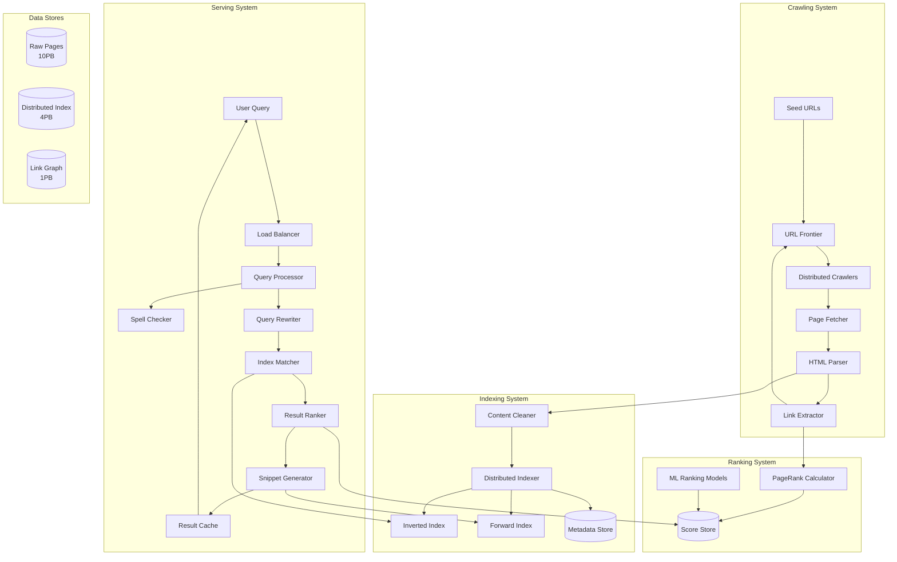
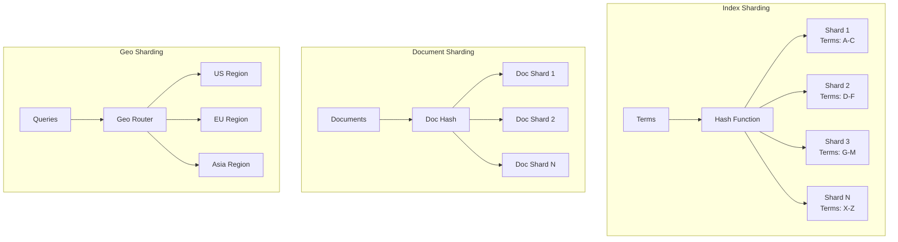
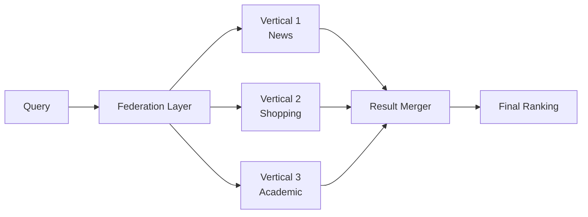
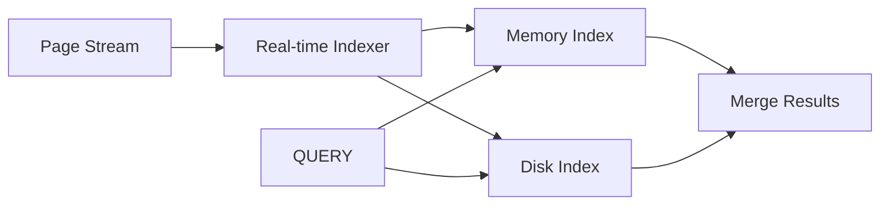
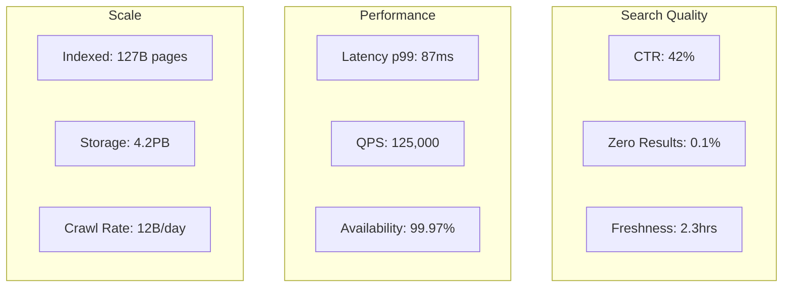

# Design Google Search

## Problem Statement

Design a web search engine that can:
- Index billions of web pages
- Return relevant results in under 100ms
- Handle 100,000+ queries per second
- Stay up-to-date with web changes
- Rank results by relevance
- Handle various content types (text, images, videos)

## 1. Problem Clarification Questions

Before diving into the design, let's clarify requirements:

**Functional Requirements:**
- Q: What types of searches do we support? (web, images, videos, news)
- Q: Do we need to support different languages?
- Q: Should we include features like spell correction, auto-complete?
- Q: Do we need to handle personalization?
- Q: What about ads and sponsored results?

**Scale Requirements:**
- Q: How many web pages do we need to index? (100B+)
- Q: How many queries per second? (100K+)
- Q: What's the acceptable latency? (<100ms)
- Q: How often should we re-crawl pages? (varies by page importance)
- Q: What's our geographic distribution? (global)

**Technical Requirements:**
- Q: Do we need real-time indexing for breaking news?
- Q: How do we handle spam and low-quality content?
- Q: What about duplicate content detection?
- Q: Do we need to respect robots.txt and crawl politeness?

## 2. Functional Requirements

Based on clarification, our core requirements:

1. **Web Crawling** - Discover and download web pages
2. **Indexing** - Process and store page content for fast retrieval  
3. **Query Processing** - Parse and understand search queries
4. **Ranking** - Order results by relevance
5. **Serving** - Return results quickly
6. **Freshness** - Keep index up-to-date

## 3. Non-Functional Requirements

- **Scale**: 100B+ pages, 100K+ QPS
- **Latency**: <100ms for 99th percentile
- **Availability**: 99.9%+ uptime
- **Freshness**: Important pages updated within hours
- **Global**: Low latency worldwide
- **Quality**: Relevant results, spam protection

## 4. Capacity Estimation

### Storage Requirements

```
Web Pages:
- 100 billion pages
- Average page size: 100KB (after cleaning)
- Total raw storage: 100B × 100KB = 10 PB

Index Storage:
- Inverted index: ~30% of raw content = 3 PB
- Forward index: ~10% of raw content = 1 PB
- Page metadata: 1KB per page = 100 TB
- Total index: ~4.1 PB

With 3x replication: 12.3 PB index storage
```

### Bandwidth Requirements

```
Crawling:
- 10B pages/day for freshness
- 10B × 100KB = 1 PB/day = 11.6 GB/s

Query Serving:
- 100K QPS × 10KB response = 1 GB/s
- With global distribution: 10 GB/s total
```

### Compute Requirements

```
Indexing:
- 10B pages/day processing
- 10ms CPU per page = 100B ms = 1.16M CPU-hours/day
- ~50K CPU cores needed

Query Processing:
- 100K QPS × 10ms per query = 1000 CPU-seconds/second
- ~1000 cores for query processing
```

## 5. API Design

### Search API

```python
# Main search endpoint
GET /search?q={query}&start={offset}&num={count}&lang={language}

Response:
{
  "query": "distributed systems",
  "total_results": 1250000000,
  "search_time_ms": 87,
  "results": [
    {
      "url": "https://example.com/page",
      "title": "Introduction to Distributed Systems",
      "snippet": "Distributed systems are networks of computers...",
      "rank_score": 0.98,
      "last_crawled": "2024-01-15T10:30:00Z"
    }
  ],
  "related_searches": ["distributed computing", "system design"],
  "spelling_suggestion": null
}

# Autocomplete API
GET /suggest?q={partial_query}

Response:
{
  "suggestions": [
    "distributed systems",
    "distributed systems course",
    "distributed systems book"
  ]
}

# Instant answers API
GET /instant?q={query}

Response:
{
  "answer": {
    "type": "definition",
    "content": "A distributed system is a collection of...",
    "source": "Wikipedia"
  }
}
```

## 6. Data Model

### Page Storage

```python
# Document store for crawled pages
class WebPage:
    page_id: str  # SHA-256 of URL
    url: str
    content_hash: str  # For dedup
    raw_html: bytes
    cleaned_text: str
    title: str
    meta_description: str
    language: str
    last_crawled: datetime
    last_modified: datetime
    crawl_frequency: int  # days
    page_rank: float
    inbound_links: List[str]
    outbound_links: List[str]

# Inverted Index
class InvertedIndex:
    term: str
    document_postings: List[Posting]
    
class Posting:
    doc_id: str
    positions: List[int]  # word positions
    tf_idf_score: float
    section: str  # title, body, etc
```

### URL Frontier (Crawl Queue)

```python
# Priority queue for URLs to crawl
class URLFrontier:
    url: str
    priority: float  # based on PageRank, update frequency
    last_crawled: datetime
    crawl_after: datetime  # politeness delay
    domain: str
    robots_txt_checked: bool
```

## 7. High-Level Architecture



## 8. Detailed Design

### Web Crawler Design

```python
class DistributedCrawler:
    def __init__(self):
        self.url_frontier = URLFrontier()
        self.robots_checker = RobotsChecker()
        self.duplicate_detector = DuplicateDetector()
        self.dns_cache = DNSCache()
        
    async def crawl_batch(self):
        """Main crawler loop"""
        while True:
# Get URLs from frontier
            urls = await self.url_frontier.get_batch(size=1000)
            
# Group by domain for politeness
            domain_groups = self._group_by_domain(urls)
            
# Crawl each domain with delays
            tasks = []
            for domain, domain_urls in domain_groups.items():
                task = self._crawl_domain(domain, domain_urls)
                tasks.append(task)
                
            results = await asyncio.gather(*tasks)
            await self._process_results(results)
    
    async def _crawl_domain(self, domain: str, urls: List[str]):
        """Crawl URLs from single domain with politeness"""
# Check robots.txt
        robots_rules = await self.robots_checker.get_rules(domain)
        
        results = []
        for url in urls:
            if not robots_rules.can_fetch(url):
                continue
                
# DNS lookup with caching
            ip = await self.dns_cache.resolve(domain)
            
# Fetch page
            page = await self._fetch_page(url, ip)
            if page:
                results.append(page)
                
# Politeness delay
            await asyncio.sleep(robots_rules.crawl_delay)
            
        return results
    
    def _extract_links(self, page: WebPage) -> List[str]:
        """Extract and normalize links"""
        soup = BeautifulSoup(page.html, 'html.parser')
        links = []
        
        for tag in soup.find_all(['a', 'link']):
            href = tag.get('href')
            if href:
# Normalize URL
                absolute_url = urljoin(page.url, href)
                normalized = self._normalize_url(absolute_url)
                links.append(normalized)
                
        return links
```

### Indexing Pipeline

```python
class IndexingPipeline:
    def __init__(self):
        self.text_processor = TextProcessor()
        self.index_writer = DistributedIndexWriter()
        
    async def process_page(self, page: WebPage):
        """Process single page through indexing pipeline"""
# 1. Clean and extract text
        cleaned_text = self.text_processor.clean_html(page.html)
        
# 2. Language detection
        language = self.text_processor.detect_language(cleaned_text)
        
# 3. Tokenization and normalization
        tokens = self.text_processor.tokenize(cleaned_text, language)
        
# 4. Calculate term statistics
        term_stats = self._calculate_term_stats(tokens)
        
# 5. Update inverted index
        await self.index_writer.update_inverted_index(
            page.page_id,
            term_stats
        )
        
# 6. Update forward index
        await self.index_writer.update_forward_index(
            page.page_id,
            {
                'url': page.url,
                'title': page.title,
                'text': cleaned_text[:1000],  # First 1000 chars
                'language': language
            }
        )
        
    def _calculate_term_stats(self, tokens: List[str]) -> Dict:
        """Calculate TF-IDF and positional information"""
        term_positions = defaultdict(list)
        term_counts = Counter(tokens)
        
        for pos, token in enumerate(tokens):
            term_positions[token].append(pos)
            
# Calculate TF-IDF (IDF comes from global stats)
        stats = {}
        doc_length = len(tokens)
        
        for term, count in term_counts.items():
            tf = count / doc_length
            stats[term] = {
                'tf': tf,
                'positions': term_positions[term],
                'count': count
            }
            
        return stats
```

### Query Processing

```python
class QueryProcessor:
    def __init__(self):
        self.spell_checker = SpellChecker()
        self.query_parser = QueryParser()
        self.synonym_expander = SynonymExpander()
        
    async def process_query(self, query: str, user_context: dict):
        """Process user query into structured search"""
# 1. Spell correction
        corrected = self.spell_checker.correct(query)
        
# 2. Query parsing (detect intent, entities)
        parsed = self.query_parser.parse(corrected)
        
# 3. Query expansion
        expanded_terms = []
        for term in parsed.terms:
# Add synonyms
            synonyms = self.synonym_expander.get_synonyms(term)
            expanded_terms.extend(synonyms[:3])  # Top 3 synonyms
            
# 4. Build retrieval query
        retrieval_query = {
            'must_terms': parsed.required_terms,
            'should_terms': parsed.optional_terms + expanded_terms,
            'exclude_terms': parsed.excluded_terms,
            'filters': {
                'language': user_context.get('language', 'en'),
                'region': user_context.get('region'),
                'safe_search': user_context.get('safe_search', True)
            }
        }
        
        return retrieval_query, corrected != query
```

### Distributed Index Retrieval

```python
class DistributedIndexRetriever:
    def __init__(self):
        self.index_shards = self._init_shards()
        self.bloom_filters = self._load_bloom_filters()
        
    async def retrieve(self, query: dict, num_results: int = 1000):
        """Retrieve documents matching query from distributed index"""
# 1. Identify relevant shards using bloom filters
        relevant_shards = self._identify_shards(query['must_terms'])
        
# 2. Parallel shard queries
        shard_tasks = []
        for shard_id in relevant_shards:
            task = self._query_shard(shard_id, query, num_results // len(relevant_shards))
            shard_tasks.append(task)
            
        shard_results = await asyncio.gather(*shard_tasks)
        
# 3. Merge results from shards
        merged_results = self._merge_shard_results(shard_results)
        
# 4. Apply global filters
        filtered = self._apply_filters(merged_results, query['filters'])
        
        return filtered[:num_results]
    
    def _identify_shards(self, terms: List[str]) -> List[int]:
        """Use bloom filters to identify shards containing terms"""
        shard_ids = set()
        
        for term in terms:
            for shard_id, bloom in enumerate(self.bloom_filters):
                if term in bloom:  # Bloom filter check
                    shard_ids.add(shard_id)
                    
        return list(shard_ids)
```

### Ranking Algorithm

```python
class RankingEngine:
    def __init__(self):
        self.pagerank_scores = self._load_pagerank()
        self.ml_model = self._load_ml_model()
        
    async def rank_results(self, results: List[SearchResult], 
                          query: str, user_context: dict):
        """Rank search results using multiple signals"""
        ranked_results = []
        
        for result in results:
# 1. Text relevance score (TF-IDF, BM25)
            text_score = self._calculate_text_relevance(
                query, 
                result.matched_terms,
                result.document_stats
            )
            
# 2. PageRank score
            pagerank = self.pagerank_scores.get(result.doc_id, 0.0)
            
# 3. Freshness score
            freshness = self._calculate_freshness(result.last_modified)
            
# 4. Click-through rate (from logs)
            ctr = await self._get_historical_ctr(query, result.url)
            
# 5. ML features
            ml_features = {
                'text_relevance': text_score,
                'pagerank': pagerank,
                'freshness': freshness,
                'ctr': ctr,
                'url_length': len(result.url),
                'is_https': result.url.startswith('https'),
                'domain_authority': self._get_domain_authority(result.url),
                'user_location_match': self._location_relevance(
                    result.geo_tags, 
                    user_context.get('location')
                )
            }
            
# 6. ML model prediction
            ml_score = self.ml_model.predict([ml_features])[0]
            
# 7. Final score combination
            final_score = (
                0.4 * text_score +
                0.2 * pagerank +
                0.1 * freshness +
                0.1 * ctr +
                0.2 * ml_score
            )
            
            ranked_results.append((final_score, result))
            
# Sort by score
        ranked_results.sort(key=lambda x: x[0], reverse=True)
        
        return [result for score, result in ranked_results]
```

### PageRank Implementation

```python
class PageRankCalculator:
    def __init__(self, damping_factor=0.85, iterations=30):
        self.damping_factor = damping_factor
        self.iterations = iterations
        
    def calculate_pagerank(self, link_graph: Graph) -> Dict[str, float]:
        """Calculate PageRank scores for all pages"""
        num_pages = len(link_graph.nodes)
        
# Initialize scores
        scores = {node: 1.0 / num_pages for node in link_graph.nodes}
        
# Iterative calculation
        for _ in range(self.iterations):
            new_scores = {}
            
            for node in link_graph.nodes:
# Base score (random surfer)
                base_score = (1 - self.damping_factor) / num_pages
                
# Inbound link score
                link_score = 0
                for inbound in link_graph.get_inbound_links(node):
                    outbound_count = len(link_graph.get_outbound_links(inbound))
                    if outbound_count > 0:
                        link_score += scores[inbound] / outbound_count
                        
                new_scores[node] = base_score + self.damping_factor * link_score
                
            scores = new_scores
            
        return scores
```

## 9. Scale Considerations

### Sharding Strategy



### Caching Architecture

```python
class MultiLevelCache:
    def __init__(self):
        self.l1_cache = {}  # In-memory (per server)
        self.l2_cache = RedisCluster()  # Distributed
        self.l3_cache = CDN()  # Global edge
        
    async def get(self, query: str) -> Optional[SearchResults]:
# L1: Local memory (1ms)
        if query in self.l1_cache:
            return self.l1_cache[query]
            
# L2: Redis cluster (10ms)
        results = await self.l2_cache.get(query)
        if results:
            self.l1_cache[query] = results
            return results
            
# L3: CDN edge cache (50ms)
        results = await self.l3_cache.get(query)
        if results:
            await self._populate_lower_caches(query, results)
            return results
            
        return None
```

### Real-time Updates

```python
class RealTimeIndexer:
    """Handle breaking news and trending topics"""
    
    def __init__(self):
        self.kafka_consumer = KafkaConsumer('realtime-pages')
        self.trending_detector = TrendingDetector()
        
    async def process_stream(self):
        """Process real-time page updates"""
        async for message in self.kafka_consumer:
            page = self._deserialize(message)
            
# Check if high-priority
            if self._is_high_priority(page):
# Immediate indexing
                await self._index_immediately(page)
                
# Update caches
                await self._invalidate_related_caches(page)
                
# Detect trending topics
            trending_terms = self.trending_detector.extract_trending(page)
            if trending_terms:
                await self._boost_trending_terms(trending_terms)
```

## 10. Trade-offs and Alternatives

### Architecture Trade-offs

<div class="responsive-table" markdown>

| Decision | Choice | Alternative | Trade-off |
|----------|--------|-------------|-----------|
| **Index Structure** | Inverted index | Forward-only index | Query speed vs storage |
| **Ranking** | ML + PageRank | Pure text relevance | Quality vs complexity |
| **Sharding** | Term-based | Document-based | Query distribution vs hotspots |
| **Consistency** | Eventual | Strong | Freshness vs complexity |
| **Crawl Strategy** | Priority-based | Round-robin | Freshness vs coverage |

</div>


### Alternative Architectures

#### Alternative 1: Federated Search


**Pros**: Specialized indexes, easier scaling per vertical
**Cons**: Complex merging, inconsistent ranking

#### Alternative 2: Real-time Search


**Pros**: Instant updates, breaking news
**Cons**: Higher cost, complex architecture

## 11. System Monitoring

### Key Metrics

```python
class SearchMetrics:
    """Critical metrics for search system health"""
    
    def __init__(self):
        self.metrics = {
# Latency metrics
            'query_latency_p50': Histogram('search_latency_ms', 'p50'),
            'query_latency_p99': Histogram('search_latency_ms', 'p99'),
            
# Throughput metrics
            'queries_per_second': Counter('search_qps'),
            'crawl_pages_per_day': Counter('crawl_pages_daily'),
            
# Quality metrics
            'click_through_rate': Gauge('search_ctr'),
            'zero_result_rate': Gauge('search_zero_results'),
            
# System health
            'index_size_bytes': Gauge('index_size'),
            'crawler_success_rate': Gauge('crawler_success'),
            'indexing_lag_seconds': Gauge('indexing_lag')
        }
```

### Monitoring Dashboard



## 12. Security Considerations

- **Spam Protection**: ML-based spam detection, manual blacklists
- **SEO Manipulation**: Detect and penalize link farms, keyword stuffing
- **Privacy**: Don't index private content, respect noindex
- **DDoS Protection**: Rate limiting, query complexity limits
- **Data Security**: Encryption at rest and in transit

## Conclusion

This design demonstrates how to build a web-scale search engine handling:
- 100B+ pages with distributed crawling
- Sub-100ms queries through intelligent caching and sharding
- High relevance through ML ranking and PageRank
- Real-time updates for breaking news
- Global scale with geo-distributed architecture

The key insights are:
1. **Inverted indexes** enable fast full-text search
2. **Distributed crawling** with politeness ensures web-scale coverage
3. **Multi-signal ranking** (text, links, behavior) improves relevance
4. **Aggressive caching** at multiple levels achieves low latency
5. **Sharding** by terms and documents enables horizontal scaling

### Interview Tips

When presenting this design:
1. Start with clarifying questions about scale and features
2. Draw the high-level architecture first
3. Deep dive into 2-3 components based on interviewer interest
4. Discuss trade-offs explicitly
5. Be ready to optimize for different constraints (cost, latency, quality)