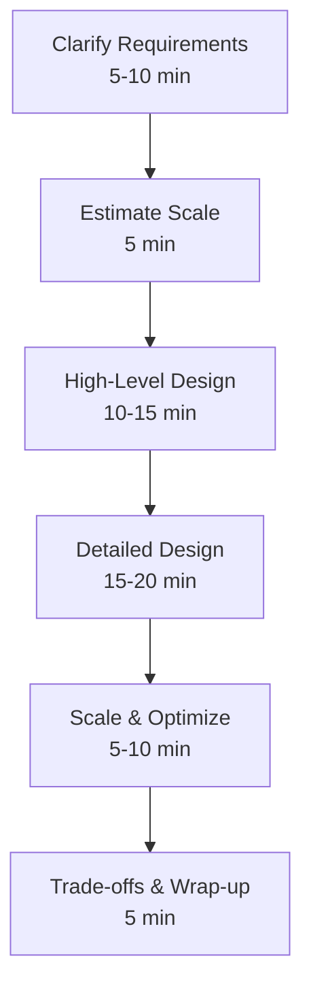

# Google System Design Interview Guide

**Master the most frequently asked Google system design interview questions with comprehensive, production-ready solutions**

!!! tip "Interview Success Framework"
    Each guide follows Google's interview evaluation criteria:
    - **Problem clarification** - Ask the right questions
    - **Functional requirements** - Define clear scope
    - **Non-functional requirements** - Scale, performance, reliability
    - **Capacity estimation** - Numbers that matter
    - **API design** - Clean interfaces
    - **Data model** - Efficient schemas
    - **High-level design** - System architecture
    - **Detailed design** - Component deep dives
    - **Scale considerations** - Handle growth
    - **Trade-offs** - Justify decisions

## 📚 Core Google System Design Problems

### 1. [ Design Google Search](/case-studies/google-systems/google-search)
Build a web-scale search engine handling 100B+ pages with sub-100ms latency.
- **Key challenges**: Web crawling, indexing, PageRank, query processing
- **Scale**: 8.5B searches/day, 100B+ pages, <100ms latency
- **Core concepts**: Inverted index, distributed crawling, ranking algorithms

### 2. [ Design YouTube](google-youtube.md)
Create a video platform serving billions of hours daily with minimal buffering.
- **Key challenges**: Video storage, transcoding, CDN, recommendations
- **Scale**: 500hrs/min uploads, 1B+ hours watched/day
- **Core concepts**: Adaptive streaming, distributed transcoding, ML recommendations

### 3. [🗺 Design Google Maps](google-maps-system.md)
Build a mapping service with real-time traffic and routing for 1B+ users.
- **Key challenges**: Map data, routing algorithms, real-time traffic
- **Scale**: 1B+ users, 220+ countries, millions of routes/sec
- **Core concepts**: Spatial indexing, graph algorithms, real-time processing

### 4. [📧 Design Gmail](google-gmail.md)
Create an email service for 1.5B users with spam filtering and search.
- **Key challenges**: Storage scale, spam detection, search, reliability
- **Scale**: 1.5B users, 300B+ emails/day, 99.9% uptime
- **Core concepts**: Distributed storage, ML spam detection, full-text search

### 5. [📄 Design Google Docs](google-docs.md)
Build a real-time collaborative document editor with conflict resolution.
- **Key challenges**: Real-time sync, conflict resolution, versioning
- **Scale**: Millions of concurrent edits, sub-second latency
- **Core concepts**: Operational transformation, CRDTs, WebSocket

## How to Use These Guides

### For Interview Preparation

1. **Start with problem clarification** - Each guide includes key questions to ask
2. **Understand the requirements** - Both functional and non-functional are detailed
3. **Learn the capacity planning** - Real numbers and calculations provided
4. **Master the architecture** - From high-level to detailed component design
5. **Practice trade-offs** - Understand why certain decisions were made

### For System Design Learning

1. **Follow the evolution** - See how these systems grew from simple to complex
2. **Compare alternatives** - Multiple architecture options analyzed
3. **Understand the laws** - How fundamental distributed systems principles apply
4. **Learn from failures** - Real production issues and solutions

### Interview Day Strategy

## 🔑 Key Patterns Across Google Systems

### Common Architectural Patterns

| Pattern | Google Search | YouTube | Maps | Gmail | Docs |
|---------|--------------|---------|------|-------|------|
| Sharding | ✅ Index shards | ✅ Video shards | ✅ Geo shards | ✅ User shards | ✅ Doc shards |
| Caching | ✅ Result cache | ✅ CDN cache | ✅ Tile cache | ✅ Message cache | ✅ Doc cache |
| Replication | ✅ Multi-DC | ✅ Geo-replicated | ✅ Regional copies | ✅ Mail replicas | ✅ Multi-region |
| Async Processing | ✅ Crawl queue | ✅ Transcode queue | ✅ Route calc | ✅ Spam check | ✅ Sync queue |
| ML/AI | ✅ Ranking | ✅ Recommendations | ✅ Traffic predict | ✅ Spam detect | ✅ Smart compose |

### Scale Comparison

| System | Users | Data Size | QPS | Latency Target |
|--------|-------|-----------|-----|----------------|
| Search | 4B+ | 100B+ pages | 100K+ | <100ms |
| YouTube | 2B+ | Exabytes | 10M+ | <2s startup |
| Maps | 1B+ | 100PB+ | 1M+ | <500ms |
| Gmail | 1.5B+ | Exabytes | 1M+ | <200ms |
| Docs | 1B+ | 100PB+ | 100K+ | <100ms |

## Evaluation Criteria

Google interviewers typically evaluate candidates on:

1. **Problem Solving** (25%)
   - Asking clarifying questions
   - Breaking down complex problems
   - Systematic thinking

2. **Technical Design** (40%)
   - Architecture decisions
   - Component design
   - API and data model
   - Handling scale

3. **Trade-off Analysis** (20%)
   - Comparing alternatives
   - Justifying decisions
   - Cost vs performance

4. **Communication** (15%)
   - Clear explanation
   - Diagram quality
   - Handling feedback

## Advanced Topics

### Beyond the Basics

- **Multi-region architecture** - Global systems design
- **Disaster recovery** - Handling regional failures
- **Cost optimization** - Balancing performance and economics
- **Security & privacy** - Data protection at scale
- **Compliance** - GDPR, data sovereignty

### Emerging Challenges

- **ML infrastructure** - Training and serving at scale
- **Edge computing** - Pushing logic closer to users
- **Real-time systems** - Sub-second global updates
- **Sustainability** - Carbon-aware computing

## 📚 Additional Resources

### Related Concepts
- [The 7 Laws](/axioms/) - Fundamental principles
- [Pattern Library](/patterns/) - Reusable solutions
- [Quantitative Tools](/quantitative/) - Capacity planning

### Practice Problems
- Design a distributed cache (Redis-like)
- Design a message queue (Kafka-like)
- Design a NoSQL database (BigTable-like)
- Design a notification system
- Design a distributed file system (GFS-like)

---

💡 **Remember**: These guides represent one approach to solving these problems. In a real interview, adapt based on the specific requirements and constraints given by your interviewer.