# Hotel Reservation System - System Design Case Study

## 1. Problem Statement

Design a global hotel reservation system like Booking.com or Expedia that can:
- Handle millions of searches and bookings daily
- Manage inventory for 1M+ properties worldwide
- Prevent double-booking with distributed inventory
- Support dynamic pricing and availability
- Process payments securely
- Handle peak traffic during holiday seasons (10x normal)

### Real-World Context
- **Booking.com**: 28M+ listings, 1.5M+ room nights booked daily
- **Expedia**: 700K+ properties, billions in bookings annually
- **Airbnb**: 6M+ listings, 150M+ users worldwide
- **Hotels.com**: Part of Expedia Group, 60M+ members

## 2. Requirements Analysis

### Functional Requirements
1. **Search & Discovery**
   - Location-based search with filters
   - Date range availability checking
   - Price comparison and sorting
   - Room type and amenity filtering
   - Photo galleries and virtual tours

2. **Booking Management**
   - Real-time availability checking
   - Reservation creation and modification
   - Cancellation with policies
   - Multi-room bookings
   - Group reservations

3. **Inventory Management**
   - Room inventory tracking
   - Rate plan management
   - Seasonal pricing rules
   - Overbooking control
   - Channel management

4. **Payment Processing**
   - Multiple payment methods
   - Currency conversion
   - Deposit and cancellation fees
   - Commission calculations
   - Refund processing

5. **User Features**
   - Guest profiles and preferences
   - Booking history
   - Loyalty programs
   - Reviews and ratings
   - Travel itineraries

### Non-Functional Requirements
- **Scale**: 100M+ searches/day, 1M+ bookings/day
- **Latency**: <500ms search results, <2s booking confirmation
- **Availability**: 99.95% uptime (4.4 hours/year downtime)
- **Consistency**: Zero double-bookings
- **Global**: Multi-region deployment, 40+ languages
- **Accuracy**: Real-time inventory across all channels

### Axiom Mapping
- **Axiom 1 (Latency)**: Fast search results improve conversion
- **Axiom 2 (Capacity)**: Finite room inventory requires careful management
- **Axiom 3 (Failure)**: Booking must succeed despite component failures
- **Axiom 4 (Concurrency)**: Distributed locking prevents double-booking
- **Axiom 5 (Coordination)**: Channel synchronization critical
- **Axiom 6 (Observability)**: Track every search and booking
- **Axiom 7 (Interface)**: Intuitive search and booking flow
- **Axiom 8 (Economics)**: Optimize for booking conversion rate

## 3. Architecture Evolution

### Stage 1: Basic Reservation System (10K properties)


### Stage 2: Distributed Architecture (100K properties)


### Stage 3: Global Scale Architecture (1M+ properties)


## 4. Detailed Component Design

### 4.1 Distributed Inventory Management
```python
import asyncio
from typing import Dict, List, Optional, Set
from datetime import date, datetime, timedelta
import redis.asyncio as redis
from dataclasses import dataclass
import hashlib

@dataclass
class RoomInventory:
    property_id: str
    room_type_id: str
    date: date
    total_rooms: int
    available_rooms: int
    blocked_rooms: int
    price: float
    min_stay: int
    
class DistributedInventoryManager:
    """Manages hotel room inventory with distributed locking"""
    
    def __init__(self, redis_cluster: redis.RedisCluster,
                 db_pool: DatabasePool):
        self.redis = redis_cluster
        self.db = db_pool
        self.lock_timeout = 30  # seconds
        self.cache_ttl = 300    # 5 minutes
        
    async def check_availability(self, property_id: str,
                                check_in: date,
                                check_out: date,
                                room_count: int = 1) -> List[RoomInventory]:
        """Check room availability for date range"""
        
        availability = []
        current_date = check_in
        
        while current_date < check_out:
            # Try cache first
            cache_key = f"inventory:{property_id}:{current_date}"
            cached = await self.redis.get(cache_key)
            
            if cached:
                inventory = RoomInventory(**json.loads(cached))
            else:
                # Load from database
                inventory = await self._load_inventory_from_db(
                    property_id, 
                    current_date
                )
                
                # Cache for future requests
                await self.redis.setex(
                    cache_key,
                    self.cache_ttl,
                    json.dumps(inventory.__dict__, default=str)
                )
            
            if inventory.available_rooms < room_count:
                return []  # Not available for entire stay
                
            availability.append(inventory)
            current_date += timedelta(days=1)
            
        return availability
    
    async def reserve_rooms(self, property_id: str,
                           room_type_id: str,
                           check_in: date,
                           check_out: date,
                           room_count: int,
                           booking_id: str) -> bool:
        """Reserve rooms with distributed locking"""
        
        # Generate lock key for the entire date range
        lock_key = self._generate_lock_key(
            property_id, 
            room_type_id,
            check_in,
            check_out
        )
        
        # Try to acquire distributed lock
        lock = await self._acquire_lock(lock_key)
        if not lock:
            raise ConcurrentBookingError("Could not acquire inventory lock")
            
        try:
            # Double-check availability inside lock
            current_availability = await self.check_availability(
                property_id,
                check_in,
                check_out,
                room_count
            )
            
            if not current_availability:
                return False
                
            # Reserve inventory for each night
            async with self.db.transaction() as tx:
                current_date = check_in
                
                while current_date < check_out:
                    # Update inventory
                    result = await tx.execute("""
                        UPDATE room_inventory
                        SET available_rooms = available_rooms - $1,
                            version = version + 1
                        WHERE property_id = $2
                          AND room_type_id = $3
                          AND inventory_date = $4
                          AND available_rooms >= $1
                        RETURNING available_rooms
                    """, room_count, property_id, room_type_id, current_date)
                    
                    if not result:
                        raise InsufficientInventoryError(
                            f"No availability for {current_date}"
                        )
                    
                    # Record reservation
                    await tx.execute("""
                        INSERT INTO room_reservations
                        (booking_id, property_id, room_type_id, 
                         reservation_date, room_count)
                        VALUES ($1, $2, $3, $4, $5)
                    """, booking_id, property_id, room_type_id, 
                        current_date, room_count)
                    
                    # Invalidate cache
                    cache_key = f"inventory:{property_id}:{current_date}"
                    await self.redis.delete(cache_key)
                    
                    current_date += timedelta(days=1)
                    
            return True
            
        finally:
            # Always release lock
            await self._release_lock(lock_key, lock)
    
    async def _acquire_lock(self, lock_key: str) -> Optional[str]:
        """Acquire distributed lock using Redlock algorithm"""
        
        lock_value = str(uuid.uuid4())
        
        # Try to acquire lock on majority of Redis nodes
        acquired_count = 0
        nodes = await self.redis.get_nodes()
        
        for node in nodes:
            try:
                success = await node.set(
                    lock_key,
                    lock_value,
                    nx=True,
                    ex=self.lock_timeout
                )
                if success:
                    acquired_count += 1
            except Exception as e:
                logger.error(f"Failed to acquire lock on node: {e}")
        
        # Need majority
        if acquired_count > len(nodes) // 2:
            return lock_value
        else:
            # Release any acquired locks
            await self._release_lock(lock_key, lock_value)
            return None
    
    def _generate_lock_key(self, property_id: str, 
                          room_type_id: str,
                          check_in: date,
                          check_out: date) -> str:
        """Generate deterministic lock key"""
        data = f"{property_id}:{room_type_id}:{check_in}:{check_out}"
        return f"inventory_lock:{hashlib.md5(data.encode()).hexdigest()}"
```

### 4.2 Search and Ranking Engine
```python
from elasticsearch import AsyncElasticsearch
import numpy as np
from sklearn.preprocessing import StandardScaler

class HotelSearchEngine:
    """ML-powered hotel search with personalization"""
    
    def __init__(self, es_client: AsyncElasticsearch,
                 ranking_model: RankingModel,
                 user_profile_service: UserProfileService):
        self.es = es_client
        self.ranking_model = ranking_model
        self.user_profiles = user_profile_service
        
    async def search_hotels(self, query: SearchQuery, 
                           user_id: Optional[str] = None) -> SearchResults:
        """Search hotels with ML ranking"""
        
        # Build Elasticsearch query
        es_query = self._build_es_query(query)
        
        # Add personalization boosts if user provided
        if user_id:
            user_profile = await self.user_profiles.get_profile(user_id)
            es_query = self._add_personalization(es_query, user_profile)
        
        # Execute search
        response = await self.es.search(
            index="hotels",
            body=es_query,
            size=1000  # Get more for ML re-ranking
        )
        
        # Extract hotel data
        hotels = self._parse_es_response(response)
        
        # Apply ML ranking
        if user_id and len(hotels) > 0:
            hotels = await self._apply_ml_ranking(
                hotels, 
                query, 
                user_id
            )
        
        # Apply business rules
        hotels = self._apply_business_rules(hotels, query)
        
        # Pagination
        start = query.offset
        end = query.offset + query.limit
        
        return SearchResults(
            hotels=hotels[start:end],
            total_count=len(hotels),
            facets=self._extract_facets(response)
        )
    
    def _build_es_query(self, query: SearchQuery) -> Dict:
        """Build Elasticsearch query with filters"""
        
        must_conditions = []
        filter_conditions = []
        
        # Location search
        if query.location:
            if query.location_type == "city":
                must_conditions.append({
                    "match": {
                        "address.city": {
                            "query": query.location,
                            "boost": 2.0
                        }
                    }
                })
            elif query.location_type == "coordinates":
                filter_conditions.append({
                    "geo_distance": {
                        "distance": f"{query.radius}km",
                        "location": {
                            "lat": query.latitude,
                            "lon": query.longitude
                        }
                    }
                })
        
        # Date availability
        if query.check_in and query.check_out:
            filter_conditions.append({
                "nested": {
                    "path": "availability",
                    "query": {
                        "bool": {
                            "must": [
                                {"range": {"availability.date": {
                                    "gte": query.check_in,
                                    "lte": query.check_out
                                }}},
                                {"range": {"availability.rooms": {
                                    "gte": query.room_count
                                }}}
                            ]
                        }
                    }
                }
            })
        
        # Price range
        if query.min_price or query.max_price:
            price_filter = {}
            if query.min_price:
                price_filter["gte"] = query.min_price
            if query.max_price:
                price_filter["lte"] = query.max_price
                
            filter_conditions.append({
                "range": {"price_per_night": price_filter}
            })
        
        # Amenities
        if query.amenities:
            for amenity in query.amenities:
                filter_conditions.append({
                    "term": {"amenities": amenity}
                })
        
        # Build final query
        return {
            "query": {
                "bool": {
                    "must": must_conditions or [{"match_all": {}}],
                    "filter": filter_conditions
                }
            },
            "aggs": {
                "price_ranges": {
                    "histogram": {
                        "field": "price_per_night",
                        "interval": 50
                    }
                },
                "amenities": {
                    "terms": {
                        "field": "amenities",
                        "size": 50
                    }
                },
                "star_ratings": {
                    "terms": {
                        "field": "star_rating"
                    }
                }
            },
            "sort": [
                {"_score": {"order": "desc"}},
                {"review_score": {"order": "desc"}},
                {"booking_count": {"order": "desc"}}
            ]
        }
    
    async def _apply_ml_ranking(self, hotels: List[Hotel], 
                               query: SearchQuery,
                               user_id: str) -> List[Hotel]:
        """Apply ML model for personalized ranking"""
        
        # Get user features
        user_features = await self.user_profiles.get_ml_features(user_id)
        
        # Extract hotel features
        hotel_features = []
        for hotel in hotels:
            features = self._extract_hotel_features(hotel, query)
            hotel_features.append(features)
        
        # Combine user and hotel features
        X = np.array([
            np.concatenate([user_features, hotel_feat])
            for hotel_feat in hotel_features
        ])
        
        # Get predictions
        scores = self.ranking_model.predict(X)
        
        # Sort by ML score
        hotel_scores = list(zip(hotels, scores))
        hotel_scores.sort(key=lambda x: x[1], reverse=True)
        
        return [hotel for hotel, _ in hotel_scores]
    
    def _extract_hotel_features(self, hotel: Hotel, 
                               query: SearchQuery) -> np.array:
        """Extract ML features from hotel"""
        
        features = []
        
        # Basic features
        features.extend([
            hotel.star_rating / 5.0,
            hotel.review_score / 10.0,
            hotel.review_count / 1000.0,
            np.log1p(hotel.price_per_night) / 10.0,
            hotel.booking_count_30d / 100.0
        ])
        
        # Location features
        if query.latitude and query.longitude:
            distance = haversine_distance(
                query.latitude, query.longitude,
                hotel.latitude, hotel.longitude
            )
            features.append(1.0 / (1.0 + distance))  # Inverse distance
        else:
            features.append(0.5)
        
        # Amenity match score
        if query.amenities:
            amenity_match = len(
                set(query.amenities) & set(hotel.amenities)
            ) / len(query.amenities)
            features.append(amenity_match)
        else:
            features.append(0.0)
        
        # Time features
        features.extend([
            hotel.occupancy_rate_7d,
            hotel.price_trend_7d,
            1.0 if hotel.is_newly_listed else 0.0,
            hotel.cancellation_rate
        ])
        
        return np.array(features)
```

### 4.3 Dynamic Pricing Engine
```python
class DynamicPricingEngine:
    """ML-based dynamic pricing for revenue optimization"""
    
    def __init__(self, price_model: PriceOptimizationModel,
                 market_data_service: MarketDataService):
        self.price_model = price_model
        self.market_data = market_data_service
        self.price_boundaries = PriceBoundaries()
        
    async def calculate_optimal_price(self, property_id: str,
                                     room_type_id: str,
                                     date: date) -> PricingDecision:
        """Calculate optimal price for a room on a specific date"""
        
        # Get base price
        base_price = await self._get_base_price(property_id, room_type_id)
        
        # Extract pricing features
        features = await self._extract_pricing_features(
            property_id,
            room_type_id,
            date
        )
        
        # Get ML price multiplier
        multiplier = self.price_model.predict(features)[0]
        
        # Calculate suggested price
        suggested_price = base_price * multiplier
        
        # Apply constraints
        final_price = self._apply_price_constraints(
            suggested_price,
            base_price,
            property_id,
            date
        )
        
        # Calculate confidence and explanation
        confidence = self._calculate_confidence(features, multiplier)
        explanation = self._generate_explanation(features, multiplier)
        
        return PricingDecision(
            room_type_id=room_type_id,
            date=date,
            base_price=base_price,
            suggested_price=suggested_price,
            final_price=final_price,
            multiplier=multiplier,
            confidence=confidence,
            explanation=explanation
        )
    
    async def _extract_pricing_features(self, property_id: str,
                                       room_type_id: str,
                                       target_date: date) -> np.array:
        """Extract features for pricing model"""
        
        features = []
        
        # Temporal features
        features.extend([
            target_date.weekday() / 6.0,  # Day of week
            target_date.day / 31.0,        # Day of month
            target_date.month / 12.0,      # Month
            1.0 if self._is_weekend(target_date) else 0.0,
            1.0 if self._is_holiday(target_date) else 0.0
        ])
        
        # Demand features
        demand_data = await self.market_data.get_demand_metrics(
            property_id,
            target_date
        )
        features.extend([
            demand_data.search_volume_7d / 1000.0,
            demand_data.booking_pace,
            demand_data.market_occupancy,
            demand_data.days_until_arrival / 365.0
        ])
        
        # Competition features
        comp_data = await self.market_data.get_competitor_prices(
            property_id,
            target_date
        )
        features.extend([
            comp_data.avg_price / 500.0,
            comp_data.min_price / 500.0,
            comp_data.price_position,  # Our position in market
            comp_data.competitor_availability
        ])
        
        # Historical performance
        historical = await self._get_historical_performance(
            property_id,
            room_type_id,
            target_date
        )
        features.extend([
            historical.occupancy_rate_same_day_last_year,
            historical.revenue_per_room_30d,
            historical.booking_curve_position,
            historical.cancellation_rate_7d
        ])
        
        # Event impact
        events = await self.market_data.get_local_events(
            property_id,
            target_date
        )
        features.extend([
            events.major_event_impact,
            events.conference_impact,
            events.concert_impact,
            events.sports_impact
        ])
        
        return np.array(features)
    
    def _apply_price_constraints(self, suggested_price: float,
                                 base_price: float,
                                 property_id: str,
                                 date: date) -> float:
        """Apply business rules and constraints"""
        
        # Get property-specific boundaries
        boundaries = self.price_boundaries.get_boundaries(property_id)
        
        # Apply min/max constraints
        min_price = max(
            boundaries.absolute_min,
            base_price * boundaries.min_multiplier
        )
        max_price = min(
            boundaries.absolute_max,
            base_price * boundaries.max_multiplier
        )
        
        # Clip to boundaries
        constrained_price = np.clip(suggested_price, min_price, max_price)
        
        # Apply rate parity rules
        if self._requires_rate_parity(property_id, date):
            parity_price = self._get_rate_parity_price(property_id, date)
            constrained_price = max(constrained_price, parity_price)
        
        # Round to nearest pricing tier
        return self._round_to_pricing_tier(constrained_price)
```

### 4.4 Booking Orchestration with Saga Pattern
```python
class BookingOrchestrator:
    """Orchestrates complex booking flow using Saga pattern"""
    
    def __init__(self, inventory_manager: DistributedInventoryManager,
                 payment_service: PaymentService,
                 notification_service: NotificationService):
        self.inventory = inventory_manager
        self.payment = payment_service
        self.notifications = notification_service
        self.saga_log = SagaLog()
        
    async def create_booking(self, request: BookingRequest) -> BookingResult:
        """Execute booking saga with compensation"""
        
        saga_id = str(uuid.uuid4())
        saga = BookingSaga(saga_id)
        
        try:
            # Step 1: Validate booking request
            validation_result = await self._validate_booking(request)
            saga.add_step("validation", validation_result)
            
            if not validation_result.is_valid:
                return BookingResult(
                    success=False,
                    error=validation_result.error
                )
            
            # Step 2: Calculate pricing
            pricing = await self._calculate_total_price(request)
            saga.add_step("pricing", pricing)
            
            # Step 3: Reserve inventory
            reservation = await self.inventory.reserve_rooms(
                property_id=request.property_id,
                room_type_id=request.room_type_id,
                check_in=request.check_in,
                check_out=request.check_out,
                room_count=request.room_count,
                booking_id=saga_id
            )
            saga.add_step("inventory_reservation", reservation,
                         compensation=lambda: self.inventory.release_rooms(
                             saga_id
                         ))
            
            if not reservation:
                raise InventoryUnavailableError()
            
            # Step 4: Process payment
            payment_result = await self.payment.charge(
                amount=pricing.total_amount,
                currency=pricing.currency,
                payment_method=request.payment_method,
                metadata={"booking_id": saga_id}
            )
            saga.add_step("payment", payment_result,
                         compensation=lambda: self.payment.refund(
                             payment_result.transaction_id
                         ))
            
            if not payment_result.success:
                raise PaymentFailedError(payment_result.error)
            
            # Step 5: Create booking record
            booking = await self._create_booking_record(
                saga_id=saga_id,
                request=request,
                pricing=pricing,
                payment=payment_result
            )
            saga.add_step("booking_creation", booking)
            
            # Step 6: Send confirmation
            confirmation = await self.notifications.send_booking_confirmation(
                booking=booking,
                guest_email=request.guest_email
            )
            saga.add_step("confirmation", confirmation)
            
            # Step 7: Update channel manager
            channel_update = await self._update_channel_availability(
                property_id=request.property_id,
                room_type_id=request.room_type_id,
                dates=self._get_date_range(
                    request.check_in,
                    request.check_out
                )
            )
            saga.add_step("channel_update", channel_update)
            
            # Log successful saga
            await self.saga_log.log_success(saga)
            
            return BookingResult(
                success=True,
                booking_id=booking.id,
                confirmation_number=booking.confirmation_number,
                total_amount=pricing.total_amount
            )
            
        except Exception as e:
            logger.error(f"Booking saga failed: {e}")
            
            # Execute compensations in reverse order
            await self._compensate_saga(saga)
            
            # Log failed saga
            await self.saga_log.log_failure(saga, str(e))
            
            return BookingResult(
                success=False,
                error=str(e)
            )
    
    async def _compensate_saga(self, saga: BookingSaga):
        """Execute compensation actions in reverse order"""
        
        for step in reversed(saga.steps):
            if step.success and step.compensation:
                try:
                    await step.compensation()
                    logger.info(f"Compensated step: {step.name}")
                except Exception as e:
                    logger.error(f"Compensation failed for {step.name}: {e}")
```

### 4.5 Multi-Channel Synchronization
```python
class ChannelManager:
    """Synchronizes inventory across multiple channels"""
    
    def __init__(self, channel_connectors: Dict[str, ChannelConnector]):
        self.connectors = channel_connectors
        self.sync_queue = asyncio.Queue()
        self.retry_queue = asyncio.Queue()
        
    async def sync_inventory_update(self, update: InventoryUpdate):
        """Propagate inventory changes to all channels"""
        
        # Get active channels for property
        channels = await self._get_active_channels(update.property_id)
        
        # Create sync tasks for each channel
        tasks = []
        for channel in channels:
            task = SyncTask(
                channel=channel,
                update=update,
                created_at=datetime.utcnow()
            )
            tasks.append(task)
            await self.sync_queue.put(task)
        
        # Wait for all syncs to complete with timeout
        results = await asyncio.gather(
            *[self._sync_to_channel(task) for task in tasks],
            return_exceptions=True
        )
        
        # Handle failures
        failed_channels = []
        for task, result in zip(tasks, results):
            if isinstance(result, Exception):
                failed_channels.append(task.channel)
                await self.retry_queue.put(task)
        
        return SyncResult(
            successful_channels=len(channels) - len(failed_channels),
            failed_channels=failed_channels
        )
    
    async def _sync_to_channel(self, task: SyncTask):
        """Sync update to specific channel"""
        
        connector = self.connectors.get(task.channel.type)
        if not connector:
            raise ValueError(f"Unknown channel type: {task.channel.type}")
        
        try:
            # Transform update to channel format
            channel_update = self._transform_update(
                task.update,
                task.channel
            )
            
            # Send update with retry
            max_retries = 3
            for attempt in range(max_retries):
                try:
                    response = await connector.update_availability(
                        channel_update,
                        task.channel.credentials
                    )
                    
                    if response.success:
                        return response
                        
                    if not response.retryable:
                        raise ChannelSyncError(response.error)
                        
                except asyncio.TimeoutError:
                    if attempt == max_retries - 1:
                        raise
                    await asyncio.sleep(2 ** attempt)
            
        except Exception as e:
            logger.error(f"Channel sync failed for {task.channel.name}: {e}")
            raise
```

## 5. Advanced Features

### 5.1 Predictive Overbooking
```python
class OverbookingOptimizer:
    """ML-based overbooking to maximize revenue"""
    
    def __init__(self, cancellation_predictor: CancellationModel,
                 no_show_predictor: NoShowModel):
        self.cancellation_model = cancellation_predictor
        self.no_show_model = no_show_predictor
        
    async def calculate_optimal_overbooking(self, 
                                           property_id: str,
                                           date: date,
                                           room_type: str) -> OverbookingDecision:
        """Calculate safe overbooking level"""
        
        # Get current bookings
        bookings = await self._get_bookings(property_id, date, room_type)
        
        # Predict cancellations
        cancellation_prob = []
        for booking in bookings:
            features = self._extract_cancellation_features(booking)
            prob = self.cancellation_model.predict_proba(features)[0][1]
            cancellation_prob.append(prob)
        
        # Predict no-shows
        no_show_prob = []
        for booking in bookings:
            features = self._extract_no_show_features(booking)
            prob = self.no_show_model.predict_proba(features)[0][1]
            no_show_prob.append(prob)
        
        # Calculate expected available rooms
        expected_cancellations = sum(cancellation_prob)
        expected_no_shows = sum(no_show_prob)
        expected_available = expected_cancellations + expected_no_shows
        
        # Calculate optimal overbooking with constraints
        walk_cost = await self._get_walk_cost(property_id)
        room_revenue = await self._get_room_revenue(property_id, date)
        
        optimal_overbook = self._optimize_overbooking(
            expected_available=expected_available,
            walk_cost=walk_cost,
            room_revenue=room_revenue,
            confidence_level=0.95
        )
        
        return OverbookingDecision(
            recommended_overbook=int(optimal_overbook),
            expected_cancellations=expected_cancellations,
            expected_no_shows=expected_no_shows,
            confidence_interval=(
                max(0, optimal_overbook - 2),
                optimal_overbook + 2
            ),
            estimated_revenue_impact=optimal_overbook * room_revenue * 0.8
        )
```

### 5.2 Guest Experience Personalization
```python
class PersonalizationEngine:
    """Personalize search and booking experience"""
    
    def __init__(self, user_behavior_model: UserBehaviorModel,
                 recommendation_engine: RecommendationEngine):
        self.behavior_model = user_behavior_model
        self.recommender = recommendation_engine
        
    async def personalize_search_results(self, 
                                        search_results: List[Hotel],
                                        user_id: str) -> List[Hotel]:
        """Rerank search results based on user preferences"""
        
        # Get user profile
        user_profile = await self._get_user_profile(user_id)
        
        # Extract personalization features
        personalized_scores = []
        
        for hotel in search_results:
            score = 0.0
            
            # Brand affinity
            if hotel.brand in user_profile.preferred_brands:
                score += 0.2
            
            # Price sensitivity
            price_match = self._calculate_price_match(
                hotel.price_per_night,
                user_profile.avg_booking_price,
                user_profile.price_sensitivity
            )
            score += price_match * 0.3
            
            # Amenity preferences
            amenity_match = self._calculate_amenity_match(
                hotel.amenities,
                user_profile.preferred_amenities
            )
            score += amenity_match * 0.2
            
            # Location preferences
            if user_profile.prefers_city_center and hotel.is_city_center:
                score += 0.1
            
            # Business vs leisure
            if user_profile.is_business_traveler:
                if hotel.has_business_center:
                    score += 0.1
                if hotel.has_conference_rooms:
                    score += 0.1
            
            personalized_scores.append((hotel, score))
        
        # Combine with original ranking
        final_scores = []
        for i, (hotel, pers_score) in enumerate(personalized_scores):
            # Blend personalization with relevance
            original_score = 1.0 - (i / len(search_results))
            final_score = 0.7 * original_score + 0.3 * pers_score
            final_scores.append((hotel, final_score))
        
        # Sort by final score
        final_scores.sort(key=lambda x: x[1], reverse=True)
        
        return [hotel for hotel, _ in final_scores]
```

### 5.3 Fraud Detection for Bookings
```python
class BookingFraudDetector:
    """Detect fraudulent bookings in real-time"""
    
    def __init__(self, fraud_model: FraudDetectionModel,
                 risk_rules_engine: RiskRulesEngine):
        self.fraud_model = fraud_model
        self.rules_engine = risk_rules_engine
        
    async def assess_booking_risk(self, booking: BookingRequest) -> RiskAssessment:
        """Assess fraud risk for booking"""
        
        # Rule-based checks first
        rule_violations = self.rules_engine.check_booking(booking)
        if rule_violations.critical_violations:
            return RiskAssessment(
                risk_score=1.0,
                action="BLOCK",
                reasons=rule_violations.critical_violations
            )
        
        # Extract ML features
        features = await self._extract_fraud_features(booking)
        
        # Get fraud probability
        fraud_prob = self.fraud_model.predict_proba(features)[0][1]
        
        # Combine with rule violations
        risk_score = self._combine_risk_scores(
            ml_score=fraud_prob,
            rule_score=len(rule_violations.warnings) * 0.1
        )
        
        # Determine action
        if risk_score > 0.9:
            action = "BLOCK"
        elif risk_score > 0.7:
            action = "MANUAL_REVIEW"
        elif risk_score > 0.5:
            action = "ADDITIONAL_VERIFICATION"
        else:
            action = "ALLOW"
        
        return RiskAssessment(
            risk_score=risk_score,
            action=action,
            reasons=self._generate_risk_reasons(
                features,
                fraud_prob,
                rule_violations
            )
        )
    
    async def _extract_fraud_features(self, booking: BookingRequest) -> np.array:
        """Extract features for fraud detection"""
        
        features = []
        
        # Booking characteristics
        features.extend([
            booking.total_amount / 1000.0,
            booking.nights_count / 30.0,
            booking.rooms_count / 10.0,
            booking.advance_days / 365.0,
            1.0 if booking.is_international else 0.0
        ])
        
        # User behavior
        user_history = await self._get_user_history(booking.user_id)
        features.extend([
            user_history.total_bookings / 100.0,
            user_history.cancellation_rate,
            user_history.days_since_last_booking / 365.0,
            1.0 if user_history.has_chargebacks else 0.0
        ])
        
        # Device and location
        device_info = await self._get_device_info(booking.session_id)
        features.extend([
            1.0 if device_info.is_vpn else 0.0,
            1.0 if device_info.is_tor else 0.0,
            device_info.risk_score,
            1.0 if device_info.country != booking.guest_country else 0.0
        ])
        
        # Velocity checks
        velocity = await self._calculate_velocity_metrics(booking)
        features.extend([
            velocity.bookings_last_hour / 10.0,
            velocity.unique_properties_last_day / 10.0,
            velocity.total_amount_last_day / 10000.0
        ])
        
        return np.array(features)
```

## 6. Performance Optimizations

### 6.1 Caching Strategy
```python
class MultiLayerCache:
    """Multi-layer caching for hotel data"""
    
    def __init__(self):
        self.edge_cache = EdgeCache()  # CDN
        self.redis_cache = RedisCache()  # Regional
        self.local_cache = LocalCache()  # Application
        
    async def get_hotel_data(self, hotel_id: str) -> Optional[Hotel]:
        """Get hotel with cache hierarchy"""
        
        # L1: Local cache (microseconds)
        hotel = self.local_cache.get(hotel_id)
        if hotel:
            return hotel
        
        # L2: Redis cache (milliseconds)
        hotel_data = await self.redis_cache.get(f"hotel:{hotel_id}")
        if hotel_data:
            hotel = Hotel.from_json(hotel_data)
            self.local_cache.set(hotel_id, hotel, ttl=60)
            return hotel
        
        # L3: Database (tens of milliseconds)
        hotel = await self._fetch_from_database(hotel_id)
        if hotel:
            # Populate caches
            await self.redis_cache.set(
                f"hotel:{hotel_id}",
                hotel.to_json(),
                ttl=300
            )
            self.local_cache.set(hotel_id, hotel, ttl=60)
        
        return hotel
    
    async def invalidate_hotel(self, hotel_id: str):
        """Invalidate hotel across all cache layers"""
        
        # Clear all layers
        self.local_cache.delete(hotel_id)
        await self.redis_cache.delete(f"hotel:{hotel_id}")
        await self.edge_cache.purge(f"/api/hotels/{hotel_id}")
        
        # Propagate to other regions
        await self._broadcast_invalidation(hotel_id)
```

### 6.2 Database Sharding
```python
class ShardedInventoryDB:
    """Sharded database for inventory management"""
    
    def __init__(self, shard_count: int = 64):
        self.shard_count = shard_count
        self.shards = self._initialize_shards()
        
    def get_shard(self, property_id: str) -> DatabaseShard:
        """Get shard for property using consistent hashing"""
        
        shard_key = hashlib.md5(property_id.encode()).hexdigest()
        shard_id = int(shard_key, 16) % self.shard_count
        
        return self.shards[shard_id]
    
    async def query_availability(self, property_ids: List[str],
                                check_in: date,
                                check_out: date) -> Dict[str, List[RoomInventory]]:
        """Query availability across multiple shards"""
        
        # Group properties by shard
        shard_groups = defaultdict(list)
        for property_id in property_ids:
            shard = self.get_shard(property_id)
            shard_groups[shard].append(property_id)
        
        # Parallel query across shards
        tasks = []
        for shard, props in shard_groups.items():
            task = shard.query_availability(props, check_in, check_out)
            tasks.append(task)
        
        # Gather results
        results = await asyncio.gather(*tasks)
        
        # Merge results
        availability = {}
        for shard_result in results:
            availability.update(shard_result)
        
        return availability
```

## 7. Monitoring and Analytics

### 7.1 Real-time Analytics Pipeline
```python
class BookingAnalyticsPipeline:
    """Real-time analytics for booking patterns"""
    
    def __init__(self, kafka_producer: KafkaProducer,
                 clickhouse_client: ClickHouseClient):
        self.producer = kafka_producer
        self.clickhouse = clickhouse_client
        
    async def track_booking_event(self, event: BookingEvent):
        """Track booking event for analytics"""
        
        # Enrich event
        enriched = await self._enrich_event(event)
        
        # Send to Kafka for real-time processing
        await self.producer.send(
            topic="booking-events",
            key=event.property_id,
            value=enriched.to_json()
        )
        
        # Batch insert to ClickHouse
        await self.clickhouse.insert_async(
            table="booking_events",
            data=enriched.to_dict()
        )
    
    async def get_real_time_metrics(self, property_id: str) -> Dict:
        """Get real-time booking metrics"""
        
        query = """
        SELECT
            toStartOfMinute(event_time) as minute,
            countIf(event_type = 'search') as searches,
            countIf(event_type = 'view') as views,
            countIf(event_type = 'booking') as bookings,
            avgIf(search_to_booking_time, event_type = 'booking') as avg_conversion_time
        FROM booking_events
        WHERE property_id = %(property_id)s
          AND event_time >= now() - INTERVAL 1 HOUR
        GROUP BY minute
        ORDER BY minute DESC
        """
        
        results = await self.clickhouse.query(
            query,
            params={"property_id": property_id}
        )
        
        return {
            "real_time_metrics": results,
            "conversion_rate": self._calculate_conversion_rate(results),
            "trending_score": self._calculate_trending_score(results)
        }
```

## 7. Consistency Deep Dive for Hotel Reservation Systems

### 7.1 The Double-Booking Challenge

```mermaid
graph TB
    subgraph "Double Booking Scenario"
        U1[User 1] -->|Check Room 101| S1[Server 1]
        U2[User 2] -->|Check Room 101| S2[Server 2]
        S1 -->|Available!| DB[(Database)]
        S2 -->|Available!| DB
        S1 -->|Book Room 101| DB
        S2 -->|Book Room 101| DB
        DB -->|❌ Double Booking!| X[Conflict]
    end
    
    style X fill:#ff6b6b
```



### 7.2 Consistency Models for Different Operations

| Operation | Consistency Model | Implementation | Trade-offs |
|-----------|------------------|----------------|------------|
| **Room Search** | Eventual Consistency | Cached inventory with TTL | Fast search, may show stale availability |
| **Availability Check** | Bounded Staleness | Read from replicas with max lag | Good performance, rare false positives |
| **Booking Creation** | Strong Consistency | Distributed locking or 2PC | Slower but guarantees no double-booking |
| **Payment Processing** | Linearizable | Consensus-based updates | Critical for financial accuracy |
| **Review Submission** | Eventual Consistency | Async processing | Can tolerate delays |
| **Price Updates** | Causal Consistency | Vector clocks for ordering | Ensures price changes are ordered |
| **Loyalty Points** | Read-After-Write | Session stickiness | Users see their own updates |

### 7.3 Distributed Locking for Room Inventory


### 7.4 Inventory Consistency Architecture


### 7.5 Saga Pattern for Booking Workflow


### 7.6 Multi-Region Consistency Strategy


### 7.7 Consistency Monitoring Dashboard

```mermaid
graph TB
    subgraph "Real-time Metrics"
        M1[Replication Lag<br/>US-EU: 120ms<br/>EU-APAC: 200ms]
        M2[Lock Contention<br/>Peak: 2.3%<br/>Avg: 0.8%]
        M3[Booking Conflicts<br/>Resolved: 99.98%<br/>Failed: 0.02%]
        M4[Consistency SLA<br/>Strong: 99.95%<br/>Eventual: 99.99%]
    end
    
    subgraph "Alerts"
        A1[🔴 High Replication Lag > 5s]
        A2[🟡 Lock Timeout Rate > 1%]
        A3[🔴 Double Booking Detected]
        A4[🟡 Saga Compensation Failed]
    end
    
    subgraph "Health Indicators"
        H1[✅ Primary DB: Healthy]
        H2[✅ Lock Service: Healthy]
        H3[🟡 EU Replica: Degraded]
        H4[✅ Payment Gateway: Healthy]
    end
```



### 7.8 Best Practices for Hotel Reservation Consistency

| Practice | Description | Impact |
|----------|-------------|--------|
| **Pessimistic Locking** | Lock rooms during booking flow | Prevents double-booking but increases latency |
| **Optimistic Locking** | Version-based conflict detection | Better performance, rare conflicts |
| **Inventory Partitioning** | Shard by property/region | Reduces lock contention |
| **Read Replicas with Lag Monitoring** | Track replication delay | Balance consistency vs performance |
| **Saga Orchestration** | Coordinate multi-step bookings | Maintains consistency across services |
| **Event Sourcing** | Log all inventory changes | Audit trail and recovery |
| **CRDT for Reviews** | Conflict-free review aggregation | Eventually consistent ratings |

### 7.9 Handling Network Partitions


### 7.10 Consistency Decision Tree


## 8. Failure Scenarios

### 8.1 Handling Peak Season Overload
```python
class PeakSeasonHandler:
    """Handle 10x traffic during peak seasons"""
    
    async def handle_peak_traffic(self):
        """Scale dynamically for peak season"""
        
        # Enable read-only mode for non-critical paths
        await self.enable_cache_only_mode([
            "/api/hotels/photos",
            "/api/hotels/reviews",
            "/api/hotels/amenities"
        ])
        
        # Increase cache TTLs
        await self.extend_cache_ttls({
            "hotel_details": 3600,  # 1 hour
            "search_results": 600,  # 10 minutes
            "availability": 60      # 1 minute
        })
        
        # Enable request coalescing
        await self.enable_request_coalescing()
        
        # Defer non-critical operations
        await self.defer_operations([
            "review_processing",
            "photo_optimization",
            "analytics_aggregation"
        ])
```

### 8.2 Inventory Conflict Resolution
```python
class ConflictResolver:
    """Resolve inventory conflicts from multiple channels"""
    
    async def resolve_overbooking(self, conflict: OverbookingConflict):
        """Resolve overbooking situation"""
        
        # Prioritize bookings
        prioritized = self._prioritize_bookings(conflict.bookings)
        
        # Keep high-priority bookings
        to_keep = prioritized[:conflict.available_rooms]
        to_relocate = prioritized[conflict.available_rooms:]
        
        # Find alternative accommodations
        for booking in to_relocate:
            alternative = await self._find_alternative(
                booking,
                same_property_first=True
            )
            
            if alternative:
                # Offer upgrade
                await self._offer_relocation(
                    booking,
                    alternative,
                    compensation=self._calculate_compensation(booking)
                )
            else:
                # Worst case: help find nearby property
                await self._assist_with_alternatives(booking)
```

## 9. Real-World Patterns and Lessons

### 9.1 The Booking.com Scale Challenge
Booking.com processes over 1.5 million room nights daily across 28 million listings. Their architecture focuses on:
- **Eventual consistency**: Accepting temporary inconsistencies for scale
- **Regional sharding**: Properties sharded by geographic region
- **Smart caching**: Predictive cache warming for popular destinations

### 9.2 The Airbnb Calendar Sync Problem
Airbnb faced challenges syncing calendars across multiple booking channels, leading to double bookings. Solutions:
- **iCal polling**: Regular polling of external calendars
- **Webhook integration**: Real-time updates where supported
- **Conflict detection**: Automated detection and host notification

## 10. Industry Insights

### Key Takeaways
1. **Inventory is Sacred**: Never oversell rooms
2. **Speed Sells**: Faster searches = higher conversion
3. **Trust Matters**: Reviews and photos drive bookings
4. **Mobile First**: 70%+ bookings from mobile
5. **Personalization Pays**: 20%+ conversion lift

### Future Trends
- **AI Concierge**: Natural language booking assistants
- **VR Tours**: Virtual reality property tours
- **Dynamic Packaging**: Bundled travel experiences
- **Blockchain**: Decentralized inventory management
- **Sustainability**: Carbon-neutral travel options

*"The best hotel room is the one that's perfectly matched to the guest's needs, available when they want it, at a price they're happy to pay."* - Glenn Fogel, Booking Holdings CEO