# Design a Hotel Reservation System

!!! info "Case Study Overview"
    **System**: Global Hotel Booking Platform (like Booking.com)  
    **Scale**: 1.5M+ properties, 2M+ bookings/day, 100M+ searches/day  
    **Challenges**: Inventory accuracy, overbooking prevention, dynamic pricing, global distribution  
    **Key Patterns**: Distributed locking, event sourcing, caching, saga pattern

*Estimated reading time: 22 minutes*

## 1. Problem Statement

Design a global hotel reservation system like Booking.com or Expedia that can:
- Handle millions of searches and bookings daily
- Manage inventory for 1M+ properties worldwide
- Prevent double-booking with distributed inventory
- Support dynamic pricing and availability
- Process payments securely
- Handle peak traffic during holiday seasons (10x normal)

### Real-World Context
- **Booking.com**: 28M+ listings, 1.5M+ room nights booked daily
- **Expedia**: 700K+ properties, billions in bookings annually
- **Airbnb**: 6M+ listings, 150M+ users worldwide
- **Hotels.com**: Part of Expedia Group, 60M+ members

## Introduction

Hotel reservation systems must handle massive search volumes while maintaining accurate inventory across millions of properties. This case study explores building a system matching Booking.com's scale, processing millions of searches while preventing double bookings and optimizing revenue.

## 2. Requirements Analysis

### Functional Requirements
1. **Search & Discovery**
   - Location-based search with filters
   - Date range availability checking
   - Price comparison and sorting
   - Room type and amenity filtering
   - Photo galleries and virtual tours

2. **Booking Management**
   - Real-time availability checking
   - Reservation creation and modification
   - Cancellation with policies
   - Multi-room bookings
   - Group reservations

3. **Inventory Management**
   - Room inventory tracking
   - Rate plan management
   - Seasonal pricing rules
   - Overbooking control
   - Channel management

4. **Payment Processing**
   - Multiple payment methods
   - Currency conversion
   - Deposit and cancellation fees
   - Commission calculations
   - Refund processing

5. **User Features**
   - Guest profiles and preferences
   - Booking history
   - Loyalty programs
   - Reviews and ratings
   - Travel itineraries

### Non-Functional Requirements
- **Scale**: 100M+ searches/day, 1M+ bookings/day
- **Latency**: <500ms search results, <2s booking confirmation
- **Availability**: 99.95% uptime (4.4 hours/year downtime)
- **Consistency**: Zero double-bookings
- **Global**: Multi-region deployment, 40+ languages
- **Accuracy**: Real-time inventory across all channels

### Law Mapping
- **Law 2 (Asynchronous Reality )**: Fast search results improve conversion
- **Law 4 (Multidimensional Optimization )**: Finite room inventory requires careful management
- **Law 1 (Correlated Failure )**: Booking must succeed despite component failures
- **Law 3 (Emergent Chaos )**: Distributed locking prevents double-booking
- **Law 4 (Multidimensional Optimization )**: Channel synchronization critical
- **Law 5 (Distributed Knowledge )**: Track every search and booking
- **Law 6 (Cognitive Load )**: Intuitive search and booking flow
- **Law 7 (Economic Reality )**: Optimize for booking conversion rate

## Architecture Evolution

### Phase 1: Centralized System


**Limitations**:
- Single point of failure
- Database bottleneck
- Slow searches
- Limited scale

### Phase 2: Distributed Architecture (Current)


## Concept Map

```mermaid
graph TD
    HR[Hotel Reservation]
    
    HR --> A2[Law 4: Trade-offs ⚖️]
    HR --> A3[Law 1: Failure ⛓️]
    HR --> A4[Law 3: Emergence 🌪️]
    HR --> A5[Law 4: Trade-offs ⚖️]
    HR --> A8[Law 7: Economics 💰]
    
    A2 --> C1[Room Inventory]
    A2 --> C2[Rate Limiting]
    A2 --> C3[Overbooking Control]
    
    A3 --> F1[Booking Guarantees]
    A3 --> F2[Failover]
    A3 --> F3[Compensation]
    
    A4 --> CO1[Inventory Consistency]
    A4 --> CO2[Distributed Locking]
    A4 --> CO3[Event Sourcing]
    
    A5 --> CD1[Channel Sync]
    A5 --> CD2[Rate Parity]
    A5 --> CD3[Global Distribution]
    
    A8 --> E1[Dynamic Pricing]
    A8 --> E2[Revenue Management]
    A8 --> E3[Commission Optimization]
```



## Key Design Decisions

### 1. Inventory Management

**Distributed Locking for Inventory**:
```python
class InventoryManager:
    def __init__(self):
        self.redis_cluster = RedisCluster()
        self.lock_timeout = 30  # seconds
        
    def check_and_reserve_room(self, hotel_id, room_type, check_in, check_out, rooms_needed):
# Generate lock key for date range
        lock_keys = []
        current_date = check_in
        while current_date < check_out:
            lock_key = f"lock:inventory:{hotel_id}:{room_type}:{current_date}"
            lock_keys.append(lock_key)
            current_date += timedelta(days=1)
        
# Try to acquire all locks atomically
        locks_acquired = []
        try:
# Sort keys to prevent deadlock
            for lock_key in sorted(lock_keys):
                lock = self.redis_cluster.lock(lock_key, timeout=self.lock_timeout)
                if lock.acquire(blocking=True, blocking_timeout=5):
                    locks_acquired.append(lock)
                else:
                    raise LockAcquisitionFailed()
            
# Check availability for all dates
            if not self._check_availability_locked(hotel_id, room_type, check_in, check_out, rooms_needed):
                return ReservationResult(success=False, reason="No availability")
            
# Reserve inventory
            reservation_id = self._create_reservation(hotel_id, room_type, check_in, check_out, rooms_needed)
            
# Update inventory
            self._decrement_inventory(hotel_id, room_type, check_in, check_out, rooms_needed)
            
            return ReservationResult(success=True, reservation_id=reservation_id)
            
        finally:
# Release all locks in reverse order
            for lock in reversed(locks_acquired):
                lock.release()
    
    def _check_availability_locked(self, hotel_id, room_type, check_in, check_out, rooms_needed):
        """Check availability while holding locks"""
        current_date = check_in
        while current_date < check_out:
            available = self._get_available_rooms(hotel_id, room_type, current_date)
            if available < rooms_needed:
                return False
            current_date += timedelta(days=1)
        return True
```

### 2. Search Optimization

**Multi-Level Caching**:
```python
class HotelSearchService:
    def __init__(self):
        self.local_cache = LRUCache(maxsize=10000)
        self.redis_cache = RedisCluster()
        self.elasticsearch = ElasticsearchCluster()
        
    def search_hotels(self, criteria):
# Generate cache key
        cache_key = self._generate_cache_key(criteria)
        
# L1: Local memory cache (1ms)
        result = self.local_cache.get(cache_key)
        if result:
            return result
        
# L2: Redis cache (10ms)
        result = self.redis_cache.get(cache_key)
        if result:
            result = json.loads(result)
            self.local_cache[cache_key] = result
            return result
        
# L3: Elasticsearch (100ms)
        result = self._search_elasticsearch(criteria)
        
# Populate caches
        self.redis_cache.setex(cache_key, 300, json.dumps(result))  # 5 min TTL
        self.local_cache[cache_key] = result
        
        return result
    
    def _search_elasticsearch(self, criteria):
        query = {
            "bool": {
                "must": [
                    {"term": {"city_id": criteria.city_id}},
                    {"range": {"price": {"gte": criteria.min_price, "lte": criteria.max_price}}},
                    {"range": {"rating": {"gte": criteria.min_rating}}}
                ],
                "filter": [
                    {"terms": {"amenities": criteria.required_amenities}},
                    {"geo_distance": {
                        "distance": f"{criteria.radius}km",
                        "location": {
                            "lat": criteria.lat,
                            "lon": criteria.lon
                        }
                    }}
                ]
            }
        }
        
# Add availability filter if dates provided
        if criteria.check_in and criteria.check_out:
            query["bool"]["must"].append({
                "nested": {
                    "path": "availability",
                    "query": {
                        "bool": {
                            "must": [
                                {"range": {"availability.date": {
                                    "gte": criteria.check_in,
                                    "lte": criteria.check_out
                                }}},
                                {"range": {"availability.rooms": {"gte": criteria.rooms}}}
                            ]
                        }
                    }
                }
            })
        
        return self.elasticsearch.search(
            index="hotels",
            body={
                "query": query,
                "sort": [
                    {"_score": "desc"},
                    {"popularity": "desc"}
                ],
                "size": criteria.limit,
                "from": criteria.offset
            }
        )
```

### 3. Booking Workflow

**Saga Pattern for Distributed Transactions**:
```java
public class BookingSaga {
    private final List<SagaStep> steps = Arrays.asList(
        new ValidateGuestStep(),
        new CheckAvailabilityStep(),
        new CalculatePricingStep(),
        new ReserveInventoryStep(),
        new ProcessPaymentStep(),
        new ConfirmWithHotelStep(),
        new SendConfirmationStep()
    );
    
    public BookingResult executeBooking(BookingRequest request) {
        String sagaId = UUID.randomUUID().toString();
        SagaContext context = new SagaContext(sagaId, request);
        List<CompensationAction> compensations = new ArrayList<>();
        
        for (SagaStep step : steps) {
            try {
                StepResult result = step.execute(context);
                
                if (!result.isSuccess()) {
                    // Compensate previous steps
                    compensate(compensations, context);
                    return BookingResult.failed(result.getError());
                }
                
                // Record compensation action
                compensations.add(0, result.getCompensation());
                
                // Update context
                context.addStepResult(step.getName(), result);
                
                // Persist saga state
                persistSagaState(context);
                
            } catch (Exception e) {
                compensate(compensations, context);
                return BookingResult.failed(e);
            }
        }
        
        return BookingResult.success(context.getBookingId());
    }
    
    private void compensate(List<CompensationAction> actions, SagaContext context) {
        for (CompensationAction action : actions) {
            try {
                action.compensate(context);
            } catch (Exception e) {
                // Log but continue compensation
                log.error("Compensation failed for saga: " + context.getSagaId(), e);
                // Queue for manual intervention
                queueForManualRecovery(context, action, e);
            }
        }
    }
}
```

### 4. Dynamic Pricing Engine

```python
class DynamicPricingEngine:
    def __init__(self):
        self.ml_model = self.load_pricing_model()
        self.competitor_data = CompetitorDataService()
        self.demand_forecaster = DemandForecaster()
        
    def calculate_optimal_price(self, hotel_id, room_type, date):
# Gather features
        features = self._extract_features(hotel_id, room_type, date)
        
# Base price from hotel
        base_price = self.get_base_price(hotel_id, room_type)
        
# Apply dynamic adjustments
        adjustments = {
            'seasonality': self._seasonal_adjustment(date),
            'demand': self._demand_adjustment(hotel_id, date),
            'competition': self._competitive_adjustment(hotel_id, date),
            'events': self._event_adjustment(hotel_id, date),
            'occupancy': self._occupancy_adjustment(hotel_id, date),
            'booking_window': self._booking_window_adjustment(date)
        }
        
# Calculate final multiplier
        total_multiplier = 1.0
        for adjustment in adjustments.values():
            total_multiplier *= adjustment
        
# Apply ML model for fine-tuning
        ml_multiplier = self.ml_model.predict(features)[0]
        total_multiplier *= ml_multiplier
        
# Calculate final price with bounds
        final_price = base_price * total_multiplier
        final_price = max(final_price, base_price * 0.7)  # Floor at 70%
        final_price = min(final_price, base_price * 3.0)  # Ceiling at 300%
        
        return PricingResult(
            base_price=base_price,
            final_price=final_price,
            adjustments=adjustments,
            confidence=self._calculate_confidence(features)
        )
    
    def _demand_adjustment(self, hotel_id, date):
# Forecast demand
        predicted_demand = self.demand_forecaster.predict(hotel_id, date)
        historical_avg = self.get_historical_average_demand(hotel_id, date)
        
        demand_ratio = predicted_demand / historical_avg
        
# Convert to price multiplier
        if demand_ratio > 1.5:
            return 1.3  # High demand: +30%
        elif demand_ratio > 1.2:
            return 1.15  # Moderate demand: +15%
        elif demand_ratio < 0.7:
            return 0.85  # Low demand: -15%
        else:
            return 1.0  # Normal demand
```

## Technical Deep Dives

### Rate and Inventory Synchronization

```python
class ChannelManager:
    def __init__(self):
        self.channels = {
            'ota': OTAConnector(),
            'gds': GDSConnector(),
            'direct': DirectBookingConnector(),
            'corporate': CorporateConnector()
        }
        self.sync_queue = Queue()
        
    def update_inventory(self, hotel_id, changes):
# Record change event
        event = InventoryChangeEvent(
            hotel_id=hotel_id,
            changes=changes,
            timestamp=datetime.now(),
            source='pms'
        )
        
# Store event
        self.event_store.append(event)
        
# Queue for sync
        for channel in self.channels:
            self.sync_queue.put({
                'channel': channel,
                'event': event,
                'retry_count': 0
            })
        
# Process synchronously for critical channels
        critical_channels = ['ota', 'direct']
        for channel in critical_channels:
            self._sync_channel(channel, event)
    
    def _sync_channel(self, channel_name, event):
        channel = self.channels[channel_name]
        
        try:
# Transform to channel format
            channel_data = self._transform_for_channel(channel_name, event)
            
# Send update
            response = channel.update_availability(channel_data)
            
# Verify sync
            if not response.success:
                raise ChannelSyncError(response.error)
            
# Record success
            self.record_sync_success(channel_name, event)
            
        except Exception as e:
# Record failure for retry
            self.record_sync_failure(channel_name, event, e)
            
# Critical channels need immediate retry
            if channel_name in ['ota', 'direct']:
                self.immediate_retry(channel_name, event)
```

### Overbooking Prevention

```sql
-- Inventory tracking with constraints
CREATE TABLE room_inventory (
    hotel_id INTEGER,
    room_type_id INTEGER,
    date DATE,
    total_rooms INTEGER NOT NULL,
    available_rooms INTEGER NOT NULL,
    blocked_rooms INTEGER DEFAULT 0,
    maintenance_rooms INTEGER DEFAULT 0,
    version INTEGER DEFAULT 1,
    updated_at TIMESTAMP DEFAULT CURRENT_TIMESTAMP,
    PRIMARY KEY (hotel_id, room_type_id, date),
    CONSTRAINT available_not_negative CHECK (available_rooms >= 0),
    CONSTRAINT available_not_exceed_total CHECK (
        available_rooms <= total_rooms - blocked_rooms - maintenance_rooms
    )
);

-- Reservation tracking
CREATE TABLE reservations (
    reservation_id UUID PRIMARY KEY,
    booking_id UUID NOT NULL,
    hotel_id INTEGER NOT NULL,
    room_type_id INTEGER NOT NULL,
    check_in DATE NOT NULL,
    check_out DATE NOT NULL,
    rooms_count INTEGER NOT NULL,
    status VARCHAR(20) NOT NULL,
    created_at TIMESTAMP DEFAULT CURRENT_TIMESTAMP,
    INDEX idx_hotel_dates (hotel_id, check_in, check_out),
    INDEX idx_status (status, created_at)
);

-- Function to safely decrement inventory
CREATE OR REPLACE FUNCTION reserve_rooms(
    p_hotel_id INTEGER,
    p_room_type_id INTEGER,
    p_check_in DATE,
    p_check_out DATE,
    p_rooms_needed INTEGER
) RETURNS BOOLEAN AS $$
DECLARE
    v_date DATE;
    v_available INTEGER;
BEGIN
    -- Check availability for all dates
    v_date := p_check_in;
    WHILE v_date < p_check_out LOOP
        SELECT available_rooms INTO v_available
        FROM room_inventory
        WHERE hotel_id = p_hotel_id
          AND room_type_id = p_room_type_id
          AND date = v_date
        FOR UPDATE;  -- Lock row
        
        IF v_available < p_rooms_needed THEN
            RETURN FALSE;
        END IF;
        
        v_date := v_date + INTERVAL '1 day';
    END LOOP;
    
    -- Decrement inventory
    v_date := p_check_in;
    WHILE v_date < p_check_out LOOP
        UPDATE room_inventory
        SET available_rooms = available_rooms - p_rooms_needed,
            version = version + 1,
            updated_at = CURRENT_TIMESTAMP
        WHERE hotel_id = p_hotel_id
          AND room_type_id = p_room_type_id
          AND date = v_date;
        
        v_date := v_date + INTERVAL '1 day';
    END LOOP;
    
    RETURN TRUE;
END;
$$ LANGUAGE plpgsql;
```

### Guest Profile and Personalization

```python
class GuestProfileService:
    def __init__(self):
        self.profile_db = ProfileDatabase()
        self.ml_recommender = RecommendationEngine()
        
    def get_personalized_results(self, guest_id, search_results):
# Get guest profile
        profile = self.profile_db.get_profile(guest_id)
        
        if not profile:
            return search_results
        
# Extract preferences
        preferences = {
            'preferred_chains': profile.get('preferred_hotel_chains', []),
            'room_preferences': profile.get('room_preferences', {}),
            'price_sensitivity': profile.get('price_sensitivity', 'medium'),
            'loyalty_programs': profile.get('loyalty_programs', []),
            'past_destinations': profile.get('booking_history', [])
        }
        
# Score each hotel
        scored_results = []
        for hotel in search_results:
            score = self._calculate_personalization_score(hotel, preferences)
            scored_results.append((score, hotel))
        
# Sort by personalization score
        scored_results.sort(reverse=True, key=lambda x: x[0])
        
# Add personalization metadata
        personalized_results = []
        for score, hotel in scored_results:
            hotel['personalization_score'] = score
            hotel['personalized_reasons'] = self._get_personalization_reasons(
                hotel, preferences
            )
            personalized_results.append(hotel)
        
        return personalized_results
    
    def _calculate_personalization_score(self, hotel, preferences):
        score = 0.0
        
# Chain preference
        if hotel['chain_code'] in preferences['preferred_chains']:
            score += 0.3
        
# Room type match
        room_match = self._calculate_room_match(
            hotel['available_rooms'], 
            preferences['room_preferences']
        )
        score += room_match * 0.2
        
# Price alignment
        price_score = self._calculate_price_alignment(
            hotel['price'], 
            preferences['price_sensitivity']
        )
        score += price_score * 0.2
        
# Loyalty program
        if hotel['chain_code'] in preferences['loyalty_programs']:
            score += 0.2
        
# ML-based score
        ml_features = self._extract_ml_features(hotel, preferences)
        ml_score = self.ml_recommender.predict_preference(ml_features)
        score += ml_score * 0.1
        
        return score
```

### Real-time Availability Updates

```java
public class RealTimeAvailabilityService {
    private final KafkaProducer<String, AvailabilityUpdate> producer;
    private final Map<String, AvailabilitySubscriber> subscribers;
    
    public void publishAvailabilityChange(AvailabilityUpdate update) {
        // Create Kafka record
        ProducerRecord<String, AvailabilityUpdate> record = 
            new ProducerRecord<>(
                "hotel-availability",
                update.getHotelId() + ":" + update.getRoomType(),
                update
            );
        
        // Send asynchronously
        producer.send(record, (metadata, exception) -> {
            if (exception != null) {
                log.error("Failed to publish availability update", exception);
                // Retry logic
                retryQueue.add(update);
            } else {
                log.debug("Published update to partition {} offset {}", 
                    metadata.partition(), metadata.offset());
            }
        });
        
        // Also push to WebSocket subscribers
        String channelKey = update.getHotelId() + ":" + update.getDateRange();
        AvailabilitySubscriber subscriber = subscribers.get(channelKey);
        
        if (subscriber != null) {
            subscriber.sendUpdate(update);
        }
    }
    
    @KafkaListener(topics = "hotel-availability")
    public void consumeAvailabilityUpdate(AvailabilityUpdate update) {
        // Update local cache
        availabilityCache.update(
            update.getHotelId(),
            update.getRoomType(),
            update.getDateRange(),
            update.getAvailableRooms()
        );
        
        // Update search index
        searchIndexUpdater.updateAvailability(update);
        
        // Notify connected clients
        webSocketManager.broadcast(
            "/topic/availability/" + update.getHotelId(),
            update
        );
    }
}
```

## Performance Optimization

### Search Performance

```python
class OptimizedSearchEngine:
    def __init__(self):
        self.connection_pool = ConnectionPool(min_size=10, max_size=100)
        self.query_cache = TTLCache(maxsize=10000, ttl=300)
        
    async def parallel_search(self, criteria):
# Split search across shards
        shards = self.get_shards_for_location(criteria.location)
        
# Parallel search tasks
        tasks = []
        for shard in shards:
            task = asyncio.create_task(
                self.search_shard(shard, criteria)
            )
            tasks.append(task)
        
# Wait for all results
        shard_results = await asyncio.gather(*tasks)
        
# Merge and rank results
        merged_results = self.merge_results(shard_results)
        
# Apply business rules
        filtered_results = self.apply_business_rules(
            merged_results, 
            criteria
        )
        
        return filtered_results
    
    def optimize_query(self, criteria):
# Query optimization based on selectivity
        filters = []
        
# Most selective filters first
        if criteria.dates:
            filters.append(self.build_date_filter(criteria.dates))
        
        if criteria.location:
            filters.append(self.build_location_filter(criteria.location))
        
        if criteria.price_range:
            filters.append(self.build_price_filter(criteria.price_range))
        
# Less selective filters
        if criteria.amenities:
            filters.append(self.build_amenity_filter(criteria.amenities))
        
        return self.combine_filters(filters)
```

## Failure Scenarios

### 1. Payment Gateway Timeout
```python
def handle_payment_timeout(booking_id, payment_attempt):
    try:
# Check payment status with provider
        status = payment_gateway.check_status(payment_attempt.transaction_id)
        
        if status == 'SUCCESS':
# Payment went through
            confirm_booking(booking_id)
        elif status == 'PENDING':
# Still processing - wait and retry
            schedule_payment_check(booking_id, delay_seconds=60)
        else:
# Payment failed - release inventory
            release_inventory(booking_id)
            notify_customer_payment_failed(booking_id)
    except Exception as e:
# Can't determine status - manual intervention needed
        escalate_to_support(booking_id, payment_attempt, e)
```

### 2. Inventory Sync Failure
```python
class InventorySyncRecovery:
    def handle_sync_failure(self, hotel_id, channel, error):
# Log the failure
        self.log_sync_failure(hotel_id, channel, error)
        
# Check criticality
        if channel in ['ota', 'direct']:
# Critical channel - immediate action
            self.trigger_immediate_resync(hotel_id, channel)
            
# If still failing, reduce availability
            if self.is_still_failing(hotel_id, channel):
                self.apply_safety_buffer(hotel_id, buffer_percentage=10)
                self.alert_revenue_management(hotel_id, channel)
        else:
# Non-critical - queue for retry
            self.queue_for_retry(hotel_id, channel)
```

## Monitoring and Analytics

### Key Metrics

```yaml
business_metrics:
  - name: booking_conversion_rate
    formula: bookings / searches
    target: > 2.5%
    
  - name: average_booking_value
    formula: total_revenue / total_bookings
    track: daily, weekly, monthly
    
  - name: inventory_utilization
    formula: booked_rooms / available_rooms
    target: > 75%
    
  - name: channel_distribution
    breakdown: [direct, ota, gds, corporate]
    monitor: percentage per channel

operational_metrics:
  - name: search_latency_p99
    target: < 200ms
    alert: > 500ms
    
  - name: booking_success_rate
    target: > 99.5%
    alert: < 98%
    
  - name: inventory_sync_lag
    target: < 5 seconds
    alert: > 30 seconds
    
  - name: overbooking_incidents
    target: 0
    alert: > 0
```

## 7. Consistency Deep Dive for Hotel Reservation Systems

### 7.1 The Double-Booking Challenge

```mermaid
graph TB
    subgraph "Double Booking Scenario"
        U1[User 1] -->|Check Room 101| S1[Server 1]
        U2[User 2] -->|Check Room 101| S2[Server 2]
        S1 -->|Available!| DB[(Database)]
        S2 -->|Available!| DB
        S1 -->|Book Room 101| DB
        S2 -->|Book Room 101| DB
        DB -->|❌ Double Booking!| X[Conflict]
    end
    
    style X fill:#ff6b6b
```



### 7.2 Consistency Models for Different Operations

| Operation | Consistency Model | Implementation | Trade-offs |
|-----------|------------------|----------------|------------|
| **Room Search** | Eventual Consistency | Cached inventory with TTL | Fast search, may show stale availability |
| **Availability Check** | Bounded Staleness | Read from replicas with max lag | Good performance, rare false positives |
| **Booking Creation** | Strong Consistency | Distributed locking or 2PC | Slower but guarantees no double-booking |
| **Payment Processing** | Linearizable | Consensus-based updates | Critical for financial accuracy |
| **Review Submission** | Eventual Consistency | Async processing | Can tolerate delays |
| **Price Updates** | Causal Consistency | Vector clocks for ordering | Ensures price changes are ordered |
| **Loyalty Points** | Read-After-Write | Session stickiness | Users see their own updates |


### 7.3 Distributed Locking for Room Inventory


### 7.4 Inventory Consistency Architecture


### 7.5 Saga Pattern for Booking Workflow


### 7.6 Multi-Region Consistency Strategy


### 7.7 Consistency Monitoring Dashboard

```mermaid
graph TB
    subgraph "Real-time Metrics"
        M1[Replication Lag<br/>US-EU: 120ms<br/>EU-APAC: 200ms]
        M2[Lock Contention<br/>Peak: 2.3%<br/>Avg: 0.8%]
        M3[Booking Conflicts<br/>Resolved: 99.98%<br/>Failed: 0.02%]
        M4[Consistency SLA<br/>Strong: 99.95%<br/>Eventual: 99.99%]
    end
    
    subgraph "Alerts"
        A1[🔴 High Replication Lag > 5s]
        A2[🟡 Lock Timeout Rate > 1%]
        A3[🔴 Double Booking Detected]
        A4[🟡 Saga Compensation Failed]
    end
    
    subgraph "Health Indicators"
        H1[✅ Primary DB: Healthy]
        H2[✅ Lock Service: Healthy]
        H3[🟡 EU Replica: Degraded]
        H4[✅ Payment Gateway: Healthy]
    end
```



### 7.8 Best Practices for Hotel Reservation Consistency

| Practice | Description | Impact |
|----------|-------------|--------|
| **Pessimistic Locking** | Lock rooms during booking flow | Prevents double-booking but increases latency |
| **Optimistic Locking** | Version-based conflict detection | Better performance, rare conflicts |
| **Inventory Partitioning** | Shard by property/region | Reduces lock contention |
| **Read Replicas with Lag Monitoring** | Track replication delay | Balance consistency vs performance |
| **Saga Orchestration** | Coordinate multi-step bookings | Maintains consistency across services |
| **Event Sourcing** | Log all inventory changes | Audit trail and recovery |
| **CRDT for Reviews** | Conflict-free review aggregation | Eventually consistent ratings |


### 7.9 Handling Network Partitions


### 7.10 Consistency Decision Tree


## Lessons Learned

### 1. Inventory Accuracy is Paramount
- Use distributed locking for critical inventory operations
- Event sourcing provides audit trail
- Regular reconciliation with PMS systems
- Safety buffers prevent overbooking

### 2. Search Performance Drives Conversions
- Multi-level caching essential
- Denormalize for search speed
- Pre-compute availability aggregates
- Geographic sharding helps scale

### 3. Channel Management Complexity
- Each channel has unique requirements
- Async sync with retry logic
- Monitor sync lag closely
- Rate parity is challenging

### 4. Dynamic Pricing Increases Revenue
- ML models outperform rule-based
- Real-time competitor data valuable
- Test pricing strategies carefully
- Consider customer lifetime value

### 5. Peak Season Preparation Critical
- 10x normal traffic during holidays
- Pre-scale before peak dates
- Cache aggressively
- Have manual overrides ready

## Trade-offs and Decisions

| Decision | Trade-off | Why This Choice |
|----------|-----------|-----------------|
| Distributed locking | Complexity vs consistency | Prevent overbooking critical |
| Event sourcing | Storage vs auditability | Complete audit trail needed |
| Multi-region deployment | Cost vs latency | Global customer base |
| Async channel sync | Consistency vs availability | Can't let one channel block others |
| ML-based pricing | Complexity vs revenue | 15-20% revenue increase |


## 9. Real-World Patterns and Lessons

### 9.1 The Booking.com Scale Challenge
Booking.com processes over 1.5 million room nights daily across 28 million listings. Their architecture focuses on:
- **Eventual consistency**: Accepting temporary inconsistencies for scale
- **Regional sharding**: Properties sharded by geographic region
- **Smart caching**: Predictive cache warming for popular destinations

### 9.2 The Airbnb Calendar Sync Problem
Airbnb faced challenges syncing calendars across multiple booking channels, leading to double bookings. Solutions:
- **iCal polling**: Regular polling of external calendars
- **Webhook integration**: Real-time updates where supported
- **Conflict detection**: Automated detection and host notification

## 10. Industry Insights

### Key Takeaways
1. **Inventory is Sacred**: Never oversell rooms
2. **Speed Sells**: Faster searches = higher conversion
3. **Trust Matters**: Reviews and photos drive bookings
4. **Mobile First**: 70%+ bookings from mobile
5. **Personalization Pays**: 20%+ conversion lift

### Future Trends
- **AI Concierge**: Natural language booking assistants
- **VR Tours**: Virtual reality property tours
- **Dynamic Packaging**: Bundled travel experiences
- **Blockchain**: Decentralized inventory management
- **Sustainability**: Carbon-neutral travel options

*"The best hotel room is the one that's perfectly matched to the guest's needs, available when they want it, at a price they're happy to pay."* - Glenn Fogel, Booking Holdings CEO

## References

- [Booking.com Technology Blog](https://blog.booking.com/)
- [Expedia Group Technology](https://medium.com/expedia-group-tech)
- [Building Scalable Reservation Systems](https://www.infoq.com/articles/scalable-reservation-systems/)
- [Hotel Distribution Technology](https://www.hospitalitynet.org/news/4094950.html)