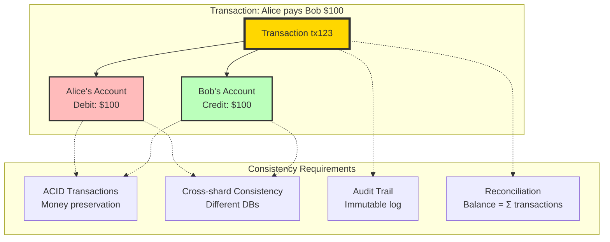
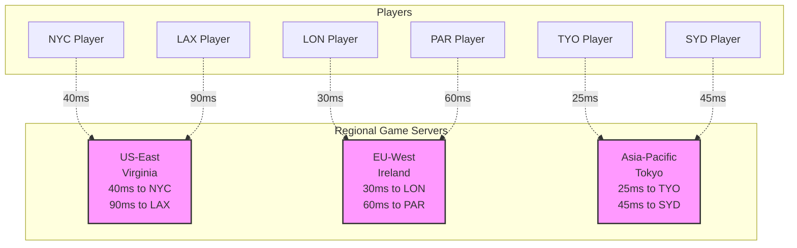

<!-- Navigation -->
[Home](/) → [Case Studies](/case-studies/) → **Case Studies: Axioms in Action**

# Case Studies: Axioms in Action

Learn how the 8 axioms and 5 pillars apply to real-world systems through detailed analysis of production architectures and their trade-offs.

---

## 🚗 Case Study 1: Uber's Real-Time Location System

**The Challenge**: Track millions of drivers and riders globally with sub-second updates

### Comprehensive Axiom Analysis

**🚀 Axiom 1 (Latency): The Speed of Causality**
```redis
Challenge: Driver in San Francisco, rider in New York wants ETA
Physical limit: 4,000km = 13.3ms at light speed
Reality: 150ms cross-country fiber latency

Solution: Regional compute + edge caching
- Driver location: Local edge nodes
- Global state: Eventually consistent
- ETAs: Pre-computed and cached

Latency Budget Breakdown:
- Network RTT: 20ms (same city)
- Database lookup: 5ms (cached)
- Matching algorithm: 50ms
- Safety checks: 10ms
- Response serialization: 5ms
- Buffer: 10ms
Total: 100ms (well under 500ms SLA)
```

**📦 Axiom 2 (Capacity): Finite Resources**
```yaml
Data Volume:
- 5M drivers × 1 update/4s = 1.25M writes/second
- Location queries: 50M/minute peak
- Map data: 500TB globally

Capacity Planning:
- Storage: Sharded by geohash
- Compute: Auto-scaling by region
- Network: CDN for map tiles
```

**💥 Axiom 3 (Failure): Inevitable Entropy**
```yaml
Failure Modes:
- AWS region outage (2017): 8-hour impact
- Database corruption: Data loss
- Network partitions: Stale locations

Mitigation:
- Multi-region deployment
- Read replicas per city
- Graceful degradation (show last known location)
```

**⏰ Axiom 4 (Concurrency): Distributed Timeline**
```yaml
Race Conditions:
- Multiple riders requesting same driver
- Driver accepts/cancels simultaneously
- Location updates out of order

Solution:
- Optimistic locking with versioning
- CRDT for location state
- Event ordering by timestamp
```

**🤝 Axiom 5 (Coordination): Distributed Agreement**
```yaml
Coordination Challenges:
- Driver assignment consensus
- Surge pricing agreement
- Route optimization coordination

Solution:
- Gossip protocol for driver availability
- Regional consensus for pricing
- Distributed route calculation
```

**👁️ Axiom 6 (Observability): System Transparency**
```proto
Monitoring Requirements:
- Real-time driver tracking
- Service health across regions
- Business metrics (rides/minute)

Implementation:
- Prometheus for metrics
- Jaeger for distributed tracing
- ELK stack for log aggregation
- Custom dashboards for ops
```

**👤 Axiom 7 (Human Interface): Driver Safety**
```yaml
Interface Constraints:
- Minimize driver distraction
- Quick glance information
- Voice-first interaction
- Emergency controls accessible

Design Decisions:
- Large touch targets
- High contrast display
- Audio notifications
- One-tap actions
```

**💰 Axiom 8 (Economics): Cost at Scale**
```bash
Economic Trade-offs:
- Accuracy vs infrastructure cost
- Real-time vs batch processing
- Global presence vs efficiency

Optimizations:
- Spot instances for batch work
- Reserved capacity for core services
- CDN for static resources
- Regional data sovereignty

Real Numbers (2022):
- Infrastructure: ~$500M/year
- Engineering: ~2000 engineers × $300k = $600M/year
- Total tech cost per ride: ~$0.30
- ROI on latency optimization: 300% (faster dispatch = more rides)
```

### Cross-Axiom Design Decisions

!!! example "How Uber Balances Competing Axioms"
    **Decision: Location Update Frequency**
    - Axiom 1 (Latency): Want real-time updates
    - Axiom 2 (Capacity): 5M drivers × updates = massive load
    - Axiom 8 (Economics): Bandwidth costs scale linearly

    **Solution**: Adaptive update frequency
    - Moving driver: 4-second updates
    - Stationary driver: 30-second updates
    - Result: 70% reduction in update volume

    **Decision: Consistency Model**
    - Axiom 5 (Coordination): Strong consistency is expensive
    - Axiom 3 (Failure): Must handle network partitions
    - Axiom 1 (Latency): Can't wait for global consensus

    **Solution**: Localized eventual consistency
    - City-level consistency boundaries
    - Cross-region reconciliation async
    - Result: <500ms dispatch with 99.99% accuracy

### Timeline & Evolution Context

### Architecture Evolution

### Key Design Decisions

**🎯 Decision 1: Consistency Model**
```yaml
Problem: Driver location must be consistent for dispatch

Options Evaluated:
1. Strong consistency (ACID)
   - Pros: Always accurate
   - Cons: 200ms+ latency, availability risk

2. Eventual consistency
   - Pros: <50ms latency, high availability
   - Cons: Occasionally stale data

3. Tunable consistency
   - Pros: Best of both worlds
   - Cons: Implementation complexity

Decision: Tunable consistency
- Critical operations: Strong (trip dispatch)
- Updates: Eventual (location tracking)
- Queries: Local read preference
```

**🎯 Decision 2: Data Partitioning Strategy**
```yaml
Problem: Scale location data globally

Options:
1. Geographic sharding (by city)
   - Pros: Data locality, clear boundaries
   - Cons: Hot spots, cross-city trips

2. Driver ID sharding
   - Pros: Even distribution
   - Cons: Poor locality, complex queries

3. Geohash-based sharding
   - Pros: Spatial locality, scalable
   - Cons: Implementation complexity

Decision: Hybrid approach
- Primary: Geohash (spatial queries)
- Secondary: Driver ID (driver operations)
- Cross-references maintained
```

### Lessons Learned

---

## 🛒 Case Study 2: Amazon's Dynamo Database

**The Challenge**: Build a database that never goes down during Black Friday

### Timeline & Evolution Context

### Comprehensive Axiom Analysis

**🚀 Axiom 1 (Latency): Physics-Based Design**
```text
Latency Budget Analysis:
- User tolerance: 100ms for page load
- Network: 50ms (coast-to-coast)
- Database: <20ms available
- Application: <30ms remaining

DynamoDB Solution:
- SSD storage: 1ms average access
- In-memory caching: 0.1ms
- Local replicas: Same AZ latency
- Result: 5-10ms database latency
```

**📦 Axiom 2 (Capacity): Infinite Scale Illusion**
```yaml
Scaling Requirements:
- Black Friday: 10x normal traffic
- Gradual ramp: 1M to 20M requests/sec
- No pre-provisioning needed

Implementation:
- Partition splits automatically
- Request routers update in real-time
- Admission control prevents overload
- Backpressure to applications
```

**💥 Axiom 3 (Failure): Always Available**
```yaml
Failure Scenarios:
- Node failures: 100s per day
- Rack failures: Weekly
- AZ failures: Quarterly
- Region failures: Rare but planned

Recovery Mechanisms:
- Hinted handoff for temporary failures
- Merkle trees for anti-entropy
- Read repair for inconsistencies
- Multi-region replication
```

**⏰ Axiom 4 (Concurrency): Time is Relative**
```dockerfile
Concurrent Operations:
- Shopping cart updates from multiple devices
- Wish list modifications
- Session data changes

Resolution Strategy:
- Vector clocks track causality
- Application-level reconciliation
- Last-write-wins option available
- Conflict-free replicated data types
```

**🤝 Axiom 5 (Coordination): Gossip over Consensus**
```yaml
Traditional Consensus Problems:
- Paxos requires majority (3/5 nodes)
- Network partition = unavailability
- Cross-region consensus = high latency

Dynamo's Innovation:
- Quorum reads/writes (R + W > N)
- Gossip-based membership
- Vector clocks for versioning
- Hinted handoff for recovery

Trade-off: Availability over consistency
```

**👁️ Axiom 6 (Observability): Operational Excellence**
```yaml
Monitoring Stack:
- CloudWatch metrics (latency, throughput)
- X-Ray for distributed tracing
- Contributor Insights for hot keys
- Alarms for anomalies

Key Metrics:
- UserErrors vs SystemErrors
- ConsumedReadCapacityUnits
- ThrottledRequests
- SuccessfulRequestLatency
```

**👤 Axiom 7 (Human Interface): Developer First**
```yaml
API Design Principles:
- Simple put/get/delete operations
- Consistent error codes
- Clear throttling signals
- Predictable behavior

SDK Features:
- Automatic retries with backoff
- Connection pooling
- Request signing
- Local development mode
```

**💰 Axiom 8 (Economics): Pay for What You Use**
```yaml
Pricing Models:
- On-demand: No capacity planning
- Provisioned: Predictable costs
- Reserved capacity: 50%+ savings
- Auto-scaling: Best of both

Cost Optimizations:
- Compression reduces storage
- Batch operations save API calls
- GSIs for query flexibility
- TTL for automatic cleanup
```

### The Dynamo Architecture

### Failure Handling Strategies

**🛡️ Multi-Level Resilience**
```yaml
Level 1: Node Failures
- Detect: Gossip protocol (heartbeats)
- React: Route traffic to replicas
- Recover: Hinted handoff when back

Level 2: Network Partitions
- Detect: Cannot reach quorum
- React: Serve stale data vs. fail
- Recover: Merkle tree sync

Level 3: Data Center Failures
- Detect: Regional health checks
- React: Cross-region failover
- Recover: Eventually consistent repair

Level 4: Correlated Failures
- Detect: Anomaly patterns
- React: Circuit breakers
- Recover: Manual intervention
```

### Performance Optimizations

### Key Design Decisions

---

## 🎵 Case Study 3: Spotify's Music Recommendation Engine

**The Challenge**: Recommend perfect music to 500M users in real-time

### Timeline & Evolution Context

### Axiom-Driven Architecture

!!! info "How Spotify's Architecture Maps to Each Axiom"
    **Axiom 1 (Latency)**: 100ms recommendation budget drives edge caching
    **Axiom 2 (Capacity)**: 100M songs × 500M users = clever indexing required
    **Axiom 3 (Failure)**: Graceful degradation to popular playlists
    **Axiom 4 (Concurrency)**: Millions generating playlists simultaneously
    **Axiom 5 (Coordination)**: Weekly model updates across regions
    **Axiom 6 (Observability)**: A/B testing every algorithm change
    **Axiom 7 (Human)**: DJ feature adds human voice to reduce cognitive load
    **Axiom 8 (Economics)**: Free tier must be cheap to serve
- **2023**: Generative AI opened new interaction paradigms

</div>

### Comprehensive Axiom Analysis

### The Recommendation Architecture

**🧠 Multi-Layer ML Pipeline**
```text
Layer 1: Content-Based Filtering
├─ Audio analysis (BPM, key, energy)
├─ Lyric sentiment analysis
├─ Artist/genre metadata
└─ Output: Song similarity matrix

Layer 2: Collaborative Filtering
├─ User-item interaction matrix
├─ Matrix factorization (ALS)
├─ Deep neural networks
└─ Output: User preference vectors

Layer 3: Contextual Bandits
├─ Time of day, device, location
├─ Recently played songs
├─ Social signals (friends' music)
└─ Output: Context-aware ranking

Layer 4: Real-time Personalization
├─ Session behavior tracking
├─ A/B testing framework
├─ Online learning updates
└─ Output: Final recommendations
```

### Intelligence Pillar Application

**🤖 Distributed Learning System**
```yaml
Training Pipeline:
1. Batch Processing (Hadoop/Spark)
   - Process 30TB daily listening data
   - Train models on historical patterns
   - Feature engineering at scale

2. Stream Processing (Kafka/Storm)
   - Real-time user behavior ingestion
   - Online learning updates
   - Context feature extraction

3. Model Serving (TensorFlow Serving)
   - Model versioning and rollout
   - A/B testing framework
   - Fallback to previous models

4. Feedback Loop
   - User actions (skip, like, replay)
   - Implicit feedback signals
   - Model performance metrics
```

### Global Scale Challenges

### Key Design Decisions

---

## 🏦 Case Study 4: PayPal's Payment Processing

**The Challenge**: Process billions in transactions with zero tolerance for money loss

### Timeline & Evolution Context

### Financial System Axioms

**💰 Axiom 8 (Economics): Cost of Trust**
```bash
Trust Infrastructure Costs:
- Fraud detection: $100M/year systems
- Compliance: 200 FTE lawyers/analysts
- Security: 24/7 SOC operations
- Auditing: External + internal teams

ROI Calculation:
- Trust system cost: $200M/year
- Fraud prevented: $2B/year
- Customer confidence: Priceless
- Regulatory fines avoided: $500M/year
```

**⚖️ Truth Pillar: Distributed Ledger**


### Payment Processing Pipeline

### Failure Recovery Patterns

**🔄 Saga Pattern for Distributed Transactions**
```bash
Problem: Transfer $100 from Alice to Bob across different systems

Happy Path:
1. Debit Alice account → SUCCESS
2. Credit Bob account → SUCCESS
3. Update ledger → SUCCESS
4. Send notifications → SUCCESS

Failure Scenario:
1. Debit Alice account → SUCCESS
2. Credit Bob account → FAILURE (system down)
3. Compensating transaction → Refund Alice
4. Log failure for retry → Manual review

Saga Coordinator:
- Tracks transaction state
- Executes compensating actions
- Ensures eventual consistency
- Provides audit trail
```

### Key Design Decisions

---

## 🎮 Case Study 5: Fortnite's Real-Time Game State

**The Challenge**: Synchronize 100-player battle royale in real-time

### Timeline & Evolution Context

### Real-Time Synchronization

**⏰ Axiom 4 (Concurrency): Game State Consistency**
```text
Challenge: Two players shoot each other simultaneously

Traditional Solution (Authoritative Server):
Player A shoots at T=100ms → Server at T=150ms → Player B dies
Player B shoots at T=102ms → Server at T=152ms → Denied (already dead)

Problem: Network latency creates unfairness

Fortnite's Solution (Client-Side Prediction + Rollback):
1. Both players see their shots hit
2. Server adjudicates with lag compensation
3. Rollback inconsistent states
4. Apply authoritative resolution
5. Update all clients with correction

Result: Fair gameplay despite network physics
```

**🌐 Geographic Distribution Strategy**


Matchmaking Algorithm:
1. Measure latency to all regions
2. Group players by geographic proximity
3. Prefer skill balance over perfect latency
4. Maximum 80ms latency difference in lobby
5. Dedicated servers (never peer-to-peer)

### Anti-Cheat Architecture

### Key Design Decisions

---

## 🚀 Case Study 6: SpaceX's Mission Control Systems

**The Challenge**: Control rockets with human lives at stake

### Timeline & Evolution Context

### Human Interface Design

**👤 Axiom 7: Life-Critical Interface Design**
```yaml
NASA Mission Control Principles Applied:

Information Hierarchy:
1. Critical alerts (RED): Immediate action required
2. Cautions (YELLOW): Monitor closely
3. Status (GREEN): Normal operations
4. Data (WHITE): Reference information

Display Design:
- High contrast (readable under stress)
- Redundant information paths
- Clear abort procedures
- Muscle memory interfaces

Decision Support:
- Pre-calculated abort scenarios
- Real-time trajectory analysis
- Automated failure detection
- Human oversight required
```

**🧠 Cognitive Load Management**
```yaml
Mission Phase Interfaces:

Pre-Launch (Low stress):
├─ Detailed system status
├─ Weather monitoring
├─ Range safety checks
└─ Go/No-go polling

Launch (High stress):
├─ Critical parameters only
├─ Abort decision tree
├─ Automatic safeguards active
└─ Simplified controls

Orbital (Moderate stress):
├─ Mission timeline
├─ System health monitoring
├─ Communication windows
└─ Experiment management
```

---

## 📊 Synthesis: Common Patterns Across Industries

### Key Design Decisions

---

## 🎯 Cross-Cutting Analysis: Patterns Across All Case Studies

### Common Patterns That Emerge

### Universal Lessons

!!! success "What Every Case Study Teaches"

    **1. Latency Dominates Architecture**
    - Uber: Regional dispatch centers
    - DynamoDB: Predictable single-digit ms
    - Spotify: Edge caching for music
    - Fortnite: Regional game servers
    - SpaceX: <100ms abort decisions

    **2. Failure is Not Optional**
    - Every system assumes components will fail
    - Difference is in acceptable failure modes
    - Life-critical (SpaceX) vs Revenue-critical (PayPal) vs Experience-critical (Spotify)

    **3. Consistency is Expensive**
    - Only PayPal chose strong consistency (money)
    - Everyone else chose eventual consistency
    - Trade-off is always latency vs correctness

    **4. Human Factors Scale Linearly**
    - More complex system = More operational burden
    - Uber: 2000 engineers
    - DynamoDB: 50 operators for millions of databases
    - SpaceX: Cognitive load management crucial

### Industry-Specific Insights

### The Meta-Pattern

!!! info "The Ultimate Distributed Systems Pattern"

    Across all case studies, one meta-pattern emerges:

    **"Distribute work, centralize coordination, localize decisions"**

    - **Distribute Work**: All systems spread computation (Uber drivers, DynamoDB nodes, Spotify ML)
    - **Centralize Coordination**: All have some central authority (dispatch, membership, playlist)
    - **Localize Decisions**: Fast decisions happen close to data (edge nodes, regional replicas)

    This pattern emerges from the fundamental tension between Axioms 1 (Latency) and 5 (Coordination).

### Economic Patterns

---

*"Case studies bridge the gap between theory and practice—learn from those who've scaled before you."*
