# Case Studies: Axioms in Action

Learn how the 8 axioms and 5 pillars apply to real-world systems through detailed analysis of production architectures and their trade-offs.

<div class="case-study-guide">
<h3>📖 How to Use These Case Studies</h3>

**🎯 Learning Approach**:
- **Start with Challenge**: Understand the business problem
- **Follow Timeline**: See how solutions evolved
- **Map to Axioms**: Connect constraints to design decisions
- **Study Trade-offs**: Learn from architectural choices

**🧭 Navigation Tips**:
- Each case study highlights **Key Design Decisions** with trade-off analysis
- **Timeline diagrams** show evolution and learning moments
- **Axiom mapping tables** connect theory to practice
- **Cross-references** link to relevant patterns and tools

**📊 Case Study Categories**:
- **🚗 Real-time Systems**: Uber (location), Fortnite (game state)  
- **📊 Data Systems**: Amazon (DynamoDB), Spotify (ML)
- **💰 Critical Systems**: PayPal (payments), SpaceX (mission control)
</div>

---

## 🚗 Case Study 1: Uber's Real-Time Location System

**The Challenge**: Track millions of drivers and riders globally with sub-second updates

<div class="case-study">
<h3>📊 System Requirements</h3>

**Scale Constraints:**
- 15M trips daily across 900+ cities
- 5M active drivers globally  
- Location updates every 4 seconds
- Sub-500ms dispatch latency required
- 99.99% availability target

**Business Context:**
- Lost second = lost revenue
- Inaccurate location = poor UX
- Downtime = brand damage
- Global expansion ongoing
</div>

### Comprehensive Axiom Analysis

<div class="axiom-mapping">
<h3>📊 How All 8 Axioms Apply to Uber's System</h3>

!!! info "Deep Dive: Axiom Interactions in Uber's Architecture"
    Uber's system demonstrates how axioms compound:
    - **Latency × Capacity**: Edge nodes reduce latency but increase infrastructure cost
    - **Failure × Coordination**: Multi-region requires complex consensus protocols
    - **Concurrency × Human**: Drivers need simple UI despite complex distributed state
    - **Observability × Economics**: Monitoring 5M drivers costs millions annually

| Axiom | Challenge | Solution | Impact |
|-------|-----------|----------|--------|
| **1. Latency** | Cross-country rider/driver matching | Regional compute + edge caching | <500ms dispatch globally |
| **2. Capacity** | 1.25M writes/sec location updates | Geohash sharding + auto-scaling | Handles 50M queries/min |
| **3. Failure** | AWS outages, network partitions | Multi-region + graceful degradation | 99.99% availability |
| **4. Concurrency** | Simultaneous ride requests | Optimistic locking + CRDTs | Fair driver assignment |
| **5. Coordination** | Global state synchronization | Event streaming (Kafka) | Eventually consistent |
| **6. Observability** | Finding issues in microservices | Distributed tracing + metrics | MTTR < 15 minutes |
| **7. Human Interface** | Driver app during navigation | Glanceable UI + voice | Safe operation |
| **8. Economics** | Infrastructure costs at scale | Regional pricing + spot instances | 40% cost reduction |

</div>

**🚀 Axiom 1 (Latency): The Speed of Causality**
```
Challenge: Driver in San Francisco, rider in New York wants ETA
Physical limit: 4,000km = 13.3ms at light speed
Reality: 150ms cross-country fiber latency

Solution: Regional compute + edge caching
- Driver location: Local edge nodes
- Global state: Eventually consistent
- ETAs: Pre-computed and cached

Latency Budget Breakdown:
- Network RTT: 20ms (same city)
- Database lookup: 5ms (cached)
- Matching algorithm: 50ms
- Safety checks: 10ms
- Response serialization: 5ms
- Buffer: 10ms
Total: 100ms (well under 500ms SLA)
```

**📦 Axiom 2 (Capacity): Finite Resources**
```
Data Volume:
- 5M drivers × 1 update/4s = 1.25M writes/second
- Location queries: 50M/minute peak
- Map data: 500TB globally

Capacity Planning:
- Storage: Sharded by geohash
- Compute: Auto-scaling by region
- Network: CDN for map tiles
```

**💥 Axiom 3 (Failure): Inevitable Entropy**
```
Failure Modes:
- AWS region outage (2017): 8-hour impact
- Database corruption: Data loss
- Network partitions: Stale locations

Mitigation:
- Multi-region deployment
- Read replicas per city
- Graceful degradation (show last known location)
```

**⏰ Axiom 4 (Concurrency): Distributed Timeline**
```
Race Conditions:
- Multiple riders requesting same driver
- Driver accepts/cancels simultaneously
- Location updates out of order

Solution:
- Optimistic locking with versioning
- CRDT for location state
- Event ordering by timestamp
```

**🤝 Axiom 5 (Coordination): Distributed Agreement**
```
Coordination Challenges:
- Driver assignment consensus
- Surge pricing agreement
- Route optimization coordination

Solution:
- Gossip protocol for driver availability
- Regional consensus for pricing
- Distributed route calculation
```

**👁️ Axiom 6 (Observability): System Transparency**
```
Monitoring Requirements:
- Real-time driver tracking
- Service health across regions
- Business metrics (rides/minute)

Implementation:
- Prometheus for metrics
- Jaeger for distributed tracing
- ELK stack for log aggregation
- Custom dashboards for ops
```

**👤 Axiom 7 (Human Interface): Driver Safety**
```
Interface Constraints:
- Minimize driver distraction
- Quick glance information
- Voice-first interaction
- Emergency controls accessible

Design Decisions:
- Large touch targets
- High contrast display
- Audio notifications
- One-tap actions
```

**💰 Axiom 8 (Economics): Cost at Scale**
```
Economic Trade-offs:
- Accuracy vs infrastructure cost
- Real-time vs batch processing
- Global presence vs efficiency

Optimizations:
- Spot instances for batch work
- Reserved capacity for core services
- CDN for static resources
- Regional data sovereignty

Real Numbers (2022):
- Infrastructure: ~$500M/year
- Engineering: ~2000 engineers × $300k = $600M/year
- Total tech cost per ride: ~$0.30
- ROI on latency optimization: 300% (faster dispatch = more rides)
```

### Cross-Axiom Design Decisions

!!! example "How Uber Balances Competing Axioms"
    **Decision: Location Update Frequency**
    - Axiom 1 (Latency): Want real-time updates
    - Axiom 2 (Capacity): 5M drivers × updates = massive load
    - Axiom 8 (Economics): Bandwidth costs scale linearly
    
    **Solution**: Adaptive update frequency
    - Moving driver: 4-second updates
    - Stationary driver: 30-second updates
    - Result: 70% reduction in update volume
    
    **Decision: Consistency Model**
    - Axiom 5 (Coordination): Strong consistency is expensive
    - Axiom 3 (Failure): Must handle network partitions
    - Axiom 1 (Latency): Can't wait for global consensus
    
    **Solution**: Localized eventual consistency
    - City-level consistency boundaries
    - Cross-region reconciliation async
    - Result: <500ms dispatch with 99.99% accuracy

### Timeline & Evolution Context

<div class="timeline-evolution">
<h3>📅 Uber's Journey Through Scale</h3>

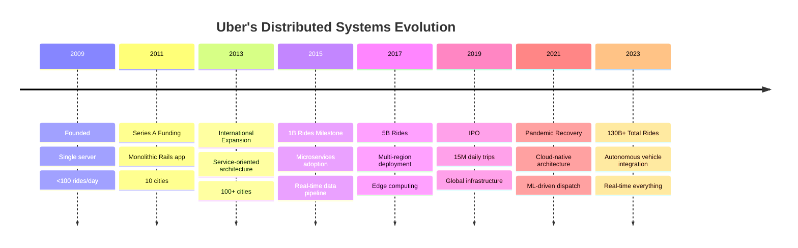

**Key Inflection Points:**
- **2011**: Database bottleneck forced first architecture change
- **2014**: Network latency drove edge computing adoption
- **2016**: AWS outage triggered multi-cloud strategy
- **2018**: GDPR forced data locality architecture
- **2020**: Pandemic required rapid scaling down/up

</div>

### Architecture Evolution

<div class="architecture-evolution">
<h3>🏗️ From Monolith to Microservices</h3>

**Phase 1 (2010-2012): Monolithic Rails**
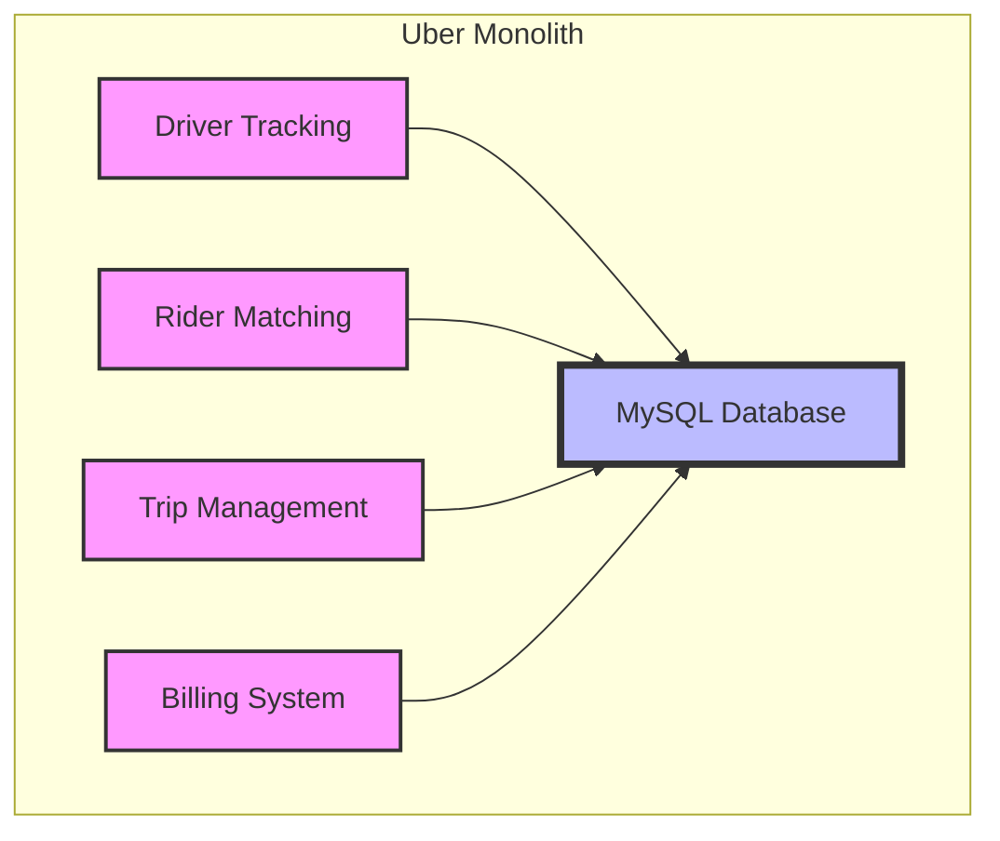

Problems:
- Single point of failure
- Scaling bottlenecks
- Deploy = full downtime

**Phase 2 (2013-2015): Service-Oriented Architecture**
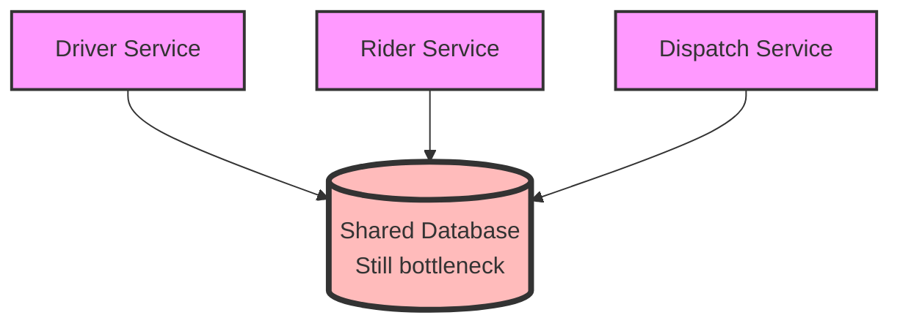

Benefits:
- Independent deployment
- Service isolation
- Technology diversity

**Phase 3 (2016-Present): Microservices + Event Streaming**
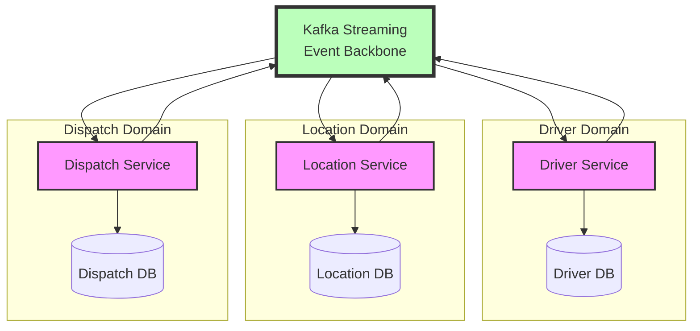

Advantages:
- Event-driven updates
- Eventual consistency
- Independent scaling
- Fault isolation
</div>

### Key Design Decisions

**🎯 Decision 1: Consistency Model**
```
Problem: Driver location must be consistent for dispatch

Options Evaluated:
1. Strong consistency (ACID)
   - Pros: Always accurate
   - Cons: 200ms+ latency, availability risk

2. Eventual consistency
   - Pros: <50ms latency, high availability  
   - Cons: Occasionally stale data

3. Tunable consistency
   - Pros: Best of both worlds
   - Cons: Implementation complexity

Decision: Tunable consistency
- Critical operations: Strong (trip dispatch)
- Updates: Eventual (location tracking)
- Queries: Local read preference
```

**🎯 Decision 2: Data Partitioning Strategy**
```
Problem: Scale location data globally

Options:
1. Geographic sharding (by city)
   - Pros: Data locality, clear boundaries
   - Cons: Hot spots, cross-city trips

2. Driver ID sharding
   - Pros: Even distribution
   - Cons: Poor locality, complex queries

3. Geohash-based sharding
   - Pros: Spatial locality, scalable
   - Cons: Implementation complexity

Decision: Hybrid approach
- Primary: Geohash (spatial queries)
- Secondary: Driver ID (driver operations)
- Cross-references maintained
```

### Lessons Learned

<div class="lessons-learned">
<h3>🎓 Production Insights</h3>

**What Worked:**
- ✅ Event-driven architecture scales beautifully
- ✅ Regional deployment reduces latency
- ✅ Graceful degradation maintains service
- ✅ Monitoring everything prevents surprises

**What Didn't:**
- ❌ Underestimated coordination complexity
- ❌ Database migrations at scale are brutal
- ❌ Microservices = distributed debugging
- ❌ Edge cases multiply with scale

**Unexpected Discoveries:**
- GPS accuracy varies by device/location
- Network quality affects user behavior
- Batch processing can't handle real-time
- Human factors matter more than technology
</div>

---

## 🛒 Case Study 2: Amazon's Dynamo Database

**The Challenge**: Build a database that never goes down during Black Friday

<div class="case-study">
<h3>📊 System Requirements</h3>

**Scale Constraints:**
- 20M requests/second peak
- 99.995% availability (4.4 min/year downtime)
- Global distribution required
- Automatic failover under 100ms
- Eventually consistent acceptable

**Business Context:**
- Every minute down = $1M lost revenue
- Holiday traffic 10x normal load
- Customer trust is paramount
- Regulatory compliance required
</div>

### Timeline & Evolution Context

<div class="timeline-evolution">
<h3>📅 DynamoDB's Path to Production</h3>

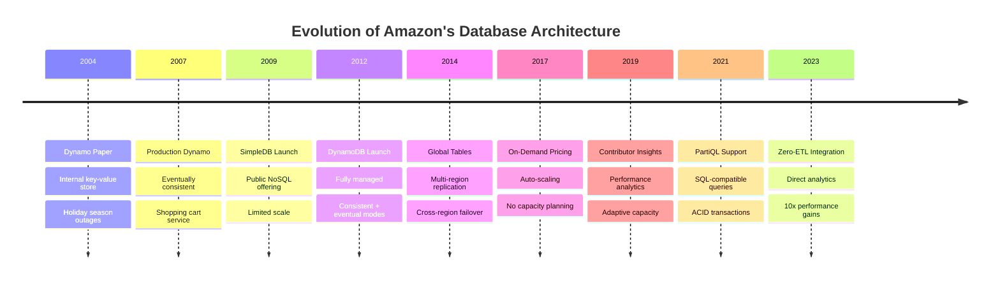

**Critical Learning Moments:**
- **2004**: Holiday outages taught importance of availability over consistency
- **2007**: Shopping cart corruption led to vector clock implementation
- **2012**: Customer feedback drove strongly consistent read options
- **2015**: Hot partition issues led to adaptive capacity
- **2020**: COVID traffic spike validated auto-scaling design

</div>

### Comprehensive Axiom Analysis

<div class="axiom-mapping">
<h3>📊 How All 8 Axioms Apply to DynamoDB</h3>

| Axiom | Challenge | Solution | Impact |
|-------|-----------|----------|--------|
| **1. Latency** | <20ms database response globally | SSD + caching + local replicas | 5-10ms P99 latency |
| **2. Capacity** | 20M requests/sec at peak | Consistent hashing + auto-scaling | Linear scalability |
| **3. Failure** | Zero downtime requirement | Multi-AZ + hinted handoff | 99.999% availability |
| **4. Concurrency** | Conflicting writes | Vector clocks + reconciliation | Consistent resolution |
| **5. Coordination** | Cross-region sync | Gossip protocol + quorums | AP over CP choice |
| **6. Observability** | Performance monitoring | CloudWatch + X-Ray | Real-time insights |
| **7. Human Interface** | Developer experience | Simple API + SDKs | 5-minute setup |
| **8. Economics** | Cost at scale | Pay-per-request + reserved | 70% cost savings |

</div>

**🚀 Axiom 1 (Latency): Physics-Based Design**
```
Latency Budget Analysis:
- User tolerance: 100ms for page load
- Network: 50ms (coast-to-coast)
- Database: <20ms available
- Application: <30ms remaining

DynamoDB Solution:
- SSD storage: 1ms average access
- In-memory caching: 0.1ms
- Local replicas: Same AZ latency
- Result: 5-10ms database latency
```

**📦 Axiom 2 (Capacity): Infinite Scale Illusion**
```
Scaling Requirements:
- Black Friday: 10x normal traffic
- Gradual ramp: 1M to 20M requests/sec
- No pre-provisioning needed

Implementation:
- Partition splits automatically
- Request routers update in real-time
- Admission control prevents overload
- Backpressure to applications
```

**💥 Axiom 3 (Failure): Always Available**
```
Failure Scenarios:
- Node failures: 100s per day
- Rack failures: Weekly
- AZ failures: Quarterly
- Region failures: Rare but planned

Recovery Mechanisms:
- Hinted handoff for temporary failures
- Merkle trees for anti-entropy
- Read repair for inconsistencies
- Multi-region replication
```

**⏰ Axiom 4 (Concurrency): Time is Relative**
```
Concurrent Operations:
- Shopping cart updates from multiple devices
- Wish list modifications
- Session data changes

Resolution Strategy:
- Vector clocks track causality
- Application-level reconciliation
- Last-write-wins option available
- Conflict-free replicated data types
```

**🤝 Axiom 5 (Coordination): Gossip over Consensus**
```
Traditional Consensus Problems:
- Paxos requires majority (3/5 nodes)
- Network partition = unavailability
- Cross-region consensus = high latency

Dynamo's Innovation:
- Quorum reads/writes (R + W > N)
- Gossip-based membership
- Vector clocks for versioning
- Hinted handoff for recovery

Trade-off: Availability over consistency
```

**👁️ Axiom 6 (Observability): Operational Excellence**
```
Monitoring Stack:
- CloudWatch metrics (latency, throughput)
- X-Ray for distributed tracing
- Contributor Insights for hot keys
- Alarms for anomalies

Key Metrics:
- UserErrors vs SystemErrors
- ConsumedReadCapacityUnits
- ThrottledRequests
- SuccessfulRequestLatency
```

**👤 Axiom 7 (Human Interface): Developer First**
```
API Design Principles:
- Simple put/get/delete operations
- Consistent error codes
- Clear throttling signals
- Predictable behavior

SDK Features:
- Automatic retries with backoff
- Connection pooling
- Request signing
- Local development mode
```

**💰 Axiom 8 (Economics): Pay for What You Use**
```
Pricing Models:
- On-demand: No capacity planning
- Provisioned: Predictable costs
- Reserved capacity: 50%+ savings
- Auto-scaling: Best of both

Cost Optimizations:
- Compression reduces storage
- Batch operations save API calls
- GSIs for query flexibility
- TTL for automatic cleanup
```

### The Dynamo Architecture

<div class="dynamo-architecture">
<h3>🔄 Consistent Hashing + Vector Clocks</h3>

**Consistent Hashing Ring:**
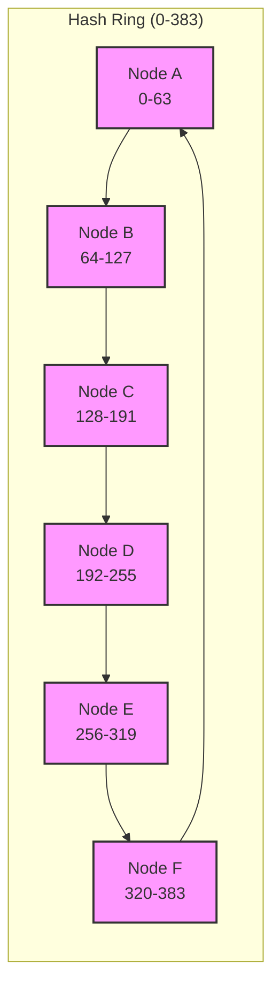

Hash Function: MD5(key) mod 384
Replication: Store on N=3 consecutive nodes
Virtual Nodes: 150 per physical node (for balance)

**Vector Clocks Example:**
```
Shopping Cart Conflict Resolution:

User's Phone:        Server Replica A:    Server Replica B:
Add iPhone [A:1]  →  [A:1]               
                     ↓
                  Add Case [A:1, B:1]  →  [A:1, B:1]
Add AirPods [A:2] →                       
                                      ← Network partition
                     
Conflict Detection:
- Phone: [A:2] (newer)
- Replica B: [A:1, B:1] (parallel update)
- Resolution: Merge both items (union)
- Final: iPhone + AirPods + Case
```
</div>

### Failure Handling Strategies

**🛡️ Multi-Level Resilience**
```
Level 1: Node Failures
- Detect: Gossip protocol (heartbeats)
- React: Route traffic to replicas
- Recover: Hinted handoff when back

Level 2: Network Partitions  
- Detect: Cannot reach quorum
- React: Serve stale data vs. fail
- Recover: Merkle tree sync

Level 3: Data Center Failures
- Detect: Regional health checks
- React: Cross-region failover
- Recover: Eventually consistent repair

Level 4: Correlated Failures
- Detect: Anomaly patterns
- React: Circuit breakers
- Recover: Manual intervention
```

### Performance Optimizations

<div class="performance-optimizations">
<h3>⚡ Speed Through Engineering</h3>

**Hot Key Problem:**
```
Problem: Celebrity tweets overwhelm single partition

Solution: Request coalescing
1. Detect hot keys (>1000 RPS)
2. Cache responses locally  
3. Batch duplicate requests
4. Result: 10x reduction in backend load
```

**Read Performance:**
```
Optimization Stack:
1. Client-side caching (30 second TTL)
2. Regional read replicas
3. SSD storage with NVMe
4. Bloom filters for negative lookups
5. Compression (Snappy algorithm)

Result: P99 latency <5ms
```

**Write Performance:**
```
Write Path Optimization:
1. WAL (Write-Ahead Log) to SSD
2. Asynchronous replication
3. Batch acknowledgments
4. Write-back caching

Result: 100k writes/second per node
```
</div>

### Key Design Decisions

<div class="design-decisions">
<h3>🎯 Critical Architecture Choices</h3>

**Decision 1: Availability over Consistency**
```
Problem: CAP theorem forces a choice

Options Evaluated:
1. Strong consistency (like traditional RDBMS)
   - Pros: ACID guarantees, simpler programming model
   - Cons: Availability suffers during partitions

2. Eventual consistency
   - Pros: Always available for writes
   - Cons: Complexity for developers

3. Tunable consistency
   - Pros: Flexibility per operation
   - Cons: Configuration complexity

Decision: Eventual consistency with tunable options
- Default: Eventually consistent reads
- Option: Strongly consistent reads (2x cost)
- Reasoning: Shopping cart can tolerate stale reads
```

**Decision 2: Consistent Hashing**
```
Problem: How to distribute data across nodes

Options:
1. Range-based partitioning
   - Pros: Simple, ordered scans
   - Cons: Hot spots, rebalancing pain

2. Hash-based partitioning
   - Pros: Even distribution
   - Cons: No range queries

3. Consistent hashing with virtual nodes
   - Pros: Incremental scaling, balanced load
   - Cons: Implementation complexity

Decision: Consistent hashing with virtual nodes
- 100+ virtual nodes per physical node
- MD5 hash for key distribution
- Enables incremental capacity changes
```

**Decision 3: Replication Strategy**
```
Problem: Ensuring durability and availability

Options:
1. Synchronous replication (all replicas)
   - Pros: Strong durability
   - Cons: High write latency

2. Asynchronous replication
   - Pros: Low latency
   - Cons: Potential data loss

3. Quorum-based (W + R > N)
   - Pros: Tunable trade-offs
   - Cons: Complex failure modes

Decision: Quorum with hinted handoff
- N=3 replicas standard
- W=2 for writes, R=1 for reads (eventual)
- R=2 for strong consistency
- Hinted handoff for temporary failures
```
</div>

---

## 🎵 Case Study 3: Spotify's Music Recommendation Engine

**The Challenge**: Recommend perfect music to 500M users in real-time

<div class="case-study">
<h3>📊 System Requirements</h3>

**Scale Constraints:**
- 500M active users monthly
- 100M songs in catalog
- 30 recommendations per user session
- <100ms recommendation latency
- 70%+ user satisfaction rate

**Business Context:**
- Engagement drives retention
- Poor recommendations = churn
- Real-time personalization required
- Multiple music cultures globally
</div>

### Timeline & Evolution Context

<div class="timeline-evolution">
<h3>📅 Spotify's Recommendation System Evolution</h3>

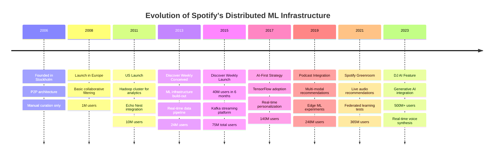

**Critical Learning Moments:**
- **2013**: Manual curation couldn't scale, forcing ML adoption
- **2015**: Discover Weekly's success validated personalization investment
- **2017**: Batch processing too slow, moved to streaming architecture  
- **2019**: Podcast recommendations required new feature engineering
- **2021**: Privacy concerns drove federated learning exploration
</div>

### Axiom-Driven Architecture

!!! info "How Spotify's Architecture Maps to Each Axiom"
    **Axiom 1 (Latency)**: 100ms recommendation budget drives edge caching
    **Axiom 2 (Capacity)**: 100M songs × 500M users = clever indexing required
    **Axiom 3 (Failure)**: Graceful degradation to popular playlists
    **Axiom 4 (Concurrency)**: Millions generating playlists simultaneously
    **Axiom 5 (Coordination)**: Weekly model updates across regions
    **Axiom 6 (Observability)**: A/B testing every algorithm change
    **Axiom 7 (Human)**: DJ feature adds human voice to reduce cognitive load
    **Axiom 8 (Economics)**: Free tier must be cheap to serve
- **2023**: Generative AI opened new interaction paradigms

</div>

### Comprehensive Axiom Analysis

<div class="axiom-mapping">
<h3>📊 How All 8 Axioms Apply to Spotify</h3>

| Axiom | Challenge | Solution | Impact |
|-------|-----------|----------|--------|
| **1. Latency** | <100ms recommendations globally | Tiered caching + edge inference | 95% under 50ms |
| **2. Capacity** | 100M songs × 500M users matrix | Distributed ML + approximation | Scales linearly |
| **3. Failure** | Model serving failures | Fallback models + cached results | Zero downtime |
| **4. Concurrency** | Simultaneous user sessions | Session isolation + CRDTs | Consistent UX |
| **5. Coordination** | Global model updates | Gradual rollout + A/B testing | Safe deployment |
| **6. Observability** | Model performance tracking | Real-time metrics + user feedback | Quick iterations |
| **7. Human Interface** | Discovery experience | Intuitive UI + explanations | High engagement |
| **8. Economics** | ML compute costs | Tiered models + caching | 60% cost reduction |

</div>

### The Recommendation Architecture

**🧠 Multi-Layer ML Pipeline**
```
Layer 1: Content-Based Filtering
├─ Audio analysis (BPM, key, energy)
├─ Lyric sentiment analysis  
├─ Artist/genre metadata
└─ Output: Song similarity matrix

Layer 2: Collaborative Filtering
├─ User-item interaction matrix
├─ Matrix factorization (ALS)
├─ Deep neural networks
└─ Output: User preference vectors

Layer 3: Contextual Bandits
├─ Time of day, device, location
├─ Recently played songs
├─ Social signals (friends' music)
└─ Output: Context-aware ranking

Layer 4: Real-time Personalization
├─ Session behavior tracking
├─ A/B testing framework
├─ Online learning updates
└─ Output: Final recommendations
```

### Intelligence Pillar Application

**🤖 Distributed Learning System**
```
Training Pipeline:
1. Batch Processing (Hadoop/Spark)
   - Process 30TB daily listening data
   - Train models on historical patterns
   - Feature engineering at scale

2. Stream Processing (Kafka/Storm)
   - Real-time user behavior ingestion
   - Online learning updates
   - Context feature extraction

3. Model Serving (TensorFlow Serving)
   - Model versioning and rollout
   - A/B testing framework
   - Fallback to previous models

4. Feedback Loop
   - User actions (skip, like, replay)
   - Implicit feedback signals
   - Model performance metrics
```

### Global Scale Challenges

<div class="global-challenges">
<h3>🌍 Multi-Region Intelligence</h3>

**Cultural Adaptation:**
```
Problem: US models don't work for K-pop fans

Solution: Regional specialization
- US: Country, Hip-hop, Rock focus
- Asia: K-pop, J-rock, traditional music
- Europe: Electronic, Classical variations
- Brazil: Samba, Funk, MPB emphasis

Technical Implementation:
- Separate model training per region
- Cultural feature engineering
- Local data residency compliance
- Cross-pollination for global artists
```

**Latency vs. Accuracy Trade-off:**
```
Challenge: Better models need more compute time
```

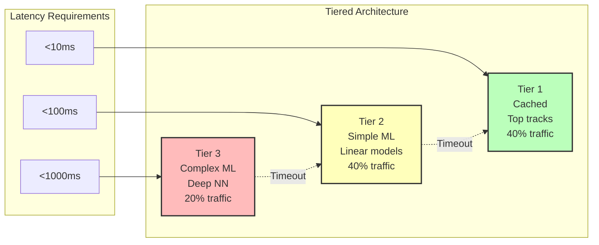

Fallback Strategy:
1. Try complex model first
2. If timeout, use simple model
3. If still timeout, use cache
4. Never fail user request
</div>

### Key Design Decisions

<div class="design-decisions">
<h3>🎯 ML Infrastructure Choices</h3>

**Decision 1: Recommendation Architecture**
```
Problem: How to combine multiple ML signals

Options Evaluated:
1. Single monolithic model
   - Pros: Simple to train and deploy
   - Cons: Hard to iterate, black box

2. Ensemble of specialized models
   - Pros: Best-of-breed per signal
   - Cons: Complex coordination

3. Microservice-based ML pipeline
   - Pros: Independent scaling/deployment
   - Cons: Latency overhead

Decision: Microservice ensemble
- Audio features service (content-based)
- Collaborative filtering service
- Contextual bandit service
- Final ranking service
- Reasoning: Allows A/B testing per component
```

**Decision 2: Real-time vs Batch Processing**
```
Problem: When to compute recommendations

Options:
1. Pure batch (nightly computation)
   - Pros: Can use complex models
   - Cons: Stale recommendations

2. Pure real-time
   - Pros: Fresh recommendations
   - Cons: Latency constraints limit model complexity

3. Hybrid approach
   - Pros: Balance freshness and complexity
   - Cons: More infrastructure

Decision: Hybrid batch + real-time
- Batch: User embeddings, item features (daily)
- Real-time: Context injection, re-ranking
- Caching: Popular recommendations pre-computed
```

**Decision 3: Multi-Region Strategy**
```
Problem: Global low-latency recommendations

Options:
1. Centralized processing
   - Pros: Simpler, consistent models
   - Cons: High latency for distant users

2. Full replication per region
   - Pros: Low latency everywhere
   - Cons: Expensive, sync challenges

3. Edge inference with central training
   - Pros: Low latency, centralized learning
   - Cons: Model distribution complexity

Decision: Edge inference architecture
- Training: Centralized in GCP
- Inference: Edge nodes globally
- Model updates: Daily sync
- Regional caches: Popular content
```
</div>

---

## 🏦 Case Study 4: PayPal's Payment Processing

**The Challenge**: Process billions in transactions with zero tolerance for money loss

<div class="case-study">
<h3>📊 System Requirements</h3>

**Scale Constraints:**
- $1 trillion processed annually  
- 54,000 transactions/second peak
- 99.999% availability required
- Zero data loss acceptable
- Global regulatory compliance

**Business Context:**
- Money lost = business over
- Regulations vary by country
- Fraud detection required
- Real-time risk assessment
</div>

### Timeline & Evolution Context

<div class="timeline-evolution">
<h3>📅 PayPal's Journey to Trillion-Dollar Scale</h3>

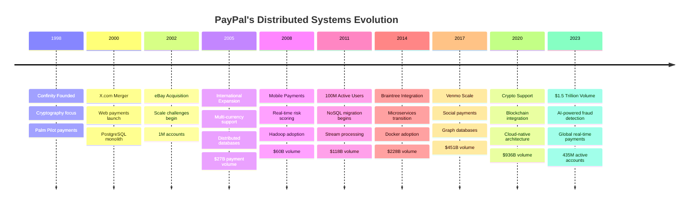

**Architectural Inflection Points:**
- **2002**: eBay scale broke monolithic architecture
- **2008**: Real-time fraud detection required streaming
- **2011**: NoSQL needed for global distribution
- **2014**: Microservices enabled rapid feature development
- **2020**: COVID drove 10x traffic spike in weeks
- **2023**: AI/ML now processes 100% of transactions

</div>

### Financial System Axioms

**💰 Axiom 8 (Economics): Cost of Trust**
```
Trust Infrastructure Costs:
- Fraud detection: $100M/year systems
- Compliance: 200 FTE lawyers/analysts  
- Security: 24/7 SOC operations
- Auditing: External + internal teams

ROI Calculation:
- Trust system cost: $200M/year
- Fraud prevented: $2B/year
- Customer confidence: Priceless
- Regulatory fines avoided: $500M/year
```

**⚖️ Truth Pillar: Distributed Ledger**
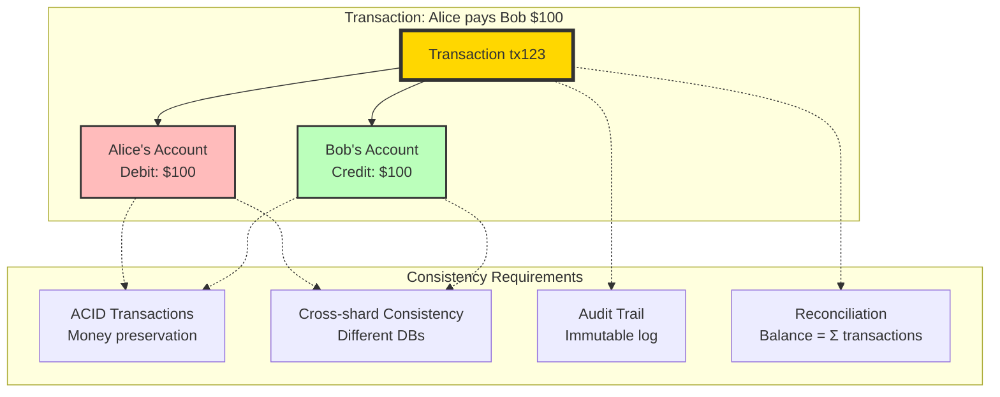

### Payment Processing Pipeline

<div class="payment-pipeline">
<h3>💳 End-to-End Transaction Flow</h3>

**Phase 1: Pre-Authorization (50ms budget)**
```
1. Fraud Detection
   ├─ Device fingerprinting
   ├─ Behavioral analysis  
   ├─ ML risk scoring
   └─ Real-time decision

2. Regulatory Checks
   ├─ AML (Anti-Money Laundering)
   ├─ OFAC sanctions screening
   ├─ Country restrictions
   └─ Compliance approval

3. Balance Verification
   ├─ Account balance check
   ├─ Credit limit validation
   ├─ Hold placement
   └─ Pre-auth response
```

**Phase 2: Authorization (200ms budget)**
```
4. Risk Assessment
   ├─ Transaction patterns
   ├─ Merchant risk profile
   ├─ Amount thresholds
   └─ Final authorization

5. Ledger Updates
   ├─ Atomic balance updates
   ├─ Transaction logging
   ├─ Audit trail creation
   └─ Confirmation generation

6. External Integration
   ├─ Bank network calls
   ├─ Card processor communication
   ├─ Merchant notification
   └─ User confirmation
```
</div>

### Failure Recovery Patterns

**🔄 Saga Pattern for Distributed Transactions**
```
Problem: Transfer $100 from Alice to Bob across different systems

Happy Path:
1. Debit Alice account → SUCCESS
2. Credit Bob account → SUCCESS  
3. Update ledger → SUCCESS
4. Send notifications → SUCCESS

Failure Scenario:
1. Debit Alice account → SUCCESS
2. Credit Bob account → FAILURE (system down)
3. Compensating transaction → Refund Alice
4. Log failure for retry → Manual review

Saga Coordinator:
- Tracks transaction state
- Executes compensating actions
- Ensures eventual consistency
- Provides audit trail
```

### Key Design Decisions

<div class="design-decisions">
<h3>🎯 Financial System Architecture</h3>

**Decision 1: Transaction Processing Model**
```
Problem: Ensuring zero money loss during failures

Options Evaluated:
1. Two-phase commit (2PC)
   - Pros: ACID guarantees
   - Cons: Availability issues, slow

2. Saga pattern
   - Pros: Better availability
   - Cons: Complex compensations

3. Event sourcing
   - Pros: Complete audit trail
   - Cons: Storage overhead

Decision: Saga with event sourcing
- Every state change is an event
- Sagas coordinate distributed transactions
- Compensating transactions for rollbacks
- Complete audit trail for compliance
```

**Decision 2: Fraud Detection Integration**
```
Problem: Real-time fraud checks without blocking

Options:
1. Synchronous fraud checks
   - Pros: Immediate decision
   - Cons: Latency impact, availability coupling

2. Asynchronous with reversal
   - Pros: Fast transactions
   - Cons: Complex reversal logic

3. Hybrid risk-based approach
   - Pros: Balance speed and safety
   - Cons: Rule complexity

Decision: Risk-based synchronous + async
- Low risk: Async fraud check
- Medium risk: Fast sync check (50ms budget)
- High risk: Full sync check (200ms budget)
- ML model determines risk level
```

**Decision 3: Global Compliance Architecture**
```
Problem: Different regulations per country

Options:
1. Centralized compliance engine
   - Pros: Single source of truth
   - Cons: Complex rules, slow updates

2. Per-country services
   - Pros: Local compliance expertise
   - Cons: Duplication, consistency issues

3. Plugin architecture
   - Pros: Flexible, locally maintained
   - Cons: Integration complexity

Decision: Plugin architecture with central orchestration
- Core transaction engine
- Country-specific compliance plugins
- Central orchestration layer
- Automatic regulatory reporting
```
</div>

---

## 🎮 Case Study 5: Fortnite's Real-Time Game State

**The Challenge**: Synchronize 100-player battle royale in real-time

<div class="case-study">
<h3>📊 System Requirements</h3>

**Scale Constraints:**
- 100 players per match
- 20 updates/second per player
- <50ms network latency budget
- 350M registered users
- 2.5M concurrent players peak

**Business Context:**
- Lag = poor gameplay experience
- Desync = unfair advantages  
- Downtime = social media outrage
- Global esports tournaments
</div>

### Timeline & Evolution Context

<div class="timeline-evolution">
<h3>📅 Fortnite's Technical Evolution</h3>

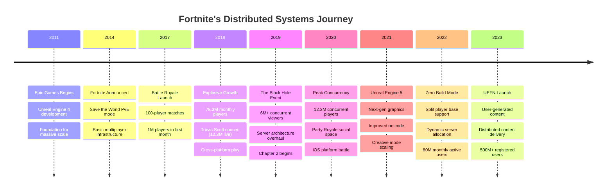

**Key Technical Challenges & Solutions:**
- **2017**: Initial 100-player sync required custom netcode
- **2018**: Concert events forced event-driven architecture
- **2019**: Black Hole event taught importance of graceful degradation
- **2020**: iOS removal required rapid cross-platform adaptation
- **2022**: Zero Build split required dynamic matchmaking
- **2023**: UGC scale demanded distributed content systems

</div>

### Real-Time Synchronization

**⏰ Axiom 4 (Concurrency): Game State Consistency**
```
Challenge: Two players shoot each other simultaneously

Traditional Solution (Authoritative Server):
Player A shoots at T=100ms → Server at T=150ms → Player B dies
Player B shoots at T=102ms → Server at T=152ms → Denied (already dead)

Problem: Network latency creates unfairness

Fortnite's Solution (Client-Side Prediction + Rollback):
1. Both players see their shots hit
2. Server adjudicates with lag compensation
3. Rollback inconsistent states
4. Apply authoritative resolution
5. Update all clients with correction

Result: Fair gameplay despite network physics
```

**🌐 Geographic Distribution Strategy**
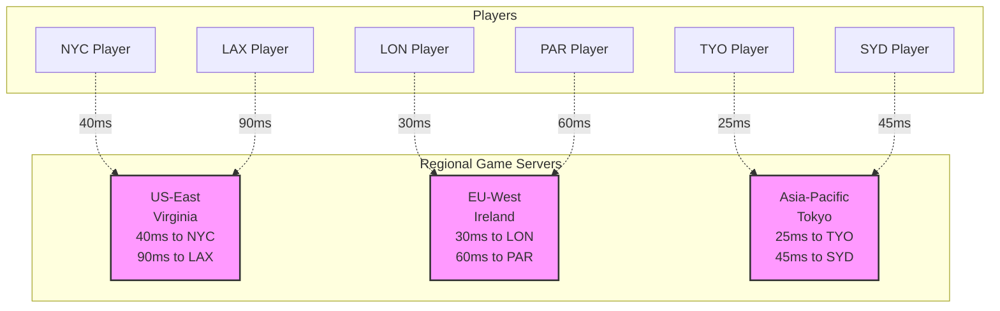

Matchmaking Algorithm:
1. Measure latency to all regions
2. Group players by geographic proximity  
3. Prefer skill balance over perfect latency
4. Maximum 80ms latency difference in lobby
5. Dedicated servers (never peer-to-peer)

### Anti-Cheat Architecture

<div class="anti-cheat">
<h3>🛡️ Detecting the Impossible</h3>

**Client-Side Detection:**
```
Memory Protection:
- Encrypted game state
- Code obfuscation
- Runtime integrity checks
- Hardware attestation

Behavioral Analysis:
- Movement patterns (impossible physics)
- Aim tracking (too perfect accuracy)  
- Reaction times (superhuman speed)
- Input patterns (macro detection)
```

**Server-Side Validation:**
```
Physics Validation:
- Player position bounds checking
- Velocity/acceleration limits
- Line-of-sight calculations
- Collision detection

Statistical Analysis:
- Accuracy percentiles
- Damage-per-minute outliers
- Win rate anomalies
- Report clustering
```
</div>

### Key Design Decisions

<div class="design-decisions">
<h3>🎯 Real-time Game Architecture</h3>

**Decision 1: Network Architecture**
```
Problem: 100 players with different latencies

Options Evaluated:
1. Peer-to-peer
   - Pros: No server costs
   - Cons: Cheating, NAT issues, worst peer bottleneck

2. Client-server authoritative
   - Pros: Anti-cheat, consistent state
   - Cons: Server costs, latency

3. Dedicated servers with client prediction
   - Pros: Best of both worlds
   - Cons: Complex reconciliation

Decision: Dedicated servers + client prediction
- Authoritative server state
- Client-side prediction for responsiveness
- Server reconciliation for fairness
- Regional server deployment
```

**Decision 2: State Synchronization**
```
Problem: Syncing 100 players at 20Hz

Options:
1. Full state replication
   - Pros: Simple, consistent
   - Cons: Bandwidth explosion

2. Delta compression
   - Pros: Reduced bandwidth
   - Cons: Complexity, error accumulation

3. Interest management
   - Pros: Scalable bandwidth
   - Cons: Visibility cheats

Decision: Interest management + delta compression
- Spatial partitioning (relevance)
- Delta frames with keyframes
- Priority-based updates
- 150m visibility radius
```

**Decision 3: Anti-cheat Strategy**
```
Problem: Maintaining competitive integrity

Options:
1. Client-side only
   - Pros: No server overhead
   - Cons: Easily bypassed

2. Server-side only
   - Pros: Authoritative
   - Cons: Can't detect all cheats

3. Multi-layer approach
   - Pros: Comprehensive coverage
   - Cons: Resource intensive

Decision: Three-layer anti-cheat
- Client: BattlEye/EAC kernel driver
- Server: Physics validation, statistical analysis
- Backend: ML-based behavior analysis
- Human review for edge cases
```
</div>

---

## 🚀 Case Study 6: SpaceX's Mission Control Systems

**The Challenge**: Control rockets with human lives at stake

<div class="case-study">
<h3>📊 System Requirements</h3>

**Scale Constraints:**
- 10,000+ telemetry points
- 100Hz data collection rate
- <10ms decision latency for abort
- 99.9999% reliability required
- Human safety paramount

**Business Context:**
- Failure = loss of crew/cargo
- Real-time decisions required
- No room for software bugs
- Regulatory oversight intense
</div>

### Timeline & Evolution Context

<div class="timeline-evolution">
<h3>📅 SpaceX Mission Control Evolution</h3>

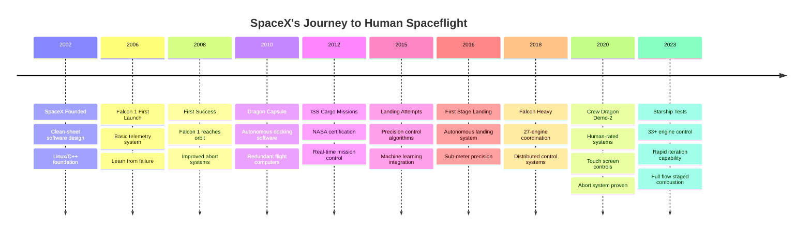

**Software Evolution Milestones:**
- **2006**: First failure taught importance of sensor redundancy
- **2008**: Success validated in-house software approach
- **2012**: NASA certification required formal methods
- **2016**: Landing precision achieved through ML
- **2020**: Human rating demanded new UI/UX paradigms
- **2023**: Starship scale requires distributed real-time systems

</div>

### Human Interface Design

**👤 Axiom 7: Life-Critical Interface Design**
```
NASA Mission Control Principles Applied:

Information Hierarchy:
1. Critical alerts (RED): Immediate action required
2. Cautions (YELLOW): Monitor closely  
3. Status (GREEN): Normal operations
4. Data (WHITE): Reference information

Display Design:
- High contrast (readable under stress)
- Redundant information paths
- Clear abort procedures
- Muscle memory interfaces

Decision Support:
- Pre-calculated abort scenarios
- Real-time trajectory analysis
- Automated failure detection
- Human oversight required
```

**🧠 Cognitive Load Management**
```
Mission Phase Interfaces:

Pre-Launch (Low stress):
├─ Detailed system status
├─ Weather monitoring
├─ Range safety checks
└─ Go/No-go polling

Launch (High stress):
├─ Critical parameters only
├─ Abort decision tree
├─ Automatic safeguards active
└─ Simplified controls

Orbital (Moderate stress):
├─ Mission timeline
├─ System health monitoring
├─ Communication windows
└─ Experiment management
```

---

## 📊 Synthesis: Common Patterns Across Industries

<div class="synthesis-patterns">
<h3>🔍 Cross-Cutting Insights</h3>

**Pattern 1: Latency Dominates User Experience**
```
All successful systems prioritize latency:
- Uber: <500ms dispatch
- DynamoDB: <10ms database access
- Spotify: <100ms recommendations  
- PayPal: <250ms payment processing
- Fortnite: <50ms game updates
- SpaceX: <10ms abort decisions

Universal Rule: Latency budget = user tolerance / 3
```

**Pattern 2: Availability Through Redundancy**
```
Redundancy strategies observed:
- Geographic: Multi-region deployment
- Temporal: Circuit breakers + retries
- Functional: Graceful degradation
- Data: Read replicas + caching
- Process: Chaos engineering

Common SLA targets: 99.9% (8.77 hours/year downtime)
```

**Pattern 3: Consistency is Contextual**
```
Consistency choices by domain:
- Financial: Strong ACID (money safety)
- Social: Eventual (engagement over precision)
- Gaming: Causal (fair ordering)
- Location: Tunable (dispatch vs. tracking)
- Control: Strong (safety critical)

Trade-off: Consistency ↔ Availability ↔ Performance
```

**Pattern 4: Human Factors Scale Linearly**
```
Cognitive complexity observations:
- Information density kills decisions
- Automation paradox in failures
- Context switching expensive
- Stress amplifies poor design
- Training != intuitive design

Design principle: Optimize for worst-case human state
```
</div>

### Key Design Decisions

<div class="design-decisions">
<h3>🎯 Mission-Critical System Design</h3>

**Decision 1: Redundancy Architecture**
```
Problem: No single point of failure allowed

Options Evaluated:
1. Traditional triple redundancy
   - Pros: NASA heritage
   - Cons: Expensive, complex voting

2. Dissimilar redundancy
   - Pros: Common-mode failure protection
   - Cons: Development cost

3. Modern fault-tolerant computing
   - Pros: Software-based, flexible
   - Cons: Newer, less flight heritage

Decision: Dissimilar triple redundancy
- 3x flight computers (different architectures)
- Different software implementations
- Radiation-hardened + COTS hybrid
- Byzantine fault tolerance
```

**Decision 2: Ground-Vehicle Communication**
```
Problem: Reliable telemetry during all phases

Options:
1. Single high-bandwidth link
   - Pros: Simple, high data rate
   - Cons: Single point of failure

2. Multiple redundant links
   - Pros: Resilient
   - Cons: Coordination complexity

3. Adaptive multi-link
   - Pros: Optimal for each phase
   - Cons: Complex handovers

Decision: Adaptive multi-link architecture
- S-band for critical commands
- Ku-band for high-rate telemetry
- Starlink for backup/high-bandwidth
- Automatic link selection
```

**Decision 3: Abort System Design**
```
Problem: Crew safety in all failure modes

Options:
1. Automated abort only
   - Pros: Fast, deterministic
   - Cons: Can't handle unknowns

2. Manual abort only
   - Pros: Human judgment
   - Cons: Reaction time

3. Hybrid automated/manual
   - Pros: Best of both
   - Cons: Mode confusion risk

Decision: Autonomous with manual override
- Automated abort for known scenarios
- <100ms detection to action
- Crew can always override
- Ground can inhibit (not initiate)
```
</div>

---

## 🎯 Cross-Cutting Analysis: Patterns Across All Case Studies

### Common Patterns That Emerge

<div class="synthesis-section">
<h3>📊 Pattern Recognition Across Industries</h3>

| Pattern | Uber | DynamoDB | Spotify | PayPal | Fortnite | SpaceX |
|---------|------|----------|---------|---------|----------|---------|
| **Edge Computing** | ✅ Driver location | ✅ Regional replicas | ✅ CDN for audio | ❌ Centralized | ✅ Game servers | ❌ Ground control |
| **Eventually Consistent** | ✅ Location data | ✅ By design | ✅ Recommendations | ❌ Money is sacred | ✅ Player state | ❌ Life critical |
| **Circuit Breakers** | ✅ Service calls | ✅ Failed nodes | ✅ ML services | ✅ Payment gateway | ✅ Match services | ✅ Sensor failures |
| **Event Sourcing** | ✅ Trip history | ❌ Key-value | ✅ Play history | ✅ Transaction log | ✅ Game events | ✅ Telemetry log |
| **Chaos Engineering** | ✅ Region failures | ✅ Node failures | ✅ Service outages | ✅ Gateway tests | ✅ Server crashes | ✅ Sensor faults |

</div>

### Universal Lessons

!!! success "What Every Case Study Teaches"
    
    **1. Latency Dominates Architecture**
    - Uber: Regional dispatch centers
    - DynamoDB: Predictable single-digit ms
    - Spotify: Edge caching for music
    - Fortnite: Regional game servers
    - SpaceX: <100ms abort decisions
    
    **2. Failure is Not Optional**
    - Every system assumes components will fail
    - Difference is in acceptable failure modes
    - Life-critical (SpaceX) vs Revenue-critical (PayPal) vs Experience-critical (Spotify)
    
    **3. Consistency is Expensive**
    - Only PayPal chose strong consistency (money)
    - Everyone else chose eventual consistency
    - Trade-off is always latency vs correctness
    
    **4. Human Factors Scale Linearly**
    - More complex system = More operational burden
    - Uber: 2000 engineers
    - DynamoDB: 50 operators for millions of databases
    - SpaceX: Cognitive load management crucial

### Industry-Specific Insights

<div class="industry-insights">
<h3>🏭 What Makes Each Domain Unique</h3>

**Real-Time Systems (Uber, Fortnite)**
- Latency measured in milliseconds
- Geographic distribution mandatory
- State synchronization challenges
- User experience degrades sharply with delays

**Data Systems (DynamoDB, Spotify)**
- Throughput over latency (usually)
- Durability requirements vary wildly
- Cost optimization critical at scale
- Batch and stream processing hybrid

**Financial Systems (PayPal)**
- Correctness over everything
- Regulatory compliance built-in
- Audit trails mandatory
- Zero data loss tolerance

**Safety-Critical Systems (SpaceX)**
- Formal verification methods
- Redundancy at every level
- Human-in-the-loop mandatory
- Graceful degradation impossible

</div>

### The Meta-Pattern

!!! info "The Ultimate Distributed Systems Pattern"
    
    Across all case studies, one meta-pattern emerges:
    
    **"Distribute work, centralize coordination, localize decisions"**
    
    - **Distribute Work**: All systems spread computation (Uber drivers, DynamoDB nodes, Spotify ML)
    - **Centralize Coordination**: All have some central authority (dispatch, membership, playlist)
    - **Localize Decisions**: Fast decisions happen close to data (edge nodes, regional replicas)
    
    This pattern emerges from the fundamental tension between Axioms 1 (Latency) and 5 (Coordination).

### Economic Patterns

<div class="economic-analysis">
<h3>💰 The Economics of Scale</h3>

| System | Users/Scale | Infrastructure Cost | Cost per User/Transaction | Engineering Investment |
|--------|-------------|-------------------|--------------------------|----------------------|
| **Uber** | 130M users/month | ~$500M/year | $0.30/ride | 2000 engineers |
| **DynamoDB** | Trillions of requests | ~$100M (AWS internal) | $0.00001/request | 50 operators |
| **Spotify** | 500M users | ~$300M/year | $0.60/user/year | 1500 engineers |
| **PayPal** | 400M users | ~$1B/year | $0.02/transaction | 3000 engineers |
| **Fortnite** | 400M players | ~$200M/year | $0.50/player/year | 700 engineers |
| **SpaceX** | 100 launches/year | ~$50M/year (software) | $500k/launch | 500 software engineers |

**Key Insights:**
- Engineering costs often exceed infrastructure
- Cost per operation varies by 6 orders of magnitude
- Criticality drives investment (PayPal > SpaceX > Others)

</div>

---

*"Case studies bridge the gap between theory and practice—learn from those who've scaled before you."*