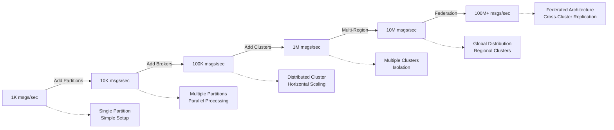

# Apache Kafka: Scale and Architecture Deep Dive

!!! abstract "Quick Facts"
<div class="responsive-table" markdown>

    | Metric | Value |
    |--------|-------|
    | **Scale** | Trillions of events/day |
    | **Throughput** | 250 MB/s per broker |
    | **Data Volume** | Petabytes in production |
    | **Availability** | 99.95% typical uptime |
    | **Team Size** | 100+ contributors at LinkedIn |

</div>


## Executive Summary

Apache Kafka transformed distributed data movement by treating data as an immutable, append-only log. Originally built at LinkedIn to handle 1 billion events per day, Kafka now processes trillions of events daily across thousands of companies. Its elegant log-centric design provides both messaging queue and distributed storage semantics, demonstrating how simple abstractions can solve complex distributed systems problems.

## System Overview

### Business Context

<div class="grid" markdown>
  <div class="card">
    <h3 class="card__title">Problem Space</h3>
    <p class="card__description">Replace point-to-point integrations with unified event streaming platform</p>
  </div>
  <div class="card">
    <h3 class="card__title">Constraints</h3>
    <p class="card__description">High throughput, fault tolerance, exactly-once delivery, replay capability</p>
  </div>
  <div class="card">
    <h3 class="card__title">Success Metrics</h3>
    <p class="card__description">Sub-10ms latency, linear scalability, zero data loss</p>
  </div>
</div>

### High-Level Architecture

```mermaid
graph TB
    subgraph "Producer Layer"
        PROD1[Producer 1]
        PROD2[Producer 2]
        PROD3[Producer 3]
    end
    
    subgraph "Kafka Cluster"
        subgraph "Broker 1"
            P0L[Partition 0 Leader]
            P1F1[Partition 1 Follower]
            P2F1[Partition 2 Follower]
        end
        
        subgraph "Broker 2"
            P0F1[Partition 0 Follower]
            P1L[Partition 1 Leader]
            P2F2[Partition 2 Follower]
        end
        
        subgraph "Broker 3"
            P0F2[Partition 0 Follower]
            P1F2[Partition 1 Follower]
            P2L[Partition 2 Leader]
        end
    end
    
    subgraph "Consumer Layer"
        CG1[Consumer Group 1]
        CG2[Consumer Group 2]
        CG3[Consumer Group 3]
    end
    
    subgraph "Coordination"
        ZK[ZooKeeper Cluster]
    end
    
    PROD1 --> P0L
    PROD2 --> P1L
    PROD3 --> P2L
    
    P0L --> CG1
    P1L --> CG2
    P2L --> CG3
    
    "Broker 1" <--> ZK
    "Broker 2" <--> ZK
    "Broker 3" <--> ZK
```

## Mapping to Fundamental Laws

### Law Analysis

<table class="responsive-table">
<thead>
  <tr>
    <th>Law</th>
    <th>Challenge</th>
    <th>Solution</th>
    <th>Trade-off</th>
  </tr>
</thead>
<tbody>
  <tr>
    <td data-label="Law">Correlated Failure</td>
    <td data-label="Challenge">Broker failures losing entire partitions</td>
    <td data-label="Solution">In-Sync Replica (ISR) protocol with leader election</td>
    <td data-label="Trade-off">Higher storage cost, replication overhead</td>
  </tr>
  <tr>
    <td data-label="Law">Asynchronous Reality</td>
    <td data-label="Challenge">Network delays affecting message ordering</td>
    <td data-label="Solution">Per-partition ordering, pull-based consumers</td>
    <td data-label="Trade-off">Global ordering requires single partition</td>
  </tr>
  <tr>
    <td data-label="Law">Emergent Chaos</td>
    <td data-label="Challenge">Concurrent producers and consumers</td>
    <td data-label="Solution">Offset-based message tracking, idempotent producers</td>
    <td data-label="Trade-off">Complex exactly-once semantics implementation</td>
  </tr>
  <tr>
    <td data-label="Law">Multidimensional Optimization</td>
    <td data-label="Challenge">Balance throughput, latency, and durability</td>
    <td data-label="Solution">Configurable acks levels, batching, compression</td>
    <td data-label="Trade-off">Complex tuning for optimal performance</td>
  </tr>
  <tr>
    <td data-label="Law">Distributed Knowledge</td>
    <td data-label="Challenge">Monitoring thousands of partitions and consumers</td>
    <td data-label="Solution">JMX metrics, consumer lag tracking, partition monitoring</td>
    <td data-label="Trade-off">Significant monitoring infrastructure overhead</td>
  </tr>
  <tr>
    <td data-label="Law">Cognitive Load</td>
    <td data-label="Challenge">Complex distributed log semantics</td>
    <td data-label="Solution">Simple append-only log abstraction</td>
    <td data-label="Trade-off">Hidden complexity in partitioning and replication</td>
  </tr>
  <tr>
    <td data-label="Law">Economic Reality</td>
    <td data-label="Challenge">Storage and compute costs at scale</td>
    <td data-label="Solution">Log compaction, tiered storage, efficient serialization</td>
    <td data-label="Trade-off">Complex operational procedures for cost optimization</td>
  </tr>
</tbody>
</table>

## Design Deep Dive

### Data Architecture

!!! tip "Key Design Decisions"
    1. **Append-Only Log**: Immutable message storage providing total ordering within partitions
    2. **Pull-Based Consumers**: Consumer-controlled backpressure and batching
    3. **OS Page Cache**: Leverages operating system for caching instead of application-level cache
    4. **Leader-Follower Replication**: ISR protocol ensures data durability with minimal latency impact

### Scaling Strategy



## Failure Scenarios & Lessons

!!! danger "Major Incident: LinkedIn Kafka Outage 2013"
    **What Happened**: ZooKeeper split-brain scenario caused multiple brokers to claim leadership for the same partitions, leading to data inconsistency and consumer confusion.

    **Root Cause**: 
    - Network partition isolated ZooKeeper ensemble
    - Insufficient monitoring of ZooKeeper health
    - Aggressive session timeouts caused premature failovers

    **Impact**: 
    - 3 hours of intermittent data loss
    - Consumer lag spikes across all applications
    - Duplicate message delivery to downstream systems
    - Multiple engineering teams affected

    **Lessons Learned**:
    1. **ZooKeeper is critical**: Implement comprehensive ZooKeeper monitoring and alerting
    2. **Split-brain detection**: Add fencing mechanisms to prevent multiple leaders
    3. **Graceful degradation**: Implement circuit breakers for downstream dependencies

## Performance Characteristics

### Latency Breakdown

<div class="grid" markdown>
  <div class="card">
    <h3 class="card__title">P50 Latency</h3>
    <div class="stat-number">2ms</div>
  </div>
  <div class="card">
    <h3 class="card__title">P99 Latency</h3>
    <div class="stat-number">10ms</div>
  </div>
  <div class="card">
    <h3 class="card__title">P99.9 Latency</h3>
    <div class="stat-number">50ms</div>
  </div>
</div>

### Resource Utilization

<div class="responsive-table" markdown>

| Resource | Usage | Efficiency |
|----------|-------|------------|
| CPU | 60-80% | High during peak processing |
| Memory | 70% | Optimal for OS page cache |
| Network | 40-60% | Batching improves efficiency |
| Storage | Sequential I/O | 600+ MB/s sustained throughput |

</div>


## Operational Excellence

### Monitoring & Observability

- **Metrics**: JMX metrics for broker health, consumer lag, partition leadership
- **Logging**: Structured logging with request correlation IDs
- **Tracing**: End-to-end message tracing from producer to consumer
- **Alerting**: SLO-based alerts for throughput, latency, and availability

### Deployment Strategy

!!! note
    **Deployment Frequency**: Weekly rolling updates across broker fleet
    **Rollout Strategy**: Rolling deployment with leadership migration
    **Rollback Time**: < 15 minutes with automated broker restart
    **Schema Evolution**: Backward compatible schema changes with Confluent Schema Registry

## Key Innovations

1. **Unified Log Abstraction**: Single abstraction for messaging, storage, and stream processing
2. **Zero-Copy Reads**: Sendfile() system call eliminates memory copying overhead
3. **Log Compaction**: Maintains only latest value per key for stateful stream processing

## Applicable Patterns

<div class="grid" markdown>
  <a href="../../patterns/leader-follower/" class="pattern-card">
    <h3 class="pattern-card__title">Leader-Follower</h3>
    <p class="pattern-card__description">ISR protocol for partition replication and failover</p>
  </a>
  <a href="../../patterns/event-streaming/" class="pattern-card">
    <h3 class="pattern-card__title">Event Streaming</h3>
    <p class="pattern-card__description">Append-only log as foundation for event-driven systems</p>
  </a>
  <a href="../../patterns/partitioning/" class="pattern-card">
    <h3 class="pattern-card__title">Partitioning</h3>
    <p class="pattern-card__description">Horizontal scaling through message partitioning</p>
  </a>
  <a href="../../patterns/exactly-once/" class="pattern-card">
    <h3 class="pattern-card__title">Exactly-Once</h3>
    <p class="pattern-card__description">Idempotent producers and transactional consumers</p>
  </a>
</div>

## Takeaways for Your System

!!! quote "Key Lessons"
    1. **When to apply**: Use for event streaming, log aggregation, and decoupling systems with high-throughput requirements
    2. **When to avoid**: Don't use for request-response patterns, small message volumes, or when strong global ordering is required
    3. **Cost considerations**: Expect 3x storage overhead due to replication, but gain operational simplicity and durability
    4. **Team requirements**: Need expertise in JVM tuning, ZooKeeper operations, and stream processing concepts

## Further Reading

- [Kafka: a Distributed Messaging System for Log Processing](https://www.microsoft.com/en-us/research/wp-content/uploads/2017/09/Kafka.pdf)
- [The Log: What every software engineer should know](https://engineering.linkedin.com/distributed-systems/log-what-every-software-engineer-should-know-about-real-time-datas-unifying)
- [Kafka: The Definitive Guide](https://www.confluent.io/resources/kafka-the-definitive-guide/)
- [Building Data Streaming Applications with Apache Kafka](https://kafka.apache.org/documentation/streams/)

## Discussion Questions

1. How does Kafka's pull-based consumer model compare to push-based messaging systems in terms of scalability?
2. What are the trade-offs between Kafka's partition-level ordering vs global ordering requirements?
3. How would you design a multi-datacenter Kafka deployment with active-active replication?
4. What are the implications of Kafka's log compaction feature for event sourcing architectures?