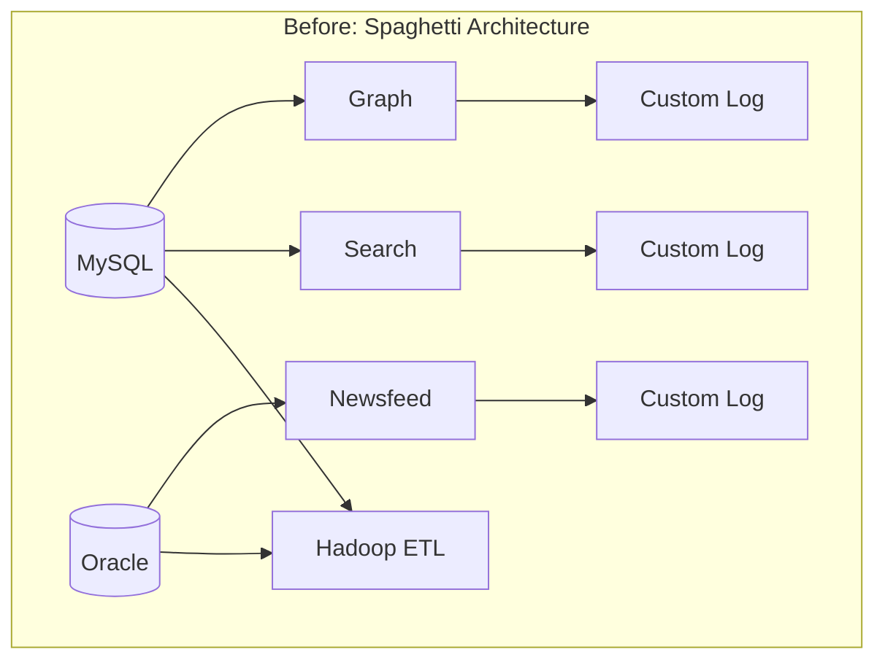
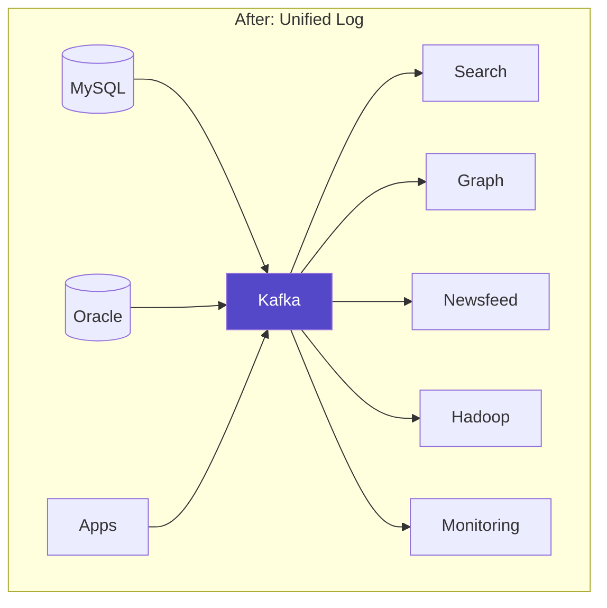
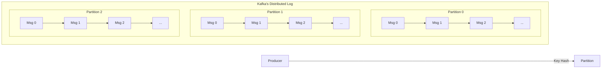
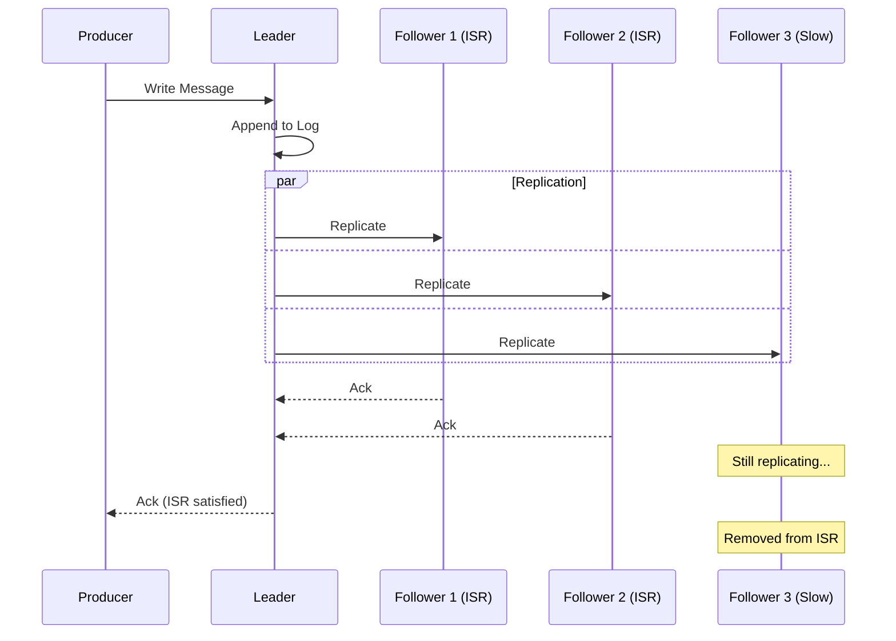
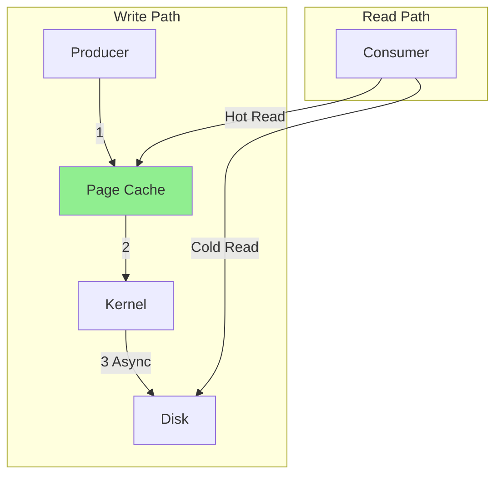
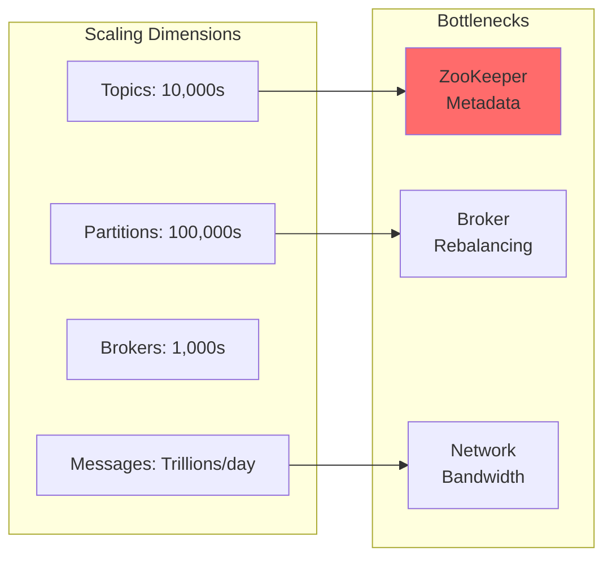
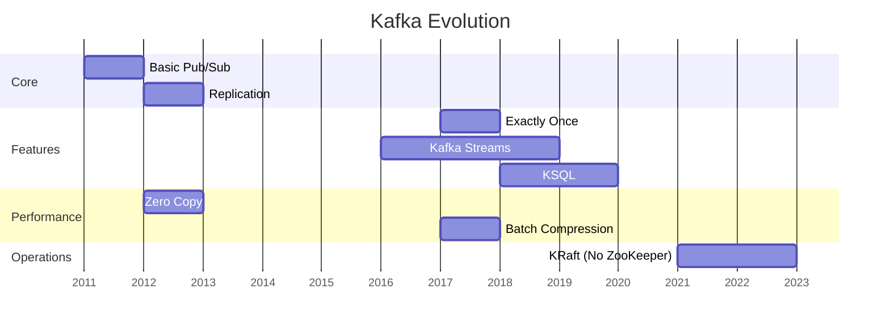
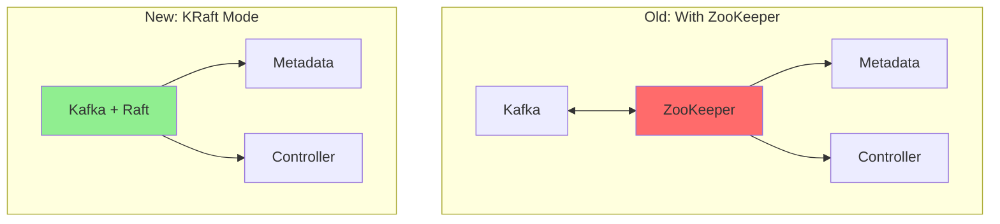

# Apache Kafka: Distributed Streaming Platform

<div class="case-study-header">
  <div class="technology-stack">
    <span>Scale: Trillions of events/day</span>
    <span>Latency: < 10ms</span>
    <span>Companies: LinkedIn, Uber, Netflix</span>
  </div>
</div>

## Executive Summary

Apache Kafka transformed how we think about data movement in distributed systems. Originally built at LinkedIn to handle 1 billion events per day, Kafka now processes trillions of events daily across thousands of companies. Its elegant log-centric design provides both messaging queue and distributed storage semantics.

## The Problem LinkedIn Faced

<div class="problem-context">
<h3>🎯 Original Challenges (2010)</h3>

1. **Point-to-point integrations** - O(n²) complexity
2. **Multiple messaging systems** - ActiveMQ, custom solutions
3. **Batch ETL pipelines** - Hours of delay
4. **No unified log** - Each system had its own

LinkedIn needed to move from this:



To this:


</div>

## Core Architecture

### 1. The Log as Foundation



**Key Insights**:
- Append-only log provides total ordering within partition
- Partitioning enables parallelism
- Offsets enable replay and exactly-once semantics

### 2. Cluster Architecture

```mermaid
graph TB
    subgraph "Kafka Cluster"
        subgraph "Broker 1"
            P0L[Partition 0<br/>Leader]
            P1F1[Partition 1<br/>Follower]
            P2F1[Partition 2<br/>Follower]
        end
        
        subgraph "Broker 2"
            P0F1[Partition 0<br/>Follower]
            P1L[Partition 1<br/>Leader]
            P2F2[Partition 2<br/>Follower]
        end
        
        subgraph "Broker 3"
            P0F2[Partition 0<br/>Follower]
            P1F2[Partition 1<br/>Follower]
            P2L[Partition 2<br/>Leader]
        end
    end
    
    ZK[ZooKeeper<br/>Cluster Metadata]
    
    Broker 1 <--> ZK
    Broker 2 <--> ZK
    Broker 3 <--> ZK
    
    classDef leader fill:#5448C8,color:#fff
    classDef follower fill:#00BCD4,color:#fff
    
    class P0L,P1L,P2L leader
    class P0F1,P0F2,P1F1,P1F2,P2F1,P2F2 follower
```

### 3. Replication Protocol

<div class="protocol-detail">
<h4>ISR (In-Sync Replicas)</h4>



**Key Design Decisions**:
- Only ISR members can become leader
- Producers can choose durability (acks=0,1,all)
- Followers pull from leader (not push)
</div>

## Design Decisions & Trade-offs

### 1. Pull vs Push

<div class="decision-box">
<h4>🤔 Why Pull-based Consumers?</h4>

**Kafka chose PULL because**:
- Consumers control rate (backpressure)
- Batching is natural
- Different consumers, different speeds
- Long polling minimizes latency

**Trade-off**: Slightly higher latency vs better flow control
</div>

### 2. Persistence Strategy



**Brilliant Insights**:
- OS page cache IS the cache
- Sequential I/O is fast (600MB/sec)
- No complex in-memory structures
- Sendfile() for zero-copy reads

### 3. Message Format Evolution

| Version | Features | Overhead |
|---------|----------|----------|
| V0 | Basic | High |
| V1 | Timestamps | Medium |
| V2 | **Batch compression**<br/>**Exactly-once** | Low |

### 4. Partitioning Strategy

```python
def partition(key, num_partitions):
    if key is None:
        return round_robin_next()
    else:
        return hash(key) % num_partitions
```

## Performance Characteristics

### Benchmark Results

<div class="performance-stats">
<table>
<thead>
<tr>
<th>Metric</th>
<th>Single Broker</th>
<th>3-Broker Cluster</th>
<th>Conditions</th>
</tr>
</thead>
<tbody>
<tr>
<td><strong>Write Throughput</strong></td>
<td>~100 MB/s</td>
<td>~250 MB/s</td>
<td>1KB messages, acks=1</td>
</tr>
<tr>
<td><strong>Read Throughput</strong></td>
<td>~200 MB/s</td>
<td>~550 MB/s</td>
<td>Cached reads</td>
</tr>
<tr>
<td><strong>Latency (p99)</strong></td>
<td>< 5ms</td>
<td>< 10ms</td>
<td>acks=1</td>
</tr>
<tr>
<td><strong>Messages/sec</strong></td>
<td>~1M</td>
<td>~2.5M</td>
<td>100 byte messages</td>
</tr>
</tbody>
</table>
</div>

### Scaling Limits



## Operational Insights

### Common Failure Scenarios

1. **Under-Replicated Partitions**
   ```bash
   # Detection
   kafka-topics --describe --under-replicated
   
   # Mitigation
   # Increase replication throttle
   kafka-configs --alter --add-config 
     replica.throttle.rate=50000000
   ```

2. **Consumer Lag**
   ```mermaid
   graph LR
       P[Producer<br/>Offset: 1M] -->|High Rate| K[Kafka]
       K -->|Slow| C[Consumer<br/>Offset: 800K]
       
       L[Lag = 200K messages]
       
       style L fill:#ff6b6b
   ```

3. **Broker Disk Full**
   - Log retention not aggressive enough
   - Replication catching up after failure
   - Solution: Dynamic retention based on disk usage

### Monitoring Best Practices

<div class="monitoring-grid">
<div class="metric-card">
<h4>📈 Key Metrics</h4>

- **Under-replicated partitions**: Should be 0
- **Consumer lag**: < 1000 messages
- **Request latency**: p99 < 100ms
- **ISR shrink/expand**: < 10/min
</div>

<div class="metric-card">
<h4>🚨 Alert Thresholds</h4>

- Offline partitions > 0
- Consumer lag > 100K
- Disk usage > 85%
- Network utilization > 80%
</div>
</div>

## Evolution & Improvements

### Timeline of Major Features



### Removing ZooKeeper (KRaft)



## Lessons Learned

<div class="lessons-box">
<h3>📚 Key Takeaways</h3>

1. **Simplicity wins**: Log abstraction > complex data structures
2. **Leverage the OS**: Page cache > custom caching
3. **Batching everywhere**: Network, disk, compression
4. **Pull > Push**: For heterogeneous consumers
5. **Replication ≠ Durability**: Need both for true reliability
6. **Operational simplicity**: Fewer moving parts = better
</div>

## When to Use Kafka

✅ **Perfect For**:
- Event streaming
- Log aggregation
- Metrics collection
- Change data capture
- Message queuing (with caveats)

❌ **Not Ideal For**:
- RPC/request-response
- Large messages (>1MB)
- Long-term storage (use S3/HDFS)
- Complex routing (use RabbitMQ)

## Related Patterns & Concepts

- **Patterns**: [Distributed Log](/patterns/event-streaming) | [Leader-Follower](/patterns/leader-follower) | [Event Sourcing](/patterns/event-sourcing)
- **Concepts**: CAP Theorem (Coming Soon) | [Consensus](/patterns/consensus)
- **Comparisons**: Kafka vs Pulsar | [Kafka vs RabbitMQ] (Comparison Coming Soon)

## References

- [Original Kafka Paper](https://www.microsoft.com/en-us/research/wp-content/uploads/2017/09/Kafka.pdf)
- [Kafka: The Definitive Guide](https://www.confluent.io/resources/kafka-the-definitive-guide/)
- [LinkedIn Engineering Blog](https://engineering.linkedin.com/kafka)
