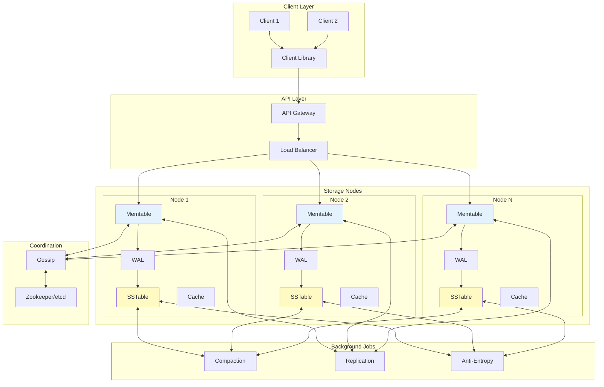
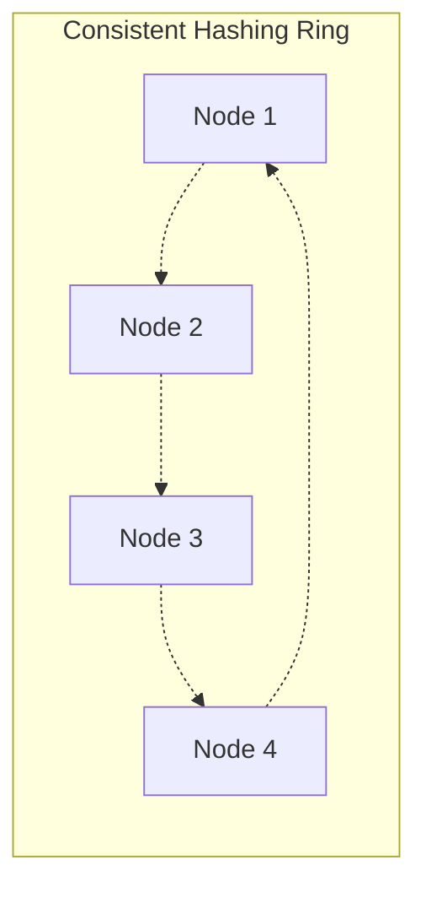
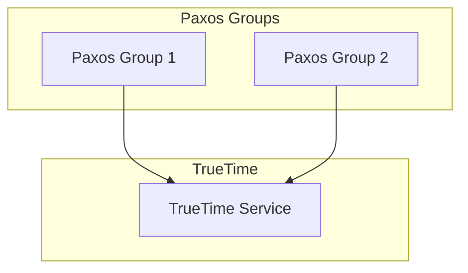
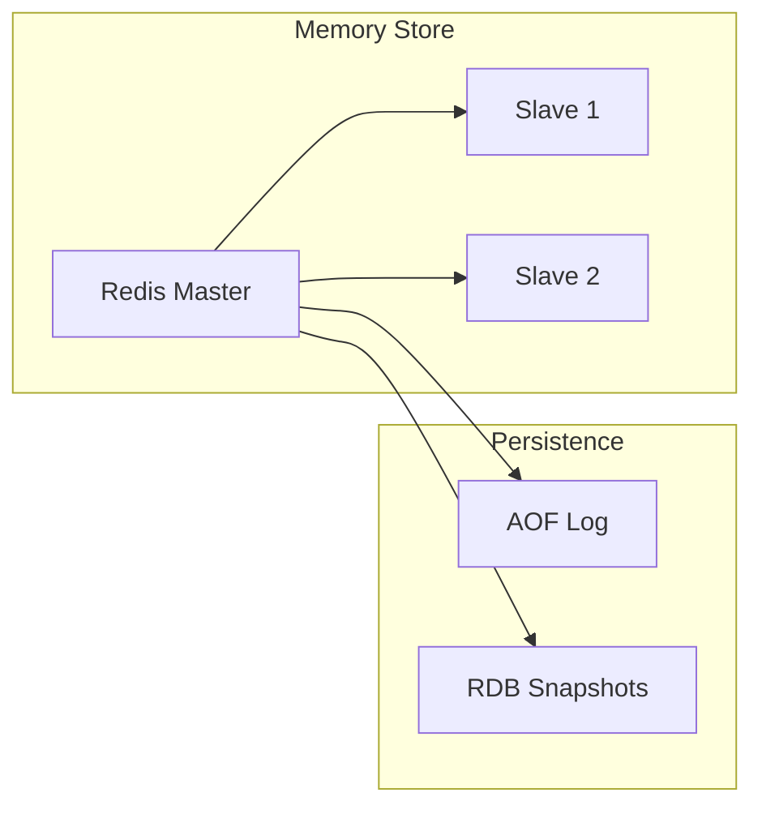
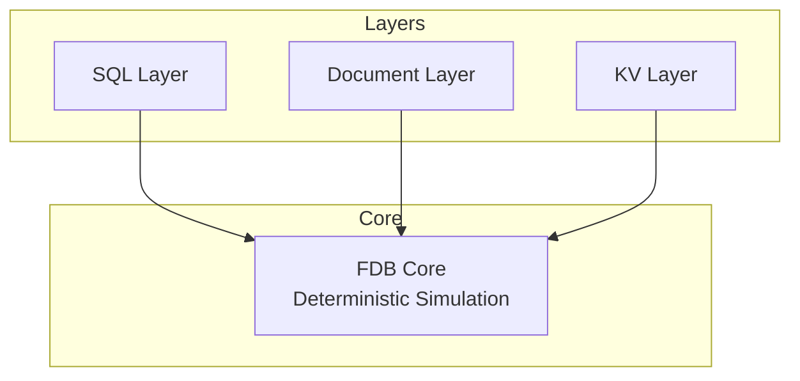

# Distributed Key-Value Store

## 🎯 Challenge Statement
Design a distributed key-value storage system capable of handling billions of keys with sub-millisecond latency, providing configurable consistency guarantees, automatic failover, and horizontal scalability while maintaining operational simplicity.

## Part 1: Concept Map

### 🗺️ System Overview
A distributed key-value store provides a simple get/put/delete interface while handling the complexities of distributed storage: replication, partitioning, consistency, and failure handling. Examples include DynamoDB, Cassandra, Redis, and etcd.

**Key Requirements:**
- Scale to billions of keys and petabytes of data
- Sub-millisecond latency for reads
- Configurable consistency (eventual to strong)
- Automatic failover and self-healing
- Multi-datacenter support
- ACID transactions (optional)

### 📐 Axiom Analysis

#### 🚀 Axiom 1 (Latency): Storage Hierarchy
```text
Latency Breakdown:
- CPU cache: 0.5ns
- Memory access: 100ns
- SSD read: 150μs
- Network RTT (same DC): 500μs
- Network RTT (cross-region): 50ms

Storage Hierarchy:
1. In-memory cache: 0.1ms
2. Local SSD: 0.2ms
3. Remote memory: 0.5ms
4. Remote SSD: 1ms
5. Cross-region: 50ms

Optimization Strategies:
- Multi-level caching
- Read replicas in each AZ
- Bloom filters for negative lookups
- Adaptive prefetching
```

**Implementation:**
```python
import asyncio
from typing import Optional, Dict, Any
import aioredis
import rocksdb

class LatencyOptimizedKVStore:
    def __init__(self):
        # L1: In-process LRU cache
        self.memory_cache = LRUCache(maxsize=10000)
        
        # L2: Redis for hot data
        self.redis_pool = None
        
        # L3: RocksDB for persistent storage
        self.rocks_db = rocksdb.DB(
            "data.db",
            rocksdb.Options(
                create_if_missing=True,
                max_open_files=300000,
                write_buffer_size=67108864,  # 64MB
                max_write_buffer_number=3,
                target_file_size_base=67108864,
                
                # Optimize for low latency reads
                bloom_locality=1,
                memtable_prefix_bloom_size_ratio=0.1,
                
                # Block cache for hot data
                block_cache=rocksdb.LRUCache(536870912),  # 512MB
                block_cache_compressed=rocksdb.LRUCache(268435456)  # 256MB
            )
        )
        
        # Bloom filter for existence checks
        self.bloom_filter = ScalableBloomFilter(
            initial_capacity=1000000,
            error_rate=0.001
        )
    
    async def get(self, key: str) -> Optional[bytes]:
        """Hierarchical lookup with latency tracking"""
        # L1: Memory cache (0.01ms)
        value = self.memory_cache.get(key)
        if value is not None:
            metrics.increment('cache.hits.l1')
            return value
        
        # Bloom filter check (0.001ms)
        if key not in self.bloom_filter:
            metrics.increment('bloom_filter.true_negatives')
            return None
        
        # L2: Redis cache (0.5ms)
        if self.redis_pool:
            value = await self.redis_pool.get(key)
            if value:
                metrics.increment('cache.hits.l2')
                self.memory_cache.put(key, value)
                return value
        
        # L3: RocksDB (1ms)
        value = self.rocks_db.get(key.encode())
        if value:
            metrics.increment('cache.hits.l3')
            # Populate upper caches
            asyncio.create_task(self._populate_caches(key, value))
            return value
        
        metrics.increment('cache.misses')
        return None
    
    async def put(self, key: str, value: bytes, durability='async'):
        """Write with configurable durability"""
        # Add to bloom filter
        self.bloom_filter.add(key)
        
        # Update caches
        self.memory_cache.put(key, value)
        
        if durability == 'async':
            # Fire and forget
            asyncio.create_task(self._async_persist(key, value))
            return True
        elif durability == 'sync':
            # Wait for local persistence
            self.rocks_db.put(key.encode(), value)
            await self._update_redis(key, value)
            return True
        elif durability == 'quorum':
            # Wait for replication quorum
            return await self._quorum_write(key, value)
```

#### 💾 Axiom 2 (Capacity): Storage Engine Design
```text
Storage Requirements:
- 10B keys × 1KB avg value = 10TB data
- 3x replication = 30TB total
- Write rate: 100K/sec
- Read rate: 1M/sec

LSM-Tree Configuration:
- L0: 256MB (in memory)
- L1: 2.56GB (10x multiplier)
- L2: 25.6GB
- L3: 256GB
- L4: 2.56TB

Write Amplification: ~10x
Read Amplification: ~5x
Space Amplification: ~1.1x
```

**Implementation:**
```python
class LSMTreeKVStore:
    def __init__(self):
        self.memtable = SortedDict()  # In-memory sorted structure
        self.memtable_size = 0
        self.memtable_threshold = 256 * 1024 * 1024  # 256MB
        
        self.sstables = []  # List of sorted string tables
        self.level_configs = [
            {'size': 256 * 1024 * 1024, 'files': 1},      # L0: 256MB
            {'size': 2.56 * 1024**3, 'files': 10},        # L1: 2.56GB
            {'size': 25.6 * 1024**3, 'files': 100},       # L2: 25.6GB
            {'size': 256 * 1024**3, 'files': 1000},       # L3: 256GB
            {'size': 2.56 * 1024**4, 'files': 10000},     # L4: 2.56TB
        ]
        
        self.compaction_thread = threading.Thread(target=self._compaction_loop)
        self.compaction_thread.start()
    
    def put(self, key: bytes, value: bytes):
        """Write to memtable, flush when full"""
        self.memtable[key] = value
        self.memtable_size += len(key) + len(value)
        
        if self.memtable_size >= self.memtable_threshold:
            self._flush_memtable()
    
    def get(self, key: bytes) -> Optional[bytes]:
        """Search memtable, then SSTables newest to oldest"""
        # Check memtable first
        if key in self.memtable:
            return self.memtable[key]
        
        # Check SSTables from newest to oldest
        for sstable in reversed(self.sstables):
            value = sstable.get(key)
            if value is not None:
                return value if value != TOMBSTONE else None
        
        return None
    
    def _flush_memtable(self):
        """Convert memtable to SSTable"""
        if not self.memtable:
            return
        
        # Create new SSTable
        sstable = SSTable()
        
        # Write sorted data
        for key, value in self.memtable.items():
            sstable.add(key, value)
        
        # Add bloom filter and index
        sstable.finalize()
        
        # Add to L0
        self.sstables.append(sstable)
        
        # Clear memtable
        self.memtable.clear()
        self.memtable_size = 0
        
        # Trigger compaction if needed
        self._maybe_compact()
    
    def _compaction_loop(self):
        """Background compaction thread"""
        while True:
            level = self._select_compaction_level()
            if level is not None:
                self._compact_level(level)
            time.sleep(1)
    
    def _compact_level(self, level: int):
        """Merge SSTables at given level"""
        # Size-tiered compaction strategy
        files_at_level = self._get_files_at_level(level)
        
        if len(files_at_level) >= 10:  # Compact every 10 files
            # Merge files
            merged = self._merge_sstables(files_at_level)
            
            # Promote to next level
            self._add_to_level(level + 1, merged)
            
            # Remove old files
            for f in files_at_level:
                self.sstables.remove(f)
```

#### 🔥 Axiom 3 (Failure): Replication & Recovery
```text
Failure Modes:
1. Node crash - data on disk survives
2. Disk failure - data lost, need replicas
3. Network partition - split brain risk
4. Corruption - checksums detect
5. Byzantine - nodes return wrong data

Replication Strategy:
- 3 replicas across AZs
- Quorum reads/writes (R+W>N)
- Hinted handoff for temporary failures
- Read repair for inconsistencies
- Anti-entropy for permanent repair
```

**Implementation:**
```python
class ReplicatedKVStore:
    def __init__(self, node_id: str, peers: List[str]):
        self.node_id = node_id
        self.peers = peers
        self.replication_factor = 3
        self.write_quorum = 2  # W
        self.read_quorum = 2   # R
        # W + R > N ensures strong consistency
        
        self.local_store = LSMTreeKVStore()
        self.vector_clocks = {}  # For conflict detection
        self.hinted_handoffs = {}  # For temporary failures
        
    async def put(self, key: str, value: bytes) -> bool:
        """Quorum write with vector clock"""
        # Increment vector clock
        clock = self.vector_clocks.get(key, VectorClock())
        clock.increment(self.node_id)
        
        # Prepare write request
        write_request = {
            'key': key,
            'value': value,
            'clock': clock,
            'timestamp': time.time()
        }
        
        # Get preference list (consistent hashing)
        preference_list = self._get_preference_list(key)
        
        # Parallel writes to replicas
        write_tasks = []
        for node in preference_list[:self.replication_factor]:
            if node == self.node_id:
                # Local write
                self.local_store.put(key, value)
                self.vector_clocks[key] = clock
            else:
                # Remote write
                task = self._remote_write(node, write_request)
                write_tasks.append(task)
        
        # Wait for quorum
        results = await asyncio.gather(*write_tasks, return_exceptions=True)
        success_count = 1  # Local write
        
        for i, result in enumerate(results):
            if isinstance(result, Exception):
                # Store for hinted handoff
                failed_node = preference_list[i+1]  # +1 for local
                self._store_hint(failed_node, write_request)
            else:
                success_count += 1
        
        return success_count >= self.write_quorum
    
    async def get(self, key: str) -> Optional[bytes]:
        """Quorum read with read repair"""
        preference_list = self._get_preference_list(key)
        
        # Parallel reads from replicas
        read_tasks = []
        for node in preference_list[:self.replication_factor]:
            if node == self.node_id:
                # Local read
                local_result = self.local_store.get(key)
                local_clock = self.vector_clocks.get(key)
                read_tasks.append(asyncio.create_task(
                    self._wrap_result(local_result, local_clock)
                ))
            else:
                # Remote read
                task = self._remote_read(node, key)
                read_tasks.append(task)
        
        # Collect responses
        responses = await asyncio.gather(*read_tasks, return_exceptions=True)
        valid_responses = []
        
        for resp in responses:
            if not isinstance(resp, Exception) and resp is not None:
                valid_responses.append(resp)
        
        if len(valid_responses) < self.read_quorum:
            return None  # Not enough responses
        
        # Resolve conflicts using vector clocks
        latest_value, latest_clock = self._resolve_conflicts(valid_responses)
        
        # Read repair if inconsistent
        asyncio.create_task(self._read_repair(key, latest_value, latest_clock, responses))
        
        return latest_value
    
    def _resolve_conflicts(self, responses: List[Tuple[bytes, VectorClock]]):
        """Use vector clocks to find latest value"""
        # Sort by vector clock precedence
        def compare_clocks(r1, r2):
            clock1, clock2 = r1[1], r2[1]
            if clock1.happens_before(clock2):
                return -1
            elif clock2.happens_before(clock1):
                return 1
            else:
                # Concurrent writes - use timestamp or merge
                return 0
        
        responses.sort(key=functools.cmp_to_key(compare_clocks))
        
        # Return latest (or merged if concurrent)
        return responses[-1]
    
    async def _handle_node_failure(self, failed_node: str):
        """Handle permanent node failure"""
        # Find all keys that had failed_node as replica
        affected_keys = self._find_affected_keys(failed_node)
        
        for key in affected_keys:
            # Re-replicate to maintain replication factor
            current_replicas = self._get_healthy_replicas(key)
            
            if len(current_replicas) < self.replication_factor:
                # Choose new replica
                new_replica = self._choose_new_replica(key, current_replicas)
                
                # Copy data to new replica
                value = await self.get(key)
                if value:
                    await self._remote_write(new_replica, {
                        'key': key,
                        'value': value,
                        'clock': self.vector_clocks.get(key)
                    })
```

#### 🔀 Axiom 4 (Concurrency): Conflict Resolution
```text
Concurrency Challenges:
- Concurrent writes to same key
- Read during write
- Compaction during reads
- Schema/type conflicts
- Transaction isolation

Strategies:
- Optimistic locking (CAS)
- Vector clocks for causality
- MVCC for isolation
- CRDTs for automatic merging
- Pessimistic locking (optional)
```

**Implementation:**
```python
class MVCCKVStore:
    """Multi-Version Concurrency Control KV Store"""
    
    def __init__(self):
        self.versions = {}  # key -> [(version, value, timestamp)]
        self.transactions = {}  # txn_id -> Transaction
        self.global_version = AtomicCounter()
        
    def begin_transaction(self) -> Transaction:
        """Start MVCC transaction"""
        txn = Transaction(
            id=uuid.uuid4(),
            start_version=self.global_version.get(),
            read_set={},
            write_set={}
        )
        self.transactions[txn.id] = txn
        return txn
    
    def get(self, key: str, txn: Optional[Transaction] = None) -> Optional[bytes]:
        """Read with snapshot isolation"""
        if key not in self.versions:
            return None
        
        # Determine read version
        read_version = txn.start_version if txn else self.global_version.get()
        
        # Find latest version <= read_version
        for version, value, _ in reversed(self.versions[key]):
            if version <= read_version:
                if txn:
                    txn.read_set[key] = version
                return value
        
        return None
    
    def put(self, key: str, value: bytes, txn: Optional[Transaction] = None):
        """Write with conflict detection"""
        if txn:
            # Buffer write in transaction
            txn.write_set[key] = value
        else:
            # Direct write
            version = self.global_version.increment()
            self._add_version(key, version, value)
    
    def commit(self, txn: Transaction) -> bool:
        """Commit transaction with validation"""
        # Validation phase - check for conflicts
        for key, read_version in txn.read_set.items():
            current_version = self._get_latest_version(key)
            if current_version > read_version:
                # Write-write conflict
                self._abort_transaction(txn)
                return False
        
        # Commit phase - make writes visible
        commit_version = self.global_version.increment()
        
        for key, value in txn.write_set.items():
            self._add_version(key, commit_version, value)
        
        # Cleanup
        del self.transactions[txn.id]
        return True
    
    def _add_version(self, key: str, version: int, value: bytes):
        """Add new version of key"""
        if key not in self.versions:
            self.versions[key] = []
        
        self.versions[key].append((version, value, time.time()))
        
        # Garbage collect old versions
        self._gc_old_versions(key)
    
    def _gc_old_versions(self, key: str):
        """Remove versions older than oldest active transaction"""
        oldest_txn_version = min(
            (t.start_version for t in self.transactions.values()),
            default=self.global_version.get()
        )
        
        # Keep only versions that might be needed
        self.versions[key] = [
            (v, val, ts) for v, val, ts in self.versions[key]
            if v >= oldest_txn_version - 100  # Keep some buffer
        ]
```

#### 🤝 Axiom 5 (Coordination): Consensus & Membership
```text
Coordination Needs:
- Cluster membership
- Partition assignment
- Leader election (for strong consistency)
- Configuration changes
- Split/merge operations

Consensus Usage:
- Raft for configuration
- Gossip for failure detection
- ZAB for ordered operations
- Paxos for critical decisions
```

**Implementation:**
```python
class ConsensusKVStore:
    """Strongly consistent KV store using Raft"""
    
    def __init__(self, node_id: str, peers: List[str]):
        self.node_id = node_id
        self.peers = peers
        
        # Raft state
        self.current_term = 0
        self.voted_for = None
        self.log = []  # List of log entries
        self.commit_index = 0
        self.last_applied = 0
        
        # Leader state
        self.next_index = {}  # For each peer
        self.match_index = {}  # For each peer
        
        # Role
        self.role = 'follower'
        self.leader_id = None
        
        # State machine (the actual KV store)
        self.state_machine = {}
        
        # Start election timer
        self._reset_election_timer()
    
    async def put(self, key: str, value: bytes) -> bool:
        """Strongly consistent put via Raft"""
        if self.role != 'leader':
            # Forward to leader
            if self.leader_id:
                return await self._forward_to_leader('put', key, value)
            else:
                raise Exception("No leader elected")
        
        # Leader: append to log
        entry = LogEntry(
            term=self.current_term,
            index=len(self.log),
            command={'op': 'put', 'key': key, 'value': value}
        )
        
        self.log.append(entry)
        
        # Replicate to followers
        success = await self._replicate_entry(entry)
        
        if success:
            # Apply to state machine
            self.state_machine[key] = value
            self.commit_index = entry.index
            return True
        
        return False
    
    async def _replicate_entry(self, entry: LogEntry) -> bool:
        """Replicate log entry to majority"""
        if not self.peers:  # Single node
            return True
        
        # Send AppendEntries to all peers
        tasks = []
        for peer in self.peers:
            task = self._send_append_entries(peer, [entry])
            tasks.append(task)
        
        # Wait for responses
        results = await asyncio.gather(*tasks, return_exceptions=True)
        
        # Count successes (including self)
        success_count = 1
        for result in results:
            if result and not isinstance(result, Exception):
                success_count += 1
        
        # Majority?
        return success_count > len(self.peers) // 2 + 1
    
    async def _send_append_entries(self, peer: str, entries: List[LogEntry]) -> bool:
        """Send AppendEntries RPC"""
        prev_log_index = self.next_index[peer] - 1
        prev_log_term = self.log[prev_log_index].term if prev_log_index >= 0 else 0
        
        request = {
            'term': self.current_term,
            'leader_id': self.node_id,
            'prev_log_index': prev_log_index,
            'prev_log_term': prev_log_term,
            'entries': entries,
            'leader_commit': self.commit_index
        }
        
        response = await rpc_call(peer, 'append_entries', request)
        
        if response['success']:
            # Update indices
            self.next_index[peer] = entries[-1].index + 1
            self.match_index[peer] = entries[-1].index
            return True
        else:
            # Decrement next_index and retry
            self.next_index[peer] = max(0, self.next_index[peer] - 1)
            return False
    
    async def _election_timeout(self):
        """Handle election timeout - become candidate"""
        self.role = 'candidate'
        self.current_term += 1
        self.voted_for = self.node_id
        votes = 1  # Vote for self
        
        # Request votes from peers
        tasks = []
        for peer in self.peers:
            task = self._request_vote(peer)
            tasks.append(task)
        
        results = await asyncio.gather(*tasks, return_exceptions=True)
        
        for result in results:
            if result and not isinstance(result, Exception):
                if result['vote_granted']:
                    votes += 1
        
        # Become leader if majority
        if votes > len(self.peers) // 2 + 1:
            self._become_leader()
```

#### 👁️ Axiom 6 (Observability): Metrics & Debugging
```text
Key Metrics:
- Operations: get/put/delete per second
- Latency: p50, p95, p99, p999
- Storage: disk usage, compaction rate
- Replication: lag, conflicts/sec
- Cache: hit rates by level
- Network: bandwidth, retries

Debugging Tools:
- Key access patterns
- Hot key detection
- Slow query log
- Replication topology
- Compaction visualization
```

**Implementation:**
```python
class ObservableKVStore:
    def __init__(self):
        self.metrics = MetricsRegistry()
        
        # Operation metrics
        self.op_counters = {
            'get': self.metrics.counter('kvstore.ops.get'),
            'put': self.metrics.counter('kvstore.ops.put'),
            'delete': self.metrics.counter('kvstore.ops.delete')
        }
        
        # Latency histograms
        self.latency_histograms = {
            'get': self.metrics.histogram('kvstore.latency.get'),
            'put': self.metrics.histogram('kvstore.latency.put'),
            'delete': self.metrics.histogram('kvstore.latency.delete')
        }
        
        # Storage metrics
        self.storage_metrics = {
            'size': self.metrics.gauge('kvstore.storage.size'),
            'keys': self.metrics.gauge('kvstore.storage.keys'),
            'compactions': self.metrics.counter('kvstore.storage.compactions'),
            'write_amp': self.metrics.gauge('kvstore.storage.write_amplification')
        }
        
        # Hot key detection
        self.access_frequency = CountMinSketch(width=10000, depth=5)
        self.hot_keys = []
        
    async def get_with_metrics(self, key: str) -> Optional[bytes]:
        """Instrumented get operation"""
        self.op_counters['get'].increment()
        
        # Track access frequency
        self.access_frequency.add(key)
        
        # Check if hot key
        if self.access_frequency.estimate(key) > 1000:  # threshold
            if key not in self.hot_keys:
                self.hot_keys.append(key)
                logger.warning(f"Hot key detected: {key}")
        
        # Time the operation
        with self.latency_histograms['get'].time():
            value = await self._do_get(key)
        
        # Record cache hit/miss
        if value is not None:
            self.metrics.counter('kvstore.cache.hits').increment()
        else:
            self.metrics.counter('kvstore.cache.misses').increment()
        
        return value
    
    def export_diagnostics(self) -> dict:
        """Export diagnostic information"""
        return {
            'operational_metrics': {
                'ops_per_second': {
                    'get': self.op_counters['get'].rate(),
                    'put': self.op_counters['put'].rate(),
                    'delete': self.op_counters['delete'].rate()
                },
                'latency_percentiles': {
                    'get': self.latency_histograms['get'].percentiles([50, 95, 99, 99.9]),
                    'put': self.latency_histograms['put'].percentiles([50, 95, 99, 99.9])
                }
            },
            'storage_health': {
                'size_bytes': self.storage_metrics['size'].value(),
                'total_keys': self.storage_metrics['keys'].value(),
                'compaction_rate': self.storage_metrics['compactions'].rate(),
                'write_amplification': self.storage_metrics['write_amp'].value()
            },
            'hot_keys': self.hot_keys[:10],  # Top 10
            'replication_status': self._get_replication_status(),
            'node_health': self._get_node_health()
        }
    
    def _create_debug_snapshot(self, key: str) -> dict:
        """Create detailed debug snapshot for a key"""
        return {
            'key': key,
            'access_frequency': self.access_frequency.estimate(key),
            'replicas': self._get_replica_status(key),
            'version_history': self._get_version_history(key),
            'storage_location': self._get_storage_location(key),
            'cache_status': self._get_cache_status(key),
            'lock_holders': self._get_lock_info(key)
        }
```

#### 👤 Axiom 7 (Human Interface): Operations & Management
```text
Operational Needs:
- Easy cluster management
- Clear error messages
- Performance tuning knobs
- Backup/restore procedures
- Migration tools
- Monitoring dashboards

Administrative APIs:
- Node addition/removal
- Rebalancing triggers
- Consistency level changes
- Compaction control
- Cache management
```

**Implementation:**
```python
class OperationalKVStore:
    def __init__(self):
        self.admin_api = FastAPI()
        self._setup_admin_endpoints()
        
    def _setup_admin_endpoints(self):
        """RESTful admin API"""
        
        @self.admin_api.post("/cluster/nodes")
        async def add_node(node_spec: NodeSpec):
            """Add new node to cluster"""
            # Validate node specification
            if not self._validate_node_spec(node_spec):
                raise HTTPException(400, "Invalid node specification")
            
            # Plan data migration
            migration_plan = self._plan_rebalance(node_spec)
            
            # Execute with progress tracking
            task_id = str(uuid.uuid4())
            asyncio.create_task(
                self._execute_rebalance(migration_plan, task_id)
            )
            
            return {
                'task_id': task_id,
                'migration_plan': migration_plan,
                'estimated_duration': migration_plan['estimated_minutes'],
                'status_url': f'/tasks/{task_id}'
            }
        
        @self.admin_api.get("/debug/key/{key}")
        async def debug_key(key: str):
            """Comprehensive key debugging"""
            return {
                'key': key,
                'exists': await self.exists(key),
                'value_size': len(await self.get(key) or b''),
                'replicas': self._get_key_replicas(key),
                'version_info': self._get_key_versions(key),
                'access_stats': {
                    'frequency': self.access_frequency.estimate(key),
                    'last_accessed': self._get_last_access_time(key),
                    'cache_hits': self._get_cache_hits(key)
                },
                'storage_info': {
                    'level': self._get_storage_level(key),
                    'sstable': self._get_sstable_info(key),
                    'compression': self._get_compression_info(key)
                }
            }
        
        @self.admin_api.post("/maintenance/compact")
        async def trigger_compaction(request: CompactionRequest):
            """Manual compaction trigger"""
            if request.level == 'all':
                levels = range(len(self.level_configs))
            else:
                levels = [request.level]
            
            compaction_stats = []
            for level in levels:
                stats = await self._compact_level(level, force=True)
                compaction_stats.append(stats)
            
            return {
                'status': 'completed',
                'levels_compacted': len(levels),
                'stats': compaction_stats,
                'space_reclaimed_mb': sum(s['space_reclaimed'] for s in compaction_stats)
            }
        
        @self.admin_api.post("/backup")
        async def create_backup(request: BackupRequest):
            """Create consistent backup"""
            # Create snapshot
            snapshot_id = await self._create_snapshot()
            
            # Stream to backup location
            backup_path = f"{request.backup_location}/kvstore-{snapshot_id}"
            
            async def stream_snapshot():
                async for chunk in self._stream_snapshot(snapshot_id):
                    await upload_chunk(backup_path, chunk)
            
            task_id = str(uuid.uuid4())
            asyncio.create_task(stream_snapshot())
            
            return {
                'snapshot_id': snapshot_id,
                'backup_path': backup_path,
                'task_id': task_id,
                'estimated_size_gb': self._estimate_backup_size() / 1024**3
            }
    
    def create_cli(self):
        """Command-line interface"""
        import click
        
        @click.group()
        def cli():
            pass
        
        @cli.command()
        @click.argument('key')
        def get(key):
            """Get value for key"""
            value = self.get(key)
            if value:
                click.echo(value.decode('utf-8', errors='replace'))
            else:
                click.echo(f"Key '{key}' not found", err=True)
        
        @cli.command()
        @click.argument('key')
        @click.argument('value')
        @click.option('--ttl', type=int, help='TTL in seconds')
        def put(key, value, ttl):
            """Set key-value pair"""
            success = self.put(key, value.encode(), ttl=ttl)
            if success:
                click.echo(f"OK")
            else:
                click.echo(f"Failed to set '{key}'", err=True)
        
        @cli.command()
        def status():
            """Show cluster status"""
            status = self.get_cluster_status()
            click.echo(f"Nodes: {status['node_count']}")
            click.echo(f"Keys: {status['total_keys']:,}")
            click.echo(f"Size: {status['total_size_gb']:.1f} GB")
            click.echo(f"Load: {status['ops_per_second']:,} ops/sec")
            
            if status['unhealthy_nodes']:
                click.echo(f"\nUnhealthy nodes:", err=True)
                for node in status['unhealthy_nodes']:
                    click.echo(f"  - {node}", err=True)
        
        return cli
```

#### 💰 Axiom 8 (Economics): Cost Optimization
```text
Cost Factors:
- Storage: $0.10/GB/month (SSD)
- Memory: $0.50/GB/month (RAM)
- Network: $0.05/GB transfer
- Compute: $0.10/hour/core
- Operations: Human time

Optimization Strategies:
- Compression (Snappy, LZ4, Zstd)
- Tiered storage (Memory→SSD→HDD→S3)
- Smart caching policies
- Efficient serialization
- Batch operations
```

**Implementation:**
```python
class EconomicKVStore:
    def __init__(self):
        self.storage_tiers = [
            StorageTier('memory', cost_per_gb=0.50, latency_ms=0.1, capacity_gb=100),
            StorageTier('ssd', cost_per_gb=0.10, latency_ms=1, capacity_gb=10000),
            StorageTier('hdd', cost_per_gb=0.03, latency_ms=10, capacity_gb=100000),
            StorageTier('s3', cost_per_gb=0.023, latency_ms=100, capacity_gb=float('inf'))
        ]
        
        self.compression_algorithms = {
            'none': {'ratio': 1.0, 'cpu_cost': 0},
            'snappy': {'ratio': 0.7, 'cpu_cost': 1},
            'lz4': {'ratio': 0.6, 'cpu_cost': 2},
            'zstd': {'ratio': 0.4, 'cpu_cost': 5}
        }
        
        self.access_tracker = AccessTracker()
        self.cost_model = CostModel()
    
    async def optimize_storage_placement(self):
        """Move data between tiers based on access patterns"""
        # Analyze access patterns
        access_stats = self.access_tracker.get_stats()
        
        # Classify data by temperature
        hot_keys = []  # >1000 accesses/hour
        warm_keys = []  # 100-1000 accesses/hour
        cold_keys = []  # <100 accesses/hour
        
        for key, stats in access_stats.items():
            access_rate = stats['accesses_per_hour']
            if access_rate > 1000:
                hot_keys.append(key)
            elif access_rate > 100:
                warm_keys.append(key)
            else:
                cold_keys.append(key)
        
        # Move data to appropriate tiers
        migrations = []
        
        # Hot data → Memory
        for key in hot_keys[:self.storage_tiers[0].capacity_keys]:
            if self._get_tier(key) != 'memory':
                migrations.append(('memory', key))
        
        # Warm data → SSD
        for key in warm_keys:
            if self._get_tier(key) not in ['memory', 'ssd']:
                migrations.append(('ssd', key))
        
        # Cold data → HDD or S3
        for key in cold_keys:
            current_tier = self._get_tier(key)
            if current_tier in ['memory', 'ssd']:
                # Calculate cost-benefit
                current_cost = self._calculate_storage_cost(key, current_tier)
                hdd_cost = self._calculate_storage_cost(key, 'hdd')
                s3_cost = self._calculate_storage_cost(key, 's3')
                
                if s3_cost < hdd_cost * 0.8:  # 20% cheaper
                    migrations.append(('s3', key))
                else:
                    migrations.append(('hdd', key))
        
        # Execute migrations
        for tier, key in migrations:
            await self._migrate_key(key, tier)
        
        return {
            'migrations': len(migrations),
            'cost_savings': self._calculate_savings(migrations)
        }
    
    def select_compression(self, key: str, value: bytes) -> Tuple[str, bytes]:
        """Choose optimal compression algorithm"""
        value_size = len(value)
        access_rate = self.access_tracker.get_access_rate(key)
        
        # Don't compress small values
        if value_size < 100:
            return 'none', value
        
        # Test compression ratios
        best_algorithm = 'none'
        best_cost = float('inf')
        
        for algo, props in self.compression_algorithms.items():
            if algo == 'none':
                compressed_size = value_size
            else:
                compressed = self._compress(value, algo)
                compressed_size = len(compressed)
            
            # Calculate total cost (storage + CPU)
            storage_cost = compressed_size * self.cost_model.storage_cost_per_byte
            cpu_cost = props['cpu_cost'] * access_rate * self.cost_model.cpu_cost_per_op
            
            total_cost = storage_cost + cpu_cost
            
            if total_cost < best_cost:
                best_cost = total_cost
                best_algorithm = algo
        
        # Apply best compression
        if best_algorithm == 'none':
            return 'none', value
        else:
            return best_algorithm, self._compress(value, best_algorithm)
    
    def generate_cost_report(self) -> dict:
        """Generate detailed cost breakdown"""
        report = {
            'storage_costs': {},
            'compute_costs': {},
            'network_costs': {},
            'total_monthly_cost': 0
        }
        
        # Storage costs by tier
        for tier in self.storage_tiers:
            usage_gb = self._get_tier_usage(tier.name)
            cost = usage_gb * tier.cost_per_gb
            report['storage_costs'][tier.name] = {
                'usage_gb': usage_gb,
                'cost_per_gb': tier.cost_per_gb,
                'monthly_cost': cost
            }
            report['total_monthly_cost'] += cost
        
        # Compute costs
        cpu_hours = self._get_cpu_hours()
        compute_cost = cpu_hours * 0.10  # $0.10 per hour
        report['compute_costs'] = {
            'cpu_hours': cpu_hours,
            'hourly_rate': 0.10,
            'monthly_cost': compute_cost * 730  # hours/month
        }
        report['total_monthly_cost'] += compute_cost * 730
        
        # Network costs
        egress_gb = self._get_network_egress()
        network_cost = egress_gb * 0.05
        report['network_costs'] = {
            'egress_gb': egress_gb,
            'cost_per_gb': 0.05,
            'monthly_cost': network_cost
        }
        report['total_monthly_cost'] += network_cost
        
        # Cost optimization recommendations
        report['recommendations'] = self._generate_cost_recommendations()
        
        return report
```

### 🏛️ Pillar Mapping

#### Work Distribution
- **Request Routing**: Client-side partitioning or proxy routing
- **Load Balancing**: Consistent hashing with virtual nodes
- **Read/Write Splitting**: Separate read replicas
- **Batch Processing**: Group operations for efficiency

#### State Management
- **Storage Engine**: LSM-tree or B-tree based
- **Memory Management**: Memtables, block cache, page cache
- **Persistence**: WAL, snapshots, incremental backups
- **Compaction**: Level-based or size-tiered

#### Truth & Consistency
- **Consistency Models**: Strong, eventual, causal, bounded staleness
- **Conflict Resolution**: LWW, vector clocks, CRDTs, application-specific
- **Transaction Support**: ACID, snapshot isolation, optimistic concurrency
- **Ordering Guarantees**: Total order, causal order, or none

#### Control Mechanisms
- **Replication Control**: Primary-backup, chain, quorum
- **Membership Management**: Static, dynamic with consensus
- **Failure Detection**: Heartbeats, gossip, adaptive timeouts
- **Flow Control**: Backpressure, rate limiting, admission control

#### Intelligence Layer
- **Auto-tuning**: Adaptive compression, cache sizing, compaction
- **Predictive Caching**: ML-based prefetching
- **Smart Routing**: Latency-aware replica selection
- **Anomaly Detection**: Hot keys, slow nodes, data skew

### 🔧 Pattern Application

**Primary Patterns:**
- **Consistent Hashing**: Data distribution
- **Replication**: Multi-master, chain, quorum
- **Write-Ahead Log**: Durability
- **LSM-Tree/B-Tree**: Storage organization
- **Vector Clocks**: Conflict detection

**Supporting Patterns:**
- **Gossip Protocol**: Failure detection
- **Merkle Trees**: Anti-entropy repair
- **Bloom Filters**: Existence checks
- **Circuit Breaker**: Fault isolation
- **Bulkhead**: Resource isolation

## Part 2: Architecture & Trade-offs

### 🏗️ Core Architecture



### ⚖️ Key Design Trade-offs

| Decision | Option A | Option B | Choice & Rationale |
|----------|----------|----------|-------------------|
| **Consistency Model** | Strong (Raft/Paxos) | Eventual (Gossip) | **Context-dependent** - Strong for configuration/finance, Eventual for high-scale user data |
| **Storage Engine** | B-Tree (read-optimized) | LSM-Tree (write-optimized) | **LSM-Tree** - Better write performance, compaction handles read amplification |
| **Replication** | Synchronous (strong durability) | Asynchronous (low latency) | **Quorum-based** - Balance with R+W>N for tunable consistency |
| **Partitioning** | Range-based | Hash-based | **Hash-based** - Better load distribution, consistent hashing for elasticity |
| **Caching** | Write-through | Write-back | **Write-back with WAL** - Better performance with durability via log |
| **Transactions** | Pessimistic locking | Optimistic (MVCC) | **MVCC** - Better concurrency, no lock contention for reads |

### 🔄 Alternative Architectures

#### Option 1: Dynamo-Style (AP System)


**Approach**: Eventually consistent, always available
**Pros**: 
- High availability (99.99%+)
- Excellent write scalability
- No single point of failure
- Self-healing via gossip

**Cons**: 
- Complex conflict resolution
- No strong consistency
- Difficult to reason about
- No ACID transactions

**When to use**: User sessions, shopping carts, game state

#### Option 2: Spanner-Style (CP System)


**Approach**: Globally consistent with atomic clocks
**Pros**: 
- Strong consistency globally
- ACID transactions
- SQL interface
- External consistency

**Cons**: 
- Requires special hardware (atomic clocks)
- Higher latency
- Complex deployment
- Expensive infrastructure

**When to use**: Financial systems, inventory, global configuration

#### Option 3: Redis-Style (Memory-First)


**Approach**: In-memory with persistence options
**Pros**: 
- Extremely low latency (<1ms)
- Rich data structures
- Simple deployment
- Built-in pub/sub

**Cons**: 
- Limited by memory size
- Weak durability guarantees
- Master-slave limitations
- No native sharding

**When to use**: Caching, real-time analytics, leaderboards

#### Option 4: FoundationDB-Style (Layers)


**Approach**: Layered architecture with deterministic testing
**Pros**: 
- Multiple APIs on same store
- Extremely reliable (simulation tested)
- ACID transactions
- Strong consistency

**Cons**: 
- Complex implementation
- Requires expertise
- Limited ecosystem
- Performance overhead

**When to use**: Multi-model databases, critical infrastructure

### 📊 Performance Characteristics

**Operation Latencies:**
```text
Operation    Memory    SSD      HDD      Network
Get          0.1ms     1ms      10ms     +0.5ms
Put          0.1ms     1ms      10ms     +0.5ms
Scan         1ms       10ms     100ms    +5ms
Delete       0.1ms     1ms      10ms     +0.5ms
```

**Throughput Scaling:**
```text
Nodes    Writes/sec    Reads/sec    Storage
1        10K           50K          1TB
10       100K          500K         10TB
100      1M            5M           100TB
1000     10M           50M          1PB
```

**Consistency vs Performance:**
```text
Consistency          Latency    Throughput    Availability
Strong (Raft)        10ms       Low           99.9%
Bounded Staleness    5ms        Medium        99.95%
Session              2ms        High          99.99%
Eventual             1ms        Very High     99.999%
```

**Cost Analysis:**
```text
Component         1TB Scale    1PB Scale    Note
Storage (3x)      $300/mo      $300K/mo     SSD pricing
Memory (5%)       $250/mo      $250K/mo     For caching
Compute           $500/mo      $500K/mo     For operations
Network           $100/mo      $100K/mo     Replication traffic
Total             $1150/mo     $1.15M/mo    Before optimization
```

### 🎓 Key Lessons

1. **CAP is a Spectrum, Not Binary**: Modern systems offer tunable consistency. Choose per-operation based on requirements rather than globally.

2. **Storage Engine Matters**: LSM-trees excel at writes but require careful tuning. B-trees provide predictable read performance. Hybrid approaches emerging.

3. **Caching is Not Optional**: Multi-level caching (process, node, region) essential for performance. Cache invalidation remains hard.

4. **Monitoring from Day One**: Distributed systems fail in complex ways. Comprehensive observability critical for operations.

5. **Automate Operations**: Manual cluster management doesn't scale. Build automation for scaling, upgrades, and failure recovery.

6. **Test Chaos Early**: Distributed systems have emergent behaviors. Chaos engineering reveals issues before production.

### 📚 References

**Foundational Papers:**
- [Dynamo: Amazon's Highly Available Key-value Store](https://www.allthingsdistributed.com/files/amazon-dynamo-sosp2007.pdf)
- [Bigtable: A Distributed Storage System](https://static.googleusercontent.com/media/research.google.com/en//archive/bigtable-osdi06.pdf)
- [Spanner: Google's Globally Distributed Database](https://static.googleusercontent.com/media/research.google.com/en//archive/spanner-osdi2012.pdf)
- [TAO: Facebook's Distributed Data Store](https://www.usenix.org/system/files/conference/atc13/atc13-bronson.pdf)

**Production Systems:**
- [Apache Cassandra Architecture](https://cassandra.apache.org/doc/latest/architecture/)
- [Redis Cluster Specification](https://redis.io/topics/cluster-spec)
- [etcd Documentation](https://etcd.io/docs/)
- [FoundationDB Architecture](https://apple.github.io/foundationdb/architecture.html)

**Related Patterns:**
- [LSM-Tree](../patterns/lsm-tree.md)
- [Write-Ahead Logging](../patterns/wal.md)
- [Quorum Consensus](../patterns/consensus.md#quorum)
- [Vector Clocks](../patterns/vector-clocks.md)
- [Anti-Entropy](../patterns/anti-entropy.md)