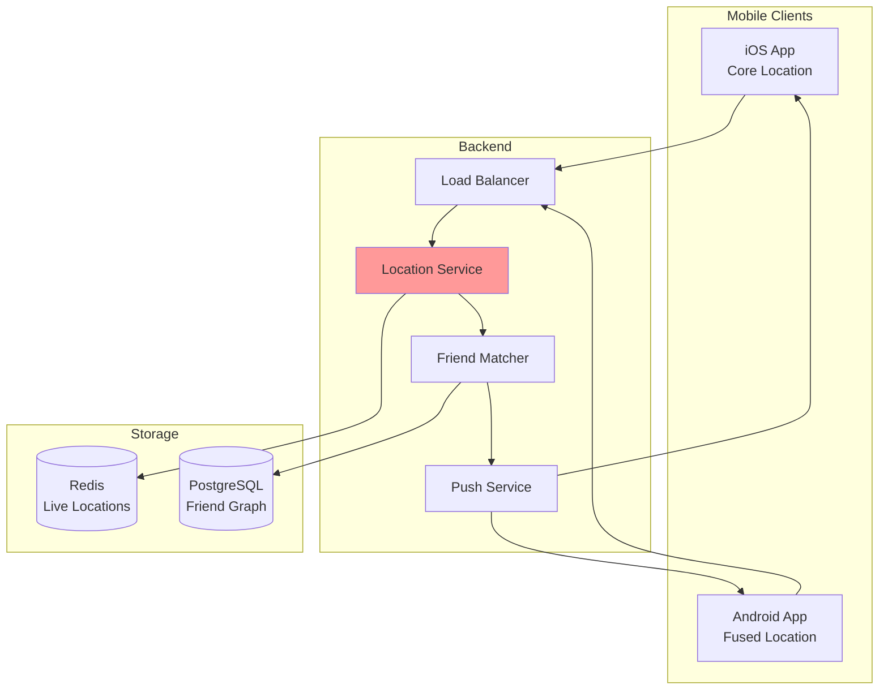
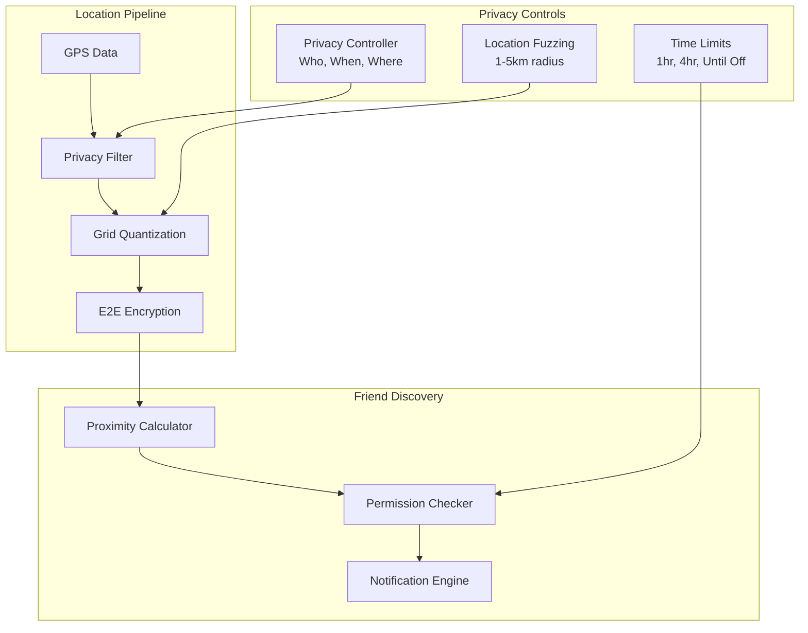
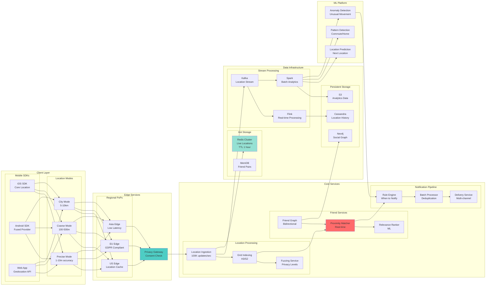
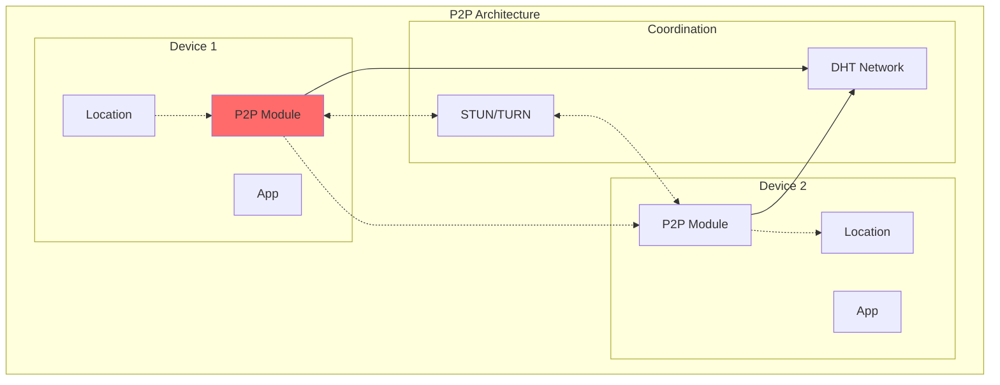
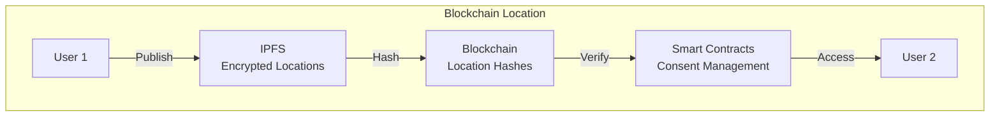
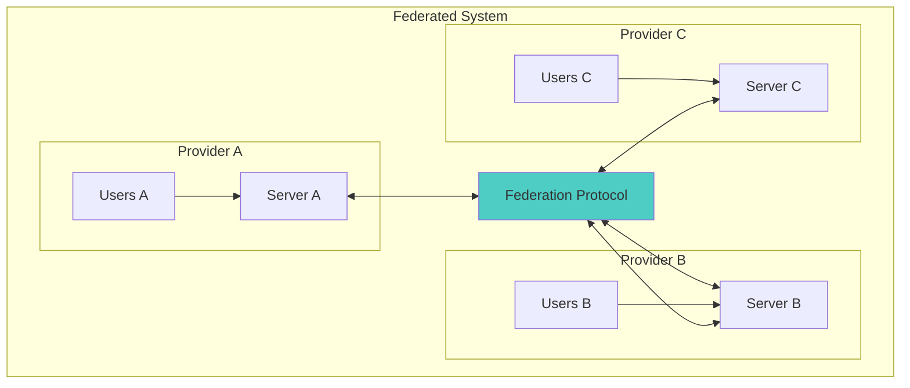
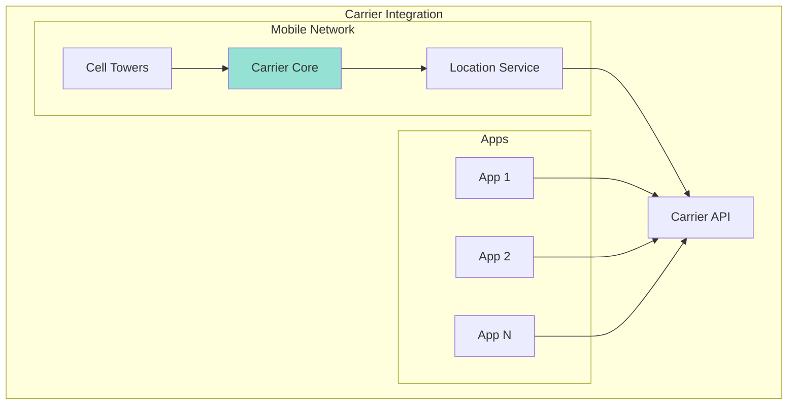

<!-- Navigation -->
[Home](../index.md) → [Case Studies](index.md) → **Nearby Friends System Design**

# 👥 Nearby Friends System Design

**The Challenge**: Track friend locations in real-time while preserving privacy and minimizing battery drain

!!! info "Case Study Sources"
    This analysis is based on:
    - Facebook Engineering: "Building Nearby Friends"¹
    - Snap Map Technical Overview²
    - Google Location Sharing Architecture³
    - Apple Find My Technical Details⁴
    - Academic Paper: "Privacy-Preserving Location Sharing"⁵

---

## 🏗️ Architecture Evolution

### Phase 1: Continuous Polling (2012-2013)

```text
Mobile App → Poll every 30s → Server → Database → Friend Locations
```

**Problems Encountered:**
- Battery drain (>20% per hour)
- High server load
- Stale location data
- No privacy controls

**Patterns Violated**: 
- ❌ No [Push Notifications](../patterns/push-notifications.md)
- ❌ No [Location Privacy](../patterns/location-privacy.md)
- ❌ No [Battery Optimization](../patterns/mobile-battery.md)

### Phase 2: Push-Based Architecture (2013-2015)



**Key Design Decision: Geofencing + Push**
- **Trade-off**: Accuracy vs Battery (Pillar: [Human Interface](../part2-pillars/human/index.md))
- **Choice**: Significant location changes only
- **Result**: 80% battery savings
- **Pattern Applied**: [Geofencing](../patterns/geofencing.md)

According to Facebook¹, this reduced battery usage from 20% to 4% per hour.

### Phase 3: Privacy-First Design (2015-2018)



**Innovation: Privacy-Preserving Proximity**⁵
- Location fuzzing by default
- Mutual consent required
- Time-limited sharing
- Grid-based quantization

**Patterns & Pillars Applied**:
- 🔧 Pattern: [Location Privacy](../patterns/location-privacy.md) - K-anonymity
- 🔧 Pattern: [Consent Management](../patterns/consent.md) - Mutual opt-in
- 🏛️ Pillar: [Human Interface](../part2-pillars/human/index.md) - Privacy UX
- 🏛️ Pillar: [Truth & Consistency](../part2-pillars/truth/index.md) - Location accuracy

### Phase 4: Modern Distributed Architecture (2018-Present)



**Current Capabilities**:
- 500M+ daily active users
- <100ms proximity checks
- 3-level privacy controls
- ML-powered relevance

## 📊 Core Components Deep Dive

### 1. Privacy-Preserving Location System

```python
class PrivacyPreservingLocation:
    """Location sharing with privacy guarantees"""
    
    def __init__(self):
        self.privacy_levels = {
            'precise': {'accuracy': 10, 'fuzzing': 0},
            'neighborhood': {'accuracy': 500, 'fuzzing': 250},
            'city': {'accuracy': 5000, 'fuzzing': 2500}
        }
        self.grid_resolutions = {
            'precise': 12,      # H3 level 12 (~30m)
            'neighborhood': 9,   # H3 level 9 (~1.5km)
            'city': 6           # H3 level 6 (~36km)
        }
        
    def process_location(self, location: Location, 
                        privacy_level: str,
                        viewer_id: str) -> ProcessedLocation:
        """Process location with privacy controls"""
        # 1. Check consent
        if not self._has_consent(location.user_id, viewer_id):
            return None
            
        # 2. Apply time restrictions
        if not self._within_time_window(location.user_id, viewer_id):
            return None
            
        # 3. Quantize to grid
        grid_level = self.grid_resolutions[privacy_level]
        grid_cell = self._quantize_to_grid(location, grid_level)
        
        # 4. Add fuzzing
        fuzzed_location = self._add_fuzzing(
            grid_cell.center,
            self.privacy_levels[privacy_level]['fuzzing']
        )
        
        # 5. Apply k-anonymity
        if not self._check_k_anonymity(grid_cell, k=3):
            # Not enough users in cell, expand to parent
            grid_cell = grid_cell.parent
            fuzzed_location = grid_cell.center
            
        return ProcessedLocation(
            user_id=location.user_id,
            location=fuzzed_location,
            accuracy=self.privacy_levels[privacy_level]['accuracy'],
            timestamp=location.timestamp,
            grid_cell=grid_cell.id
        )
    
    def _add_fuzzing(self, location: Location, radius_m: float) -> Location:
        """Add random offset within radius"""
        if radius_m == 0:
            return location
            
        # Random angle
        angle = random.uniform(0, 2 * math.pi)
        
        # Random distance with triangular distribution
        # (more likely to be near center)
        distance = random.triangular(0, radius_m, radius_m/3)
        
        # Calculate offset
        lat_offset = (distance / 111320) * math.cos(angle)
        lng_offset = (distance / (111320 * math.cos(math.radians(location.lat)))) * math.sin(angle)
        
        return Location(
            lat=location.lat + lat_offset,
            lng=location.lng + lng_offset
        )

class ConsentManager:
    """Manage location sharing consent"""
    
    def __init__(self):
        self.consent_store = {}  # (sharer, viewer) -> consent
        self.default_duration = timedelta(hours=4)
        
    async def request_consent(self, requester_id: str, 
                            target_id: str,
                            duration: timedelta = None) -> bool:
        """Request location sharing consent"""
        # 1. Check if already consented
        existing = self.consent_store.get((target_id, requester_id))
        if existing and existing.is_active():
            return True
            
        # 2. Check friendship
        if not await self._are_friends(requester_id, target_id):
            return False
            
        # 3. Send consent request
        consent_request = ConsentRequest(
            requester_id=requester_id,
            target_id=target_id,
            duration=duration or self.default_duration,
            created_at=datetime.now()
        )
        
        # 4. Notify target
        await self._send_consent_notification(consent_request)
        
        # 5. Wait for response (with timeout)
        try:
            response = await self._wait_for_response(
                consent_request,
                timeout=300  # 5 minutes
            )
            
            if response.accepted:
                # Create bidirectional consent
                self._create_consent(requester_id, target_id, duration)
                self._create_consent(target_id, requester_id, duration)
                return True
                
        except TimeoutError:
            pass
            
        return False
```

### 2. Efficient Proximity Detection

```python
class ProximityDetector:
    """Detect when friends are nearby"""
    
    def __init__(self):
        self.proximity_thresholds = {
            'very_close': 100,      # 100m
            'close': 500,           # 500m
            'nearby': 2000,         # 2km
            'same_area': 10000      # 10km
        }
        self.notification_cooldown = timedelta(hours=1)
        
    async def check_proximity(self, user_location: Location) -> List[NearbyFriend]:
        """Check which friends are nearby"""
        # 1. Get user's current grid cells at different levels
        grid_cells = self._get_multi_level_cells(user_location)
        
        # 2. Find friends in same or adjacent cells
        potential_nearby = set()
        for cell_id in grid_cells:
            friends_in_cell = await self._get_friends_in_cell(
                user_location.user_id,
                cell_id
            )
            potential_nearby.update(friends_in_cell)
            
            # Check adjacent cells for edge cases
            for adjacent in self._get_adjacent_cells(cell_id):
                friends_in_adjacent = await self._get_friends_in_cell(
                    user_location.user_id,
                    adjacent
                )
                potential_nearby.update(friends_in_adjacent)
        
        # 3. Calculate exact distances
        nearby_friends = []
        for friend_id in potential_nearby:
            friend_location = await self._get_friend_location(friend_id)
            
            if friend_location:
                distance = self._calculate_distance(
                    user_location,
                    friend_location
                )
                
                # Determine proximity level
                proximity_level = self._get_proximity_level(distance)
                
                if proximity_level:
                    nearby_friends.append(NearbyFriend(
                        friend_id=friend_id,
                        distance=distance,
                        proximity_level=proximity_level,
                        location=friend_location,
                        last_updated=friend_location.timestamp
                    ))
        
        # 4. Rank by relevance
        ranked = await self._rank_nearby_friends(
            user_location.user_id,
            nearby_friends
        )
        
        return ranked

class ProximityNotificationEngine:
    """Smart notifications for nearby friends"""
    
    def __init__(self):
        self.ml_model = NotificationRelevanceModel()
        self.cooldowns = {}  # (user, friend) -> last_notified
        
    async def process_proximity_event(self, user_id: str, 
                                    nearby: List[NearbyFriend]):
        """Decide whether to send notifications"""
        notifications = []
        
        for friend in nearby:
            # 1. Check notification cooldown
            if self._in_cooldown(user_id, friend.friend_id):
                continue
                
            # 2. Check if significant change
            if not self._is_significant_change(user_id, friend):
                continue
                
            # 3. ML relevance scoring
            relevance_score = await self.ml_model.score(
                user_id=user_id,
                friend_id=friend.friend_id,
                distance=friend.distance,
                time_of_day=datetime.now().hour,
                day_of_week=datetime.now().weekday(),
                location_type=await self._classify_location(friend.location)
            )
            
            # 4. Decide based on score
            if relevance_score > 0.7:
                notifications.append(
                    ProximityNotification(
                        user_id=user_id,
                        friend_id=friend.friend_id,
                        distance=friend.distance,
                        message=self._generate_message(friend),
                        priority='high' if friend.distance < 500 else 'normal'
                    )
                )
                
                # Update cooldown
                self._update_cooldown(user_id, friend.friend_id)
        
        # 5. Batch and send notifications
        if notifications:
            await self._send_notifications(notifications)
```

### 3. Battery-Efficient Location Updates

```python
class AdaptiveLocationManager:
    """Adaptive location update frequency"""
    
    def __init__(self):
        self.update_strategies = {
            'stationary': {
                'interval': 300,      # 5 minutes
                'accuracy': 'coarse',
                'distance_filter': 100
            },
            'walking': {
                'interval': 60,       # 1 minute
                'accuracy': 'balanced',
                'distance_filter': 50
            },
            'driving': {
                'interval': 30,       # 30 seconds
                'accuracy': 'high',
                'distance_filter': 200
            },
            'battery_saver': {
                'interval': 600,      # 10 minutes
                'accuracy': 'coarse',
                'distance_filter': 500
            }
        }
        
    async def determine_update_strategy(self, user_id: str) -> dict:
        """Determine optimal update strategy"""
        # 1. Check battery level
        battery_level = await self._get_battery_level(user_id)
        if battery_level < 20:
            return self.update_strategies['battery_saver']
            
        # 2. Detect movement pattern
        movement = await self._detect_movement_pattern(user_id)
        
        # 3. Check friend proximity
        has_nearby_friends = await self._has_nearby_friends(user_id)
        
        # 4. Time of day optimization
        hour = datetime.now().hour
        is_active_hours = 8 <= hour <= 22
        
        # 5. Select strategy
        if movement.speed < 1:  # m/s
            strategy = 'stationary'
        elif movement.speed < 2:  # walking speed
            strategy = 'walking'
        else:
            strategy = 'driving'
            
        # 6. Adjust based on context
        config = self.update_strategies[strategy].copy()
        
        if has_nearby_friends and is_active_hours:
            # More frequent updates when friends nearby
            config['interval'] = max(30, config['interval'] // 2)
            config['accuracy'] = 'high'
            
        return config

class LocationBatchProcessor:
    """Batch location updates for efficiency"""
    
    def __init__(self):
        self.batch_size = 100
        self.batch_timeout = 1.0  # seconds
        self.compression = True
        
    async def process_location_stream(self):
        """Process incoming location updates"""
        batch = []
        last_flush = time.time()
        
        async for update in self.location_stream:
            batch.append(update)
            
            # Flush conditions
            should_flush = (
                len(batch) >= self.batch_size or
                time.time() - last_flush > self.batch_timeout
            )
            
            if should_flush:
                await self._process_batch(batch)
                batch = []
                last_flush = time.time()
    
    async def _process_batch(self, updates: List[LocationUpdate]):
        """Process a batch of location updates"""
        # 1. Deduplicate by user
        latest_by_user = {}
        for update in updates:
            user_id = update.user_id
            if (user_id not in latest_by_user or 
                update.timestamp > latest_by_user[user_id].timestamp):
                latest_by_user[user_id] = update
        
        # 2. Compress if enabled
        if self.compression:
            compressed = self._compress_updates(list(latest_by_user.values()))
        else:
            compressed = list(latest_by_user.values())
            
        # 3. Parallel processing
        tasks = []
        
        # Update location storage
        tasks.append(self._update_location_storage(compressed))
        
        # Update grid indices
        tasks.append(self._update_grid_indices(compressed))
        
        # Check proximities
        tasks.append(self._check_proximities(compressed))
        
        # Stream to analytics
        tasks.append(self._stream_to_analytics(compressed))
        
        await asyncio.gather(*tasks)
```

### 4. Social Graph Integration

```python
class SocialGraphIntegration:
    """Integrate location with social graph"""
    
    def __init__(self):
        self.neo4j = Neo4jClient()
        self.cache = FriendshipCache()
        
    async def get_location_eligible_friends(self, user_id: str) -> List[str]:
        """Get friends eligible for location sharing"""
        query = """
        MATCH (u:User {id: $user_id})-[r:FRIEND]-(f:User)
        WHERE r.location_sharing = true
        AND r.blocked = false
        AND f.location_enabled = true
        RETURN f.id as friend_id, r.sharing_level as level
        """
        
        results = await self.neo4j.query(query, user_id=user_id)
        
        # Filter by privacy settings
        eligible = []
        for row in results:
            friend_id = row['friend_id']
            sharing_level = row['level']
            
            # Check if consent is active
            if await self._has_active_consent(user_id, friend_id):
                eligible.append(friend_id)
                
        return eligible
    
    async def suggest_location_sharing(self, user_id: str) -> List[FriendSuggestion]:
        """Suggest friends to share location with"""
        # 1. Get close friends without location sharing
        query = """
        MATCH (u:User {id: $user_id})-[r:FRIEND]-(f:User)
        WHERE r.location_sharing = false
        AND r.interaction_score > 0.7
        AND f.location_enabled = true
        WITH f, r.interaction_score as score
        ORDER BY score DESC
        LIMIT 10
        RETURN f.id as friend_id, f.name as name, score
        """
        
        candidates = await self.neo4j.query(query, user_id=user_id)
        
        # 2. Enhance with ML predictions
        suggestions = []
        for candidate in candidates:
            likelihood = await self._predict_sharing_likelihood(
                user_id,
                candidate['friend_id']
            )
            
            if likelihood > 0.5:
                suggestions.append(FriendSuggestion(
                    friend_id=candidate['friend_id'],
                    name=candidate['name'],
                    interaction_score=candidate['score'],
                    sharing_likelihood=likelihood,
                    reason=self._generate_suggestion_reason(candidate)
                ))
                
        return suggestions

class LocationHistoryAnalyzer:
    """Analyze location patterns for insights"""
    
    def __init__(self):
        self.pattern_detector = PatternDetector()
        
    async def analyze_user_patterns(self, user_id: str) -> UserLocationPatterns:
        """Analyze user's location patterns"""
        # 1. Get location history
        history = await self._get_location_history(user_id, days=30)
        
        # 2. Detect home/work locations
        significant_places = self.pattern_detector.find_significant_places(
            history,
            min_visits=10,
            min_duration=timedelta(hours=2)
        )
        
        # 3. Detect commute patterns
        commute_patterns = self.pattern_detector.find_commute_patterns(
            history,
            significant_places
        )
        
        # 4. Find routine patterns
        routines = self.pattern_detector.find_weekly_routines(history)
        
        # 5. Identify anomalies
        anomalies = self.pattern_detector.find_anomalies(
            history,
            significant_places,
            routines
        )
        
        return UserLocationPatterns(
            home=significant_places.get('home'),
            work=significant_places.get('work'),
            commute=commute_patterns,
            routines=routines,
            anomalies=anomalies,
            privacy_score=self._calculate_privacy_score(history)
        )
```

### 5. Real-time Stream Processing

```python
class LocationStreamProcessor:
    """Process location updates in real-time"""
    
    def __init__(self):
        self.flink_env = StreamExecutionEnvironment.get_execution_environment()
        self.window_size = 60  # seconds
        
    def build_processing_pipeline(self):
        """Build Flink processing pipeline"""
        # 1. Source: Kafka location stream
        location_stream = self.flink_env.add_source(
            FlinkKafkaConsumer(
                'location-updates',
                DeserializationSchema(),
                kafka_properties
            )
        )
        
        # 2. Parse and validate
        parsed_stream = location_stream.map(
            lambda x: self.parse_location_update(x)
        ).filter(
            lambda x: x is not None
        )
        
        # 3. Window by user
        windowed_stream = parsed_stream.key_by(
            lambda x: x.user_id
        ).window(
            TumblingEventTimeWindows.of(Time.seconds(self.window_size))
        )
        
        # 4. Aggregate location updates
        aggregated = windowed_stream.aggregate(
            LocationAggregator(),
            ProcessWindowFunction()
        )
        
        # 5. Detect proximity events
        proximity_events = aggregated.connect(
            self.friend_location_stream
        ).process(
            ProximityDetectionFunction()
        )
        
        # 6. Output to multiple sinks
        
        # Real-time notifications
        proximity_events.filter(
            lambda x: x.is_significant
        ).add_sink(
            NotificationSink()
        )
        
        # Analytics
        aggregated.add_sink(
            AnalyticsSink()
        )
        
        # Location storage
        parsed_stream.add_sink(
            LocationStorageSink()
        )
        
        return self.flink_env

class ProximityDetectionFunction(CoProcessFunction):
    """Detect when friends come into proximity"""
    
    def __init__(self):
        self.user_locations = {}  # user_id -> location
        self.proximity_threshold = 2000  # meters
        
    def process_element1(self, value: UserLocation, ctx, out):
        """Process user location update"""
        user_id = value.user_id
        
        # Update location
        self.user_locations[user_id] = value
        
        # Check proximity with friends
        friends = self.get_friends(user_id)
        
        for friend_id in friends:
            if friend_id in self.user_locations:
                friend_location = self.user_locations[friend_id]
                
                distance = self.calculate_distance(
                    value.location,
                    friend_location.location
                )
                
                if distance < self.proximity_threshold:
                    # Emit proximity event
                    out.collect(ProximityEvent(
                        user1=user_id,
                        user2=friend_id,
                        distance=distance,
                        timestamp=ctx.timestamp(),
                        location1=value.location,
                        location2=friend_location.location
                    ))
```

## 🎯 Axiom Mapping & Design Decisions

### Comprehensive Design Decision Matrix

| Design Decision | Axiom 1<br/>🚀 Latency | Axiom 2<br/>💾 Capacity | Axiom 3<br/>🔥 Failure | Axiom 4<br/>🔀 Concurrency | Axiom 5<br/>🤝 Coordination | Axiom 6<br/>👁️ Observability | Axiom 7<br/>👤 Human | Axiom 8<br/>💰 Economics |
|----------------|----------|----------|---------|-------------|--------------|---------------|-------|-----------|
| **Location Fuzzing** | ⚪ Minimal overhead | ⚪ | ✅ Privacy protection | ⚪ | ✅ Consistent fuzzing | ✅ Privacy metrics | ✅ User trust | ✅ Compliance |
| **Grid Quantization** | ✅ Fast lookups | ✅ Reduced storage | ✅ Privacy fallback | ✅ Parallel cells | ✅ Grid consistency | ✅ Cell density | ✅ Intuitive privacy | ✅ Storage efficiency |
| **Adaptive Updates** | ✅ Reduced requests | ✅ Less bandwidth | ✅ Graceful degradation | ⚪ | ✅ Update coordination | ✅ Battery metrics | ✅ Battery life | ✅ Cost reduction |
| **Consent System** | ⚪ | ✅ Consent storage | ✅ Default deny | ✅ Async consent | ✅ Bidirectional sync | ✅ Consent analytics | ✅ User control | ✅ GDPR compliance |
| **Stream Processing** | ✅ Real-time detection | ✅ Windowed aggregation | ✅ Checkpoint recovery | ✅ Parallel streams | ✅ Event ordering | ✅ Stream metrics | ✅ Instant notifications | ✅ Resource efficiency |
| **ML Relevance** | ⚪ Inference time | ✅ Model caching | ✅ Rule fallback | ✅ Batch scoring | ⚪ | ✅ Relevance metrics | ✅ Smart notifications | ✅ Engagement |
| **Edge Caching** | ✅ Regional latency | ✅ Distributed cache | ✅ Cache failover | ✅ Regional isolation | ✅ Cache sync | ✅ Hit rates | ✅ Fast responses | ✅ Bandwidth savings |
| **Battery Optimization** | ✅ Fewer updates | ✅ Reduced data | ✅ Fallback modes | ⚪ | ✅ Strategy sync | ✅ Battery tracking | ✅ All-day usage | ✅ User retention |

**Legend**: ✅ Primary impact | ⚪ Secondary/No impact

## 🔄 Alternative Architectures

### Alternative 1: Peer-to-Peer Location Sharing



**Trade-offs**:
- ✅ No central server
- ✅ True privacy
- ✅ No infrastructure cost
- ❌ Unreliable connectivity
- ❌ Battery drain
- ❌ No offline support

### Alternative 2: Blockchain-Based System



**Trade-offs**:
- ✅ Decentralized
- ✅ Immutable consent
- ✅ No central authority
- ❌ High latency (minutes)
- ❌ Transaction costs
- ❌ Poor UX

### Alternative 3: Federated Architecture



**Trade-offs**:
- ✅ Provider choice
- ✅ Interoperability
- ✅ Distributed trust
- ❌ Complex protocol
- ❌ Inconsistent features
- ❌ Cross-provider latency

### Alternative 4: Carrier-Based System



**Trade-offs**:
- ✅ No GPS needed
- ✅ Always available
- ✅ Carrier accuracy
- ❌ Privacy concerns
- ❌ Carrier dependency
- ❌ Limited features

## 📊 Performance & Privacy Metrics

### Key Performance Indicators

```python
class NearbyFriendsMetrics:
    """Comprehensive metrics for nearby friends system"""
    
    def __init__(self):
        self.metrics = {
            # Performance metrics
            'location_update_latency': Histogram(
                'nearby_location_update_latency_ms',
                'Time to process location update',
                buckets=[10, 50, 100, 500, 1000]
            ),
            'proximity_check_latency': Histogram(
                'nearby_proximity_check_latency_ms',
                'Time to check friend proximity',
                buckets=[10, 25, 50, 100, 250]
            ),
            
            # Privacy metrics
            'location_fuzzing_radius': Histogram(
                'nearby_fuzzing_radius_meters',
                'Location fuzzing radius applied',
                buckets=[0, 100, 500, 1000, 5000]
            ),
            'consent_requests': Counter(
                'nearby_consent_requests_total',
                'Location sharing consent requests',
                ['status']  # granted, denied, expired
            ),
            
            # Battery metrics
            'battery_usage_rate': Gauge(
                'nearby_battery_usage_percent_per_hour',
                'Battery consumption rate'
            ),
            'location_update_frequency': Histogram(
                'nearby_update_frequency_seconds',
                'Time between location updates',
                buckets=[30, 60, 300, 600, 3600]
            ),
            
            # Business metrics
            'daily_active_sharers': Gauge(
                'nearby_daily_active_sharers',
                'Users actively sharing location'
            ),
            'proximity_notifications_sent': Counter(
                'nearby_notifications_total',
                'Proximity notifications sent'
            )
        }
```

### Privacy Dashboard

```python
class PrivacyDashboard:
    """User privacy controls and analytics"""
    
    async def get_privacy_summary(self, user_id: str) -> PrivacySummary:
        """Get user's privacy summary"""
        return PrivacySummary(
            sharing_enabled=await self._is_sharing_enabled(user_id),
            active_shares=await self._get_active_shares(user_id),
            privacy_level=await self._get_privacy_level(user_id),
            location_history_days=await self._get_history_retention(user_id),
            blocked_users=await self._get_blocked_users(user_id),
            data_usage_mb=await self._get_monthly_data_usage(user_id),
            battery_impact_percent=await self._get_battery_impact(user_id)
        )
```

## 🚨 Failure Scenarios & Recovery

### Common Failure Modes

1. **Location Service Outage**
   ```python
   class LocationServiceFailover:
       async def handle_location_service_failure(self):
           # 1. Switch to fallback provider
           await self.switch_to_fallback_location_provider()
           
           # 2. Notify users of degraded accuracy
           await self.notify_degraded_service()
           
           # 3. Use cached last known locations
           await self.enable_cached_location_mode()
   ```

2. **Privacy Breach Prevention**
   ```python
   class PrivacyBreachHandler:
       async def handle_potential_breach(self, incident: PrivacyIncident):
           # 1. Immediately stop location sharing
           await self.emergency_stop_sharing(incident.affected_users)
           
           # 2. Audit access logs
           violations = await self.audit_access_logs(incident)
           
           # 3. Notify affected users
           await self.notify_users(violations)
           
           # 4. Reset all consents
           await self.reset_consents(incident.affected_users)
   ```

3. **Battery Drain Detection**
   ```python
   class BatteryProtection:
       async def detect_excessive_drain(self, user_id: str):
           drain_rate = await self.calculate_drain_rate(user_id)
           
           if drain_rate > 10:  # >10% per hour
               # Switch to battery saver mode
               await self.enable_battery_saver(user_id)
               
               # Notify user
               await self.send_battery_warning(user_id)
   ```

## 💡 Key Design Insights

### 1. 🔐 **Privacy Must Be Default**
- Opt-in only, never opt-out
- Multiple privacy levels
- Time-limited sharing
- Mutual consent required

### 2. 🔋 **Battery Life is Critical**
- Adaptive update frequencies
- Movement detection
- Batched updates
- Efficient protocols

### 3. 📍 **Fuzzing Preserves Privacy**
- Grid quantization
- Random offsets
- K-anonymity checks
- Plausible deniability

### 4. 🤝 **Social Context Matters**
- Close friends only
- Interaction history
- Relevance scoring
- Smart notifications

### 5. ⚡ **Real-time with Boundaries**
- Stream processing
- Edge caching
- Regional isolation
- Graceful degradation

## 🔍 Related Concepts & Deep Dives

### 📚 Relevant Axioms
- **[Axiom 1: Latency](../part1-axioms/axiom1-latency/index.md)** - Real-time location updates
- **[Axiom 2: Finite Capacity](../part1-axioms/axiom2-capacity/index.md)** - Battery and bandwidth limits
- **[Axiom 3: Failure is Normal](../part1-axioms/axiom3-failure/index.md)** - Privacy fail-safes
- **[Axiom 4: Concurrency](../part1-axioms/axiom4-concurrency/index.md)** - Parallel proximity checks
- **[Axiom 5: Coordination](../part1-axioms/axiom5-coordination/index.md)** - Consent synchronization
- **[Axiom 6: Observability](../part1-axioms/axiom6-observability/index.md)** - Privacy analytics
- **[Axiom 7: Human Interface](../part1-axioms/axiom7-human/index.md)** - Privacy UX, battery life
- **[Axiom 8: Economics](../part1-axioms/axiom8-economics/index.md)** - Infrastructure costs

### 🏛️ Related Patterns
- **[Location Privacy](../patterns/location-privacy.md)** - K-anonymity, fuzzing
- **[Consent Management](../patterns/consent-management.md)** - GDPR compliance
- **[Stream Processing](../patterns/stream-processing.md)** - Real-time events
- **[Edge Computing](../patterns/edge-computing.md)** - Regional processing
- **[Circuit Breaker](../patterns/circuit-breaker.md)** - Service protection
- **[Geofencing](../patterns/geofencing.md)** - Location triggers
- **[Battery Optimization](../patterns/battery-optimization.md)** - Mobile efficiency

### 📊 Quantitative Models
- **[Privacy Metrics](../quantitative/privacy-metrics.md)** - K-anonymity, l-diversity
- **[Battery Models](../quantitative/battery-models.md)** - Power consumption
- **[Social Networks](../quantitative/social-networks.md)** - Friend graphs
- **[Spatial Statistics](../quantitative/spatial-stats.md)** - Location clustering

### 🔄 Similar Case Studies
- **[Find My Device](find-my-device.md)** - Apple/Google location
- **[Snap Map](snap-map.md)** - Social location sharing
- **[Life360](life360.md)** - Family location tracking
- **[Strava Heatmaps](strava-heatmaps.md)** - Activity location privacy

---

## References

1. Facebook Engineering: "Building Nearby Friends" - F8 Conference (2018)
2. Snap Inc: "The Technology Behind Snap Map" (2020)
3. Google I/O: "Location Sharing Done Right" (2019)
4. Apple WWDC: "Find My Network Technical Details" (2021)
5. IEEE Paper: "Privacy-Preserving Location Sharing in Social Networks" (2019)