# Design a Nearby Friends System

!!! info "Case Study Overview"
    **System**: Real-time location sharing for finding friends nearby  
    **Scale**: 500M+ users, continuous location updates, privacy-first  
    **Challenges**: Real-time updates, battery efficiency, privacy controls, scale  
    **Key Patterns**: Pub/sub, geofencing, location quantization, privacy zones

*Estimated reading time: 40 minutes*

## Introduction

Nearby Friends represents one of the most challenging location-based services: continuously tracking and sharing user locations while maintaining privacy, battery efficiency, and real-time performance. Unlike static POI searches, this system must handle hundreds of millions of users constantly moving, with friend relationships creating a complex graph of who can see whom. From Snapchat's Snap Map to Facebook's Nearby Friends, these systems must balance the physics of continuous location updates with the human need for privacy and control. Let's explore how distributed systems principles enable finding friends in real-time while respecting boundaries.

## Part 1: Concept Map - The Physics of Moving Friends

### Axiom 1: Latency - Real-time Friend Discovery

Location updates must propagate fast enough to show friends' movements in near real-time.

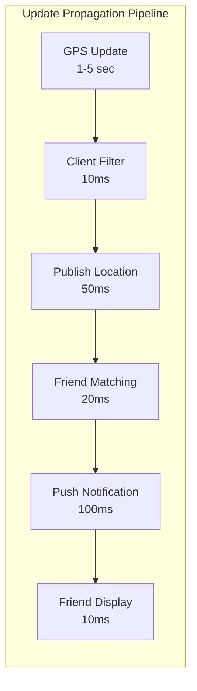

**Latency Budget Breakdown:**

| Component | Target Latency | Optimization Strategy |
|-----------|---------------|----------------------|
| Location Acquisition | 1-5 seconds | Fused location providers |
| Update Batching | 100ms | Intelligent batching |
| Network Transit | 20-50ms | Regional endpoints |
| Friend Matching | 10-30ms | Geohash indexing |
| Notification Delivery | 50-200ms | Push notification services |
| End-to-End | < 2 seconds | Parallel processing |

**Battery vs Latency Trade-offs:**

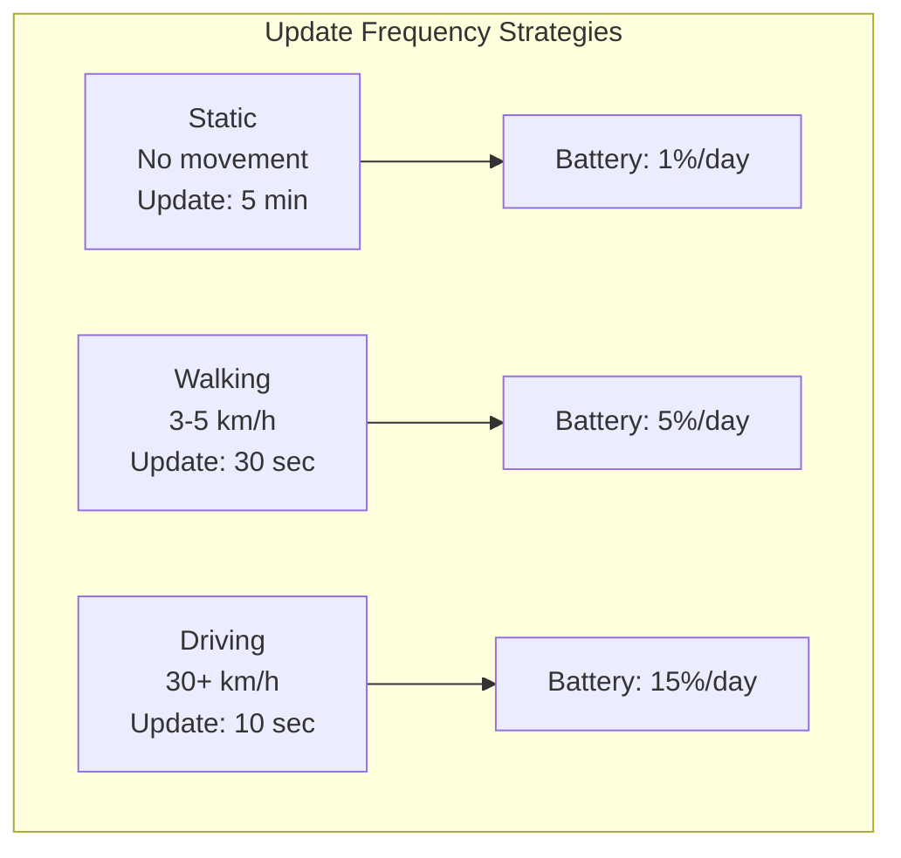

### Axiom 2: Capacity - The N×M Friend Location Problem

Each user has M friends, creating N×M potential location relationships to track.

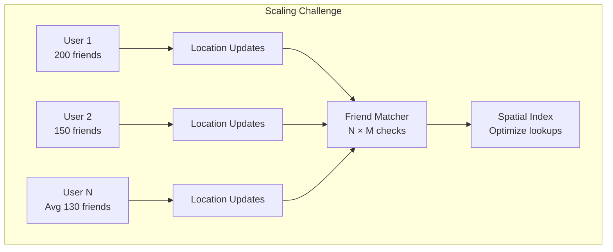

**Capacity Planning:**

| Metric | Scale | Impact |
|--------|-------|--------|
| Active Users | 500M | Base load |
| Average Friends | 130 | Relationship complexity |
| Location Updates/User/Day | 288 (every 5 min) | Write load |
| Total Updates/Day | 144B | System throughput |
| Storage per Update | 100 bytes | 14.4TB/day |
| Query Load | 1M QPS | Read amplification |

**Data Reduction Strategies:**

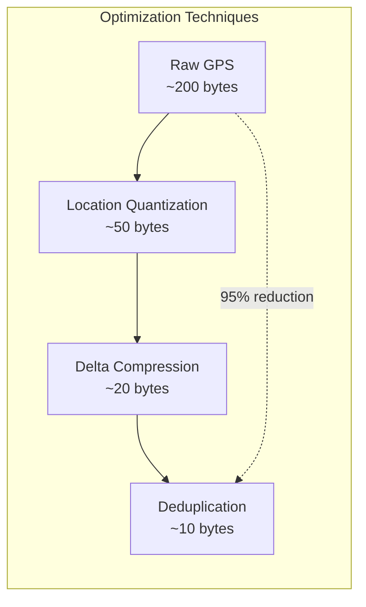

### Axiom 3: Failure - Privacy-First Failure Modes

System must fail closed - never expose location without explicit permission.

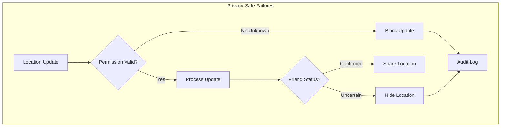

**Failure Scenarios and Privacy:**

| Failure Type | Privacy Impact | Mitigation |
|--------------|---------------|------------|
| Permission Service Down | Could expose location | Fail closed - hide all |
| Friend Graph Inconsistent | Wrong people see location | Cache last known good state |
| Location Service Error | Stale locations shown | Clear TTL, show uncertainty |
| Notification Failure | Friends unaware of presence | Retry with backoff |
| Regional Outage | Friends appear offline | Graceful degradation |

### Axiom 4: Concurrency - Millions Moving Simultaneously

Handle concurrent location updates from millions of users efficiently.

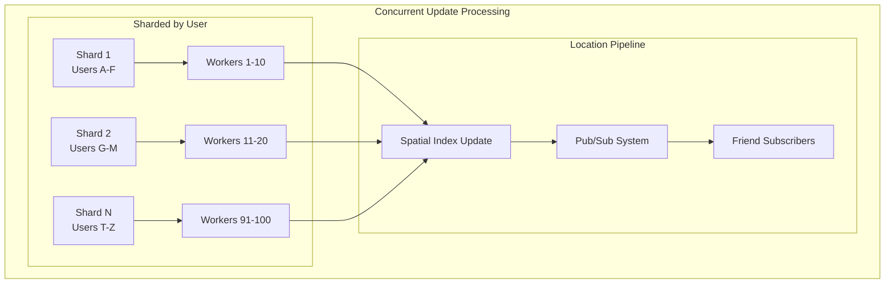

**Concurrency Patterns:**

| Pattern | Use Case | Throughput |
|---------|----------|------------|
| User Sharding | Partition by user ID | 1M updates/sec |
| Location Bucketing | Group nearby updates | 10x efficiency |
| Batch Processing | Aggregate updates | 5x throughput |
| Read Replicas | Scale friend queries | 10M reads/sec |
| Write-Through Cache | Recent locations | 90% cache hit |

### Axiom 5: Coordination - Global Friend Graph Consistency

Maintaining consistent friend relationships and permissions across regions.

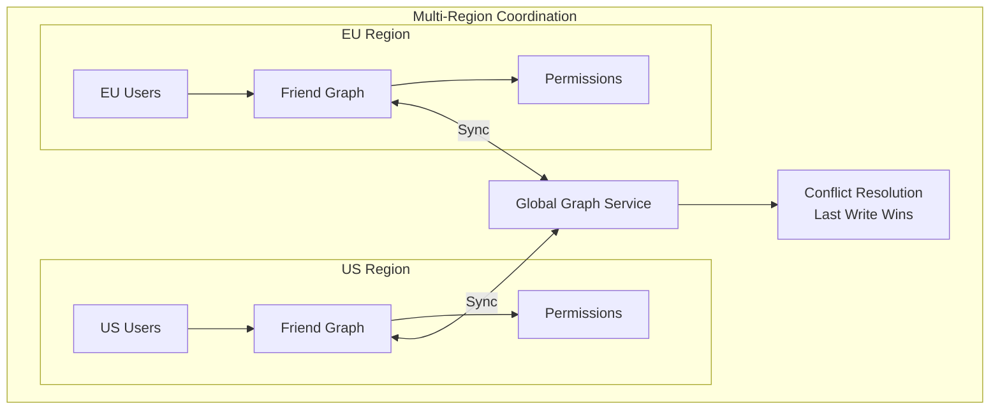

**Consistency Requirements:**

| Data Type | Consistency Model | Sync Latency | Rationale |
|-----------|------------------|--------------|-----------|
| Friend Relationships | Strong | Immediate | Privacy critical |
| Location Sharing Permissions | Strong | Immediate | Privacy critical |
| Current Location | Eventual | < 5 seconds | Performance trade-off |
| Location History | Eventual | < 1 minute | Not real-time critical |
| Presence Status | Causal | < 10 seconds | User experience |

### Axiom 6: Observability - Privacy-Aware Monitoring

Monitor system health without compromising user privacy.

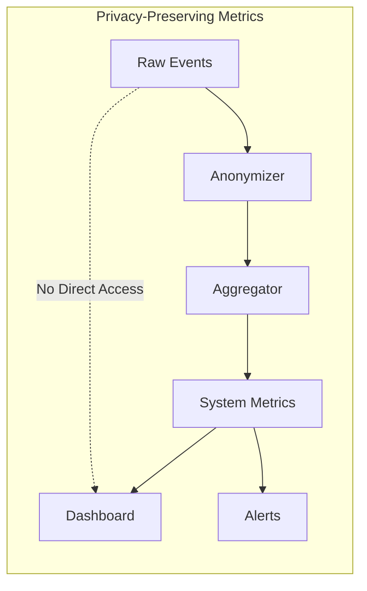

**Key Metrics (Privacy-Safe):**

| Metric Category | Examples | Privacy Considerations |
|----------------|----------|----------------------|
| System Health | Update latency, Error rates | No user identifiers |
| Usage Patterns | Updates/hour, Active regions | Aggregated only |
| Privacy Controls | Permission changes/day | Anonymous counts |
| Battery Impact | Update frequency distribution | Device-type aggregated |
| Friend Graph | Average friend count | Statistical only |

### Axiom 7: Human Interface - Privacy and Control

Give users intuitive control over their location sharing.

```mermaid
graph TB
    subgraph "Privacy Controls"
        USER[User] --> GLOBAL{Global Toggle}
        GLOBAL -->|On| GRANULAR[Granular Controls]
        GLOBAL -->|Off| HIDDEN[Completely Hidden]
        
        GRANULAR --> TIME[Time-based<br/>"Next 1 hour"]
        GRANULAR --> PEOPLE[People-based<br/>"Close friends only"]
        GRANULAR --> LOCATION[Location-based<br/>"Not at home"]
        GRANULAR --> PRECISION[Precision<br/>"City-level only"]
    end
```

**Privacy Feature Matrix:**

| Feature | Implementation | User Benefit |
|---------|---------------|--------------|
| Ghost Mode | Hide from everyone | Complete privacy |
| Selective Sharing | Choose specific friends | Granular control |
| Location Fuzzing | Reduce precision | Privacy with sharing |
| Time Limits | Auto-expire sharing | Temporary sharing |
| Geofencing | Hide in certain areas | Location-based privacy |
| Activity-based | Hide when stationary | Context awareness |

### Axiom 8: Economics - Balancing Features and Costs

Optimize costs while providing free service to hundreds of millions.

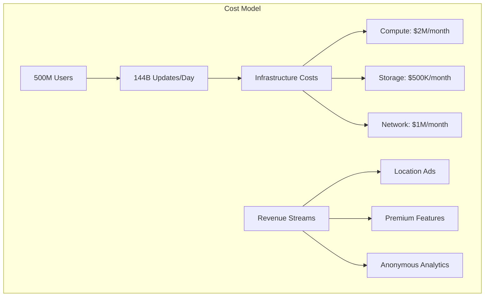

**Cost Optimization Strategies:**

| Strategy | Implementation | Savings |
|----------|---------------|---------|
| Update Batching | Combine nearby updates | 60% network |
| Location Quantization | Reduce precision | 70% storage |
| Inactive User Pruning | Archive old data | 40% storage |
| Edge Computing | Process locally | 50% compute |
| Adaptive Frequency | Movement-based updates | 80% battery/data |

## Part 2: Comprehensive Axiom Analysis Matrix

### Axiom Mapping for Core Design Decisions

| Design Decision | Axiom 1: Latency | Axiom 2: Capacity | Axiom 3: Failure | Axiom 4: Concurrency | Axiom 5: Coordination | Axiom 6: Observability | Axiom 7: Human Interface | Axiom 8: Economics |
|----------------|------------------|-------------------|------------------|---------------------|---------------------|---------------------|------------------------|-------------------|
| **Pub/Sub Architecture** | ✅ Real-time delivery<br/>Push model | ⚠️ Fan-out overhead<br/>N×M messages | ✅ Graceful degradation<br/>Queue persistence | ✅ Parallel delivery<br/>Natural decoupling | ⚠️ Ordering challenges<br/>Cross-region sync | ✅ Clear flow<br/>Message tracing | ✅ Instant updates<br/>Live experience | ⚠️ Infrastructure cost<br/>Message volume |
| **Geohash Clustering** | ✅ Fast friend lookup<br/>O(1) operations | ✅ Spatial efficiency<br/>Reduce comparisons | ✅ Simple recovery<br/>Stateless design | ✅ Parallel processing<br/>Independent cells | ✅ Natural sharding<br/>Geographic bounds | ✅ Clear metrics<br/>Cell-based stats | ⚠️ Grid boundaries<br/>Edge cases | ✅ Efficient indexing<br/>Low compute |
| **Privacy Zones** | ⚠️ Extra checks<br/>Small overhead | ⚠️ More metadata<br/>Zone definitions | ✅ Fail-safe design<br/>Default hidden | ✅ Zone checks parallel<br/>No blocking | ✅ Consistent rules<br/>Global policies | ⚠️ Complex tracking<br/>Zone violations | ✅ User control<br/>Clear boundaries | ✅ Reduces updates<br/>In private zones |
| **Adaptive Updates** | ✅ Optimize frequency<br/>Based on movement | ✅ Reduce volume<br/>80% fewer updates | ✅ Fallback rates<br/>Never lose user | ✅ Independent logic<br/>Per-user rates | ⚠️ Rate sync issues<br/>Clock skew | ✅ Movement patterns<br/>Clear analytics | ✅ Battery saving<br/>User happiness | ✅ Major savings<br/>Compute and network |
| **Friend Graph Cache** | ✅ Instant lookup<br/>Memory speed | ⚠️ Memory usage<br/>Redundant storage | ✅ Stale but safe<br/>Old permissions OK | ✅ Read scaling<br/>No graph locks | ⚠️ Cache coherency<br/>Update propagation | ✅ Hit rates<br/>Cache effectiveness | ✅ Fast friend list<br/>Smooth UX | ✅ Reduce DB load<br/>90% fewer queries |

### Axiom Interaction Complexity

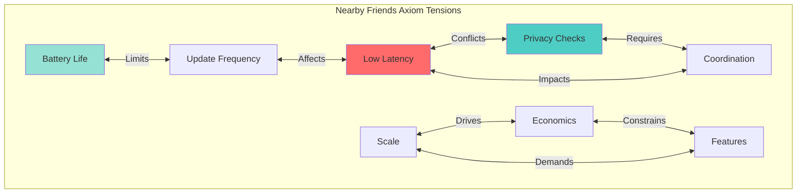

## Part 3: Architecture - Building Real-time Location Sharing

### Current Architecture: Pub/Sub with Spatial Indexing

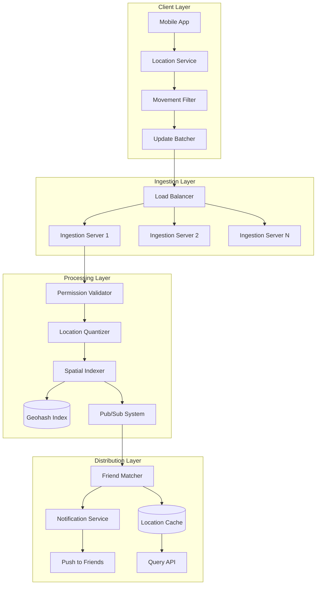

### Alternative Architecture 1: Peer-to-Peer Location Sharing

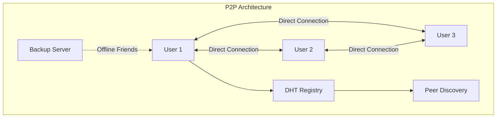

**Trade-offs:**

| Aspect | Benefit | Challenge |
|--------|---------|-----------|
| Privacy | No central storage | Trust between peers |
| Latency | Direct connections | NAT traversal |
| Scale | Infinite | Connection management |
| Battery | Worse (always on) | Constant networking |
| Reliability | Poor | Peer churn |

### Alternative Architecture 2: Edge-Based Processing

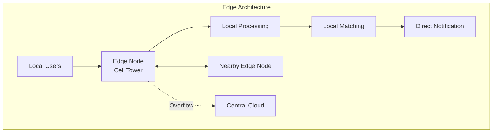

**Trade-offs:**

| Aspect | Benefit | Challenge |
|--------|---------|-----------|
| Latency | Ultra-low locally | Edge deployment |
| Privacy | Data stays local | Edge security |
| Scale | Distributed load | Many edge nodes |
| Cost | Reduced central load | Edge infrastructure |
| Complexity | High | Coordination |

### Alternative Architecture 3: Blockchain-Based

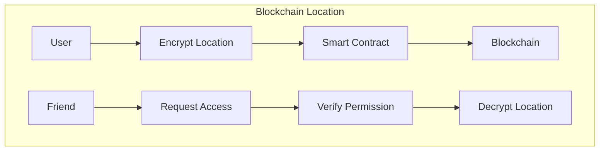

**Trade-offs:**

| Aspect | Benefit | Challenge |
|--------|---------|-----------|
| Privacy | Cryptographic guarantees | Key management |
| Trust | Zero trust | Slow consensus |
| Audit | Complete trail | Storage costs |
| Latency | Poor | Block time |
| Scale | Limited | Transaction fees |

### Alternative Architecture 4: Federated System

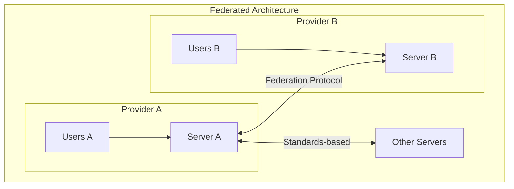

**Trade-offs:**

| Aspect | Benefit | Challenge |
|--------|---------|-----------|
| Privacy | User choice | Varying policies |
| Control | Decentralized | Protocol agreement |
| Scale | Distributed | Interoperability |
| Innovation | Multiple approaches | Lowest common denominator |
| Cost | Shared | Business model |

### Recommended Architecture: Hybrid Privacy-First System

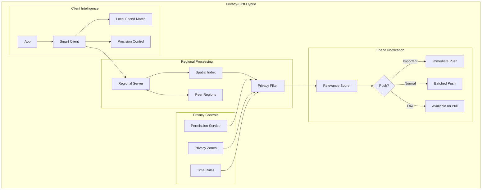

## Part 4: Comparative Analysis

### Architecture Comparison Matrix

| Architecture | Privacy | Latency | Scale | Battery | Cost | Complexity |
|--------------|---------|---------|-------|---------|------|------------|
| **Pub/Sub + Spatial** | ✅✅✅ Good controls | ✅✅✅✅ < 2 sec | ✅✅✅✅✅ Billions | ✅✅✅ Adaptive | $$$ | Medium |
| **P2P** | ✅✅✅✅✅ Excellent | ✅✅✅✅✅ Direct | ✅✅ Limited | ❌ Always on | $ | High |
| **Edge-Based** | ✅✅✅✅ Local data | ✅✅✅✅✅ < 500ms | ✅✅✅✅ Good | ✅✅✅✅ Efficient | $$$$ | Very High |
| **Blockchain** | ✅✅✅✅✅ Cryptographic | ❌ Minutes | ❌ Very limited | ❌❌ Proof of work | $$$$$ | High |
| **Federated** | ✅✅✅ Variable | ✅✅✅ Good | ✅✅✅✅ Good | ✅✅✅ Standard | $$ | Medium |
| **Hybrid** | ✅✅✅✅✅ Best in class | ✅✅✅✅ < 1 sec | ✅✅✅✅✅ Billions | ✅✅✅✅✅ Optimized | $$$ | High |

### Privacy Feature Comparison

| Feature | Current | P2P | Edge | Blockchain | Federated | Hybrid |
|---------|---------|-----|------|------------|-----------|--------|
| Ghost Mode | ✅ | ✅ | ✅ | ✅ | ✅ | ✅ |
| Selective Sharing | ✅ | ✅ | ✅ | ✅ | ⚠️ | ✅ |
| Location Fuzzing | ✅ | ⚠️ | ✅ | ✅ | ⚠️ | ✅ |
| Time Limits | ✅ | ❌ | ✅ | ✅ | ⚠️ | ✅ |
| Privacy Zones | ✅ | ❌ | ✅ | ⚠️ | ❌ | ✅ |
| Audit Trail | ⚠️ | ❌ | ⚠️ | ✅ | ⚠️ | ✅ |

### Performance Analysis

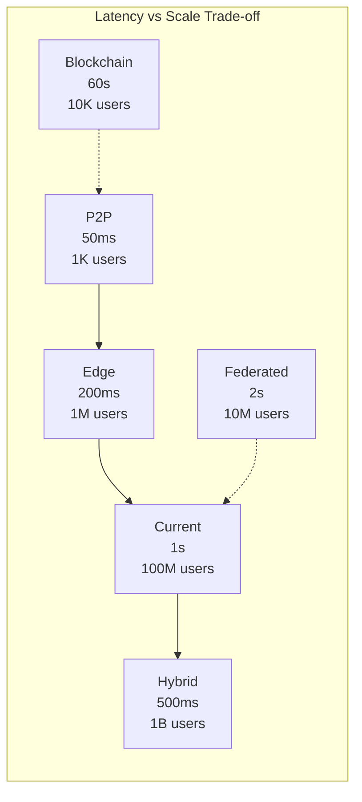

### Cost Analysis by Scale

| Users | Current | P2P | Edge | Blockchain | Federated | Hybrid |
|-------|---------|-----|------|------------|-----------|--------|
| 1M | $50K/mo | $10K/mo | $200K/mo | $500K/mo | $30K/mo | $100K/mo |
| 10M | $300K/mo | $50K/mo | $1M/mo | N/A | $200K/mo | $400K/mo |
| 100M | $2M/mo | N/A | $8M/mo | N/A | $1.5M/mo | $2.5M/mo |
| 1B | $15M/mo | N/A | $50M/mo | N/A | $10M/mo | $12M/mo |

### Decision Framework

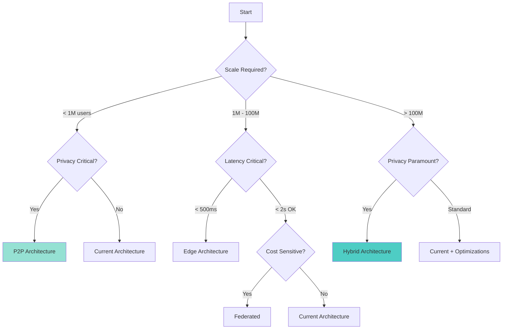

## Implementation Best Practices

### Privacy-First Design Principles

1. **Default to Private**: Location sharing off by default
2. **Explicit Consent**: Clear opt-in for each friend
3. **Granular Control**: Time, location, and precision limits
4. **Audit Trail**: User can see who viewed their location
5. **Easy Off Switch**: One-tap to go completely private

### Battery Optimization Strategies

| Strategy | Implementation | Battery Savings |
|----------|---------------|-----------------|
| Movement Detection | Accelerometer-based | 50% GPS reduction |
| Adaptive Frequency | Speed-based updates | 70% update reduction |
| Batching | Combine updates | 30% network savings |
| Geofencing | WiFi/Cell triggers | 80% in stationary |
| Background Limits | OS integration | 40% overall |

### Scaling Strategies

1. **Geographic Sharding**: Keep friends in same region on same shards
2. **Friend Graph Caching**: Precompute friend clusters
3. **Location Quantization**: Reduce precision for distant friends
4. **Update Coalescing**: Combine rapid movements
5. **Tiered Storage**: Hot (1 day), Warm (1 week), Cold (archive)

## Conclusion

Nearby Friends systems demonstrate the complex interplay between real-time performance, privacy protection, and battery efficiency at massive scale. The hybrid architecture balances these concerns by using client-side intelligence for privacy controls, regional processing for low latency, and adaptive update strategies for battery efficiency. The key insight is that different use cases (close friends vs. acquaintances, stationary vs. moving) require different update strategies and privacy levels. Success comes from giving users granular control while making the default experience both private and performant, ensuring that finding friends nearby enhances social connections without compromising personal boundaries.