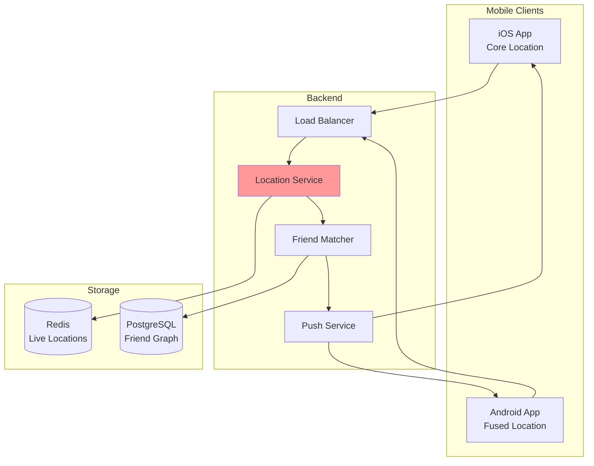
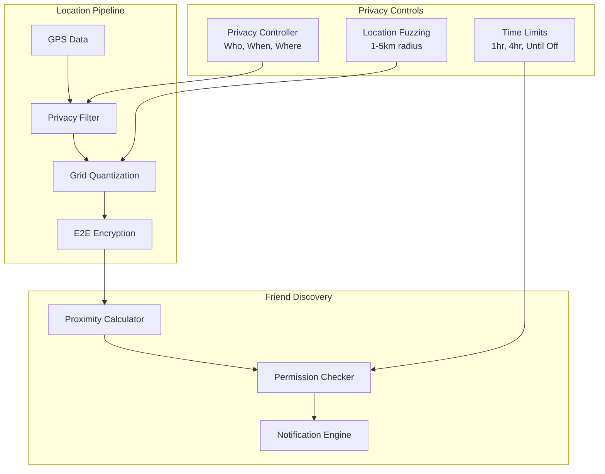
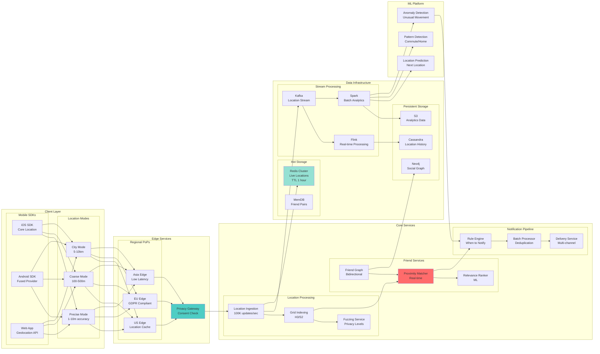

<!-- Navigation -->
[Home](../introduction/index.md) → [Case Studies](index.md) → **Nearby Friends System Design**

# 👥 Nearby Friends System Design

**Challenge**: Track friend locations in real-time while preserving privacy and minimizing battery drain

!!! info "Case Study Sources"
    Based on: Facebook Nearby Friends¹, Snap Map², Google Location Sharing³, Apple Find My⁴, Privacy-Preserving Location Paper⁵

## Overview

Track/share locations with privacy, battery efficiency, real-time performance. Handle millions of users with complex friend graphs.

## 🏗️ Architecture Evolution

### Phase 1: Continuous Polling (2012-2013)
```text
Mobile App → Poll every 30s → Server → Database → Friend Locations
```
**Problems**: Battery drain >20%/hour, high server load, stale data, no privacy

### Phase 2: Push-Based Architecture (2013-2015)



**Key Decision**: Geofencing + Push notifications
**Result**: Battery usage 20% → 4% per hour¹
**Pattern**: Geofencing

### Phase 3: Privacy-First Design (2015-2018)



**Innovation: Privacy-Preserving Proximity**⁵
- Location fuzzing by default
- Mutual consent required
- Time-limited sharing
- Grid-based quantization

**Patterns & Pillars Applied**:
- 🔧 Pattern: [Location Privacy](../patterns/location-privacy.md) - K-anonymity
- 🔧 Pattern: [Consent Management](../patterns/consent-management.md) - Mutual opt-in
- 🏛️ Pillar: [Control Distribution](../part2-pillars/control/index.md) - Privacy UX
- 🏛️ Pillar: [Truth Distribution](../part2-pillars/truth/index.md) - Location accuracy

### Phase 4: Modern Distributed Architecture (2018-Present)

## Part 1: Concept Map - The Physics of Moving Friends

### Law 2: Asynchronous Reality ⏳ - Real-time Friend Discovery

Location updates must propagate fast enough to show friends' movements in near real-time.


**Latency Budget Breakdown:**

| Component | Target Latency | Optimization Strategy |
|-----------|---------------|----------------------|
| Location Acquisition | 1-5 seconds | Fused location providers |
| Update Batching | 100ms | Intelligent batching |
| Network Transit | 20-50ms | Regional endpoints |
| Friend Matching | 10-30ms | Geohash indexing |
| Notification Delivery | 50-200ms | Push notification services |
| End-to-End | < 2 seconds | Parallel processing |

**Battery vs Latency Trade-offs:**


### Law 4: Trade-offs ⚖️ - The N×M Friend Location Problem

Each user has M friends, creating N×M potential location relationships to track.


**Capacity Planning:**

| Metric | Scale | Impact |
|--------|-------|--------|
| Active Users | 500M | Base load |
| Average Friends | 130 | Relationship complexity |
| Location Updates/User/Day | 288 (every 5 min) | Write load |
| Total Updates/Day | 144B | System throughput |
| Storage per Update | 100 bytes | 14.4TB/day |
| Query Load | 1M QPS | Read amplification |

**Data Reduction Strategies:**


### Law 1: Failure ⛓️ - Privacy-First Failure Modes

System must fail closed - never expose location without explicit permission.


**Failure Scenarios and Privacy:**

| Failure Type | Privacy Impact | Mitigation |
|--------------|---------------|------------|
| Permission Service Down | Could expose location | Fail closed - hide all |
| Friend Graph Inconsistent | Wrong people see location | Cache last known good state |
| Location Service Error | Stale locations shown | Clear TTL, show uncertainty |
| Notification Failure | Friends unaware of presence | Retry with backoff |
| Regional Outage | Friends appear offline | Graceful degradation |

### Law 3: Emergence 🌪️ - Millions Moving Simultaneously

Handle concurrent location updates from millions of users efficiently.


**Concurrency Patterns:**

| Pattern | Use Case | Throughput |
|---------|----------|------------|
| User Sharding | Partition by user ID | 1M updates/sec |
| Location Bucketing | Group nearby updates | 10x efficiency |
| Batch Processing | Aggregate updates | 5x throughput |
| Read Replicas | Scale friend queries | 10M reads/sec |
| Write-Through Cache | Recent locations | 90% cache hit |

### Law 4: Trade-offs ⚖️ - Global Friend Graph Consistency

Maintaining consistent friend relationships and permissions across regions.


**Consistency Requirements:**

| Data Type | Consistency Model | Sync Latency | Rationale |
|-----------|------------------|--------------|-----------|
| Friend Relationships | Strong | Immediate | Privacy critical |
| Location Sharing Permissions | Strong | Immediate | Privacy critical |
| Current Location | Eventual | < 5 seconds | Performance trade-off |
| Location History | Eventual | < 1 minute | Not real-time critical |
| Presence Status | Causal | < 10 seconds | User experience |

### Law 5: Epistemology 🧠 - Privacy-Aware Monitoring

Monitor system health without compromising user privacy.


**Key Metrics (Privacy-Safe):**

| Metric Category | Examples | Privacy Considerations |
|----------------|----------|----------------------|
| System Health | Update latency, Error rates | No user identifiers |
| Usage Patterns | Updates/hour, Active regions | Aggregated only |
| Privacy Controls | Permission changes/day | Anonymous counts |
| Battery Impact | Update frequency distribution | Device-type aggregated |
| Friend Graph | Average friend count | Statistical only |

### Law 6: Human-API 🤯 - Privacy and Control

Give users intuitive control over their location sharing.

```mermaid
graph TB
    subgraph "Privacy Controls"
        USER[User] --> GLOBAL{Global Toggle}
        GLOBAL -->|On| GRANULAR[Granular Controls]
        GLOBAL -->|Off| HIDDEN[Completely Hidden]
        
        GRANULAR --> TIME[Time-based<br/>"Next 1 hour"]
        GRANULAR --> PEOPLE[People-based<br/>"Close friends only"]
        GRANULAR --> LOCATION[Location-based<br/>"Not at home"]
        GRANULAR --> PRECISION[Precision<br/>"City-level only"]
    end
```

**Privacy Feature Matrix:**

| Feature | Implementation | User Benefit |
|---------|---------------|--------------|
| Ghost Mode | Hide from everyone | Complete privacy |
| Selective Sharing | Choose specific friends | Granular control |
| Location Fuzzing | Reduce precision | Privacy with sharing |
| Time Limits | Auto-expire sharing | Temporary sharing |
| Geofencing | Hide in certain areas | Location-based privacy |
| Activity-based | Hide when stationary | Context awareness |

### Law 7: Economics 💰 - Balancing Features and Costs

Optimize costs while providing free service to hundreds of millions.


**Cost Optimization Strategies:**

| Strategy | Implementation | Savings |
|----------|---------------|---------|
| Update Batching | Combine nearby updates | 60% network |
| Location Quantization | Reduce precision | 70% storage |
| Inactive User Pruning | Archive old data | 40% storage |
| Edge Computing | Process locally | 50% compute |
| Adaptive Frequency | Movement-based updates | 80% battery/data |

## Part 2: Comprehensive Law Analysis Matrix

### Law Mapping for Core Design Decisions

| Design Decision | Law 2: Asynchronous Reality ⏳ | Law 4: Trade-offs ⚖️ | Law 1: Failure ⛓️ | Law 3: Emergence 🌪️ | Law 4: Trade-offs ⚖️ | Law 5: Epistemology 🧠 | Law 6: Human-API 🤯 | Law 7: Economics 💰 |
|----------------|------------------|-------------------|------------------|---------------------|---------------------|---------------------|------------------------|-------------------|
| **Pub/Sub Architecture** | ✅ Real-time delivery<br/>Push model | ⚠️ Fan-out overhead<br/>N×M messages | ✅ Graceful degradation<br/>Queue persistence | ✅ Parallel delivery<br/>Natural decoupling | ⚠️ Ordering challenges<br/>Cross-region sync | ✅ Clear flow<br/>Message tracing | ✅ Instant updates<br/>Live experience | ⚠️ Infrastructure cost<br/>Message volume |
| **Geohash Clustering** | ✅ Fast friend lookup<br/>O(1) operations | ✅ Spatial efficiency<br/>Reduce comparisons | ✅ Simple recovery<br/>Stateless design | ✅ Parallel processing<br/>Independent cells | ✅ Natural sharding<br/>Geographic bounds | ✅ Clear metrics<br/>Cell-based stats | ⚠️ Grid boundaries<br/>Edge cases | ✅ Efficient indexing<br/>Low compute |
| **Privacy Zones** | ⚠️ Extra checks<br/>Small overhead | ⚠️ More metadata<br/>Zone definitions | ✅ Fail-safe design<br/>Default hidden | ✅ Zone checks parallel<br/>No blocking | ✅ Consistent rules<br/>Global policies | ⚠️ Complex tracking<br/>Zone violations | ✅ User control<br/>Clear boundaries | ✅ Reduces updates<br/>In private zones |
| **Adaptive Updates** | ✅ Optimize frequency<br/>Based on movement | ✅ Reduce volume<br/>80% fewer updates | ✅ Fallback rates<br/>Never lose user | ✅ Independent logic<br/>Per-user rates | ⚠️ Rate sync issues<br/>Clock skew | ✅ Movement patterns<br/>Clear analytics | ✅ Battery saving<br/>User happiness | ✅ Major savings<br/>Compute and network |
| **Friend Graph Cache** | ✅ Instant lookup<br/>Memory speed | ⚠️ Memory usage<br/>Redundant storage | ✅ Stale but safe<br/>Old permissions OK | ✅ Read scaling<br/>No graph locks | ⚠️ Cache coherency<br/>Update propagation | ✅ Hit rates<br/>Cache effectiveness | ✅ Fast friend list<br/>Smooth UX | ✅ Reduce DB load<br/>90% fewer queries |

### Law Interaction Complexity




**Current Capabilities**:
- 500M+ daily active users
- <100ms proximity checks
- 3-level privacy controls
- ML-powered relevance

## Part 3: Architecture - Building Real-time Location Sharing

### Current Architecture: Pub/Sub with Spatial Indexing


### Alternative Architecture 1: Peer-to-Peer Location Sharing


**Trade-offs:**

| Aspect | Benefit | Challenge |
|--------|---------|-----------|
| Privacy | No central storage | Trust between peers |
| Latency | Direct connections | NAT traversal |
| Scale | Infinite | Connection management |
| Battery | Worse (always on) | Constant networking |
| Reliability | Poor | Peer churn |

### Alternative Architecture 2: Edge-Based Processing


**Trade-offs:**

| Aspect | Benefit | Challenge |
|--------|---------|-----------|
| Latency | Ultra-low locally | Edge deployment |
| Privacy | Data stays local | Edge security |
| Scale | Distributed load | Many edge nodes |
| Cost | Reduced central load | Edge infrastructure |
| Complexity | High | Coordination |

### Alternative Architecture 3: Blockchain-Based


**Trade-offs:**

| Aspect | Benefit | Challenge |
|--------|---------|-----------|
| Privacy | Cryptographic guarantees | Key management |
| Trust | Zero trust | Slow consensus |
| Audit | Complete trail | Storage costs |
| Latency | Poor | Block time |
| Scale | Limited | Transaction fees |

### Alternative Architecture 4: Federated System


**Trade-offs:**

| Aspect | Benefit | Challenge |
|--------|---------|-----------|
| Privacy | User choice | Varying policies |
| Control | Decentralized | Protocol agreement |
| Scale | Distributed | Interoperability |
| Innovation | Multiple approaches | Lowest common denominator |
| Cost | Shared | Business model |

### Recommended Architecture: Hybrid Privacy-First System


## Part 4: Comparative Analysis

### Architecture Comparison Matrix

| Architecture | Privacy | Latency | Scale | Battery | Cost | Complexity |
|--------------|---------|---------|-------|---------|------|------------|
| **Pub/Sub + Spatial** | ✅✅✅ Good controls | ✅✅✅✅ < 2 sec | ✅✅✅✅✅ Billions | ✅✅✅ Adaptive | $$$ | Medium |
| **P2P** | ✅✅✅✅✅ Excellent | ✅✅✅✅✅ Direct | ✅✅ Limited | ❌ Always on | $ | High |
| **Edge-Based** | ✅✅✅✅ Local data | ✅✅✅✅✅ < 500ms | ✅✅✅✅ Good | ✅✅✅✅ Efficient | $$$$ | Very High |
| **Blockchain** | ✅✅✅✅✅ Cryptographic | ❌ Minutes | ❌ Very limited | ❌❌ Proof of work | $$$$$ | High |
| **Federated** | ✅✅✅ Variable | ✅✅✅ Good | ✅✅✅✅ Good | ✅✅✅ Standard | $$ | Medium |
| **Hybrid** | ✅✅✅✅✅ Best in class | ✅✅✅✅ < 1 sec | ✅✅✅✅✅ Billions | ✅✅✅✅✅ Optimized | $$$ | High |

### Privacy Feature Comparison

| Feature | Current | P2P | Edge | Blockchain | Federated | Hybrid |
|---------|---------|-----|------|------------|-----------|--------|
| Ghost Mode | ✅ | ✅ | ✅ | ✅ | ✅ | ✅ |
| Selective Sharing | ✅ | ✅ | ✅ | ✅ | ⚠️ | ✅ |
| Location Fuzzing | ✅ | ⚠️ | ✅ | ✅ | ⚠️ | ✅ |
| Time Limits | ✅ | ❌ | ✅ | ✅ | ⚠️ | ✅ |
| Privacy Zones | ✅ | ❌ | ✅ | ⚠️ | ❌ | ✅ |
| Audit Trail | ⚠️ | ❌ | ⚠️ | ✅ | ⚠️ | ✅ |

### Performance Analysis

```mermaid
graph LR
    subgraph "Latency vs Scale Trade-off"
        A[P2P<br/>50ms<br/>1K users] 
        B[Edge<br/>200ms<br/>1M users]
        C[Current<br/>1s<br/>100M users]
        D[Hybrid<br/>500ms<br/>1B users]
        E[Federated<br/>2s<br/>10M users]
        F[Blockchain<br/>60s<br/>10K users]
        
        A --> B --> C --> D
        E -.-> C
        F -.-> A
    end
```

### Cost Analysis by Scale

| Users | Current | P2P | Edge | Blockchain | Federated | Hybrid |
|-------|---------|-----|------|------------|-----------|--------|
| 1M | $50K/mo | $10K/mo | $200K/mo | $500K/mo | $30K/mo | $100K/mo |
| 10M | $300K/mo | $50K/mo | $1M/mo | N/A | $200K/mo | $400K/mo |
| 100M | $2M/mo | N/A | $8M/mo | N/A | $1.5M/mo | $2.5M/mo |
| 1B | $15M/mo | N/A | $50M/mo | N/A | $10M/mo | $12M/mo |

### Decision Framework

```mermaid
graph TD
    START[Start] --> Q1{Scale Required?}
    
    Q1 -->|< 1M users| Q2{Privacy Critical?}
    Q2 -->|Yes| P2P[P2P Architecture]
    Q2 -->|No| CURRENT[Current Architecture]
    
    Q1 -->|1M - 100M| Q3{Latency Critical?}
    Q3 -->|< 500ms| EDGE[Edge Architecture]
    Q3 -->|< 2s OK| Q4{Cost Sensitive?}
    Q4 -->|Yes| FEDERATED[Federated]
    Q4 -->|No| CURRENT2[Current Architecture]
    
    Q1 -->|> 100M| Q5{Privacy Paramount?}
    Q5 -->|Yes| HYBRID[Hybrid Architecture]
    Q5 -->|Standard| CURRENT3[Current + Optimizations]
    
    style HYBRID fill:#4ecdc4
    style P2P fill:#95e1d3
```

## 📊 Core Components Deep Dive

### 1. Privacy-Preserving Location System

```python
class PrivacyPreservingLocation:
    """Location sharing with privacy guarantees"""
    
    def __init__(self):
        self.privacy_levels = {
            'precise': {'accuracy': 10, 'fuzzing': 0},
            'neighborhood': {'accuracy': 500, 'fuzzing': 250},
            'city': {'accuracy': 5000, 'fuzzing': 2500}
        }
        self.grid_resolutions = {
            'precise': 12,      # H3 level 12 (~30m)
            'neighborhood': 9,   # H3 level 9 (~1.5km)
            'city': 6           # H3 level 6 (~36km)
        }
        
    def process_location(self, location: Location, 
                        privacy_level: str,
                        viewer_id: str) -> ProcessedLocation:
        """Process location with privacy controls"""
        # 1. Check consent
        if not self._has_consent(location.user_id, viewer_id):
            return None
            
        # 2. Apply time restrictions
        if not self._within_time_window(location.user_id, viewer_id):
            return None
            
        # 3. Quantize to grid
        grid_level = self.grid_resolutions[privacy_level]
        grid_cell = self._quantize_to_grid(location, grid_level)
        
        # 4. Add fuzzing
        fuzzed_location = self._add_fuzzing(
            grid_cell.center,
            self.privacy_levels[privacy_level]['fuzzing']
        )
        
        # 5. Apply k-anonymity
        if not self._check_k_anonymity(grid_cell, k=3):
            # Not enough users in cell, expand to parent
            grid_cell = grid_cell.parent
            fuzzed_location = grid_cell.center
            
        return ProcessedLocation(
            user_id=location.user_id,
            location=fuzzed_location,
            accuracy=self.privacy_levels[privacy_level]['accuracy'],
            timestamp=location.timestamp,
            grid_cell=grid_cell.id
        )
    
    def _add_fuzzing(self, location: Location, radius_m: float) -> Location:
        """Add random offset within radius"""
        if radius_m == 0:
            return location
            
        # Random angle
        angle = random.uniform(0, 2 * math.pi)
        
        # Random distance with triangular distribution
        # (more likely to be near center)
        distance = random.triangular(0, radius_m, radius_m/3)
        
        # Calculate offset
        lat_offset = (distance / 111320) * math.cos(angle)
        lng_offset = (distance / (111320 * math.cos(math.radians(location.lat)))) * math.sin(angle)
        
        return Location(
            lat=location.lat + lat_offset,
            lng=location.lng + lng_offset
        )

class ConsentManager:
    """Manage location sharing consent"""
    
    def __init__(self):
        self.consent_store = {}  # (sharer, viewer) -> consent
        self.default_duration = timedelta(hours=4)
        
    async def request_consent(self, requester_id: str, 
                            target_id: str,
                            duration: timedelta = None) -> bool:
        """Request location sharing consent"""
        # 1. Check if already consented
        existing = self.consent_store.get((target_id, requester_id))
        if existing and existing.is_active():
            return True
            
        # 2. Check friendship
        if not await self._are_friends(requester_id, target_id):
            return False
            
        # 3. Send consent request
        consent_request = ConsentRequest(
            requester_id=requester_id,
            target_id=target_id,
            duration=duration or self.default_duration,
            created_at=datetime.now()
        )
        
        # 4. Notify target
        await self._send_consent_notification(consent_request)
        
        # 5. Wait for response (with timeout)
        try:
            response = await self._wait_for_response(
                consent_request,
                timeout=300  # 5 minutes
            )
            
            if response.accepted:
                # Create bidirectional consent
                self._create_consent(requester_id, target_id, duration)
                self._create_consent(target_id, requester_id, duration)
                return True
                
        except TimeoutError:
            pass
            
        return False
```

### 2. Efficient Proximity Detection

```python
class ProximityDetector:
    """Detect when friends are nearby"""
    
    def __init__(self):
        self.proximity_thresholds = {
            'very_close': 100,      # 100m
            'close': 500,           # 500m
            'nearby': 2000,         # 2km
            'same_area': 10000      # 10km
        }
        self.notification_cooldown = timedelta(hours=1)
        
    async def check_proximity(self, user_location: Location) -> List[NearbyFriend]:
        """Check which friends are nearby"""
        # 1. Get user's current grid cells at different levels
        grid_cells = self._get_multi_level_cells(user_location)
        
        # 2. Find friends in same or adjacent cells
        potential_nearby = set()
        for cell_id in grid_cells:
            friends_in_cell = await self._get_friends_in_cell(
                user_location.user_id,
                cell_id
            )
            potential_nearby.update(friends_in_cell)
            
            # Check adjacent cells for edge cases
            for adjacent in self._get_adjacent_cells(cell_id):
                friends_in_adjacent = await self._get_friends_in_cell(
                    user_location.user_id,
                    adjacent
                )
                potential_nearby.update(friends_in_adjacent)
        
        # 3. Calculate exact distances
        nearby_friends = []
        for friend_id in potential_nearby:
            friend_location = await self._get_friend_location(friend_id)
            
            if friend_location:
                distance = self._calculate_distance(
                    user_location,
                    friend_location
                )
                
                # Determine proximity level
                proximity_level = self._get_proximity_level(distance)
                
                if proximity_level:
                    nearby_friends.append(NearbyFriend(
                        friend_id=friend_id,
                        distance=distance,
                        proximity_level=proximity_level,
                        location=friend_location,
                        last_updated=friend_location.timestamp
                    ))
        
        # 4. Rank by relevance
        ranked = await self._rank_nearby_friends(
            user_location.user_id,
            nearby_friends
        )
        
        return ranked

class ProximityNotificationEngine:
    """Smart notifications for nearby friends"""
    
    def __init__(self):
        self.ml_model = NotificationRelevanceModel()
        self.cooldowns = {}  # (user, friend) -> last_notified
        
    async def process_proximity_event(self, user_id: str, 
                                    nearby: List[NearbyFriend]):
        """Decide whether to send notifications"""
        notifications = []
        
        for friend in nearby:
            # 1. Check notification cooldown
            if self._in_cooldown(user_id, friend.friend_id):
                continue
                
            # 2. Check if significant change
            if not self._is_significant_change(user_id, friend):
                continue
                
            # 3. ML relevance scoring
            relevance_score = await self.ml_model.score(
                user_id=user_id,
                friend_id=friend.friend_id,
                distance=friend.distance,
                time_of_day=datetime.now().hour,
                day_of_week=datetime.now().weekday(),
                location_type=await self._classify_location(friend.location)
            )
            
            # 4. Decide based on score
            if relevance_score > 0.7:
                notifications.append(
                    ProximityNotification(
                        user_id=user_id,
                        friend_id=friend.friend_id,
                        distance=friend.distance,
                        message=self._generate_message(friend),
                        priority='high' if friend.distance < 500 else 'normal'
                    )
                )
                
                # Update cooldown
                self._update_cooldown(user_id, friend.friend_id)
        
        # 5. Batch and send notifications
        if notifications:
            await self._send_notifications(notifications)
```

### 3. Battery-Efficient Location Updates

```python
class AdaptiveLocationManager:
    """Adaptive location update frequency"""
    
    def __init__(self):
        self.update_strategies = {
            'stationary': {
                'interval': 300,      # 5 minutes
                'accuracy': 'coarse',
                'distance_filter': 100
            },
            'walking': {
                'interval': 60,       # 1 minute
                'accuracy': 'balanced',
                'distance_filter': 50
            },
            'driving': {
                'interval': 30,       # 30 seconds
                'accuracy': 'high',
                'distance_filter': 200
            },
            'battery_saver': {
                'interval': 600,      # 10 minutes
                'accuracy': 'coarse',
                'distance_filter': 500
            }
        }
        
    async def determine_update_strategy(self, user_id: str) -> dict:
        """Determine optimal update strategy"""
        # 1. Check battery level
        battery_level = await self._get_battery_level(user_id)
        if battery_level < 20:
            return self.update_strategies['battery_saver']
            
        # 2. Detect movement pattern
        movement = await self._detect_movement_pattern(user_id)
        
        # 3. Check friend proximity
        has_nearby_friends = await self._has_nearby_friends(user_id)
        
        # 4. Time of day optimization
        hour = datetime.now().hour
        is_active_hours = 8 <= hour <= 22
        
        # 5. Select strategy
        if movement.speed < 1:  # m/s
            strategy = 'stationary'
        elif movement.speed < 2:  # walking speed
            strategy = 'walking'
        else:
            strategy = 'driving'
            
        # 6. Adjust based on context
        config = self.update_strategies[strategy].copy()
        
        if has_nearby_friends and is_active_hours:
            # More frequent updates when friends nearby
            config['interval'] = max(30, config['interval'] // 2)
            config['accuracy'] = 'high'
            
        return config

class LocationBatchProcessor:
    """Batch location updates for efficiency"""
    
    def __init__(self):
        self.batch_size = 100
        self.batch_timeout = 1.0  # seconds
        self.compression = True
        
    async def process_location_stream(self):
        """Process incoming location updates"""
        batch = []
        last_flush = time.time()
        
        async for update in self.location_stream:
            batch.append(update)
            
            # Flush conditions
            should_flush = (
                len(batch) >= self.batch_size or
                time.time() - last_flush > self.batch_timeout
            )
            
            if should_flush:
                await self._process_batch(batch)
                batch = []
                last_flush = time.time()
    
    async def _process_batch(self, updates: List[LocationUpdate]):
        """Process a batch of location updates"""
        # 1. Deduplicate by user
        latest_by_user = {}
        for update in updates:
            user_id = update.user_id
            if (user_id not in latest_by_user or 
                update.timestamp > latest_by_user[user_id].timestamp):
                latest_by_user[user_id] = update
        
        # 2. Compress if enabled
        if self.compression:
            compressed = self._compress_updates(list(latest_by_user.values()))
        else:
            compressed = list(latest_by_user.values())
            
        # 3. Parallel processing
        tasks = []
        
        # Update location storage
        tasks.append(self._update_location_storage(compressed))
        
        # Update grid indices
        tasks.append(self._update_grid_indices(compressed))
        
        # Check proximities
        tasks.append(self._check_proximities(compressed))
        
        # Stream to analytics
        tasks.append(self._stream_to_analytics(compressed))
        
        await asyncio.gather(*tasks)
```

### 4. Social Graph Integration

```python
class SocialGraphIntegration:
    """Integrate location with social graph"""
    
    def __init__(self):
        self.neo4j = Neo4jClient()
        self.cache = FriendshipCache()
        
    async def get_location_eligible_friends(self, user_id: str) -> List[str]:
        """Get friends eligible for location sharing"""
        query = """
        MATCH (u:User {id: $user_id})-[r:FRIEND]-(f:User)
        WHERE r.location_sharing = true
        AND r.blocked = false
        AND f.location_enabled = true
        RETURN f.id as friend_id, r.sharing_level as level
        """
        
        results = await self.neo4j.query(query, user_id=user_id)
        
        # Filter by privacy settings
        eligible = []
        for row in results:
            friend_id = row['friend_id']
            sharing_level = row['level']
            
            # Check if consent is active
            if await self._has_active_consent(user_id, friend_id):
                eligible.append(friend_id)
                
        return eligible
    
    async def suggest_location_sharing(self, user_id: str) -> List[FriendSuggestion]:
        """Suggest friends to share location with"""
        # 1. Get close friends without location sharing
        query = """
        MATCH (u:User {id: $user_id})-[r:FRIEND]-(f:User)
        WHERE r.location_sharing = false
        AND r.interaction_score > 0.7
        AND f.location_enabled = true
        WITH f, r.interaction_score as score
        ORDER BY score DESC
        LIMIT 10
        RETURN f.id as friend_id, f.name as name, score
        """
        
        candidates = await self.neo4j.query(query, user_id=user_id)
        
        # 2. Enhance with ML predictions
        suggestions = []
        for candidate in candidates:
            likelihood = await self._predict_sharing_likelihood(
                user_id,
                candidate['friend_id']
            )
            
            if likelihood > 0.5:
                suggestions.append(FriendSuggestion(
                    friend_id=candidate['friend_id'],
                    name=candidate['name'],
                    interaction_score=candidate['score'],
                    sharing_likelihood=likelihood,
                    reason=self._generate_suggestion_reason(candidate)
                ))
                
        return suggestions

class LocationHistoryAnalyzer:
    """Analyze location patterns for insights"""
    
    def __init__(self):
        self.pattern_detector = PatternDetector()
        
    async def analyze_user_patterns(self, user_id: str) -> UserLocationPatterns:
        """Analyze user's location patterns"""
        # 1. Get location history
        history = await self._get_location_history(user_id, days=30)
        
        # 2. Detect home/work locations
        significant_places = self.pattern_detector.find_significant_places(
            history,
            min_visits=10,
            min_duration=timedelta(hours=2)
        )
        
        # 3. Detect commute patterns
        commute_patterns = self.pattern_detector.find_commute_patterns(
            history,
            significant_places
        )
        
        # 4. Find routine patterns
        routines = self.pattern_detector.find_weekly_routines(history)
        
        # 5. Identify anomalies
        anomalies = self.pattern_detector.find_anomalies(
            history,
            significant_places,
            routines
        )
        
        return UserLocationPatterns(
            home=significant_places.get('home'),
            work=significant_places.get('work'),
            commute=commute_patterns,
            routines=routines,
            anomalies=anomalies,
            privacy_score=self._calculate_privacy_score(history)
        )
```

### 5. Real-time Stream Processing

```python
class LocationStreamProcessor:
    """Process location updates in real-time"""
    
    def __init__(self):
        self.flink_env = StreamExecutionEnvironment.get_execution_environment()
        self.window_size = 60  # seconds
        
    def build_processing_pipeline(self):
        """Build Flink processing pipeline"""
        # 1. Source: Kafka location stream
        location_stream = self.flink_env.add_source(
            FlinkKafkaConsumer(
                'location-updates',
                DeserializationSchema(),
                kafka_properties
            )
        )
        
        # 2. Parse and validate
        parsed_stream = location_stream.map(
            lambda x: self.parse_location_update(x)
        ).filter(
            lambda x: x is not None
        )
        
        # 3. Window by user
        windowed_stream = parsed_stream.key_by(
            lambda x: x.user_id
        ).window(
            TumblingEventTimeWindows.of(Time.seconds(self.window_size))
        )
        
        # 4. Aggregate location updates
        aggregated = windowed_stream.aggregate(
            LocationAggregator(),
            ProcessWindowFunction()
        )
        
        # 5. Detect proximity events
        proximity_events = aggregated.connect(
            self.friend_location_stream
        ).process(
            ProximityDetectionFunction()
        )
        
        # 6. Output to multiple sinks
        
        # Real-time notifications
        proximity_events.filter(
            lambda x: x.is_significant
        ).add_sink(
            NotificationSink()
        )
        
        # Analytics
        aggregated.add_sink(
            AnalyticsSink()
        )
        
        # Location storage
        parsed_stream.add_sink(
            LocationStorageSink()
        )
        
        return self.flink_env

class ProximityDetectionFunction(CoProcessFunction):
    """Detect when friends come into proximity"""
    
    def __init__(self):
        self.user_locations = {}  # user_id -> location
        self.proximity_threshold = 2000  # meters
        
    def process_element1(self, value: UserLocation, ctx, out):
        """Process user location update"""
        user_id = value.user_id
        
        # Update location
        self.user_locations[user_id] = value
        
        # Check proximity with friends
        friends = self.get_friends(user_id)
        
        for friend_id in friends:
            if friend_id in self.user_locations:
                friend_location = self.user_locations[friend_id]
                
                distance = self.calculate_distance(
                    value.location,
                    friend_location.location
                )
                
                if distance < self.proximity_threshold:
                    # Emit proximity event
                    out.collect(ProximityEvent(
                        user1=user_id,
                        user2=friend_id,
                        distance=distance,
                        timestamp=ctx.timestamp(),
                        location1=value.location,
                        location2=friend_location.location
                    ))
```

## 🎯 Law Mapping & Design Decisions

### Comprehensive Design Decision Matrix

| Design Decision | Law 2<br/>⏳ Async Reality | Law 4<br/>⚖️ Optimization | Law 1<br/>⛓️ Failure | Law 3<br/>🌪️ Chaos | Law 4<br/>⚖️ Optimization | Law 5<br/>🧠 Knowledge | Law 6<br/>🤯 Cognitive | Law 7<br/>💰 Economics |
|----------------|----------|----------|---------|-------------|--------------|---------------|-------|-----------|
| **Location Fuzzing** | ⚪ Minimal overhead | ⚪ | ✅ Privacy protection | ⚪ | ✅ Consistent fuzzing | ✅ Privacy metrics | ✅ User trust | ✅ Compliance |
| **Grid Quantization** | ✅ Fast lookups | ✅ Reduced storage | ✅ Privacy fallback | ✅ Parallel cells | ✅ Grid consistency | ✅ Cell density | ✅ Intuitive privacy | ✅ Storage efficiency |
| **Adaptive Updates** | ✅ Reduced requests | ✅ Less bandwidth | ✅ Graceful degradation | ⚪ | ✅ Update coordination | ✅ Battery metrics | ✅ Battery life | ✅ Cost reduction |
| **Consent System** | ⚪ | ✅ Consent storage | ✅ Default deny | ✅ Async consent | ✅ Bidirectional sync | ✅ Consent analytics | ✅ User control | ✅ GDPR compliance |
| **Stream Processing** | ✅ Real-time detection | ✅ Windowed aggregation | ✅ Checkpoint recovery | ✅ Parallel streams | ✅ Event ordering | ✅ Stream metrics | ✅ Instant notifications | ✅ Resource efficiency |
| **ML Relevance** | ⚪ Inference time | ✅ Model caching | ✅ Rule fallback | ✅ Batch scoring | ⚪ | ✅ Relevance metrics | ✅ Smart notifications | ✅ Engagement |
| **Edge Caching** | ✅ Regional latency | ✅ Distributed cache | ✅ Cache failover | ✅ Regional isolation | ✅ Cache sync | ✅ Hit rates | ✅ Fast responses | ✅ Bandwidth savings |
| **Battery Optimization** | ✅ Fewer updates | ✅ Reduced data | ✅ Fallback modes | ⚪ | ✅ Strategy sync | ✅ Battery tracking | ✅ All-day usage | ✅ User retention |

**Legend**: ✅ Primary impact | ⚪ Secondary/No impact

## 🔄 Alternative Architectures

### Alternative 1: Peer-to-Peer Location Sharing

```mermaid
graph TB
    subgraph "P2P Architecture"
        subgraph "Device 1"
            APP1[App]
            LOC1[Location]
            P2P1[P2P Module]
        end
        
        subgraph "Device 2"
            APP2[App]
            LOC2[Location]
            P2P2[P2P Module]
        end
        
        subgraph "Coordination"
            DHT[DHT Network]
            STUN[STUN/TURN]
        end
        
        P2P1 <-.-> STUN <-.-> P2P2
        P2P1 & P2P2 --> DHT
        LOC1 -.-> P2P1 -.-> P2P2 -.-> LOC2
    end
    
    style P2P1 fill:#ff6b6b
```

**Trade-offs**:
- ✅ No central server
- ✅ True privacy
- ✅ No infrastructure cost
- ❌ Unreliable connectivity
- ❌ Battery drain
- ❌ No offline support

### Alternative 2: Blockchain-Based System

```mermaid
graph TB
    subgraph "Blockchain Location"
        BC[Blockchain<br/>Location Hashes]
        SC[Smart Contracts<br/>Consent Management]
        IPFS[IPFS<br/>Encrypted Locations]
        
        U1[User 1] -->|Publish| IPFS
        IPFS -->|Hash| BC
        BC -->|Verify| SC
        SC -->|Access| U2[User 2]
    end
```

**Trade-offs**:
- ✅ Decentralized
- ✅ Immutable consent
- ✅ No central authority
- ❌ High latency (minutes)
- ❌ Transaction costs
- ❌ Poor UX

### Alternative 3: Federated Architecture

```mermaid
graph TB
    subgraph "Federated System"
        subgraph "Provider A"
            SA[Server A]
            UA[Users A]
        end
        
        subgraph "Provider B"
            SB[Server B]
            UB[Users B]
        end
        
        subgraph "Provider C"
            SC[Server C]
            UC[Users C]
        end
        
        PROTO[Federation Protocol]
        
        SA <--> PROTO <--> SB
        SB <--> PROTO <--> SC
        UA --> SA
        UB --> SB
        UC --> SC
    end
    
    style PROTO fill:#4ecdc4
```

**Trade-offs**:
- ✅ Provider choice
- ✅ Interoperability
- ✅ Distributed trust
- ❌ Complex protocol
- ❌ Inconsistent features
- ❌ Cross-provider latency

### Alternative 4: Carrier-Based System

```mermaid
graph TB
    subgraph "Carrier Integration"
        subgraph "Mobile Network"
            TOWER[Cell Towers]
            CORE[Carrier Core]
            LOC[Location Service]
        end
        
        subgraph "Apps"
            APP1[App 1]
            APP2[App 2]
            APPN[App N]
        end
        
        API[Carrier API]
        
        TOWER --> CORE --> LOC
        LOC --> API
        APP1 & APP2 & APPN --> API
    end
    
    style CORE fill:#95e1d3
```

**Trade-offs**:
- ✅ No GPS needed
- ✅ Always available
- ✅ Carrier accuracy
- ❌ Privacy concerns
- ❌ Carrier dependency
- ❌ Limited features

## 📊 Performance & Privacy Metrics

### Key Performance Indicators

```python
class NearbyFriendsMetrics:
    """Comprehensive metrics for nearby friends system"""
    
    def __init__(self):
        self.metrics = {
            # Performance metrics
            'location_update_latency': Histogram(
                'nearby_location_update_latency_ms',
                'Time to process location update',
                buckets=[10, 50, 100, 500, 1000]
            ),
            'proximity_check_latency': Histogram(
                'nearby_proximity_check_latency_ms',
                'Time to check friend proximity',
                buckets=[10, 25, 50, 100, 250]
            ),
            
            # Privacy metrics
            'location_fuzzing_radius': Histogram(
                'nearby_fuzzing_radius_meters',
                'Location fuzzing radius applied',
                buckets=[0, 100, 500, 1000, 5000]
            ),
            'consent_requests': Counter(
                'nearby_consent_requests_total',
                'Location sharing consent requests',
                ['status']  # granted, denied, expired
            ),
            
            # Battery metrics
            'battery_usage_rate': Gauge(
                'nearby_battery_usage_percent_per_hour',
                'Battery consumption rate'
            ),
            'location_update_frequency': Histogram(
                'nearby_update_frequency_seconds',
                'Time between location updates',
                buckets=[30, 60, 300, 600, 3600]
            ),
            
            # Business metrics
            'daily_active_sharers': Gauge(
                'nearby_daily_active_sharers',
                'Users actively sharing location'
            ),
            'proximity_notifications_sent': Counter(
                'nearby_notifications_total',
                'Proximity notifications sent'
            )
        }
```

### Privacy Dashboard

```python
class PrivacyDashboard:
    """User privacy controls and analytics"""
    
    async def get_privacy_summary(self, user_id: str) -> PrivacySummary:
        """Get user's privacy summary"""
        return PrivacySummary(
            sharing_enabled=await self._is_sharing_enabled(user_id),
            active_shares=await self._get_active_shares(user_id),
            privacy_level=await self._get_privacy_level(user_id),
            location_history_days=await self._get_history_retention(user_id),
            blocked_users=await self._get_blocked_users(user_id),
            data_usage_mb=await self._get_monthly_data_usage(user_id),
            battery_impact_percent=await self._get_battery_impact(user_id)
        )
```

## 🚨 Failure Scenarios & Recovery

### Common Failure Modes

1. **Location Service Outage**
   ```python
   class LocationServiceFailover:
       async def handle_location_service_failure(self):
           # 1. Switch to fallback provider
           await self.switch_to_fallback_location_provider()
           
           # 2. Notify users of degraded accuracy
           await self.notify_degraded_service()
           
           # 3. Use cached last known locations
           await self.enable_cached_location_mode()
   ```

2. **Privacy Breach Prevention**
   ```python
   class PrivacyBreachHandler:
       async def handle_potential_breach(self, incident: PrivacyIncident):
           # 1. Immediately stop location sharing
           await self.emergency_stop_sharing(incident.affected_users)
           
           # 2. Audit access logs
           violations = await self.audit_access_logs(incident)
           
           # 3. Notify affected users
           await self.notify_users(violations)
           
           # 4. Reset all consents
           await self.reset_consents(incident.affected_users)
   ```

3. **Battery Drain Detection**
   ```python
   class BatteryProtection:
       async def detect_excessive_drain(self, user_id: str):
           drain_rate = await self.calculate_drain_rate(user_id)
           
           if drain_rate > 10:  # >10% per hour
               # Switch to battery saver mode
               await self.enable_battery_saver(user_id)
               
               # Notify user
               await self.send_battery_warning(user_id)
   ```

## 💡 Key Design Insights

### 1. 🔐 **Privacy Must Be Default**
- Opt-in only, never opt-out
- Multiple privacy levels
- Time-limited sharing
- Mutual consent required

### 2. 🔋 **Battery Life is Critical**
- Adaptive update frequencies
- Movement detection
- Batched updates
- Efficient protocols

### 3. 📍 **Fuzzing Preserves Privacy**
- Grid quantization
- Random offsets
- K-anonymity checks
- Plausible deniability

### 4. 🤝 **Social Context Matters**
- Close friends only
- Interaction history
- Relevance scoring
- Smart notifications

### 5. ⚡ **Real-time with Boundaries**
- Stream processing
- Edge caching
- Regional isolation
- Graceful degradation

## 🔍 Related Concepts & Deep Dives

### 📚 Relevant Laws
- **[Law 2: Asynchronous Reality ⏳](../part1-axioms/law2-asynchrony/index.md)** - Real-time location updates
- **[Law 4: Trade-offs ⚖️](../part1-axioms/law4-tradeoffs/index.md)** - Battery and bandwidth limits
- **[Law 1: Failure ⛓️](../part1-axioms/law1-failure/index.md)** - Privacy fail-safes
- **[Law 3: Emergence 🌪️](../part1-axioms/law3-emergence/index.md)** - Parallel proximity checks
- **[Law 5: Epistemology 🧠](../part1-axioms/law5-epistemology/index.md)** - Consent synchronization and privacy analytics
- **[Law 6: Human-API 🤯](../part1-axioms/law6-human-api/index.md)** - Privacy UX, battery life
- **[Law 7: Economics 💰](../part1-axioms/law7-economics/index.md)** - Infrastructure costs

### 🏛️ Related Patterns
- **[Location Privacy](../patterns/location-privacy.md)** - K-anonymity, fuzzing
- **[Consent Management](../patterns/consent-management.md)** - GDPR compliance
- **[Stream Processing](../patterns/queues-streaming.md)** - Real-time events
- **[Edge Computing](../patterns/edge-computing.md)** - Regional processing
- **[Circuit Breaker](../patterns/circuit-breaker.md)** - Service protection
- **[Geofencing](../patterns/geofencing.md)** - Location triggers
- **[Battery Optimization](../patterns/battery-optimization.md)** - Mobile efficiency

### 📊 Quantitative Models
- **[Privacy Metrics](../quantitative/privacy-metrics.md)** - K-anonymity, l-diversity
- **[Battery Models](../quantitative/battery-models.md)** - Power consumption
- **[Social Networks](../quantitative/social-networks.md)** - Friend graphs
- **[Spatial Statistics](../quantitative/spatial-stats.md)** - Location clustering

### 🔄 Similar Case Studies
- **[Find My Device](find-my-device.md)** - Apple/Google location
- **[Snap Map](snap-map.md)** - Social location sharing
- **[Life360](life360.md)** - Family location tracking
- **[Strava Heatmaps](strava-heatmaps.md)** - Activity location privacy

## Implementation Best Practices

### Privacy-First Design Principles

1. **Default to Private**: Location sharing off by default
2. **Explicit Consent**: Clear opt-in for each friend
3. **Granular Control**: Time, location, and precision limits
4. **Audit Trail**: User can see who viewed their location
5. **Easy Off Switch**: One-tap to go completely private

### Battery Optimization Strategies

| Strategy | Implementation | Battery Savings |
|----------|---------------|-----------------|
| Movement Detection | Accelerometer-based | 50% GPS reduction |
| Adaptive Frequency | Speed-based updates | 70% update reduction |
| Batching | Combine updates | 30% network savings |
| Geofencing | WiFi/Cell triggers | 80% in stationary |
| Background Limits | OS integration | 40% overall |

### Scaling Strategies

1. **Geographic Sharding**: Keep friends in same region on same shards
2. **Friend Graph Caching**: Precompute friend clusters
3. **Location Quantization**: Reduce precision for distant friends
4. **Update Coalescing**: Combine rapid movements
5. **Tiered Storage**: Hot (1 day), Warm (1 week), Cold (archive)

## Conclusion

Nearby Friends systems demonstrate the complex interplay between real-time performance, privacy protection, and battery efficiency at massive scale. The hybrid architecture balances these concerns by using client-side intelligence for privacy controls, regional processing for low latency, and adaptive update strategies for battery efficiency. The key insight is that different use cases (close friends vs. acquaintances, stationary vs. moving) require different update strategies and privacy levels. Success comes from giving users granular control while making the default experience both private and performant, ensuring that finding friends nearby enhances social connections without compromising personal boundaries.

---

## References

1. Facebook Engineering: "Building Nearby Friends" - F8 Conference (2018)
2. Snap Inc: "The Technology Behind Snap Map" (2020)
3. Google I/O: "Location Sharing Done Right" (2019)
4. Apple WWDC: "Find My Network Technical Details" (2021)
5. IEEE Paper: "Privacy-Preserving Location Sharing in Social Networks" (2019)