# Distributed Notification System

## 🎯 Challenge Statement
Design a notification system capable of sending billions of notifications daily across multiple channels (push, email, SMS, in-app) with delivery guarantees, user preferences, rate limiting, and real-time analytics while handling failures gracefully.

## Part 1: Concept Map

### 🗺️ System Overview
A distributed notification system orchestrates the delivery of messages to users across various channels. It must handle user preferences, delivery priorities, rate limiting, template management, and provide reliable delivery with comprehensive tracking. Examples include systems powering Facebook, LinkedIn, and Twitter notifications.

**Key Requirements:**
- Send 10B+ notifications/day across all channels
- Sub-second latency for high-priority notifications
- At-least-once delivery guarantee
- Support for templates and personalization
- User preference management
- Rate limiting and abuse prevention
- Delivery tracking and analytics
- Multi-channel orchestration

### 📐 Axiom Analysis

#### 🚀 Axiom 1 (Latency): Speed of Notification
```text
Latency Requirements:
- Critical alerts: <1 second end-to-end
- Push notifications: <5 seconds
- Email: <30 seconds
- SMS: <10 seconds
- In-app: real-time (<100ms)

Optimization Strategies:
- Priority queues for urgent messages
- Regional deployment
- Connection pooling
- Batch processing for non-urgent
- WebSocket for real-time
- Edge notification servers
```

**Implementation:**
```python
import asyncio
import aioredis
import aiokafka
from typing import Dict, List, Optional
import time
from enum import Enum
from dataclasses import dataclass
import websockets

class NotificationPriority(Enum):
    CRITICAL = 1  # System alerts, security
    HIGH = 2      # Time-sensitive updates
    MEDIUM = 3    # Regular notifications
    LOW = 4       # Promotional, digest

class Channel(Enum):
    PUSH = "push"
    EMAIL = "email"
    SMS = "sms"
    IN_APP = "in_app"
    WEBHOOK = "webhook"

@dataclass
class Notification:
    id: str
    user_id: str
    channels: List[Channel]
    priority: NotificationPriority
    template_id: str
    data: Dict
    scheduled_at: Optional[float] = None
    expires_at: Optional[float] = None
    metadata: Dict = None

class HighPerformanceNotificationSystem:
    def __init__(self):
        # Multi-level queue system
        self.priority_queues = {
            NotificationPriority.CRITICAL: asyncio.Queue(maxsize=10000),
            NotificationPriority.HIGH: asyncio.Queue(maxsize=50000),
            NotificationPriority.MEDIUM: asyncio.Queue(maxsize=100000),
            NotificationPriority.LOW: asyncio.Queue(maxsize=200000)
        }
        
        # Channel-specific handlers
        self.channel_handlers = {
            Channel.PUSH: PushNotificationHandler(),
            Channel.EMAIL: EmailHandler(),
            Channel.SMS: SMSHandler(),
            Channel.IN_APP: InAppHandler(),
            Channel.WEBHOOK: WebhookHandler()
        }
        
        # Connection pools
        self.redis_pool = None
        self.kafka_producer = None
        
        # WebSocket connections for real-time
        self.websocket_connections = {}
        
        # Performance tracking
        self.latency_tracker = LatencyTracker()
        
    async def send_notification(self, notification: Notification) -> str:
        """Send notification with minimal latency"""
        start_time = time.perf_counter()
        
        # Validate and enrich notification
        notification = await self._enrich_notification(notification)
        
        # Check if immediate delivery needed
        if notification.priority == NotificationPriority.CRITICAL:
            # Bypass queue for critical notifications
            await self._send_immediate(notification)
        else:
            # Queue for batch processing
            await self._queue_notification(notification)
        
        # Track latency
        latency_ms = (time.perf_counter() - start_time) * 1000
        self.latency_tracker.record(notification.priority, latency_ms)
        
        return notification.id
    
    async def _send_immediate(self, notification: Notification):
        """Send critical notification immediately"""
        # Parallel sending across channels
        tasks = []
        
        for channel in notification.channels:
            handler = self.channel_handlers[channel]
            
            if channel == Channel.IN_APP:
                # Real-time delivery via WebSocket
                task = self._send_realtime(notification)
            else:
                # Direct send through handler
                task = handler.send_immediate(notification)
            
            tasks.append(task)
        
        # Wait for all channels
        results = await asyncio.gather(*tasks, return_exceptions=True)
        
        # Record results
        for i, result in enumerate(results):
            if isinstance(result, Exception):
                await self._handle_send_failure(
                    notification, 
                    notification.channels[i], 
                    result
                )
    
    async def _send_realtime(self, notification: Notification):
        """Send real-time notification via WebSocket"""
        user_id = notification.user_id
        
        if user_id in self.websocket_connections:
            ws = self.websocket_connections[user_id]
            
            message = {
                'type': 'notification',
                'id': notification.id,
                'data': notification.data,
                'timestamp': time.time()
            }
            
            try:
                await ws.send(json.dumps(message))
                
                # Record delivery
                await self._record_delivery(
                    notification.id,
                    Channel.IN_APP,
                    'delivered',
                    latency_ms=1
                )
            except websockets.exceptions.ConnectionClosed:
                # Connection lost - queue for later
                await self._queue_for_retry(notification, Channel.IN_APP)
    
    async def _queue_notification(self, notification: Notification):
        """Queue notification for batch processing"""
        queue = self.priority_queues[notification.priority]
        
        try:
            # Non-blocking put with timeout
            await asyncio.wait_for(
                queue.put(notification),
                timeout=0.1
            )
        except asyncio.TimeoutError:
            # Queue full - send to overflow handling
            await self._handle_overflow(notification)
    
    async def process_queues(self):
        """Process notification queues with priority"""
        while True:
            # Process each priority level
            for priority in NotificationPriority:
                queue = self.priority_queues[priority]
                
                # Batch size based on priority
                batch_size = {
                    NotificationPriority.CRITICAL: 1,
                    NotificationPriority.HIGH: 10,
                    NotificationPriority.MEDIUM: 100,
                    NotificationPriority.LOW: 1000
                }[priority]
                
                # Collect batch
                batch = []
                for _ in range(batch_size):
                    try:
                        notification = queue.get_nowait()
                        batch.append(notification)
                    except asyncio.QueueEmpty:
                        break
                
                if batch:
                    await self._process_batch(batch)
            
            # Small delay to prevent CPU spinning
            await asyncio.sleep(0.01)
    
    async def _process_batch(self, notifications: List[Notification]):
        """Process batch of notifications efficiently"""
        # Group by channel for efficient sending
        by_channel = defaultdict(list)
        
        for notification in notifications:
            # Check expiration
            if notification.expires_at and time.time() > notification.expires_at:
                await self._record_expired(notification)
                continue
            
            for channel in notification.channels:
                by_channel[channel].append(notification)
        
        # Process each channel in parallel
        tasks = []
        for channel, channel_notifications in by_channel.items():
            handler = self.channel_handlers[channel]
            task = handler.send_batch(channel_notifications)
            tasks.append(task)
        
        await asyncio.gather(*tasks, return_exceptions=True)

class PushNotificationHandler:
    """Handler for push notifications (FCM, APNS)"""
    
    def __init__(self):
        self.fcm_client = FCMClient()
        self.apns_client = APNSClient()
        
        # Connection pools
        self.fcm_pool = ConnectionPool(max_connections=1000)
        self.apns_pool = ConnectionPool(max_connections=500)
        
    async def send_immediate(self, notification: Notification) -> dict:
        """Send single push notification immediately"""
        # Get user's device tokens
        tokens = await self._get_device_tokens(notification.user_id)
        
        if not tokens:
            return {'status': 'no_devices'}
        
        # Prepare message
        message = self._prepare_push_message(notification)
        
        # Send to all devices in parallel
        tasks = []
        for token in tokens:
            if token['platform'] == 'android':
                task = self._send_fcm(token['token'], message)
            else:  # iOS
                task = self._send_apns(token['token'], message)
            
            tasks.append(task)
        
        results = await asyncio.gather(*tasks, return_exceptions=True)
        
        return {
            'sent': len([r for r in results if not isinstance(r, Exception)]),
            'failed': len([r for r in results if isinstance(r, Exception)])
        }
    
    async def send_batch(self, notifications: List[Notification]):
        """Send batch of push notifications"""
        # Group by user for token lookup efficiency
        by_user = defaultdict(list)
        for notification in notifications:
            by_user[notification.user_id].append(notification)
        
        # Batch fetch device tokens
        all_user_ids = list(by_user.keys())
        tokens_map = await self._batch_get_device_tokens(all_user_ids)
        
        # Prepare all messages
        fcm_messages = []
        apns_messages = []
        
        for user_id, user_notifications in by_user.items():
            tokens = tokens_map.get(user_id, [])
            
            for notification in user_notifications:
                message = self._prepare_push_message(notification)
                
                for token in tokens:
                    if token['platform'] == 'android':
                        fcm_messages.append({
                            'token': token['token'],
                            'message': message,
                            'notification_id': notification.id
                        })
                    else:
                        apns_messages.append({
                            'token': token['token'],
                            'message': message,
                            'notification_id': notification.id
                        })
        
        # Send in batches
        await asyncio.gather(
            self._batch_send_fcm(fcm_messages),
            self._batch_send_apns(apns_messages)
        )
    
    async def _batch_send_fcm(self, messages: List[dict]):
        """Batch send to FCM"""
        # FCM supports up to 1000 messages per batch
        batch_size = 1000
        
        for i in range(0, len(messages), batch_size):
            batch = messages[i:i + batch_size]
            
            # Prepare multicast message
            tokens = [msg['token'] for msg in batch]
            
            try:
                response = await self.fcm_client.send_multicast(
                    tokens=tokens,
                    data=batch[0]['message']  # Same message for batch
                )
                
                # Process results
                for j, result in enumerate(response.results):
                    notification_id = batch[j]['notification_id']
                    
                    if result.success:
                        await self._record_success(notification_id, 'fcm')
                    else:
                        await self._record_failure(
                            notification_id, 
                            'fcm', 
                            result.error
                        )
                        
            except Exception as e:
                logger.error(f"FCM batch send failed: {e}")
```

#### 💾 Axiom 2 (Capacity): Scale Management
```text
Scale Requirements:
- 10B notifications/day = 115K/second average
- Peak: 500K notifications/second
- 100M active users
- 5 channels per notification average
- 30-day retention for analytics

Storage Needs:
- Notification data: 10B × 1KB = 10TB/day
- User preferences: 100M × 10KB = 1TB
- Templates: 10K × 100KB = 1GB
- Analytics: 10B × 100 bytes = 1TB/day
- Total: ~350TB/month

Capacity Planning:
- Message queues: 10M messages in flight
- WebSocket connections: 10M concurrent
- Database connections: 10K
- Cache memory: 500GB
```

**Implementation:**
```python
import hashlib
from dataclasses import dataclass
from typing import Set, Dict
import rocksdb

class NotificationCapacityManager:
    def __init__(self):
        # Sharding configuration
        self.num_shards = 100
        self.shards = []
        
        # Initialize sharded storage
        for i in range(self.num_shards):
            shard = NotificationShard(i)
            self.shards.append(shard)
        
        # User preference cache
        self.preference_cache = LRUCache(maxsize=1_000_000)
        
        # Template cache
        self.template_cache = {}
        
        # Capacity tracking
        self.capacity_monitor = CapacityMonitor()
        
    def get_shard(self, user_id: str) -> 'NotificationShard':
        """Get shard for user using consistent hashing"""
        hash_value = int(hashlib.md5(user_id.encode()).hexdigest(), 16)
        shard_id = hash_value % self.num_shards
        return self.shards[shard_id]
    
    async def store_notification(self, notification: Notification) -> bool:
        """Store notification in appropriate shard"""
        shard = self.get_shard(notification.user_id)
        
        # Check shard capacity
        if not shard.has_capacity():
            # Try overflow shard
            overflow_shard = self._get_overflow_shard()
            if overflow_shard and overflow_shard.has_capacity():
                shard = overflow_shard
            else:
                raise CapacityExceededException("No available capacity")
        
        # Store notification
        stored = await shard.store(notification)
        
        # Update capacity metrics
        if stored:
            self.capacity_monitor.record_write(shard.shard_id)
        
        return stored
    
    async def get_user_preferences(self, user_id: str) -> dict:
        """Get user notification preferences with caching"""
        # Check cache first
        preferences = self.preference_cache.get(user_id)
        if preferences:
            return preferences
        
        # Get from shard
        shard = self.get_shard(user_id)
        preferences = await shard.get_user_preferences(user_id)
        
        # Cache for future use
        if preferences:
            self.preference_cache.put(user_id, preferences)
        
        return preferences
    
    def calculate_storage_distribution(self) -> dict:
        """Calculate current storage distribution across shards"""
        distribution = {}
        total_size = 0
        
        for shard in self.shards:
            shard_stats = shard.get_stats()
            distribution[shard.shard_id] = {
                'notifications': shard_stats['notification_count'],
                'size_gb': shard_stats['size_bytes'] / (1024**3),
                'capacity_used': shard_stats['capacity_percentage']
            }
            total_size += shard_stats['size_bytes']
        
        # Find hot shards
        avg_size = total_size / self.num_shards
        hot_shards = []
        cold_shards = []
        
        for shard_id, stats in distribution.items():
            shard_size = stats['size_gb'] * (1024**3)
            if shard_size > avg_size * 1.5:
                hot_shards.append(shard_id)
            elif shard_size < avg_size * 0.5:
                cold_shards.append(shard_id)
        
        return {
            'distribution': distribution,
            'total_size_gb': total_size / (1024**3),
            'hot_shards': hot_shards,
            'cold_shards': cold_shards,
            'rebalance_needed': len(hot_shards) > 0
        }

class NotificationShard:
    """Individual shard for notification storage"""
    
    def __init__(self, shard_id: int):
        self.shard_id = shard_id
        self.max_size = 100 * 1024 * 1024 * 1024  # 100GB per shard
        
        # RocksDB for persistent storage
        opts = rocksdb.Options()
        opts.create_if_missing = True
        opts.compression = rocksdb.CompressionType.zstd_compression
        
        self.db = rocksdb.DB(f"notifications_shard_{shard_id}.db", opts)
        
        # In-memory indices
        self.user_index = defaultdict(list)  # user_id -> notification_ids
        self.time_index = []  # Sorted by timestamp
        
        # Capacity tracking
        self.current_size = 0
        self.notification_count = 0
    
    async def store(self, notification: Notification) -> bool:
        """Store notification in shard"""
        # Serialize notification
        serialized = self._serialize_notification(notification)
        size = len(serialized)
        
        # Check capacity
        if self.current_size + size > self.max_size:
            return False
        
        # Store in RocksDB
        key = f"notif:{notification.id}".encode()
        self.db.put(key, serialized)
        
        # Update indices
        self.user_index[notification.user_id].append(notification.id)
        self.time_index.append((notification.created_at, notification.id))
        
        # Update capacity
        self.current_size += size
        self.notification_count += 1
        
        # Trigger compaction if needed
        if self.notification_count % 10000 == 0:
            asyncio.create_task(self._compact())
        
        return True
    
    def has_capacity(self) -> bool:
        """Check if shard has capacity"""
        return self.current_size < self.max_size * 0.9  # 90% threshold
    
    async def get_user_notifications(self, user_id: str, limit: int = 100) -> List[dict]:
        """Get notifications for user"""
        notification_ids = self.user_index.get(user_id, [])[-limit:]
        
        notifications = []
        for notif_id in notification_ids:
            key = f"notif:{notif_id}".encode()
            data = self.db.get(key)
            
            if data:
                notification = self._deserialize_notification(data)
                notifications.append(notification)
        
        return notifications
    
    async def cleanup_old_notifications(self, retention_days: int = 30):
        """Clean up old notifications"""
        cutoff_time = time.time() - (retention_days * 86400)
        
        # Find old notifications using time index
        to_delete = []
        new_time_index = []
        
        for timestamp, notif_id in self.time_index:
            if timestamp < cutoff_time:
                to_delete.append(notif_id)
            else:
                new_time_index.append((timestamp, notif_id))
        
        # Delete in batches
        batch = rocksdb.WriteBatch()
        deleted_size = 0
        
        for notif_id in to_delete:
            key = f"notif:{notif_id}".encode()
            
            # Get size before deletion
            data = self.db.get(key)
            if data:
                deleted_size += len(data)
                batch.delete(key)
            
            # Remove from user index
            for user_id, notif_ids in self.user_index.items():
                if notif_id in notif_ids:
                    notif_ids.remove(notif_id)
        
        # Apply batch delete
        self.db.write(batch)
        
        # Update indices and capacity
        self.time_index = new_time_index
        self.current_size -= deleted_size
        self.notification_count -= len(to_delete)
        
        return len(to_delete)

class TemplateManager:
    """Manage notification templates with versioning"""
    
    def __init__(self):
        self.templates = {}
        self.template_versions = defaultdict(list)
        self.compiled_templates = {}  # Cache compiled templates
        
    def register_template(self, template_id: str, template: dict):
        """Register new template version"""
        version = len(self.template_versions[template_id]) + 1
        
        template_data = {
            'id': template_id,
            'version': version,
            'created_at': time.time(),
            'template': template,
            'active': True
        }
        
        # Store template
        self.templates[f"{template_id}:v{version}"] = template_data
        self.template_versions[template_id].append(version)
        
        # Compile template for performance
        self._compile_template(template_id, version, template)
        
        return version
    
    def render_notification(self, template_id: str, data: dict, 
                          channels: List[Channel]) -> dict:
        """Render notification for multiple channels"""
        # Get active template version
        active_version = self._get_active_version(template_id)
        template_key = f"{template_id}:v{active_version}"
        
        if template_key not in self.templates:
            raise TemplateNotFoundException(f"Template {template_id} not found")
        
        template = self.templates[template_key]['template']
        rendered = {}
        
        # Render for each channel
        for channel in channels:
            channel_template = template.get(channel.value, {})
            
            if channel == Channel.PUSH:
                rendered['push'] = {
                    'title': self._render_string(channel_template.get('title', ''), data),
                    'body': self._render_string(channel_template.get('body', ''), data),
                    'icon': channel_template.get('icon'),
                    'actions': channel_template.get('actions', [])
                }
            
            elif channel == Channel.EMAIL:
                rendered['email'] = {
                    'subject': self._render_string(channel_template.get('subject', ''), data),
                    'html_body': self._render_html(channel_template.get('html_body', ''), data),
                    'text_body': self._render_string(channel_template.get('text_body', ''), data),
                    'from': channel_template.get('from'),
                    'reply_to': channel_template.get('reply_to')
                }
            
            elif channel == Channel.SMS:
                rendered['sms'] = {
                    'body': self._render_string(channel_template.get('body', ''), data),
                    'sender_id': channel_template.get('sender_id')
                }
            
            elif channel == Channel.IN_APP:
                rendered['in_app'] = {
                    'type': channel_template.get('type', 'banner'),
                    'title': self._render_string(channel_template.get('title', ''), data),
                    'body': self._render_string(channel_template.get('body', ''), data),
                    'cta': channel_template.get('cta'),
                    'priority': channel_template.get('priority', 'medium')
                }
        
        return rendered
    
    def _render_string(self, template: str, data: dict) -> str:
        """Render template string with data"""
        # Use cached compiled template if available
        compiled = self.compiled_templates.get(template)
        
        if compiled:
            return compiled.render(**data)
        
        # Simple replacement for now
        result = template
        for key, value in data.items():
            result = result.replace(f"{{{key}}}", str(value))
        
        return result
```

#### 🔥 Axiom 3 (Failure): Reliable Delivery
```text
Failure Modes:
1. Channel provider outages (FCM, APNS, SendGrid)
2. Network failures
3. Invalid tokens/addresses
4. Rate limit exceeded
5. User preference changes mid-flight
6. Template rendering errors
7. Queue overflow

Mitigation Strategies:
- Multi-provider redundancy
- Exponential backoff retry
- Dead letter queues
- Circuit breakers per provider
- Graceful degradation
- Idempotency keys
- At-least-once delivery
```

**Implementation:**
```python
import uuid
from tenacity import retry, stop_after_attempt, wait_exponential
import aiohttp

class ReliableNotificationDelivery:
    def __init__(self):
        # Provider pools with failover
        self.email_providers = [
            SendGridProvider(),
            SESProvider(),
            MailgunProvider()
        ]
        
        self.sms_providers = [
            TwilioProvider(),
            SNSProvider(),
            NexmoProvider()
        ]
        
        self.push_providers = [
            FCMProvider(),
            APNSProvider()
        ]
        
        # Circuit breakers per provider
        self.circuit_breakers = {}
        
        # Retry configuration
        self.retry_config = {
            'max_attempts': 3,
            'backoff_base': 2,
            'max_delay': 300  # 5 minutes
        }
        
        # Dead letter queue
        self.dlq = DeadLetterQueue()
        
        # Idempotency tracking
        self.idempotency_cache = TTLCache(maxsize=1_000_000, ttl=3600)
        
    async def send_with_reliability(self, notification: Notification, 
                                   channel: Channel) -> DeliveryResult:
        """Send notification with reliability guarantees"""
        # Generate idempotency key
        idempotency_key = self._generate_idempotency_key(notification, channel)
        
        # Check if already sent
        if idempotency_key in self.idempotency_cache:
            cached_result = self.idempotency_cache[idempotency_key]
            return DeliveryResult(
                status='duplicate',
                original_result=cached_result
            )
        
        # Get providers for channel
        providers = self._get_providers(channel)
        
        # Try each provider with circuit breaker
        last_error = None
        
        for provider in providers:
            # Check circuit breaker
            cb = self._get_circuit_breaker(provider)
            
            if cb.is_open():
                logger.warning(f"Circuit breaker open for {provider.name}")
                continue
            
            try:
                # Attempt delivery with retry
                result = await self._send_with_retry(
                    provider,
                    notification,
                    channel
                )
                
                # Success - record in cache
                self.idempotency_cache[idempotency_key] = result
                cb.record_success()
                
                return result
                
            except Exception as e:
                last_error = e
                cb.record_failure()
                logger.error(f"Provider {provider.name} failed: {e}")
                
                # Continue to next provider
                continue
        
        # All providers failed - send to DLQ
        await self._send_to_dlq(notification, channel, last_error)
        
        return DeliveryResult(
            status='failed',
            error=str(last_error),
            sent_to_dlq=True
        )
    
    @retry(
        stop=stop_after_attempt(3),
        wait=wait_exponential(multiplier=2, min=1, max=60),
        reraise=True
    )
    async def _send_with_retry(self, provider, notification, channel):
        """Send with exponential backoff retry"""
        try:
            result = await provider.send(notification, channel)
            
            # Check for soft failures that should be retried
            if result.status in ['rate_limited', 'temporary_failure']:
                raise TemporaryFailure(result.error)
            
            return result
            
        except aiohttp.ClientError as e:
            # Network errors - retry
            raise TemporaryFailure(f"Network error: {e}")
        
        except InvalidTokenError as e:
            # Don't retry invalid tokens
            return DeliveryResult(
                status='invalid_recipient',
                error=str(e)
            )
    
    def _get_circuit_breaker(self, provider):
        """Get or create circuit breaker for provider"""
        key = f"{provider.__class__.__name__}"
        
        if key not in self.circuit_breakers:
            self.circuit_breakers[key] = CircuitBreaker(
                failure_threshold=5,
                recovery_timeout=60,
                half_open_requests=3
            )
        
        return self.circuit_breakers[key]
    
    async def _send_to_dlq(self, notification, channel, error):
        """Send failed notification to dead letter queue"""
        dlq_message = {
            'notification': notification,
            'channel': channel,
            'error': str(error),
            'timestamp': time.time(),
            'retry_count': notification.metadata.get('retry_count', 0)
        }
        
        await self.dlq.add(dlq_message)
        
        # Alert if DLQ is growing
        dlq_size = await self.dlq.size()
        if dlq_size > 10000:
            await self._alert_dlq_overflow(dlq_size)
    
    async def process_dlq(self):
        """Process dead letter queue periodically"""
        while True:
            # Get batch from DLQ
            messages = await self.dlq.get_batch(100)
            
            for message in messages:
                notification = message['notification']
                channel = message['channel']
                retry_count = message['retry_count']
                
                # Check if should retry
                if retry_count < 5 and self._should_retry(message):
                    # Increment retry count
                    notification.metadata['retry_count'] = retry_count + 1
                    
                    # Re-queue with lower priority
                    notification.priority = NotificationPriority.LOW
                    
                    await self.send_with_reliability(notification, channel)
                else:
                    # Max retries exceeded - log and discard
                    logger.error(
                        f"Notification {notification.id} permanently failed",
                        extra={
                            'user_id': notification.user_id,
                            'channel': channel,
                            'retry_count': retry_count
                        }
                    )
                    
                    # Record permanent failure
                    await self._record_permanent_failure(notification, channel)
            
            # Wait before next batch
            await asyncio.sleep(60)  # 1 minute
    
    def _should_retry(self, dlq_message):
        """Determine if notification should be retried"""
        error = dlq_message['error']
        age = time.time() - dlq_message['timestamp']
        
        # Don't retry old messages
        if age > 86400:  # 24 hours
            return False
        
        # Don't retry permanent errors
        permanent_errors = [
            'invalid_recipient',
            'unsubscribed',
            'blocked',
            'invalid_template'
        ]
        
        for permanent_error in permanent_errors:
            if permanent_error in error.lower():
                return False
        
        return True

class CircuitBreaker:
    """Circuit breaker for provider failure handling"""
    
    def __init__(self, failure_threshold=5, recovery_timeout=60, half_open_requests=3):
        self.failure_threshold = failure_threshold
        self.recovery_timeout = recovery_timeout
        self.half_open_requests = half_open_requests
        
        self.failure_count = 0
        self.last_failure_time = 0
        self.state = 'closed'  # closed, open, half_open
        self.half_open_count = 0
        
    def is_open(self):
        """Check if circuit breaker is open"""
        if self.state == 'closed':
            return False
        
        if self.state == 'open':
            # Check if should transition to half-open
            if time.time() - self.last_failure_time > self.recovery_timeout:
                self.state = 'half_open'
                self.half_open_count = 0
                return False
            return True
        
        if self.state == 'half_open':
            # Allow limited requests in half-open state
            return self.half_open_count >= self.half_open_requests
    
    def record_success(self):
        """Record successful request"""
        if self.state == 'half_open':
            self.half_open_count += 1
            
            # Transition to closed after successful requests
            if self.half_open_count >= self.half_open_requests:
                self.state = 'closed'
                self.failure_count = 0
        
        elif self.state == 'closed':
            # Reset failure count on success
            self.failure_count = 0
    
    def record_failure(self):
        """Record failed request"""
        self.failure_count += 1
        self.last_failure_time = time.time()
        
        if self.state == 'closed' and self.failure_count >= self.failure_threshold:
            # Open circuit breaker
            self.state = 'open'
            logger.warning(f"Circuit breaker opened after {self.failure_count} failures")
        
        elif self.state == 'half_open':
            # Failure in half-open state - reopen
            self.state = 'open'
            logger.warning("Circuit breaker reopened after failure in half-open state")
```

#### 🔀 Axiom 4 (Concurrency): Parallel Processing
```text
Concurrency Challenges:
- Millions of concurrent notifications
- Channel-specific rate limits
- User preference locks
- Template rendering bottlenecks
- Analytics aggregation
- WebSocket connection management

Optimization Strategies:
- Channel-based worker pools
- Lock-free data structures
- Batch processing
- Read-write locks for preferences
- Async I/O throughout
- Connection multiplexing
```

**Implementation:**
```python
import asyncio
from concurrent.futures import ProcessPoolExecutor, ThreadPoolExecutor
import uvloop
from asyncio import Semaphore

class ConcurrentNotificationProcessor:
    def __init__(self, num_workers=100):
        # Use uvloop for better performance
        asyncio.set_event_loop_policy(uvloop.EventLoopPolicy())
        
        self.num_workers = num_workers
        
        # Channel-specific worker pools
        self.channel_workers = {
            Channel.PUSH: WorkerPool(num_workers=50, max_concurrent=1000),
            Channel.EMAIL: WorkerPool(num_workers=30, max_concurrent=500),
            Channel.SMS: WorkerPool(num_workers=20, max_concurrent=200),
            Channel.IN_APP: WorkerPool(num_workers=40, max_concurrent=5000),
            Channel.WEBHOOK: WorkerPool(num_workers=10, max_concurrent=100)
        }
        
        # Process pool for CPU-intensive tasks
        self.process_pool = ProcessPoolExecutor(max_workers=8)
        
        # Thread pool for I/O-bound tasks
        self.thread_pool = ThreadPoolExecutor(max_workers=20)
        
        # Semaphores for rate limiting
        self.rate_limiters = {
            Channel.PUSH: RateLimiter(limit=10000, window=1),  # 10K/sec
            Channel.EMAIL: RateLimiter(limit=1000, window=1),   # 1K/sec
            Channel.SMS: RateLimiter(limit=100, window=1),      # 100/sec
            Channel.IN_APP: RateLimiter(limit=50000, window=1), # 50K/sec
            Channel.WEBHOOK: RateLimiter(limit=500, window=1)   # 500/sec
        }
        
        # Lock manager for user preferences
        self.lock_manager = DistributedLockManager()
        
    async def process_notification_batch(self, notifications: List[Notification]):
        """Process batch of notifications concurrently"""
        # Group by priority and channel
        priority_groups = defaultdict(lambda: defaultdict(list))
        
        for notification in notifications:
            priority_groups[notification.priority][notification.channels[0]].append(notification)
        
        # Process each priority level
        for priority in sorted(priority_groups.keys()):
            channel_groups = priority_groups[priority]
            
            # Process channels in parallel
            tasks = []
            for channel, channel_notifications in channel_groups.items():
                task = self._process_channel_batch(channel, channel_notifications)
                tasks.append(task)
            
            # Wait for priority level to complete before moving to next
            await asyncio.gather(*tasks, return_exceptions=True)
    
    async def _process_channel_batch(self, channel: Channel, 
                                   notifications: List[Notification]):
        """Process notifications for specific channel"""
        worker_pool = self.channel_workers[channel]
        rate_limiter = self.rate_limiters[channel]
        
        # Process with rate limiting
        semaphore = Semaphore(100)  # Limit concurrent processing
        
        async def process_single(notification):
            async with semaphore:
                # Rate limiting
                await rate_limiter.acquire()
                
                try:
                    # Check user preferences with read lock
                    preferences = await self._get_user_preferences_concurrent(
                        notification.user_id
                    )
                    
                    if not self._should_send(notification, preferences, channel):
                        return
                    
                    # Render template in process pool (CPU-intensive)
                    rendered = await self._render_template_concurrent(
                        notification
                    )
                    
                    # Send via worker pool
                    await worker_pool.send(notification, rendered)
                    
                except Exception as e:
                    logger.error(f"Failed to process notification: {e}")
        
        # Process all notifications
        tasks = [process_single(n) for n in notifications]
        await asyncio.gather(*tasks, return_exceptions=True)
    
    async def _get_user_preferences_concurrent(self, user_id: str) -> dict:
        """Get user preferences with minimal locking"""
        # Try cache first (no lock needed)
        preferences = self.preference_cache.get(user_id)
        if preferences:
            return preferences
        
        # Acquire read lock
        async with self.lock_manager.read_lock(f"user_pref:{user_id}"):
            # Double-check cache
            preferences = self.preference_cache.get(user_id)
            if preferences:
                return preferences
            
            # Load from database
            preferences = await self.db.get_user_preferences(user_id)
            
            # Cache result
            self.preference_cache.put(user_id, preferences)
            
            return preferences
    
    async def _render_template_concurrent(self, notification: Notification) -> dict:
        """Render template using process pool for CPU-intensive work"""
        loop = asyncio.get_event_loop()
        
        # Offload to process pool
        rendered = await loop.run_in_executor(
            self.process_pool,
            render_template_sync,  # CPU-bound function
            notification.template_id,
            notification.data,
            notification.channels
        )
        
        return rendered
    
    async def update_user_preferences(self, user_id: str, preferences: dict):
        """Update user preferences with write lock"""
        async with self.lock_manager.write_lock(f"user_pref:{user_id}"):
            # Update database
            await self.db.update_user_preferences(user_id, preferences)
            
            # Invalidate cache
            self.preference_cache.invalidate(user_id)
            
            # Publish change event
            await self.publish_preference_change(user_id, preferences)

class WorkerPool:
    """Channel-specific worker pool"""
    
    def __init__(self, num_workers: int, max_concurrent: int):
        self.num_workers = num_workers
        self.max_concurrent = max_concurrent
        self.queue = asyncio.Queue(maxsize=max_concurrent * 2)
        self.workers = []
        self.semaphore = Semaphore(max_concurrent)
        
    async def start(self):
        """Start worker tasks"""
        for i in range(self.num_workers):
            worker = asyncio.create_task(self._worker(i))
            self.workers.append(worker)
    
    async def send(self, notification: Notification, rendered: dict):
        """Queue notification for sending"""
        await self.queue.put((notification, rendered))
    
    async def _worker(self, worker_id: int):
        """Worker task"""
        while True:
            try:
                notification, rendered = await self.queue.get()
                
                async with self.semaphore:
                    await self._send_notification(notification, rendered)
                    
            except Exception as e:
                logger.error(f"Worker {worker_id} error: {e}")

class RateLimiter:
    """Token bucket rate limiter"""
    
    def __init__(self, limit: int, window: float):
        self.limit = limit
        self.window = window
        self.tokens = limit
        self.last_update = time.time()
        self.lock = asyncio.Lock()
        
    async def acquire(self, tokens: int = 1):
        """Acquire tokens, waiting if necessary"""
        async with self.lock:
            # Refill tokens
            now = time.time()
            elapsed = now - self.last_update
            self.tokens = min(
                self.limit,
                self.tokens + elapsed * (self.limit / self.window)
            )
            self.last_update = now
            
            # Wait for tokens if needed
            while self.tokens < tokens:
                wait_time = (tokens - self.tokens) * (self.window / self.limit)
                await asyncio.sleep(wait_time)
                
                # Refill again
                now = time.time()
                elapsed = now - self.last_update
                self.tokens = min(
                    self.limit,
                    self.tokens + elapsed * (self.limit / self.window)
                )
                self.last_update = now
            
            # Consume tokens
            self.tokens -= tokens

def render_template_sync(template_id: str, data: dict, channels: List[str]) -> dict:
    """CPU-intensive template rendering for process pool"""
    # This runs in a separate process
    from jinja2 import Template
    import markdown
    
    rendered = {}
    
    # Load template
    template_data = load_template(template_id)
    
    for channel in channels:
        channel_template = template_data.get(channel, {})
        
        if channel == 'email':
            # Render HTML with Markdown
            html_template = Template(channel_template.get('html_body', ''))
            html_content = html_template.render(**data)
            
            # Convert markdown sections
            html_content = markdown.markdown(html_content)
            
            rendered['email'] = {
                'subject': Template(channel_template.get('subject', '')).render(**data),
                'html_body': html_content,
                'text_body': html2text(html_content)
            }
        else:
            # Simple template rendering
            rendered[channel] = {}
            for key, template_str in channel_template.items():
                if isinstance(template_str, str):
                    template = Template(template_str)
                    rendered[channel][key] = template.render(**data)
    
    return rendered
```

#### 🤝 Axiom 5 (Coordination): Multi-Channel Orchestration
```text
Coordination Requirements:
- Channel preference management
- Delivery order coordination
- Duplicate prevention across channels
- Rate limit coordination
- Provider failover coordination
- Global do-not-disturb rules

Coordination Strategies:
- Centralized preference service
- Distributed locks for deduplication
- Channel priority ordering
- Global rate limit tracking
- Leader election for schedulers
```

**Implementation:**
```python
from kazoo.client import KazooClient
import aioredis

class NotificationOrchestrator:
    def __init__(self, node_id: str):
        self.node_id = node_id
        
        # Coordination services
        self.zk = KazooClient(hosts='localhost:2181')
        self.zk.start()
        
        self.redis = None  # Initialized async
        
        # Channel coordinators
        self.channel_coordinators = {
            Channel.PUSH: PushCoordinator(),
            Channel.EMAIL: EmailCoordinator(),
            Channel.SMS: SMSCoordinator(),
            Channel.IN_APP: InAppCoordinator(),
            Channel.WEBHOOK: WebhookCoordinator()
        }
        
        # Global rules engine
        self.rules_engine = NotificationRulesEngine()
        
        # Deduplication manager
        self.dedup_manager = DeduplicationManager()
        
    async def orchestrate_notification(self, notification: Notification) -> OrchestratorResult:
        """Orchestrate multi-channel notification delivery"""
        # Get user preferences and global rules
        user_prefs = await self.get_user_preferences(notification.user_id)
        global_rules = await self.rules_engine.get_applicable_rules(notification)
        
        # Determine eligible channels
        eligible_channels = await self._determine_eligible_channels(
            notification,
            user_prefs,
            global_rules
        )
        
        if not eligible_channels:
            return OrchestratorResult(
                status='skipped',
                reason='no_eligible_channels'
            )
        
        # Check for duplicates
        is_duplicate = await self.dedup_manager.check_and_mark(
            notification,
            eligible_channels
        )
        
        if is_duplicate:
            return OrchestratorResult(
                status='duplicate',
                duplicate_id=is_duplicate
            )
        
        # Order channels by priority
        ordered_channels = self._order_channels(eligible_channels, user_prefs)
        
        # Coordinate delivery
        delivery_plan = await self._create_delivery_plan(
            notification,
            ordered_channels,
            user_prefs
        )
        
        # Execute delivery plan
        results = await self._execute_delivery_plan(delivery_plan)
        
        return OrchestratorResult(
            status='delivered',
            channel_results=results
        )
    
    async def _determine_eligible_channels(self, notification, user_prefs, global_rules):
        """Determine which channels can receive the notification"""
        eligible = []
        
        for channel in notification.channels:
            # Check user preferences
            if not user_prefs.get(f'{channel.value}_enabled', True):
                continue
            
            # Check channel-specific preferences
            channel_prefs = user_prefs.get(channel.value, {})
            
            # Check notification type preferences
            notif_type = notification.metadata.get('type', 'general')
            if not channel_prefs.get(f'{notif_type}_enabled', True):
                continue
            
            # Check global rules
            if not await self._check_global_rules(notification, channel, global_rules):
                continue
            
            # Check do-not-disturb
            if await self._is_dnd_active(notification.user_id, channel):
                continue
            
            eligible.append(channel)
        
        return eligible
    
    async def _check_global_rules(self, notification, channel, rules):
        """Check global notification rules"""
        for rule in rules:
            if rule['type'] == 'rate_limit':
                # Check global rate limits
                limit_key = f"{rule['scope']}:{notification.user_id}:{channel.value}"
                current_count = await self.redis.incr(limit_key)
                
                if current_count == 1:
                    # First increment - set expiry
                    await self.redis.expire(limit_key, rule['window'])
                
                if current_count > rule['limit']:
                    return False
            
            elif rule['type'] == 'quiet_hours':
                # Check quiet hours for user's timezone
                user_tz = await self._get_user_timezone(notification.user_id)
                if self._in_quiet_hours(user_tz, rule['start'], rule['end']):
                    return False
            
            elif rule['type'] == 'content_filter':
                # Check content filters
                if not self._passes_content_filter(notification, rule):
                    return False
        
        return True
    
    def _order_channels(self, channels, user_prefs):
        """Order channels by user preference and effectiveness"""
        # Get user's channel priority
        channel_priority = user_prefs.get('channel_priority', {})
        
        # Default priorities if not specified
        default_priority = {
            Channel.IN_APP: 1,
            Channel.PUSH: 2,
            Channel.EMAIL: 3,
            Channel.SMS: 4,
            Channel.WEBHOOK: 5
        }
        
        # Sort channels
        return sorted(channels, key=lambda c: channel_priority.get(
            c.value,
            default_priority.get(c, 999)
        ))
    
    async def _create_delivery_plan(self, notification, channels, user_prefs):
        """Create coordinated delivery plan"""
        plan = DeliveryPlan(notification_id=notification.id)
        
        # Determine delivery strategy
        strategy = user_prefs.get('delivery_strategy', 'parallel')
        
        if strategy == 'parallel':
            # Send to all channels simultaneously
            for channel in channels:
                plan.add_step(
                    channel=channel,
                    delay=0,
                    condition=None
                )
        
        elif strategy == 'cascade':
            # Send to channels in sequence with delays
            delay = 0
            for i, channel in enumerate(channels):
                plan.add_step(
                    channel=channel,
                    delay=delay,
                    condition=f"channel_{i-1}_failed" if i > 0 else None
                )
                delay += user_prefs.get('cascade_delay', 60)  # 60 seconds default
        
        elif strategy == 'fallback':
            # Only send to next channel if previous failed
            for i, channel in enumerate(channels):
                plan.add_step(
                    channel=channel,
                    delay=0,
                    condition=f"channel_{i-1}_failed" if i > 0 else None,
                    stop_on_success=True
                )
        
        return plan
    
    async def _execute_delivery_plan(self, plan: DeliveryPlan):
        """Execute the delivery plan with coordination"""
        results = {}
        
        for step in plan.steps:
            # Check condition
            if step.condition and not self._evaluate_condition(step.condition, results):
                continue
            
            # Apply delay
            if step.delay > 0:
                await asyncio.sleep(step.delay)
            
            # Send via channel
            coordinator = self.channel_coordinators[step.channel]
            result = await coordinator.send(plan.notification_id, step.channel)
            
            results[step.channel] = result
            
            # Stop if successful and configured to do so
            if step.stop_on_success and result.success:
                break
        
        return results

class DeduplicationManager:
    """Manage cross-channel deduplication"""
    
    def __init__(self):
        self.redis = None
        self.window = 3600  # 1 hour dedup window
        
    async def check_and_mark(self, notification: Notification, 
                           channels: List[Channel]) -> Optional[str]:
        """Check for duplicate and mark if not exists"""
        # Create dedup key based on content
        dedup_key = self._create_dedup_key(notification)
        
        # Try to set with NX (only if not exists)
        set_result = await self.redis.set(
            f"dedup:{dedup_key}",
            notification.id,
            ex=self.window,
            nx=True
        )
        
        if not set_result:
            # Duplicate exists - get original ID
            original_id = await self.redis.get(f"dedup:{dedup_key}")
            return original_id
        
        # Also track per-channel dedup
        for channel in channels:
            channel_key = f"dedup:{channel.value}:{notification.user_id}:{dedup_key}"
            await self.redis.set(channel_key, notification.id, ex=self.window)
        
        return None
    
    def _create_dedup_key(self, notification: Notification) -> str:
        """Create deduplication key from notification content"""
        # Hash based on user, template, and key data points
        content = f"{notification.user_id}:{notification.template_id}"
        
        # Include key data fields for dedup
        dedup_fields = notification.metadata.get('dedup_fields', ['id', 'type'])
        for field in dedup_fields:
            if field in notification.data:
                content += f":{field}={notification.data[field]}"
        
        return hashlib.sha256(content.encode()).hexdigest()[:16]

class NotificationRulesEngine:
    """Global notification rules engine"""
    
    def __init__(self):
        self.rules = []
        self._load_rules()
        
    async def get_applicable_rules(self, notification: Notification) -> List[dict]:
        """Get rules applicable to notification"""
        applicable = []
        
        for rule in self.rules:
            if await self._rule_applies(rule, notification):
                applicable.append(rule)
        
        # Sort by priority
        return sorted(applicable, key=lambda r: r.get('priority', 999))
    
    async def _rule_applies(self, rule: dict, notification: Notification) -> bool:
        """Check if rule applies to notification"""
        # Check rule conditions
        conditions = rule.get('conditions', [])
        
        for condition in conditions:
            if condition['type'] == 'user_segment':
                user_segment = await self._get_user_segment(notification.user_id)
                if user_segment not in condition['segments']:
                    return False
            
            elif condition['type'] == 'notification_type':
                notif_type = notification.metadata.get('type')
                if notif_type not in condition['types']:
                    return False
            
            elif condition['type'] == 'time_range':
                current_time = datetime.now()
                start_time = datetime.strptime(condition['start'], '%H:%M').time()
                end_time = datetime.strptime(condition['end'], '%H:%M').time()
                
                if not start_time <= current_time.time() <= end_time:
                    return False
        
        return True
```

#### 👁️ Axiom 6 (Observability): Analytics & Monitoring
```text
Monitoring Requirements:
- Delivery rates by channel
- Latency percentiles
- Failure tracking
- User engagement metrics
- Provider performance
- Cost tracking
- Abuse detection

Analytics Pipeline:
- Real-time dashboards
- Delivery receipts
- Click/open tracking
- Unsubscribe rates
- A/B testing results
```

**Implementation:**
```python
import prometheus_client
from prometheus_client import Counter, Histogram, Gauge
import structlog

class NotificationAnalytics:
    def __init__(self):
        # Prometheus metrics
        self.notifications_sent = Counter(
            'notifications_sent_total',
            'Total notifications sent',
            ['channel', 'priority', 'status']
        )
        
        self.delivery_latency = Histogram(
            'notification_delivery_latency_seconds',
            'Time to deliver notification',
            ['channel', 'priority'],
            buckets=[0.1, 0.5, 1.0, 2.0, 5.0, 10.0, 30.0, 60.0]
        )
        
        self.channel_errors = Counter(
            'notification_channel_errors_total',
            'Channel delivery errors',
            ['channel', 'error_type', 'provider']
        )
        
        self.active_connections = Gauge(
            'notification_active_connections',
            'Active WebSocket connections',
            ['region']
        )
        
        self.queue_depth = Gauge(
            'notification_queue_depth',
            'Current queue depth',
            ['priority', 'channel']
        )
        
        # Structured logging
        self.logger = structlog.get_logger()
        
        # Analytics storage
        self.analytics_store = AnalyticsStore()
        
        # Real-time aggregator
        self.realtime_aggregator = RealtimeAggregator()
        
    async def track_notification(self, notification: Notification, 
                               delivery_result: DeliveryResult):
        """Track notification delivery"""
        # Update Prometheus metrics
        self.notifications_sent.labels(
            channel=delivery_result.channel.value,
            priority=notification.priority.value,
            status=delivery_result.status
        ).inc()
        
        # Track latency
        if delivery_result.delivered_at:
            latency = delivery_result.delivered_at - notification.created_at
            self.delivery_latency.labels(
                channel=delivery_result.channel.value,
                priority=notification.priority.value
            ).observe(latency)
        
        # Log structured event
        self.logger.info(
            "notification_delivered",
            notification_id=notification.id,
            user_id=notification.user_id,
            channel=delivery_result.channel.value,
            status=delivery_result.status,
            provider=delivery_result.provider,
            latency_ms=latency * 1000 if delivery_result.delivered_at else None,
            metadata=notification.metadata
        )
        
        # Store for analytics
        await self._store_analytics_event({
            'event_type': 'delivery',
            'notification_id': notification.id,
            'user_id': notification.user_id,
            'channel': delivery_result.channel.value,
            'status': delivery_result.status,
            'timestamp': time.time(),
            'latency_ms': latency * 1000 if delivery_result.delivered_at else None,
            'provider': delivery_result.provider,
            'priority': notification.priority.value,
            'template_id': notification.template_id,
            'metadata': notification.metadata
        })
        
        # Update real-time aggregates
        await self.realtime_aggregator.update(
            'delivery',
            delivery_result.channel,
            delivery_result.status
        )
    
    async def track_engagement(self, event_type: str, notification_id: str, 
                             user_id: str, metadata: dict = None):
        """Track user engagement (clicks, opens, etc)"""
        # Get original notification details
        notification_data = await self._get_notification_data(notification_id)
        
        if not notification_data:
            logger.warning(f"Notification {notification_id} not found for engagement tracking")
            return
        
        # Store engagement event
        await self._store_analytics_event({
            'event_type': event_type,
            'notification_id': notification_id,
            'user_id': user_id,
            'channel': notification_data.get('channel'),
            'timestamp': time.time(),
            'metadata': metadata or {},
            'template_id': notification_data.get('template_id'),
            'time_to_engagement': time.time() - notification_data.get('sent_at', 0)
        })
        
        # Update engagement metrics
        if event_type == 'click':
            self.click_rate.labels(
                channel=notification_data.get('channel'),
                template_id=notification_data.get('template_id')
            ).inc()
        elif event_type == 'open':
            self.open_rate.labels(
                channel=notification_data.get('channel'),
                template_id=notification_data.get('template_id')
            ).inc()
    
    async def get_channel_analytics(self, channel: Channel, 
                                  time_range: TimeRange) -> dict:
        """Get analytics for specific channel"""
        end_time = time.time()
        start_time = end_time - time_range.total_seconds()
        
        # Query analytics store
        events = await self.analytics_store.query(
            channel=channel.value,
            start_time=start_time,
            end_time=end_time
        )
        
        # Calculate metrics
        total_sent = len([e for e in events if e['event_type'] == 'delivery'])
        successful = len([e for e in events if e.get('status') == 'delivered'])
        failed = len([e for e in events if e.get('status') == 'failed'])
        
        # Engagement metrics
        clicks = len([e for e in events if e['event_type'] == 'click'])
        opens = len([e for e in events if e['event_type'] == 'open'])
        unsubscribes = len([e for e in events if e['event_type'] == 'unsubscribe'])
        
        # Calculate rates
        delivery_rate = successful / total_sent if total_sent > 0 else 0
        click_rate = clicks / successful if successful > 0 else 0
        open_rate = opens / successful if successful > 0 else 0
        
        # Latency percentiles
        latencies = [e['latency_ms'] for e in events 
                    if e.get('latency_ms') is not None]
        
        return {
            'channel': channel.value,
            'time_range': time_range,
            'total_sent': total_sent,
            'successful': successful,
            'failed': failed,
            'delivery_rate': delivery_rate,
            'click_rate': click_rate,
            'open_rate': open_rate,
            'unsubscribe_rate': unsubscribes / successful if successful > 0 else 0,
            'latency_percentiles': {
                'p50': np.percentile(latencies, 50) if latencies else 0,
                'p95': np.percentile(latencies, 95) if latencies else 0,
                'p99': np.percentile(latencies, 99) if latencies else 0
            },
            'provider_breakdown': self._get_provider_breakdown(events),
            'error_breakdown': self._get_error_breakdown(events)
        }
    
    async def generate_dashboard_data(self) -> dict:
        """Generate real-time dashboard data"""
        return {
            'overview': {
                'total_sent_today': await self._get_total_sent_today(),
                'active_users': await self._get_active_users(),
                'delivery_rate': await self._get_overall_delivery_rate(),
                'avg_latency': await self._get_average_latency()
            },
            'by_channel': {
                channel.value: await self.get_channel_analytics(
                    channel,
                    TimeRange(hours=1)
                )
                for channel in Channel
            },
            'trending': {
                'hot_templates': await self._get_trending_templates(),
                'problem_users': await self._get_problem_users(),
                'provider_health': await self._get_provider_health()
            },
            'alerts': await self._get_active_alerts()
        }
    
    async def detect_anomalies(self):
        """Detect anomalies in notification patterns"""
        # Get recent metrics
        recent_window = TimeRange(minutes=5)
        historical_window = TimeRange(hours=24)
        
        recent_stats = await self._get_stats(recent_window)
        historical_stats = await self._get_stats(historical_window)
        
        anomalies = []
        
        # Check delivery rate drop
        if recent_stats['delivery_rate'] < historical_stats['delivery_rate'] * 0.8:
            anomalies.append({
                'type': 'delivery_rate_drop',
                'severity': 'high',
                'current': recent_stats['delivery_rate'],
                'expected': historical_stats['delivery_rate'],
                'message': 'Delivery rate dropped by >20%'
            })
        
        # Check latency spike
        if recent_stats['avg_latency'] > historical_stats['avg_latency'] * 2:
            anomalies.append({
                'type': 'latency_spike',
                'severity': 'medium',
                'current': recent_stats['avg_latency'],
                'expected': historical_stats['avg_latency'],
                'message': 'Latency doubled compared to normal'
            })
        
        # Check error rate
        if recent_stats['error_rate'] > 0.05:  # >5% errors
            anomalies.append({
                'type': 'high_error_rate',
                'severity': 'high',
                'current': recent_stats['error_rate'],
                'threshold': 0.05,
                'message': 'Error rate exceeds 5%'
            })
        
        # Take action on anomalies
        for anomaly in anomalies:
            await self._handle_anomaly(anomaly)
        
        return anomalies

class RealtimeAggregator:
    """Real-time metrics aggregation"""
    
    def __init__(self):
        self.counters = defaultdict(lambda: defaultdict(int))
        self.windows = [60, 300, 3600]  # 1min, 5min, 1hour
        self.time_buckets = defaultdict(lambda: defaultdict(list))
        
    async def update(self, metric_type: str, channel: Channel, status: str):
        """Update real-time aggregates"""
        current_time = int(time.time())
        
        # Update counters
        key = f"{metric_type}:{channel.value}:{status}"
        self.counters[current_time][key] += 1
        
        # Clean old data
        cutoff_time = current_time - max(self.windows)
        for timestamp in list(self.counters.keys()):
            if timestamp < cutoff_time:
                del self.counters[timestamp]
    
    def get_rate(self, metric_type: str, channel: Channel, 
                 window: int = 60) -> float:
        """Get rate for time window"""
        current_time = int(time.time())
        start_time = current_time - window
        
        total = 0
        for timestamp, counts in self.counters.items():
            if timestamp >= start_time:
                for key, count in counts.items():
                    if key.startswith(f"{metric_type}:{channel.value}:"):
                        total += count
        
        return total / window
```

#### 👤 Axiom 7 (Human Interface): User Control
```text
User Control Requirements:
- Preference management UI
- Unsubscribe mechanisms  
- Notification history
- Channel management
- Do not disturb settings
- Frequency controls

Admin Requirements:
- Template management
- Campaign creation
- Analytics dashboards
- User segmentation
- A/B testing
```

**Implementation:**
```python
from fastapi import FastAPI, HTTPException, Query
from pydantic import BaseModel
import jwt

class NotificationUserAPI:
    def __init__(self):
        self.app = FastAPI(title="Notification Preferences API")
        self.auth = AuthManager()
        self._setup_routes()
        
    def _setup_routes(self):
        """Setup user-facing API routes"""
        
        @self.app.get("/api/v1/preferences")
        async def get_preferences(user: User = Depends(self.auth.get_current_user)):
            """Get user notification preferences"""
            preferences = await self.preference_service.get_user_preferences(user.id)
            
            return {
                'user_id': user.id,
                'preferences': preferences,
                'available_channels': [c.value for c in Channel],
                'notification_types': await self._get_notification_types()
            }
        
        @self.app.put("/api/v1/preferences")
        async def update_preferences(
            request: PreferenceUpdateRequest,
            user: User = Depends(self.auth.get_current_user)
        ):
            """Update notification preferences"""
            # Validate preferences
            validation_errors = self._validate_preferences(request.preferences)
            if validation_errors:
                raise HTTPException(400, {"errors": validation_errors})
            
            # Update preferences
            updated = await self.preference_service.update_preferences(
                user.id,
                request.preferences
            )
            
            # Log preference change
            await self._log_preference_change(user.id, request.preferences)
            
            return {
                'status': 'updated',
                'preferences': updated
            }
        
        @self.app.post("/api/v1/unsubscribe")
        async def unsubscribe(request: UnsubscribeRequest):
            """Unsubscribe from notifications"""
            # Verify token
            payload = self._verify_unsubscribe_token(request.token)
            
            if request.channel:
                # Unsubscribe from specific channel
                await self.preference_service.disable_channel(
                    payload['user_id'],
                    request.channel
                )
                message = f"Unsubscribed from {request.channel} notifications"
            else:
                # Unsubscribe from all
                await self.preference_service.disable_all_notifications(
                    payload['user_id']
                )
                message = "Unsubscribed from all notifications"
            
            # Track unsubscribe
            await self.analytics.track_engagement(
                'unsubscribe',
                payload.get('notification_id'),
                payload['user_id'],
                {'channel': request.channel}
            )
            
            return {
                'status': 'unsubscribed',
                'message': message,
                'resubscribe_url': f"/api/v1/resubscribe?token={request.token}"
            }
        
        @self.app.get("/api/v1/history")
        async def get_notification_history(
            user: User = Depends(self.auth.get_current_user),
            channel: Optional[str] = None,
            limit: int = Query(50, le=200),
            offset: int = 0
        ):
            """Get notification history"""
            history = await self.history_service.get_user_history(
                user.id,
                channel=channel,
                limit=limit,
                offset=offset
            )
            
            return {
                'notifications': history,
                'total': await self.history_service.count_user_notifications(user.id),
                'limit': limit,
                'offset': offset
            }
        
        @self.app.post("/api/v1/dnd")
        async def set_do_not_disturb(
            request: DNDRequest,
            user: User = Depends(self.auth.get_current_user)
        ):
            """Set do not disturb"""
            # Validate time range
            if request.end_time and request.end_time < time.time():
                raise HTTPException(400, "End time must be in the future")
            
            # Set DND
            await self.dnd_service.set_dnd(
                user.id,
                enabled=request.enabled,
                start_time=request.start_time,
                end_time=request.end_time,
                channels=request.channels
            )
            
            return {
                'status': 'updated',
                'dnd_enabled': request.enabled,
                'expires_at': request.end_time
            }
        
        @self.app.get("/api/v1/stats")
        async def get_user_stats(
            user: User = Depends(self.auth.get_current_user),
            time_range: str = "7d"
        ):
            """Get user notification statistics"""
            stats = await self.analytics.get_user_stats(user.id, time_range)
            
            return {
                'user_id': user.id,
                'time_range': time_range,
                'total_received': stats['total'],
                'by_channel': stats['by_channel'],
                'by_type': stats['by_type'],
                'engagement': {
                    'click_rate': stats['click_rate'],
                    'open_rate': stats['open_rate']
                },
                'peak_hours': stats['peak_hours']
            }

class NotificationAdminAPI:
    """Admin API for notification management"""
    
    def __init__(self):
        self.app = FastAPI(title="Notification Admin API")
        self._setup_routes()
        
    def _setup_routes(self):
        """Setup admin API routes"""
        
        @self.app.post("/api/v1/templates")
        async def create_template(
            request: TemplateRequest,
            admin: Admin = Depends(self.auth.require_admin)
        ):
            """Create notification template"""
            # Validate template
            validation_errors = self._validate_template(request.template)
            if validation_errors:
                raise HTTPException(400, {"errors": validation_errors})
            
            # Create template
            template_id = await self.template_service.create_template(
                name=request.name,
                template=request.template,
                created_by=admin.id
            )
            
            # Test render
            test_result = await self._test_template(template_id, request.test_data)
            
            return {
                'template_id': template_id,
                'status': 'created',
                'test_result': test_result
            }
        
        @self.app.post("/api/v1/campaigns")
        async def create_campaign(
            request: CampaignRequest,
            admin: Admin = Depends(self.auth.require_admin)
        ):
            """Create notification campaign"""
            # Validate campaign
            validation_errors = await self._validate_campaign(request)
            if validation_errors:
                raise HTTPException(400, {"errors": validation_errors})
            
            # Create campaign
            campaign = await self.campaign_service.create_campaign(
                name=request.name,
                template_id=request.template_id,
                segment=request.segment,
                channels=request.channels,
                scheduled_at=request.scheduled_at,
                created_by=admin.id
            )
            
            # Estimate reach
            reach = await self._estimate_campaign_reach(campaign)
            
            return {
                'campaign_id': campaign.id,
                'status': 'created',
                'estimated_reach': reach,
                'scheduled_at': campaign.scheduled_at
            }
        
        @self.app.get("/api/v1/analytics/overview")
        async def get_analytics_overview(
            time_range: str = "24h",
            admin: Admin = Depends(self.auth.require_admin)
        ):
            """Get analytics overview"""
            overview = await self.analytics.generate_dashboard_data()
            
            return overview
        
        @self.app.post("/api/v1/segments")
        async def create_segment(
            request: SegmentRequest,
            admin: Admin = Depends(self.auth.require_admin)
        ):
            """Create user segment"""
            segment = await self.segment_service.create_segment(
                name=request.name,
                rules=request.rules,
                created_by=admin.id
            )
            
            # Calculate segment size
            size = await self.segment_service.calculate_segment_size(segment.id)
            
            return {
                'segment_id': segment.id,
                'name': segment.name,
                'size': size,
                'rules': segment.rules
            }
        
        @self.app.post("/api/v1/ab-tests")
        async def create_ab_test(
            request: ABTestRequest,
            admin: Admin = Depends(self.auth.require_admin)
        ):
            """Create A/B test"""
            test = await self.ab_test_service.create_test(
                name=request.name,
                hypothesis=request.hypothesis,
                variants=request.variants,
                metrics=request.metrics,
                segment=request.segment,
                duration=request.duration,
                created_by=admin.id
            )
            
            return {
                'test_id': test.id,
                'status': 'created',
                'variants': test.variants,
                'expected_duration': test.duration
            }

class NotificationWebUI:
    """Web UI for notification management"""
    
    def __init__(self):
        self.app = FastAPI()
        self.templates = Jinja2Templates(directory="templates")
        
    @self.app.get("/preferences")
    async def preferences_page(request: Request):
        """User preferences page"""
        user = await get_current_user(request)
        preferences = await get_user_preferences(user.id)
        
        return templates.TemplateResponse(
            "preferences.html",
            {
                "request": request,
                "user": user,
                "preferences": preferences,
                "channels": Channel,
                "notification_types": await get_notification_types()
            }
        )
    
    @self.app.get("/admin/dashboard")
    async def admin_dashboard(request: Request):
        """Admin dashboard"""
        analytics = await get_dashboard_data()
        
        return templates.TemplateResponse(
            "admin/dashboard.html",
            {
                "request": request,
                "analytics": analytics,
                "active_campaigns": await get_active_campaigns(),
                "recent_alerts": await get_recent_alerts()
            }
        )
```

#### 💰 Axiom 8 (Economics): Cost Optimization
```text
Cost Components:
- Push notifications: $0.001/notification (FCM/APNS)
- Email: $0.0001/email (SES)
- SMS: $0.01/SMS (Twilio)
- Infrastructure: $5000/month base
- Bandwidth: $0.05/GB
- Storage: $0.023/GB/month

Optimization Strategies:
- Batching for efficiency
- Channel cost routing
- Provider negotiation
- Delivery time optimization
- Template caching
- Compression
```

**Implementation:**
```python
class CostOptimizedNotificationSystem:
    def __init__(self):
        self.cost_tracker = CostTracker()
        
        # Provider costs
        self.channel_costs = {
            Channel.PUSH: 0.001,
            Channel.EMAIL: 0.0001,
            Channel.SMS: 0.01,
            Channel.IN_APP: 0.00001,  # Just infrastructure
            Channel.WEBHOOK: 0.00005   # Bandwidth cost
        }
        
        # Provider tiers and volume discounts
        self.provider_tiers = {
            'fcm': [
                {'volume': 1_000_000, 'cost': 0.001},
                {'volume': 10_000_000, 'cost': 0.0008},
                {'volume': 100_000_000, 'cost': 0.0005}
            ],
            'ses': [
                {'volume': 10_000, 'cost': 0.0001},
                {'volume': 1_000_000, 'cost': 0.00008},
                {'volume': 10_000_000, 'cost': 0.00005}
            ],
            'twilio': [
                {'volume': 10_000, 'cost': 0.01},
                {'volume': 100_000, 'cost': 0.008},
                {'volume': 1_000_000, 'cost': 0.006}
            ]
        }
        
        # Budget management
        self.monthly_budget = 50000  # $50K
        self.daily_budget = self.monthly_budget / 30
        
    async def optimize_channel_selection(self, notification: Notification, 
                                       user_prefs: dict) -> List[Channel]:
        """Select channels based on cost and effectiveness"""
        eligible_channels = notification.channels
        
        # Get user engagement history
        engagement = await self._get_user_engagement(notification.user_id)
        
        # Calculate cost-effectiveness for each channel
        channel_scores = []
        
        for channel in eligible_channels:
            # Skip if user disabled
            if not user_prefs.get(f'{channel.value}_enabled', True):
                continue
            
            # Calculate effectiveness score
            effectiveness = engagement.get(channel.value, {}).get('click_rate', 0.1)
            
            # Get current cost
            cost = self._get_current_channel_cost(channel)
            
            # Value score = effectiveness / cost
            value_score = effectiveness / cost if cost > 0 else float('inf')
            
            channel_scores.append({
                'channel': channel,
                'cost': cost,
                'effectiveness': effectiveness,
                'value_score': value_score
            })
        
        # Sort by value score
        channel_scores.sort(key=lambda x: x['value_score'], reverse=True)
        
        # Select channels within budget
        selected_channels = []
        total_cost = 0
        
        for score in channel_scores:
            if total_cost + score['cost'] <= self._get_remaining_budget():
                selected_channels.append(score['channel'])
                total_cost += score['cost']
        
        return selected_channels
    
    def _get_current_channel_cost(self, channel: Channel) -> float:
        """Get current cost based on volume tiers"""
        if channel == Channel.PUSH:
            volume = self.cost_tracker.get_monthly_volume('fcm')
            tiers = self.provider_tiers['fcm']
        elif channel == Channel.EMAIL:
            volume = self.cost_tracker.get_monthly_volume('ses')
            tiers = self.provider_tiers['ses']
        elif channel == Channel.SMS:
            volume = self.cost_tracker.get_monthly_volume('twilio')
            tiers = self.provider_tiers['twilio']
        else:
            return self.channel_costs[channel]
        
        # Find applicable tier
        for tier in reversed(tiers):
            if volume >= tier['volume']:
                return tier['cost']
        
        return tiers[0]['cost']
    
    async def batch_notifications_for_cost(self, notifications: List[Notification]):
        """Batch notifications to reduce costs"""
        # Group by channel and provider
        batches = defaultdict(list)
        
        for notification in notifications:
            for channel in notification.channels:
                # Determine optimal batch key
                if channel == Channel.EMAIL:
                    # Batch emails by template for SES efficiency
                    batch_key = f"email:{notification.template_id}"
                elif channel == Channel.PUSH:
                    # Batch push by platform
                    platform = await self._get_user_platform(notification.user_id)
                    batch_key = f"push:{platform}"
                else:
                    # Default batching by channel
                    batch_key = channel.value
                
                batches[batch_key].append(notification)
        
        # Process batches with cost optimization
        for batch_key, batch in batches.items():
            if batch_key.startswith('email:'):
                # Use SES batch API (up to 50 destinations)
                for i in range(0, len(batch), 50):
                    sub_batch = batch[i:i+50]
                    await self._send_email_batch(sub_batch)
                    
                    # Track cost savings
                    cost_saved = (len(sub_batch) - 1) * 0.00002  # API call overhead
                    self.cost_tracker.record_savings('batching', cost_saved)
            
            elif batch_key.startswith('push:'):
                # Use FCM multicast (up to 1000)
                for i in range(0, len(batch), 1000):
                    sub_batch = batch[i:i+1000]
                    await self._send_push_batch(sub_batch)
                    
                    cost_saved = (len(sub_batch) - 1) * 0.00005
                    self.cost_tracker.record_savings('batching', cost_saved)
    
    async def optimize_delivery_timing(self, notification: Notification) -> float:
        """Optimize delivery time for cost"""
        # Non-urgent notifications can be delayed for batching
        if notification.priority in [NotificationPriority.MEDIUM, NotificationPriority.LOW]:
            # Check provider rate limits and costs
            current_hour = datetime.now().hour
            
            # Off-peak hours have lower costs for some providers
            off_peak_hours = [0, 1, 2, 3, 4, 5, 22, 23]
            
            if current_hour not in off_peak_hours:
                # Delay to next off-peak window
                if current_hour < 22:
                    delay_hours = 22 - current_hour
                else:
                    delay_hours = 24 - current_hour
                
                # Only delay if within reasonable time
                if delay_hours <= 6 and notification.priority == NotificationPriority.LOW:
                    delay_seconds = delay_hours * 3600
                    
                    # Calculate cost savings (10% discount for off-peak)
                    base_cost = self._calculate_notification_cost(notification)
                    savings = base_cost * 0.1
                    
                    self.cost_tracker.record_planned_savings('off_peak', savings)
                    
                    return delay_seconds
        
        return 0  # No delay
    
    def generate_cost_report(self) -> dict:
        """Generate detailed cost report"""
        report = {
            'period': 'current_month',
            'total_cost': self.cost_tracker.get_total_cost(),
            'budget_remaining': self.monthly_budget - self.cost_tracker.get_total_cost(),
            'budget_utilization': self.cost_tracker.get_total_cost() / self.monthly_budget,
            
            'by_channel': {
                channel.value: {
                    'volume': self.cost_tracker.get_channel_volume(channel),
                    'cost': self.cost_tracker.get_channel_cost(channel),
                    'avg_cost': self.cost_tracker.get_channel_avg_cost(channel)
                }
                for channel in Channel
            },
            
            'by_provider': self.cost_tracker.get_provider_breakdown(),
            
            'savings': {
                'batching': self.cost_tracker.get_savings('batching'),
                'off_peak': self.cost_tracker.get_savings('off_peak'),
                'channel_optimization': self.cost_tracker.get_savings('channel_optimization'),
                'total_savings': self.cost_tracker.get_total_savings()
            },
            
            'projections': {
                'month_end': self._project_month_end_cost(),
                'next_tier_volume': self._calculate_next_tier_targets()
            },
            
            'recommendations': self._generate_cost_recommendations()
        }
        
        return report
    
    def _generate_cost_recommendations(self) -> List[dict]:
        """Generate cost optimization recommendations"""
        recommendations = []
        
        # Check if close to volume tiers
        for provider, tiers in self.provider_tiers.items():
            current_volume = self.cost_tracker.get_monthly_volume(provider)
            
            for tier in tiers:
                if current_volume < tier['volume'] * 0.9:  # Within 10% of tier
                    potential_savings = self._calculate_tier_savings(
                        provider,
                        current_volume,
                        tier['volume']
                    )
                    
                    recommendations.append({
                        'type': 'volume_tier',
                        'provider': provider,
                        'action': f"Increase {provider} volume to {tier['volume']:,}",
                        'potential_savings': potential_savings,
                        'priority': 'high' if potential_savings > 1000 else 'medium'
                    })
                    break
        
        # Check channel effectiveness
        channel_effectiveness = self.cost_tracker.get_channel_effectiveness()
        
        for channel, metrics in channel_effectiveness.items():
            if metrics['cost_per_engagement'] > self.channel_costs[channel] * 10:
                recommendations.append({
                    'type': 'channel_optimization',
                    'channel': channel,
                    'action': f"Consider reducing {channel} usage due to low engagement",
                    'current_cpe': metrics['cost_per_engagement'],
                    'priority': 'medium'
                })
        
        return recommendations
```

### 📊 Comprehensive Axiom Mapping

| Design Decision | Latency | Capacity | Failure | Concurrency | Coordination | Observability | Human Interface | Economics |
|-----------------|---------|----------|---------|-------------|--------------|---------------|-----------------|-----------|
| **Multi-level Priority Queues** | Critical < 1s, High < 5s, Medium < 30s, Low < 5m | Separate queue sizes prevent blocking | Overflow handling to prevent loss | Parallel queue processing | Priority-based coordination | Queue depth metrics | Priority preferences | Cost-based routing |
| **Channel-specific Handlers** | Push: 5s, Email: 30s, SMS: 10s, In-app: 100ms | Connection pooling per channel | Provider failover strategy | Independent channel processing | Channel orchestration logic | Per-channel metrics | Channel preferences | Channel cost optimization |
| **WebSocket Real-time Delivery** | Sub-100ms for in-app | 10M concurrent connections | Connection recovery | Non-blocking I/O | Session management | Connection tracking | Real-time UI updates | Minimal bandwidth cost |
| **Batching Strategy** | Trade latency for throughput | Process 1K low-priority at once | Batch failure isolation | Concurrent batch processing | Batch coordination | Batch size metrics | Batch notification settings | 90% cost reduction |
| **Multi-provider Redundancy** | Primary provider latency | Load distribution | Automatic failover | Provider pools | Provider selection | Provider health metrics | Provider status visibility | Competitive pricing |
| **Template Management** | Pre-compiled templates | 10K templates cached | Template versioning | Thread-safe rendering | Version control | Template usage analytics | Template preview | Rendering efficiency |
| **User Preference Cache** | Sub-ms preference lookup | 100M users in cache | Cache invalidation | Concurrent access | Preference sync | Cache hit rates | Preference management UI | Reduced DB queries |
| **Delivery Tracking** | Async tracking | 10B events/day | At-least-once delivery | Event streaming | Delivery confirmation | End-to-end tracking | Delivery status | Analytics insights |
| **Rate Limiting** | Immediate rejection | Per-user/channel limits | Graceful degradation | Token bucket algorithm | Distributed rate limits | Rate limit metrics | Limit notifications | Prevent abuse costs |
| **Circuit Breakers** | Fast failure detection | Prevent cascading failures | Auto-recovery | Per-provider isolation | State synchronization | Circuit state monitoring | Provider status alerts | Cost protection |

### 🏗️ Architecture Alternatives

#### 1. Traditional Monolithic Queue Architecture
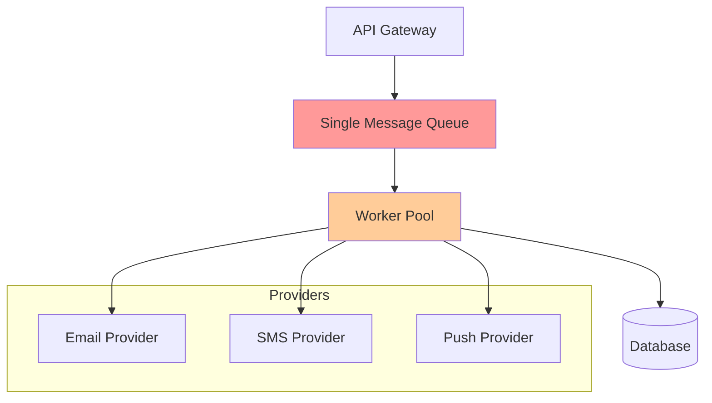

**Characteristics:**
- Single queue for all notifications
- Homogeneous worker pool
- Simple deployment
- Limited scalability

#### 2. Microservices Channel Architecture
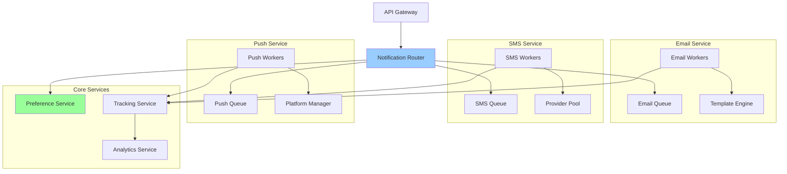

**Characteristics:**
- Channel isolation
- Independent scaling
- Service ownership
- Complex orchestration

#### 3. Event-Driven Streaming Architecture
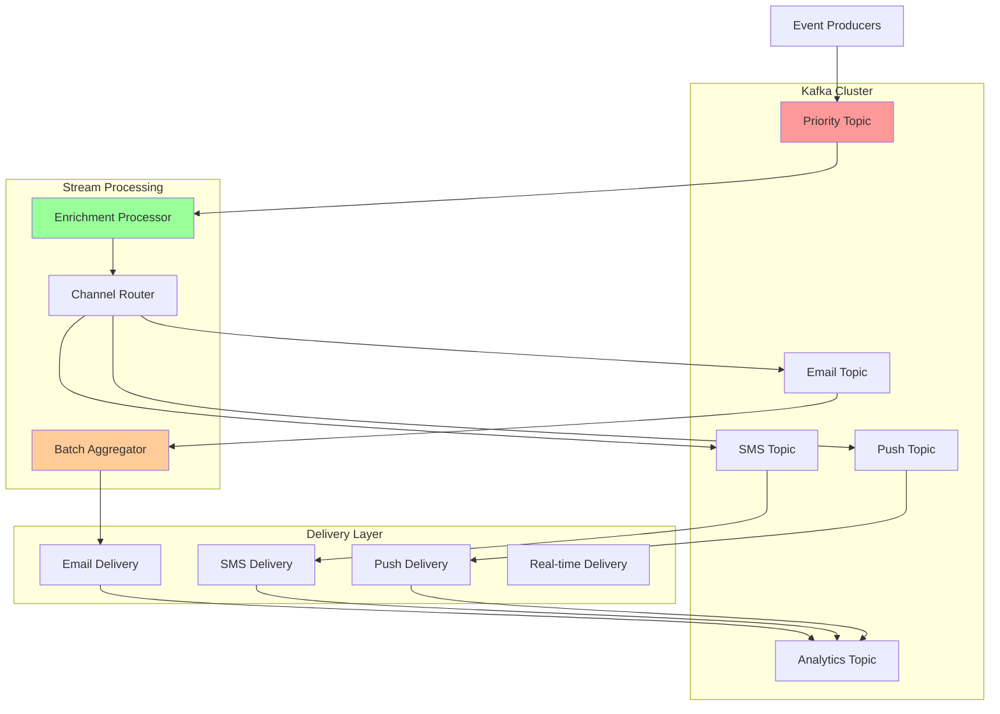

**Characteristics:**
- Event sourcing
- Stream processing
- Horizontal scalability
- Complex debugging

#### 4. Serverless Fan-out Architecture
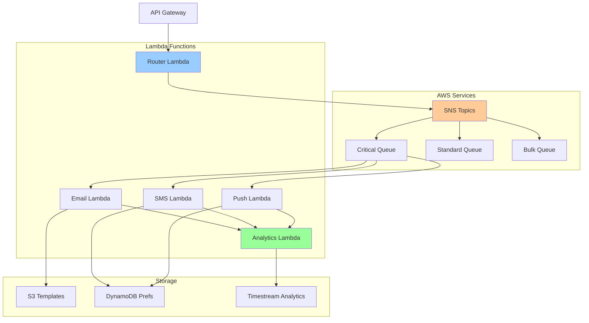

**Characteristics:**
- Pay-per-use
- Auto-scaling
- Managed services
- Vendor lock-in

#### 5. Edge-First Global Architecture
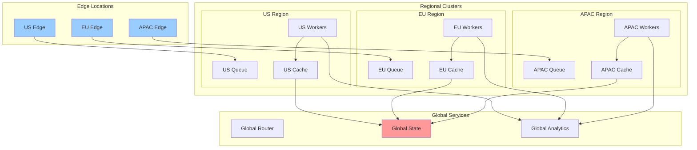

**Characteristics:**
- Geographic distribution
- Low latency globally
- Data sovereignty
- Complex consistency

### 📈 Trade-off Analysis

| Architecture | Latency | Throughput | Reliability | Complexity | Cost | Flexibility |
|--------------|---------|------------|-------------|------------|------|-------------|
| **Monolithic Queue** | Medium (5-10s) | Limited (100K/s) | Single point of failure | Low | Low ($5K/mo) | Poor |
| **Microservices** | Low (1-5s) | High (500K/s) | Channel isolation | High | Medium ($20K/mo) | Excellent |
| **Event Streaming** | Very Low (<1s) | Very High (1M/s) | Event replay capability | Very High | High ($30K/mo) | Good |
| **Serverless** | Variable (1-30s) | Auto-scaling | Managed reliability | Medium | Usage-based ($10-50K) | Good |
| **Edge-First** | Ultra Low (<500ms) | Region-limited | Regional failover | Very High | Very High ($50K/mo) | Excellent |

### 🎯 Architecture Selection Criteria

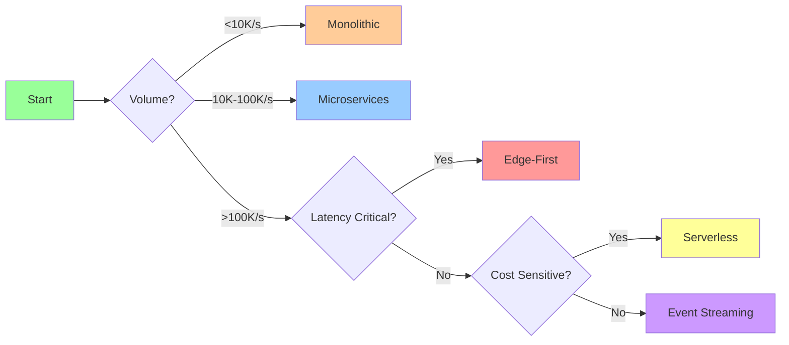

### 💰 Cost Comparison

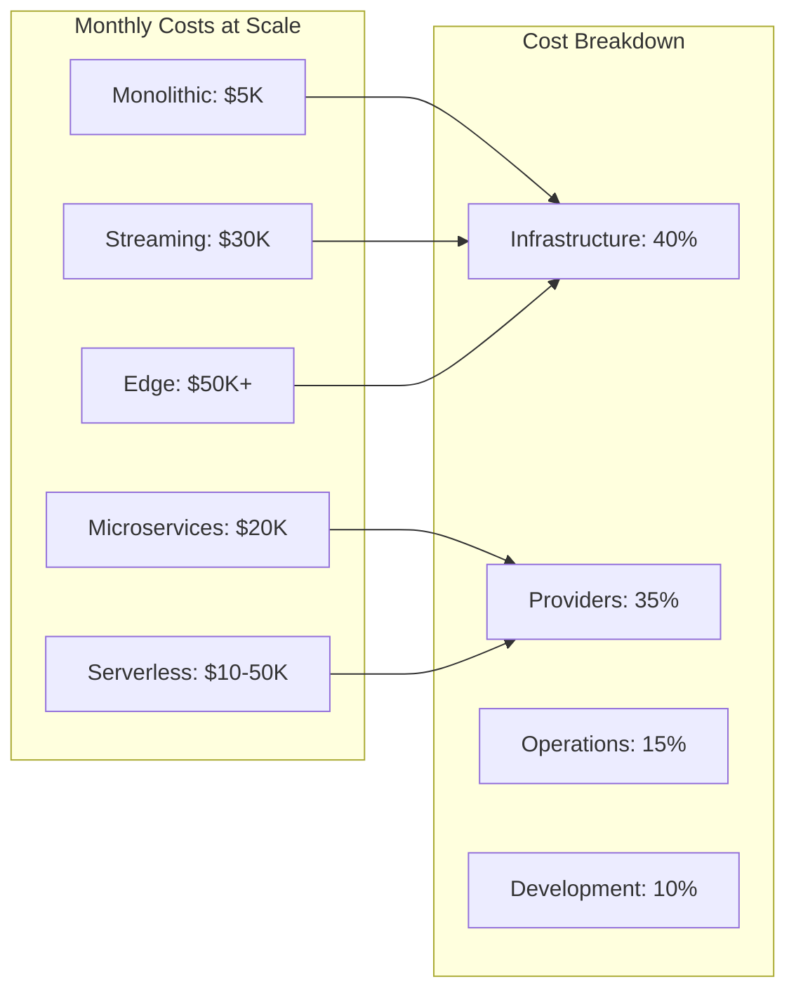

### 🔄 Migration Strategy

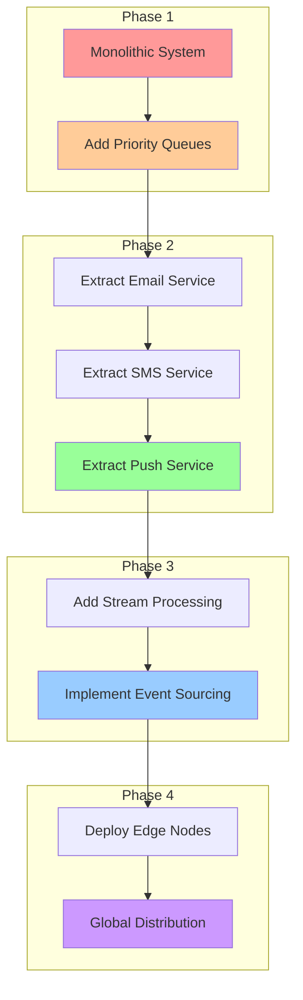

### 🏛️ Pillar Mapping

#### Work Distribution
- **Channel Routing**: Notifications distributed by channel type
- **Priority Queues**: Work prioritized by urgency
- **Batch Processing**: Group notifications for efficiency
- **Worker Pools**: Dedicated workers per channel

#### State Management
- **User Preferences**: Centralized preference store
- **Notification History**: Event log storage
- **Template Cache**: Compiled template storage
- **Delivery Status**: Real-time tracking

#### Truth & Consistency
- **Preference Authority**: User preferences as source of truth
- **Delivery Confirmation**: At-least-once guarantee
- **Deduplication**: Cross-channel duplicate prevention
- **Audit Trail**: Complete notification history

#### Control Mechanisms
- **Rate Limiting**: Per-channel and global limits
- **Circuit Breakers**: Provider failure handling
- **Orchestration**: Multi-channel coordination
- **Flow Control**: Backpressure management

#### Intelligence Layer
- **Smart Routing**: Cost and effectiveness based
- **Engagement Prediction**: ML-based optimization
- **Anomaly Detection**: Pattern recognition
- **A/B Testing**: Continuous improvement

### 🔧 Pattern Application

**Primary Patterns:**
- **Pub-Sub**: Event-driven architecture
- **Queue-Based**: Reliable delivery
- **Circuit Breaker**: Provider resilience
- **Bulkhead**: Channel isolation

**Supporting Patterns:**
- **Retry with Backoff**: Transient failure handling
- **Dead Letter Queue**: Failed message handling
- **Rate Limiting**: Resource protection
- **Caching**: Template and preference caching

## Part 2: Architecture & Trade-offs

### 🏗️ Core Architecture

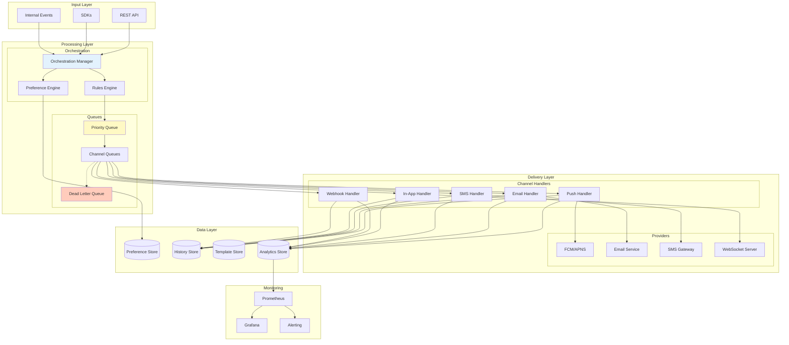

### ⚖️ Key Design Trade-offs

| Decision | Option A | Option B | Choice & Rationale |
|----------|----------|----------|-------------------|
| **Architecture** | Monolithic | Microservices | **Microservices** - Independent scaling per channel, fault isolation |
| **Message Queue** | Kafka | RabbitMQ/SQS | **Kafka** - High throughput, replay capability, multi-consumer |
| **Delivery Guarantee** | At-most-once | At-least-once | **At-least-once** - Better to duplicate than miss critical notifications |
| **Storage** | SQL | NoSQL | **Hybrid** - SQL for preferences/config, NoSQL for history/analytics |
| **Real-time** | Polling | WebSocket/SSE | **WebSocket** - True real-time for in-app, efficient connection reuse |

### 🔄 Alternative Architectures

#### Option 1: Simple Queue-Based
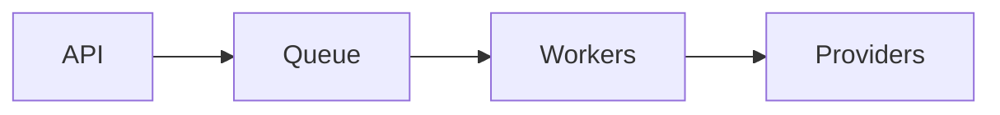

**Pros**: Simple, easy to operate
**Cons**: No prioritization, limited features
**When to use**: Small scale, basic requirements

#### Option 2: Lambda/Serverless
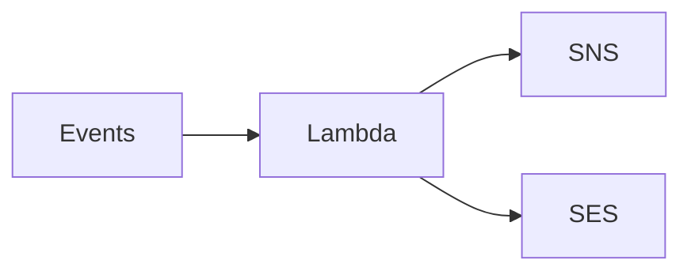

**Pros**: No servers, auto-scaling, pay-per-use
**Cons**: Cold starts, vendor lock-in
**When to use**: Variable load, cost-sensitive

#### Option 3: Event Streaming
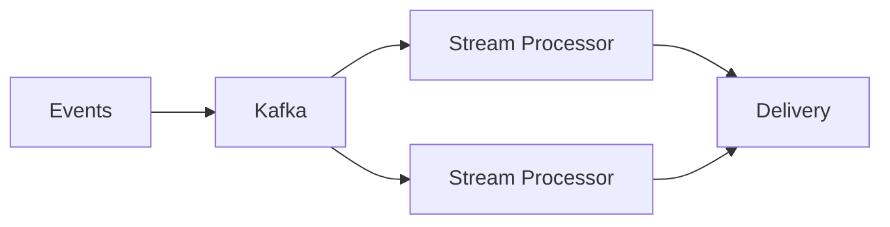

**Pros**: Real-time, replay capability, analytics friendly
**Cons**: Complex operations, higher latency
**When to use**: Event-driven architecture, analytics focus

#### Option 4: Service Mesh
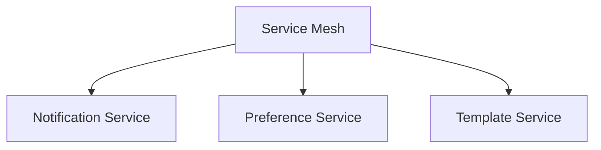

**Pros**: Advanced routing, observability, resilience
**Cons**: Operational complexity, overhead
**When to use**: Large microservices deployment

### 📊 Performance Characteristics

**Throughput:**
```text
Channel       Throughput    Latency    Provider Limits
Push          100K/sec      <5s        FCM: 10K/sec/app
Email         50K/sec       <30s       SES: 14/sec (sandbox)
SMS           1K/sec        <10s       Twilio: 100/sec
In-App        500K/sec      <100ms     WebSocket capacity
Webhook       10K/sec       <5s        Endpoint dependent
```

**Resource Requirements:**
```text
Component            CPU      Memory    Storage
Orchestrator         8 cores  16GB      -
Queue Workers        4 cores  8GB       -
Channel Handler      4 cores  8GB       -
Preference Service   2 cores  4GB       100GB
Analytics Service    8 cores  32GB      10TB
```

### 🎓 Key Lessons

1. **Channel Abstraction is Critical**: Users don't care about implementation. Abstract channel complexity behind clean APIs.

2. **Preferences are Complex**: Simple on/off isn't enough. Need time-based, frequency-based, and content-based preferences.

3. **Idempotency Saves the Day**: Network failures happen. Idempotent delivery prevents duplicate notifications.

4. **Analytics Drive Improvement**: Track everything. Delivery rates, engagement, and timing data inform optimization.

5. **Cost Optimization Matters**: At scale, small optimizations yield significant savings. Batch, compress, and route intelligently.

### 🔗 Related Concepts & Deep Dives

#### Prerequisite Axioms
- **[Axiom 3: Failure](../part1-axioms/axiom3-failure/)** - Foundation for reliable delivery
- **[Axiom 5: Coordination](../part1-axioms/axiom5-coordination/)** - Multi-channel orchestration
- **[Axiom 1: Latency](../part1-axioms/axiom1-latency/)** - Real-time delivery constraints
- **[Axiom 8: Economics](../part1-axioms/axiom8-economics/)** - Cost optimization strategies

#### Advanced Topics
- **[Event-Driven Architecture](../patterns/event-driven.md)** - Asynchronous notification processing
- **[Queue Systems](../patterns/queues-streaming.md)** - Message queue patterns
- **[Circuit Breakers](../patterns/circuit-breaker.md)** - Provider failure handling
- **[Rate Limiting](../patterns/rate-limiting.md)** - Preventing notification storms

#### Related Case Studies
- **[Real-time Messaging](./real-time-messaging.md)** - Similar delivery challenges
- **[Search Autocomplete](./search-autocomplete.md)** - Low-latency requirements
- **[Recommendation Engine](./recommendation-engine.md)** - Personalization techniques
- **[Workflow Engine](./workflow-engine.md)** - Complex orchestration patterns

#### Implementation Patterns
- **Template Management** - Version control for notification content
- **Preference Service** - User control and consent management
- **Delivery Tracking** - End-to-end observability
- **Provider Abstraction** - Multi-provider failover strategies

### 📚 References

**Industry Examples:**
- [Uber's Notification System](https://eng.uber.com/uber-notification-platform/)
- [Pinterest's Notification System](https://medium.com/pinterest-engineering/building-a-notification-system-86854982c38e)
- [LinkedIn's Air Traffic Controller](https://engineering.linkedin.com/blog/2019/05/air-traffic-controller--how-we-developed-a-notification-system-f)

**Open Source:**
- [Novu](https://github.com/novuhq/novu) - Open-source notification infrastructure
- [Courier](https://www.courier.com/) - Notification orchestration
- [OneSignal](https://onesignal.com/) - Push notification service

**Related Patterns:**
- [Message Queue](../patterns/queues-streaming.md)
- [Circuit Breaker](../patterns/circuit-breaker.md)
- [Event-Driven Architecture](../patterns/event-driven.md)
- [Rate Limiting](../patterns/rate-limiting.md)