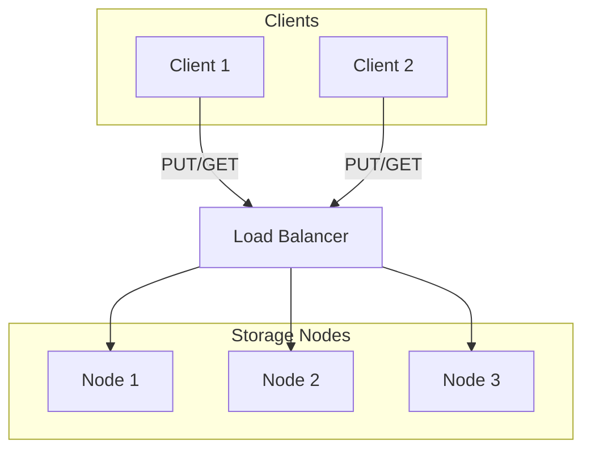
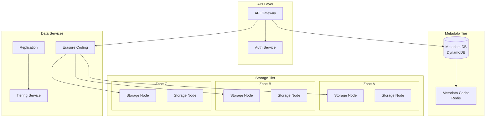
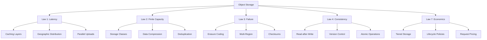
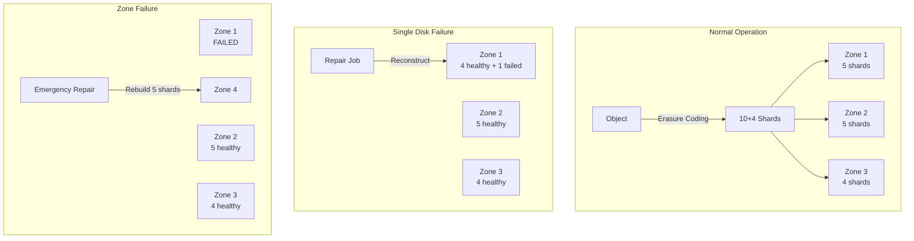

# Design an S3-like Object Storage System

!!! info "Case Study Overview"
    **System**: Amazon S3 / Object Storage Service  
    **Scale**: 100+ trillion objects, exabytes of data, millions of requests/second  
    **Challenges**: 99.999999999% durability, global scale, cost efficiency  
    **Key Patterns**: Erasure coding, consistent hashing, multi-tier storage

*Estimated reading time: 25 minutes*

## Introduction

Object storage systems like Amazon S3 have become the foundation of cloud computing, storing everything from backups to data lakes. This case study explores building a system that can store trillions of objects with eleven nines of durability while maintaining high availability and cost efficiency.

## Challenge Statement

Design an object storage system that can:
- Store 100+ trillion objects ranging from 0 bytes to 5TB
- Achieve 99.999999999% (11 nines) durability
- Provide 99.99% availability SLA
- Handle millions of requests per second
- Support strong consistency for overwrites
- Scale to exabytes of total storage
- Optimize costs with storage classes
- Enable global access with low latency

## Architecture Evolution

### Phase 1: Simple Distributed Storage (MVP)


**Limitations**:
- No durability guarantees
- Manual scaling
- Single region only

### Phase 2: Modern Architecture (Current)


## Concept Map



## Key Design Decisions

### 1. Data Durability Strategy

**Erasure Coding (Reed-Solomon)**:
```python
class ErasureCoding:
    def __init__(self, data_shards=10, parity_shards=4):
        self.k = data_shards    # Data shards
        self.m = parity_shards  # Parity shards
        self.n = k + m          # Total shards
        
    def encode(self, data):
        # Split data into k chunks
        chunk_size = len(data) // self.k
        data_chunks = [data[i:i+chunk_size] for i in range(0, len(data), chunk_size)]
        
        # Generate m parity chunks
        parity_chunks = self.reed_solomon_encode(data_chunks)
        
        # Return all n chunks
        return data_chunks + parity_chunks
    
    def decode(self, available_chunks, chunk_indices):
        if len(available_chunks) < self.k:
            raise Exception("Not enough chunks to reconstruct data")
        
        # Reconstruct using any k chunks
        return self.reed_solomon_decode(available_chunks[:self.k])

# Example: 10+4 erasure coding
# Can lose any 4 chunks and still recover data
# Storage overhead: 40% (vs 200% for 3x replication)
# Durability: 99.99999999% with proper placement
```

**Durability Calculation**:
```python
def calculate_durability(disk_afr=0.02, chunks=14, required=10, zones=3):
    """
    AFR = Annual Failure Rate
    Probability of losing data = P(losing > 4 chunks in same year)
    """
    # Probability of exactly k failures
    from scipy.stats import binom
    
    p_failure = disk_afr
    n_disks = chunks
    
    # Probability of losing more than (chunks - required) disks
    p_data_loss = 0
    for k in range(chunks - required + 1, chunks + 1):
        p_data_loss += binom.pmf(k, n_disks, p_failure)
    
    # Account for zone failures (correlated failures)
    zone_failure_rate = 0.001  # 0.1% per year
    p_zone_failure = 1 - (1 - zone_failure_rate) ** zones
    
    total_durability = 1 - (p_data_loss + p_zone_failure)
    return total_durability

# Result: 99.999999999% durability
```

### 2. Metadata Management

**Distributed Metadata Store**:
```sql
-- Object metadata schema
CREATE TABLE objects (
    bucket_name VARCHAR(63),
    object_key VARCHAR(1024),
    version_id UUID,
    size BIGINT,
    etag VARCHAR(32),
    content_type VARCHAR(255),
    storage_class VARCHAR(20),
    encryption_type VARCHAR(20),
    created_at TIMESTAMP,
    modified_at TIMESTAMP,
    delete_marker BOOLEAN,
    chunks JSON,  -- Array of chunk locations
    metadata JSON,  -- User-defined metadata
    PRIMARY KEY (bucket_name, object_key, version_id)
);

-- Chunk location tracking
CREATE TABLE chunks (
    chunk_id UUID PRIMARY KEY,
    object_version_id UUID,
    shard_index INT,
    storage_node_id VARCHAR(50),
    zone VARCHAR(20),
    size BIGINT,
    checksum VARCHAR(64),
    status VARCHAR(20),  -- healthy, degraded, lost
    created_at TIMESTAMP
);

-- Efficient listing with pagination
CREATE INDEX idx_bucket_prefix ON objects (
    bucket_name, 
    object_key, 
    modified_at DESC
);
```

### 3. Consistency Model

**Read-After-Write Consistency**:
```java
public class ConsistentObjectStore {
    private final MetadataStore metadata;
    private final StorageCluster storage;
    private final DistributedLock lockService;
    
    public PutObjectResult putObject(PutObjectRequest request) {
        String lockKey = getLockKey(request.getBucket(), request.getKey());
        
        try (DistributedLock lock = lockService.acquire(lockKey, 30, TimeUnit.SECONDS)) {
            // 1. Check for conflicts
            ObjectMetadata existing = metadata.get(request.getBucket(), request.getKey());
            if (existing != null && request.getIfNoneMatch() != null) {
                throw new PreconditionFailedException();
            }
            
            // 2. Store data chunks first
            List<ChunkLocation> chunks = storage.store(
                request.getData(),
                request.getStorageClass()
            );
            
            // 3. Update metadata atomically
            ObjectMetadata newMetadata = ObjectMetadata.builder()
                .bucket(request.getBucket())
                .key(request.getKey())
                .versionId(generateVersionId())
                .size(request.getSize())
                .etag(calculateETag(request.getData()))
                .chunks(chunks)
                .build();
            
            metadata.put(newMetadata);
            
            // 4. Invalidate caches
            cache.invalidate(request.getBucket(), request.getKey());
            
            return new PutObjectResult(newMetadata);
        }
    }
}
```

### 4. Storage Classes and Tiering

**Multi-Temperature Storage**:
```python
class StorageClassManager:
    STORAGE_CLASSES = {
        'STANDARD': {
            'durability': 0.999999999999,  # 12 nines
            'availability': 0.9999,         # 4 nines
            'min_storage_days': 0,
            'retrieval_fee': 0,
            'storage_cost_gb_month': 0.023
        },
        'STANDARD_IA': {  # Infrequent Access
            'durability': 0.999999999999,
            'availability': 0.999,
            'min_storage_days': 30,
            'retrieval_fee': 0.01,  # per GB
            'storage_cost_gb_month': 0.0125
        },
        'GLACIER': {
            'durability': 0.999999999999,
            'availability': 0.99,
            'min_storage_days': 90,
            'retrieval_fee': 0.05,
            'retrieval_time_hours': 12,
            'storage_cost_gb_month': 0.004
        },
        'DEEP_ARCHIVE': {
            'durability': 0.999999999999,
            'availability': 0.99,
            'min_storage_days': 180,
            'retrieval_fee': 0.02,
            'retrieval_time_hours': 48,
            'storage_cost_gb_month': 0.00099
        }
    }
    
    def transition_object(self, obj, new_class):
        current_class = obj.storage_class
        
        # Check minimum storage duration
        days_stored = (datetime.now() - obj.created_at).days
        min_days = self.STORAGE_CLASSES[current_class]['min_storage_days']
        
        if days_stored < min_days:
            raise EarlyTransitionException(
                f"Object must be stored for {min_days} days in {current_class}"
            )
        
        # Move data to appropriate storage
        if new_class in ['GLACIER', 'DEEP_ARCHIVE']:
            self._archive_to_tape(obj)
        elif current_class in ['GLACIER', 'DEEP_ARCHIVE']:
            self._restore_from_tape(obj)
        else:
            self._move_storage_tier(obj, new_class)
        
        # Update metadata
        obj.storage_class = new_class
        obj.transition_date = datetime.now()
```

## Technical Deep Dives

### Multipart Upload

**Handling Large Objects**:
```python
class MultipartUploadManager:
    def __init__(self):
        self.part_size = 100 * 1024 * 1024  # 100MB parts
        self.max_parts = 10000
        
    def initiate_multipart_upload(self, bucket, key):
        upload_id = str(uuid.uuid4())
        
        # Create upload tracking record
        self.metadata.create_multipart_upload({
            'upload_id': upload_id,
            'bucket': bucket,
            'key': key,
            'initiated': datetime.now(),
            'parts': {},
            'status': 'IN_PROGRESS'
        })
        
        return upload_id
    
    def upload_part(self, upload_id, part_number, data):
        if part_number < 1 or part_number > self.max_parts:
            raise InvalidPartNumber()
        
        # Store part with erasure coding
        chunks = self.erasure_coder.encode(data)
        locations = self.storage.store_chunks(chunks)
        
        # Calculate part ETag
        etag = hashlib.md5(data).hexdigest()
        
        # Update upload metadata
        self.metadata.add_part(upload_id, {
            'part_number': part_number,
            'etag': etag,
            'size': len(data),
            'chunks': locations
        })
        
        return etag
    
    def complete_multipart_upload(self, upload_id, parts):
        upload = self.metadata.get_upload(upload_id)
        
        # Verify all parts exist
        for part in parts:
            if part['part_number'] not in upload['parts']:
                raise InvalidPart(part['part_number'])
            
            stored_etag = upload['parts'][part['part_number']]['etag']
            if stored_etag != part['etag']:
                raise ETagMismatch(part['part_number'])
        
        # Combine parts into single object
        final_object = self._combine_parts(upload, parts)
        
        # Clean up multipart metadata
        self.metadata.complete_upload(upload_id)
        
        return final_object
```

### Cross-Region Replication

```python
class CrossRegionReplicator:
    def __init__(self, source_region, target_regions):
        self.source = source_region
        self.targets = target_regions
        self.replication_queue = Queue()
        
    def handle_put_event(self, event):
        # Check replication rules
        if not self._should_replicate(event.bucket, event.key):
            return
        
        # Queue for async replication
        self.replication_queue.put({
            'event_type': 'PUT',
            'bucket': event.bucket,
            'key': event.key,
            'version_id': event.version_id,
            'timestamp': event.timestamp
        })
    
    def replication_worker(self):
        while True:
            task = self.replication_queue.get()
            
            try:
                # Fetch object from source
                obj = self.source.get_object(
                    task['bucket'], 
                    task['key'],
                    task['version_id']
                )
                
                # Replicate to all target regions
                futures = []
                for region in self.targets:
                    future = self.executor.submit(
                        self._replicate_to_region,
                        region, obj, task
                    )
                    futures.append(future)
                
                # Wait for all replications
                results = [f.result() for f in futures]
                
                # Update replication status
                self._update_replication_status(task, results)
                
            except Exception as e:
                self._handle_replication_failure(task, e)
    
    def _replicate_to_region(self, region, obj, task):
        # Use multipart upload for large objects
        if obj.size > 100 * 1024 * 1024:  # 100MB
            return self._multipart_replicate(region, obj)
        
        # Direct copy for small objects
        return region.put_object(
            bucket=task['bucket'],
            key=task['key'],
            data=obj.data,
            metadata=obj.metadata,
            storage_class=self._get_target_storage_class(obj)
        )
```

### Performance Optimization

**Intelligent Request Routing**:
```java
public class S3RequestRouter {
    private final ConsistentHashRing<StorageNode> ring;
    private final HealthChecker healthChecker;
    private final LoadBalancer loadBalancer;
    
    public StorageNode routeRequest(Request request) {
        String key = request.getBucket() + "/" + request.getKey();
        
        // Get primary nodes using consistent hashing
        List<StorageNode> candidates = ring.getNodes(key, 3);
        
        // Filter healthy nodes
        List<StorageNode> healthyNodes = candidates.stream()
            .filter(node -> healthChecker.isHealthy(node))
            .collect(Collectors.toList());
        
        if (healthyNodes.isEmpty()) {
            throw new NoHealthyNodesException();
        }
        
        // Route based on operation type
        if (request.getOperation() == Operation.GET) {
            // Route reads to least loaded node
            return loadBalancer.selectLeastLoaded(healthyNodes);
        } else {
            // Route writes to primary node
            return healthyNodes.get(0);
        }
    }
    
    public List<StorageNode> routeMultipartUpload(String bucket, String key) {
        // Distribute parts across different nodes for parallelism
        List<StorageNode> allNodes = ring.getAllHealthyNodes();
        
        // Shuffle for load distribution
        Collections.shuffle(allNodes);
        
        // Return subset for parallel uploads
        return allNodes.subList(0, Math.min(10, allNodes.size()));
    }
}
```

**Caching Strategy**:
```python
class S3CacheManager:
    def __init__(self):
        self.metadata_cache = LRUCache(capacity=1_000_000)  # 1M objects
        self.data_cache = LRUCache(capacity=100_000)       # 100K hot objects
        self.negative_cache = TTLCache(ttl=300)            # 5 min TTL
        
    def get_object(self, bucket, key):
        cache_key = f"{bucket}:{key}"
        
        # Check negative cache first
        if cache_key in self.negative_cache:
            raise NoSuchKey()
        
        # Check metadata cache
        metadata = self.metadata_cache.get(cache_key)
        if not metadata:
            metadata = self._fetch_metadata(bucket, key)
            if not metadata:
                self.negative_cache.set(cache_key, True)
                raise NoSuchKey()
            self.metadata_cache.set(cache_key, metadata)
        
        # Check data cache for small objects
        if metadata.size < 1_024_000:  # 1MB
            data = self.data_cache.get(cache_key)
            if not data:
                data = self._fetch_data(metadata)
                self.data_cache.set(cache_key, data)
            return ObjectResponse(metadata, data)
        
        # Stream large objects directly
        return ObjectResponse(metadata, self._create_stream(metadata))
```

## Failure Handling

### Durability in Practice



**Automated Repair Process**:
```python
class DurabilityManager:
    def __init__(self):
        self.repair_queue = PriorityQueue()
        self.repair_workers = 100
        
    def monitor_health(self):
        while True:
            # Check all chunks periodically
            for chunk in self.scan_chunks():
                if chunk.status != 'healthy':
                    priority = self.calculate_repair_priority(chunk)
                    self.repair_queue.put((priority, chunk))
            
            time.sleep(3600)  # Hourly scan
    
    def calculate_repair_priority(self, chunk):
        # Higher priority for objects with fewer healthy shards
        object_chunks = self.get_object_chunks(chunk.object_id)
        healthy_count = sum(1 for c in object_chunks if c.status == 'healthy')
        
        # Critical: Less than k healthy chunks
        if healthy_count < 10:
            return 0  # Highest priority
        
        # High: Exactly k healthy chunks
        elif healthy_count == 10:
            return 1
        
        # Medium: k+1 or k+2 healthy chunks
        elif healthy_count <= 12:
            return 2
        
        # Low: k+3 healthy chunks
        else:
            return 3
    
    def repair_worker(self):
        while True:
            priority, chunk = self.repair_queue.get()
            
            try:
                # Get all chunks for the object
                all_chunks = self.get_object_chunks(chunk.object_id)
                healthy_chunks = [c for c in all_chunks if c.status == 'healthy']
                
                if len(healthy_chunks) >= 10:
                    # Reconstruct missing shard
                    reconstructed = self.erasure_decoder.reconstruct(
                        healthy_chunks,
                        chunk.shard_index
                    )
                    
                    # Store in new location
                    new_location = self.select_repair_location(chunk)
                    self.storage.write(new_location, reconstructed)
                    
                    # Update metadata
                    chunk.status = 'healthy'
                    chunk.location = new_location
                    self.metadata.update_chunk(chunk)
                    
                else:
                    # Object is lost - trigger recovery from backup
                    self.trigger_disaster_recovery(chunk.object_id)
                    
            except Exception as e:
                self.log_repair_failure(chunk, e)
```

## Cost Optimization

### Lifecycle Management

```yaml
# Example lifecycle policy
lifecycle_rules:
  - id: archive-old-logs
    prefix: logs/
    status: enabled
    transitions:
      - days: 30
        storage_class: STANDARD_IA
      - days: 90
        storage_class: GLACIER
      - days: 365
        storage_class: DEEP_ARCHIVE
    expiration:
      days: 2555  # 7 years
      
  - id: clean-temp-files
    prefix: temp/
    status: enabled
    expiration:
      days: 1
      
  - id: expire-old-versions
    status: enabled
    noncurrent_version_expiration:
      days: 90
```

### Storage Optimization

```python
class StorageOptimizer:
    def analyze_access_patterns(self, bucket):
        # Analyze last 90 days of access logs
        access_stats = self.query_access_logs(bucket, days=90)
        
        recommendations = []
        for prefix, stats in access_stats.items():
            if stats['access_count'] == 0:
                recommendations.append({
                    'prefix': prefix,
                    'action': 'transition_to_glacier',
                    'savings': self.calculate_savings(stats['size'], 'GLACIER')
                })
            elif stats['access_frequency'] < 1:  # Less than once per month
                recommendations.append({
                    'prefix': prefix,
                    'action': 'transition_to_standard_ia',
                    'savings': self.calculate_savings(stats['size'], 'STANDARD_IA')
                })
        
        return recommendations
    
    def implement_intelligent_tiering(self):
        # Automatic transition based on access patterns
        policy = {
            'name': 'intelligent-tiering',
            'rules': [
                {
                    'no_access_days': 30,
                    'transition_to': 'STANDARD_IA'
                },
                {
                    'no_access_days': 90,
                    'transition_to': 'GLACIER'
                },
                {
                    'no_access_days': 180,
                    'transition_to': 'DEEP_ARCHIVE'
                }
            ]
        }
        return policy
```

## Monitoring and Operations

### Key Metrics

```python
METRICS = {
    'availability': {
        'query': 'sum(successful_requests) / sum(total_requests)',
        'target': 0.9999,  # 99.99%
        'window': '5m'
    },
    'durability': {
        'query': 'count(objects_lost_in_period)',
        'target': 0,
        'window': '1d'
    },
    'latency_p99': {
        'query': 'histogram_quantile(0.99, request_duration_seconds)',
        'target': 0.1,  # 100ms
        'window': '5m'
    },
    'repair_backlog': {
        'query': 'sum(chunks_needing_repair)',
        'target': 1000,
        'window': '1m'
    },
    'storage_efficiency': {
        'query': 'sum(logical_bytes) / sum(physical_bytes)',
        'target': 0.7,  # Including erasure coding overhead
        'window': '1h'
    }
}
```

### Operational Runbooks

**Adding Storage Capacity**:
```bash
#!/bin/bash
# Add new storage node to cluster

# 1. Provision new hardware
NODE_ID="storage-node-${REGION}-${ZONE}-${TIMESTAMP}"

# 2. Install storage software
ansible-playbook -i inventory install-storage.yml --limit $NODE_ID

# 3. Initialize storage
s3-admin node init \
  --node-id $NODE_ID \
  --zone $ZONE \
  --capacity 100TB \
  --storage-class STANDARD

# 4. Join cluster
s3-admin cluster join \
  --node $NODE_ID \
  --cluster $CLUSTER_ID \
  --weight 1.0

# 5. Rebalance data
s3-admin rebalance start \
  --cluster $CLUSTER_ID \
  --max-bandwidth 1Gbps \
  --background

# 6. Monitor progress
watch -n 60 's3-admin rebalance status --cluster $CLUSTER_ID'
```

## Lessons Learned

### 1. Erasure Coding > Replication
- 40% storage overhead vs 200% for 3x replication
- Better durability with proper shard placement
- More complex but worth it at scale

### 2. Metadata is Critical
- Metadata service is often the bottleneck
- Cache aggressively but maintain consistency
- Consider sharding metadata by bucket/prefix

### 3. Network Topology Matters
- Place erasure coding shards across failure domains
- Consider cross-zone bandwidth costs
- Optimize for common access patterns

### 4. Lifecycle Policies Save Money
- Most data is accessed rarely after 30 days
- Automated tiering reduces costs by 70%+
- Make it easy for users to set policies

### 5. Monitor Everything
- Durability requires proactive monitoring
- Detect and repair failures quickly
- Track per-customer metrics for fairness

## Trade-offs and Decisions

| Decision | Trade-off | Why This Choice |
|----------|-----------|-----------------|
| Erasure coding 10+4 | Complexity vs efficiency | 40% overhead with high durability |
| Strong consistency | Performance vs correctness | Users expect read-after-write |
| 5TB object limit | Simplicity vs flexibility | Covers 99.99% of use cases |
| Zone-redundant by default | Cost vs durability | Most users want high durability |
| Synchronous metadata updates | Latency vs consistency | Consistency critical for S3 API |

## References

- [Amazon S3: Building a Storage Service](https://www.allthingsdistributed.com/2023/07/building-and-operating-a-pretty-big-storage-system.html)
- [Facebook's f4: Warm BLOB Storage](https://www.usenix.org/system/files/conference/osdi14/osdi14-paper-muralidhar.pdf)
- [Windows Azure Storage: A Highly Available Cloud Storage Service](https://www.microsoft.com/en-us/research/publication/windows-azure-storage-a-highly-available-cloud-storage-service-with-strong-consistency/)
- [Backblaze Hard Drive Stats](https://www.backblaze.com/blog/backblaze-drive-stats-for-2023/)