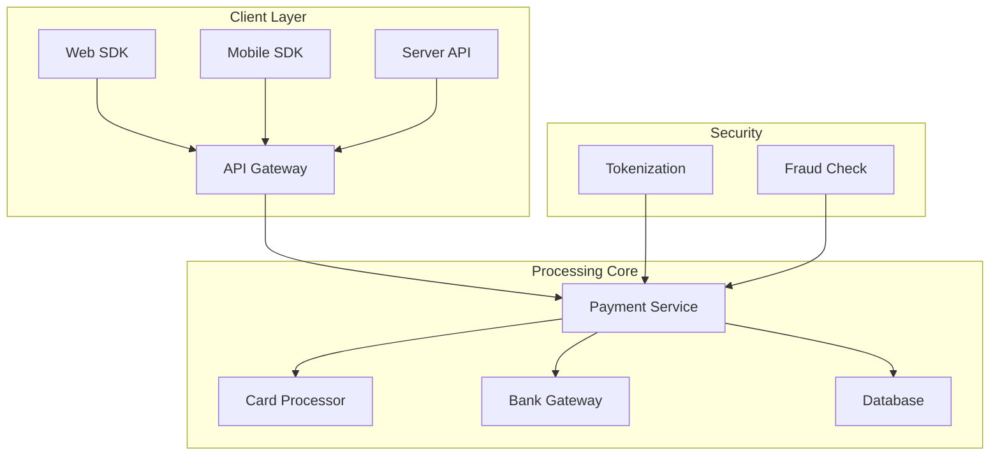
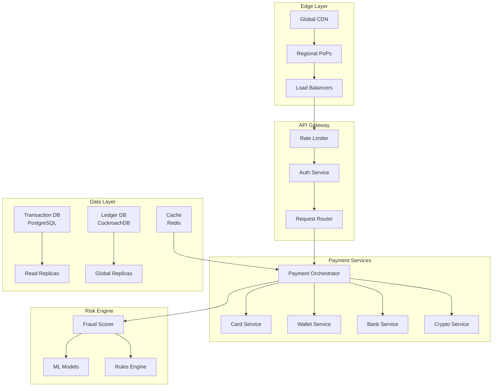
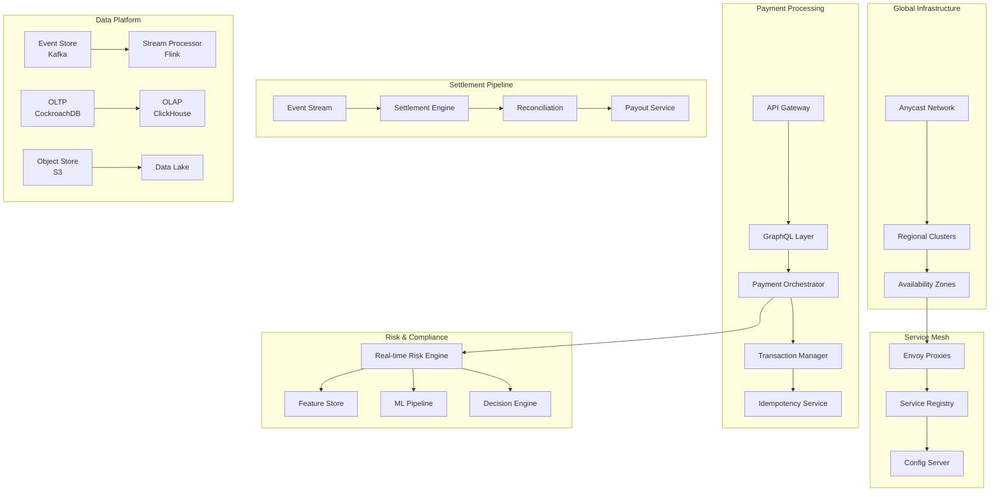
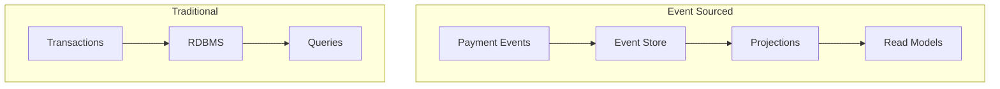

# Payment System - System Design Case Study

## 1. Problem Statement

Design a global payment processing system like Stripe, PayPal, or Square that can:
- Process millions of transactions per day with 99.99% success rate
- Handle multiple payment methods (cards, wallets, bank transfers)
- Ensure PCI compliance and data security
- Provide real-time fraud detection
- Support global currencies and regulations
- Maintain exactly-once payment semantics

### Real-World Context
- **Stripe**: Processes billions in payments for millions of businesses
- **PayPal**: 400M+ active accounts, $1.25 trillion payment volume
- **Square**: Powers payments for 4M+ sellers globally
- **Adyen**: Processes payments for enterprises like Uber, Spotify

## 2. Requirements Analysis

### Functional Requirements
1. **Payment Processing**
   - Credit/debit card payments
   - Digital wallets (Apple Pay, Google Pay)
   - Bank transfers (ACH, SEPA, wire)
   - Buy now, pay later options
   - Cryptocurrency payments

2. **Transaction Management**
   - Authorization and capture
   - Refunds and reversals
   - Recurring payments/subscriptions
   - Split payments and payouts
   - Multi-party payments

3. **Security & Compliance**
   - PCI DSS Level 1 compliance
   - 3D Secure authentication
   - Tokenization of sensitive data
   - End-to-end encryption
   - AML/KYC compliance

4. **Fraud Prevention**
   - Real-time risk scoring
   - Machine learning fraud detection
   - Velocity checks
   - Blacklist management
   - Manual review queues

5. **Merchant Services**
   - Onboarding and KYC
   - Dashboard and analytics
   - Webhook notifications
   - Settlement and payouts
   - Dispute management

### Non-Functional Requirements
- **Scale**: 100K+ transactions per second peak
- **Latency**: <200ms authorization response
- **Availability**: 99.99% uptime (52 minutes/year)
- **Consistency**: Zero payment loss or duplication
- **Security**: PCI DSS, SOC 2, ISO 27001 compliant
- **Global**: Multi-region, multi-currency support

### Axiom Mapping
- **Axiom 1 (Latency)**: Sub-200ms payment authorization
- **Axiom 2 (Capacity)**: Bounded queue sizes prevent overload
- **Axiom 3 (Failure)**: Graceful degradation on component failure
- **Axiom 4 (Concurrency)**: Distributed locking for payment idempotency
- **Axiom 5 (Coordination)**: Saga pattern for distributed transactions
- **Axiom 6 (Observability)**: Complete audit trail for every cent
- **Axiom 7 (Interface)**: Simple, secure merchant APIs
- **Axiom 8 (Economics)**: Optimize for transaction cost efficiency

## 3. Architecture Evolution

### Stage 1: Basic Payment Gateway (1K TPS)


### Stage 2: Distributed Payment Platform (10K TPS)


### Stage 3: Global Scale Architecture (100K+ TPS)


## 4. Detailed Component Design

### 4.1 Payment Orchestrator
```python
import asyncio
from typing import Dict, Optional, List
from dataclasses import dataclass
from enum import Enum
import uuid
from datetime import datetime

class PaymentStatus(Enum):
    PENDING = "pending"
    PROCESSING = "processing"
    AUTHORIZED = "authorized"
    CAPTURED = "captured"
    FAILED = "failed"
    REFUNDED = "refunded"

@dataclass
class PaymentRequest:
    merchant_id: str
    amount: int  # In cents
    currency: str
    payment_method: Dict
    metadata: Dict
    idempotency_key: str

class PaymentOrchestrator:
    """Orchestrates payment flow across multiple providers"""
    
    def __init__(self, providers: Dict[str, PaymentProvider], 
                 risk_engine: RiskEngine,
                 ledger: LedgerService):
        self.providers = providers
        self.risk_engine = risk_engine
        self.ledger = ledger
        self.idempotency_cache = IdempotencyCache()
        
    async def process_payment(self, request: PaymentRequest) -> PaymentResult:
        """Process payment with idempotency and orchestration"""
        
        # Check idempotency
        cached_result = await self.idempotency_cache.get(request.idempotency_key)
        if cached_result:
            return cached_result
            
        # Create transaction record
        transaction = await self._create_transaction(request)
        
        try:
            # Risk assessment
            risk_score = await self.risk_engine.assess(request)
            if risk_score.action == RiskAction.BLOCK:
                return await self._fail_transaction(
                    transaction, 
                    "Risk: " + risk_score.reason
                )
            
            # Route to appropriate provider
            provider = self._select_provider(request.payment_method)
            
            # 3DS check if required
            if self._requires_3ds(request, risk_score):
                auth_result = await self._perform_3ds(request, provider)
                if not auth_result.success:
                    return await self._fail_transaction(
                        transaction,
                        "3DS authentication failed"
                    )
            
            # Process payment
            result = await self._process_with_retry(
                provider, 
                request, 
                transaction
            )
            
            # Update ledger
            await self._update_ledger(transaction, result)
            
            # Cache result
            await self.idempotency_cache.set(
                request.idempotency_key, 
                result,
                ttl=86400  # 24 hours
            )
            
            return result
            
        except Exception as e:
            logger.error(f"Payment processing error: {e}")
            return await self._fail_transaction(transaction, str(e))
    
    async def _process_with_retry(self, provider: PaymentProvider, 
                                  request: PaymentRequest,
                                  transaction: Transaction) -> PaymentResult:
        """Process payment with retry logic"""
        max_retries = 3
        retry_delay = 1
        
        for attempt in range(max_retries):
            try:
                # Update transaction state
                await self._update_transaction_state(
                    transaction, 
                    PaymentStatus.PROCESSING
                )
                
                # Attempt authorization
                auth_result = await provider.authorize(request)
                
                if auth_result.success:
                    # Update state
                    await self._update_transaction_state(
                        transaction,
                        PaymentStatus.AUTHORIZED
                    )
                    
                    # Auto-capture if configured
                    if request.auto_capture:
                        capture_result = await provider.capture(
                            auth_result.authorization_id,
                            request.amount
                        )
                        
                        if capture_result.success:
                            await self._update_transaction_state(
                                transaction,
                                PaymentStatus.CAPTURED
                            )
                    
                    return PaymentResult(
                        success=True,
                        transaction_id=transaction.id,
                        authorization_id=auth_result.authorization_id,
                        status=transaction.status
                    )
                else:
                    # Determine if retry is appropriate
                    if not self._should_retry(auth_result.error_code):
                        return PaymentResult(
                            success=False,
                            transaction_id=transaction.id,
                            error=auth_result.error_message
                        )
                        
            except NetworkError as e:
                if attempt == max_retries - 1:
                    raise
                await asyncio.sleep(retry_delay * (2 ** attempt))
                
        raise MaxRetriesExceeded()
    
    def _select_provider(self, payment_method: Dict) -> PaymentProvider:
        """Select payment provider based on method and routing rules"""
        method_type = payment_method.get("type")
        
        # Card routing logic
        if method_type == "card":
            card_brand = self._detect_card_brand(payment_method["number"])
            
            # Route based on card brand and region
            if card_brand == "visa":
                return self.providers["stripe"]
            elif card_brand == "mastercard":
                return self.providers["adyen"]
            else:
                return self.providers["default"]
                
        # Digital wallet routing
        elif method_type == "wallet":
            wallet_type = payment_method.get("wallet_type")
            return self.providers.get(wallet_type, self.providers["default"])
            
        # Bank transfer routing
        elif method_type == "bank_transfer":
            country = payment_method.get("country")
            if country == "US":
                return self.providers["plaid"]
            elif country in ["DE", "FR", "NL"]:
                return self.providers["mollie"]
            else:
                return self.providers["wise"]
                
        return self.providers["default"]
```

### 4.2 Distributed Ledger System
```python
from decimal import Decimal
import asyncpg
from typing import List, Optional
import hashlib

class LedgerService:
    """Double-entry bookkeeping ledger for payment tracking"""
    
    def __init__(self, db_pool: asyncpg.Pool):
        self.db_pool = db_pool
        self.sharding_strategy = HashSharding(num_shards=16)
        
    async def record_transaction(self, entries: List[LedgerEntry]) -> str:
        """Record atomic ledger transaction"""
        
        # Validate double-entry balance
        if not self._validate_double_entry(entries):
            raise ValueError("Entries do not balance")
        
        transaction_id = str(uuid.uuid4())
        
        # Determine shard based on merchant
        shard_id = self.sharding_strategy.get_shard(entries[0].account_id)
        
        async with self.db_pool.acquire() as conn:
            async with conn.transaction():
                # Insert journal entry
                journal_id = await conn.fetchval("""
                    INSERT INTO journals (
                        transaction_id, 
                        created_at, 
                        description,
                        shard_id
                    )
                    VALUES ($1, $2, $3, $4)
                    RETURNING id
                """, transaction_id, datetime.utcnow(), 
                    entries[0].description, shard_id)
                
                # Insert ledger entries
                for entry in entries:
                    await conn.execute("""
                        INSERT INTO ledger_entries (
                            journal_id,
                            account_id,
                            debit,
                            credit,
                            currency,
                            exchange_rate,
                            metadata
                        )
                        VALUES ($1, $2, $3, $4, $5, $6, $7)
                    """, journal_id, entry.account_id,
                        entry.debit, entry.credit,
                        entry.currency, entry.exchange_rate,
                        json.dumps(entry.metadata))
                
                # Update account balances
                for entry in entries:
                    await self._update_account_balance(
                        conn, 
                        entry.account_id,
                        entry.debit - entry.credit,
                        entry.currency
                    )
                
                # Create immutable audit record
                await self._create_audit_record(conn, transaction_id, entries)
        
        return transaction_id
    
    async def get_account_balance(self, account_id: str, 
                                  currency: str = None) -> Dict[str, Decimal]:
        """Get current account balance(s)"""
        
        query = """
            SELECT currency, SUM(debit - credit) as balance
            FROM ledger_entries
            WHERE account_id = $1
        """
        params = [account_id]
        
        if currency:
            query += " AND currency = $2"
            params.append(currency)
            
        query += " GROUP BY currency"
        
        async with self.db_pool.acquire() as conn:
            rows = await conn.fetch(query, *params)
            return {row['currency']: row['balance'] for row in rows}
    
    async def reconcile_transactions(self, start_date: datetime, 
                                    end_date: datetime) -> ReconciliationReport:
        """Reconcile transactions for a period"""
        
        async with self.db_pool.acquire() as conn:
            # Get all journal entries
            journals = await conn.fetch("""
                SELECT j.*, 
                       array_agg(le.*) as entries
                FROM journals j
                JOIN ledger_entries le ON le.journal_id = j.id
                WHERE j.created_at BETWEEN $1 AND $2
                GROUP BY j.id
            """, start_date, end_date)
            
            discrepancies = []
            
            for journal in journals:
                # Verify each journal balances
                total_debit = sum(e['debit'] for e in journal['entries'])
                total_credit = sum(e['credit'] for e in journal['entries'])
                
                if total_debit != total_credit:
                    discrepancies.append({
                        'journal_id': journal['id'],
                        'transaction_id': journal['transaction_id'],
                        'difference': total_debit - total_credit
                    })
            
            # Check account balance consistency
            account_discrepancies = await self._check_account_consistency(
                conn, 
                start_date, 
                end_date
            )
            
            return ReconciliationReport(
                period_start=start_date,
                period_end=end_date,
                journal_discrepancies=discrepancies,
                account_discrepancies=account_discrepancies,
                reconciled=len(discrepancies) == 0
            )
    
    def _validate_double_entry(self, entries: List[LedgerEntry]) -> bool:
        """Validate entries follow double-entry rules"""
        # Group by currency
        currency_totals = {}
        
        for entry in entries:
            if entry.currency not in currency_totals:
                currency_totals[entry.currency] = {
                    'debit': Decimal('0'),
                    'credit': Decimal('0')
                }
            
            currency_totals[entry.currency]['debit'] += entry.debit
            currency_totals[entry.currency]['credit'] += entry.credit
        
        # Verify each currency balances
        for currency, totals in currency_totals.items():
            if totals['debit'] != totals['credit']:
                return False
                
        return True
    
    async def _create_audit_record(self, conn: asyncpg.Connection,
                                   transaction_id: str,
                                   entries: List[LedgerEntry]):
        """Create immutable audit trail"""
        # Create audit hash
        audit_data = {
            'transaction_id': transaction_id,
            'entries': [e.to_dict() for e in entries],
            'timestamp': datetime.utcnow().isoformat()
        }
        
        audit_hash = hashlib.sha256(
            json.dumps(audit_data, sort_keys=True).encode()
        ).hexdigest()
        
        # Store in append-only audit log
        await conn.execute("""
            INSERT INTO audit_log (
                transaction_id,
                audit_hash,
                audit_data,
                created_at
            )
            VALUES ($1, $2, $3, $4)
        """, transaction_id, audit_hash, json.dumps(audit_data), 
            datetime.utcnow())
```

### 4.3 Real-time Fraud Detection
```python
import numpy as np
from sklearn.ensemble import IsolationForest
import redis
from typing import Dict, List, Tuple

class FraudDetectionEngine:
    """ML-based fraud detection with real-time scoring"""
    
    def __init__(self, redis_client: redis.Redis, 
                 feature_store: FeatureStore):
        self.redis = redis_client
        self.feature_store = feature_store
        self.models = self._load_models()
        self.rules_engine = RulesEngine()
        
    async def assess_transaction(self, transaction: Transaction) -> RiskScore:
        """Assess transaction fraud risk in real-time"""
        
        # Extract features
        features = await self._extract_features(transaction)
        
        # Run rules engine first (fast path)
        rules_result = self.rules_engine.evaluate(transaction)
        if rules_result.action == RiskAction.BLOCK:
            return RiskScore(
                score=1.0,
                action=RiskAction.BLOCK,
                reasons=rules_result.reasons
            )
        
        # ML scoring
        ml_score = await self._ml_scoring(features)
        
        # Combine scores
        final_score = self._combine_scores(
            rules_result.score,
            ml_score,
            weights={'rules': 0.3, 'ml': 0.7}
        )
        
        # Determine action
        action = self._determine_action(final_score, transaction)
        
        # Update velocity counters
        await self._update_velocity_counters(transaction)
        
        return RiskScore(
            score=final_score,
            action=action,
            reasons=self._get_risk_reasons(features, final_score)
        )
    
    async def _extract_features(self, transaction: Transaction) -> np.array:
        """Extract ML features from transaction"""
        
        features = []
        
        # Transaction features
        features.extend([
            transaction.amount,
            self._get_merchant_category_risk(transaction.merchant_category),
            self._get_time_of_day_risk(transaction.timestamp),
            self._is_weekend(transaction.timestamp),
            self._get_currency_risk(transaction.currency)
        ])
        
        # Historical features
        user_features = await self.feature_store.get_user_features(
            transaction.user_id,
            [
                "avg_transaction_amount_7d",
                "transaction_count_24h",
                "unique_merchants_30d",
                "failed_transactions_7d",
                "days_since_first_transaction"
            ]
        )
        features.extend(user_features)
        
        # Velocity features
        velocity = await self._get_velocity_features(transaction)
        features.extend([
            velocity['transactions_per_minute'],
            velocity['unique_cards_per_hour'],
            velocity['amount_per_day'],
            velocity['failed_attempts_per_hour']
        ])
        
        # Device/location features
        device_features = await self._get_device_features(transaction)
        features.extend([
            device_features['is_new_device'],
            device_features['device_trust_score'],
            device_features['distance_from_last_transaction'],
            device_features['is_vpn'],
            device_features['is_high_risk_country']
        ])
        
        return np.array(features).reshape(1, -1)
    
    async def _ml_scoring(self, features: np.array) -> float:
        """Score using ensemble of models"""
        
        scores = []
        
        # Isolation Forest for anomaly detection
        anomaly_score = self.models['isolation_forest'].decision_function(features)[0]
        scores.append(self._normalize_score(anomaly_score, -0.5, 0.5))
        
        # XGBoost for fraud classification
        xgb_proba = self.models['xgboost'].predict_proba(features)[0][1]
        scores.append(xgb_proba)
        
        # Neural network for complex patterns
        nn_score = self.models['neural_net'].predict(features)[0][0]
        scores.append(nn_score)
        
        # Weighted average
        weights = [0.3, 0.5, 0.2]
        return sum(s * w for s, w in zip(scores, weights))
    
    async def _get_velocity_features(self, transaction: Transaction) -> Dict:
        """Calculate velocity-based features"""
        
        # Use Redis for real-time counters
        pipe = self.redis.pipeline()
        
        # Transaction velocity
        user_key = f"velocity:user:{transaction.user_id}"
        merchant_key = f"velocity:merchant:{transaction.merchant_id}"
        card_key = f"velocity:card:{transaction.card_fingerprint}"
        
        # Increment counters
        for key in [user_key, merchant_key, card_key]:
            pipe.incr(f"{key}:count:1m")
            pipe.expire(f"{key}:count:1m", 60)
            
            pipe.incr(f"{key}:count:1h")
            pipe.expire(f"{key}:count:1h", 3600)
            
            pipe.incrby(f"{key}:amount:1d", int(transaction.amount))
            pipe.expire(f"{key}:amount:1d", 86400)
        
        results = await pipe.execute()
        
        return {
            'transactions_per_minute': int(results[0]),
            'unique_cards_per_hour': await self._count_unique_cards_per_hour(
                transaction.merchant_id
            ),
            'amount_per_day': int(results[8]),
            'failed_attempts_per_hour': await self._count_failed_attempts(
                transaction.user_id
            )
        }
    
    def _determine_action(self, score: float, 
                          transaction: Transaction) -> RiskAction:
        """Determine action based on score and context"""
        
        # Dynamic thresholds based on merchant risk
        merchant_risk = self._get_merchant_risk_profile(transaction.merchant_id)
        
        if merchant_risk == 'high':
            block_threshold = 0.7
            review_threshold = 0.4
        else:
            block_threshold = 0.85
            review_threshold = 0.6
        
        # Adjust for amount
        if transaction.amount > 10000:  # $100+
            block_threshold -= 0.1
            review_threshold -= 0.1
        
        # Determine action
        if score >= block_threshold:
            return RiskAction.BLOCK
        elif score >= review_threshold:
            return RiskAction.REVIEW
        elif score >= 0.3:
            return RiskAction.CHALLENGE  # 3DS
        else:
            return RiskAction.ALLOW
```

### 4.4 Payment Routing and Failover
```python
class SmartRouter:
    """Intelligent payment routing with failover"""
    
    def __init__(self, providers: List[PaymentProvider]):
        self.providers = providers
        self.health_monitor = HealthMonitor()
        self.performance_tracker = PerformanceTracker()
        
    async def route_payment(self, request: PaymentRequest) -> PaymentResult:
        """Route payment with smart failover"""
        
        # Get eligible providers
        eligible_providers = self._get_eligible_providers(request)
        
        # Sort by performance and cost
        sorted_providers = self._sort_providers(
            eligible_providers,
            request
        )
        
        # Try providers in order
        for provider in sorted_providers:
            if not self.health_monitor.is_healthy(provider):
                continue
                
            try:
                start_time = time.time()
                
                # Attempt payment
                result = await provider.process(request)
                
                # Track performance
                latency = time.time() - start_time
                self.performance_tracker.record(
                    provider.name,
                    success=result.success,
                    latency=latency
                )
                
                if result.success:
                    return result
                    
                # Check if we should retry with another provider
                if not self._should_failover(result.error_code):
                    return result
                    
            except Exception as e:
                logger.error(f"Provider {provider.name} failed: {e}")
                self.health_monitor.record_failure(provider)
                
        # All providers failed
        return PaymentResult(
            success=False,
            error="All payment providers unavailable"
        )
    
    def _sort_providers(self, providers: List[PaymentProvider],
                        request: PaymentRequest) -> List[PaymentProvider]:
        """Sort providers by success rate, latency, and cost"""
        
        scores = []
        
        for provider in providers:
            stats = self.performance_tracker.get_stats(provider.name)
            
            # Calculate composite score
            success_score = stats.success_rate * 100
            latency_score = 100 - (stats.avg_latency_ms / 10)
            cost_score = 100 - (provider.get_cost(request) * 10)
            
            # Weighted score
            total_score = (
                success_score * 0.5 +
                latency_score * 0.3 +
                cost_score * 0.2
            )
            
            scores.append((provider, total_score))
        
        # Sort by score descending
        scores.sort(key=lambda x: x[1], reverse=True)
        
        return [provider for provider, _ in scores]
```

### 4.5 Settlement and Reconciliation
```python
class SettlementEngine:
    """Handles merchant settlements and reconciliation"""
    
    def __init__(self, ledger: LedgerService, 
                 bank_api: BankingAPI):
        self.ledger = ledger
        self.bank_api = bank_api
        self.settlement_schedule = SettlementSchedule()
        
    async def run_settlement(self, merchant_id: str, 
                            settlement_date: date) -> SettlementResult:
        """Execute merchant settlement"""
        
        # Get transactions to settle
        transactions = await self._get_settleable_transactions(
            merchant_id,
            settlement_date
        )
        
        if not transactions:
            return SettlementResult(
                merchant_id=merchant_id,
                amount=0,
                status="no_transactions"
            )
        
        # Calculate settlement amount
        gross_amount = sum(t.amount for t in transactions)
        fees = self._calculate_fees(transactions)
        net_amount = gross_amount - fees
        
        # Create settlement batch
        batch = SettlementBatch(
            merchant_id=merchant_id,
            settlement_date=settlement_date,
            gross_amount=gross_amount,
            fees=fees,
            net_amount=net_amount,
            transaction_ids=[t.id for t in transactions]
        )
        
        try:
            # Record in ledger
            await self._record_settlement_entries(batch)
            
            # Initiate bank transfer
            transfer_result = await self.bank_api.initiate_transfer(
                amount=net_amount,
                recipient=merchant_id,
                reference=f"SETTLE-{batch.id}"
            )
            
            # Update batch status
            batch.status = "initiated"
            batch.transfer_id = transfer_result.transfer_id
            await self._update_batch_status(batch)
            
            # Mark transactions as settled
            await self._mark_transactions_settled(
                batch.transaction_ids,
                batch.id
            )
            
            return SettlementResult(
                merchant_id=merchant_id,
                batch_id=batch.id,
                amount=net_amount,
                status="success"
            )
            
        except Exception as e:
            logger.error(f"Settlement failed: {e}")
            await self._handle_settlement_failure(batch, e)
            raise
    
    async def reconcile_settlements(self, date_range: DateRange) -> ReconciliationReport:
        """Reconcile settlements with bank statements"""
        
        # Get settlement batches
        batches = await self._get_settlement_batches(date_range)
        
        # Get bank transactions
        bank_transactions = await self.bank_api.get_transactions(date_range)
        
        # Match settlements to bank transactions
        matches = []
        unmatched_settlements = []
        unmatched_bank_transactions = list(bank_transactions)
        
        for batch in batches:
            matched = False
            
            for bank_tx in unmatched_bank_transactions:
                if self._matches_settlement(batch, bank_tx):
                    matches.append({
                        'batch': batch,
                        'bank_transaction': bank_tx,
                        'amount_difference': batch.net_amount - bank_tx.amount
                    })
                    unmatched_bank_transactions.remove(bank_tx)
                    matched = True
                    break
            
            if not matched:
                unmatched_settlements.append(batch)
        
        # Generate report
        return ReconciliationReport(
            period=date_range,
            total_batches=len(batches),
            matched_count=len(matches),
            unmatched_settlements=unmatched_settlements,
            unmatched_bank_transactions=unmatched_bank_transactions,
            discrepancies=self._find_discrepancies(matches)
        )
```

## 5. Advanced Features

### 5.1 Multi-Currency Support
```python
class CurrencyExchange:
    """Real-time currency conversion with hedging"""
    
    def __init__(self, forex_provider: ForexProvider):
        self.forex_provider = forex_provider
        self.rate_cache = TTLCache(maxsize=1000, ttl=60)
        self.hedging_engine = HedgingEngine()
        
    async def convert_amount(self, amount: Decimal, 
                            from_currency: str,
                            to_currency: str,
                            transaction_type: str = "payment") -> ConversionResult:
        """Convert amount with real-time rates"""
        
        if from_currency == to_currency:
            return ConversionResult(
                amount=amount,
                rate=Decimal('1.0'),
                fee=Decimal('0')
            )
        
        # Get exchange rate
        rate = await self._get_exchange_rate(
            from_currency,
            to_currency,
            transaction_type
        )
        
        # Calculate conversion
        converted_amount = amount * rate.mid_rate
        
        # Apply spread based on transaction type
        if transaction_type == "payment":
            spread = rate.payment_spread
        elif transaction_type == "payout":
            spread = rate.payout_spread
        else:
            spread = rate.default_spread
        
        # Calculate fee
        fee = converted_amount * spread
        final_amount = converted_amount - fee
        
        # Record for hedging
        await self.hedging_engine.record_exposure(
            from_currency=from_currency,
            to_currency=to_currency,
            amount=amount,
            rate=rate.mid_rate
        )
        
        return ConversionResult(
            amount=final_amount,
            rate=rate.mid_rate,
            fee=fee,
            timestamp=datetime.utcnow()
        )
```

### 5.2 Subscription and Recurring Payments
```python
class SubscriptionManager:
    """Manages recurring payment schedules"""
    
    def __init__(self, payment_orchestrator: PaymentOrchestrator,
                 scheduler: DistributedScheduler):
        self.payment_orchestrator = payment_orchestrator
        self.scheduler = scheduler
        
    async def create_subscription(self, request: SubscriptionRequest) -> Subscription:
        """Create new subscription with scheduling"""
        
        subscription = Subscription(
            id=str(uuid.uuid4()),
            customer_id=request.customer_id,
            plan_id=request.plan_id,
            payment_method_id=request.payment_method_id,
            amount=request.amount,
            currency=request.currency,
            interval=request.interval,
            interval_count=request.interval_count,
            start_date=request.start_date,
            status=SubscriptionStatus.ACTIVE
        )
        
        # Store subscription
        await self._store_subscription(subscription)
        
        # Schedule first payment
        next_payment_date = self._calculate_next_payment_date(subscription)
        await self.scheduler.schedule_job(
            job_id=f"subscription:{subscription.id}",
            job_type="process_subscription_payment",
            run_at=next_payment_date,
            payload={
                'subscription_id': subscription.id
            }
        )
        
        # Process immediate payment if required
        if request.charge_immediately:
            await self._process_subscription_payment(subscription)
        
        return subscription
    
    async def process_subscription_payment(self, subscription_id: str):
        """Process scheduled subscription payment"""
        
        subscription = await self._get_subscription(subscription_id)
        
        if subscription.status != SubscriptionStatus.ACTIVE:
            logger.info(f"Skipping inactive subscription {subscription_id}")
            return
        
        # Check if payment method is still valid
        payment_method = await self._get_payment_method(
            subscription.payment_method_id
        )
        
        if not payment_method or payment_method.status != "active":
            await self._handle_invalid_payment_method(subscription)
            return
        
        # Create payment request
        payment_request = PaymentRequest(
            merchant_id=subscription.merchant_id,
            amount=subscription.amount,
            currency=subscription.currency,
            payment_method=payment_method.to_dict(),
            metadata={
                'subscription_id': subscription.id,
                'billing_period': self._get_current_billing_period(subscription)
            },
            idempotency_key=f"sub:{subscription.id}:{datetime.utcnow().date()}"
        )
        
        try:
            # Process payment
            result = await self.payment_orchestrator.process_payment(payment_request)
            
            if result.success:
                # Update subscription
                subscription.last_payment_date = datetime.utcnow()
                subscription.next_payment_date = self._calculate_next_payment_date(
                    subscription
                )
                await self._update_subscription(subscription)
                
                # Schedule next payment
                await self.scheduler.schedule_job(
                    job_id=f"subscription:{subscription.id}",
                    job_type="process_subscription_payment",
                    run_at=subscription.next_payment_date,
                    payload={'subscription_id': subscription.id}
                )
                
                # Send success notification
                await self._send_payment_notification(
                    subscription,
                    result,
                    success=True
                )
            else:
                # Handle payment failure
                await self._handle_payment_failure(subscription, result)
                
        except Exception as e:
            logger.error(f"Subscription payment error: {e}")
            await self._handle_payment_error(subscription, e)
```

### 5.3 Complex Payment Flows
```python
class PaymentSagaCoordinator:
    """Coordinates complex multi-step payment flows"""
    
    def __init__(self, state_machine: StateMachine,
                 compensator: CompensationManager):
        self.state_machine = state_machine
        self.compensator = compensator
        
    async def execute_marketplace_payment(self, 
                                         payment: MarketplacePayment) -> SagaResult:
        """Execute marketplace payment with splits"""
        
        saga = PaymentSaga(
            id=str(uuid.uuid4()),
            type="marketplace_payment",
            state="initiated",
            steps=[]
        )
        
        try:
            # Step 1: Authorize payment from buyer
            auth_step = await self._authorize_buyer_payment(payment)
            saga.steps.append(auth_step)
            
            if not auth_step.success:
                return SagaResult(success=False, saga=saga)
            
            # Step 2: Calculate splits and fees
            splits = await self._calculate_payment_splits(payment)
            saga.metadata['splits'] = splits
            
            # Step 3: Create hold for marketplace fee
            hold_step = await self._create_marketplace_hold(
                payment.amount,
                splits.marketplace_fee
            )
            saga.steps.append(hold_step)
            
            # Step 4: Transfer to sellers
            for split in splits.seller_splits:
                transfer_step = await self._transfer_to_seller(
                    split.seller_id,
                    split.amount,
                    payment.currency
                )
                saga.steps.append(transfer_step)
                
                if not transfer_step.success:
                    # Initiate compensation
                    await self._compensate_saga(saga)
                    return SagaResult(success=False, saga=saga)
            
            # Step 5: Capture payment
            capture_step = await self._capture_payment(
                auth_step.authorization_id,
                payment.amount
            )
            saga.steps.append(capture_step)
            
            # Step 6: Record in ledger
            await self._record_marketplace_transaction(payment, splits)
            
            saga.state = "completed"
            return SagaResult(success=True, saga=saga)
            
        except Exception as e:
            logger.error(f"Saga failed: {e}")
            await self._compensate_saga(saga)
            saga.state = "failed"
            return SagaResult(success=False, saga=saga, error=str(e))
    
    async def _compensate_saga(self, saga: PaymentSaga):
        """Compensate completed steps in reverse order"""
        
        for step in reversed(saga.steps):
            if step.success and step.compensation_action:
                try:
                    await self.compensator.compensate(
                        action=step.compensation_action,
                        params=step.compensation_params
                    )
                except Exception as e:
                    logger.error(f"Compensation failed for step {step.id}: {e}")
```

## 6. Performance Optimizations

### 6.1 Connection Pooling and Circuit Breaking
```python
class OptimizedPaymentGateway:
    """High-performance gateway with connection management"""
    
    def __init__(self):
        self.connection_pools = {}
        self.circuit_breakers = {}
        self.request_coalescer = RequestCoalescer()
        
        # Initialize connection pools for each provider
        for provider_name, config in PROVIDER_CONFIGS.items():
            self.connection_pools[provider_name] = aiohttp.TCPConnector(
                limit=config.max_connections,
                limit_per_host=config.max_per_host,
                ttl_dns_cache=300,
                enable_cleanup_closed=True
            )
            
            self.circuit_breakers[provider_name] = CircuitBreaker(
                failure_threshold=config.failure_threshold,
                recovery_timeout=config.recovery_timeout,
                expected_exception=aiohttp.ClientError
            )
    
    async def execute_request(self, provider: str, 
                             request: PaymentRequest) -> PaymentResponse:
        """Execute request with optimization"""
        
        # Check circuit breaker
        breaker = self.circuit_breakers[provider]
        if breaker.current_state == "open":
            raise ProviderUnavailableError(f"{provider} circuit open")
        
        # Try request coalescing for idempotent requests
        if request.idempotent:
            existing = self.request_coalescer.get_pending(request.idempotency_key)
            if existing:
                return await existing
        
        # Create future for coalescing
        future = asyncio.Future()
        self.request_coalescer.register(request.idempotency_key, future)
        
        try:
            async with aiohttp.ClientSession(
                connector=self.connection_pools[provider]
            ) as session:
                
                # Execute with circuit breaker
                response = await breaker.call(
                    self._make_request,
                    session,
                    provider,
                    request
                )
                
                future.set_result(response)
                return response
                
        except Exception as e:
            future.set_exception(e)
            raise
        finally:
            self.request_coalescer.remove(request.idempotency_key)
```

### 6.2 Caching Strategy
```python
class PaymentCache:
    """Multi-tier caching for payment data"""
    
    def __init__(self):
        self.local_cache = LRUCache(maxsize=10000)
        self.redis_cache = RedisCache()
        self.cache_aside_ttl = {
            'payment_method': 3600,  # 1 hour
            'merchant_config': 300,  # 5 minutes
            'exchange_rate': 60,     # 1 minute
            'risk_score': 86400      # 24 hours
        }
    
    async def get_payment_method(self, payment_method_id: str) -> Optional[PaymentMethod]:
        """Get payment method with cache-aside pattern"""
        
        # Check local cache
        cached = self.local_cache.get(f"pm:{payment_method_id}")
        if cached:
            return cached
        
        # Check Redis
        redis_key = f"payment_method:{payment_method_id}"
        cached_data = await self.redis_cache.get(redis_key)
        
        if cached_data:
            payment_method = PaymentMethod.from_dict(cached_data)
            self.local_cache.put(f"pm:{payment_method_id}", payment_method)
            return payment_method
        
        # Fetch from database
        payment_method = await self._fetch_from_db(payment_method_id)
        
        if payment_method:
            # Update caches
            await self.redis_cache.set(
                redis_key,
                payment_method.to_dict(),
                ttl=self.cache_aside_ttl['payment_method']
            )
            self.local_cache.put(f"pm:{payment_method_id}", payment_method)
        
        return payment_method
```

## 7. Security Implementation

### 7.1 PCI Compliance and Tokenization
```python
class TokenizationService:
    """PCI-compliant card tokenization"""
    
    def __init__(self, hsm_client: HSMClient):
        self.hsm = hsm_client
        self.token_vault = TokenVault()
        
    async def tokenize_card(self, card_number: str, 
                           merchant_id: str) -> TokenizationResult:
        """Tokenize card number using HSM"""
        
        # Validate card number
        if not self._validate_card_number(card_number):
            raise InvalidCardNumberError()
        
        # Generate token
        token_data = {
            'timestamp': datetime.utcnow().isoformat(),
            'merchant_id': merchant_id,
            'random': secrets.token_bytes(16).hex()
        }
        
        token = await self.hsm.generate_token(
            data=json.dumps(token_data),
            key_id="tokenization_key_v1"
        )
        
        # Encrypt card number
        encrypted_pan = await self.hsm.encrypt(
            plaintext=card_number,
            key_id="pan_encryption_key_v1"
        )
        
        # Store in vault
        await self.token_vault.store(
            token=token,
            encrypted_pan=encrypted_pan,
            merchant_id=merchant_id,
            last_four=card_number[-4:],
            expiry=datetime.utcnow() + timedelta(days=365 * 7)  # 7 years
        )
        
        return TokenizationResult(
            token=token,
            last_four=card_number[-4:],
            card_brand=self._detect_card_brand(card_number)
        )
    
    async def detokenize_card(self, token: str, 
                             merchant_id: str) -> str:
        """Retrieve card number from token"""
        
        # Validate token ownership
        token_data = await self.token_vault.get(token)
        
        if not token_data or token_data.merchant_id != merchant_id:
            raise TokenNotFoundError()
        
        if token_data.expiry < datetime.utcnow():
            raise TokenExpiredError()
        
        # Decrypt card number
        card_number = await self.hsm.decrypt(
            ciphertext=token_data.encrypted_pan,
            key_id="pan_encryption_key_v1"
        )
        
        # Audit log
        await self._audit_detokenization(token, merchant_id)
        
        return card_number
```

### 7.2 End-to-End Encryption
```python
class E2EEncryption:
    """End-to-end encryption for sensitive payment data"""
    
    def __init__(self):
        self.key_manager = KeyManager()
        
    async def encrypt_payment_data(self, 
                                  payment_data: Dict,
                                  recipient_public_key: str) -> EncryptedPayment:
        """Encrypt payment data for specific recipient"""
        
        # Generate ephemeral key pair
        ephemeral_private = ec.generate_private_key(ec.SECP256R1())
        ephemeral_public = ephemeral_private.public_key()
        
        # Derive shared secret
        recipient_key = serialization.load_pem_public_key(
            recipient_public_key.encode()
        )
        shared_secret = ephemeral_private.exchange(
            ec.ECDH(), 
            recipient_key
        )
        
        # Derive encryption key
        kdf = HKDF(
            algorithm=hashes.SHA256(),
            length=32,
            salt=None,
            info=b'payment encryption'
        )
        encryption_key = kdf.derive(shared_secret)
        
        # Encrypt payment data
        cipher = Cipher(
            algorithms.AES(encryption_key),
            modes.GCM(os.urandom(12))
        )
        encryptor = cipher.encryptor()
        
        plaintext = json.dumps(payment_data).encode()
        ciphertext = encryptor.update(plaintext) + encryptor.finalize()
        
        return EncryptedPayment(
            ephemeral_public_key=ephemeral_public.public_bytes(
                encoding=serialization.Encoding.PEM,
                format=serialization.PublicFormat.SubjectPublicKeyInfo
            ).decode(),
            ciphertext=base64.b64encode(ciphertext).decode(),
            tag=base64.b64encode(encryptor.tag).decode()
        )
```

## 8. Failure Scenarios

### 8.1 Network Partition Handling
```python
class PartitionTolerantPaymentService:
    """Handle network partitions gracefully"""
    
    async def process_with_partition_tolerance(self, 
                                             payment: PaymentRequest) -> PaymentResult:
        """Process payment with partition tolerance"""
        
        # Try primary region
        try:
            return await self.primary_region.process(payment)
        except NetworkPartitionError:
            logger.warning("Primary region unreachable, failing over")
        
        # Check if payment requires strong consistency
        if payment.requires_strong_consistency:
            # Cannot process during partition
            return PaymentResult(
                success=False,
                error="Payment requires strong consistency, unavailable during partition",
                retry_after=300  # 5 minutes
            )
        
        # Process in local region with eventual consistency
        local_result = await self.local_region.process_with_eventual_consistency(
            payment
        )
        
        # Queue for reconciliation
        await self.reconciliation_queue.enqueue({
            'payment_id': local_result.payment_id,
            'region': self.local_region.name,
            'timestamp': datetime.utcnow()
        })
        
        return local_result
```

### 8.2 Data Corruption Recovery
```python
class DataIntegrityManager:
    """Detect and recover from data corruption"""
    
    async def verify_transaction_integrity(self, 
                                         transaction_id: str) -> IntegrityResult:
        """Verify transaction data integrity"""
        
        # Fetch transaction from multiple sources
        primary_data = await self.primary_db.get_transaction(transaction_id)
        replica_data = await self.replica_db.get_transaction(transaction_id)
        audit_data = await self.audit_log.get_transaction(transaction_id)
        
        # Compare data
        if self._data_matches(primary_data, replica_data, audit_data):
            return IntegrityResult(valid=True)
        
        # Detect corruption source
        if primary_data != audit_data and replica_data == audit_data:
            # Primary is corrupted
            logger.error(f"Primary DB corruption detected for {transaction_id}")
            
            # Restore from audit log
            await self.primary_db.restore_transaction(
                transaction_id,
                audit_data
            )
            
            return IntegrityResult(
                valid=False,
                corruption_source="primary_db",
                recovered=True
            )
        
        # Multiple corruption - manual intervention needed
        await self._alert_operations_team(transaction_id)
        
        return IntegrityResult(
            valid=False,
            corruption_source="multiple",
            recovered=False
        )
```

## 9. Real-World Patterns and Lessons

### 9.1 The Double-Charge Incident (Stripe, 2019)
A race condition in the payment processing pipeline caused some customers to be charged twice for the same transaction.

**Root Cause**: Missing distributed lock on idempotency key check

**Lessons**:
- Always use distributed locking for critical operations
- Implement robust idempotency at multiple levels
- Monitor for duplicate transactions proactively

### 9.2 The Settlement Delay Crisis (PayPal, 2020)
A configuration error caused merchant settlements to be delayed by up to 72 hours, affecting thousands of businesses.

**Root Cause**: Incorrect cron expression in settlement scheduler

**Lessons**:
- Test configuration changes thoroughly
- Implement settlement SLAs with monitoring
- Have manual override capabilities

## 10. Alternative Architectures

### 10.1 Event Sourcing for Payments


### 10.2 Blockchain-Based Payments
- **Advantages**: Immutability, transparency, no chargebacks
- **Disadvantages**: Scalability, latency, regulatory uncertainty
- **Hybrid Approach**: Traditional for fiat, blockchain for crypto

## 11. Exercise: Build a Payment System

### Minimal Payment Gateway
```python
# Exercise: Implement a basic payment gateway
class PaymentGateway:
    def __init__(self):
        self.transactions = {}
        self.idempotency_keys = {}
    
    async def process_payment(self, request: Dict) -> Dict:
        """TODO: Implement payment processing with:
        1. Idempotency
        2. Basic fraud check
        3. Mock provider integration
        4. Transaction storage
        """
        pass
    
    async def get_transaction(self, transaction_id: str) -> Dict:
        """TODO: Retrieve transaction details"""
        pass
    
    async def refund_transaction(self, transaction_id: str, amount: int) -> Dict:
        """TODO: Implement refund with validation"""
        pass

# Bonus challenges:
# 1. Add webhook notifications
# 2. Implement basic ledger
# 3. Add retry logic
# 4. Create settlement batch
```

## 12. References and Further Reading

1. **"Payments Systems in the U.S."** - Carol Coye Benson
2. **"Designing Data-Intensive Applications"** - Martin Kleppmann (Ch. 9)
3. **"The Anatomy of the Swipe"** - Ahmed Siddiqui
4. **Stripe Engineering Blog** - Real-world payment challenges
5. **"High Performance Browser Networking"** - Ilya Grigorik

## 13. Industry Insights

### Key Principles
1. **Money Never Sleeps**: 24/7 availability is non-negotiable
2. **Pennies Matter**: Every cent must be accounted for
3. **Trust is Everything**: One bad experience loses customers
4. **Regulations Rule**: Compliance is not optional
5. **Global is Local**: Respect local payment preferences

### Future Trends
- **Instant Payments**: Real-time settlement becoming standard
- **Embedded Finance**: Payments invisible in user journey
- **Crypto Integration**: Stablecoins for cross-border
- **AI Fraud Detection**: ML replacing rule-based systems
- **Biometric Authentication**: Replacing passwords/PINs

*"In payments, the only acceptable error rate is zero."* - Patrick Collison, Stripe CEO